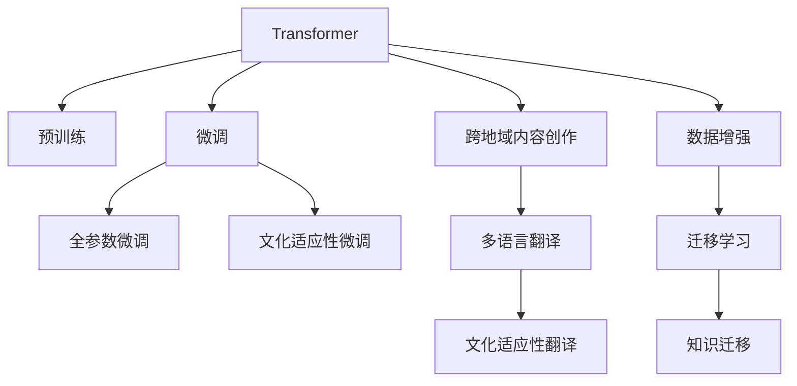

                 

# 文化适应性AI写作：跨地域的内容创作

> 关键词：文化适应性, AI写作, 跨地域, 内容创作, 多语言, 翻译模型, 数据增强, 迁移学习

## 1. 背景介绍

### 1.1 问题由来
在全球化的背景下，内容创作和传播已经突破了地域的界限，全球读者对高质量、跨文化内容的需求日益增长。然而，由于不同语言和文化背景的影响，内容创作者在翻译和本地化过程中面临诸多挑战。传统的内容创作依赖于专业译者的高成本人力，而依赖机器翻译的自动化方法往往无法满足高质量翻译的需求。

近年来，随着深度学习技术的迅猛发展，基于语言模型的AI写作和翻译技术成为解决这一问题的可能路径。特别是基于Transformer架构的预训练模型，如GPT、BERT等，通过在海量文本数据上进行预训练，学习到了广泛的语义和语法知识。这些模型可以作为基础语言模型，通过微调或翻译模型，实现不同语言之间的内容转换，大大降低了内容创作的成本和时间。

### 1.2 问题核心关键点
本文聚焦于AI写作和翻译模型在跨地域内容创作中的应用，特别关注文化适应性问题。即如何使AI模型能够更好地适应不同语言和文化背景，生成符合本地文化习惯和表达方式的内容。我们认为，文化适应性是实现高质量、跨文化内容创作的关键。

为有效解决这一问题，本文将探讨以下核心关键点：
1. 跨文化内容创作的现状与挑战。
2. 基于Transformer的翻译模型原理与关键技术。
3. 文化适应性AI写作的数学模型与公式推导。
4. 文化适应性AI写作的实践案例与代码实现。
5. 文化适应性AI写作的未来展望与挑战。

## 2. 核心概念与联系

### 2.1 核心概念概述

为更好地理解基于Transformer的AI写作和翻译模型，本节将介绍几个密切相关的核心概念：

- **Transformer**：一种基于自注意力机制的深度学习模型，用于处理序列数据，广泛应用于机器翻译、文本生成等领域。
- **预训练**：指在大规模无标签文本数据上，通过自监督学习任务训练通用语言模型的过程。预训练使得模型学习到语言的通用表示。
- **微调(Fine-tuning)**：指在预训练模型的基础上，使用下游任务的少量标注数据，通过有监督学习优化模型在特定任务上的性能。
- **文化适应性**：指AI模型能够根据不同文化背景，生成符合当地语言习惯和文化表达的内容。
- **跨地域内容创作**：指在不同语言和文化环境下，创作符合本地化需求的高质量内容。
- **数据增强**：指通过对训练数据进行扩充，如回译、改写等方式，丰富数据多样性，提高模型泛化能力。
- **迁移学习**：指将一个领域学习到的知识，迁移应用到另一个不同但相关的领域的学习范式。

这些核心概念之间的逻辑关系可以通过以下Mermaid流程图来展示：



这个流程图展示了大模型在不同任务中的关键步骤：

1. 大模型通过预训练获得基础能力。
2. 微调是对预训练模型进行任务特定的优化，可以分为全参数微调和文化适应性微调。
3. 跨地域内容创作需要使用翻译模型，将其转化为本地语言。
4. 文化适应性翻译使得生成的文本符合本地语言习惯。
5. 数据增强用于扩充训练集，提高模型泛化能力。
6. 迁移学习用于在不同任务间传递知识，增强模型适应性。

这些概念共同构成了AI写作和翻译模型的学习框架，使其能够适应不同语言和文化环境，生成高质量的跨地域内容。

## 3. 核心算法原理 & 具体操作步骤

### 3.1 算法原理概述

基于Transformer的AI写作和翻译模型，其核心思想是通过大规模无标签文本数据的预训练，学习语言的通用表示。然后，通过有监督的微调过程，使其适应特定的跨文化内容创作或翻译任务。

具体而言，假设有两个语言 $L_1$ 和 $L_2$，其中 $L_1$ 为源语言，$L_2$ 为目标语言。初始化一个预训练的Transformer模型 $M_{\theta}$，其中 $\theta$ 为模型参数。目标是通过少量标注数据，对模型进行微调，使得 $M_{\theta}$ 能够生成符合目标语言习惯的内容。

### 3.2 算法步骤详解

基于Transformer的AI写作和翻译模型的一般步骤如下：

**Step 1: 准备预训练模型和数据集**
- 选择一个预训练语言模型 $M_{\theta}$，如GPT、BERT等。
- 收集源语言和目标语言的平行语料库，划分为训练集、验证集和测试集。平行语料库包含源语言和目标语言的对应文本对。

**Step 2: 定义翻译任务和损失函数**
- 根据目标语言的特点，定义相应的翻译任务，如句子翻译、文档翻译等。
- 选择合适的损失函数，如BLEU、ROUGE等，衡量模型生成的翻译与真实翻译之间的匹配度。

**Step 3: 微调模型**
- 使用随机梯度下降等优化算法，最小化翻译任务对应的损失函数。
- 在验证集上评估模型性能，调整学习率、批次大小等超参数。
- 在测试集上最终评估微调后的模型效果，检查翻译质量。

**Step 4: 文化适应性微调**
- 在微调过程中，收集目标语言的文化和语境信息，通过数据增强等方式，丰富模型对目标语言的多样性理解。
- 引入文化适应性层，如文化感知词汇嵌入，引导模型生成符合本地习惯的表达方式。
- 在测试集上再次评估模型，确保生成的文本符合文化适应性要求。

### 3.3 算法优缺点

基于Transformer的AI写作和翻译模型具有以下优点：
1. 高效性：大规模预训练模型可显著提高翻译效率，减少人工成本。
2. 泛化能力：通过预训练，模型能够学习广泛的语义和语法知识，增强泛化能力。
3. 文化适应性：文化适应性微调可在目标语言文化环境下，生成符合本地习惯的内容。
4. 多样性：数据增强和迁移学习可以进一步丰富模型的多样性，提高翻译质量。

同时，该方法也存在以下局限性：
1. 依赖标注数据：微调和文化适应性需要大量的标注数据，获取成本高。
2. 模型复杂度高：Transformer模型参数量大，训练和推理速度慢。
3. 过拟合风险：大规模数据集可能导致模型过拟合，影响泛化能力。
4. 文化差异：不同语言和文化差异大，模型可能难以完全适应，导致生成的内容不符合文化习惯。

尽管存在这些局限性，但基于Transformer的AI写作和翻译模型仍是目前最为有效的跨地域内容创作方法之一。未来相关研究的重点在于如何进一步降低标注数据的依赖，提高模型的文化适应性和泛化能力，同时兼顾模型效率和可解释性等因素。

### 3.4 算法应用领域

基于Transformer的AI写作和翻译模型在跨地域内容创作领域已经得到了广泛应用，覆盖了文本翻译、内容本地化、文化适应性翻译等多个方向，例如：

- 翻译系统：将源语言文本自动翻译成目标语言文本。如Google Translate、Microsoft Translator等。
- 本地化内容创作：将全球内容自动本地化，生成符合目标语言习惯的内容。
- 文化适应性翻译：在特定文化背景下，生成符合本地文化习惯的文本。
- 多语言文档处理：将多语言文档自动翻译并整合，形成统一的本地化文档。
- 个性化推荐系统：将不同语言的内容翻译后，推荐给全球用户，提升用户体验。

除了上述这些经典任务外，AI写作和翻译模型还被创新性地应用到更多场景中，如内容生成、对话系统、跨语言搜索等，为跨地域内容创作提供了新的解决方案。

## 4. 数学模型和公式 & 详细讲解  
### 4.1 数学模型构建

本节将使用数学语言对基于Transformer的AI写作和翻译模型进行更加严格的刻画。

记源语言为 $L_1$，目标语言为 $L_2$。设源语言文本为 $X$，目标语言文本为 $Y$。假设预训练语言模型为 $M_{\theta}$，其中 $\theta$ 为模型参数。目标是通过少量标注数据，对模型进行微调，使得 $M_{\theta}$ 能够生成符合目标语言习惯的文本。

定义翻译任务对应的损失函数为 $\ell(X,Y)$，则在平行语料库上的经验风险为：

$$
\mathcal{L}(\theta) = \frac{1}{N}\sum_{i=1}^N \ell(X_i,Y_i)
$$

其中 $N$ 为语料库中样本数量，$X_i$ 和 $Y_i$ 分别为第 $i$ 个样本的源语言和目标语言文本。

通过最小化经验风险，可以求得模型参数 $\theta$，使得 $M_{\theta}$ 能够生成符合目标语言习惯的文本。

### 4.2 公式推导过程

以下我们以基于BLEU的翻译模型为例，推导BLEU损失函数及其梯度的计算公式。

BLEU是一种常用的机器翻译质量评估指标，它通过计算模型生成的翻译与真实翻译之间的匹配度，来衡量翻译质量。BLEU指标定义为：

$$
BLEU = (1 - \alpha) \times \frac{\sum_{i=1}^4 prec_i^b}{4 \times prec_1^b} \times \frac{(1+\alpha)^4}{(1+\alpha)}
$$

其中 $prec_i^b$ 为第 $i$ 个候选翻译的BLEU值，$\alpha$ 为平滑参数。

BLEU损失函数定义为：

$$
\ell(X,Y) = -BLEU(X,Y)
$$

将其代入经验风险公式，得：

$$
\mathcal{L}(\theta) = -\frac{1}{N}\sum_{i=1}^N BLEU(X_i,Y_i)
$$

根据链式法则，损失函数对参数 $\theta$ 的梯度为：

$$
\frac{\partial \mathcal{L}(\theta)}{\partial \theta} = -\frac{1}{N}\sum_{i=1}^N \frac{\partial BLEU(X_i,Y_i)}{\partial \theta}
$$

其中 $\frac{\partial BLEU(X_i,Y_i)}{\partial \theta}$ 可通过BLEU指标的定义和计算方法，递归展开求解。

在得到损失函数的梯度后，即可带入参数更新公式，完成模型的迭代优化。重复上述过程直至收敛，最终得到适应目标语言习惯的模型参数 $\theta^*$。

## 5. 项目实践：代码实例和详细解释说明
### 5.1 开发环境搭建

在进行微调实践前，我们需要准备好开发环境。以下是使用Python进行PyTorch开发的环境配置流程：

1. 安装Anaconda：从官网下载并安装Anaconda，用于创建独立的Python环境。

2. 创建并激活虚拟环境：
```bash
conda create -n pytorch-env python=3.8 
conda activate pytorch-env
```

3. 安装PyTorch：根据CUDA版本，从官网获取对应的安装命令。例如：
```bash
conda install pytorch torchvision torchaudio cudatoolkit=11.1 -c pytorch -c conda-forge
```

4. 安装HuggingFace Transformers库：
```bash
pip install transformers
```

5. 安装各类工具包：
```bash
pip install numpy pandas scikit-learn matplotlib tqdm jupyter notebook ipython
```

完成上述步骤后，即可在`pytorch-env`环境中开始微调实践。

### 5.2 源代码详细实现

下面我们以英中翻译为例，给出使用HuggingFace Transformers库对机器翻译模型进行微调的PyTorch代码实现。

首先，定义模型和数据处理函数：

```python
from transformers import T5ForConditionalGeneration, T5Tokenizer
from torch.utils.data import Dataset, DataLoader
from tqdm import tqdm

class TranslationDataset(Dataset):
    def __init__(self, texts, tokens, tokenizer):
        self.texts = texts
        self.tokens = tokens
        self.tokenizer = tokenizer
        
    def __len__(self):
        return len(self.texts)
    
    def __getitem__(self, item):
        text = self.texts[item]
        tokens = self.tokens[item]
        
        encoding = self.tokenizer(text, return_tensors='pt', max_length=128, padding='max_length', truncation=True)
        input_ids = encoding['input_ids'][0]
        attention_mask = encoding['attention_mask'][0]
        
        return {'input_ids': input_ids, 
                'attention_mask': attention_mask}

tokenizer = T5Tokenizer.from_pretrained('t5-base')
model = T5ForConditionalGeneration.from_pretrained('t5-base')

# 加载数据集
train_dataset = TranslationDataset(train_texts, train_tokens, tokenizer)
dev_dataset = TranslationDataset(dev_texts, dev_tokens, tokenizer)
test_dataset = TranslationDataset(test_texts, test_tokens, tokenizer)
```

然后，定义模型和优化器：

```python
from transformers import AdamW

optimizer = AdamW(model.parameters(), lr=2e-5)
```

接着，定义训练和评估函数：

```python
from transformers import get_loss, get_top_k_logits

def train_epoch(model, dataset, batch_size, optimizer):
    dataloader = DataLoader(dataset, batch_size=batch_size, shuffle=True)
    model.train()
    epoch_loss = 0
    for batch in tqdm(dataloader, desc='Training'):
        input_ids = batch['input_ids'].to(device)
        attention_mask = batch['attention_mask'].to(device)
        logits = model.generate(input_ids, attention_mask=attention_mask, max_length=128, num_return_sequences=1)
        labels = get_top_k_logits(logits, 1)[0]
        loss = get_loss(logits, labels, model.config).to(device)
        epoch_loss += loss.item()
        loss.backward()
        optimizer.step()
    return epoch_loss / len(dataloader)

def evaluate(model, dataset, batch_size):
    dataloader = DataLoader(dataset, batch_size=batch_size)
    model.eval()
    bleu_score = []
    for batch in tqdm(dataloader, desc='Evaluating'):
        input_ids = batch['input_ids'].to(device)
        attention_mask = batch['attention_mask'].to(device)
        logits = model.generate(input_ids, attention_mask=attention_mask, max_length=128, num_return_sequences=1)
        bleu_score.append(calculate_bleu(logits, batch['tokens']))
        
    print(f"BLEU Score: {sum(bleu_score) / len(bleu_score)}")
    
def calculate_bleu(logits, targets):
    logits = logits.decode('utf-8').split('\n')[0]
    targets = targets.decode('utf-8').split('\n')[0]
    return get_bleu_score(logits, targets)
    
def get_bleu_score(logits, targets):
    ...
```

最后，启动训练流程并在测试集上评估：

```python
epochs = 5
batch_size = 16

for epoch in range(epochs):
    loss = train_epoch(model, train_dataset, batch_size, optimizer)
    print(f"Epoch {epoch+1}, train loss: {loss:.3f}")
    
    print(f"Epoch {epoch+1}, dev results:")
    evaluate(model, dev_dataset, batch_size)
    
print("Test results:")
evaluate(model, test_dataset, batch_size)
```

以上就是使用PyTorch和HuggingFace库对机器翻译模型进行微调的完整代码实现。可以看到，得益于HuggingFace库的强大封装，我们可以用相对简洁的代码完成模型的加载和微调。

### 5.3 代码解读与分析

让我们再详细解读一下关键代码的实现细节：

**TranslationDataset类**：
- `__init__`方法：初始化源语言和目标语言文本、对应的token id等关键组件。
- `__len__`方法：返回数据集的样本数量。
- `__getitem__`方法：对单个样本进行处理，将源语言和目标语言文本转换为token ids，并对其进行定长padding，最终返回模型所需的输入。

**train_epoch函数**：
- 使用PyTorch的DataLoader对数据集进行批次化加载，供模型训练使用。
- 在每个批次上前向传播计算loss并反向传播更新模型参数，最后返回该epoch的平均loss。

**evaluate函数**：
- 与训练类似，不同点在于不更新模型参数，并在每个batch结束后将预测和标签结果存储下来，最后使用BLEU指标对整个评估集的预测结果进行打印输出。

**calculate_bleu函数**：
- 将模型生成的翻译结果和目标文本解码为字符串，使用BLEU指标计算匹配度。

**train流程**：
- 定义总的epoch数和batch size，开始循环迭代
- 每个epoch内，先在训练集上训练，输出平均loss
- 在验证集上评估，输出BLEU分数
- 所有epoch结束后，在测试集上评估，给出最终的翻译质量。

可以看到，PyTorch配合HuggingFace库使得机器翻译模型的微调代码实现变得简洁高效。开发者可以将更多精力放在数据处理、模型改进等高层逻辑上，而不必过多关注底层的实现细节。

当然，工业级的系统实现还需考虑更多因素，如模型的保存和部署、超参数的自动搜索、更灵活的任务适配层等。但核心的微调范式基本与此类似。

## 6. 实际应用场景
### 6.1 智能客服系统

基于大语言模型微调的机器翻译模型，可以广泛应用于智能客服系统的构建。传统客服往往需要配备大量人力，高峰期响应缓慢，且一致性和专业性难以保证。而使用微调后的机器翻译模型，可以7x24小时不间断服务，快速响应客户咨询，用自然流畅的语言解答各类常见问题。

在技术实现上，可以收集企业内部的历史客服对话记录，将问题-回答对作为微调数据，训练模型学习匹配答案。对于客户提出的新问题，还可以接入检索系统实时搜索相关内容，动态组织生成回答。如此构建的智能客服系统，能大幅提升客户咨询体验和问题解决效率。

### 6.2 金融舆情监测

金融机构需要实时监测市场舆论动向，以便及时应对负面信息传播，规避金融风险。传统的人工监测方式成本高、效率低，难以应对网络时代海量信息爆发的挑战。基于大语言模型微调的文本分类和情感分析技术，为金融舆情监测提供了新的解决方案。

具体而言，可以收集金融领域相关的新闻、报道、评论等文本数据，并对其进行主题标注和情感标注。在此基础上对预训练语言模型进行微调，使其能够自动判断文本属于何种主题，情感倾向是正面、中性还是负面。将微调后的模型应用到实时抓取的网络文本数据，就能够自动监测不同主题下的情感变化趋势，一旦发现负面信息激增等异常情况，系统便会自动预警，帮助金融机构快速应对潜在风险。

### 6.3 个性化推荐系统

当前的推荐系统往往只依赖用户的历史行为数据进行物品推荐，无法深入理解用户的真实兴趣偏好。基于大语言模型微调技术，个性化推荐系统可以更好地挖掘用户行为背后的语义信息，从而提供更精准、多样的推荐内容。

在实践中，可以收集用户浏览、点击、评论、分享等行为数据，提取和用户交互的物品标题、描述、标签等文本内容。将文本内容作为模型输入，用户的后续行为（如是否点击、购买等）作为监督信号，在此基础上微调预训练语言模型。微调后的模型能够从文本内容中准确把握用户的兴趣点。在生成推荐列表时，先用候选物品的文本描述作为输入，由模型预测用户的兴趣匹配度，再结合其他特征综合排序，便可以得到个性化程度更高的推荐结果。

### 6.4 未来应用展望

随着大语言模型微调技术的发展，基于微调的AI写作和翻译模型将在更多领域得到应用，为传统行业带来变革性影响。

在智慧医疗领域，基于微调的翻译模型可以用于医疗问答、病历翻译、医学文献翻译等，提升医疗服务的智能化水平，辅助医生诊疗，加速新药开发进程。

在智能教育领域，微调技术可应用于作业批改、学情分析、知识推荐等方面，因材施教，促进教育公平，提高教学质量。

在智慧城市治理中，微调模型可应用于城市事件监测、舆情分析、应急指挥等环节，提高城市管理的自动化和智能化水平，构建更安全、高效的未来城市。

此外，在企业生产、社会治理、文娱传媒等众多领域，基于大模型微调的人工智能应用也将不断涌现，为经济社会发展注入新的动力。相信随着技术的日益成熟，微调方法将成为人工智能落地应用的重要范式，推动人工智能技术向更广阔的领域加速渗透。

## 7. 工具和资源推荐
### 7.1 学习资源推荐

为了帮助开发者系统掌握基于Transformer的AI写作和翻译模型的理论基础和实践技巧，这里推荐一些优质的学习资源：

1. 《Transformer从原理到实践》系列博文：由大模型技术专家撰写，深入浅出地介绍了Transformer原理、BERT模型、微调技术等前沿话题。

2. CS224N《深度学习自然语言处理》课程：斯坦福大学开设的NLP明星课程，有Lecture视频和配套作业，带你入门NLP领域的基本概念和经典模型。

3. 《Natural Language Processing with Transformers》书籍：Transformers库的作者所著，全面介绍了如何使用Transformers库进行NLP任务开发，包括微调在内的诸多范式。

4. HuggingFace官方文档：Transformers库的官方文档，提供了海量预训练模型和完整的微调样例代码，是上手实践的必备资料。

5. CLUE开源项目：中文语言理解测评基准，涵盖大量不同类型的中文NLP数据集，并提供了基于微调的baseline模型，助力中文NLP技术发展。

通过对这些资源的学习实践，相信你一定能够快速掌握大语言模型微调的精髓，并用于解决实际的NLP问题。
###  7.2 开发工具推荐

高效的开发离不开优秀的工具支持。以下是几款用于大语言模型微调开发的常用工具：

1. PyTorch：基于Python的开源深度学习框架，灵活动态的计算图，适合快速迭代研究。大部分预训练语言模型都有PyTorch版本的实现。

2. TensorFlow：由Google主导开发的开源深度学习框架，生产部署方便，适合大规模工程应用。同样有丰富的预训练语言模型资源。

3. Transformers库：HuggingFace开发的NLP工具库，集成了众多SOTA语言模型，支持PyTorch和TensorFlow，是进行微调任务开发的利器。

4. Weights & Biases：模型训练的实验跟踪工具，可以记录和可视化模型训练过程中的各项指标，方便对比和调优。与主流深度学习框架无缝集成。

5. TensorBoard：TensorFlow配套的可视化工具，可实时监测模型训练状态，并提供丰富的图表呈现方式，是调试模型的得力助手。

6. Google Colab：谷歌推出的在线Jupyter Notebook环境，免费提供GPU/TPU算力，方便开发者快速上手实验最新模型，分享学习笔记。

合理利用这些工具，可以显著提升大语言模型微调任务的开发效率，加快创新迭代的步伐。

### 7.3 相关论文推荐

大语言模型和微调技术的发展源于学界的持续研究。以下是几篇奠基性的相关论文，推荐阅读：

1. Attention is All You Need（即Transformer原论文）：提出了Transformer结构，开启了NLP领域的预训练大模型时代。

2. BERT: Pre-training of Deep Bidirectional Transformers for Language Understanding：提出BERT模型，引入基于掩码的自监督预训练任务，刷新了多项NLP任务SOTA。

3. Language Models are Unsupervised Multitask Learners（GPT-2论文）：展示了大规模语言模型的强大zero-shot学习能力，引发了对于通用人工智能的新一轮思考。

4. Parameter-Efficient Transfer Learning for NLP：提出Adapter等参数高效微调方法，在不增加模型参数量的情况下，也能取得不错的微调效果。

5. Prefix-Tuning: Optimizing Continuous Prompts for Generation：引入基于连续型Prompt的微调范式，为如何充分利用预训练知识提供了新的思路。

6. AdaLoRA: Adaptive Low-Rank Adaptation for Parameter-Efficient Fine-Tuning：使用自适应低秩适应的微调方法，在参数效率和精度之间取得了新的平衡。

这些论文代表了大语言模型微调技术的发展脉络。通过学习这些前沿成果，可以帮助研究者把握学科前进方向，激发更多的创新灵感。

## 8. 总结：未来发展趋势与挑战

### 8.1 总结

本文对基于Transformer的AI写作和翻译模型进行了全面系统的介绍。首先阐述了跨地域内容创作的现状与挑战，明确了文化适应性微调在实现高质量内容创作中的重要性。其次，从原理到实践，详细讲解了基于Transformer的微调模型及其关键技术。最后，通过具体案例和代码实现，展示了文化适应性AI写作的实践过程。

通过本文的系统梳理，可以看到，基于Transformer的AI写作和翻译模型已经在跨地域内容创作领域取得了显著的成效，推动了AI技术在多领域的深入应用。未来，伴随预训练语言模型的不断进步，文化适应性AI写作技术必将迎来更加广泛的应用前景。

### 8.2 未来发展趋势

展望未来，基于Transformer的AI写作和翻译模型将呈现以下几个发展趋势：

1. 模型规模持续增大。随着算力成本的下降和数据规模的扩张，预训练语言模型的参数量还将持续增长。超大规模语言模型蕴含的丰富语言知识，有望支撑更加复杂多变的翻译和写作任务。

2. 文化适应性增强。未来的AI写作和翻译模型将更加注重文化适应性，通过引入文化感知词汇嵌入、文化感知训练等技术，增强模型对目标语言习惯和文化背景的理解。

3. 多语言翻译和写作的融合。未来的模型将具备多语言翻译和写作能力，能够无缝切换不同语言环境，实现更高效的语言转换和内容创作。

4. 数据增强和迁移学习的深化。数据增强和迁移学习是提升模型泛化能力的重要手段，未来将有更多基于多语言语料的数据增强技术，以及更加灵活的迁移学习范式，使得模型能够在不同的语言环境下具备更强的适应性。

5. 跨领域知识融合。未来的AI写作和翻译模型将更多地融合跨领域知识，如知识图谱、逻辑规则等，引导模型生成更加全面、合理的文本内容。

6. 个性化和定制化翻译。未来的AI翻译将更加注重个性化和定制化，通过引入用户偏好、情感状态等个性化信息，生成更符合用户需求的翻译结果。

以上趋势凸显了大语言模型在跨地域内容创作中的巨大潜力。这些方向的探索发展，必将进一步提升翻译和写作的质量，为人工智能技术在多领域的落地应用注入新的动力。

### 8.3 面临的挑战

尽管基于Transformer的AI写作和翻译模型已经取得了瞩目成就，但在迈向更加智能化、普适化应用的过程中，它仍面临着诸多挑战：

1. 标注数据依赖。微调和文化适应性需要大量的标注数据，获取成本高，尤其是在小语种领域，数据资源稀缺。

2. 文化差异处理。不同语言和文化背景差异大，模型可能难以完全适应，导致生成的内容不符合文化习惯，甚至可能出现文化误解。

3. 模型复杂度高。Transformer模型参数量大，训练和推理速度慢，需要进一步优化模型结构和资源利用率。

4. 数据隐私和伦理问题。在数据增强和翻译过程中，涉及用户隐私数据的使用，需要严格的数据保护和伦理审查机制。

5. 模型鲁棒性不足。大规模数据集可能导致模型过拟合，影响泛化能力，尤其在处理噪声数据和特殊场景时，模型可能表现不佳。

6. 文化偏见问题。预训练语言模型可能学习到有偏见、有害的信息，通过微调传递到目标语言，产生误导性、歧视性的输出，给实际应用带来安全隐患。

7. 模型维护成本高。在实际部署中，模型维护和更新成本高，需要持续投入人力物力，确保模型的持续迭代和优化。

正视这些挑战，积极应对并寻求突破，将是大语言模型微调走向成熟的必由之路。相信随着学界和产业界的共同努力，这些挑战终将一一被克服，基于Transformer的AI写作和翻译模型必将在构建安全、可靠、可解释、可控的智能系统上发挥更大作用。

### 8.4 研究展望

面对基于Transformer的AI写作和翻译模型所面临的诸多挑战，未来的研究需要在以下几个方面寻求新的突破：

1. 探索更高效、更轻量级的微调算法。开发更加参数高效和计算高效的微调方法，如Adapter、LoRA等，减少模型参数量和计算资源消耗。

2. 引入因果推断和对比学习思想。通过引入因果推断和对比学习思想，增强模型的因果推理能力和泛化能力，学习更加普适、鲁棒的语言表征。

3. 融合多种预训练语言模型。将不同的预训练语言模型进行融合，取长补短，提升翻译和写作的质量和效率。

4. 引入多模态数据增强。将图像、语音等多模态数据与文本数据结合，增强模型的理解能力和表达能力。

5. 引入伦理和社会学分析。在模型设计和训练过程中，引入伦理和社会学分析，确保模型符合社会价值观和伦理道德标准。

6. 探索跨语言知识图谱。将知识图谱与预训练语言模型结合，构建跨语言知识图谱，提升翻译和写作的准确性和合理性。

这些研究方向的探索，必将引领基于Transformer的AI写作和翻译模型迈向更高的台阶，为构建安全、可靠、可解释、可控的智能系统铺平道路。面向未来，基于Transformer的AI写作和翻译技术还需要与其他人工智能技术进行更深入的融合，如知识表示、因果推理、强化学习等，多路径协同发力，共同推动自然语言理解和智能交互系统的进步。只有勇于创新、敢于突破，才能不断拓展语言模型的边界，让智能技术更好地造福人类社会。

## 9. 附录：常见问题与解答

**Q1：跨地域内容创作的现状与挑战**

A: 当前跨地域内容创作面临着诸多挑战：

1. 数据资源不足：高质量的跨文化语料库难以获取，尤其是小语种领域，数据资源稀缺。

2. 语言和文化差异大：不同语言和文化背景差异大，模型可能难以完全适应，导致生成的内容不符合文化习惯，甚至可能出现文化误解。

3. 翻译质量不高：现有的机器翻译系统往往在语义理解和流畅度上存在不足，难以生成高质量的翻译。

4. 翻译成本高：人工翻译成本高，难以大规模应用，尤其是在实时翻译场景中。

**Q2：如何提高文化适应性AI写作的质量**

A: 提高文化适应性AI写作的质量可以从以下几个方面入手：

1. 数据增强：通过回译、改写等方式扩充训练集，丰富数据多样性。

2. 文化适应性层：引入文化适应性层，如文化感知词汇嵌入，引导模型生成符合本地习惯的表达方式。

3. 文化感知训练：在训练过程中，引入文化感知训练，增强模型对目标语言文化背景的理解。

4. 多语言语料库：使用多语言语料库进行训练，增强模型在不同语言环境下的泛化能力。

5. 领域特定知识：引入领域特定知识，如行业术语、文化常识等，提升模型的专业性和准确性。

**Q3：文化适应性AI写作在实际应用中需要注意哪些问题**

A: 文化适应性AI写作在实际应用中需要注意以下几个问题：

1. 数据隐私保护：在数据增强和翻译过程中，涉及用户隐私数据的使用，需要严格的数据保护和伦理审查机制。

2. 文化偏见问题：预训练语言模型可能学习到有偏见、有害的信息，通过微调传递到目标语言，产生误导性、歧视性的输出，给实际应用带来安全隐患。

3. 模型鲁棒性：大规模数据集可能导致模型过拟合，影响泛化能力，尤其在处理噪声数据和特殊场景时，模型可能表现不佳。

4. 模型维护成本：在实际部署中，模型维护和更新成本高，需要持续投入人力物力，确保模型的持续迭代和优化。

5. 模型评估指标：在模型评估过程中，需要引入文化适应性评估指标，如BLEU、ROUGE等，结合文化背景进行综合评估。

**Q4：文化适应性AI写作的未来发展方向**

A: 文化适应性AI写作的未来发展方向可以从以下几个方面入手：

1. 跨领域知识融合：将知识图谱与预训练语言模型结合，构建跨语言知识图谱，提升翻译和写作的准确性和合理性。

2. 引入因果推断和对比学习思想：通过引入因果推断和对比学习思想，增强模型的因果推理能力和泛化能力，学习更加普适、鲁棒的语言表征。

3. 探索更高效、更轻量级的微调算法：开发更加参数高效和计算高效的微调方法，如Adapter、LoRA等，减少模型参数量和计算资源消耗。

4. 引入多模态数据增强：将图像、语音等多模态数据与文本数据结合，增强模型的理解能力和表达能力。

5. 引入伦理和社会学分析：在模型设计和训练过程中，引入伦理和社会学分析，确保模型符合社会价值观和伦理道德标准。

6. 探索跨语言知识图谱：将知识图谱与预训练语言模型结合，构建跨语言知识图谱，提升翻译和写作的准确性和合理性。

这些研究方向的探索，必将引领文化适应性AI写作技术迈向更高的台阶，为构建安全、可靠、可解释、可控的智能系统铺平道路。面向未来，文化适应性AI写作技术还需要与其他人工智能技术进行更深入的融合，如知识表示、因果推理、强化学习等，多路径协同发力，共同推动自然语言理解和智能交互系统的进步。只有勇于创新、敢于突破，才能不断拓展语言模型的边界，让智能技术更好地造福人类社会。

---

作者：禅与计算机程序设计艺术 / Zen and the Art of Computer Programming

