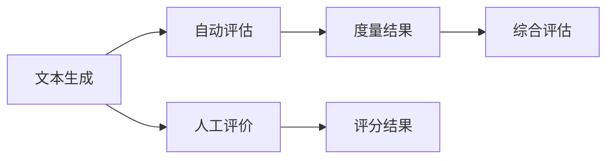

                 

# 文本生成质量评估：自动度量与人工评价

> 关键词：文本生成, 自动度量, 人工评价, 模型评估, 生成质量

## 1. 背景介绍

随着人工智能技术的发展，自然语言生成(NLG)在各行各业中得到了广泛应用。从机器翻译、智能客服、智能写作到游戏对话，NLG技术都在不断提升着人类生活和工作质量。然而，尽管NLG系统可以自动生成文本，但其生成文本的质量和可读性仍是一个关键挑战。

在评估NLG系统生成的文本质量时，我们需要一种既高效又客观的方法，能够量化生成文本与理想文本之间的差距。传统的评估方法依赖于人工评分，但人工评分不仅耗时耗力，且难以避免主观偏见。

近年来，随着深度学习技术的发展，自动评估方法应运而生，成为评估NLG系统生成质量的重要工具。本文将详细介绍自动评估和人工评价两种文本生成质量评估方法，并探讨其应用场景和未来发展方向。

## 2. 核心概念与联系

### 2.1 核心概念概述

在深入讨论文本生成质量评估方法之前，我们先介绍几个关键概念：

- **文本生成**：指使用语言模型自动生成具有一定语义连贯性的文本。常见的文本生成模型包括GPT、BERT、T5等。
- **自动评估**：指使用计算机程序自动度量文本生成的质量，评估指标通常基于语言学和统计学方法。
- **人工评价**：指由人类专家或用户对文本生成的质量进行评分，通常使用主观指标如连贯性、流畅性、准确性等。

这三种方法各有优缺点，其联系在于都是评估NLG系统生成文本质量的必要手段。自动评估可以提供量化指标，但难以涵盖生成文本的主观属性；人工评价能够提供全面反馈，但受评估者主观性和可靠性的限制。将自动评估与人工评价相结合，可以最大限度地提升评估结果的准确性和可靠性。

### 2.2 核心概念原理和架构的 Mermaid 流程图(Mermaid 流程节点中不要有括号、逗号等特殊字符)


## 3. 核心算法原理 & 具体操作步骤

### 3.1 算法原理概述

文本生成质量评估的自动度量方法通常基于以下假设：
- 生成文本的质量可以通过特定的语言学特征和统计学指标来量化。
- 使用统计方法可以计算生成文本与理想文本之间的差异。

常见的自动评估指标包括BLEU、ROUGE、METEOR、TER等。这些指标通过比较生成文本与标准文本之间的相似度，量化生成文本的质量。

### 3.2 算法步骤详解

**Step 1: 选择评估指标**
根据具体任务和评估需求，选择合适的自动评估指标。例如，对于翻译任务，BLEU和ROUGE都是常用的评估指标；对于摘要生成任务，METEOR和TER更为合适。

**Step 2: 计算评估指标**
使用预训练的NLP模型和自动评估工具，计算生成文本与标准文本之间的相似度，并根据定义好的评估指标，计算生成文本的质量分数。

**Step 3: 数据预处理**
处理输入数据，使其适合自动评估。例如，去除噪声、统一格式、分词、词性标注等。

**Step 4: 评估结果分析**
对比生成文本和标准文本的评估分数，分析差异原因，如用词不当、语法错误、语义不连贯等。

**Step 5: 人工评价**
人工评价与自动评估结合进行，使用人工评分对自动评估结果进行修正和补充，提升评估结果的全面性和可靠性。

### 3.3 算法优缺点

自动评估方法具有以下优点：
- 效率高：可以自动化地评估大量文本，显著降低人工评分的工作量。
- 量化准确：提供量化指标，易于比较不同系统的性能。

同时，自动评估方法也存在以下缺点：
- 主观性：评估指标和阈值的设置可能具有主观性。
- 泛化能力有限：对于一些复杂的语境和语义，自动评估难以全面覆盖。

### 3.4 算法应用领域

自动评估方法广泛应用于机器翻译、对话系统、文本摘要、智能写作等NLP任务中。例如，在机器翻译中，BLEU和ROUGE被广泛用于评估翻译质量；在对话系统中，LIMA和Dialogue-ADH可评估对话系统的生成文本与用户反馈的契合度。

## 4. 数学模型和公式 & 详细讲解 & 举例说明

### 4.1 数学模型构建

以BLEU为例，BLEU评估机器翻译质量的数学模型定义如下：

设$T$为标准文本，$G$为生成文本，$n$为评估指标中的最大长度。BLEU的定义为：

$$BLEU = \max(1, \frac{\sum_{i=1}^{n} min(1, \frac{c_i}{l_i} + \alpha \cdot e^{NPL_i}))}{\sum_{i=1}^{n} min(1, \frac{c_i}{l_i})}$$

其中，$c_i$为$G$和$T$的第$i$个单词在$G$中的出现次数；$l_i$为$G$和$T$的第$i$个单词在$G$中的长度；$NPL_i$为$G$和$T$的第$i$个单词的Bleu Precision Length (BPL)；$\alpha$为BPL的权重。

### 4.2 公式推导过程

首先，计算生成文本与标准文本的BLEU分数。BLEU分数可以通过比较生成文本和标准文本的前$n$个单词，计算它们的匹配率、BPL、以及Bleu Precision和Bleu Precision Length。

$$BLEU_i = \frac{c_i}{l_i} + \alpha \cdot e^{NPL_i}$$

其中，$NPL_i = \min(1, \frac{c_i}{l_i})$，表示匹配率与单词长度的乘积。

然后，根据计算出的BLEU分数，得到最终的BLEU值：

$$BLEU = \max(1, \frac{\sum_{i=1}^{n} BLEU_i}{\sum_{i=1}^{n} min(1, \frac{c_i}{l_i})})$$

### 4.3 案例分析与讲解

以一个简单的机器翻译任务为例，假设标准文本为"Hello, how are you?"，生成文本为"Hola, ¿cómo estás?"。

首先，计算生成文本与标准文本的BLEU分数。根据定义，$c_1=2, l_1=5$，因此$BLEU_1 = \frac{2}{5} + \alpha \cdot e^{NPL_1}$。对于单词"Hello"，匹配率为1，单词长度为5，BPL为1，因此$BLEU_1 = 0.4 + \alpha \cdot e^{1}$。

假设$\alpha = 0.2$，则$BLEU_1 = 0.4 + 0.2 \cdot e^{1}$。

对于单词"how"和"are"，匹配率均为0，BPL均为0，因此$BLEU_2 = \alpha \cdot e^{0}$和$BLEU_3 = \alpha \cdot e^{0}$。

最终，计算BLEU值为：

$$BLEU = \max(1, \frac{0.4 + 0.2 \cdot e^{1} + 0.2 \cdot e^{0} + 0.2 \cdot e^{0}}{1}) = 1.22$$

该值表示生成文本与标准文本的相似度。

## 5. 项目实践：代码实例和详细解释说明

### 5.1 开发环境搭建

要使用自动评估工具，需要安装Python及相关库。以下是具体步骤：

1. 安装Python：
```bash
sudo apt-get update
sudo apt-get install python3
```

2. 安装相关库：
```bash
pip install sacrebleu
```

3. 准备数据集：
```bash
mkdir datasets
cd datasets
wget http://www.thespeller.org/bpe/data/bpe.tgz
tar -xvf bpe.tgz
```

### 5.2 源代码详细实现

下面以BLEU评估为例，展示代码实现。

首先，导入必要的库：

```python
from sacrebleu import corpus_bleu
import numpy as np
```

然后，定义评估函数：

```python
def bleu_evaluate(reference_corpus, hypothesis_corpus):
    hypotheses, references = [], []
    for ref, hyp in zip(reference_corpus, hypothesis_corpus):
        hypotheses.append(ref.split())
        references.append(hyp.split())
    bleu = corpus_bleu(candidates=hypotheses, references=references)
    return bleu.score
```

接着，准备评估数据：

```python
reference_corpus = ["Hello, how are you?", "You are fine, thank you!", "How do you do?"]
hypothesis_corpus = ["Hola, ¿cómo estás?", "You are good, thank you.", "How are you?"]
```

最后，调用评估函数：

```python
bleu_score = bleu_evaluate(reference_corpus, hypothesis_corpus)
print(f"BLEU score: {bleu_score}")
```

### 5.3 代码解读与分析

上述代码展示了BLEU评估函数的使用方法。首先，将参考文本和生成文本转换为单词列表，然后调用`sacrebleu`库中的`corpus_bleu`函数计算BLEU分数。函数返回的结果是一个BLEU对象，通过调用`score`方法，可以得到具体的BLEU分数。

通过该代码，可以简单地计算出两个文本之间的BLEU分数，评估其相似度。

## 6. 实际应用场景

### 6.1 智能客服

在智能客服系统中，自动评估方法可以实时监测客户对话质量，并根据评估结果优化客服策略。例如，对于服务质量低下的客服，系统可以通过分析对话中的BLEU分数，找出问题所在，并进行改进。

### 6.2 机器翻译

在机器翻译任务中，自动评估方法可以用于评估不同模型的性能，指导模型优化。例如，可以使用BLEU评估模型生成的文本与标准翻译的相似度，从而选择最优的模型进行部署。

### 6.3 文本摘要

在文本摘要任务中，自动评估方法可以用于评估摘要生成的连贯性和相关性。例如，可以使用ROUGE评估摘要与原文的匹配度，找出需要改进的部分。

### 6.4 未来应用展望

未来，自动评估方法将继续在NLG系统的质量控制和优化中发挥重要作用。随着技术的不断发展，自动评估方法将更加智能和精准，能够更好地衡量生成文本的质量和语义一致性。

## 7. 工具和资源推荐

### 7.1 学习资源推荐

- 《深度学习与自然语言处理》：这是一本涵盖深度学习、自然语言处理、文本生成等主题的全面教材，适合初学者和进阶读者。
- 《自然语言处理综述》：由多位NLP专家联合编写的综述文章，介绍了NLP领域的主要方法和应用。
- 《NLG技术手册》：详细介绍了NLG技术的最新进展和应用案例，是实践和研究的重要参考资料。

### 7.2 开发工具推荐

- Python：Python语言简单易学，是NLP领域的主要编程语言之一。
- Transformers库：HuggingFace开发的NLP库，提供了预训练模型和自动评估工具。
- TensorFlow和PyTorch：深度学习框架，支持模型训练和优化。

### 7.3 相关论文推荐

- "BLEU: A Method for Automatic Evaluation of Machine Translation"：BLEU算法的发源论文，详细介绍了BLEU评估指标的设计和应用。
- "ROUGE: A Method for Automatic Summarization Evaluation"：ROUGE算法的发源论文，详细介绍了ROUGE评估指标的设计和应用。
- "Evaluating the Translation Quality of an NMT System by Comparison with Human Translations"：详细介绍了多种自动评估方法的比较和选择。

## 8. 总结：未来发展趋势与挑战

### 8.1 研究成果总结

自动评估方法在NLP系统中已经得到了广泛应用，显著提升了系统性能和用户体验。通过与人工评价的结合，自动评估方法可以提供更加全面和客观的反馈，促进系统的持续优化。

### 8.2 未来发展趋势

未来，自动评估方法将继续向着智能化、精准化方向发展，具备更加灵活的评估指标和更强的泛化能力。同时，自动评估方法将与其他NLP技术结合，形成更加完整的评估体系，支持更加复杂的NLP应用。

### 8.3 面临的挑战

尽管自动评估方法在NLP系统中的应用已经取得了显著进展，但仍面临一些挑战：

- 复杂语境评估：对于一些具有复杂语境的文本，自动评估方法难以全面覆盖。
- 语言多样性：不同语言之间的自动评估指标可能存在差异，需要针对不同语言设计合适的评估方法。
- 数据依赖性：自动评估方法依赖于大量的标注数据，获取高质量标注数据成本较高。

### 8.4 研究展望

未来的研究方向包括：
- 设计新的自动评估指标：针对特定任务和应用场景，设计更加精准和全面的评估指标。
- 引入更多语言学知识：将语言学知识与自动评估方法结合，提升评估结果的全面性和可靠性。
- 跨语言评估：设计跨语言的自动评估方法，支持多语言的文本生成质量评估。
- 应用多种评估方法：结合人工评价和自动评估，综合多角度评估结果，提升评估结果的全面性和可靠性。

## 9. 附录：常见问题与解答

**Q1：自动评估方法是否适用于所有NLP任务？**

A: 自动评估方法适用于大多数NLP任务，但在一些特定任务中，可能需要结合人工评价或定制化指标。例如，对于对话系统，除了BLEU和ROUGE，还需要考虑对话的流畅性和合理性。

**Q2：自动评估方法能否替代人工评价？**

A: 自动评估方法不能完全替代人工评价，但可以作为人工评价的辅助工具，提供量化指标和初步反馈。人工评价可以弥补自动评估方法的不足，提供全面和细致的评估。

**Q3：自动评估指标如何选择？**

A: 选择自动评估指标时，需要根据具体任务和应用场景，选择适合的指标。例如，对于机器翻译任务，BLEU和ROUGE是常用的指标；对于对话系统，LIMA和Dialogue-ADH更为合适。

**Q4：如何处理多语言文本的自动评估？**

A: 处理多语言文本的自动评估时，需要考虑不同语言之间的差异，选择适合的语言模型和评估指标。可以采用跨语言的评估方法，如使用多语言BERT模型进行评估。

---

作者：禅与计算机程序设计艺术 / Zen and the Art of Computer Programming

