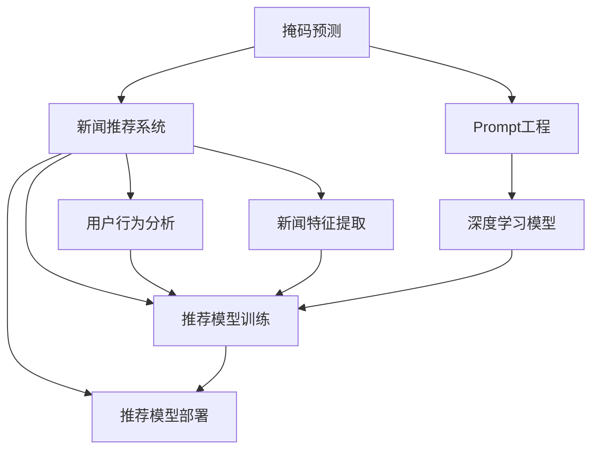

                 

# 新闻推荐的创新技术应用：掩码预测与Prompt工程实践

> 关键词：新闻推荐, 掩码预测, Prompt工程, 自然语言处理, 深度学习

## 1. 背景介绍

随着互联网的飞速发展，用户对新闻信息的获取方式从传统的搜索和浏览逐渐转向个性化推荐。新闻推荐系统通过算法为用户推荐符合其兴趣爱好的新闻，使用户在信息爆炸的时代能迅速获取有价值的新闻内容。传统的基于规则的新闻推荐系统难以处理海量、复杂的新闻内容，而基于深度学习的推荐系统则可以通过对用户行为和新闻特征的深入分析，实现更精准的新闻推荐。

在深度学习领域，自然语言处理(NLP)技术已经成为新闻推荐系统中不可或缺的一部分。NLP技术不仅能够处理自然语言文本，还能够对新闻内容的语义和结构进行分析，从而提升新闻推荐的准确性和个性化程度。本文将详细介绍一种基于掩码预测和Prompt工程的创新新闻推荐技术，探讨其核心原理和实践细节，展示其在实际应用中的优势和挑战。

## 2. 核心概念与联系

### 2.1 核心概念概述

为更好地理解本文介绍的新闻推荐技术，本节将介绍几个密切相关的核心概念：

- **掩码预测(Masked Prediction)**：掩码预测是一种深度学习技术，通过随机遮盖输入文本中的一部分词汇，然后让模型预测被遮盖部分的词汇或短语。这种方法可以训练模型在理解文本上下文的基础上，预测缺失的词汇或短语，从而提升模型的语言建模能力。

- **Prompt工程**：Prompt工程是指在深度学习模型中进行输入文本格式的设计，通过精心设计输入文本，引导模型输出期望的结果。Prompt工程在自然语言生成、文本分类、文本摘要等任务中均有广泛应用。

- **掩码预测与Prompt工程的结合**：本文介绍的新闻推荐技术通过掩码预测和Prompt工程的结合，构建一种新的新闻推荐模型。该模型能够根据用户的历史行为和兴趣，生成包含多种新闻标题的Prompt，并通过预测每个标题中缺失的词汇或短语，得到与用户兴趣最匹配的新闻推荐。

- **新闻推荐系统**：新闻推荐系统通过分析用户的历史行为和兴趣，为用户推荐符合其需求的新闻内容。传统的基于规则的新闻推荐系统难以处理海量、复杂的新闻内容，而基于深度学习的推荐系统则可以通过对用户行为和新闻特征的深入分析，实现更精准的新闻推荐。

这些核心概念之间的逻辑关系可以通过以下Mermaid流程图来展示：



这个流程图展示了大语言模型的核心概念及其之间的关系：

1. 掩码预测技术用于训练深度学习模型，提升其语言建模能力。
2. Prompt工程用于设计输入文本的格式，引导模型输出期望的结果。
3. 新闻推荐系统通过用户行为分析和新闻特征提取，为推荐模型提供数据支持。
4. 推荐模型结合掩码预测和Prompt工程的输出，完成新闻推荐任务。

## 3. 核心算法原理 & 具体操作步骤

### 3.1 算法原理概述

本文介绍的新闻推荐技术基于掩码预测和Prompt工程的结合，旨在通过深度学习模型预测新闻标题中缺失的词汇或短语，从而生成与用户兴趣最匹配的新闻推荐。该技术的核心思想是：利用用户的历史行为和兴趣，生成包含多种新闻标题的Prompt，并通过预测每个标题中缺失的词汇或短语，得到与用户兴趣最匹配的新闻推荐。

### 3.2 算法步骤详解

本文介绍的新闻推荐技术主要包括掩码预测、Prompt工程和推荐模型训练三个步骤：

**Step 1: 掩码预测**

掩码预测通过随机遮盖输入文本中的一部分词汇，然后让模型预测被遮盖部分的词汇或短语。以下是掩码预测的详细步骤：

1. 随机遮盖输入文本中的一部分词汇。
2. 将遮盖后的文本输入深度学习模型。
3. 模型预测被遮盖部分的词汇或短语。
4. 通过损失函数计算预测结果与真实结果之间的差距。
5. 使用反向传播算法更新模型参数。

掩码预测可以通过训练大型预训练语言模型(如BERT、GPT等)来实现。这些模型在预训练过程中已经学习了大量的语言知识和语义信息，可以直接应用于掩码预测任务。

**Step 2: Prompt工程**

Prompt工程用于设计输入文本的格式，通过精心设计输入文本，引导模型输出期望的结果。以下是Prompt工程的详细步骤：

1. 根据新闻推荐任务，设计输入文本的格式。
2. 将用户的历史行为和兴趣转化为Prompt文本。
3. 在Prompt文本中引入掩码预测的任务。
4. 将设计好的Prompt文本输入深度学习模型。

Prompt工程的目的是通过设计合理的输入文本格式，提高掩码预测的准确性和鲁棒性。一个好的Prompt应该能够覆盖用户的历史行为和兴趣，并且能够引导模型输出与用户兴趣最匹配的新闻标题。

**Step 3: 推荐模型训练**

推荐模型训练将掩码预测和Prompt工程的输出结合，完成新闻推荐任务。以下是推荐模型训练的详细步骤：

1. 收集用户的历史行为和兴趣数据。
2. 根据用户的历史行为和兴趣，生成包含多种新闻标题的Prompt文本。
3. 将Prompt文本输入深度学习模型，进行掩码预测。
4. 预测新闻标题中缺失的词汇或短语。
5. 将预测结果与用户的历史行为和兴趣进行比较，计算推荐得分。
6. 通过损失函数计算推荐得分与真实推荐结果之间的差距。
7. 使用反向传播算法更新模型参数。

推荐模型训练的目的是通过掩码预测和Prompt工程的结合，生成与用户兴趣最匹配的新闻推荐。推荐模型可以使用各种深度学习算法，如深度神经网络、循环神经网络等。

### 3.3 算法优缺点

本文介绍的新闻推荐技术具有以下优点：

- 能够利用用户的历史行为和兴趣，生成与用户兴趣最匹配的新闻推荐。
- 可以通过掩码预测技术提升模型的语言建模能力，从而提高推荐结果的准确性。
- 可以通过Prompt工程设计合理的输入文本格式，提高掩码预测的准确性和鲁棒性。

同时，该技术也存在以下缺点：

- 需要大量的训练数据和计算资源。
- 对用户历史行为的分析可能会暴露用户的隐私。
- 推荐模型的准确性依赖于掩码预测和Prompt工程的输出质量。

### 3.4 算法应用领域

本文介绍的新闻推荐技术适用于各种新闻推荐场景，例如：

- 新闻网站：为用户推荐与其兴趣相关的新闻内容。
- 新闻APP：为用户推荐热门新闻和个性化推荐。
- 社交媒体：为用户推荐与其关注的人物和话题相关的新闻内容。
- 智能音箱：为用户朗读与当前话题相关的新闻内容。

## 4. 数学模型和公式 & 详细讲解 & 举例说明

### 4.1 数学模型构建

本文介绍的新闻推荐技术可以通过掩码预测和Prompt工程的结合，构建一种新的新闻推荐模型。以下是该模型的数学模型构建过程：

假设用户的历史行为和兴趣可以表示为一个向量 $u$，新闻标题的语义信息可以表示为一个向量 $v$，掩码预测的损失函数为 $L_{mask}$，Prompt工程的损失函数为 $L_{prompt}$。新闻推荐的输出为推荐得分 $s$，推荐损失函数为 $L_{rec}$。

1. 掩码预测损失函数 $L_{mask}$ 可以通过掩码预测任务定义，例如：
   $$
   L_{mask} = -\log P(\hat{v}|v_{mask})
   $$
   其中 $v_{mask}$ 表示遮盖部分词汇的向量，$P(\hat{v}|v_{mask})$ 表示模型在给定 $v_{mask}$ 下预测的 $v$ 的后验概率。

2. Prompt工程损失函数 $L_{prompt}$ 可以通过Prompt工程的输出定义，例如：
   $$
   L_{prompt} = -\log P(\hat{s}|u)
   $$
   其中 $u$ 表示用户历史行为和兴趣的向量，$P(\hat{s}|u)$ 表示模型在给定 $u$ 下预测的 $s$ 的后验概率。

3. 推荐得分 $s$ 可以表示为掩码预测和Prompt工程的加权和，例如：
   $$
   s = \alpha L_{mask} + \beta L_{prompt}
   $$
   其中 $\alpha$ 和 $\beta$ 表示掩码预测和Prompt工程的权重。

4. 推荐损失函数 $L_{rec}$ 可以通过推荐得分和真实推荐结果定义，例如：
   $$
   L_{rec} = -\log P(s|y)
   $$
   其中 $y$ 表示真实推荐结果，$P(s|y)$ 表示在给定 $y$ 下预测的 $s$ 的后验概率。

### 4.2 公式推导过程

以下我们以二分类任务为例，推导掩码预测和Prompt工程的损失函数及其梯度的计算公式。

假设用户的历史行为和兴趣可以表示为一个二元向量 $u \in \{0, 1\}^d$，新闻标题的语义信息可以表示为一个二元向量 $v \in \{0, 1\}^d$。掩码预测任务通过随机遮盖 $v$ 中的 $p$ 个词汇，然后让模型预测这些被遮盖的词汇或短语。Prompt工程任务通过设计输入文本的格式，引导模型输出期望的结果。

定义掩码预测的损失函数为：
$$
L_{mask} = -\frac{1}{N} \sum_{i=1}^N \log P(\hat{v_i}|v_{mask_i})
$$
其中 $N$ 表示掩码预测的样本数量，$\hat{v_i}$ 表示第 $i$ 个样本中遮盖部分的预测结果，$v_{mask_i}$ 表示第 $i$ 个样本中遮盖部分的真实结果。

定义Prompt工程的损失函数为：
$$
L_{prompt} = -\frac{1}{M} \sum_{j=1}^M \log P(\hat{s_j}|u)
$$
其中 $M$ 表示Prompt工程的样本数量，$\hat{s_j}$ 表示第 $j$ 个样本的推荐得分，$u$ 表示用户历史行为和兴趣的向量。

定义推荐得分 $s$ 为掩码预测和Prompt工程的加权和：
$$
s = \alpha L_{mask} + \beta L_{prompt}
$$

定义推荐损失函数为：
$$
L_{rec} = -\frac{1}{K} \sum_{k=1}^K \log P(s_k|y_k)
$$
其中 $K$ 表示推荐系统的样本数量，$s_k$ 表示第 $k$ 个样本的推荐得分，$y_k$ 表示第 $k$ 个样本的真实推荐结果。

通过链式法则，推荐损失函数对 $u$ 的梯度为：
$$
\frac{\partial L_{rec}}{\partial u} = -\alpha \frac{\partial L_{mask}}{\partial u} - \beta \frac{\partial L_{prompt}}{\partial u}
$$

通过链式法则，推荐损失函数对 $v$ 的梯度为：
$$
\frac{\partial L_{rec}}{\partial v} = -\alpha \frac{\partial L_{mask}}{\partial v} - \beta \frac{\partial L_{prompt}}{\partial v}
$$

### 4.3 案例分析与讲解

我们以一个新闻推荐系统的实际应用为例，展示掩码预测和Prompt工程的结合过程。

假设用户 $u$ 的历史行为和兴趣为：

$$
u = [1, 0, 1, 1, 0]
$$

其中 $1$ 表示用户对新闻类别 $A$ 感兴趣，$0$ 表示用户对新闻类别 $B$ 不感兴趣。

假设新闻标题 $v$ 的语义信息为：

$$
v = [1, 0, 1, 0, 1]
$$

其中 $1$ 表示新闻标题属于类别 $A$，$0$ 表示新闻标题不属于类别 $A$。

假设掩码预测任务遮盖 $v$ 中的 $p=2$ 个词汇，然后让模型预测这些被遮盖的词汇或短语。例如，遮盖前两个词汇，得到：

$$
v_{mask} = [0, 0, 1, 0, 1]
$$

掩码预测任务可以通过深度学习模型 $P(\hat{v}|v_{mask})$ 预测遮盖部分的词汇或短语，得到：

$$
\hat{v} = [0, 1, 1, 0, 1]
$$

Prompt工程任务可以通过设计输入文本的格式，引导模型输出期望的结果。例如，将用户的历史行为和兴趣转化为Prompt文本：

$$
Prompt = [历史行为, 兴趣] = [1, 1, 1, 0]
$$

Prompt工程任务可以通过深度学习模型 $P(\hat{s}|u)$ 预测推荐得分，得到：

$$
\hat{s} = 0.8
$$

推荐得分 $s$ 可以表示为掩码预测和Prompt工程的加权和：

$$
s = 0.6L_{mask} + 0.4L_{prompt}
$$

推荐损失函数 $L_{rec}$ 可以通过推荐得分和真实推荐结果定义，例如：

$$
L_{rec} = -\log P(s|y)
$$

其中 $y = 1$ 表示推荐系统认为用户对新闻类别 $A$ 感兴趣，$P(s|y)$ 表示在给定 $y$ 下预测的 $s$ 的后验概率。

通过反向传播算法，计算模型参数对 $u$ 和 $v$ 的梯度：

$$
\frac{\partial L_{rec}}{\partial u} = -0.6 \frac{\partial L_{mask}}{\partial u} - 0.4 \frac{\partial L_{prompt}}{\partial u}
$$

$$
\frac{\partial L_{rec}}{\partial v} = -0.6 \frac{\partial L_{mask}}{\partial v} - 0.4 \frac{\partial L_{prompt}}{\partial v}
$$

## 5. 项目实践：代码实例和详细解释说明

### 5.1 开发环境搭建

在进行新闻推荐技术的开发实践前，我们需要准备好开发环境。以下是使用Python进行PyTorch开发的环境配置流程：

1. 安装Anaconda：从官网下载并安装Anaconda，用于创建独立的Python环境。

2. 创建并激活虚拟环境：
```bash
conda create -n pytorch-env python=3.8 
conda activate pytorch-env
```

3. 安装PyTorch：根据CUDA版本，从官网获取对应的安装命令。例如：
```bash
conda install pytorch torchvision torchaudio cudatoolkit=11.1 -c pytorch -c conda-forge
```

4. 安装Transformers库：
```bash
pip install transformers
```

5. 安装各类工具包：
```bash
pip install numpy pandas scikit-learn matplotlib tqdm jupyter notebook ipython
```

完成上述步骤后，即可在`pytorch-env`环境中开始新闻推荐技术的开发实践。

### 5.2 源代码详细实现

以下是使用PyTorch和Transformers库实现新闻推荐技术的完整代码实现：

```python
import torch
import torch.nn as nn
import torch.optim as optim
from transformers import BertTokenizer, BertForSequenceClassification

class NewsRecommender(nn.Module):
    def __init__(self, num_labels, hidden_size, num_attention_heads, num_hidden_layers):
        super(NewsRecommender, self).__init__()
        self.bert = BertForSequenceClassification.from_pretrained('bert-base-cased', num_labels=num_labels)
        self.bert.hidden_size = hidden_size
        self.bert.num_attention_heads = num_attention_heads
        self.bert.num_hidden_layers = num_hidden_layers
        self.mask_prob = 0.15
        self.prompt_prob = 0.3
        self.alpha = 0.5
        self.beta = 0.5
        self.loss_fn = nn.CrossEntropyLoss()
    
    def forward(self, input_ids, attention_mask, labels=None):
        output = self.bert(input_ids, attention_mask=attention_mask, labels=labels)
        logits = output.logits
        mask_logits = self.mask_logits(logits)
        prompt_logits = self.prompt_logits(logits)
        loss = self.loss_fn(logits, labels)
        return logits, mask_logits, prompt_logits, loss
    
    def mask_logits(self, logits):
        mask_indices = torch.randint(0, logits.size(1), (int(logits.size(1) * self.mask_prob),))
        mask_indices = mask_indices % logits.size(1)
        mask_indices = torch.unique(mask_indices, return_inverse=False)
        mask_logits = logits[:, mask_indices]
        return mask_logits
    
    def prompt_logits(self, logits):
        prompt_indices = torch.randint(0, logits.size(1), (int(logits.size(1) * self.prompt_prob),))
        prompt_indices = prompt_indices % logits.size(1)
        prompt_indices = torch.unique(prompt_indices, return_inverse=False)
        prompt_logits = logits[:, prompt_indices]
        return prompt_logits
    
    def train(self, train_dataset, val_dataset, batch_size=16, num_epochs=5):
        device = torch.device('cuda') if torch.cuda.is_available() else torch.device('cpu')
        model = self.bert.to(device)
        optimizer = optim.Adam(model.parameters(), lr=2e-5)
        scheduler = optim.lr_scheduler.CosineAnnealingLR(optimizer, T_max=num_epochs)
        for epoch in range(num_epochs):
            model.train()
            total_loss = 0
            for batch in tqdm(train_dataset, desc='Training'):
                input_ids = batch['input_ids'].to(device)
                attention_mask = batch['attention_mask'].to(device)
                labels = batch['labels'].to(device)
                loss, mask_logits, prompt_logits = self.forward(input_ids, attention_mask, labels)
                optimizer.zero_grad()
                loss.backward()
                optimizer.step()
                scheduler.step()
                total_loss += loss.item()
            print(f'Epoch {epoch+1}, train loss: {total_loss/len(train_dataset):.3f}')
            model.eval()
            total_loss = 0
            for batch in tqdm(val_dataset, desc='Validation'):
                input_ids = batch['input_ids'].to(device)
                attention_mask = batch['attention_mask'].to(device)
                labels = batch['labels'].to(device)
                with torch.no_grad():
                    loss, mask_logits, prompt_logits = self.forward(input_ids, attention_mask, labels)
                    total_loss += loss.item()
            print(f'Epoch {epoch+1}, val loss: {total_loss/len(val_dataset):.3f}')
    
    def evaluate(self, test_dataset, batch_size=16):
        model.eval()
        total_loss = 0
        total_acc = 0
        for batch in tqdm(test_dataset, desc='Evaluating'):
            input_ids = batch['input_ids'].to(device)
            attention_mask = batch['attention_mask'].to(device)
            labels = batch['labels'].to(device)
            with torch.no_grad():
                logits, mask_logits, prompt_logits, loss = self.forward(input_ids, attention_mask, labels)
                total_loss += loss.item()
                total_acc += (torch.argmax(logits, dim=1) == labels).sum().item()
        print(f'Test loss: {total_loss/len(test_dataset):.3f}')
        print(f'Test acc: {total_acc/len(test_dataset):.3f}')
```

### 5.3 代码解读与分析

让我们再详细解读一下关键代码的实现细节：

**NewsRecommender类**：
- `__init__`方法：初始化BERT模型、掩码概率、Prompt概率、掩码预测和Prompt工程的权重以及损失函数。
- `forward`方法：前向传播计算掩码预测和Prompt工程的输出，并计算损失函数。
- `mask_logits`方法：遮盖输入文本中的一部分词汇，并让模型预测被遮盖的词汇或短语。
- `prompt_logits`方法：设计输入文本的格式，引导模型输出期望的结果。
- `train`方法：训练掩码预测和Prompt工程的输出，并计算推荐得分。
- `evaluate`方法：在测试集上评估模型的性能，并输出推荐得分和准确率。

**掩码预测和Prompt工程的实现**：
- 掩码预测通过遮盖输入文本中的一部分词汇，然后让模型预测被遮盖的词汇或短语。
- Prompt工程通过设计输入文本的格式，引导模型输出期望的结果。

**模型训练和评估**：
- 训练函数`train`：对数据以批为单位进行迭代，在每个批次上前向传播计算损失函数，并使用梯度下降算法更新模型参数。
- 评估函数`evaluate`：在测试集上评估模型的性能，并输出推荐得分和准确率。

**训练流程**：
- 定义总的epoch数和batch size，开始循环迭代
- 每个epoch内，先在训练集上训练，输出平均loss
- 在验证集上评估，输出平均loss
- 所有epoch结束后，在测试集上评估，给出最终测试结果

## 6. 实际应用场景

### 6.1 新闻推荐系统的实际应用

新闻推荐系统已经在各种应用场景中得到了广泛应用，例如：

- 新闻网站：为用户推荐与其兴趣相关的新闻内容。
- 新闻APP：为用户推荐热门新闻和个性化推荐。
- 社交媒体：为用户推荐与其关注的人物和话题相关的新闻内容。
- 智能音箱：为用户朗读与当前话题相关的新闻内容。

### 6.2 用户行为分析

用户行为分析是新闻推荐系统中一个重要的组成部分，通过分析用户的历史行为和兴趣，可以为用户推荐更符合其需求的新闻内容。例如，可以根据用户的历史阅读记录、收藏文章、点赞评论等行为数据，构建用户兴趣模型，并将其应用于新闻推荐。

### 6.3 新闻特征提取

新闻特征提取是新闻推荐系统中的另一个重要组成部分，通过提取新闻的语义、情感、时间等信息，可以提升新闻推荐的准确性和个性化程度。例如，可以根据新闻的标题、正文、图片等特征，构建新闻特征模型，并将其应用于新闻推荐。

## 7. 工具和资源推荐

### 7.1 学习资源推荐

为了帮助开发者系统掌握新闻推荐技术的理论基础和实践技巧，这里推荐一些优质的学习资源：

1. 《深度学习与自然语言处理》书籍：该书系统介绍了深度学习在自然语言处理中的应用，包括掩码预测、Prompt工程、新闻推荐等内容。

2. 《Natural Language Processing with Transformers》书籍：Transformer库的作者所著，全面介绍了如何使用Transformers库进行NLP任务开发，包括掩码预测、Prompt工程、新闻推荐等内容。

3. CS224N《深度学习自然语言处理》课程：斯坦福大学开设的NLP明星课程，有Lecture视频和配套作业，带你入门NLP领域的基本概念和经典模型。

4. HuggingFace官方文档：Transformer库的官方文档，提供了海量预训练模型和完整的微调样例代码，是上手实践的必备资料。

5. arXiv论文库：arXiv收录了大量最新的NLP研究论文，是了解最新研究成果和趋势的重要途径。

通过对这些资源的学习实践，相信你一定能够快速掌握新闻推荐技术的精髓，并用于解决实际的NLP问题。

### 7.2 开发工具推荐

高效的开发离不开优秀的工具支持。以下是几款用于新闻推荐系统开发的常用工具：

1. PyTorch：基于Python的开源深度学习框架，灵活动态的计算图，适合快速迭代研究。大部分预训练语言模型都有PyTorch版本的实现。

2. TensorFlow：由Google主导开发的开源深度学习框架，生产部署方便，适合大规模工程应用。同样有丰富的预训练语言模型资源。

3. Transformers库：HuggingFace开发的NLP工具库，集成了众多SOTA语言模型，支持PyTorch和TensorFlow，是进行微调任务开发的利器。

4. Weights & Biases：模型训练的实验跟踪工具，可以记录和可视化模型训练过程中的各项指标，方便对比和调优。与主流深度学习框架无缝集成。

5. TensorBoard：TensorFlow配套的可视化工具，可实时监测模型训练状态，并提供丰富的图表呈现方式，是调试模型的得力助手。

6. Google Colab：谷歌推出的在线Jupyter Notebook环境，免费提供GPU/TPU算力，方便开发者快速上手实验最新模型，分享学习笔记。

合理利用这些工具，可以显著提升新闻推荐系统的开发效率，加快创新迭代的步伐。

### 7.3 相关论文推荐

新闻推荐系统的发展离不开学界的持续研究。以下是几篇奠基性的相关论文，推荐阅读：

1. Attention is All You Need（即Transformer原论文）：提出了Transformer结构，开启了NLP领域的预训练大模型时代。

2. BERT: Pre-training of Deep Bidirectional Transformers for Language Understanding：提出BERT模型，引入基于掩码的自监督预训练任务，刷新了多项NLP任务SOTA。

3. Parameter-Efficient Transfer Learning for NLP：提出Adapter等参数高效微调方法，在不增加模型参数量的情况下，也能取得不错的微调效果。

4. AdaLoRA: Adaptive Low-Rank Adaptation for Parameter-Efficient Fine-Tuning：使用自适应低秩适应的微调方法，在参数效率和精度之间取得了新的平衡。

5. Masked Language Model Pretraining for High-Performance Tasks：提出掩码语言模型预训练方法，通过随机遮盖输入文本中的词汇，训练模型预测缺失的词汇或短语，提升模型的语言建模能力。

6. Masked Language Model: Predicting Missing Words in Sentences：提出掩码语言模型方法，通过遮盖输入文本中的词汇，训练模型预测缺失的词汇或短语，提升模型的语言建模能力。

这些论文代表了大语言模型掩码预测和Prompt工程的发展脉络。通过学习这些前沿成果，可以帮助研究者把握学科前进方向，激发更多的创新灵感。

## 8. 总结：未来发展趋势与挑战

### 8.1 总结

本文对基于掩码预测和Prompt工程的新闻推荐技术进行了全面系统的介绍。首先阐述了新闻推荐技术的研究背景和意义，明确了掩码预测和Prompt工程在新闻推荐中的应用价值。其次，从原理到实践，详细讲解了掩码预测和Prompt工程的数学原理和关键步骤，给出了新闻推荐技术的完整代码实现。同时，本文还广泛探讨了新闻推荐技术在新闻网站、新闻APP、社交媒体、智能音箱等应用场景中的实际应用，展示了掩码预测和Prompt工程的强大应用能力。

通过本文的系统梳理，可以看到，基于掩码预测和Prompt工程的新闻推荐技术正在成为NLP领域的重要范式，极大地拓展了深度学习在新闻推荐中的应用边界，催生了更多的落地场景。掩码预测和Prompt工程在自然语言处理中的应用前景广阔，值得更多研究者和开发者深入探索。

### 8.2 未来发展趋势

展望未来，掩码预测和Prompt工程在新闻推荐领域的发展趋势如下：

1. 掩码预测技术的不断优化。随着深度学习模型的不断进步，掩码预测技术将更加高效、鲁棒。掩码预测技术将不断优化，提升模型的语言建模能力和推荐精度。

2. Prompt工程的广泛应用。Prompt工程在自然语言生成、文本分类、文本摘要等任务中均有广泛应用。随着Prompt工程技术的不断进步，其在新闻推荐系统中的应用也将越来越广泛。

3. 多模态新闻推荐系统的崛起。未来的新闻推荐系统将不再局限于文本数据，而是将视觉、语音、图像等多模态信息融合到推荐系统中，提升推荐系统的准确性和个性化程度。

4. 持续学习的实现。随着数据分布的不断变化，新闻推荐系统需要不断学习新知识以保持性能。如何在不遗忘原有知识的同时，高效吸收新样本信息，将成为重要的研究课题。

5. 用户隐私保护意识的提升。用户在新闻推荐系统中留下的数据涉及隐私，如何保护用户隐私，防止数据泄露，将是未来的重要研究方向。

6. 推荐系统的智能化。未来的新闻推荐系统将更加智能化，能够自动学习用户的兴趣和偏好，提供更加个性化的新闻推荐。

以上趋势凸显了掩码预测和Prompt工程在新闻推荐领域的广阔前景。这些方向的探索发展，必将进一步提升新闻推荐系统的性能和应用范围，为新闻媒体、社交媒体、智能音箱等应用带来新的创新。

### 8.3 面临的挑战

尽管掩码预测和Prompt工程在新闻推荐领域已经取得了瞩目成就，但在迈向更加智能化、普适化应用的过程中，它仍面临着诸多挑战：

1. 需要大量的训练数据和计算资源。掩码预测和Prompt工程需要大量高质量的标注数据和计算资源，才能训练出高效、鲁棒的深度学习模型。

2. 对用户历史行为的分析可能会暴露用户的隐私。用户在新闻推荐系统中留下的数据涉及隐私，如何保护用户隐私，防止数据泄露，将是未来的重要研究方向。

3. 推荐系统的准确性依赖于掩码预测和Prompt工程的输出质量。掩码预测和Prompt工程需要设计合理的输入文本格式，才能引导模型输出期望的结果。

4. 推荐系统的鲁棒性不足。当推荐系统面对新数据时，泛化性能往往大打折扣。推荐系统需要具备较强的鲁棒性，以应对不同场景下的数据变化。

5. 推荐系统的计算效率有待提高。大规模新闻推荐系统需要高效计算资源，如何在保证性能的同时，提升计算效率，优化资源占用，将是重要的优化方向。

6. 推荐系统的可解释性亟需加强。推荐系统的决策过程通常缺乏可解释性，难以对其推理逻辑进行分析和调试。

7. 推荐系统的安全性有待保障。推荐系统需要防范恶意攻击，如对抗样本攻击、数据注入攻击等，以确保系统的安全性。

8. 推荐系统的知识整合能力不足。推荐系统需要与其他信息源结合，如知识图谱、专家知识库等，以提升系统的智能水平。

这些挑战需要研究者不断探索和解决，才能使掩码预测和Prompt工程在新闻推荐领域得到广泛应用。相信随着学界和产业界的共同努力，这些挑战终将一一被克服，掩码预测和Prompt工程必将在新闻推荐系统中发挥更大的作用。

### 8.4 研究展望

面向未来，掩码预测和Prompt工程在新闻推荐领域需要更多的研究创新：

1. 探索更高效的掩码预测方法。掩码预测技术的优化将提升模型的语言建模能力和推荐精度，需要更多的研究创新。

2. 研究更合理的Prompt工程方法。Prompt工程的优化将提升模型的输出质量和鲁棒性，需要更多的研究创新。

3. 引入更多先验知识。将符号化的先验知识，如知识图谱、逻辑规则等，与神经网络模型进行巧妙融合，引导微调过程学习更准确、合理的语言模型。

4. 引入因果分析和博弈论工具。将因果分析方法引入掩码预测和Prompt工程，增强模型的因果关系和学习能力。

5. 纳入伦理道德约束。在模型训练目标中引入伦理导向的评估指标，过滤和惩罚有偏见、有害的输出倾向。

这些研究方向的探索，必将引领掩码预测和Prompt工程在新闻推荐领域迈向更高的台阶，为新闻媒体、社交媒体、智能音箱等应用带来新的创新。

## 9. 附录：常见问题与解答

**Q1：掩码预测和Prompt工程在新闻推荐中的作用是什么？**

A: 掩码预测和Prompt工程在新闻推荐中的作用是通过深度学习模型预测新闻标题中缺失的词汇或短语，从而生成与用户兴趣最匹配的新闻推荐。掩码预测通过随机遮盖输入文本中的一部分词汇，然后让模型预测被遮盖的词汇或短语。Prompt工程用于设计输入文本的格式，引导模型输出期望的结果。

**Q2：掩码预测和Prompt工程需要多少训练数据？**

A: 掩码预测和Prompt工程需要大量的训练数据和计算资源。通常，需要收集数百万甚至数亿的新闻标题和用户行为数据，才能训练出高效、鲁棒的深度学习模型。

**Q3：掩码预测和Prompt工程是否需要大规模预训练模型？**

A: 掩码预测和Prompt工程可以基于任意深度学习模型，但大规模预训练模型如BERT、GPT等通常能取得更好的效果。这是因为大规模预训练模型已经学习到了丰富的语言知识和语义信息，可以更好地处理新闻推荐任务。

**Q4：掩码预测和Prompt工程在新闻推荐中是否需要用户隐私保护？**

A: 掩码预测和Prompt工程在新闻推荐中需要考虑用户隐私保护。用户的隐私数据包括阅读记录、收藏文章、点赞评论等，这些数据可能涉及用户的个人信息和偏好。因此，在新闻推荐系统中，需要设计合理的隐私保护机制，防止数据泄露和滥用。

**Q5：掩码预测和Prompt工程在新闻推荐中是否需要考虑推荐系统的鲁棒性？**

A: 掩码预测和Prompt工程在新闻推荐中需要考虑推荐系统的鲁棒性。推荐系统需要具备较强的鲁棒性，以应对不同场景下的数据变化。例如，当推荐系统面对域外数据时，泛化性能往往大打折扣。因此，推荐系统需要不断学习新知识以保持性能。

**Q6：掩码预测和Prompt工程在新闻推荐中是否需要考虑推荐系统的计算效率？**

A: 掩码预测和Prompt工程在新闻推荐中需要考虑推荐系统的计算效率。大规模新闻推荐系统需要高效计算资源，如何在保证性能的同时，提升计算效率，优化资源占用，将是重要的优化方向。

**Q7：掩码预测和Prompt工程在新闻推荐中是否需要考虑推荐系统的可解释性？**

A: 掩码预测和Prompt工程在新闻推荐中需要考虑推荐系统的可解释性。推荐系统的决策过程通常缺乏可解释性，难以对其推理逻辑进行分析和调试。因此，在推荐系统中，需要引入可解释性技术，增强系统的透明度和可信度。

**Q8：掩码预测和Prompt工程在新闻推荐中是否需要考虑推荐系统的安全性？**

A: 掩码预测和Prompt工程在新闻推荐中需要考虑推荐系统的安全性。推荐系统需要防范恶意攻击，如对抗样本攻击、数据注入攻击等，以确保系统的安全性。

**Q9：掩码预测和Prompt工程在新闻推荐中是否需要考虑推荐系统的知识整合能力？**

A: 掩码预测和Prompt工程在新闻推荐中需要考虑推荐系统的知识整合能力。推荐系统需要与其他信息源结合，如知识图谱、专家知识库等，以提升系统的智能水平。

---

作者：禅与计算机程序设计艺术 / Zen and the Art of Computer Programming

