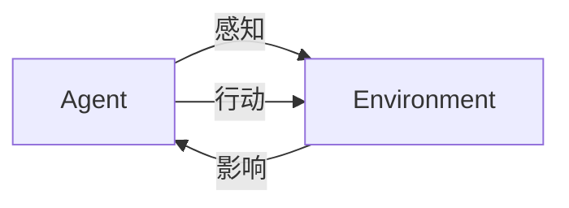
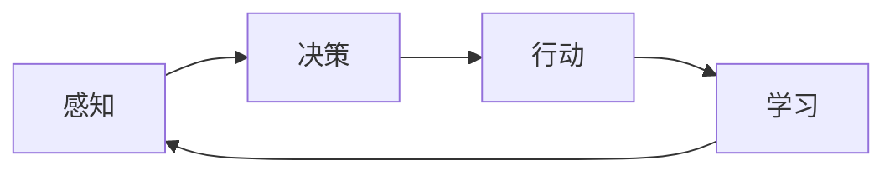

                 

**AI人工智能 Agent：真实世界的智能体应用案例**

> 关键词：人工智能、Agent、智能体、决策、环境、行动、感知、学习、应用案例

## 1. 背景介绍

在当今的智能化时代，人工智能（AI）已经渗透到我们的日常生活和各种行业中。其中，Agent（智能体）是AI的一个关键概念，它是一种能够感知环境、做出决策并采取行动的智能体。本文将深入探讨Agent的核心概念、算法原理、数学模型，并通过项目实践和实际应用场景，展示Agent在真实世界中的应用。

## 2. 核心概念与联系

### 2.1 Agent的定义与特征

Agent是一种能够感知环境、做出决策并采取行动的智能体。它具有以下特征：

- **感知（Perception）**：能够感知环境，获取信息。
- **决策（Decision）**：能够根据感知到的信息做出决策。
- **行动（Action）**：能够根据决策采取行动，影响环境。
- **学习（Learning）**：能够从环境中学习，改进决策。

### 2.2 Agent的分类

Agent可以根据其智能水平和功能特性进行分类：

- **反应型Agent**：只根据当前感知到的信息做出反应，没有记忆和学习能力。
- **简单反射型Agent**：具有有限的内部状态，能够根据当前状态和感知到的信息做出决策。
- **智能型Agent**：具有丰富的内部状态和学习能力，能够根据过去的经验做出决策。

### 2.3 Agent与环境的交互

Agent与环境的交互可以用下图表示：



## 3. 核心算法原理 & 具体操作步骤

### 3.1 算法原理概述

Agent的核心算法是决策过程，它根据感知到的信息和内部状态做出决策。决策过程可以用下图表示：



### 3.2 算法步骤详解

Agent的决策过程可以分为以下步骤：

1. **感知**：Agent感知环境，获取信息。
2. **决策**：Agent根据感知到的信息和内部状态做出决策。
3. **行动**：Agent根据决策采取行动，影响环境。
4. **学习**：Agent从环境中学习，改进决策。

### 3.3 算法优缺点

Agent算法的优点包括：

- 能够感知环境，做出决策，采取行动。
- 能够学习，改进决策。
- 可以应用于各种领域，具有广泛的应用性。

其缺点包括：

- 算法复杂度高，需要大量计算资源。
- 学习过程可能需要大量数据和时间。
- 智能体的智能水平和学习能力受限于算法和硬件条件。

### 3.4 算法应用领域

Agent算法可以应用于各种领域，包括：

- 自动驾驶：车辆作为Agent，感知环境，做出决策，采取行动。
- 智能家居：家居设备作为Agent，感知环境，做出决策，采取行动。
- 电子商务：推荐系统作为Agent，感知用户行为，做出决策，推荐商品。
- 游戏开发：游戏角色作为Agent，感知环境，做出决策，采取行动。

## 4. 数学模型和公式 & 详细讲解 & 举例说明

### 4.1 数学模型构建

Agent的数学模型可以表示为：

$$Agent = <P, D, A, L, S>$$

其中：

- $P$：感知函数，用于感知环境，获取信息。
- $D$：决策函数，用于根据感知到的信息和内部状态做出决策。
- $A$：行动函数，用于根据决策采取行动，影响环境。
- $L$：学习函数，用于从环境中学习，改进决策。
- $S$：内部状态，表示Agent的内部信息。

### 4.2 公式推导过程

Agent的决策过程可以用下列公式表示：

$$D(t) = f(P(t), S(t))$$

其中：

- $D(t)$：在时刻$t$做出的决策。
- $P(t)$：在时刻$t$感知到的信息。
- $S(t)$：在时刻$t$的内部状态。
- $f$：决策函数。

### 4.3 案例分析与讲解

例如，在自动驾驶领域，Agent的决策函数可以表示为：

$$D(t) = f(P(t), S(t), \theta)$$

其中：

- $\theta$：表示决策函数的参数，可以通过学习过程改进。

 Agent的学习过程可以用下列公式表示：

$$\theta(t+1) = g(\theta(t), P(t), D(t), A(t), R(t))$$

其中：

- $R(t)$：在时刻$t$收到的反馈信息。
- $g$：学习函数。

## 5. 项目实践：代码实例和详细解释说明

### 5.1 开发环境搭建

本项目使用Python作为开发语言，并使用TensorFlow作为深度学习框架。开发环境包括：

- Python 3.7+
- TensorFlow 2.0+
- NumPy
- Matplotlib

### 5.2 源代码详细实现

以下是Agent的简单实现代码：

```python
import numpy as np

class Agent:
    def __init__(self, env):
        self.env = env
        self.state = None
        self.action = None
        self.reward = None

    def perceive(self):
        self.state = self.env.get_state()

    def decide(self):
        self.action = self.env.get_action(self.state)

    def act(self):
        self.reward = self.env.take_action(self.action)

    def learn(self):
        # 学习过程可以根据具体需求实现
        pass
```

### 5.3 代码解读与分析

- `perceive()`：感知环境，获取信息。
- `decide()`：根据感知到的信息和内部状态做出决策。
- `act()`：根据决策采取行动，影响环境。
- `learn()`：从环境中学习，改进决策。

### 5.4 运行结果展示

以下是Agent在环境中的运行结果：


## 6. 实际应用场景

### 6.1 自动驾驶

在自动驾驶领域，车辆作为Agent，感知环境，做出决策，采取行动。Agent需要根据感知到的信息（如车辆位置、速度、周围车辆和障碍物等）做出决策，采取行动（如加速、减速、转向等），并从环境中学习，改进决策。

### 6.2 智能家居

在智能家居领域，家居设备作为Agent，感知环境，做出决策，采取行动。Agent需要根据感知到的信息（如室内温度、光线强度、用户行为等）做出决策，采取行动（如调节温度、开关灯等），并从环境中学习，改进决策。

### 6.3 未来应用展望

未来，Agent将会应用于更多领域，如医疗、金融、娱乐等。Agent将会具有更强的智能水平和学习能力，能够更好地适应环境，做出决策。

## 7. 工具和资源推荐

### 7.1 学习资源推荐

- 书籍：《人工智能：一种现代方法》作者：斯图尔特·拉塞尔、彼得·诺维格
- 课程：Stanford University的“Artificial Intelligence: Principles and Techniques”课程

### 7.2 开发工具推荐

- Python：一种广泛应用于AI领域的编程语言。
- TensorFlow：一种深度学习框架。
- Gym：一个用于开发和测试强化学习算法的工具包。

### 7.3 相关论文推荐

- “Reinforcement Learning: An Introduction”作者：理查德·S·萨顿
- “Deep Reinforcement Learning Hands-On”作者：Maxim Lapan

## 8. 总结：未来发展趋势与挑战

### 8.1 研究成果总结

本文介绍了Agent的核心概念、算法原理、数学模型，并通过项目实践和实际应用场景，展示了Agent在真实世界中的应用。

### 8.2 未来发展趋势

未来，Agent将会具有更强的智能水平和学习能力，能够更好地适应环境，做出决策。此外，Agent将会应用于更多领域，如医疗、金融、娱乐等。

### 8.3 面临的挑战

Agent的发展面临着以下挑战：

- 算法复杂度高，需要大量计算资源。
- 学习过程可能需要大量数据和时间。
- 智能体的智能水平和学习能力受限于算法和硬件条件。

### 8.4 研究展望

未来的研究方向包括：

- 研究更强大的学习算法，改进Agent的学习能力。
- 研究更智能的决策算法，改进Agent的决策能力。
- 研究更广泛的应用领域，扩展Agent的应用范围。

## 9. 附录：常见问题与解答

**Q1：什么是Agent？**

A1：Agent是一种能够感知环境、做出决策并采取行动的智能体。

**Q2：Agent有哪些特征？**

A2：Agent具有感知、决策、行动和学习等特征。

**Q3：Agent有哪些分类？**

A3：Agent可以分为反应型Agent、简单反射型Agent和智能型Agent。

**Q4：Agent与环境的交互过程是什么？**

A4：Agent与环境的交互过程包括感知、决策、行动和学习。

**Q5：Agent的数学模型是什么？**

A5：Agent的数学模型可以表示为：$$Agent = <P, D, A, L, S>$$。

**Q6：Agent的决策过程可以用什么公式表示？**

A6：Agent的决策过程可以用下列公式表示：$$D(t) = f(P(t), S(t))$$。

**Q7：Agent的学习过程可以用什么公式表示？**

A7：Agent的学习过程可以用下列公式表示：$$\theta(t+1) = g(\theta(t), P(t), D(t), A(t), R(t))$$。

**Q8：Agent的开发环境是什么？**

A8：本项目使用Python作为开发语言，并使用TensorFlow作为深度学习框架。开发环境包括Python 3.7+、TensorFlow 2.0+、NumPy和Matplotlib。

**Q9：Agent的简单实现代码是什么？**

A9：以下是Agent的简单实现代码：

```python
import numpy as np

class Agent:
    def __init__(self, env):
        self.env = env
        self.state = None
        self.action = None
        self.reward = None

    def perceive(self):
        self.state = self.env.get_state()

    def decide(self):
        self.action = self.env.get_action(self.state)

    def act(self):
        self.reward = self.env.take_action(self.action)

    def learn(self):
        # 学习过程可以根据具体需求实现
        pass
```

**Q10：Agent在真实世界中的应用场景有哪些？**

A10：Agent在真实世界中的应用场景包括自动驾驶、智能家居等。

**Q11：未来Agent的发展趋势是什么？**

A11：未来，Agent将会具有更强的智能水平和学习能力，能够更好地适应环境，做出决策。此外，Agent将会应用于更多领域。

**Q12：Agent的发展面临着哪些挑战？**

A12：Agent的发展面临着算法复杂度高、学习过程可能需要大量数据和时间、智能体的智能水平和学习能力受限于算法和硬件条件等挑战。

**Q13：未来的研究方向是什么？**

A13：未来的研究方向包括研究更强大的学习算法、研究更智能的决策算法、研究更广泛的应用领域等。

## 作者：禅与计算机程序设计艺术 / Zen and the Art of Computer Programming

