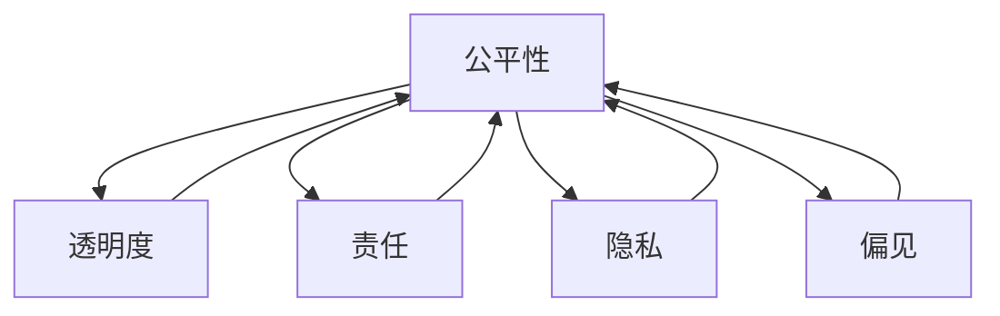

                 

**AI伦理学：LLM发展中的道德考量**

**作者：禅与计算机程序设计艺术 / Zen and the Art of Computer Programming**

## 1. 背景介绍

人工智能（AI）的发展正在以指数级速度前进，其中大语言模型（LLM）的进步尤为显著。LLM是一种能够理解、生成和交流人类语言的AI模型。然而，随着LLM的发展，我们也面临着一系列道德和伦理挑战。本文将探讨LLM发展中的道德考量，包括公平性、透明度、责任、隐私和偏见等关键问题。

## 2. 核心概念与联系

### 2.1 道德考量的必要性

在AI和LLM的发展过程中，道德考量是至关重要的。道德决策影响着我们的生活，从个体到社会，从现在到未来。AI和LLM的发展不能置身于道德考量之外，因为它们的决策和行动会对我们的生活产生重大影响。

### 2.2 道德考量的维度

道德考量在LLM的发展中有多个维度，包括公平性、透明度、责任、隐私和偏见。这些维度是相互关联的，一个维度的改进可能会影响其他维度。例如，提高透明度可能会减少偏见，但也可能会侵犯隐私。



## 3. 核心算法原理 & 具体操作步骤

### 3.1 算法原理概述

LLM的核心是Transformer模型，它使用自注意力机制来处理输入序列。自注意力机制允许模型在处理输入时考虑到上下文，从而生成更相关的输出。然而，这种复杂性也带来了道德考量的挑战。

### 3.2 算法步骤详解

LLM的训练过程包括以下步骤：

1. 数据收集：收集大量的文本数据，用于模型训练。
2. 数据预处理：清洗和预处理数据，包括标记化、分词和去除停用词。
3. 模型构建：构建Transformer模型，包括编码器和解码器。
4. 模型训练：使用训练数据训练模型，优化模型参数。
5. 模型评估：评估模型性能，使用验证集和测试集。
6. 模型部署：部署模型，用于生成文本。

### 3.3 算法优缺点

LLM的优点包括理解和生成人类语言的能力，以及在各种任务中的表现。然而，LLM也面临着道德挑战，包括偏见、不透明性和缺乏责任感。

### 3.4 算法应用领域

LLM的应用领域包括自然语言处理（NLP）、机器翻译、文本生成、问答系统和搜索引擎。然而，LLM也可以被用于道德决策，如公平性评估和偏见检测。

## 4. 数学模型和公式 & 详细讲解 & 举例说明

### 4.1 数学模型构建

LLM的数学模型是基于Transformer模型的。Transformer模型使用自注意力机制来处理输入序列。自注意力机制可以表示为：

$$Attention(Q, K, V) = softmax(\frac{QK^T}{\sqrt{d_k}})V$$

其中，$Q$, $K$, $V$分别是查询、键和值向量，$d_k$是键向量的维度。

### 4.2 公式推导过程

自注意力机制的推导过程如下：

1. 将输入序列转换为查询、键和值向量。
2. 计算查询和键向量的点积，并除以键向量的维度的平方根。
3. 使用softmax函数对上一步的结果进行缩放，得到注意力权重。
4. 使用注意力权重对值向量进行加权求和，得到输出向量。

### 4.3 案例分析与讲解

例如，在机器翻译任务中，输入序列是源语言的句子，查询向量是目标语言的前一个单词的表示，键和值向量是源语言的所有单词的表示。模型会根据注意力权重选择相关的单词，并生成目标语言的下一个单词。

## 5. 项目实践：代码实例和详细解释说明

### 5.1 开发环境搭建

要训练和部署LLM，需要搭建一个强大的开发环境，包括GPU、大量内存和高速存储。推荐使用Python和PyTorch或TensorFlow框架。

### 5.2 源代码详细实现

以下是Transformer模型的简单实现示例：

```python
import torch
import torch.nn as nn

class Transformer(nn.Module):
    def __init__(self, d_model, n_head, n_layers):
        super(Transformer, self).__init__()
        self.encoder_layers = nn.ModuleList([nn.TransformerEncoderLayer(d_model, n_head) for _ in range(n_layers)])
        self.encoder = nn.TransformerEncoder(self.encoder_layers, n_layers)

    def forward(self, src):
        output = self.encoder(src)
        return output
```

### 5.3 代码解读与分析

在上述代码中，我们定义了一个Transformer模型，它包含多个Transformer编码器层。每个编码器层包含自注意力机制和位置编码。模型的输入是源序列，输出是编码后的序列。

### 5.4 运行结果展示

训练好的LLM可以用于各种NLP任务，如机器翻译、文本生成和问答系统。以下是一个简单的文本生成示例：

```python
model = Transformer(d_model=512, n_head=8, n_layers=6)
model.load_state_dict(torch.load('llm_model.pt'))
model.eval()

with torch.no_grad():
    output = model(input_tensor)
    generated_text = tokenizer.decode(output.argmax(dim=-1))
print(generated_text)
```

## 6. 实际应用场景

### 6.1 公平性

LLM在评估和生成文本时可能会导致偏见和不公平。例如，在求职简历评估任务中，LLM可能会对性别或种族有偏见。为了解决这个问题，需要对模型进行偏见检测和公平性评估，并对偏见进行调整。

### 6.2 透明度

LLM的决策过程是不透明的，这使得模型的偏见和错误难以被检测和修复。为了提高透明度，需要开发解释性AI技术，如局部解释和全局解释。此外，还需要开发可解释的模型架构，如决策树和规则系统。

### 6.3 责任

LLM的决策可能会对个体和社会产生重大影响。例如，在自动驾驶汽车中，模型的决策可能会导致生命丧失。因此，需要明确模型的责任，并开发责任分配机制，以确保模型的决策是负责任的。

### 6.4 隐私

LLM需要大量的文本数据进行训练，这可能会侵犯个体的隐私。为了保护隐私，需要开发匿名化和去标识化技术，如差分隐私和模型差分隐私。此外，还需要开发联邦学习技术，以允许模型在不共享数据的情况下进行训练。

### 6.5 未来应用展望

LLM的未来应用包括智能客户服务、个性化推荐系统、自动新闻写作和自动编程。然而，LLM的道德考量也将是未来的关键挑战，需要开发道德AI技术，以确保LLM的决策是道德的和负责任的。

## 7. 工具和资源推荐

### 7.1 学习资源推荐

推荐以下资源学习LLM和道德AI：

* 书籍：《人工智能：一种现代 Approach》和《道德机器人：理解和设计道德人工智能》
* 课程：斯坦福大学的“计算机视觉”课程和麻省理工学院的“计算机伦理学”课程
* 在线资源：fast.ai和Hugging Face的LLM教程

### 7.2 开发工具推荐

推荐以下工具开发LLM和道德AI：

* 开发环境：Google Colab和Jupyter Notebook
* 框架：PyTorch和TensorFlow
* LLM库：Hugging Face Transformers和Tensor2Tensor
* 道德AI库：IBM AI Fairness 360和Facebook的Fairlearn

### 7.3 相关论文推荐

推荐以下论文学习LLM和道德AI：

* LLM：《Attention is All You Need》和《Language Models are Few-Shot Learners》
* 道德AI：《向AI灌输道德》和《道德机器人：理解和设计道德人工智能》

## 8. 总结：未来发展趋势与挑战

### 8.1 研究成果总结

LLM的发展取得了重大进展，包括Transformer模型和自注意力机制的发展。然而，LLM的道德考量仍然是一个挑战，需要开发道德AI技术，以确保LLM的决策是道德的和负责任的。

### 8.2 未来发展趋势

LLM的未来发展趋势包括：

* 更大的模型：开发更大的模型，以提高性能和理解能力。
* 多模式学习：开发多模式学习技术，以结合文本、图像和音频等多模式数据。
* 解释性AI：开发解释性AI技术，以提高模型的透明度和可解释性。

### 8.3 面临的挑战

LLM面临的挑战包括：

* 偏见和不公平：开发偏见检测和公平性评估技术，以解决模型的偏见和不公平问题。
* 透明度：开发解释性AI技术，以提高模型的透明度和可解释性。
* 责任：开发责任分配机制，以确保模型的决策是负责任的。
* 隐私：开发匿名化和去标识化技术，以保护个体的隐私。

### 8.4 研究展望

LLM的研究展望包括：

* 道德AI：开发道德AI技术，以确保LLM的决策是道德的和负责任的。
* 可持续AI：开发可持续AI技术，以减少模型的碳足迹和资源消耗。
* 多模式学习：开发多模式学习技术，以结合文本、图像和音频等多模式数据。

## 9. 附录：常见问题与解答

**Q1：LLM的优点是什么？**

A1：LLM的优点包括理解和生成人类语言的能力，以及在各种NLP任务中的表现。

**Q2：LLM的缺点是什么？**

A2：LLM的缺点包括偏见、不透明性和缺乏责任感。

**Q3：LLM的道德考量包括哪些维度？**

A3：LLM的道德考量包括公平性、透明度、责任、隐私和偏见。

**Q4：如何解决LLM的偏见问题？**

A4：可以使用偏见检测和公平性评估技术来解决LLM的偏见问题，并对偏见进行调整。

**Q5：如何提高LLM的透明度？**

A5：可以开发解释性AI技术，如局部解释和全局解释，并开发可解释的模型架构，如决策树和规则系统。

**Q6：如何确保LLM的决策是负责任的？**

A6：需要明确模型的责任，并开发责任分配机制，以确保模型的决策是负责任的。

**Q7：如何保护LLM训练过程中个体的隐私？**

A7：可以开发匿名化和去标识化技术，如差分隐私和模型差分隐私，并开发联邦学习技术，以允许模型在不共享数据的情况下进行训练。

**Q8：LLM的未来应用是什么？**

A8：LLM的未来应用包括智能客户服务、个性化推荐系统、自动新闻写作和自动编程。

**Q9：LLM的未来挑战是什么？**

A9：LLM的未来挑战包括偏见和不公平、透明度、责任和隐私。

**Q10：如何开发道德AI技术？**

A10：需要开发道德AI技术，以确保LLM的决策是道德的和负责任的，并需要开发可持续AI技术，以减少模型的碳足迹和资源消耗。

**作者：禅与计算机程序设计艺术 / Zen and the Art of Computer Programming**

