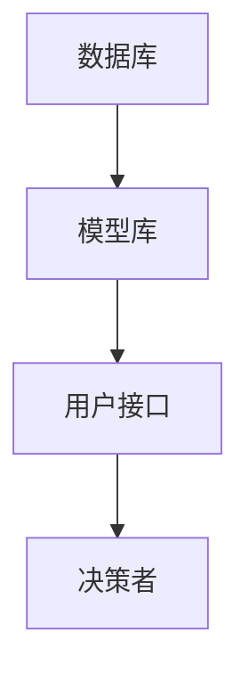

                 

## AI创业公司如何进行风险评估?

> 关键词：风险评估、AI创业、决策支持系统、不确定性、模型评估、数据质量

## 1. 背景介绍

在当今快速发展的AI创业环境中，风险评估是创业公司成功的关键因素之一。AI创业公司面临的风险包括技术风险、市场风险、财务风险和合规风险等。本文将重点讨论如何使用决策支持系统和模型评估方法来评估AI创业公司面临的风险。

## 2. 核心概念与联系

### 2.1 决策支持系统（Decision Support System, DSS）

DSS是一种计算机系统，旨在帮助决策者做出更明智的决策。DSS通常包含数据库、模型库和用户接口。AI创业公司可以使用DSS来评估风险，并帮助决策者做出更明智的决策。



### 2.2 不确定性（Uncertainty）

不确定性是指无法预测未来事件的可能性。在AI创业公司中，不确定性是评估风险的关键因素。决策者必须考虑各种可能的结果，并做出最佳决策。

### 2.3 模型评估（Model Evaluation）

模型评估是指评估模型性能的过程。在AI创业公司中，模型评估是评估风险的关键步骤。决策者必须评估模型的准确性、精确性和可靠性，以确保模型能够提供准确的风险评估。

## 3. 核心算法原理 & 具体操作步骤

### 3.1 算法原理概述

风险评估算法的核心原理是使用统计模型来预测未来事件的可能性。这些模型使用历史数据来建立关系，并使用这些关系来预测未来事件的可能性。

### 3.2 算法步骤详解

1. 数据收集：收集与风险相关的历史数据。
2. 数据预处理：清洗和预处理数据，以便于分析。
3. 特征选择：选择与风险相关的特征。
4. 模型选择：选择适合风险评估的模型。
5. 模型训练：使用历史数据训练模型。
6. 模型评估：评估模型的性能。
7. 风险评估：使用模型预测未来事件的可能性，并评估风险。

### 3.3 算法优缺点

优点：

* 提高了风险评估的准确性和客观性。
* 可以处理大量数据。
* 可以评估各种类型的风险。

缺点：

* 需要大量的历史数据。
* 模型的准确性取决于数据的质量。
* 模型的复杂性可能会导致解释困难。

### 3.4 算法应用领域

风险评估算法可以应用于各种领域，包括金融、保险、医疗保健和制造业等。在AI创业公司中，风险评估算法可以用于评估技术风险、市场风险和财务风险等。

## 4. 数学模型和公式 & 详细讲解 & 举例说明

### 4.1 数学模型构建

风险评估模型通常使用概率分布来表示未来事件的可能性。常用的模型包括：

* 线性回归模型
* 逻辑回归模型
* 支持向量机模型
* 随机森林模型
* 神经网络模型

### 4.2 公式推导过程

以线性回归模型为例，其公式为：

$$y = β_0 + β_1x_1 + β_2x_2 +... + β_nx_n + ε$$

其中，$y$是目标变量， $β_0, β_1, β_2,..., β_n$是回归系数，$x_1, x_2,..., x_n$是自变量，$ε$是误差项。

回归系数可以使用最小二乘法来估计：

$$β = (X^TX)^{-1}X^Ty$$

其中，$X$是自变量矩阵，$y$是目标变量向量。

### 4.3 案例分析与讲解

假设一家AI创业公司想要评估其新产品的市场风险。该公司收集了历史数据，包括产品特性、市场需求、竞争对手信息等。该公司选择使用线性回归模型来评估风险。

该公司首先需要预处理数据，并选择与市场风险相关的特征。然后，该公司使用最小二乘法估计回归系数。最后，该公司使用模型预测未来事件的可能性，并评估市场风险。

## 5. 项目实践：代码实例和详细解释说明

### 5.1 开发环境搭建

要实现风险评估算法，需要以下软件和库：

* Python：一种高级编程语言。
* NumPy：一个用于数值计算的库。
* Pandas：一个用于数据分析的库。
* Scikit-learn：一个机器学习库。
* Matplotlib：一个绘图库。

### 5.2 源代码详细实现

以下是使用线性回归模型评估市场风险的示例代码：

```python
import numpy as np
import pandas as pd
from sklearn.model_selection import train_test_split
from sklearn.linear_model import LinearRegression
from sklearn.metrics import mean_squared_error

# 加载数据
data = pd.read_csv('market_data.csv')

# 预处理数据
data = data.dropna()

# 选择特征
features = ['feature1', 'feature2', 'feature3']
X = data[features]
y = data['market_risk']

# 分割数据
X_train, X_test, y_train, y_test = train_test_split(X, y, test_size=0.2, random_state=42)

# 创建模型
model = LinearRegression()

# 训练模型
model.fit(X_train, y_train)

# 预测风险
y_pred = model.predict(X_test)

# 评估模型
mse = mean_squared_error(y_test, y_pred)
print('Mean Squared Error:', mse)
```

### 5.3 代码解读与分析

该代码首先加载数据，并预处理数据以删除缺失值。然后，该代码选择与市场风险相关的特征，并将数据分成训练集和测试集。接下来，该代码创建线性回归模型，并使用训练集训练模型。最后，该代码使用测试集预测风险，并评估模型的性能。

### 5.4 运行结果展示

运行该代码后，输出的均方误差（Mean Squared Error, MSE）值可以用来评估模型的性能。MSE值越小，模型的性能越好。

## 6. 实际应用场景

### 6.1 当前应用

风险评估算法已经广泛应用于金融、保险、医疗保健和制造业等领域。例如，保险公司使用风险评估算法来评估客户的信用风险，并确定保费。金融机构使用风险评估算法来评估投资的风险回报比。

### 6.2 未来应用展望

随着AI技术的发展，风险评估算法的应用将会扩展到更多领域。例如，AI创业公司可以使用风险评估算法来评估技术风险，并做出更明智的决策。此外，风险评估算法还可以应用于自然灾害预测、气候变化评估等领域。

## 7. 工具和资源推荐

### 7.1 学习资源推荐

* "统计学习方法"（机器学习经典教材）
* "风险管理与风险控制"（金融风险管理教材）
* "不确定性与风险分析"（不确定性分析教材）

### 7.2 开发工具推荐

* Python：一种高级编程语言。
* R：一种统计编程语言。
* MATLAB：一种数值计算软件。
* IBM Watson：一种AI平台。
* Google Cloud AI Platform：一种AI平台。

### 7.3 相关论文推荐

* "A Survey of Risk Assessment Techniques in Software Engineering"（软件工程风险评估技术综述）
* "Risk Assessment in Artificial Intelligence: A Survey"（人工智能风险评估综述）
* "A Review of Risk Assessment Models in Healthcare"（医疗保健风险评估模型综述）

## 8. 总结：未来发展趋势与挑战

### 8.1 研究成果总结

本文介绍了AI创业公司如何使用决策支持系统和模型评估方法来评估风险。我们讨论了核心概念、算法原理、数学模型和公式，并提供了代码实例和实际应用场景。我们还推荐了学习资源、开发工具和相关论文。

### 8.2 未来发展趋势

未来，风险评估算法将会朝着以下方向发展：

* 使用深度学习模型来评估风险。
* 使用不确定性分析方法来评估风险。
* 使用实时数据来评估风险。
* 使用解释性AI来评估风险。

### 8.3 面临的挑战

然而，风险评估算法也面临着以下挑战：

* 数据质量问题。
* 模型解释困难。
* 缺乏历史数据。
* 道德和伦理问题。

### 8.4 研究展望

未来的研究将会关注以下领域：

* 使用生成对抗网络（GAN）来评估风险。
* 使用 transformer 模型来评估风险。
* 使用联邦学习来评估风险。
* 使用可解释AI来评估风险。

## 9. 附录：常见问题与解答

**Q1：什么是风险评估？**

风险评估是指评估未来事件可能性的过程。在AI创业公司中，风险评估是评估技术风险、市场风险和财务风险等的关键步骤。

**Q2：什么是决策支持系统？**

决策支持系统（DSS）是一种计算机系统，旨在帮助决策者做出更明智的决策。DSS通常包含数据库、模型库和用户接口。

**Q3：什么是不确定性？**

不确定性是指无法预测未来事件的可能性。在AI创业公司中，不确定性是评估风险的关键因素。

**Q4：什么是模型评估？**

模型评估是指评估模型性能的过程。在AI创业公司中，模型评估是评估风险的关键步骤。决策者必须评估模型的准确性、精确性和可靠性，以确保模型能够提供准确的风险评估。

**Q5：什么是线性回归模型？**

线性回归模型是一种统计模型，用于建立自变量和目标变量之间的线性关系。线性回归模型可以用于预测未来事件的可能性，并评估风险。

## 作者：禅与计算机程序设计艺术 / Zen and the Art of Computer Programming

