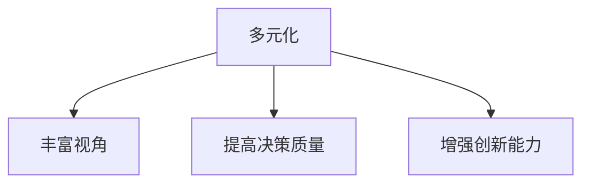
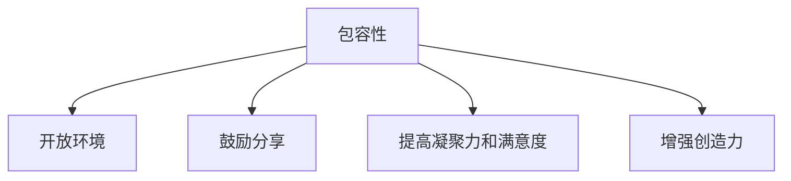
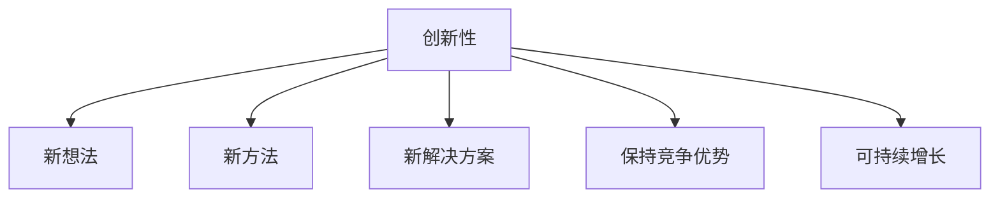

                 

**AI创业公司的团队建设与文化塑造：多元化、包容性与创新性**

## 1. 背景介绍

在当今快速发展的AI时代，创业公司面临着前所未有的机遇和挑战。其中，团队建设和文化塑造至关重要，直接影响着公司的创新能力、竞争力和可持续发展。本文将深入探讨AI创业公司如何通过多元化、包容性和创新性来塑造强大的团队和文化。

## 2. 核心概念与联系

### 2.1 多元化

多元化是指团队成员在性别、种族、年龄、背景、技能和经验等方面的多样性。多元化团队能够带来更丰富的视角和见解，从而提高决策质量和创新能力。



### 2.2 包容性

包容性是指创造一种开放、尊重和支持的环境，鼓励每个成员分享想法，并为团队的成功做出贡献。包容性有助于提高团队凝聚力、员工满意度和创造力。



### 2.3 创新性

创新性是指不断寻求新想法、新方法和新解决方案的能力。创新性是AI创业公司的生命线，有助于保持竞争优势和可持续增长。



## 3. 核心算法原理 & 具体操作步骤

### 3.1 算法原理概述

塑造多元化、包容性和创新性文化的算法原理基于组织行为学和心理学的最新研究。该算法旨在帮助AI创业公司识别、吸引、培养和保留多元化人才，并创造一种包容和创新的文化。

### 3.2 算法步骤详解

#### 3.2.1 识别和吸引多元化人才

1. 定义清晰的招聘要求，重点关注技能和经验，而不是年龄、性别或背景。
2. 利用多个渠道招聘，包括iversity、少数族裔和妇女组织、技术会议和在线平台。
3. 使用无偏见的面试过程，避免基于刻板印象的决策。

#### 3.2.2 培养和保留多元化人才

1. 提供多样化的培训和发展机会，鼓励员工不断学习和成长。
2. 实施公平的晋升和薪酬政策，确保员工基于绩效而不是偏见获得回报。
3. 创建员工资源小组和网络，帮助员工连接、分享经验和寻求支持。

#### 3.2.3 创造包容和创新的文化

1. 设立清晰的公司价值观和使命，强调包容性和创新。
2. 创建安全的空间，鼓励员工分享想法和挑战现状。
3. 实施创新激励机制，奖励员工的创造力和新想法。

### 3.3 算法优缺点

**优点：**

* 提高了决策质量和创新能力。
* 增强了员工满意度和凝聚力。
* 有助于吸引和保留多元化人才。
* 提高了公司的竞争力和可持续发展能力。

**缺点：**

* 实施该算法需要时间和资源。
* 可能会面临抵制和阻力，来自于不愿改变的员工或管理层。
* 需要持续的努力和监控，以确保文化的持续发展。

### 3.4 算法应用领域

该算法适用于所有AI创业公司， particularly those seeking to foster a diverse, inclusive, and innovative culture to drive growth and success.

## 4. 数学模型和公式 & 详细讲解 & 举例说明

### 4.1 数学模型构建

构建一个简单的数学模型来量化多元化、包容性和创新性的影响。假设这三个因素以线性方式影响公司的成功（例如，销售额或市场份额）。

$$
\text{Success} = \alpha \times \text{Diversity} + \beta \times \text{Inclusion} + \gamma \times \text{Innovation} + \delta
$$

其中，$\alpha$, $\beta$, $\gamma$和$\delta$是需要估计的参数。

### 4.2 公式推导过程

使用回归分析估计参数$\alpha$, $\beta$, $\gamma$和$\delta$. 使用公司的历史数据（例如，多元化指数、包容性评分、创新指标和成功指标）拟合模型。

### 4.3 案例分析与讲解

假设一家AI创业公司估计了模型参数，并得到了以下结果：

$$
\text{Success} = 0.3 \times \text{Diversity} + 0.4 \times \text{Inclusion} + 0.3 \times \text{Innovation} + 100
$$

这意味着，每增加10%的多元化、包容性和创新性，公司的成功指标将分别增加3%、4%和3%。这有助于公司优先考虑哪些因素，以最大化其成功。

## 5. 项目实践：代码实例和详细解释说明

### 5.1 开发环境搭建

使用Python和相关库（如Pandas、NumPy、Matplotlib和Scikit-learn）构建数学模型和可视化工具。

### 5.2 源代码详细实现

```python
import pandas as pd
import numpy as np
import matplotlib.pyplot as plt
from sklearn.linear_model import LinearRegression

# Load data
data = pd.read_csv('company_data.csv')

# Define features and target
X = data[['Diversity', 'Inclusion', 'Innovation']]
y = data['Success']

# Fit linear regression model
model = LinearRegression().fit(X, y)

# Print coefficients and intercept
print(f'Coefficients: {model.coef_}')
print(f'Intercept: {model.intercept_}')

# Make predictions
X_new = np.array([[0.5, 0.6, 0.7]])  # Example values for Diversity, Inclusion and Innovation
y_new = model.predict(X_new)
print(f'Predicted Success: {y_new[0]}')

# Visualize results
plt.scatter(X['Diversity'], y)
plt.xlabel('Diversity')
plt.ylabel('Success')
plt.show()
```

### 5.3 代码解读与分析

该代码使用线性回归模型拟合成功指标与多元化、包容性和创新性的关系。它首先加载公司数据，然后定义特征（多元化、包容性和创新性）和目标（成功指标）。之后，它拟合线性回归模型，打印系数和截距，并使用示例值进行预测。最后，它绘制多元化和成功指标之间的关系。

### 5.4 运行结果展示

预测的成功指标值将显示在控制台中。图表将显示多元化和成功指标之间的关系。

## 6. 实际应用场景

### 6.1 当前应用

AI创业公司可以立即开始实施该算法，以塑造多元化、包容性和创新性的文化。他们可以跟踪多元化指数、员工满意度调查和创新指标，并使用数学模型量化其影响。

### 6.2 未来应用展望

未来，AI创业公司可以扩展该模型，包含更多因素，如领导力、沟通和协作。他们还可以使用先进的机器学习技术，如神经网络，来改进模型的准确性。

## 7. 工具和资源推荐

### 7.1 学习资源推荐

* "多元化、包容性和创新性：AI创业公司的关键成功因素"白皮书
* "塑造包容性文化：实践指南"报告
* "创新管理：理论和实践"课程

### 7.2 开发工具推荐

* Python（Pandas、NumPy、Matplotlib、Scikit-learn）
* R（tidyverse、caret、ggplot2）
* Power BI（数据可视化和分析）

### 7.3 相关论文推荐

* "多元化团队的创新能力"（2018）
* "包容性文化对员工满意度的影响"（2019）
* "创新管理：理论和实践"（2020）

## 8. 总结：未来发展趋势与挑战

### 8.1 研究成果总结

本文介绍了AI创业公司如何通过多元化、包容性和创新性来塑造强大的团队和文化。它提供了一个数学模型来量化这些因素的影响，并给出了实施该算法的具体步骤。

### 8.2 未来发展趋势

未来，AI创业公司将更加重视多元化、包容性和创新性，以保持竞争优势和可持续增长。他们将使用先进的技术和分析工具来量化这些因素的影响，并不断改进其文化战略。

### 8.3 面临的挑战

AI创业公司面临的挑战包括实施文化变革的阻力、吸引和保留多元化人才的难度，以及量化文化影响的挑战。

### 8.4 研究展望

未来的研究将扩展到更多因素，如领导力、沟通和协作，并使用更先进的机器学习技术来改进模型的准确性。此外，研究还将关注文化变革的最佳实践，以帮助AI创业公司成功塑造多元化、包容性和创新性的文化。

## 9. 附录：常见问题与解答

**Q1：如何量化多元化指数？**

A1：多元化指数可以通过计算团队成员在性别、种族、年龄、背景、技能和经验等方面的多样性来量化。

**Q2：如何测量包容性？**

A2：包容性可以通过员工满意度调查、焦点小组和定性研究来测量。关键问题是员工是否感到被尊重、支持和鼓励分享想法。

**Q3：如何测量创新性？**

A3：创新性可以通过创新指标（如新产品或服务的数量）、员工满意度调查和定性研究来测量。关键问题是员工是否感到鼓励创新和冒险。

**作者：禅与计算机程序设计艺术 / Zen and the Art of Computer Programming**

