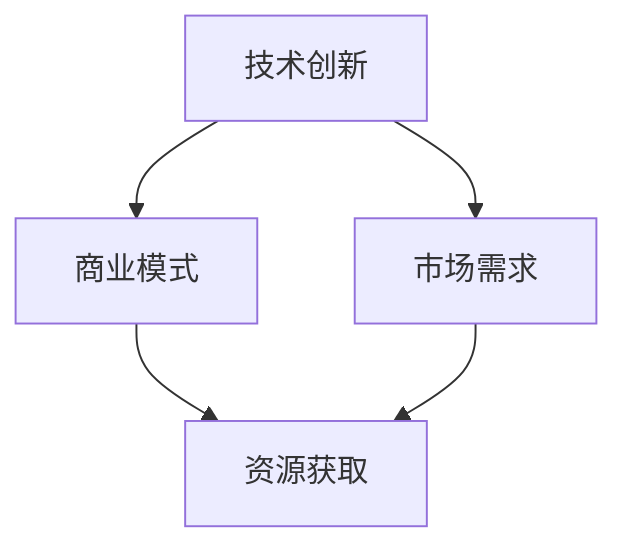

                 

**AI创业码头故事：AI创业者的选择**

**作者：禅与计算机程序设计艺术 / Zen and the Art of Computer Programming**

## 1. 背景介绍

在当今的创业浪潮中，人工智能（AI）已然成为最具前途的领域之一。然而，AI创业并非易事，它需要创业者在技术、商业模式和市场需求等多个维度做出正确的选择。本文将深入探讨AI创业的关键因素，并通过一个虚构的码头故事，带领读者了解AI创业者的选择。

## 2. 核心概念与联系

在AI创业的旅程中，创业者需要理解并平衡以下几个核心概念：

- **技术创新**：AI技术的不断发展，为创业者提供了各种可能性。
- **商业模式**：AI创业需要找到盈利的方式，这可能是直接销售AI服务，也可能是通过AI技术提高现有业务的效率。
- **市场需求**：AI创业者需要找到市场需求，并证明其解决方案能够满足这些需求。
- **资源获取**：AI创业需要资金、人才和其他资源的支持。

下图是这些概念的关系图：



## 3. 核心算法原理 & 具体操作步骤

### 3.1 算法原理概述

AI创业的成功离不开核心算法。例如，图像识别需要计算机视觉算法，自然语言处理需要NLP算法。这些算法的原理是基于机器学习模型，如神经网络。

### 3.2 算法步骤详解

1. **数据收集**：收集与问题相关的数据。
2. **数据预处理**：清洗、标记和格式化数据。
3. **模型选择**：选择适合问题的机器学习模型。
4. **模型训练**：使用预处理的数据训练模型。
5. **模型评估**：评估模型的性能。
6. **部署**：将模型部署到生产环境中。

### 3.3 算法优缺点

优点：AI算法可以学习和适应，可以处理复杂的任务。缺点：AI算法需要大量的数据和计算资源，并且结果可能不易理解。

### 3.4 算法应用领域

AI算法应用广泛，包括图像识别、语音识别、自然语言处理、推荐系统等。

## 4. 数学模型和公式 & 详细讲解 & 举例说明

### 4.1 数学模型构建

在AI创业中，数学模型用于描述问题和优化解决方案。例如，线性回归模型用于预测连续值，逻辑回归模型用于预测分类值。

### 4.2 公式推导过程

例如，线性回归模型的公式推导过程如下：

$$y = \beta_0 + \beta_1x + \epsilon$$

其中，$y$是目标变量，$x$是自变量，$\beta_0$和$\beta_1$是模型参数，$\epsilon$是误差项。

### 4.3 案例分析与讲解

假设我们要预测房价。我们可以使用线性回归模型，其中自变量$x$是房屋的面积，目标变量$y$是房屋的价格。我们可以使用回归分析软件（如R或Python的scikit-learn库）来拟合模型参数$\beta_0$和$\beta_1$.

## 5. 项目实践：代码实例和详细解释说明

### 5.1 开发环境搭建

我们将使用Python和scikit-learn库来构建一个简单的AI项目。首先，我们需要安装Python和scikit-learn。然后，我们需要收集和预处理数据。

### 5.2 源代码详细实现

```python
from sklearn.linear_model import LinearRegression
from sklearn.model_selection import train_test_split
from sklearn.metrics import mean_squared_error

# Load data
X, y = load_data()

# Split data into training and test sets
X_train, X_test, y_train, y_test = train_test_split(X, y, test_size=0.2, random_state=42)

# Create a linear regression model
model = LinearRegression()

# Train the model
model.fit(X_train, y_train)

# Make predictions on the test set
y_pred = model.predict(X_test)

# Evaluate the model
mse = mean_squared_error(y_test, y_pred)
```

### 5.3 代码解读与分析

这段代码使用scikit-learn库构建了一个简单的线性回归模型。它首先加载数据，然后将数据分成训练集和测试集。它创建了一个线性回归模型，并使用训练集训练模型。然后，它使用测试集预测目标变量的值，并计算均方误差来评估模型的性能。

### 5.4 运行结果展示

运行这段代码后，我们可以看到均方误差的值。这个值越小，模型的性能越好。

## 6. 实际应用场景

AI创业的实际应用场景包括：

- **图像识别**：AI可以用于自动驾驶汽车、安防系统等。
- **语音识别**：AI可以用于语音助手、客服系统等。
- **自然语言处理**：AI可以用于搜索引擎、聊天机器人等。

### 6.4 未来应用展望

未来，AI将会更加渗透到我们的生活中，从医疗保健到城市管理，AI都将发挥重要作用。

## 7. 工具和资源推荐

### 7.1 学习资源推荐

- **书籍**："Python机器学习"、"深度学习"、"自然语言处理"
- **在线课程**：Coursera、Udacity、edX上的AI相关课程

### 7.2 开发工具推荐

- **编程语言**：Python、R
- **开发库**：TensorFlow、PyTorch、scikit-learn

### 7.3 相关论文推荐

- "Attention Is All You Need"、"BERT: Pre-training of Deep Bidirectional Transformers for Language Understanding"、"Generative Adversarial Networks"

## 8. 总结：未来发展趋势与挑战

### 8.1 研究成果总结

AI技术已经取得了巨大的进步，但仍有许多挑战需要解决。

### 8.2 未来发展趋势

未来，AI将会更加智能、更加通用，并将渗透到更多领域。

### 8.3 面临的挑战

AI面临的挑战包括数据隐私、算法偏见、计算资源等。

### 8.4 研究展望

未来的AI研究将会集中在解释性AI、自监督学习、多模式学习等领域。

## 9. 附录：常见问题与解答

**Q：AI创业需要多少资金？**

**A**：这取决于项目的规模和复杂性。通常，AI创业需要数百万到数千万美元的资金。

**Q：AI创业需要什么样的人才？**

**A**：AI创业需要数据科学家、机器学习工程师、AI架构师等人才。

**Q：AI创业的风险是什么？**

**A**：AI创业的风险包括技术风险、市场风险、监管风险等。

## 结尾

AI创业是一项复杂的任务，需要创业者在技术、商业模式和市场需求等多个维度做出正确的选择。然而，AI创业的回报也非常丰厚。随着AI技术的不断发展，我们有理由期待AI创业的未来。

**作者署名：作者：禅与计算机程序设计艺术 / Zen and the Art of Computer Programming**

