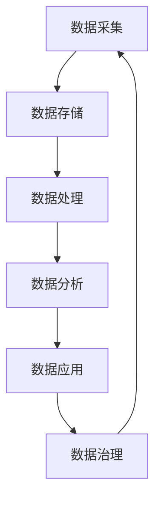

                 

## AI创业：数据管理的核心策略

> 关键词：数据管理、AI创业、数据治理、数据质量、数据安全、数据隐私、数据价值挖掘

## 1. 背景介绍

在当今的数字化时代，数据已成为企业最宝贵的资产之一。然而，数据的价值并不在于其本身，而是在于如何管理和利用数据。对于AI创业公司来说，数据管理更是至关重要，因为它们的产品和服务直接依赖于数据的质量和可用性。本文将深入探讨AI创业公司在数据管理方面需要考虑的核心策略。

## 2. 核心概念与联系

### 2.1 数据治理

数据治理是指对数据的生命周期进行管理，确保数据的准确性、完整性、一致性和可用性。数据治理的目的是保证数据的质量，以便于数据的有效利用。对于AI创业公司来说，数据治理是数据管理的基础。



### 2.2 数据质量

数据质量是指数据的准确性、完整性、一致性、及时性、有效性和可用性。高质量的数据是AI创业公司成功的关键，因为AI模型的性能直接取决于训练数据的质量。

### 2.3 数据安全

数据安全是指保护数据免受未授权访问、泄露、篡改和删除。对于AI创业公司来说，数据安全是至关重要的，因为它们处理的数据通常是敏感的，并且受到严格的监管要求。

### 2.4 数据隐私

数据隐私是指个人数据的保护，以防止数据被滥用或泄露。对于AI创业公司来说，数据隐私是一个关键问题，因为它们通常处理大量的个人数据。

### 2.5 数据价值挖掘

数据价值挖掘是指从数据中提取有价值的信息和见解。对于AI创业公司来说，数据价值挖掘是它们的核心业务，因为它们的产品和服务直接依赖于从数据中提取的见解。

## 3. 核心算法原理 & 具体操作步骤

### 3.1 算法原理概述

AI创业公司在数据管理方面需要考虑的核心算法包括数据清洗、数据集成、数据转换、数据挖掘和数据可视化等。这些算法的目的是提高数据的质量和可用性，并从数据中提取有价值的信息。

### 3.2 算法步骤详解

#### 3.2.1 数据清洗

数据清洗是指识别和处理数据中的错误、不一致和缺失值。数据清洗的步骤包括数据剔除、数据填充、数据转换和数据标准化等。

#### 3.2.2 数据集成

数据集成是指将来自不同来源的数据集合成一个统一的数据集。数据集成的步骤包括数据整合、数据转换和数据集成等。

#### 3.2.3 数据转换

数据转换是指将数据从一种格式转换为另一种格式。数据转换的步骤包括数据格式转换、数据编码和数据聚合等。

#### 3.2.4 数据挖掘

数据挖掘是指从数据中提取有价值的信息和见解。数据挖掘的步骤包括数据预处理、模式识别、关联规则挖掘和分类等。

#### 3.2.5 数据可视化

数据可视化是指将数据以可视化的形式展示出来，以便于用户理解和分析数据。数据可视化的步骤包括数据选择、数据转换和数据展示等。

### 3.3 算法优缺点

#### 3.3.1 优点

* 提高数据的质量和可用性
* 从数据中提取有价值的信息
* 支持数据驱动的决策
* 改善AI模型的性能

#### 3.3.2 缺点

* 数据清洗和集成需要大量的人力和时间
* 数据转换可能会导致数据丢失
* 数据挖掘可能会产生大量的无用信息
* 数据可视化可能会导致信息的丢失

### 3.4 算法应用领域

AI创业公司在数据管理方面需要考虑的核心算法在各个领域都有广泛的应用，包括金融、医疗、零售、制造等。例如，在金融领域，数据清洗和集成可以用于风险评估和信用评分；在医疗领域，数据挖掘可以用于疾病预测和药物发现；在零售领域，数据可视化可以用于销售预测和库存管理。

## 4. 数学模型和公式 & 详细讲解 & 举例说明

### 4.1 数学模型构建

在数据管理方面，常用的数学模型包括线性回归模型、逻辑回归模型、决策树模型、支持向量机模型和神经网络模型等。这些模型的目的是从数据中提取有价值的信息，并对数据进行预测和分类。

### 4.2 公式推导过程

例如，线性回归模型的公式如下：

$$y = \beta_0 + \beta_1x_1 + \beta_2x_2 + \ldots + \beta_nx_n + \epsilon$$

其中，$y$是目标变量，$x_1, x_2, \ldots, x_n$是自变量，$\beta_0, \beta_1, \ldots, \beta_n$是模型的系数，$\epsilon$是误差项。模型的系数可以通过最小化误差平方和的方法来估计。

### 4.3 案例分析与讲解

例如，在金融领域，可以使用线性回归模型来预测股票价格。假设我们有以下数据：

| 日期 | 股票价格 | 利率 | 股息 |
| --- | --- | --- | --- |
| 2021-01-01 | 100 | 2.5% | 5 |
| 2021-01-02 | 105 | 2.6% | 5 |
| 2021-01-03 | 110 | 2.7% | 5 |
|... |... |... |... |

我们可以使用线性回归模型来预测股票价格，其中股票价格是目标变量，$利率$和$股息$是自变量。通过最小化误差平方和的方法，我们可以估计模型的系数，并使用模型来预测未来的股票价格。

## 5. 项目实践：代码实例和详细解释说明

### 5.1 开发环境搭建

在开始项目实践之前，我们需要搭建开发环境。我们推荐使用Python作为编程语言，并使用Anaconda来管理依赖项。我们还需要安装以下库：Pandas、NumPy、Matplotlib、Scikit-learn和TensorFlow。

### 5.2 源代码详细实现

以下是使用线性回归模型预测股票价格的Python代码示例：

```python
import pandas as pd
import numpy as np
from sklearn.linear_model import LinearRegression
from sklearn.model_selection import train_test_split
from sklearn.metrics import mean_squared_error

# 加载数据
data = pd.read_csv('stock_data.csv')

# 定义特征和目标变量
X = data[['利率', '股息']]
y = data['股票价格']

# 将数据分为训练集和测试集
X_train, X_test, y_train, y_test = train_test_split(X, y, test_size=0.2, random_state=42)

# 创建线性回归模型
model = LinearRegression()

# 训练模型
model.fit(X_train, y_train)

# 预测测试集
y_pred = model.predict(X_test)

# 评估模型
mse = mean_squared_error(y_test, y_pred)
print('Mean Squared Error:', mse)
```

### 5.3 代码解读与分析

在代码中，我们首先导入所需的库，并加载数据。然后，我们定义特征和目标变量，并将数据分为训练集和测试集。我们创建一个线性回归模型，并使用训练集来训练模型。然后，我们使用测试集来预测股票价格，并评估模型的性能。

### 5.4 运行结果展示

运行代码后，我们可以看到模型的均方误差（Mean Squared Error，MSE）。MSE越小，模型的性能越好。例如，如果MSE为0.01，则模型的预测误差为$\sqrt{0.01} = 0.1$。

## 6. 实际应用场景

### 6.1 数据治理

在实际应用场景中，AI创业公司需要对数据进行治理，以确保数据的质量和可用性。例如，在金融领域，数据治理可以用于风险评估和信用评分。通过对数据进行治理，可以提高模型的准确性，并防止数据泄露和滥用。

### 6.2 数据安全

数据安全是AI创业公司的关键挑战之一。例如，在医疗领域，数据安全至关重要，因为患者数据是敏感的，并且受到严格的监管要求。AI创业公司需要采取措施来保护数据免受未授权访问、泄露、篡改和删除。

### 6.3 数据隐私

数据隐私是AI创业公司的另一个关键挑战。例如，在零售领域，数据隐私至关重要，因为客户数据是敏感的，并且受到严格的监管要求。AI创业公司需要采取措施来保护数据隐私，并防止数据被滥用或泄露。

### 6.4 未来应用展望

未来，AI创业公司需要考虑的数据管理策略包括数据治理、数据安全和数据隐私。随着数据的增长和复杂性，AI创业公司需要开发新的算法和工具来管理数据，并从数据中提取有价值的信息。此外，AI创业公司需要考虑数据的道德和伦理问题，并确保数据的合法使用。

## 7. 工具和资源推荐

### 7.1 学习资源推荐

* "数据管理与分析"课程（Coursera）
* "数据科学与机器学习"专业证书（Coursera）
* "数据管理与分析"专业证书（Coursera）
* "数据科学与机器学习"课程（Udacity）
* "数据管理与分析"课程（Udacity）

### 7.2 开发工具推荐

* Python：一个强大的编程语言，广泛用于数据管理和分析。
* R：一个专门用于统计分析和数据可视化的编程语言。
* SQL：一个关系数据库管理系统，广泛用于数据管理和分析。
* Apache Hadoop：一个开源的分布式计算框架，用于处理大规模数据集。
* Apache Spark：一个开源的分布式计算框架，用于处理大规模数据集。

### 7.3 相关论文推荐

* "数据管理与分析"（Journal of Data Management）
* "数据科学与机器学习"（Journal of Machine Learning Research）
* "数据管理与分析"（IEEE Transactions on Knowledge and Data Engineering）
* "数据科学与机器学习"（ACM Transactions on Knowledge Discovery from Data）
* "数据管理与分析"（Data Mining and Knowledge Discovery）

## 8. 总结：未来发展趋势与挑战

### 8.1 研究成果总结

本文讨论了AI创业公司在数据管理方面需要考虑的核心策略，包括数据治理、数据质量、数据安全、数据隐私和数据价值挖掘。我们还讨论了数据管理的核心算法，并提供了一个项目实践的示例。我们还讨论了数据管理的实际应用场景，并推荐了学习资源、开发工具和相关论文。

### 8.2 未来发展趋势

未来，AI创业公司需要考虑的数据管理策略包括数据治理、数据安全和数据隐私。随着数据的增长和复杂性，AI创业公司需要开发新的算法和工具来管理数据，并从数据中提取有价值的信息。此外，AI创业公司需要考虑数据的道德和伦理问题，并确保数据的合法使用。

### 8.3 面临的挑战

AI创业公司在数据管理方面面临的挑战包括数据治理、数据安全和数据隐私。数据治理需要大量的人力和时间，数据安全和数据隐私需要开发新的算法和工具来保护数据。此外，AI创业公司需要考虑数据的道德和伦理问题，并确保数据的合法使用。

### 8.4 研究展望

未来的研究方向包括开发新的数据治理算法和工具，以提高数据的质量和可用性。此外，未来的研究方向还包括开发新的数据安全和数据隐私算法和工具，以保护数据免受未授权访问、泄露、篡改和删除。最后，未来的研究方向还包括开发新的数据道德和伦理算法和工具，以确保数据的合法使用。

## 9. 附录：常见问题与解答

**Q1：什么是数据治理？**

数据治理是指对数据的生命周期进行管理，确保数据的准确性、完整性、一致性和可用性。

**Q2：什么是数据质量？**

数据质量是指数据的准确性、完整性、一致性、及时性、有效性和可用性。

**Q3：什么是数据安全？**

数据安全是指保护数据免受未授权访问、泄露、篡改和删除。

**Q4：什么是数据隐私？**

数据隐私是指个人数据的保护，以防止数据被滥用或泄露。

**Q5：什么是数据价值挖掘？**

数据价值挖掘是指从数据中提取有价值的信息和见解。

**Q6：什么是线性回归模型？**

线性回归模型是一种用于预测连续目标变量的算法，其公式为$y = \beta_0 + \beta_1x_1 + \beta_2x_2 + \ldots + \beta_nx_n + \epsilon$，其中$y$是目标变量，$x_1, x_2, \ldots, x_n$是自变量，$\beta_0, \beta_1, \ldots, \beta_n$是模型的系数，$\epsilon$是误差项。

**Q7：什么是均方误差（Mean Squared Error，MSE）？**

均方误差（Mean Squared Error，MSE）是一种评估模型性能的指标，其公式为$MSE = \frac{1}{n}\sum_{i=1}^{n}(y_i - \hat{y}_i)^2$，其中$y_i$是实际值，$

