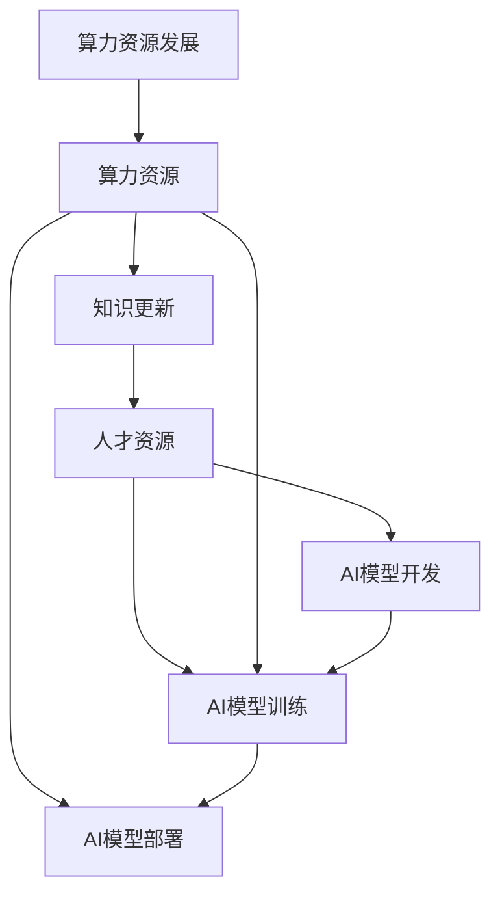

                 

**AI国家战略：人才资源和算力资源体系建设**

**作者：禅与计算机程序设计艺术 / Zen and the Art of Computer Programming**

## 1. 背景介绍

当前，人工智能（AI）已成为推动国家创新和发展的关键驱动力。然而，AI的发展离不开两个关键资源：人才资源和算力资源。本文将深入探讨AI国家战略的核心，即人才资源和算力资源体系的建设。

## 2. 核心概念与联系

### 2.1 人才资源

人才资源是AI发展的基础。AI人才包括AI科学家、工程师、数据科学家、AI伦理学家等。这些人才需要具备多学科的知识，包括计算机科学、数学、统计学、心理学等。

### 2.2 算力资源

算力资源是AI训练和部署的基础。AI模型的训练需要大量的计算资源，而AI应用需要强大的算力支持。算力资源包括服务器、GPU、TPU等。

### 2.3 核心概念联系

人才资源和算力资源是AI发展的两个关键因素，它们密切相关。人才资源负责AI模型的开发和训练，算力资源则为模型的训练和部署提供支持。同时，人才资源需要不断学习和更新知识，以跟上算力资源的发展。



## 3. 核心算法原理 & 具体操作步骤

### 3.1 算法原理概述

AI的核心是算法。本节将简要介绍几种常用的AI算法原理。

### 3.2 算法步骤详解

#### 3.2.1 神经网络

神经网络是一种模拟人类大脑神经元结构的计算模型。其步骤包括：

1. 初始化权重和偏置。
2. 正向传播：输入数据通过神经元层传递，生成输出。
3. 反向传播：计算误差，更新权重和偏置。
4. 重复步骤2和3，直到模型收敛。

#### 3.2.2 改进的迭代算法

改进的迭代算法（如K-均值聚类）的步骤包括：

1. 初始化聚类中心。
2. 将数据点分配到最近的聚类中心。
3. 更新聚类中心。
4. 重复步骤2和3，直到聚类中心不再变化。

### 3.3 算法优缺点

每种算法都有其优缺点。例如，神经网络在处理复杂任务时表现出色，但训练时间长，对数据要求高。改进的迭代算法简单易用，但对初始值敏感，收敛速度慢。

### 3.4 算法应用领域

AI算法广泛应用于各个领域，包括图像识别、自然语言处理、自动驾驶、医疗诊断等。

## 4. 数学模型和公式 & 详细讲解 & 举例说明

### 4.1 数学模型构建

数学模型是AI算法的基础。例如，线性回归模型的数学表达式为：

$$y = wx + b$$

其中，$y$是输出，$x$是输入，$w$是权重，$b$是偏置。

### 4.2 公式推导过程

例如，在神经网络中，激活函数的导数是反向传播的关键。Sigmoid函数的导数推导过程如下：

$$f'(x) = f(x)(1 - f(x))$$

### 4.3 案例分析与讲解

例如，在K-均值聚类算法中，目标函数为：

$$J = \sum_{j=1}^{k} \sum_{x \in S_j} ||x - \mu_j||^2$$

其中，$k$是聚类中心的数量，$S_j$是第$j$个聚类的数据点集合，$\mu_j$是第$j$个聚类的聚类中心。目标是最小化这个目标函数。

## 5. 项目实践：代码实例和详细解释说明

### 5.1 开发环境搭建

本节将使用Python和TensorFlow构建一个简单的神经网络。

### 5.2 源代码详细实现

```python
import tensorflow as tf
from tensorflow.keras.models import Sequential
from tensorflow.keras.layers import Dense

# 定义模型
model = Sequential()
model.add(Dense(32, input_dim=100, activation='relu'))
model.add(Dense(10, activation='softmax'))

# 编译模型
model.compile(loss='categorical_crossentropy', optimizer='adam', metrics=['accuracy'])

# 训练模型
model.fit(X_train, y_train, epochs=10, batch_size=32)
```

### 5.3 代码解读与分析

本代码定义了一个简单的神经网络，使用ReLU激活函数和softmax输出。模型使用Adam优化器和交叉熵损失函数。

### 5.4 运行结果展示

训练好的模型可以用于预测新数据。

## 6. 实际应用场景

AI在各个领域都有广泛的应用。例如，在医疗领域，AI可以帮助医生诊断疾病，在金融领域，AI可以用于风险评估和欺诈检测。

### 6.1 当前应用

当前，AI已经广泛应用于各个领域，包括自动驾驶、语音助手、图像识别等。

### 6.2 未来应用展望

未来，AI将继续渗透到更多领域，包括城市管理、能源管理、环境保护等。AI也将帮助我们解决更复杂的问题，如癌症治疗、气候变化等。

## 7. 工具和资源推荐

### 7.1 学习资源推荐

推荐阅读《深度学习》一书，以及斯坦福大学的在线课程《机器学习》。

### 7.2 开发工具推荐

推荐使用Python和TensorFlow进行AI开发。其他优秀的工具包括PyTorch、Keras等。

### 7.3 相关论文推荐

推荐阅读《神经网络和深度学习》的论文，以及IEEE、ACM等期刊上的相关论文。

## 8. 总结：未来发展趋势与挑战

### 8.1 研究成果总结

本文总结了AI国家战略的核心，即人才资源和算力资源体系的建设。我们讨论了AI算法的原理和应用，并提供了一个简单的项目实践。

### 8.2 未来发展趋势

未来，AI将继续发展，并渗透到更多领域。AI将变得更智能，更自适应，更可解释。同时，AI也将更注重伦理和安全。

### 8.3 面临的挑战

AI发展面临的挑战包括数据安全、算法偏见、就业变化等。我们需要解决这些挑战，以实现AI的可持续发展。

### 8.4 研究展望

未来的研究将集中在AI的可解释性、安全性、伦理等方面。我们也需要开发新的AI算法，以解决更复杂的问题。

## 9. 附录：常见问题与解答

**Q：AI需要哪些资源？**

**A：AI需要人才资源和算力资源。人才资源包括AI科学家、工程师、数据科学家等。算力资源包括服务器、GPU、TPU等。**

**Q：AI算法有哪些？**

**A：AI算法包括神经网络、改进的迭代算法等。每种算法都有其优缺点，适用于不同的领域。**

**Q：AI的未来发展趋势是什么？**

**A：AI的未来发展趋势包括变得更智能、更自适应、更可解释，以及更注重伦理和安全。**

**Q：AI发展面临的挑战是什么？**

**A：AI发展面临的挑战包括数据安全、算法偏见、就业变化等。我们需要解决这些挑战，以实现AI的可持续发展。**

**Q：未来的AI研究方向是什么？**

**A：未来的AI研究方向包括AI的可解释性、安全性、伦理等方面。我们也需要开发新的AI算法，以解决更复杂的问题。**

**作者：禅与计算机程序设计艺术 / Zen and the Art of Computer Programming**

