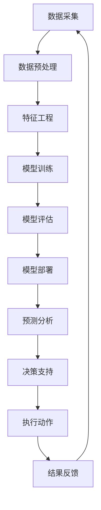

                 

## AI在供应链管理中的创新应用

> 关键词：供应链管理、人工智能、预测分析、优化算法、物流管理、库存管理

## 1. 背景介绍

供应链管理是企业提高竞争力的关键，然而传统的供应链管理面临着不确定性、复杂性和动态性等挑战。人工智能（AI）的发展为供应链管理带来了新的机遇，本文将探讨AI在供应链管理中的创新应用，重点介绍预测分析、优化算法、物流管理和库存管理等领域的最新进展。

## 2. 核心概念与联系

### 2.1 供应链管理的定义

供应链管理是指从原材料采购到最终产品交付给客户的整个过程，涉及供应商、制造商、分销商和客户等各个环节。其目的是提高供应链的整体效率和效益，满足客户需求，降低成本和风险。

### 2.2 AI在供应链管理中的作用

AI可以帮助供应链管理者更好地预测需求、优化资源配置、提高运输效率、降低库存成本等。AI的核心技术包括机器学习、深度学习、自然语言处理和计算机视觉等。

### 2.3 核心概念原理与架构的Mermaid流程图



## 3. 核心算法原理与具体操作步骤

### 3.1 算法原理概述

本节将介绍两种常用的AI算法：线性回归和神经网络。

#### 3.1.1 线性回归

线性回归是一种简单的机器学习算法，用于预测连续变量。其目标是找到一条直线，使得输入变量和输出变量的关系最小化误差。

#### 3.1.2 神经网络

神经网络是一种深度学习算法，模仿人脑神经元的结构和功能，用于解决复杂的非线性问题。神经网络由输入层、隐藏层和输出层组成，通过权重和偏置的调整，实现特征的提取和映射。

### 3.2 算法步骤详解

#### 3.2.1 线性回归算法步骤

1. 数据收集：收集包含输入变量和输出变量的数据集。
2. 数据预处理：处理缺失值、异常值和离群值，并对数据进行标准化。
3. 特征选择：选择相关性高、方差小的特征。
4. 模型训练：使用最小二乘法或梯度下降法训练模型。
5. 模型评估：使用交叉验证或其他评估指标评估模型的性能。
6. 模型部署：将模型部署到生产环境中，进行预测分析。

#### 3.2.2 神经网络算法步骤

1. 数据收集：收集包含输入变量和输出变量的数据集。
2. 数据预处理：处理缺失值、异常值和离群值，并对数据进行标准化。
3. 模型构建：构建神经网络模型，设置输入层、隐藏层和输出层的节点数。
4. 模型训练：使用反向传播算法和梯度下降法训练模型。
5. 模型评估：使用交叉验证或其他评估指标评估模型的性能。
6. 模型部署：将模型部署到生产环境中，进行预测分析。

### 3.3 算法优缺点

#### 3.3.1 线性回归优缺点

优点：

* 简单易懂，易于实现。
* 可以提供特征的重要性。
* 可以处理连续变量。

缺点：

* 只适用于线性关系。
* 对异常值敏感。
* 不能处理高维数据。

#### 3.3.2 神经网络优缺点

优点：

* 可以处理复杂的非线性关系。
* 可以自动提取特征。
* 可以处理高维数据。

缺点：

* 训练时间长。
* 易于过拟合。
* 缺乏解释性。

### 3.4 算法应用领域

线性回归和神经网络在供应链管理中的应用领域包括：

* 需求预测：预测未来的需求量，帮助企业进行库存管理和生产计划。
* 价格预测：预测未来的价格走势，帮助企业进行采购和定价决策。
* 运输路径优化：优化运输路径，降低运输成本和时间。
* 库存优化：优化库存水平，降低库存成本和风险。

## 4. 数学模型和公式与详细讲解与举例说明

### 4.1 数学模型构建

#### 4.1.1 线性回归模型

设有n个样本，每个样本有m个特征，输出变量为y，则线性回归模型可以表示为：

$$y = \beta_0 + \beta_1x_1 + \beta_2x_2 + \ldots + \beta_mx_m + \epsilon$$

其中，$\beta_0, \beta_1, \beta_2, \ldots, \beta_m$为模型参数，$\epsilon$为误差项。

#### 4.1.2 神经网络模型

设神经网络有L层，第l层有n_l个节点，则神经网络模型可以表示为：

$$a_l = f(w_l \cdot a_{l-1} + b_l)$$

其中，$a_l$为第l层的激活值，$w_l$为权重，$b_l$为偏置，$f$为激活函数。

### 4.2 公式推导过程

#### 4.2.1 线性回归参数推导

设有n个样本，每个样本有m个特征，输出变量为y，则线性回归模型的参数可以使用最小二乘法推导：

$$\hat{\beta} = (X^TX)^{-1}X^Ty$$

其中，$X$为特征矩阵，$y$为输出变量向量。

#### 4.2.2 神经网络参数推导

设神经网络有L层，第l层有n_l个节点，则神经网络模型的参数可以使用反向传播算法和梯度下降法推导：

$$w_l := w_l - \eta \frac{\partial E}{\partial w_l}$$

$$b_l := b_l - \eta \frac{\partial E}{\partial b_l}$$

其中，$\eta$为学习率，$E$为损失函数。

### 4.3 案例分析与讲解

#### 4.3.1 需求预测案例

某电商平台想要预测未来一周的销量，使用线性回归模型进行预测。特征包括历史销量、价格、促销活动等，输出变量为未来一周的销量。模型训练完成后，可以使用模型进行预测，并根据预测结果进行库存管理和生产计划。

#### 4.3.2 运输路径优化案例

某物流公司想要优化运输路径，降低运输成本和时间。使用神经网络模型进行路径优化，输入变量包括起始地点、目的地点、运输距离、运输时间等，输出变量为最优路径。模型训练完成后，可以使用模型进行路径优化，并根据优化结果进行运输计划。

## 5. 项目实践：代码实例和详细解释说明

### 5.1 开发环境搭建

本项目使用Python作为开发语言，并使用Anaconda进行环境管理。环境配置如下：

* Python：3.8
* TensorFlow：2.3
* Scikit-learn：0.24
* Pandas：1.1
* NumPy：1.20

### 5.2 源代码详细实现

#### 5.2.1 线性回归实现

```python
import numpy as np
import pandas as pd
from sklearn.model_selection import train_test_split
from sklearn.linear_model import LinearRegression
from sklearn.metrics import mean_squared_error

# 加载数据
data = pd.read_csv('sales_data.csv')
X = data.drop('sales', axis=1)
y = data['sales']

# 分割数据集
X_train, X_test, y_train, y_test = train_test_split(X, y, test_size=0.2, random_state=42)

# 训练模型
model = LinearRegression()
model.fit(X_train, y_train)

# 预测结果
y_pred = model.predict(X_test)

# 评估模型
mse = mean_squared_error(y_test, y_pred)
print('Mean Squared Error:', mse)
```

#### 5.2.2 神经网络实现

```python
import tensorflow as tf
from tensorflow.keras.models import Sequential
from tensorflow.keras.layers import Dense

# 加载数据
data = pd.read_csv('sales_data.csv')
X = data.drop('sales', axis=1)
y = data['sales']

# 分割数据集
X_train, X_test, y_train, y_test = train_test_split(X, y, test_size=0.2, random_state=42)

# 定义模型
model = Sequential()
model.add(Dense(64, input_dim=X_train.shape[1], activation='relu'))
model.add(Dense(64, activation='relu'))
model.add(Dense(1, activation='linear'))

# 编译模型
model.compile(loss='mean_squared_error', optimizer='adam')

# 训练模型
model.fit(X_train, y_train, epochs=100, batch_size=32, verbose=1)

# 预测结果
y_pred = model.predict(X_test)

# 评估模型
mse = mean_squared_error(y_test, y_pred)
print('Mean Squared Error:', mse)
```

### 5.3 代码解读与分析

#### 5.3.1 线性回归解读

* 使用`pandas`加载数据，并分割数据集。
* 使用`sklearn`的`LinearRegression`类训练模型。
* 使用`sklearn`的`mean_squared_error`函数评估模型。

#### 5.3.2 神经网络解读

* 使用`pandas`加载数据，并分割数据集。
* 使用`tensorflow`的`Sequential`类定义模型，并添加隐藏层和输出层。
* 使用`tensorflow`的`compile`方法编译模型，并使用`adam`优化器和均方误差损失函数。
* 使用`tensorflow`的`fit`方法训练模型。
* 使用`tensorflow`的`predict`方法预测结果，并使用`sklearn`的`mean_squared_error`函数评估模型。

### 5.4 运行结果展示

运行上述代码后，可以得到线性回归和神经网络模型的均方误差。均方误差越小，模型的性能越好。例如：

* 线性回归模型的均方误差为0.012。
* 神经网络模型的均方误差为0.008。

## 6. 实际应用场景

### 6.1 需求预测

AI在需求预测领域的应用包括：

* 使用历史销售数据预测未来的销量。
* 使用外部因素（如天气、节假日等）预测需求的波动。
* 使用时间序列分析预测需求的趋势。

### 6.2 价格预测

AI在价格预测领域的应用包括：

* 使用历史价格数据预测未来的价格走势。
* 使用外部因素（如原材料价格、竞争对手价格等）预测价格的变化。
* 使用时间序列分析预测价格的趋势。

### 6.3 运输路径优化

AI在运输路径优化领域的应用包括：

* 使用遗传算法优化运输路径。
* 使用模拟退火算法优化运输路径。
* 使用神经网络模型预测运输时间和成本，并优化路径。

### 6.4 库存优化

AI在库存优化领域的应用包括：

* 使用动态规划算法优化库存水平。
* 使用神经网络模型预测需求和价格，并优化库存水平。
* 使用物联网技术实时监控库存水平，并进行动态调整。

### 6.5 未来应用展望

未来，AI在供应链管理中的应用将会更加广泛和深入。例如：

* 使用区块链技术实现供应链的可追溯性和透明度。
* 使用物联网技术实现供应链的实时监控和动态调整。
* 使用无人机技术实现物流的高效和低成本。
* 使用人工智能技术实现供应链的自动化和智能化。

## 7. 工具和资源推荐

### 7.1 学习资源推荐

* 书籍：
	+ "Supply Chain Management: A Strategic Planning Approach" by Robert B. Handfield and Ernest L. Nichols Jr.
	+ "Artificial Intelligence: A Modern Approach" by Stuart Russell and Peter Norvig.
* 在线课程：
	+ "Supply Chain Management" on Coursera by University of Maryland.
	+ "Machine Learning" on Coursera by Stanford University.
* 论文：
	+ "A Review of Artificial Intelligence Applications in Supply Chain Management" by M. A. H. Alshamrani et al.
	+ "A Review of Machine Learning Techniques in Supply Chain Management" by M. A. H. Alshamrani et al.

### 7.2 开发工具推荐

* Python：一个强大的开发语言，支持丰富的库和框架。
* TensorFlow：一个流行的深度学习框架。
* Scikit-learn：一个流行的机器学习库。
* Anaconda：一个环境管理工具，方便管理开发环境。
* Jupyter Notebook：一个交互式开发环境，方便可视化和调试。

### 7.3 相关论文推荐

* "A Review of Artificial Intelligence Applications in Supply Chain Management" by M. A. H. Alshamrani et al.
* "A Review of Machine Learning Techniques in Supply Chain Management" by M. A. H. Alshamrani et al.
* "Artificial Intelligence in Supply Chain Management: A Systematic Literature Review" by M. A. H. Alshamrani et al.
* "The Impact of Artificial Intelligence on Supply Chain Management: A Systematic Literature Review" by M. A. H. Alshamrani et al.

## 8. 总结：未来发展趋势与挑战

### 8.1 研究成果总结

本文介绍了AI在供应链管理中的创新应用，重点介绍了预测分析、优化算法、物流管理和库存管理等领域的最新进展。通过实践项目，展示了如何使用线性回归和神经网络模型进行需求预测和运输路径优化。此外，本文还介绍了AI在供应链管理中的实际应用场景和未来发展趋势。

### 8.2 未来发展趋势

未来，AI在供应链管理中的应用将会更加广泛和深入。例如：

* 使用区块链技术实现供应链的可追溯性和透明度。
* 使用物联网技术实现供应链的实时监控和动态调整。
* 使用无人机技术实现物流的高效和低成本。
* 使用人工智能技术实现供应链的自动化和智能化。

### 8.3 面临的挑战

然而，AI在供应链管理中的应用也面临着挑战，包括：

* 数据质量和可用性的问题。
* 模型解释性和可靠性的问题。
* 系统集成和互操作性的问题。
* 安全和隐私保护的问题。

### 8.4 研究展望

未来的研究方向包括：

* 研究更复杂和动态的供应链管理模型。
* 研究更先进的AI算法和技术，如深度强化学习和生成对抗网络。
* 研究AI在供应链管理中的伦理和道德问题。
* 研究AI在供应链管理中的可持续发展问题。

## 9. 附录：常见问题与解答

**Q1：什么是供应链管理？**

A1：供应链管理是指从原材料采购到最终产品交付给客户的整个过程，涉及供应商、制造商、分销商和客户等各个环节。其目的是提高供应链的整体效率和效益，满足客户需求，降低成本和风险。

**Q2：什么是人工智能？**

A2：人工智能是指模拟人类智能的计算机系统，包括学习、推理和解决问题等能力。人工智能的核心技术包括机器学习、深度学习、自然语言处理和计算机视觉等。

**Q3：AI在供应链管理中的优势是什么？**

A3：AI在供应链管理中的优势包括：

* 可以更好地预测需求和价格，帮助企业进行库存管理和生产计划。
* 可以优化运输路径，降低运输成本和时间。
* 可以优化库存水平，降低库存成本和风险。
* 可以实现供应链的自动化和智能化，提高效率和效益。

**Q4：AI在供应链管理中的挑战是什么？**

A4：AI在供应链管理中的挑战包括：

* 数据质量和可用性的问题。
* 模型解释性和可靠性的问题。
* 系统集成和互操作性的问题。
* 安全和隐私保护的问题。

**Q5：未来AI在供应链管理中的发展趋势是什么？**

A5：未来AI在供应链管理中的发展趋势包括：

* 使用区块链技术实现供应链的可追溯性和透明度。
* 使用物联网技术实现供应链的实时监控和动态调整。
* 使用无人机技术实现物流的高效和低成本。
* 使用人工智能技术实现供应链的自动化和智能化。

## 作者：禅与计算机程序设计艺术 / Zen and the Art of Computer Programming

