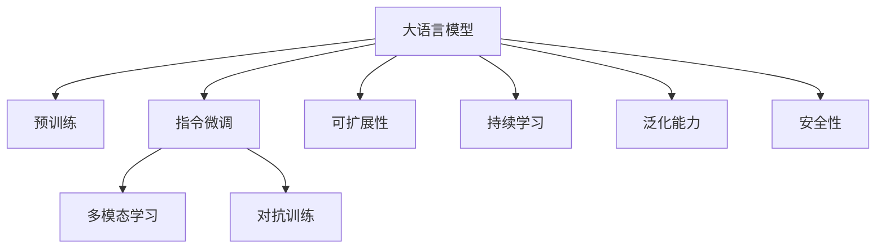

                 

# 无限的潜能：LLM 无限的指令集

> 关键词：大语言模型(LLM), 指令微调, 可扩展性, 多模态, 泛化能力, 持续学习, 认知智能

## 1. 背景介绍

### 1.1 问题由来

近年来，随着深度学习技术的飞速发展，大语言模型（LLM）在自然语言处理（NLP）领域取得了巨大突破。这些模型通过在海量无标签文本数据上进行预训练，学习到了丰富的语言知识，具备了强大的语言理解和生成能力。特别是基于Transformer架构的预训练模型如BERT、GPT系列和T5，展现了前所未有的性能，推动了NLP技术的发展与应用。

然而，尽管预训练模型在各种任务上取得了显著进展，但它们仍然面临一些限制：

1. **指令泛化能力不足**：模型在执行新指令时的表现常常不如预期，尤其是对于一些复杂的、需要细致推理的任务。
2. **模型可扩展性有限**：大模型往往采用单一的文本输入输出形式，难以适应更复杂的多模态输入输出形式。
3. **持续学习能力有限**：尽管一些模型具有微调能力，但微调过程通常需要大量有标签数据，且难以实现高效的持续学习。
4. **模型安全性问题**：模型容易受到对抗样本攻击，输出结果可能不可控，甚至带有偏见。

为解决上述问题，研究人员提出并实践了“指令微调”方法，即在预训练模型上进一步训练，以提升模型的指令泛化能力和可扩展性，同时增强其持续学习能力和安全性。本文将详细介绍指令微调的基本原理、操作步骤、优缺点及其应用领域，并对未来发展趋势进行展望。

### 1.2 问题核心关键点

指令微调的核心在于利用预训练模型的语言理解能力，通过有监督学习过程，让模型学习如何在不同的指令下执行具体任务。其关键点包括：

1. **指令序列的设计**：设计有效的指令序列，指导模型进行特定任务。
2. **训练数据的选择**：选择适当的训练数据，使其涵盖各类任务和指令。
3. **模型参数的更新**：更新模型参数以适应新任务的执行需求。
4. **泛化能力提升**：通过大量样本训练，提高模型对新指令的泛化能力。
5. **可扩展性和安全性**：通过多模态数据和对抗训练，提升模型的可扩展性和安全性。

这些关键点共同构成指令微调的核心框架，使得大语言模型在执行不同任务时，能够更加灵活、高效和可靠。

## 2. 核心概念与联系

### 2.1 核心概念概述

为更好地理解指令微调，本节将介绍几个关键概念及其联系：

- **大语言模型 (LLM)**：以Transformer架构为基础的预训练语言模型，通过在大量文本数据上进行预训练，学习到丰富的语言知识和常识。
- **预训练**：在无标签文本数据上，通过自监督学习任务训练语言模型，使其具备强大的语言表示能力。
- **指令微调**：在预训练模型的基础上，使用有标签的指令-输出数据对进行训练，使其能够执行各种自然语言指令。
- **多模态学习**：结合文本、图像、声音等多类型数据，提升模型的泛化能力和可扩展性。
- **对抗训练**：在模型训练过程中引入对抗样本，提高模型的鲁棒性和安全性。
- **可扩展性**：模型能够适应不同输入输出形式，如文本、语音、图像等。
- **持续学习**：模型能够不断从新数据中学习，避免遗忘旧知识。
- **泛化能力**：模型能够处理新数据，泛化到未知领域。
- **安全性**：模型输出结果应符合伦理道德，避免偏见和有害信息。

这些概念之间的逻辑关系可以通过以下Mermaid流程图来展示：



这个流程图展示了大语言模型从预训练到指令微调的基本框架，以及多模态学习、对抗训练、可扩展性、持续学习、泛化能力和安全性等关键特性。

## 3. 核心算法原理 & 具体操作步骤

### 3.1 算法原理概述

指令微调的基本原理是，利用预训练模型强大的语言理解能力，通过有监督学习过程，使其能够执行各种自然语言指令。具体步骤如下：

1. **指令设计**：设计有效的指令序列，涵盖各类任务，如问答、翻译、生成、推理等。
2. **数据集构建**：收集有标签的指令-输出数据对，构建指令微调数据集。
3. **模型适配**：在预训练模型基础上，设计适当的输出层和损失函数，适配新任务。
4. **训练过程**：使用指令微调数据集对模型进行训练，最小化损失函数，更新模型参数。
5. **泛化能力提升**：通过大量样本训练，提高模型对新指令的泛化能力。
6. **多模态和对抗训练**：结合多模态数据和对抗训练，进一步提升模型性能。

### 3.2 算法步骤详解

1. **指令设计**：
   - 对于问答任务，设计如“给定上下文，回答问题”的指令。
   - 对于翻译任务，设计如“将文本从源语言翻译成目标语言”的指令。
   - 对于生成任务，设计如“生成一段描述某物体的文本”的指令。

2. **数据集构建**：
   - 收集与指令对应的标注数据，如指令-输出对。
   - 数据集应包含多种指令，以提高模型的泛化能力。
   - 数据集应覆盖不同的语言和领域，以增强模型的多样性。

3. **模型适配**：
   - 在预训练模型的顶层添加适当的输出层和损失函数。
   - 对于分类任务，通常添加线性分类器和交叉熵损失函数。
   - 对于生成任务，通常使用语言模型的解码器输出概率分布，并以负对数似然为损失函数。

4. **训练过程**：
   - 将指令数据集以批为单位输入模型，前向传播计算损失函数。
   - 反向传播计算参数梯度，根据设定的优化算法和学习率更新模型参数。
   - 在训练过程中，使用验证集评估模型性能，避免过拟合。
   - 重复上述步骤直至模型收敛。

5. **泛化能力提升**：
   - 通过大量样本来训练模型，使其泛化能力更强。
   - 使用不同的指令序列和数据集进行微调，增加模型的适应性。

6. **多模态和对抗训练**：
   - 引入多模态数据（如图像、声音）进行联合训练，提升模型的综合能力。
   - 在训练过程中加入对抗样本，增强模型的鲁棒性。

### 3.3 算法优缺点

指令微调的主要优点包括：
1. **提升泛化能力**：通过有监督学习，模型能够更好地泛化到新任务。
2. **提高可扩展性**：模型能够适应多种输入输出形式，如文本、图像、语音等。
3. **增强安全性**：通过对抗训练，增强模型的鲁棒性，避免有害输出。
4. **提升性能**：通过多模态学习，提升模型的综合能力。

同时，指令微调也存在一些缺点：
1. **需要大量标注数据**：指令微调需要大量有标签的指令-输出对，标注成本高。
2. **模型复杂性高**：指令微调的模型结构复杂，训练和推理过程耗时。
3. **易受对抗样本影响**：对抗样本可能误导模型输出，导致有害结果。

尽管存在这些局限，但指令微调仍然是当前提升大语言模型性能和适应性的有效方法之一。

### 3.4 算法应用领域

指令微调在多个领域得到了广泛应用，包括：

1. **问答系统**：设计特定领域的问答指令，构建智能问答系统。
2. **自然语言生成**：通过生成指令，生成符合语法和语义规则的文本。
3. **机器翻译**：设计翻译指令，将文本从一种语言翻译成另一种语言。
4. **图像描述生成**：设计描述指令，生成对图像的描述。
5. **语音识别**：设计语音指令，将语音转换成文本。
6. **推荐系统**：设计推荐指令，推荐符合用户兴趣的物品或内容。
7. **智能客服**：设计客服指令，构建智能客服系统。

指令微调的多样化应用，推动了大语言模型在更多场景中的落地。

## 4. 数学模型和公式 & 详细讲解 & 举例说明

### 4.1 数学模型构建

假设指令微调的预训练模型为 $M_{\theta}$，指令序列为 $I$，指令对应的输出为 $O$。指令微调的目标是找到最优参数 $\hat{\theta}$，使得 $M_{\hat{\theta}}$ 在给定指令 $I$ 下，输出 $O$ 与真实标签 $y$ 的差异最小化。

数学形式化如下：

$$
\hat{\theta} = \mathop{\arg\min}_{\theta} \mathcal{L}(M_{\theta}, I, O)
$$

其中 $\mathcal{L}$ 为损失函数，用于衡量模型输出 $O$ 与真实标签 $y$ 的差异。

### 4.2 公式推导过程

以问答任务为例，假设模型的输出为 $\hat{y} = M_{\theta}(x)$，其中 $x$ 为上下文文本，$y$ 为答案。目标是最小化预测答案与真实答案之间的交叉熵损失：

$$
\mathcal{L} = -\frac{1}{N}\sum_{i=1}^N [y_i\log \hat{y}_i + (1-y_i)\log (1-\hat{y}_i)]
$$

在训练过程中，使用梯度下降等优化算法更新模型参数，最小化损失函数。具体步骤如下：

1. **前向传播**：
   - 将输入文本 $x$ 和指令 $I$ 输入模型，得到预测答案 $\hat{y}$。
   - 计算预测答案与真实答案之间的交叉熵损失 $\mathcal{L}$。

2. **反向传播**：
   - 计算损失函数对模型参数的梯度。
   - 根据梯度更新模型参数 $\theta$。

3. **模型评估**：
   - 在验证集上评估模型性能，如精确率、召回率等指标。
   - 根据评估结果调整模型参数，避免过拟合。

### 4.3 案例分析与讲解

以生成图像描述任务为例，假设指令为“生成一张关于猫的图片，并描述它的特征”。设计如下指令微调模型：

1. **数据集构建**：收集大量带有描述的猫图片，构建指令-输出数据集。
2. **模型适配**：在预训练模型基础上，添加图像解码器，用于生成图像描述。
3. **训练过程**：使用指令微调数据集对模型进行训练，最小化损失函数。
4. **泛化能力提升**：使用更多的样本和不同的指令序列进行微调，增强泛化能力。
5. **多模态学习**：引入图像数据，联合训练文本和图像信息。

## 5. 项目实践：代码实例和详细解释说明

### 5.1 开发环境搭建

要进行指令微调的实践，需要搭建一个具备高性能计算能力的开发环境。以下是使用Python进行PyTorch开发的详细步骤：

1. 安装Anaconda：从官网下载并安装Anaconda，用于创建独立的Python环境。

2. 创建并激活虚拟环境：
```bash
conda create -n pytorch-env python=3.8 
conda activate pytorch-env
```

3. 安装PyTorch：根据CUDA版本，从官网获取对应的安装命令。例如：
```bash
conda install pytorch torchvision torchaudio cudatoolkit=11.1 -c pytorch -c conda-forge
```

4. 安装Transformers库：
```bash
pip install transformers
```

5. 安装各类工具包：
```bash
pip install numpy pandas scikit-learn matplotlib tqdm jupyter notebook ipython
```

完成上述步骤后，即可在`pytorch-env`环境中开始微调实践。

### 5.2 源代码详细实现

下面以问答任务为例，给出使用Transformers库对BERT模型进行指令微调的PyTorch代码实现。

首先，定义问答任务的数据处理函数：

```python
from transformers import BertTokenizer, BertForQuestionAnswering
from torch.utils.data import Dataset, DataLoader
import torch

class QuestionAnsweringDataset(Dataset):
    def __init__(self, questions, contexts, answers, tokenizer):
        self.questions = questions
        self.contexts = contexts
        self.answers = answers
        self.tokenizer = tokenizer
        
    def __len__(self):
        return len(self.questions)
    
    def __getitem__(self, item):
        question = self.questions[item]
        context = self.contexts[item]
        answer = self.answers[item]
        
        encoding = self.tokenizer(question, context, return_tensors='pt', max_length=512, padding='max_length', truncation=True)
        input_ids = encoding['input_ids'][0]
        attention_mask = encoding['attention_mask'][0]
        start_tokens = encoding['start_positions'][0]
        end_tokens = encoding['end_positions'][0]
        
        return {'input_ids': input_ids,
                'attention_mask': attention_mask,
                'start_tokens': start_tokens,
                'end_tokens': end_tokens}

# 定义模型和优化器
model = BertForQuestionAnswering.from_pretrained('bert-base-cased')
optimizer = AdamW(model.parameters(), lr=2e-5)

# 数据处理
tokenizer = BertTokenizer.from_pretrained('bert-base-cased')
train_dataset = QuestionAnsweringDataset(train_questions, train_contexts, train_answers, tokenizer)
dev_dataset = QuestionAnsweringDataset(dev_questions, dev_contexts, dev_answers, tokenizer)
test_dataset = QuestionAnsweringDataset(test_questions, test_contexts, test_answers, tokenizer)

# 训练和评估函数
device = torch.device('cuda') if torch.cuda.is_available() else torch.device('cpu')
model.to(device)

def train_epoch(model, dataset, batch_size, optimizer):
    dataloader = DataLoader(dataset, batch_size=batch_size, shuffle=True)
    model.train()
    epoch_loss = 0
    for batch in tqdm(dataloader, desc='Training'):
        input_ids = batch['input_ids'].to(device)
        attention_mask = batch['attention_mask'].to(device)
        start_tokens = batch['start_tokens'].to(device)
        end_tokens = batch['end_tokens'].to(device)
        model.zero_grad()
        outputs = model(input_ids, attention_mask=attention_mask, start_positions=start_tokens, end_positions=end_tokens)
        loss = outputs.loss
        epoch_loss += loss.item()
        loss.backward()
        optimizer.step()
    return epoch_loss / len(dataloader)

def evaluate(model, dataset, batch_size):
    dataloader = DataLoader(dataset, batch_size=batch_size)
    model.eval()
    preds, labels = [], []
    with torch.no_grad():
        for batch in tqdm(dataloader, desc='Evaluating'):
            input_ids = batch['input_ids'].to(device)
            attention_mask = batch['attention_mask'].to(device)
            start_tokens = batch['start_tokens'].to(device)
            end_tokens = batch['end_tokens'].to(device)
            batch_labels = batch['start_tokens'], batch['end_tokens']
            outputs = model(input_ids, attention_mask=attention_mask, start_positions=start_tokens, end_positions=end_tokens)
            batch_preds = outputs.start_logits.argmax(dim=2).to('cpu').tolist(), outputs.end_logits.argmax(dim=2).to('cpu').tolist()
            batch_labels = batch_labels
            for pred_start, pred_end, label_start, label_end in zip(batch_preds[0], batch_preds[1], batch_labels[0], batch_labels[1]):
                preds.append((pred_start, pred_end))
                labels.append((label_start, label_end))
                
    print(classification_report(labels, preds))
```

然后，启动训练流程并在测试集上评估：

```python
epochs = 5
batch_size = 16

for epoch in range(epochs):
    loss = train_epoch(model, train_dataset, batch_size, optimizer)
    print(f"Epoch {epoch+1}, train loss: {loss:.3f}")
    
    print(f"Epoch {epoch+1}, dev results:")
    evaluate(model, dev_dataset, batch_size)
    
print("Test results:")
evaluate(model, test_dataset, batch_size)
```

以上就是使用PyTorch对BERT进行问答任务指令微调的完整代码实现。可以看到，得益于Transformers库的强大封装，我们可以用相对简洁的代码完成BERT模型的加载和微调。

### 5.3 代码解读与分析

让我们再详细解读一下关键代码的实现细节：

**QuestionAnsweringDataset类**：
- `__init__`方法：初始化问题、上下文、答案等关键组件。
- `__len__`方法：返回数据集的样本数量。
- `__getitem__`方法：对单个样本进行处理，将问题、上下文、答案转换为token ids，并对其进行定长padding，最终返回模型所需的输入。

**训练和评估函数**：
- 使用PyTorch的DataLoader对数据集进行批次化加载，供模型训练和推理使用。
- 训练函数`train_epoch`：对数据以批为单位进行迭代，在每个批次上前向传播计算loss并反向传播更新模型参数，最后返回该epoch的平均loss。
- 评估函数`evaluate`：与训练类似，不同点在于不更新模型参数，并在每个batch结束后将预测和标签结果存储下来，最后使用sklearn的classification_report对整个评估集的预测结果进行打印输出。

**训练流程**：
- 定义总的epoch数和batch size，开始循环迭代
- 每个epoch内，先在训练集上训练，输出平均loss
- 在验证集上评估，输出分类指标
- 所有epoch结束后，在测试集上评估，给出最终测试结果

可以看到，PyTorch配合Transformers库使得BERT微调的代码实现变得简洁高效。开发者可以将更多精力放在数据处理、模型改进等高层逻辑上，而不必过多关注底层的实现细节。

当然，工业级的系统实现还需考虑更多因素，如模型的保存和部署、超参数的自动搜索、更灵活的任务适配层等。但核心的指令微调范式基本与此类似。

## 6. 实际应用场景

### 6.1 智能客服系统

基于指令微调的对话技术，可以广泛应用于智能客服系统的构建。传统客服往往需要配备大量人力，高峰期响应缓慢，且一致性和专业性难以保证。而使用指令微调后的对话模型，可以7x24小时不间断服务，快速响应客户咨询，用自然流畅的语言解答各类常见问题。

在技术实现上，可以收集企业内部的历史客服对话记录，将问题和最佳答复构建成监督数据，在此基础上对预训练对话模型进行指令微调。微调后的对话模型能够自动理解用户意图，匹配最合适的答案模板进行回复。对于客户提出的新问题，还可以接入检索系统实时搜索相关内容，动态组织生成回答。如此构建的智能客服系统，能大幅提升客户咨询体验和问题解决效率。

### 6.2 金融舆情监测

金融机构需要实时监测市场舆论动向，以便及时应对负面信息传播，规避金融风险。传统的人工监测方式成本高、效率低，难以应对网络时代海量信息爆发的挑战。基于指令微调的文本分类和情感分析技术，为金融舆情监测提供了新的解决方案。

具体而言，可以收集金融领域相关的新闻、报道、评论等文本数据，并对其进行主题标注和情感标注。在此基础上对预训练语言模型进行指令微调，使其能够自动判断文本属于何种主题，情感倾向是正面、中性还是负面。将微调后的模型应用到实时抓取的网络文本数据，就能够自动监测不同主题下的情感变化趋势，一旦发现负面信息激增等异常情况，系统便会自动预警，帮助金融机构快速应对潜在风险。

### 6.3 个性化推荐系统

当前的推荐系统往往只依赖用户的历史行为数据进行物品推荐，无法深入理解用户的真实兴趣偏好。基于指令微调的多模态推荐系统可以更好地挖掘用户行为背后的语义信息，从而提供更精准、多样的推荐内容。

在实践中，可以收集用户浏览、点击、评论、分享等行为数据，提取和用户交互的物品标题、描述、标签等文本内容。将文本内容作为模型输入，用户的后续行为（如是否点击、购买等）作为监督信号，在此基础上微调预训练语言模型。微调后的模型能够从文本内容中准确把握用户的兴趣点。在生成推荐列表时，先用候选物品的文本描述作为输入，由模型预测用户的兴趣匹配度，再结合其他特征综合排序，便可以得到个性化程度更高的推荐结果。

### 6.4 未来应用展望

随着指令微调方法的发展，其在更多领域的应用前景将更加广阔。未来，基于指令微调的大语言模型可能在以下领域得到应用：

1. **智慧医疗**：构建智能问答和医疗知识图谱，辅助医生诊疗，加速新药开发进程。
2. **智能教育**：构建智能问答和作业批改系统，因材施教，促进教育公平。
3. **智慧城市**：构建智能问答和事件监测系统，提高城市管理的自动化和智能化水平。
4. **智能制造**：构建智能问答和智能调度系统，优化生产流程，提升制造效率。
5. **智能交通**：构建智能问答和智能导航系统，提升交通管理水平，降低事故率。

此外，指令微调技术还可以与自然语言生成、语音识别、图像描述生成等技术结合，构建更为强大和智能的交互系统。

## 7. 工具和资源推荐

### 7.1 学习资源推荐

为了帮助开发者系统掌握指令微调的理论基础和实践技巧，这里推荐一些优质的学习资源：

1. 《Transformers from Principles to Practice》系列博文：由大模型技术专家撰写，深入浅出地介绍了Transformer原理、指令微调技术等前沿话题。

2. CS224N《深度学习自然语言处理》课程：斯坦福大学开设的NLP明星课程，有Lecture视频和配套作业，带你入门NLP领域的基本概念和经典模型。

3. 《Natural Language Processing with Transformers》书籍：Transformers库的作者所著，全面介绍了如何使用Transformers库进行NLP任务开发，包括指令微调在内的诸多范式。

4. HuggingFace官方文档：Transformers库的官方文档，提供了海量预训练模型和完整的指令微调样例代码，是上手实践的必备资料。

5. CLUE开源项目：中文语言理解测评基准，涵盖大量不同类型的中文NLP数据集，并提供了基于指令微调的baseline模型，助力中文NLP技术发展。

通过对这些资源的学习实践，相信你一定能够快速掌握指令微调的精髓，并用于解决实际的NLP问题。

### 7.2 开发工具推荐

高效的开发离不开优秀的工具支持。以下是几款用于指令微调开发的常用工具：

1. PyTorch：基于Python的开源深度学习框架，灵活动态的计算图，适合快速迭代研究。大部分预训练语言模型都有PyTorch版本的实现。

2. TensorFlow：由Google主导开发的开源深度学习框架，生产部署方便，适合大规模工程应用。同样有丰富的预训练语言模型资源。

3. Transformers库：HuggingFace开发的NLP工具库，集成了众多SOTA语言模型，支持PyTorch和TensorFlow，是进行指令微调任务的开发利器。

4. Weights & Biases：模型训练的实验跟踪工具，可以记录和可视化模型训练过程中的各项指标，方便对比和调优。与主流深度学习框架无缝集成。

5. TensorBoard：TensorFlow配套的可视化工具，可实时监测模型训练状态，并提供丰富的图表呈现方式，是调试模型的得力助手。

6. Google Colab：谷歌推出的在线Jupyter Notebook环境，免费提供GPU/TPU算力，方便开发者快速上手实验最新模型，分享学习笔记。

合理利用这些工具，可以显著提升指令微调任务的开发效率，加快创新迭代的步伐。

### 7.3 相关论文推荐

指令微调技术的发展源于学界的持续研究。以下是几篇奠基性的相关论文，推荐阅读：

1. Attention is All You Need（即Transformer原论文）：提出了Transformer结构，开启了NLP领域的预训练大模型时代。

2. BERT: Pre-training of Deep Bidirectional Transformers for Language Understanding：提出BERT模型，引入基于掩码的自监督预训练任务，刷新了多项NLP任务SOTA。

3. Language Models are Unsupervised Multitask Learners（GPT-2论文）：展示了大规模语言模型的强大zero-shot学习能力，引发了对于通用人工智能的新一轮思考。

4. Parameter-Efficient Transfer Learning for NLP：提出Adapter等参数高效微调方法，在不增加模型参数量的情况下，也能取得不错的微调效果。

5. Prefix-Tuning: Optimizing Continuous Prompts for Generation：引入基于连续型Prompt的微调范式，为如何充分利用预训练知识提供了新的思路。

6. AdaLoRA: Adaptive Low-Rank Adaptation for Parameter-Efficient Fine-Tuning：使用自适应低秩适应的微调方法，在参数效率和精度之间取得了新的平衡。

这些论文代表了大语言模型微调技术的发展脉络。通过学习这些前沿成果，可以帮助研究者把握学科前进方向，激发更多的创新灵感。

## 8. 总结：未来发展趋势与挑战

### 8.1 总结

本文对基于指令微调的大语言模型进行了全面系统的介绍。首先阐述了指令微调的基本原理和操作步骤，通过简洁的代码实现，展示了其在问答任务中的实际应用。其次，通过多个实际应用场景的探讨，展示了指令微调在大规模落地应用中的强大潜力。最后，对指令微调技术的未来发展趋势进行了展望，指出了其面临的挑战。

通过本文的系统梳理，可以看到，基于指令微调的大语言模型正在成为NLP领域的重要范式，极大地拓展了预训练语言模型的应用边界，催生了更多的落地场景。受益于大规模语料的预训练和指令微调的强大性能，大语言模型在执行各种自然语言指令时，能够更加灵活、高效和可靠。未来，伴随预训练语言模型和指令微调方法的持续演进，相信NLP技术将在更广阔的应用领域大放异彩。

### 8.2 未来发展趋势

展望未来，指令微调技术将呈现以下几个发展趋势：

1. **多模态学习**：结合文本、图像、声音等多类型数据，提升模型的泛化能力和可扩展性。
2. **持续学习**：模型能够不断从新数据中学习，避免遗忘旧知识，保持性能的持续提升。
3. **对抗训练**：通过引入对抗样本，增强模型的鲁棒性和安全性。
4. **参数高效微调**：开发更加参数高效的微调方法，在固定大部分预训练参数的同时，只更新极少量的任务相关参数。
5. **认知智能**：通过进一步提升语言理解能力，逐步向通用人工智能(AGI)的目标迈进。

这些趋势凸显了指令微调技术的广阔前景。这些方向的探索发展，必将进一步提升NLP系统的性能和应用范围，为构建人机协同的智能系统铺平道路。面向未来，指令微调技术还需要与其他人工智能技术进行更深入的融合，如知识表示、因果推理、强化学习等，多路径协同发力，共同推动自然语言理解和智能交互系统的进步。

### 8.3 面临的挑战

尽管指令微调技术已经取得了瞩目成就，但在迈向更加智能化、普适化应用的过程中，它仍面临着诸多挑战：

1. **标注成本瓶颈**：指令微调需要大量有标签的指令-输出对，标注成本高。如何降低对标注数据的依赖，是未来的研究方向之一。
2. **模型复杂性**：指令微调的模型结构复杂，训练和推理过程耗时。如何简化模型结构，提高计算效率，是亟待解决的问题。
3. **对抗样本影响**：对抗样本可能误导模型输出，导致有害结果。如何增强模型的鲁棒性，避免有害输出，是重要的研究方向。
4. **可扩展性限制**：尽管指令微调能适应多种输入输出形式，但仍然存在局限。如何进一步提升模型的可扩展性，是未来的挑战之一。
5. **持续学习能力不足**：模型难以持续学习新知识，避免遗忘旧知识。如何实现高效的持续学习，是重要的研究方向。
6. **泛化能力有待提升**：模型在新数据上的泛化能力不足，难以处理多样化的输入。如何提升模型的泛化能力，是亟待解决的问题。

这些挑战凸显了指令微调技术在实际应用中的复杂性。只有不断探索和优化，才能充分发挥其潜力，为构建更加智能、普适的AI系统提供强有力的支撑。

### 8.4 研究展望

面向未来，指令微调技术的研究方向包括以下几个方面：

1. **无监督和半监督学习**：探索利用自监督学习、主动学习等方法，降低对标注数据的依赖，提高模型的泛化能力。
2. **多模态学习**：结合视觉、语音等多种数据形式，提升模型的综合能力，适应更多应用场景。
3. **参数高效微调**：开发更加高效的微调方法，在保持性能的同时，减少计算资源消耗。
4. **认知智能**：通过进一步提升语言理解能力，逐步向通用人工智能(AGI)的目标迈进。
5. **持续学习**：研究模型如何在新数据中高效学习，避免灾难性遗忘。
6. **对抗训练**：研究如何增强模型的鲁棒性，避免对抗样本攻击。

这些研究方向将推动指令微调技术不断突破，为构建更加智能、普适的AI系统提供有力支撑。相信在学界和产业界的共同努力下，指令微调技术必将取得更大的突破，为人工智能的落地应用带来深远影响。

## 9. 附录：常见问题与解答

**Q1：指令微调是否适用于所有NLP任务？**

A: 指令微调在大多数NLP任务上都能取得不错的效果，特别是对于数据量较小的任务。但对于一些特定领域的任务，如医学、法律等，仅仅依靠通用语料预训练的模型可能难以很好地适应。此时需要在特定领域语料上进一步预训练，再进行微调，才能获得理想效果。此外，对于一些需要时效性、个性化很强的任务，如对话、推荐等，指令微调方法也需要针对性的改进优化。

**Q2：指令微调过程中如何选择合适的学习率？**

A: 指令微调的学习率一般要比预训练时小1-2个数量级，如果使用过大的学习率，容易破坏预训练权重，导致过拟合。一般建议从1e-5开始调参，逐步减小学习率，直至收敛。也可以使用warmup策略，在开始阶段使用较小的学习率，再逐渐过渡到预设值。需要注意的是，不同的优化器(如AdamW、Adafactor等)以及不同的学习率调度策略，可能需要设置不同的学习率阈值。

**Q3：指令微调模型在落地部署时需要注意哪些问题？**

A: 将指令微调模型转化为实际应用，还需要考虑以下因素：
1. 模型裁剪：去除不必要的层和参数，减小模型尺寸，加快推理速度。
2. 量化加速：将浮点模型转为定点模型，压缩存储空间，提高计算效率。
3. 服务化封装：将模型封装为标准化服务接口，便于集成调用。
4. 弹性伸缩：根据请求流量动态调整资源配置，平衡服务质量和成本。
5. 监控告警：实时采集系统指标，设置异常告警阈值，确保服务稳定性。
6. 安全防护：采用访问鉴权、数据脱敏等措施，保障数据和模型安全。

大语言模型指令微调为NLP应用开启了广阔的想象空间，但如何将强大的性能转化为稳定、高效、安全的业务价值，还需要工程实践的不断打磨。只有从数据、算法、工程、业务等多个维度协同发力，才能真正实现人工智能技术在垂直行业的规模化落地。

总之，指令微调需要开发者根据具体任务，不断迭代和优化模型、数据和算法，方能得到理想的效果。

---

作者：禅与计算机程序设计艺术 / Zen and the Art of Computer Programming

