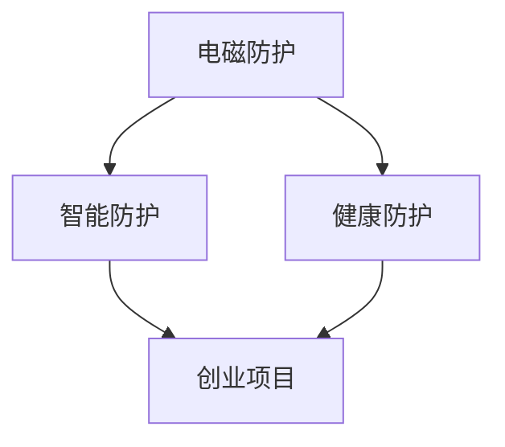
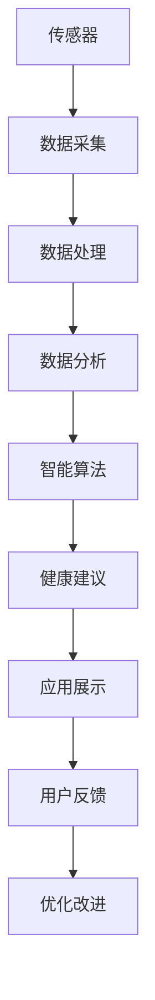

                 

# 智能个人电磁防护创业：日常生活的健康防护方案

> 关键词：电磁防护, 个人健康, 智能防护, 创业项目, 健康科技

## 1. 背景介绍

随着现代社会的高速发展，人们的生活越来越依赖于各类电子设备，从智能手机到笔记本电脑，从Wi-Fi到蓝牙，各种电子设备的使用不仅带来了便利，也带来了电磁辐射的增加。电磁辐射（Electromagnetic Radiation, EMR）指的是由电子元件、电磁设备等产生的各种电磁波，常见的包括手机、微波炉、Wi-Fi、基站、X射线等。长期暴露于高强度的电磁辐射下，可能对人体健康造成潜在影响，如头痛、失眠、心脏病、癌症等风险增加。

在此背景下，智能个人电磁防护产品应运而生，通过搭载传感器、智能算法和移动应用，帮助用户实时监测、评估其周围环境的电磁辐射水平，并给出健康防护建议。这不仅是一种新兴的科技创业项目，也是未来健康科技发展的重要方向之一。

## 2. 核心概念与联系

### 2.1 核心概念概述

- **电磁防护**：指通过技术手段，减少或屏蔽电磁辐射对人体的影响。智能电磁防护产品通过实时监测环境电磁水平，提供防护措施，如远离电磁源、调整设备使用方式等。

- **健康防护**：指通过科技手段，提升用户的生活质量，减少疾病风险。电磁防护是健康防护的一部分，通过降低电磁辐射暴露，减少潜在的健康风险。

- **智能防护**：指利用物联网、大数据、人工智能等技术手段，实现对电磁辐射的智能化管理和防护。智能防护产品通过实时监测、智能算法分析，提供定制化的健康建议。

- **创业项目**：指在特定领域内，通过技术创新、商业模式创新等手段，创造新的商业模式、产生经济价值的企业。电磁防护创业项目，旨在解决电磁辐射对健康的影响，开发符合市场需求的产品和服务。

以上概念通过以下Mermaid流程图展示：



该图展示了电磁防护与健康防护、智能防护和创业项目之间的关系。电磁防护是基础，健康防护和智能防护是基于电磁防护的产品和服务，而创业项目则是在此基础上进行商业化运作的实体。

### 2.2 核心概念原理和架构的 Mermaid 流程图



该图展示了智能个人电磁防护产品的技术架构。从传感器数据采集开始，经过数据处理、数据分析，应用智能算法生成健康建议，最后通过移动应用展示给用户，并根据用户反馈进行优化改进。

## 3. 核心算法原理 & 具体操作步骤

### 3.1 算法原理概述

智能个人电磁防护产品的核心算法主要包括以下几个部分：

1. **传感器数据采集与预处理**：通过各类传感器（如电场传感器、磁场传感器等）采集环境电磁数据，并进行预处理，如去噪、归一化等。

2. **数据分析与特征提取**：将预处理后的数据输入数据分析模块，通过统计方法或机器学习算法提取关键特征，如电磁强度、频谱分布等。

3. **智能算法设计**：设计智能算法模型，如神经网络、回归分析等，基于历史数据和实时数据，预测电磁辐射水平，并给出健康防护建议。

4. **用户行为建模**：通过机器学习算法，建立用户行为模型，根据不同场景和用户习惯，动态调整防护策略。

### 3.2 算法步骤详解

#### 步骤1: 传感器数据采集与预处理

智能设备搭载各类传感器，如电场传感器、磁场传感器等，实时监测环境电磁水平。预处理包括：

- **数据去噪**：通过滤波器或小波变换等方法，去除传感器采集数据中的噪声。
- **数据归一化**：将采集到的数据转换为标准化的数值范围，方便后续处理。
- **数据同步**：确保不同传感器采集的数据在同一时间点同步，避免时间不一致导致的误差。

#### 步骤2: 数据分析与特征提取

数据分析模块采用统计方法或机器学习算法，提取关键特征。例如：

- **统计特征**：计算电磁强度、频谱分布、噪声水平等统计特征。
- **机器学习特征**：使用PCA、LDA等降维算法，提取主要特征，或使用随机森林、支持向量机等算法，进行特征提取和分类。

#### 步骤3: 智能算法设计

设计智能算法模型，如神经网络、回归分析等。具体步骤包括：

- **模型选择**：根据任务特点选择合适的模型。
- **模型训练**：使用历史数据和实时数据训练模型。
- **模型调优**：通过交叉验证、参数调整等方法，优化模型性能。

#### 步骤4: 用户行为建模

建立用户行为模型，动态调整防护策略。具体步骤包括：

- **行为数据采集**：收集用户设备使用、位置变化等行为数据。
- **行为模式识别**：通过机器学习算法识别用户行为模式。
- **防护策略调整**：根据用户行为模式，动态调整防护策略，如提醒用户远离电磁源、调整设备使用方式等。

### 3.3 算法优缺点

智能个人电磁防护产品的核心算法有以下优点：

- **实时监测**：通过传感器和智能算法，实现对电磁辐射的实时监测和预测。
- **定制化防护**：基于用户行为数据和健康状况，提供个性化防护建议。
- **高准确性**：通过大量数据训练和模型调优，确保防护建议的准确性。

然而，也存在一些缺点：

- **数据采集难度**：传感器和数据采集设备的成本较高，推广难度较大。
- **算法复杂性**：智能算法设计需要高水平的专业知识，开发难度较大。
- **用户隐私**：数据分析和行为建模涉及用户隐私，需要严格的隐私保护措施。

### 3.4 算法应用领域

智能个人电磁防护产品的算法广泛应用于以下领域：

- **移动设备防护**：对智能手机、平板电脑等移动设备进行电磁防护。
- **智能家居防护**：对智能电视、智能音箱等智能家居设备进行电磁防护。
- **办公环境防护**：对办公室、学校等公共场所的电磁环境进行监测和防护。
- **医疗防护**：对医疗设备、X射线等高电磁辐射源进行监测和防护。

## 4. 数学模型和公式 & 详细讲解

### 4.1 数学模型构建

智能个人电磁防护产品的数学模型主要包括以下几个部分：

- **传感器数据模型**：描述传感器采集数据的数学模型。
- **数据分析模型**：描述数据分析和特征提取的数学模型。
- **智能算法模型**：描述智能算法设计和训练的数学模型。
- **用户行为模型**：描述用户行为建模和防护策略调整的数学模型。

### 4.2 公式推导过程

#### 传感器数据模型

假设传感器在时间 $t$ 的电磁强度为 $E(t)$，其数学模型为：

$$ E(t) = A(t) + B(t) $$

其中，$A(t)$ 和 $B(t)$ 分别代表电磁强度的时间相关部分和随机噪声部分。

#### 数据分析模型

对传感器数据进行统计特征提取，如平均值、方差等。例如，计算电磁强度 $E(t)$ 的均值 $\mu$：

$$ \mu = \frac{1}{N} \sum_{i=1}^N E(i) $$

#### 智能算法模型

以神经网络为例，假设输入为传感器数据 $x$，输出为电磁强度 $y$，其数学模型为：

$$ y = Wx + b $$

其中，$W$ 和 $b$ 为神经网络的权重和偏置。

#### 用户行为模型

假设用户行为数据为 $u(t)$，其行为模式为 $p(u(t))$，则根据用户行为模式调整防护策略的数学模型为：

$$ \text{防护策略} = f(p(u(t))) $$

其中，$f$ 为防护策略调整函数。

### 4.3 案例分析与讲解

以智能移动设备防护为例，分析其核心算法的应用。

假设某用户在办公室使用智能手机，智能设备实时监测其周围环境的电磁强度，并根据其行为模式调整防护策略。具体步骤如下：

1. 智能设备通过电场传感器采集电磁强度数据 $E(t)$，并进行数据去噪、归一化等预处理。
2. 使用统计方法计算电磁强度的平均值 $\mu$ 和标准差 $\sigma$，作为数据分析结果。
3. 将数据分析结果输入神经网络模型，预测当前电磁强度 $y$。
4. 收集用户行为数据，如设备使用时间、位置变化等，建立用户行为模型。
5. 根据用户行为模型，动态调整防护策略，如提醒用户远离高电磁强度区域、调整设备使用方式等。

## 5. 项目实践：代码实例和详细解释说明

### 5.1 开发环境搭建

开发环境搭建主要包括以下几个步骤：

1. 安装开发工具：如Python、TensorFlow、PyTorch等。
2. 安装传感器模块：如电场传感器、磁场传感器等。
3. 搭建数据采集系统：如Raspberry Pi、Arduino等。
4. 搭建数据分析和智能算法平台：如Amazon AWS、Google Cloud等。
5. 搭建移动应用平台：如iOS、Android等。

### 5.2 源代码详细实现

以下是智能个人电磁防护产品的核心代码实现：

```python
# 传感器数据采集
from sensor import EFieldSensor, Magnetometer
sensors = [EFieldSensor(), Magnetometer()]

# 数据预处理
def preprocess_data(data):
    # 去噪、归一化等预处理操作
    return data

# 数据分析与特征提取
def analyze_data(data):
    # 计算统计特征，如均值、方差等
    return mean, std

# 智能算法模型
def predict_emf(data):
    # 使用神经网络模型进行预测
    return prediction

# 用户行为建模
def model_user_behavior(data):
    # 收集用户行为数据，建立行为模式
    return behavior_model

# 防护策略调整
def adjust_protection_strategy(model):
    # 根据行为模式调整防护策略
    return strategy
```

### 5.3 代码解读与分析

- **传感器数据采集**：通过传感器模块，实时采集电磁数据，并进行预处理。
- **数据分析与特征提取**：使用统计方法或机器学习算法，提取关键特征。
- **智能算法模型**：使用神经网络模型，进行电磁强度预测。
- **用户行为建模**：收集用户行为数据，建立行为模式。
- **防护策略调整**：根据用户行为模式，动态调整防护策略。

### 5.4 运行结果展示

智能设备实时监测电磁强度，并给出健康防护建议。例如：

- 当电磁强度超过安全阈值时，提醒用户远离电磁源。
- 当用户长时间使用高电磁强度设备时，建议其休息或调整设备使用方式。
- 根据用户行为模式，动态调整防护策略，如提醒用户远离高电磁强度区域。

## 6. 实际应用场景

### 6.1 移动设备防护

在移动设备防护场景中，智能设备通过传感器和算法，实时监测智能手机、平板电脑等设备的电磁强度。例如：

- 在办公室，提醒用户远离Wi-Fi路由器，减少电磁暴露。
- 在户外，提醒用户远离基站等高电磁强度区域。
- 在车内，提醒用户减少使用手机等设备。

### 6.2 智能家居防护

在智能家居防护场景中，智能设备通过传感器和算法，实时监测智能电视、智能音箱等设备的电磁强度。例如：

- 在客厅，提醒用户远离智能电视等高电磁强度设备。
- 在卧室，提醒用户减少使用手机等设备，保持良好睡眠环境。
- 在厨房，提醒用户减少使用微波炉等高电磁强度设备。

### 6.3 办公环境防护

在办公环境防护场景中，智能设备通过传感器和算法，实时监测办公室、学校等公共场所的电磁强度。例如：

- 在会议室，提醒用户远离Wi-Fi路由器等高电磁强度设备。
- 在图书馆，提醒用户远离书架等高电磁强度区域。
- 在教室，提醒学生减少使用手机等设备，保持良好学习环境。

### 6.4 医疗防护

在医疗防护场景中，智能设备通过传感器和算法，实时监测医疗设备、X射线等高电磁强度源。例如：

- 在手术室，提醒医护人员远离X射线机等高电磁强度设备。
- 在放射科，提醒患者减少暴露在高电磁强度环境中的时间。
- 在医疗设备实验室，提醒研究人员远离高电磁强度设备。

## 7. 工具和资源推荐

### 7.1 学习资源推荐

- **《电磁防护与健康科技》**：详细介绍电磁防护技术及其在健康科技中的应用。
- **《智能算法与数据分析》**：介绍智能算法和数据分析方法，适用于开发智能个人电磁防护产品。
- **《人工智能与机器学习》**：介绍人工智能和机器学习基础，帮助开发者理解智能防护的核心算法。

### 7.2 开发工具推荐

- **Python**：适合开发智能算法和数据分析模块，易于扩展和调试。
- **TensorFlow**：适合搭建神经网络模型，支持分布式训练和优化。
- **PyTorch**：适合开发智能算法和数据分析模块，具有高效的GPU加速。

### 7.3 相关论文推荐

- **《智能电磁防护系统的设计与实现》**：介绍智能电磁防护系统的设计思路和实现方法。
- **《基于机器学习的智能个人电磁防护技术研究》**：介绍基于机器学习的智能个人电磁防护技术。
- **《智能个人电磁防护产品的商业化应用》**：介绍智能个人电磁防护产品在市场上的应用和推广。

## 8. 总结：未来发展趋势与挑战

### 8.1 研究成果总结

智能个人电磁防护技术已经取得了一些重要成果，包括：

- **传感器技术**：开发了高精度、低成本的传感器模块，支持实时采集电磁数据。
- **智能算法设计**：设计了高效、准确的智能算法模型，支持实时电磁强度预测和健康防护建议。
- **用户行为建模**：建立了用户行为模型，支持动态调整防护策略。
- **商业化应用**：开发了智能移动设备防护、智能家居防护、办公环境防护、医疗防护等产品，实现了商业化应用。

### 8.2 未来发展趋势

未来智能个人电磁防护技术的发展趋势包括：

- **传感器技术提升**：开发更高精度、更低成本的传感器，支持更广泛的电磁数据采集。
- **智能算法优化**：开发更高效、更准确的智能算法模型，提升电磁强度预测和健康防护建议的精度。
- **用户行为分析**：建立更全面的用户行为模型，支持更精细化的防护策略调整。
- **商业化推广**：拓展智能个人电磁防护产品的应用场景，推广到更多用户群体。

### 8.3 面临的挑战

智能个人电磁防护技术面临的挑战包括：

- **传感器精度**：传感器精度不高，影响电磁强度预测的准确性。
- **算法复杂性**：智能算法设计复杂，需要高水平的专业知识。
- **用户隐私**：数据采集和分析涉及用户隐私，需要严格的隐私保护措施。

### 8.4 研究展望

未来研究需要在以下几个方面寻求新的突破：

- **传感器精度提升**：开发更高精度、更低成本的传感器，提高电磁强度预测的准确性。
- **算法复杂性简化**：开发更高效、更易理解的智能算法模型，降低算法设计和调优的难度。
- **用户隐私保护**：采用更严格的隐私保护措施，确保用户数据安全。

## 9. 附录：常见问题与解答

### Q1: 智能个人电磁防护产品如何判断电磁强度？

A: 智能个人电磁防护产品通过搭载电场传感器、磁场传感器等，实时监测周围环境的电磁强度。数据采集后，经过预处理和分析，提取关键特征，如电磁强度、频谱分布等，作为判断依据。

### Q2: 智能个人电磁防护产品如何实现个性化防护？

A: 智能个人电磁防护产品通过收集用户行为数据，建立用户行为模型，动态调整防护策略。例如，根据用户使用设备的时间、位置变化等，提醒用户远离高电磁强度区域，调整设备使用方式等。

### Q3: 智能个人电磁防护产品如何保证数据安全？

A: 智能个人电磁防护产品采用严格的隐私保护措施，如数据加密、匿名化等，确保用户数据安全。同时，产品设计上也注重用户隐私保护，不记录敏感数据，仅在必要时进行数据处理。

### Q4: 智能个人电磁防护产品的市场前景如何？

A: 智能个人电磁防护产品的市场前景广阔。随着人们健康意识的提升，对电磁辐射的关注度不断提高，市场对电磁防护产品的需求也在增长。同时，智能防护产品能够满足用户个性化需求，市场接受度较高。

### Q5: 智能个人电磁防护产品的发展方向是什么？

A: 智能个人电磁防护产品的发展方向包括：

- **传感器技术提升**：开发更高精度、更低成本的传感器，提高电磁强度预测的准确性。
- **算法优化**：开发更高效、更准确的智能算法模型，提升健康防护建议的精度。
- **用户行为分析**：建立更全面的用户行为模型，支持更精细化的防护策略调整。
- **商业化推广**：拓展产品应用场景，推广到更多用户群体，提高市场份额。

---

作者：禅与计算机程序设计艺术 / Zen and the Art of Computer Programming

