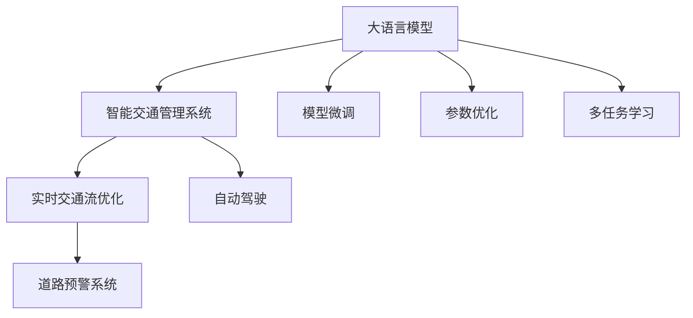

                 

# 智能交通管理：LLM优化城市交通流

## 1. 背景介绍

随着城市化进程的不断加快，全球各大城市均面临着日益严峻的交通拥堵问题。据统计，每年全球城市因交通拥堵导致的直接经济损失高达数千亿美元。解决这一问题，需要构建高效、智能的交通管理系统，实时掌握交通状态，动态调整交通信号，优化交通流。

智能交通管理系统(ITS, Intelligent Transportation Systems)，是一种结合了现代信息技术和交通工程学的新型交通管理方式。它通过对交通数据进行实时分析，动态调整交通信号和行车路径，达到缓解交通压力、提高通行效率的目的。然而，现有的智能交通系统主要依赖于规则化的信号控制和静态的地图数据，难以应对交通流动态变化的复杂场景。

近年来，深度学习技术的崛起为智能交通管理带来了新的希望。大语言模型(LLM, Large Language Models)作为新一代的深度学习技术，凭借其在自然语言处理、理解等方面的强大能力，正在逐渐渗透到智能交通领域。本文将聚焦于大语言模型在智能交通管理中的应用，阐述其核心原理与操作步骤，分析其优缺点与具体应用场景，展望未来发展趋势与挑战。

## 2. 核心概念与联系

### 2.1 核心概念概述

为了更好地理解大语言模型在智能交通中的应用，本节将介绍几个关键概念：

- 大语言模型(LLM)：指基于深度学习架构，能够处理自然语言输入和输出的模型，如GPT-3、BERT等。通过大规模无标签文本数据预训练，学习通用语言表示，具备强大的语言理解和生成能力。

- 智能交通管理系统(ITS)：结合现代信息技术与交通工程学的智能交通管理方式。通过对交通数据进行实时分析，动态调整交通信号和行车路径，达到缓解交通压力、提高通行效率的目的。

- 自动驾驶(Autonomous Driving)：车辆通过车载传感器、GPS定位等技术，结合深度学习算法实现自主驾驶。自动驾驶技术可以进一步提升交通系统的智能化水平，减少人为因素导致的交通事故。

- 实时交通流优化：在城市交通网络中，通过实时获取交通数据，动态调整信号灯和行驶路径，达到优化交通流、减少拥堵的目的。

- 道路预警系统：利用图像识别、语音识别等技术，实时监测道路状况，提前预警交通事故、违规行为等潜在危险，提高行车安全。

这些核心概念之间的逻辑关系可以通过以下Mermaid流程图来展示：



这个流程图展示了LLM与ITS系统的关系，以及LLM在智能交通领域的不同应用场景：

1. 大语言模型通过预训练获得语言理解能力，可用于智能交通管理系统。
2. 实时交通流优化和自动驾驶等应用，通过微调和学习优化模型，提升决策效果。
3. 道路预警系统利用大语言模型的理解能力，识别潜在危险，提升行车安全。
4. 模型微调、参数优化、多任务学习等方法，提升大语言模型在智能交通领域的表现。

## 3. 核心算法原理 & 具体操作步骤

### 3.1 算法原理概述

大语言模型在智能交通管理中的应用，主要是通过预训练和微调实现的。具体步骤如下：

**Step 1: 收集交通数据**
- 利用城市交通监控摄像头、传感器、交通流量监测设备等，实时收集交通数据，包括车辆位置、车速、路线、信号灯状态等信息。

**Step 2: 数据预处理**
- 对收集到的交通数据进行清洗和标准化处理，去除噪声，填补缺失值。

**Step 3: 构建模型输入**
- 将交通数据转换为模型可接受的输入格式，如图像、文本等。

**Step 4: 模型预训练**
- 使用大规模无标签交通数据，对大语言模型进行预训练，学习通用交通特征。

**Step 5: 模型微调**
- 利用标注数据，对预训练模型进行微调，适应特定的智能交通任务，如交通流优化、自动驾驶等。

**Step 6: 模型部署与监控**
- 将微调后的模型部署到交通管理系统中，实时监测交通状况，动态调整信号灯和行驶路径。
- 对模型性能进行实时监控，确保其稳定性和准确性。

### 3.2 算法步骤详解

以交通流优化为例，大语言模型的具体操作步骤如下：

**Step 1: 数据收集**
- 利用传感器、摄像头等设备，实时获取城市各路口的交通流量数据，包括车辆类型、车速、方向等信息。

**Step 2: 数据预处理**
- 对收集到的交通数据进行清洗，去除异常值，填补缺失值，确保数据完整性和准确性。
- 将数据按时间序列进行划分，以备后续模型训练。

**Step 3: 模型构建**
- 构建大语言模型的输入输出接口，将交通数据转换为模型可接受的格式，如文本、图像等。
- 设计模型结构，选择合适的任务适配层，如分类器、回归器等。

**Step 4: 模型预训练**
- 使用大规模无标签交通数据，对模型进行预训练，学习通用的交通特征。
- 例如，可以使用自监督学习方法，如掩码语言模型、对抗性训练等，提升模型的泛化能力。

**Step 5: 模型微调**
- 利用标注数据，对预训练模型进行微调，优化其在特定任务上的性能。
- 例如，可以使用梯度下降算法，最小化预测误差与实际值之间的差异。

**Step 6: 模型部署与监控**
- 将微调后的模型部署到交通管理系统中，实时监测交通状况，动态调整信号灯和行驶路径。
- 通过实时监控，确保模型性能稳定，及时发现并解决模型缺陷。

### 3.3 算法优缺点

大语言模型在智能交通管理中的应用，具有以下优点：

- 实时性：大语言模型能够实时处理大量交通数据，快速作出决策，提高交通管理系统的响应速度。
- 灵活性：模型能够根据实时数据，动态调整信号灯和行驶路径，适应交通流变化。
- 鲁棒性：模型经过大规模无标签数据的预训练，具备较强的泛化能力，适应多种交通场景。

同时，也存在以下缺点：

- 计算资源消耗大：大语言模型需要大量的计算资源，特别是GPU、TPU等高性能设备，初期部署成本高。
- 数据质量依赖大：模型性能受交通数据质量影响较大，数据清洗、标注等环节复杂耗时。
- 模型可解释性差：大语言模型的内部机制复杂，难以解释其决策过程，缺乏可解释性。
- 安全隐患多：模型可能学习到有害信息，甚至被恶意利用，导致安全问题。

### 3.4 算法应用领域

大语言模型在智能交通管理中的应用，涵盖多个领域，具体包括：

- **实时交通流优化**：通过实时分析交通数据，动态调整信号灯和行驶路径，缓解交通压力，提高通行效率。
- **自动驾驶**：利用大语言模型理解交通规则，辅助自动驾驶车辆进行决策，提高行车安全和效率。
- **道路预警系统**：通过图像识别、语音识别等技术，实时监测道路状况，提前预警交通事故、违规行为等潜在危险。
- **智能导航系统**：利用大语言模型理解用户意图，提供实时导航建议，提高出行效率。
- **智能停车系统**：通过大语言模型识别停车需求，动态调整停车位资源，提升停车管理效率。

## 4. 数学模型和公式 & 详细讲解 & 举例说明

### 4.1 数学模型构建

本节将使用数学语言对大语言模型在智能交通中的应用进行更加严格的刻画。

假设交通数据集为 $\{(x_i, y_i)\}_{i=1}^N$，其中 $x_i$ 为输入（交通数据），$y_i$ 为输出（信号灯状态）。定义模型的损失函数为 $\mathcal{L}(\theta)$，则优化目标为：

$$
\theta^* = \mathop{\arg\min}_{\theta} \mathcal{L}(\theta)
$$

其中 $\theta$ 为模型参数，$\mathcal{L}$ 为损失函数，例如交叉熵损失、均方误差损失等。

### 4.2 公式推导过程

以交叉熵损失为例，假设模型在输入 $x_i$ 上的预测输出为 $\hat{y}=M_{\theta}(x_i)$，真实标签为 $y_i$，则交叉熵损失函数为：

$$
\ell(M_{\theta}(x_i),y_i) = -[y_i\log \hat{y} + (1-y_i)\log(1-\hat{y})]
$$

将其代入损失函数，得：

$$
\mathcal{L}(\theta) = -\frac{1}{N}\sum_{i=1}^N [y_i\log M_{\theta}(x_i)+(1-y_i)\log(1-M_{\theta}(x_i))]
$$

在得到损失函数后，使用梯度下降等优化算法，最小化损失函数，更新模型参数 $\theta$。

### 4.3 案例分析与讲解

以交通流优化为例，使用大语言模型对模型进行微调的具体过程如下：

**Step 1: 数据准备**
- 收集城市交通数据，包括车辆位置、速度、路线、信号灯状态等。
- 对数据进行清洗和标准化处理。

**Step 2: 构建模型输入**
- 将交通数据转换为模型可接受的格式，如文本、图像等。
- 设计模型的任务适配层，如分类器、回归器等。

**Step 3: 模型预训练**
- 使用大规模无标签交通数据，对模型进行预训练，学习通用的交通特征。
- 例如，可以使用掩码语言模型、对抗性训练等方法。

**Step 4: 模型微调**
- 利用标注数据，对预训练模型进行微调，优化其在交通流优化任务上的性能。
- 例如，可以使用梯度下降算法，最小化预测误差与实际值之间的差异。

**Step 5: 模型部署与监控**
- 将微调后的模型部署到交通管理系统中，实时监测交通状况，动态调整信号灯和行驶路径。
- 通过实时监控，确保模型性能稳定，及时发现并解决模型缺陷。

## 5. 项目实践：代码实例和详细解释说明

### 5.1 开发环境搭建

在进行智能交通管理的大语言模型实践前，我们需要准备好开发环境。以下是使用Python进行PyTorch开发的环境配置流程：

1. 安装Anaconda：从官网下载并安装Anaconda，用于创建独立的Python环境。

2. 创建并激活虚拟环境：
```bash
conda create -n traffic-env python=3.8 
conda activate traffic-env
```

3. 安装PyTorch：根据CUDA版本，从官网获取对应的安装命令。例如：
```bash
conda install pytorch torchvision torchaudio cudatoolkit=11.1 -c pytorch -c conda-forge
```

4. 安装Transformers库：
```bash
pip install transformers
```

5. 安装各类工具包：
```bash
pip install numpy pandas scikit-learn matplotlib tqdm jupyter notebook ipython
```

完成上述步骤后，即可在`traffic-env`环境中开始智能交通管理的实践。

### 5.2 源代码详细实现

下面以交通流优化为例，给出使用Transformers库对BERT模型进行微调的PyTorch代码实现。

首先，定义交通流优化任务的数据处理函数：

```python
from transformers import BertTokenizer
from torch.utils.data import Dataset
import torch

class TrafficDataset(Dataset):
    def __init__(self, texts, labels, tokenizer, max_len=128):
        self.texts = texts
        self.labels = labels
        self.tokenizer = tokenizer
        self.max_len = max_len
        
    def __len__(self):
        return len(self.texts)
    
    def __getitem__(self, item):
        text = self.texts[item]
        label = self.labels[item]
        
        encoding = self.tokenizer(text, return_tensors='pt', max_length=self.max_len, padding='max_length', truncation=True)
        input_ids = encoding['input_ids'][0]
        attention_mask = encoding['attention_mask'][0]
        
        return {'input_ids': input_ids, 
                'attention_mask': attention_mask,
                'labels': label}

# 标签与id的映射
label2id = {'stop': 0, 'go': 1}
id2label = {v: k for k, v in label2id.items()}

# 创建dataset
tokenizer = BertTokenizer.from_pretrained('bert-base-cased')

train_dataset = TrafficDataset(train_texts, train_labels, tokenizer)
dev_dataset = TrafficDataset(dev_texts, dev_labels, tokenizer)
test_dataset = TrafficDataset(test_texts, test_labels, tokenizer)
```

然后，定义模型和优化器：

```python
from transformers import BertForTokenClassification, AdamW

model = BertForTokenClassification.from_pretrained('bert-base-cased', num_labels=len(label2id))

optimizer = AdamW(model.parameters(), lr=2e-5)
```

接着，定义训练和评估函数：

```python
from torch.utils.data import DataLoader
from tqdm import tqdm
from sklearn.metrics import classification_report

device = torch.device('cuda') if torch.cuda.is_available() else torch.device('cpu')
model.to(device)

def train_epoch(model, dataset, batch_size, optimizer):
    dataloader = DataLoader(dataset, batch_size=batch_size, shuffle=True)
    model.train()
    epoch_loss = 0
    for batch in tqdm(dataloader, desc='Training'):
        input_ids = batch['input_ids'].to(device)
        attention_mask = batch['attention_mask'].to(device)
        labels = batch['labels'].to(device)
        model.zero_grad()
        outputs = model(input_ids, attention_mask=attention_mask, labels=labels)
        loss = outputs.loss
        epoch_loss += loss.item()
        loss.backward()
        optimizer.step()
    return epoch_loss / len(dataloader)

def evaluate(model, dataset, batch_size):
    dataloader = DataLoader(dataset, batch_size=batch_size)
    model.eval()
    preds, labels = [], []
    with torch.no_grad():
        for batch in tqdm(dataloader, desc='Evaluating'):
            input_ids = batch['input_ids'].to(device)
            attention_mask = batch['attention_mask'].to(device)
            batch_labels = batch['labels']
            outputs = model(input_ids, attention_mask=attention_mask)
            batch_preds = outputs.logits.argmax(dim=2).to('cpu').tolist()
            batch_labels = batch_labels.to('cpu').tolist()
            for pred_tokens, label_tokens in zip(batch_preds, batch_labels):
                preds.append(pred_tokens[:len(label_tokens)])
                labels.append(label_tokens)
                
    print(classification_report(labels, preds))
```

最后，启动训练流程并在测试集上评估：

```python
epochs = 5
batch_size = 16

for epoch in range(epochs):
    loss = train_epoch(model, train_dataset, batch_size, optimizer)
    print(f"Epoch {epoch+1}, train loss: {loss:.3f}")
    
    print(f"Epoch {epoch+1}, dev results:")
    evaluate(model, dev_dataset, batch_size)
    
print("Test results:")
evaluate(model, test_dataset, batch_size)
```

以上就是使用PyTorch对BERT进行交通流优化任务微调的完整代码实现。可以看到，得益于Transformers库的强大封装，我们可以用相对简洁的代码完成BERT模型的加载和微调。

### 5.3 代码解读与分析

让我们再详细解读一下关键代码的实现细节：

**TrafficDataset类**：
- `__init__`方法：初始化文本、标签、分词器等关键组件。
- `__len__`方法：返回数据集的样本数量。
- `__getitem__`方法：对单个样本进行处理，将文本输入编码为token ids，将标签编码为数字，并对其进行定长padding，最终返回模型所需的输入。

**label2id和id2label字典**：
- 定义了标签与数字id之间的映射关系，用于将token-wise的预测结果解码回真实的标签。

**训练和评估函数**：
- 使用PyTorch的DataLoader对数据集进行批次化加载，供模型训练和推理使用。
- 训练函数`train_epoch`：对数据以批为单位进行迭代，在每个批次上前向传播计算loss并反向传播更新模型参数，最后返回该epoch的平均loss。
- 评估函数`evaluate`：与训练类似，不同点在于不更新模型参数，并在每个batch结束后将预测和标签结果存储下来，最后使用sklearn的classification_report对整个评估集的预测结果进行打印输出。

**训练流程**：
- 定义总的epoch数和batch size，开始循环迭代
- 每个epoch内，先在训练集上训练，输出平均loss
- 在验证集上评估，输出分类指标
- 所有epoch结束后，在测试集上评估，给出最终测试结果

可以看到，PyTorch配合Transformers库使得BERT微调的代码实现变得简洁高效。开发者可以将更多精力放在数据处理、模型改进等高层逻辑上，而不必过多关注底层的实现细节。

当然，工业级的系统实现还需考虑更多因素，如模型的保存和部署、超参数的自动搜索、更灵活的任务适配层等。但核心的微调范式基本与此类似。

## 6. 实际应用场景

### 6.1 智能交通信号灯控制

智能交通信号灯控制系统是城市交通管理的重要组成部分。通过实时监测交通流量，动态调整信号灯的周期和相位，可以有效缓解交通压力，提高通行效率。

大语言模型可以应用于交通信号灯的控制中，通过实时分析交通数据，动态调整信号灯的周期和相位，以达到优化交通流的效果。例如，可以使用微调后的模型预测某个路口的通行情况，根据预测结果调整信号灯状态，以适应实时交通需求。

### 6.2 智能导航与路线规划

随着城市道路的不断扩张，如何高效规划行车路线，避免拥堵，成为智能交通管理的另一大挑战。

大语言模型可以应用于智能导航系统中，通过实时分析交通数据，动态调整行车路线，以达到最优的导航效果。例如，可以使用微调后的模型预测某条路线的拥堵情况，根据预测结果建议替代路线，以避开拥堵区域。

### 6.3 智能停车管理

城市停车问题也是交通管理中的一个重要课题。大语言模型可以应用于智能停车管理中，通过实时分析停车位状态，动态调整停车位资源，以达到高效的管理效果。

例如，可以使用微调后的模型预测某个区域的停车位需求，根据需求调整停车位资源，以减少停车等待时间。同时，还可以通过语音交互，实时查询停车位信息，提升用户的使用体验。

### 6.4 未来应用展望

随着大语言模型和微调方法的不断发展，其在智能交通管理中的应用前景广阔，未来可探索的方向包括：

- **实时动态调整**：利用大语言模型实时分析交通数据，动态调整信号灯、路线、停车位等交通元素，以达到最优的交通管理效果。
- **多模态融合**：将图像识别、语音识别等技术结合大语言模型，提升交通管理系统的感知能力和决策效率。
- **多任务协同**：将智能交通管理中的多个任务（如交通流优化、自动驾驶、智能导航等）协同优化，提升系统的整体性能。
- **异构数据融合**：将不同类型的交通数据（如交通流量、气象数据、社会经济数据等）融合，提升交通管理系统的智能水平。
- **跨领域迁移学习**：将智能交通管理中的经验迁移到其他领域（如智慧医疗、智能制造等），提升系统的通用性和适应性。

## 7. 工具和资源推荐

### 7.1 学习资源推荐

为了帮助开发者系统掌握大语言模型在智能交通中的应用，这里推荐一些优质的学习资源：

1. 《Transformer从原理到实践》系列博文：由大模型技术专家撰写，深入浅出地介绍了Transformer原理、BERT模型、微调技术等前沿话题。

2. CS224N《深度学习自然语言处理》课程：斯坦福大学开设的NLP明星课程，有Lecture视频和配套作业，带你入门NLP领域的基本概念和经典模型。

3. 《Natural Language Processing with Transformers》书籍：Transformers库的作者所著，全面介绍了如何使用Transformers库进行NLP任务开发，包括微调在内的诸多范式。

4. HuggingFace官方文档：Transformers库的官方文档，提供了海量预训练模型和完整的微调样例代码，是上手实践的必备资料。

5. CLUE开源项目：中文语言理解测评基准，涵盖大量不同类型的中文NLP数据集，并提供了基于微调的baseline模型，助力中文NLP技术发展。

通过对这些资源的学习实践，相信你一定能够快速掌握大语言模型在智能交通领域的应用，并用于解决实际的交通问题。

### 7.2 开发工具推荐

高效的开发离不开优秀的工具支持。以下是几款用于智能交通管理的大语言模型微调开发的常用工具：

1. PyTorch：基于Python的开源深度学习框架，灵活动态的计算图，适合快速迭代研究。大部分预训练语言模型都有PyTorch版本的实现。

2. TensorFlow：由Google主导开发的开源深度学习框架，生产部署方便，适合大规模工程应用。同样有丰富的预训练语言模型资源。

3. Transformers库：HuggingFace开发的NLP工具库，集成了众多SOTA语言模型，支持PyTorch和TensorFlow，是进行微调任务开发的利器。

4. Weights & Biases：模型训练的实验跟踪工具，可以记录和可视化模型训练过程中的各项指标，方便对比和调优。与主流深度学习框架无缝集成。

5. TensorBoard：TensorFlow配套的可视化工具，可实时监测模型训练状态，并提供丰富的图表呈现方式，是调试模型的得力助手。

6. Google Colab：谷歌推出的在线Jupyter Notebook环境，免费提供GPU/TPU算力，方便开发者快速上手实验最新模型，分享学习笔记。

合理利用这些工具，可以显著提升智能交通管理的大语言模型微调任务的开发效率，加快创新迭代的步伐。

### 7.3 相关论文推荐

大语言模型在智能交通管理中的应用研究，近年来逐渐兴起。以下是几篇奠基性的相关论文，推荐阅读：

1. Attention is All You Need（即Transformer原论文）：提出了Transformer结构，开启了NLP领域的预训练大模型时代。

2. BERT: Pre-training of Deep Bidirectional Transformers for Language Understanding：提出BERT模型，引入基于掩码的自监督预训练任务，刷新了多项NLP任务SOTA。

3. Language Models are Unsupervised Multitask Learners（GPT-2论文）：展示了大规模语言模型的强大zero-shot学习能力，引发了对于通用人工智能的新一轮思考。

4. Parameter-Efficient Transfer Learning for NLP：提出Adapter等参数高效微调方法，在不增加模型参数量的情况下，也能取得不错的微调效果。

5. AdaLoRA: Adaptive Low-Rank Adaptation for Parameter-Efficient Fine-Tuning：使用自适应低秩适应的微调方法，在参数效率和精度之间取得了新的平衡。

6. Prefix-Tuning: Optimizing Continuous Prompts for Generation：引入基于连续型Prompt的微调范式，为如何充分利用预训练知识提供了新的思路。

这些论文代表了大语言模型在智能交通领域的发展脉络。通过学习这些前沿成果，可以帮助研究者把握学科前进方向，激发更多的创新灵感。

## 8. 总结：未来发展趋势与挑战

### 8.1 总结

本文对大语言模型在智能交通管理中的应用进行了全面系统的介绍。首先阐述了智能交通管理的发展现状和面临的挑战，明确了大语言模型在智能交通中的作用和意义。其次，从原理到实践，详细讲解了大语言模型在交通流优化、自动驾驶、智能导航等任务中的微调操作步骤。同时，分析了大语言模型在智能交通应用中的优缺点与具体应用场景，展望了未来发展趋势与挑战。

通过本文的系统梳理，可以看到，大语言模型在智能交通管理中的应用，为城市交通管理带来了新的希望，显著提升了交通系统的智能化水平。未来，随着大语言模型和微调方法的不断演进，智能交通系统必将迎来新的突破，为人类社会的可持续发展做出更大贡献。

### 8.2 未来发展趋势

展望未来，大语言模型在智能交通管理中的应用将呈现以下几个发展趋势：

- **实时性进一步提升**：利用大语言模型实时处理交通数据，动态调整交通信号和行驶路径，进一步提高交通管理系统的响应速度和效率。
- **跨领域迁移能力增强**：大语言模型通过多任务学习，具备更强的跨领域迁移能力，可以在不同交通场景中通用。
- **多模态融合成为常态**：智能交通管理中引入图像识别、语音识别等技术，与大语言模型结合，提升感知能力和决策效率。
- **知识图谱与规则库的引入**：将符号化的先验知识与神经网络模型结合，提升交通管理系统的智能水平和可信度。
- **模型鲁棒性和安全性提升**：通过对抗训练、正则化等技术，提升模型的鲁棒性和安全性，确保系统的稳定运行。

### 8.3 面临的挑战

尽管大语言模型在智能交通管理中的应用取得了初步成功，但在迈向更加智能化、普适化应用的过程中，仍面临诸多挑战：

- **数据质量问题**：智能交通管理依赖大量的交通数据，数据质量直接影响模型性能。如何确保数据完整性、准确性，是未来研究的重要课题。
- **计算资源需求高**：大语言模型需要大量的计算资源，初期部署成本高，难以在每个城市广泛应用。
- **模型解释性和安全性不足**：大语言模型内部机制复杂，缺乏可解释性，难以理解和调试。同时，模型可能学习到有害信息，甚至被恶意利用，带来安全隐患。
- **跨领域迁移难度大**：大语言模型在各个领域之间迁移时，可能需要大量新数据和微调，难度较大。
- **多任务协同复杂**：智能交通管理涉及多个任务（如交通流优化、自动驾驶、智能导航等），如何协同优化，提升整体性能，是一个复杂的系统工程。

### 8.4 研究展望

面对智能交通管理面临的挑战，未来的研究需要在以下几个方面寻求新的突破：

- **数据增强与数据治理**：利用数据增强技术，提高交通数据的完整性和准确性，同时建立数据治理体系，确保数据安全。
- **计算资源优化**：研究轻量级模型结构和高效训练算法，降低对计算资源的需求，推动模型在大规模部署中的应用。
- **模型解释性与安全性改进**：引入可解释性技术，提升模型的透明性和可信度，同时建立模型伦理审查机制，确保安全性。
- **多任务协同优化**：研究多任务学习与协同优化方法，提升各任务之间的协同效果，提升系统的整体性能。
- **知识融合与迁移学习**：将符号化的先验知识与神经网络模型结合，提升交通管理系统的智能水平和跨领域迁移能力。

这些研究方向将推动大语言模型在智能交通管理中的应用，进一步提升交通系统的智能化水平，助力城市交通管理的可持续发展。

## 9. 附录：常见问题与解答

**Q1：大语言模型在智能交通管理中的作用是什么？**

A: 大语言模型通过预训练和微调，具备强大的自然语言理解与生成能力。在智能交通管理中，大语言模型可以应用于交通流优化、自动驾驶、智能导航等多个领域，提升交通系统的智能化水平和运行效率。

**Q2：大语言模型在智能交通管理中需要哪些数据？**

A: 大语言模型在智能交通管理中需要多种类型的数据，包括交通流量数据、信号灯状态数据、车辆位置数据、天气数据、社会经济数据等。这些数据用于训练模型，并实时输入模型进行动态调整。

**Q3：大语言模型在智能交通管理中如何进行微调？**

A: 大语言模型在智能交通管理中需要进行微调，以适应特定的交通管理任务。具体步骤如下：
1. 收集标注数据，构建训练集和验证集。
2. 定义模型结构和损失函数，选择合适的优化算法。
3. 使用标注数据对模型进行微调，优化其在特定任务上的性能。
4. 部署微调后的模型，实时监测交通数据，动态调整交通信号和行驶路径。

**Q4：大语言模型在智能交通管理中面临哪些挑战？**

A: 大语言模型在智能交通管理中面临以下挑战：
1. 数据质量问题：数据完整性、准确性直接影响模型性能。
2. 计算资源需求高：模型需要大量的计算资源，初期部署成本高。
3. 模型解释性和安全性不足：缺乏可解释性，可能存在有害信息。
4. 跨领域迁移难度大：各领域之间迁移时，可能需要大量新数据和微调。
5. 多任务协同复杂：多个任务之间协同优化，提升整体性能。

通过回答这些问题，希望能为你提供更多关于大语言模型在智能交通管理中的实用信息和指导。

---

作者：禅与计算机程序设计艺术 / Zen and the Art of Computer Programming

