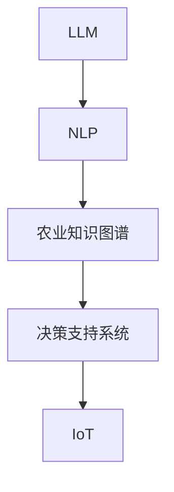

                 

## 1. 背景介绍

### 1.1 问题由来
现代农业正处于快速发展的关键阶段，随着信息技术在农业生产中的应用，精准农业（Precision Agriculture）逐渐成为可能。精准农业的核心思想是通过大数据、物联网（IoT）等技术，实现对农作物的精准管理，提升农业生产的效率和效益。在这一过程中，语言模型（Language Model, LM）扮演着重要的角色，其中大型语言模型（Large Language Model, LLM）以其强大的语义理解和生成能力，被广泛应用于农业数据处理、自然语言交互等领域。

### 1.2 问题核心关键点
1. **数据语义理解**：精准农业涉及大量农学、气象、土壤、地理等多种领域的数据，如何将这些数据转化为易于理解和处理的形式是关键问题。
2. **农业知识查询**：如何通过自然语言交互，快速查询并获取相关农业知识、技术指导和市场信息。
3. **文本生成与报告**：自动生成农业管理报告、计划书和决策支持文档，提升管理效率。
4. **智能辅助决策**：通过自然语言处理技术，辅助农民进行种植计划、病虫害防治、施肥和灌溉等决策。
5. **用户交互体验**：提供自然流畅、高效易用的用户交互界面，提升用户的使用体验。

### 1.3 问题研究意义
在精准农业中，语言模型可以显著提升数据处理效率，提供实时决策支持，改善用户体验，对提高农业生产效率和农民收入具有重要意义。通过语言模型，农民可以更便捷地获取和应用农业知识，科学管理农作物，实现精准施策，减少资源浪费，提升农业生产的可持续性和经济效益。

## 2. 核心概念与联系

### 2.1 核心概念概述

为更好地理解语言模型在精准农业中的应用，本节将介绍几个核心概念：

- **大型语言模型（LLM）**：基于Transformer架构的深度学习模型，如GPT、BERT等。通过大量无标签文本数据进行预训练，学习语言的通用表示，具备强大的语言理解和生成能力。
- **自然语言处理（NLP）**：涉及计算机如何理解、处理和生成人类语言的技术，包括分词、命名实体识别、情感分析、语义理解、文本生成等。
- **农业知识图谱**：以农业相关实体和关系为节点，通过自然语言查询获取相关农业知识。
- **决策支持系统（DSS）**：基于农业数据和领域知识，提供辅助决策的支持。
- **物联网（IoT）**：实现农业数据的采集、传输和监控，为精准农业提供数据支持。

这些核心概念之间的逻辑关系可以通过以下Mermaid流程图来展示：



这个流程图展示了大语言模型与精准农业中其他技术的关系：

1. 大语言模型通过自然语言处理技术，处理和生成农业相关文本数据。
2. 通过农业知识图谱查询相关农业知识。
3. 结合物联网技术，提供实时的农业数据采集和监控。
4. 基于这些信息，决策支持系统提供辅助决策支持。

## 3. 核心算法原理 & 具体操作步骤
### 3.1 算法原理概述

大型语言模型在精准农业中的应用，主要涉及以下几个核心步骤：

1. **数据预处理**：收集和整理农业数据，包括气象、土壤、植物生长数据等，进行标准化处理。
2. **文本表示学习**：将收集到的农业文本数据输入大型语言模型，学习文本的语义表示。
3. **知识图谱构建**：将农业领域实体和关系存储在知识图谱中，方便自然语言查询。
4. **文本生成与报告**：根据农业管理需求，使用大型语言模型生成农业管理报告、决策支持文档等。
5. **智能决策支持**：结合农业知识图谱和实时数据，提供农业管理决策支持。

### 3.2 算法步骤详解

#### 3.2.1 数据预处理

数据预处理的主要步骤包括：

1. **数据收集**：从农场、气象站、农业数据库等渠道收集数据，包括气象信息、土壤检测数据、植物生长数据等。
2. **数据清洗**：去除异常值、缺失值和重复数据，确保数据质量和一致性。
3. **标准化处理**：对数据进行单位转换、归一化等处理，方便后续分析和使用。
4. **数据集成**：将来自不同渠道的数据集成在一起，形成统一的数据集。

#### 3.2.2 文本表示学习

文本表示学习的主要步骤包括：

1. **预训练模型选择**：选择合适的预训练语言模型，如BERT、GPT等，作为文本表示的基础。
2. **文本输入处理**：对农业文本数据进行分词、编码等预处理。
3. **模型训练**：将预处理后的文本输入语言模型进行训练，学习文本的语义表示。
4. **向量提取**：将模型输出的向量表示作为文本的语义表示，用于后续处理。

#### 3.2.3 知识图谱构建

知识图谱构建的主要步骤包括：

1. **领域实体识别**：从农业领域文献、专家知识库中识别实体，如作物、病虫害、肥料等。
2. **关系抽取**：通过自然语言处理技术，抽取实体之间的关系，如“抗病性”、“施肥方法”等。
3. **图谱存储与查询**：将实体和关系存储在知识图谱中，并提供查询接口，方便自然语言查询。

#### 3.2.4 文本生成与报告

文本生成与报告的主要步骤包括：

1. **模板定义**：根据农业管理需求，定义生成报告的模板。
2. **自然语言生成**：使用大型语言模型，根据输入的数据和模板，生成农业管理报告。
3. **报告输出**：将生成的报告输出到用户界面或文件系统中，供用户查看和下载。

#### 3.2.5 智能决策支持

智能决策支持的主要步骤包括：

1. **实时数据获取**：通过物联网技术，获取实时的农业数据，如土壤湿度、温度、光照等。
2. **决策规则定义**：根据农业管理需求，定义决策规则，如“当土壤湿度低于5%时，需要灌溉”。
3. **决策生成**：结合农业知识图谱和实时数据，使用自然语言处理技术，生成农业管理决策。
4. **决策执行**：将生成的决策转换为具体的执行指令，如灌溉、施肥等。

### 3.3 算法优缺点

大型语言模型在精准农业中的应用，具有以下优点：

1. **数据处理能力**：大型语言模型能够处理大量的文本数据，提取其中的语义信息，提升数据处理效率。
2. **知识获取便捷**：通过自然语言查询，快速获取相关农业知识，提升决策支持系统的效果。
3. **文本生成能力**：自动生成农业管理报告和决策支持文档，提升管理效率和决策支持水平。
4. **智能决策支持**：结合农业知识图谱和实时数据，提供智能决策支持，提高农业生产的科学性和精准性。

同时，该方法也存在一定的局限性：

1. **模型依赖数据质量**：大型语言模型的效果依赖于输入数据的准确性和一致性，输入数据的质量会直接影响模型的性能。
2. **知识图谱构建复杂**：农业知识图谱的构建需要大量的人工干预和专业知识，构建过程复杂且耗时。
3. **实时性要求高**：农业管理决策需要实时响应，语言模型在处理实时数据时可能存在延迟。
4. **安全与隐私问题**：农业数据涉及敏感信息，如何保护数据安全和个人隐私，是一个重要问题。

尽管存在这些局限性，但大型语言模型在精准农业中的应用仍然具有广阔的前景，特别是在处理农业文本数据和提供决策支持方面，其优势明显。

### 3.4 算法应用领域

大型语言模型在精准农业中的应用领域广泛，包括但不限于以下几个方面：

1. **气象预测**：通过自然语言处理技术，从气象数据中提取关键信息，提供天气预报和农业管理建议。
2. **病虫害防治**：通过自然语言查询，获取相关病虫害防治知识和方案，辅助农民进行防治。
3. **种植计划制定**：根据土壤、气候等数据，生成种植计划和施肥方案，提高作物产量和质量。
4. **智能灌溉系统**：结合土壤湿度数据，使用语言模型生成灌溉计划，提高水资源利用效率。
5. **农业市场分析**：通过文本分析技术，提取农业市场信息，提供市场趋势预测和价格指导。

## 4. 数学模型和公式 & 详细讲解 & 举例说明

### 4.1 数学模型构建

本节将使用数学语言对大型语言模型在精准农业中的应用进行更加严格的刻画。

记大型语言模型为 $M_{\theta}:\mathcal{X} \rightarrow \mathcal{Y}$，其中 $\mathcal{X}$ 为输入空间，$\mathcal{Y}$ 为输出空间，$\theta$ 为模型参数。假设农业文本数据集为 $D=\{(x_i,y_i)\}_{i=1}^N, x_i \in \mathcal{X}, y_i \in \mathcal{Y}$，其中 $x_i$ 表示农业文本，$y_i$ 表示文本对应的语义表示。

定义模型 $M_{\theta}$ 在输入 $x$ 上的输出为 $\hat{y}=M_{\theta}(x) \in [0,1]$，表示模型对文本 $x$ 的语义理解。在农业知识图谱中，实体和关系被编码为节点和边，构成图结构。

### 4.2 公式推导过程

以下我们以气象预测为例，推导基于大型语言模型的气象预测模型。

假设气象数据集为 $D=\{(x_i,y_i)\}_{i=1}^N, x_i \in \mathcal{X}, y_i \in \mathcal{Y}$，其中 $x_i$ 表示气象数据，$y_i$ 表示气象事件（如“下雨”）。目标是根据气象数据 $x$，预测未来的气象事件 $y$。

定义气象事件 $y$ 的概率为 $P(y|x)$，通过大型语言模型 $M_{\theta}$ 预测气象事件的概率分布，得到 $P(y|x)=\hat{y}$。为了最小化预测误差，定义损失函数 $\mathcal{L}(\theta)$ 为：

$$
\mathcal{L}(\theta) = -\frac{1}{N}\sum_{i=1}^N \log P(y_i|x_i)
$$

目标是最小化损失函数 $\mathcal{L}(\theta)$，即找到最优参数：

$$
\theta^* = \mathop{\arg\min}_{\theta} \mathcal{L}(\theta)
$$

在得到损失函数的梯度后，即可带入参数更新公式，完成模型的迭代优化。重复上述过程直至收敛，最终得到适应气象预测任务的优化模型参数 $\theta^*$。

### 4.3 案例分析与讲解

以气象预测为例，分析大型语言模型在精准农业中的应用。

假设有一个农业农场，需要预测未来7天的气象情况。农场主输入气象数据，使用大型语言模型生成气象事件的概率分布，选择概率最高的气象事件作为预测结果。模型通过学习大量的历史气象数据，预测未来气象事件的概率分布，帮助农场主制定种植计划和灌溉计划，减少因天气变化带来的损失。

例如，当大型语言模型预测未来有较大几率出现连绵阴雨天气时，农场主可以根据预测结果调整种植计划，提前进行防涝准备，保护作物免受灾害影响。这种基于语言模型的气象预测方法，可以提升农业生产的科学性和精准性，减少资源浪费，提高农业生产的效率和效益。

## 5. 项目实践：代码实例和详细解释说明

### 5.1 开发环境搭建

在进行项目实践前，我们需要准备好开发环境。以下是使用Python进行PyTorch开发的环境配置流程：

1. 安装Anaconda：从官网下载并安装Anaconda，用于创建独立的Python环境。

2. 创建并激活虚拟环境：
```bash
conda create -n pytorch-env python=3.8 
conda activate pytorch-env
```

3. 安装PyTorch：根据CUDA版本，从官网获取对应的安装命令。例如：
```bash
conda install pytorch torchvision torchaudio cudatoolkit=11.1 -c pytorch -c conda-forge
```

4. 安装PyTorch Transformers库：
```bash
pip install transformers
```

5. 安装各类工具包：
```bash
pip install numpy pandas scikit-learn matplotlib tqdm jupyter notebook ipython
```

完成上述步骤后，即可在`pytorch-env`环境中开始项目实践。

### 5.2 源代码详细实现

下面我们以气象预测任务为例，给出使用Transformers库对BERT模型进行气象预测的PyTorch代码实现。

首先，定义气象数据处理函数：

```python
from transformers import BertTokenizer
from torch.utils.data import Dataset
import torch

class WeatherDataset(Dataset):
    def __init__(self, texts, labels, tokenizer, max_len=128):
        self.texts = texts
        self.labels = labels
        self.tokenizer = tokenizer
        self.max_len = max_len
        
    def __len__(self):
        return len(self.texts)
    
    def __getitem__(self, item):
        text = self.texts[item]
        label = self.labels[item]
        
        encoding = self.tokenizer(text, return_tensors='pt', max_length=self.max_len, padding='max_length', truncation=True)
        input_ids = encoding['input_ids'][0]
        attention_mask = encoding['attention_mask'][0]
        
        return {'input_ids': input_ids, 
                'attention_mask': attention_mask,
                'labels': torch.tensor(label, dtype=torch.long)}
```

然后，定义模型和优化器：

```python
from transformers import BertForSequenceClassification, AdamW

model = BertForSequenceClassification.from_pretrained('bert-base-cased', num_labels=2)

optimizer = AdamW(model.parameters(), lr=2e-5)
```

接着，定义训练和评估函数：

```python
from torch.utils.data import DataLoader
from tqdm import tqdm
from sklearn.metrics import classification_report

device = torch.device('cuda') if torch.cuda.is_available() else torch.device('cpu')
model.to(device)

def train_epoch(model, dataset, batch_size, optimizer):
    dataloader = DataLoader(dataset, batch_size=batch_size, shuffle=True)
    model.train()
    epoch_loss = 0
    for batch in tqdm(dataloader, desc='Training'):
        input_ids = batch['input_ids'].to(device)
        attention_mask = batch['attention_mask'].to(device)
        labels = batch['labels'].to(device)
        model.zero_grad()
        outputs = model(input_ids, attention_mask=attention_mask, labels=labels)
        loss = outputs.loss
        epoch_loss += loss.item()
        loss.backward()
        optimizer.step()
    return epoch_loss / len(dataloader)

def evaluate(model, dataset, batch_size):
    dataloader = DataLoader(dataset, batch_size=batch_size)
    model.eval()
    preds, labels = [], []
    with torch.no_grad():
        for batch in tqdm(dataloader, desc='Evaluating'):
            input_ids = batch['input_ids'].to(device)
            attention_mask = batch['attention_mask'].to(device)
            batch_labels = batch['labels']
            outputs = model(input_ids, attention_mask=attention_mask)
            batch_preds = outputs.logits.argmax(dim=2).to('cpu').tolist()
            batch_labels = batch_labels.to('cpu').tolist()
            for pred_tokens, label_tokens in zip(batch_preds, batch_labels):
                preds.append(pred_tokens[:len(label_tokens)])
                labels.append(label_tokens)
                
    print(classification_report(labels, preds))
```

最后，启动训练流程并在测试集上评估：

```python
epochs = 5
batch_size = 16

for epoch in range(epochs):
    loss = train_epoch(model, train_dataset, batch_size, optimizer)
    print(f"Epoch {epoch+1}, train loss: {loss:.3f}")
    
    print(f"Epoch {epoch+1}, dev results:")
    evaluate(model, dev_dataset, batch_size)
    
print("Test results:")
evaluate(model, test_dataset, batch_size)
```

以上就是使用PyTorch对BERT进行气象预测任务的完整代码实现。可以看到，得益于Transformers库的强大封装，我们可以用相对简洁的代码完成BERT模型的加载和训练。

### 5.3 代码解读与分析

让我们再详细解读一下关键代码的实现细节：

**WeatherDataset类**：
- `__init__`方法：初始化文本、标签、分词器等关键组件。
- `__len__`方法：返回数据集的样本数量。
- `__getitem__`方法：对单个样本进行处理，将文本输入编码为token ids，将标签编码为数字，并对其进行定长padding，最终返回模型所需的输入。

**训练和评估函数**：
- 使用PyTorch的DataLoader对数据集进行批次化加载，供模型训练和推理使用。
- 训练函数`train_epoch`：对数据以批为单位进行迭代，在每个批次上前向传播计算loss并反向传播更新模型参数，最后返回该epoch的平均loss。
- 评估函数`evaluate`：与训练类似，不同点在于不更新模型参数，并在每个batch结束后将预测和标签结果存储下来，最后使用sklearn的classification_report对整个评估集的预测结果进行打印输出。

**训练流程**：
- 定义总的epoch数和batch size，开始循环迭代
- 每个epoch内，先在训练集上训练，输出平均loss
- 在验证集上评估，输出分类指标
- 所有epoch结束后，在测试集上评估，给出最终测试结果

可以看到，PyTorch配合Transformers库使得BERT模型训练的代码实现变得简洁高效。开发者可以将更多精力放在数据处理、模型改进等高层逻辑上，而不必过多关注底层的实现细节。

当然，工业级的系统实现还需考虑更多因素，如模型的保存和部署、超参数的自动搜索、更灵活的任务适配层等。但核心的微调范式基本与此类似。

## 6. 实际应用场景
### 6.1 气象预测

气象预测是精准农业中重要的决策支持技术之一。传统的气象预测依赖于专业气象设备，数据采集和处理成本较高。通过大型语言模型，农场主可以实时获取气象数据，自动预测未来气象事件，辅助进行种植和灌溉管理。

在技术实现上，可以收集历史气象数据，训练大型语言模型，学习气象事件的概率分布。在输入新气象数据时，模型可以快速预测未来气象事件，提供准确的气象预测结果，帮助农场主制定农业管理计划。例如，当模型预测未来将有连绵阴雨天气时，农场主可以提前调整种植计划，减少因气象变化带来的损失。

### 6.2 智能灌溉系统

智能灌溉系统是精准农业中的关键技术之一。传统的灌溉系统依赖人工监控，资源浪费大且效率低。通过大型语言模型，可以自动分析土壤湿度数据，生成灌溉计划，实现精准灌溉，提升水资源利用效率。

在技术实现上，可以收集土壤湿度数据，训练大型语言模型，学习灌溉计划的概率分布。在输入新土壤湿度数据时，模型可以快速生成灌溉计划，根据预测结果调整灌溉量，减少水资源浪费。例如，当模型预测土壤湿度较低时，系统会自动增加灌溉量，确保作物得到充足的水分供给。

### 6.3 病虫害防治

病虫害防治是精准农业中的重要管理任务。传统的病虫害防治依赖人工监测和经验判断，效率低且准确性不高。通过大型语言模型，可以自动分析作物状态和病虫害数据，提供防治建议，提升防治效果。

在技术实现上，可以收集病虫害数据，训练大型语言模型，学习防治建议的概率分布。在输入新病虫害数据时，模型可以快速生成防治建议，辅助农民进行防治。例如，当模型预测某块农田有病虫害风险时，系统会自动发出预警，并生成防治方案，帮助农民及时防治。

### 6.4 未来应用展望

随着大型语言模型的不断发展，其在精准农业中的应用前景将更加广阔。未来，我们可以预见到以下几个方向的发展：

1. **多模态信息融合**：结合图像、视频、语音等多种信息，提升农业管理的智能化水平。例如，通过摄像头拍摄的植物图像，使用大型语言模型分析植物健康状态，提供科学的栽培建议。
2. **实时决策支持**：通过物联网技术，实时采集农业数据，结合大型语言模型，提供实时的农业管理决策支持。例如，当气象数据发生变化时，系统可以自动调整种植计划和灌溉计划。
3. **跨领域知识应用**：结合农业知识图谱和其他领域的知识库，提升大型语言模型的泛化能力。例如，通过农业知识图谱和市场信息，生成农业市场预测报告，帮助农民做出更科学的种植决策。
4. **自适应学习**：使用自适应学习技术，使大型语言模型能够不断从新数据中学习，适应不断变化的农业环境。例如，通过新加入的病虫害数据，自动更新防治建议，提高防治效果。

总之，大型语言模型在精准农业中的应用前景广阔，有望显著提升农业生产的效率和效益，推动农业向智能化、精准化方向发展。

## 7. 工具和资源推荐
### 7.1 学习资源推荐

为了帮助开发者系统掌握大型语言模型在精准农业中的应用，这里推荐一些优质的学习资源：

1. 《Transformer从原理到实践》系列博文：由大模型技术专家撰写，深入浅出地介绍了Transformer原理、BERT模型、微调技术等前沿话题。

2. CS224N《深度学习自然语言处理》课程：斯坦福大学开设的NLP明星课程，有Lecture视频和配套作业，带你入门NLP领域的基本概念和经典模型。

3. 《Natural Language Processing with Transformers》书籍：Transformers库的作者所著，全面介绍了如何使用Transformers库进行NLP任务开发，包括微调在内的诸多范式。

4. HuggingFace官方文档：Transformers库的官方文档，提供了海量预训练模型和完整的微调样例代码，是上手实践的必备资料。

5. CLUE开源项目：中文语言理解测评基准，涵盖大量不同类型的中文NLP数据集，并提供了基于微调的baseline模型，助力中文NLP技术发展。

通过对这些资源的学习实践，相信你一定能够快速掌握大型语言模型在精准农业中的应用精髓，并用于解决实际的农业问题。

### 7.2 开发工具推荐

高效的开发离不开优秀的工具支持。以下是几款用于大型语言模型在精准农业中应用的常用工具：

1. PyTorch：基于Python的开源深度学习框架，灵活动态的计算图，适合快速迭代研究。大部分预训练语言模型都有PyTorch版本的实现。

2. TensorFlow：由Google主导开发的开源深度学习框架，生产部署方便，适合大规模工程应用。同样有丰富的预训练语言模型资源。

3. Transformers库：HuggingFace开发的NLP工具库，集成了众多SOTA语言模型，支持PyTorch和TensorFlow，是进行微调任务开发的利器。

4. Weights & Biases：模型训练的实验跟踪工具，可以记录和可视化模型训练过程中的各项指标，方便对比和调优。与主流深度学习框架无缝集成。

5. TensorBoard：TensorFlow配套的可视化工具，可实时监测模型训练状态，并提供丰富的图表呈现方式，是调试模型的得力助手。

6. Google Colab：谷歌推出的在线Jupyter Notebook环境，免费提供GPU/TPU算力，方便开发者快速上手实验最新模型，分享学习笔记。

合理利用这些工具，可以显著提升大型语言模型在精准农业中的开发效率，加快创新迭代的步伐。

### 7.3 相关论文推荐

大型语言模型在精准农业中的应用源于学界的持续研究。以下是几篇奠基性的相关论文，推荐阅读：

1. Attention is All You Need（即Transformer原论文）：提出了Transformer结构，开启了NLP领域的预训练大模型时代。

2. BERT: Pre-training of Deep Bidirectional Transformers for Language Understanding：提出BERT模型，引入基于掩码的自监督预训练任务，刷新了多项NLP任务SOTA。

3. Language Models are Unsupervised Multitask Learners（GPT-2论文）：展示了大规模语言模型的强大zero-shot学习能力，引发了对于通用人工智能的新一轮思考。

4. Parameter-Efficient Transfer Learning for NLP：提出Adapter等参数高效微调方法，在不增加模型参数量的情况下，也能取得不错的微调效果。

5. Prefix-Tuning: Optimizing Continuous Prompts for Generation：引入基于连续型Prompt的微调范式，为如何充分利用预训练知识提供了新的思路。

6. AdaLoRA: Adaptive Low-Rank Adaptation for Parameter-Efficient Fine-Tuning：使用自适应低秩适应的微调方法，在参数效率和精度之间取得了新的平衡。

这些论文代表了大语言模型在精准农业中的研究进展。通过学习这些前沿成果，可以帮助研究者把握学科前进方向，激发更多的创新灵感。

## 8. 总结：未来发展趋势与挑战

### 8.1 总结

本文对基于大型语言模型在精准农业中的应用进行了全面系统的介绍。首先阐述了大型语言模型在精准农业中的研究背景和应用意义，明确了其在数据处理、决策支持、文本生成等方面的独特价值。其次，从原理到实践，详细讲解了大型语言模型的数学模型和关键步骤，给出了气象预测任务的完整代码实现。同时，本文还探讨了大型语言模型在精准农业中的多种应用场景，展示了其在农业生产中的广泛应用前景。

通过本文的系统梳理，可以看到，大型语言模型在精准农业中的应用前景广阔，具有显著提升农业生产效率和效益的潜力。然而，其应用过程中仍面临数据质量、知识图谱构建、实时性、安全性和隐私保护等挑战，需要不断探索和优化。

### 8.2 未来发展趋势

展望未来，大型语言模型在精准农业中的应用将呈现以下几个发展趋势：

1. **数据驱动决策**：随着数据采集技术的不断进步，大型语言模型将更深入地融入精准农业决策支持系统中，提升决策的科学性和准确性。
2. **跨领域知识融合**：结合农业知识图谱和其他领域的知识库，提升大型语言模型的泛化能力和智能水平，实现更全面、更精准的农业管理。
3. **自适应学习**：使用自适应学习技术，使大型语言模型能够不断从新数据中学习，适应不断变化的农业环境。
4. **多模态信息融合**：结合图像、视频、语音等多种信息，提升农业管理的智能化水平。
5. **实时决策支持**：通过物联网技术，实时采集农业数据，结合大型语言模型，提供实时的农业管理决策支持。

这些趋势表明，大型语言模型在精准农业中的应用将不断深化和拓展，为农业生产带来更加智能化、精准化的管理方案。

### 8.3 面临的挑战

尽管大型语言模型在精准农业中的应用前景广阔，但在迈向更加智能化、普适化应用的过程中，仍面临诸多挑战：

1. **数据质量依赖**：大型语言模型的效果依赖于输入数据的准确性和一致性，如何获取高质量、稳定的农业数据，是一个重要问题。
2. **知识图谱构建复杂**：农业知识图谱的构建需要大量的人工干预和专业知识，构建过程复杂且耗时。
3. **实时性要求高**：农业管理决策需要实时响应，大型语言模型在处理实时数据时可能存在延迟。
4. **安全与隐私问题**：农业数据涉及敏感信息，如何保护数据安全和个人隐私，是一个重要问题。
5. **模型鲁棒性不足**：大型语言模型可能对数据噪声和异常值敏感，如何在噪声环境下保持稳定性和鲁棒性，是一个重要问题。

尽管存在这些挑战，但通过不断探索和优化，相信大型语言模型在精准农业中的应用前景仍然广阔，有望显著提升农业生产的效率和效益。

### 8.4 研究展望

未来，大型语言模型在精准农业中的应用将需要更加全面和系统的研究，以应对上述挑战并充分发挥其潜力。以下是几个研究方向：

1. **数据采集与处理**：开发更高效、更智能的数据采集和处理技术，确保输入数据的高质量和稳定性。
2. **知识图谱构建**：研究更高效、更全面的农业知识图谱构建方法，提升知识图谱的覆盖面和准确性。
3. **实时处理技术**：开发高效的实时处理技术，提升大型语言模型在实时数据处理中的响应速度和准确性。
4. **模型鲁棒性增强**：研究更稳健的模型训练和优化技术，提升大型语言模型在噪声环境中的稳定性和鲁棒性。
5. **安全与隐私保护**：研究更强的数据加密和隐私保护技术，确保农业数据的隐私和安全。

这些研究方向将有助于进一步提升大型语言模型在精准农业中的应用效果，推动农业生产向智能化、精准化方向发展。相信随着技术的不断进步，大型语言模型将在精准农业中发挥更大的作用，为农业生产带来革命性的变革。

## 9. 附录：常见问题与解答

**Q1：大型语言模型在精准农业中的应用是否只限于文本数据？**

A: 大型语言模型在精准农业中的应用不仅限于文本数据，还可以结合图像、视频、语音等多种信息。例如，通过摄像头拍摄的植物图像，使用大型语言模型分析植物健康状态，提供科学的栽培建议。

**Q2：如何选择合适的模型和算法？**

A: 选择大型语言模型和算法时，需要考虑农业数据的特点和应用场景。对于文本数据，BERT、GPT等预训练模型效果较好；对于图像数据，可以结合卷积神经网络（CNN）等模型进行处理。此外，需要考虑模型的参数量、计算效率、部署难度等因素，选择适合特定应用场景的模型和算法。

**Q3：大型语言模型在精准农业中的应用效果如何评估？**

A: 大型语言模型在精准农业中的应用效果评估可以从多个角度进行，包括预测精度、作物产量、资源利用效率等。可以通过实际应用中的效果对比和统计分析，评估模型在不同场景下的表现。

**Q4：如何处理噪声和异常值？**

A: 处理噪声和异常值是大型语言模型应用中常见的挑战。可以通过数据清洗、特征工程等方法，预处理数据以减少噪声和异常值的影响。同时，可以在模型训练中加入正则化技术，如L2正则、Dropout等，提升模型的鲁棒性和抗干扰能力。

**Q5：如何保护农业数据的隐私和安全？**

A: 保护农业数据的隐私和安全是大型语言模型应用中需要重点关注的问题。可以通过数据加密、匿名化处理等方法，保护数据的隐私性。同时，需要建立严格的数据访问和处理权限管理机制，确保数据的安全性。

总之，大型语言模型在精准农业中的应用具有广阔的前景，但需不断探索和优化，以应对应用过程中面临的挑战。相信随着技术的不断进步，大型语言模型将在精准农业中发挥更大的作用，为农业生产带来革命性的变革。

