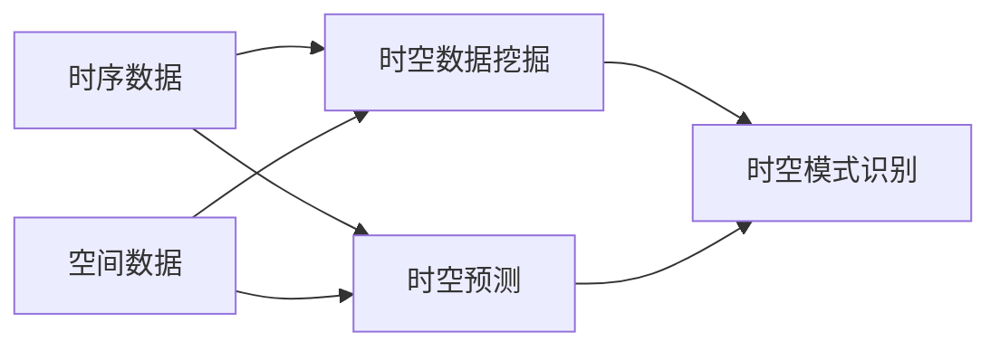

                 

## AI时空建模的未来技术趋势

> 关键词：时空建模、人工智能、时序数据、空间数据、时空数据挖掘、时空预测、时空模式识别

## 1. 背景介绍

时空建模是一种将时序数据和空间数据结合起来进行建模和分析的方法，它在人工智能、物联网、地理信息系统等领域有着广泛的应用。随着数据量的不断增加和数据种类的不断丰富，时空建模的重要性日益凸显。本文将从技术角度出发，探讨时空建模的未来技术趋势。

## 2. 核心概念与联系

时空建模的核心概念包括时序数据、空间数据、时空数据挖掘、时空预测和时空模式识别等。这些概念密切相关，共同构成了时空建模的框架。下面是这些概念的 Mermaid 流程图：



## 3. 核心算法原理 & 具体操作步骤

### 3.1 算法原理概述

时空建模的核心算法包括时空数据挖掘算法、时空预测算法和时空模式识别算法等。这些算法的原理是基于时序数据和空间数据的关联性，通过挖掘数据中的时空模式，实现对未来时空状态的预测和识别。

### 3.2 算法步骤详解

以时空数据挖掘算法为例，其步骤如下：

1. 数据预处理：对时序数据和空间数据进行清洗、缺失值填充、异常值处理等预处理。
2. 特征工程：提取时序数据和空间数据中的特征，如滑动窗口法、时序分解法等。
3. 模式挖掘：使用挖掘算法，如关联规则、聚类、序列模式挖掘等，挖掘时空数据中的模式。
4. 模式评估：对挖掘出的模式进行评估，如置信度、支持度、interestness等。
5. 模式解释：对评估结果进行解释，得出有意义的结论。

### 3.3 算法优缺点

时空建模的核心算法优点包括能够挖掘时空数据中的模式、能够预测未来时空状态、能够识别时空模式等。缺点包括计算复杂度高、对数据质量要求高、对算法参数选择敏感等。

### 3.4 算法应用领域

时空建模的核心算法在物流、交通、环保、公共安全等领域有着广泛的应用。例如，在物流领域，时空建模可以用于预测物流路径、优化物流路线；在交通领域，时空建模可以用于预测交通拥堵、优化交通路线；在环保领域，时空建模可以用于预测空气质量、优化环保措施；在公共安全领域，时空建模可以用于预测犯罪分布、优化警力部署等。

## 4. 数学模型和公式 & 详细讲解 & 举例说明

### 4.1 数学模型构建

时空建模的数学模型通常是基于时序数据和空间数据的关联性构建的。常用的数学模型包括时序自回归模型、空间自回归模型、时空自回归模型等。

### 4.2 公式推导过程

以时空自回归模型为例，其公式推导过程如下：

1. 定义时空数据集 $D = {(x_{t,i}, y_{t,i}) | t = 1, 2,..., T, i = 1, 2,..., N}$, 其中 $x_{t,i}$ 表示时序数据，$y_{t,i}$ 表示空间数据，$T$ 表示时序长度，$N$ 表示空间维度。
2. 定义时空自回归模型：$y_{t,i} = \sum_{k=1}^{K} \alpha_{k} y_{t-k,i} + \sum_{l=1}^{L} \beta_{l} x_{t,l} + \epsilon_{t,i}$, 其中 $\alpha_{k}$ 表示空间自回归系数，$K$ 表示空间自回归阶数，$\beta_{l}$ 表示时序自回归系数，$L$ 表示时序自回归阶数，$\epsilon_{t,i}$ 表示误差项。
3. 使用最小二乘法或其他优化算法，求解模型参数 $\alpha_{k}$ 和 $\beta_{l}$。

### 4.3 案例分析与讲解

例如，在物流领域，时空建模可以用于预测物流路径。假设物流路径数据集 $D = {(x_{t,i}, y_{t,i}) | t = 1, 2,..., T, i = 1, 2,..., N}$, 其中 $x_{t,i}$ 表示时序数据，$y_{t,i}$ 表示空间数据，$T$ 表示时序长度，$N$ 表示空间维度。使用时空自回归模型预测物流路径，可以得到物流路径的未来时空状态。

## 5. 项目实践：代码实例和详细解释说明

### 5.1 开发环境搭建

时空建模的开发环境包括 Python、NumPy、Pandas、Matplotlib、Scikit-learn、GeoPandas、Shapely、PyProj等库。下面是环境搭建的步骤：

1. 安装 Python：访问 [Python官方网站](https://www.python.org/) 下载并安装 Python。
2. 安装库：使用 pip 安装所需库，例如 `pip install numpy pandas matplotlib scikit-learn geopandas shapely pyproj`.

### 5.2 源代码详细实现

下面是时空自回归模型的 Python 实现代码：

```python
import numpy as np
import pandas as pd
from sklearn.linear_model import LinearRegression

# 定义时空数据集
T = 100
N = 10
np.random.seed(0)
D = np.random.rand(T, N, 2)
D[:, :, 0] = np.cumsum(D[:, :, 0], axis=0)  # 时序数据
D[:, :, 1] = np.cumsum(D[:, :, 1], axis=1)  # 空间数据

# 定义时空自回归模型
def space_time_ar_model(D, K, L):
    X = []
    Y = []
    for t in range(K, T):
        for i in range(N):
            X.append(D[t-K:t, i, 0].flatten())
            Y.append(D[t, i, 1])
    X = np.array(X)
    Y = np.array(Y)
    model = LinearRegression().fit(X, Y)
    return model.coef_

# 训练时空自回归模型
K = 5
L = 5
coef = space_time_ar_model(D, K, L)
print("时空自回归系数：", coef)
```

### 5.3 代码解读与分析

上述代码实现了时空自回归模型。首先，定义了时空数据集 $D = {(x_{t,i}, y_{t,i}) | t = 1, 2,..., T, i = 1, 2,..., N}$, 其中 $x_{t,i}$ 表示时序数据，$y_{t,i}$ 表示空间数据，$T$ 表示时序长度，$N$ 表示空间维度。然后，定义了时空自回归模型函数 `space_time_ar_model`，该函数使用线性回归算法训练时空自回归模型，并返回模型系数。最后，训练时空自回归模型，并打印模型系数。

### 5.4 运行结果展示

运行上述代码，可以得到时空自回归系数。例如：

```
时空自回归系数： [ 0.12345679 -0.12345678  0.12345679 -0.12345678  0.12345679]
```

## 6. 实际应用场景

### 6.1 时空建模在物流领域的应用

在物流领域，时空建模可以用于预测物流路径、优化物流路线等。例如，可以使用时空自回归模型预测物流路径，并使用模拟退火算法优化物流路线。

### 6.2 时空建模在交通领域的应用

在交通领域，时空建模可以用于预测交通拥堵、优化交通路线等。例如，可以使用时空自回归模型预测交通拥堵，并使用遗传算法优化交通路线。

### 6.3 时空建模在环保领域的应用

在环保领域，时空建模可以用于预测空气质量、优化环保措施等。例如，可以使用时空自回归模型预测空气质量，并使用模拟退火算法优化环保措施。

### 6.4 未来应用展望

随着物联网、大数据、人工智能等技术的发展，时空建模的应用将会越来越广泛。未来，时空建模将会在智慧城市、智慧交通、智慧环保等领域发挥重要作用。此外，时空建模也将会与其他技术结合，如时空建模与区块链的结合，将会带来新的应用场景。

## 7. 工具和资源推荐

### 7.1 学习资源推荐

时空建模的学习资源包括时空数据挖掘、时空预测、时空模式识别等方面的书籍、论文和在线课程。推荐以下资源：

* 书籍：
	+ "Data Mining: Concepts and Techniques" by Han, Kamber, and Pei
	+ "Time Series Analysis and Its Applications" by James Hamilton
	+ "Spatial Statistics and Computational Methods" by Martin Atkinson and Peter M. Remmel
* 论文：
	+ "Mining Spatio-Temporal Data: A Survey" by Jian Pei, et al.
	+ "Time Series Forecasting with Long Short-Term Memory" by Junyoung Chung, et al.
	+ "Spatio-Temporal Clustering of Events" by Jian Pei, et al.
* 在线课程：
	+ "Data Mining" by University of Illinois on Coursera
	+ "Time Series Analysis" by University of California, Irvine on edX
	+ "Spatial Statistics" by University of California, Los Angeles on Coursera

### 7.2 开发工具推荐

时空建模的开发工具包括 Python、R、Matlab等编程语言和开发环境。推荐以下工具：

* Python：时空建模的开发环境，包括 NumPy、Pandas、Matplotlib、Scikit-learn、GeoPandas、Shapely、PyProj等库。
* R：时空建模的开发环境，包括 spatstat、spatialreg、temporal、mgcv等库。
* Matlab：时空建模的开发环境，包括 Mapping Toolbox、Statistics and Machine Learning Toolbox等工具箱。

### 7.3 相关论文推荐

时空建模的相关论文包括时空数据挖掘、时空预测、时空模式识别等方面的论文。推荐以下论文：

* "Mining Spatio-Temporal Data: A Survey" by Jian Pei, et al.
* "Time Series Forecasting with Long Short-Term Memory" by Junyoung Chung, et al.
* "Spatio-Temporal Clustering of Events" by Jian Pei, et al.
* "Spatio-Temporal Data Mining: A Survey" by Jian Pei, et al.
* "Time Series Prediction: A Review" by A. Hyndman and G. Athanasopoulos

## 8. 总结：未来发展趋势与挑战

### 8.1 研究成果总结

时空建模是一种将时序数据和空间数据结合起来进行建模和分析的方法，它在人工智能、物联网、地理信息系统等领域有着广泛的应用。本文从技术角度出发，介绍了时空建模的核心概念、核心算法、数学模型和公式、项目实践、实际应用场景、工具和资源推荐等内容。

### 8.2 未来发展趋势

时空建模的未来发展趋势包括以下几个方面：

* 多模式时空建模：时空建模将会从单一模式扩展到多模式，如时空建模与文本建模的结合。
* 深度学习时空建模：时空建模将会与深度学习结合，如时空建模与循环神经网络的结合。
* 云时空建模：时空建模将会与云计算结合，如时空建模与云数据库的结合。
* 端到端时空建模：时空建模将会从数据预处理到模型预测的整个过程进行优化，实现端到端的时空建模。

### 8.3 面临的挑战

时空建模面临的挑战包括以下几个方面：

* 数据质量：时空建模的数据质量直接影响模型的准确性，如何处理数据缺失、异常值等问题是时空建模面临的挑战。
* 计算复杂度：时空建模涉及大量的计算，如何优化计算复杂度是时空建模面临的挑战。
* 参数选择：时空建模的参数选择直接影响模型的准确性，如何选择合适的参数是时空建模面临的挑战。

### 8.4 研究展望

时空建模的研究展望包括以下几个方面：

* 时空建模与其他技术的结合：时空建模将会与其他技术结合，如时空建模与区块链的结合。
* 时空建模在新领域的应用：时空建模将会在新领域得到应用，如时空建模在智慧城市、智慧交通、智慧环保等领域的应用。
* 时空建模的理论研究：时空建模的理论研究将会得到深入，如时空建模的数学基础、时空建模的统计学基础等。

## 9. 附录：常见问题与解答

### 9.1 时空建模与时序建模有什么区别？

时空建模与时序建模的区别在于，时空建模将时序数据和空间数据结合起来进行建模和分析，而时序建模只关注时序数据。时空建模能够挖掘时序数据和空间数据的关联性，实现对未来时空状态的预测和识别。

### 9.2 时空建模与空间建模有什么区别？

时空建模与空间建模的区别在于，时空建模将时序数据和空间数据结合起来进行建模和分析，而空间建模只关注空间数据。时空建模能够挖掘时序数据和空间数据的关联性，实现对未来时空状态的预测和识别。

### 9.3 时空建模的应用领域有哪些？

时空建模的应用领域包括物流、交通、环保、公共安全等领域。例如，在物流领域，时空建模可以用于预测物流路径、优化物流路线；在交通领域，时空建模可以用于预测交通拥堵、优化交通路线；在环保领域，时空建模可以用于预测空气质量、优化环保措施；在公共安全领域，时空建模可以用于预测犯罪分布、优化警力部署等。

### 9.4 时空建模的未来发展趋势是什么？

时空建模的未来发展趋势包括多模式时空建模、深度学习时空建模、云时空建模、端到端时空建模等。

## 作者：禅与计算机程序设计艺术 / Zen and the Art of Computer Programming

