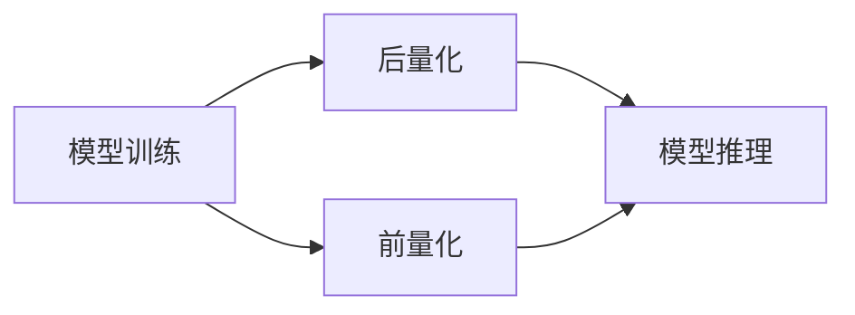

                 

## AI模型量化：平衡性能和精度

> 关键词：模型量化、模型压缩、模型部署、模型性能、模型精度、模型推理

## 1. 背景介绍

随着深度学习的发展，模型的复杂度和参数数量也在不断增加。这些大型模型在训练和推理时需要大量的计算资源和内存，这给模型的部署和推理带来了挑战。模型量化（Model Quantization）是一种将模型参数从高精度数据类型（如FP32或FP16）转换为低精度数据类型（如INT8或INT16）的技术，以平衡模型的性能和精度。

## 2. 核心概念与联系

模型量化的目标是保持模型的精度，同时减小模型的内存 footprint 和推理时间。模型量化通常分为两种方法：后量化（Post-Training Quantization）和前量化（Pre-Training Quantization）。后量化是在模型训练完成后进行量化，而前量化则在模型训练的过程中进行量化。

 

**Mermaid 代码：**



## 3. 核心算法原理 & 具体操作步骤

### 3.1 算法原理概述

模型量化的核心原理是将模型参数从高精度数据类型转换为低精度数据类型。这可以通过量化模型的权重、激活值或两者来实现。量化后的模型需要一个量化参数（Scale）来恢复原始模型的精度。

### 3.2 算法步骤详解

1. **选择量化目标**：选择要量化的模型参数（权重、激活值或两者）。
2. **选择量化位宽**：选择量化后的数据类型（INT8、INT16、FP16等）。
3. **量化模型**：使用量化算法将模型参数转换为低精度数据类型。
4. **计算量化参数**：计算量化参数（Scale）以恢复原始模型的精度。
5. **模型推理**：使用量化模型进行推理。

### 3.3 算法优缺点

**优点：**

* 减小模型内存 footprint。
* 减少模型推理时间。
* 降低模型部署成本。

**缺点：**

* 量化后的模型精度可能会略微下降。
* 量化过程可能需要大量的计算资源。

### 3.4 算法应用领域

模型量化在各种需要部署大型模型的领域都有应用，例如：

* 移动设备：模型量化可以减小模型的内存 footprint，从而提高移动设备上的模型推理速度。
* 边缘设备：模型量化可以减少模型推理时间，从而提高边缘设备上的实时性。
* 云端服务：模型量化可以减小模型的内存 footprint，从而提高云端服务的吞吐量。

## 4. 数学模型和公式 & 详细讲解 & 举例说明

### 4.1 数学模型构建

设模型参数为$x$, 量化后的参数为$\hat{x}$, 量化参数为$S$, 量化位宽为$n$, 量化后的数据类型为$D$.

则量化后的参数可以表示为：

$$\hat{x} = \text{round}\left(\frac{x}{S}\right)$$

其中，$\text{round}(\cdot)$是四舍五入函数，$\frac{x}{S}$是模型参数的缩放版本。

### 4.2 公式推导过程

量化参数$S$可以通过以下公式计算：

$$S = \frac{\text{max}(|x|)}{\text{max\_value}(D)}$$

其中，$\text{max}(|x|)$是模型参数的最大绝对值，$\text{max\_value}(D)$是量化后数据类型$D$的最大值。

### 4.3 案例分析与讲解

例如，假设模型参数$x = 127.5$, 量化位宽$n = 8$, 量化后的数据类型$D = \text{INT8}$.


量化后的参数$\hat{x} = \text{round}\left(\frac{x}{S}\right) = \text{round}\left(\frac{127.5}{1}= \text{round}(127.5) = 128

## 5. 项目实践：代码实例和详细解释说明

### 5.1 开发环境搭建

本节以 TensorFlow Lite 为例，介绍如何使用 Python 进行模型量化。

首先，需要安装 TensorFlow Lite 和 Python API：

```bash
pip install tensorflow-lite
```

### 5.2 源代码详细实现

以下代码演示了如何使用 TensorFlow Lite 对一个简单的 MNIST 模型进行后量化：

```python
import tensorflow as tf

# 加载 MNIST 数据集
(x_train, y_train), (x_test, y_test) = tf.keras.datasets.mnist.load_data()

# 预处理数据
x_train = x_train.astype('float32') / 255.0
x_test = x_test.astype('float32') / 255.0

# 创建模型
model = tf.keras.models.Sequential([
  tf.keras.layers.Flatten(input_shape=(28, 28)),
  tf.keras.layers.Dense(128, activation='relu'),
  tf.keras.layers.Dropout(0.2),
  tf.keras.layers.Dense(10)
])

# 编译模型
model.compile(optimizer='adam',
              loss=tf.keras.losses.SparseCategoricalCrossentropy(from_logits=True),
              metrics=['accuracy'])

# 训练模型
model.fit(x_train, y_train, epochs=5)

# 保存模型
model.save('mnist_model.h5')

# 转换模型为 TensorFlow Lite 格式
converter = tf.lite.TFLiteConverter.from_keras_model(model)
tflite_model = converter.convert()

# 保存 TensorFlow Lite 模型
open('mnist_model.tflite', 'wb').write(tflite_model)

# 量化模型
converter.optimizations = [tf.lite.Optimize.DEFAULT]
tflite_quant_model = converter.convert()

# 保存量化后的 TensorFlow Lite 模型
open('mnist_model_quant.tflite', 'wb').write(tflite_quant_model)
```

### 5.3 代码解读与分析

* 首先，加载 MNIST 数据集，并进行预处理。
* 然后，创建一个简单的 MNIST 模型，并进行训练。
* 接着，使用 `tf.lite.TFLiteConverter` 将模型转换为 TensorFlow Lite 格式，并保存模型。
* 为了量化模型，设置 `converter.optimizations = [tf.lite.Optimize.DEFAULT]`，并再次调用 `converter.convert()` 方法。
* 最后，保存量化后的 TensorFlow Lite 模型。

### 5.4 运行结果展示

量化后的模型文件大小会比原始模型文件小，并且推理速度也会更快。

## 6. 实际应用场景

模型量化在各种需要部署大型模型的领域都有应用，例如：

* **图像分类：** 在移动设备和边缘设备上进行图像分类。
* **目标检测：** 在自动驾驶汽车和监控系统中进行目标检测。
* **语音识别：** 在智能音箱和虚拟助手中进行语音识别。
* **自然语言处理：** 在机器翻译和文本摘要中进行自然语言处理。

### 6.1 未来应用展望

随着模型量化技术的不断发展，未来将会出现更多应用场景，例如：

* **更低位宽的量化：** 使用更低位宽的数据类型（如 INT4 或 INT2）进行量化，以进一步减小模型大小和推理时间。
* **硬件加速：** 利用专用硬件加速器来加速量化模型的推理。
* **自动化量化：** 开发自动化工具来简化模型量化过程。

## 7. 工具和资源推荐

### 7.1 学习资源推荐

* TensorFlow Lite 文档：https://www.tensorflow.org/lite
* PyTorch Mobile 文档：https://pytorch.org/mobile/

### 7.2 开发工具推荐

* TensorFlow Lite：用于部署 TensorFlow 模型的开源框架。
* PyTorch Mobile：用于部署 PyTorch 模型的开源框架。

### 7.3 相关论文推荐

* [Quantization and Training of Neural Networks for Efficient Integer-Arithmetic-Only Inference](https://arxiv.org/abs/1712.05877)
* [Quantizing deep convolutional networks for efficient inference: A whitepaper](https://arxiv.org/abs/1806.08342)

## 8. 总结：未来发展趋势与挑战

### 8.1 研究成果总结

模型量化是一种有效的模型压缩技术，可以平衡模型的性能和精度。

### 8.2 未来发展趋势

* 更低位宽的量化
* 硬件加速
* 自动化量化

### 8.3 面临的挑战

* 量化精度损失
* 量化过程的计算成本

### 8.4 研究展望

* 开发更高效的量化算法
* 研究如何减轻量化精度损失
* 开发自动化量化工具

## 9. 附录：常见问题与解答

### 9.1 什么是模型量化？

模型量化是一种将模型参数从高精度数据类型转换为低精度数据类型的技术，以平衡模型的性能和精度。

### 9.2 模型量化的优点是什么？

* 减小模型内存 footprint
* 减少模型推理时间
* 降低模型部署成本

### 9.3 模型量化的缺点是什么？

* 量化后的模型精度可能会略微下降
* 量化过程可能需要大量的计算资源

### 9.4 模型量化有哪些应用场景？

* 图像分类
* 目标检测
* 语音识别
* 自然语言处理

### 9.5 模型量化的未来发展趋势是什么？

* 更低位宽的量化
* 硬件加速
* 自动化量化

**作者：禅与计算机程序设计艺术 / Zen and the Art of Computer Programming** 

