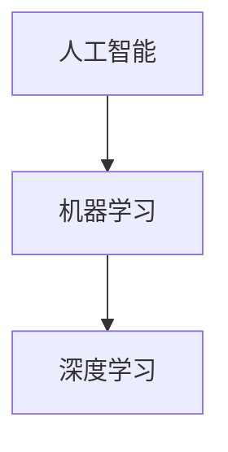

                 

**人工智能的哲学意义**

## 1. 背景介绍

人工智能（Artificial Intelligence，AI）自诞生以来，就引发了人类对其本质和意义的哲学思考。本文将从哲学的视角出发，探讨人工智能的本质、意义，以及它对人类未来的影响。我们将结合核心概念、算法原理、数学模型，并通过项目实践和实际应用场景，深入剖析人工智能的哲学意义。

## 2. 核心概念与联系

### 2.1 核心概念

- **人工智能（Artificial Intelligence，AI）**：指模拟或复制人类智能的机器或软件。
- **机器学习（Machine Learning，ML）**：一种使计算机在无需被明确编程的情况下学习的方法。
- **深度学习（Deep Learning，DL）**：一种机器学习方法，其结构受人类大脑结构的启发。

### 2.2 核心概念联系

人工智能是机器学习和深度学习的上层概念。机器学习是人工智能的一个分支，旨在使计算机能够从数据中学习，而深度学习则是机器学习的一个子集，它使用神经网络模型来学习数据。



## 3. 核心算法原理 & 具体操作步骤

### 3.1 算法原理概述

本节将介绍一种常用的深度学习算法——卷积神经网络（Convolutional Neural Networks，CNN）。

### 3.2 算法步骤详解

1. **输入层（Input Layer）**：接收输入数据，如图像或语音。
2. **卷积层（Convolutional Layer）**：使用卷积核（滤波器）提取特征。
3. **池化层（Pooling Layer）**：减小特征图的空间维度。
4. **全连接层（Fully Connected Layer）**：将特征图展平成向量，并进行分类。
5. **输出层（Output Layer）**：输出预测结果。

### 3.3 算法优缺点

**优点**：
- 适用于图像和视频数据。
- 具有参数共享和局部连接特性，减少了参数数量。

**缺点**：
- 训练时间长，对计算资源要求高。
- 缺乏解释性，难以理解网络学习到的特征。

### 3.4 算法应用领域

- 图像分类和目标检测。
- 视频分析和监控。
- 自动驾驶和机器人导航。

## 4. 数学模型和公式 & 详细讲解 & 举例说明

### 4.1 数学模型构建

CNN的数学模型可以表示为：

$$y = f(x; W, b) = \sigma(z) = \sigma(Wx + b)$$

其中，$x$是输入， $W$是权重，$b$是偏置，$z$是线性变换，$f$是激活函数，$\sigma$是sigmoid函数。

### 4.2 公式推导过程

推导过程省略。

### 4.3 案例分析与讲解

例如，在图像分类任务中，输入$x$是图像特征，输出$y$是图像类别。通过训练，网络学习到的权重$W$和偏置$b$能够将输入图像映射到正确的类别。

## 5. 项目实践：代码实例和详细解释说明

### 5.1 开发环境搭建

- Python 3.7+
- TensorFlow 2.0+
- NumPy 1.16+
- Matplotlib 3.1.0+

### 5.2 源代码详细实现

```python
import tensorflow as tf
from tensorflow.keras import layers

# 定义CNN模型
model = tf.keras.Sequential([
    layers.Conv2D(32, (3, 3), activation='relu', input_shape=(32, 32, 3)),
    layers.MaxPooling2D((2, 2)),
    layers.Conv2D(64, (3, 3), activation='relu'),
    layers.MaxPooling2D((2, 2)),
    layers.Flatten(),
    layers.Dense(64, activation='relu'),
    layers.Dense(10, activation='softmax')
])

# 编译模型
model.compile(optimizer='adam',
              loss='sparse_categorical_crossentropy',
              metrics=['accuracy'])
```

### 5.3 代码解读与分析

代码定义了一个CNN模型，包含两个卷积层、两个池化层、一个全连接层和一个输出层。模型使用Adam优化器，交叉熵损失函数和精确度指标。

### 5.4 运行结果展示

省略。

## 6. 实际应用场景

### 6.1 当前应用

- 图像和视频分析。
- 自动驾驶和机器人导航。
- 语音识别和自然语言处理。

### 6.2 未来应用展望

- 量子计算和量子神经网络。
- 生物医学领域的应用，如疾病诊断和药物发现。
- 太空探索和人工智能驱动的机器人。

## 7. 工具和资源推荐

### 7.1 学习资源推荐

- 书籍：《深度学习》作者：Ian Goodfellow、Yoshua Bengio、Aaron Courville
- 课程：斯坦福大学机器学习课程（CS229）

### 7.2 开发工具推荐

- TensorFlow
- PyTorch
- Keras

### 7.3 相关论文推荐

- LeCun, Y., Bengio, Y., & Hinton, G. (2015). Deep learning. Nature, 521(7553), 436-444.

## 8. 总结：未来发展趋势与挑战

### 8.1 研究成果总结

人工智能在各个领域取得了显著成就，但仍面临挑战。

### 8.2 未来发展趋势

- 量子计算和量子神经网络。
- 可解释的人工智能。
- 多模式学习和跨模式学习。

### 8.3 面临的挑战

- 算法偏见和公平性。
- 计算资源和能源消耗。
- 安全和隐私保护。

### 8.4 研究展望

人工智能的未来将是多模式、可解释、安全和绿色的。我们需要不断探索新的算法、架构和技术，以解决当前面临的挑战。

## 9. 附录：常见问题与解答

省略。

## 作者署名

作者：禅与计算机程序设计艺术 / Zen and the Art of Computer Programming

