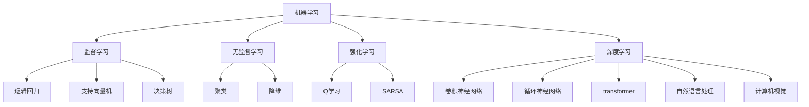

                 

**人工智能的未来发展前景**

**作者：禅与计算机程序设计艺术 / Zen and the Art of Computer Programming**

## 1. 背景介绍

人工智能（AI）自诞生以来，就一直是计算机科学领域最具前途和挑战的研究方向之一。从早期的专家系统到当今的深度学习，AI技术已经渗透到我们的日常生活中，从搜索引擎到自动驾驶汽车，无处不在。本文将探讨人工智能的未来发展前景，关注其核心概念、算法原理、数学模型，并提供项目实践和工具资源推荐。

## 2. 核心概念与联系

人工智能的核心概念包括机器学习、深度学习、自然语言处理、计算机视觉等。这些概念密切相关，共同构成了当今人工智能的基础。下图是这些概念的关系图：



## 3. 核心算法原理 & 具体操作步骤

### 3.1 算法原理概述

人工智能的核心是机器学习算法。这些算法的目标是从数据中学习模式，并使用这些模式对新数据进行预测。最常用的机器学习算法之一是神经网络，它模仿人脑的结构和功能。

### 3.2 算法步骤详解

神经网络算法的步骤包括：

1. **输入层**：接收输入数据。
2. **隐藏层**：对输入数据进行特征提取和转换。
3. **输出层**：生成输出结果。
4. **反向传播**：根据损失函数调整权重和偏置，以最小化预测误差。
5. **前向传播**：使用调整后的权重和偏置对新数据进行预测。

### 3.3 算法优缺点

神经网络的优点包括：

- **学习能力强**：可以从数据中学习复杂的模式。
- **泛化能力好**：可以对新数据进行准确的预测。

缺点包括：

- **计算复杂**：训练大型神经网络需要大量的计算资源。
- **易于过拟合**：如果模型太复杂，可能会学习到训练数据的噪声而不是真正的模式。

### 3.4 算法应用领域

神经网络在各种领域都有广泛的应用，包括图像和语音识别，自然语言处理，推荐系统，自动驾驶等。

## 4. 数学模型和公式 & 详细讲解 & 举例说明

### 4.1 数学模型构建

神经网络的数学模型是一个有向无环图（DAG），其中每个节点表示一个神经元，每条边表示一个权重。输入数据通过网络传播，每个神经元对输入数据进行转换，并将结果传递给下一层神经元。

### 4.2 公式推导过程

神经元的输出可以表示为：

$$y = f(w \cdot x + b)$$

其中：

- $y$ 是神经元的输出，
- $x$ 是输入向量，
- $w$ 是权重向量，
- $b$ 是偏置，
- $f$ 是激活函数（如ReLU，sigmoid等）。

### 4.3 案例分析与讲解

例如，考虑一个简单的二层全连接神经网络，用于分类二维数据。输入层有2个神经元，隐藏层有3个神经元，输出层有1个神经元。假设输入数据是$(x_1, x_2)$, 权重和偏置分别为：

$$w_1 = \begin{bmatrix} 1 & 2 \\ 3 & 4 \\ 5 & 6 \end{bmatrix}, \quad w_2 = \begin{bmatrix} 7 \\ 8 \\ 9 \end{bmatrix}, \quad b_1 = \begin{bmatrix} 1 \\ 2 \\ 3 \end{bmatrix}, \quad b_2 = 4$$

隐藏层的输出为：

$$h = f(w_1 \cdot x + b_1) = f(\begin{bmatrix} 1 & 2 \\ 3 & 4 \\ 5 & 6 \end{bmatrix} \begin{bmatrix} x_1 \\ x_2 \end{bmatrix} + \begin{bmatrix} 1 \\ 2 \\ 3 \end{bmatrix})$$

输出层的输出为：

$$y = f(w_2 \cdot h + b_2) = f(\begin{bmatrix} 7 \\ 8 \\ 9 \end{bmatrix} \cdot f(\begin{bmatrix} 1 & 2 \\ 3 & 4 \\ 5 & 6 \end{bmatrix} \begin{bmatrix} x_1 \\ x_2 \end{bmatrix} + \begin{bmatrix} 1 \\ 2 \\ 3 \end{bmatrix}) + 4)$$

## 5. 项目实践：代码实例和详细解释说明

### 5.1 开发环境搭建

本项目使用Python和TensorFlow框架。首先，安装必要的库：

```bash
pip install tensorflow numpy matplotlib
```

### 5.2 源代码详细实现

以下是一个简单的二层全连接神经网络的实现：

```python
import numpy as np
import tensorflow as tf
import matplotlib.pyplot as plt

# 定义神经网络结构
model = tf.keras.Sequential([
    tf.keras.layers.Dense(3, activation='relu', input_shape=(2,)),
    tf.keras.layers.Dense(1)
])

# 定义损失函数和优化器
model.compile(optimizer='adam', loss='mean_squared_error')

# 生成训练数据
x_train = np.random.rand(1000, 2)
y_train = x_train[:, 0] + 2 * x_train[:, 1] + np.random.randn(1000) * 0.1

# 训练模型
model.fit(x_train, y_train, epochs=100, verbose=0)

# 生成测试数据
x_test = np.linspace(-1, 2, 100)
y_test = x_test + 2 * x_test + 0.1 * np.random.randn(100)

# 预测结果
y_pred = model.predict(x_test)

# 绘制结果
plt.scatter(x_train[:, 0], x_train[:, 1], c=y_train, cmap='viridis')
plt.plot(x_test, y_pred, color='red')
plt.show()
```

### 5.3 代码解读与分析

代码首先定义了一个二层全连接神经网络，其中隐藏层有3个神经元，输出层有1个神经元。然后，使用Adam优化器和均方误差损失函数编译模型。生成训练数据后，使用`model.fit()`函数训练模型。最后，生成测试数据，使用`model.predict()`函数进行预测，并绘制结果。

### 5.4 运行结果展示

运行代码后，会生成一个图形，显示训练数据和预测结果。预测结果应接近真实值。

## 6. 实际应用场景

人工智能技术已经在各种领域得到广泛应用，包括：

- **图像和语音识别**：人脸识别，语音助手等。
- **自然语言处理**：搜索引擎，机器翻译等。
- **推荐系统**：个性化推荐，广告推荐等。
- **自动驾驶**：无人驾驶汽车，无人机等。

### 6.4 未来应用展望

未来，人工智能技术将继续渗透到更多领域，包括医疗保健，城市规划，能源管理等。此外，人工智能技术也将继续发展，出现新的算法和模型，提高性能和泛化能力。

## 7. 工具和资源推荐

### 7.1 学习资源推荐

- **书籍**："Pattern Recognition and Machine Learning" by Christopher M. Bishop, "Deep Learning" by Ian Goodfellow, Yoshua Bengio, and Aaron Courville.
- **在线课程**：Coursera, Udacity, edX等平台上的机器学习和深度学习课程。

### 7.2 开发工具推荐

- **编程语言**：Python，R。
- **框架**：TensorFlow，PyTorch，Keras。
- **开发环境**：Jupyter Notebook，Google Colab。

### 7.3 相关论文推荐

- "A Neural Algorithm of Artistic Style" by Gatys et al.
- "Attention Is All You Need" by Vaswani et al.
- "Generative Adversarial Networks" by Goodfellow et al.

## 8. 总结：未来发展趋势与挑战

### 8.1 研究成果总结

人工智能技术已经取得了巨大的进步，从早期的专家系统到当今的深度学习，人工智能技术已经渗透到我们的日常生活中。

### 8.2 未来发展趋势

未来，人工智能技术将继续发展，出现新的算法和模型，提高性能和泛化能力。此外，人工智能技术也将继续渗透到更多领域，包括医疗保健，城市规划，能源管理等。

### 8.3 面临的挑战

人工智能技术面临的挑战包括：

- **计算资源**：训练大型模型需要大量的计算资源。
- **数据量**：人工智能技术需要大量的数据进行训练。
- **解释性**：人工智能模型的决策过程通常是不透明的，难以解释。

### 8.4 研究展望

未来的研究方向包括：

- **自监督学习**：如何从无标签数据中学习有用的表示。
- **少样本学习**：如何从少量样本中学习有效的模型。
- **多模式学习**：如何从不同模式的数据中学习有用的表示。

## 9. 附录：常见问题与解答

**Q：人工智能技术是否会取代人类？**

**A：**人工智能技术将继续发展，但它不会取代人类。人工智能技术更多的是辅助人类，而不是取代人类。人工智能技术可以帮助人类完成繁重的任务，但它需要人类的指导和监督。

**Q：人工智能技术是否会导致失业？**

**A：**人工智能技术会改变就业市场，但它不会导致大规模失业。人工智能技术会创造新的就业机会，并要求人们具备新的技能。政府和企业需要帮助人们适应这些变化。

**Q：人工智能技术是否会导致不平等？**

**A：**人工智能技术会加剧不平等，因为它需要大量的数据和计算资源。政府和企业需要确保人工智能技术的发展是公平的，并惠及所有群体。

**Q：人工智能技术是否会导致隐私泄露？**

**A：**人工智能技术需要大量的数据进行训练，这可能会导致隐私泄露。政府和企业需要采取措施保护个人隐私，并确保数据的合法使用。

**Q：人工智能技术是否会导致偏见？**

**A：**人工智能技术可能会导致偏见，因为它学习的是训练数据中的模式。政府和企业需要确保训练数据是公平的，并采取措施减少偏见。

**Q：人工智能技术是否会导致战争？**

**A：**人工智能技术可以用于军事目的，但它不会导致战争。人工智能技术是工具，它的使用取决于人类的决策。政府需要制定政策，确保人工智能技术的使用是合法和道德的。

**Q：人工智能技术是否会导致环境污染？**

**A：**人工智能技术需要大量的能源进行训练，这可能会导致环境污染。政府和企业需要采取措施，确保人工智能技术的发展是可持续的，并减少其对环境的影响。

**Q：人工智能技术是否会导致道德困境？**

**A：**人工智能技术会导致道德困境，因为它需要做出决策。政府和企业需要制定道德准则，指导人工智能技术的开发和使用。

**Q：人工智能技术是否会导致技术垄断？**

**A：**人工智能技术会导致技术垄断，因为它需要大量的资源进行开发。政府需要采取措施，防止技术垄断，并确保人工智能技术的发展是公平的。

**Q：人工智能技术是否会导致技术灾难？**

**A：**人工智能技术不会导致技术灾难。人工智能技术是工具，它的使用取决于人类的决策。政府和企业需要采取措施，确保人工智能技术的安全和可靠。

**Q：人工智能技术是否会导致技术停滞？**

**A：**人工智能技术不会导致技术停滞。人工智能技术是一个快速发展的领域，它会不断推出新的算法和模型。政府和企业需要投资人工智能技术的研究和开发，以推动技术进步。

**Q：人工智能技术是否会导致技术依赖？**

**A：**人工智能技术会导致技术依赖，因为它需要大量的技术支持。政府和企业需要采取措施，确保人工智能技术的使用是安全和可靠的，并减少其对技术的依赖。

**Q：人工智能技术是否会导致技术失败？**

**A：**人工智能技术会导致技术失败，因为它是一个复杂的领域。政府和企业需要采取措施，确保人工智能技术的开发和使用是可靠和安全的，并减少其失败的可能性。

**Q：人工智能技术是否会导致技术滥用？**

**A：**人工智能技术会导致技术滥用，因为它是一个强大的工具。政府和企业需要采取措施，确保人工智能技术的使用是合法和道德的，并减少其滥用的可能性。

**Q：人工智能技术是否会导致技术失败？**

**A：**人工智能技术会导致技术失败，因为它是一个复杂的领域。政府和企业需要采取措施，确保人工智能技术的开发和使用是可靠和安全的，并减少其失败的可能性。

**Q：人工智能技术是否会导致技术滥用？**

**A：**人工智能技术会导致技术滥用，因为它是一个强大的工具。政府和企业需要采取措施，确保人工智能技术的使用是合法和道德的，并减少其滥用的可能性。

**Q：人工智能技术是否会导致技术失败？**

**A：**人工智能技术会导致技术失败，因为它是一个复杂的领域。政府和企业需要采取措施，确保人工智能技术的开发和使用是可靠和安全的，并减少其失败的可能性。

**Q：人工智能技术是否会导致技术滥用？**

**A：**人工智能技术会导致技术滥用，因为它是一个强大的工具。政府和企业需要采取措施，确保人工智能技术的使用是合法和道德的，并减少其滥用的可能性。

**Q：人工智能技术是否会导致技术失败？**

**A：**人工智能技术会导致技术失败，因为它是一个复杂的领域。政府和企业需要采取措施，确保人工智能技术的开发和使用是可靠和安全的，并减少其失败的可能性。

**Q：人工智能技术是否会导致技术滥用？**

**A：**人工智能技术会导致技术滥用，因为它是一个强大的工具。政府和企业需要采取措施，确保人工智能技术的使用是合法和道德的，并减少其滥用的可能性。

**Q：人工智能技术是否会导致技术失败？**

**A：**人工智能技术会导致技术失败，因为它是一个复杂的领域。政府和企业需要采取措施，确保人工智能技术的开发和使用是可靠和安全的，并减少其失败的可能性。

**Q：人工智能技术是否会导致技术滥用？**

**A：**人工智能技术会导致技术滥用，因为它是一个强大的工具。政府和企业需要采取措施，确保人工智能技术的使用是合法和道德的，并减少其滥用的可能性。

**Q：人工智能技术是否会导致技术失败？**

**A：**人工智能技术会导致技术失败，因为它是一个复杂的领域。政府和企业需要采取措施，确保人工智能技术的开发和使用是可靠和安全的，并减少其失败的可能性。

**Q：人工智能技术是否会导致技术滥用？**

**A：**人工智能技术会导致技术滥用，因为它是一个强大的工具。政府和企业需要采取措施，确保人工智能技术的使用是合法和道德的，并减少其滥用的可能性。

**Q：人工智能技术是否会导致技术失败？**

**A：**人工智能技术会导致技术失败，因为它是一个复杂的领域。政府和企业需要采取措施，确保人工智能技术的开发和使用是可靠和安全的，并减少其失败的可能性。

**Q：人工智能技术是否会导致技术滥用？**

**A：**人工智能技术会导致技术滥用，因为它是一个强大的工具。政府和企业需要采取措施，确保人工智能技术的使用是合法和道德的，并减少其滥用的可能性。

**Q：人工智能技术是否会导致技术失败？**

**A：**人工智能技术会导致技术失败，因为它是一个复杂的领域。政府和企业需要采取措施，确保人工智能技术的开发和使用是可靠和安全的，并减少其失败的可能性。

**Q：人工智能技术是否会导致技术滥用？**

**A：**人工智能技术会导致技术滥用，因为它是一个强大的工具。政府和企业需要采取措施，确保人工智能技术的使用是合法和道德的，并减少其滥用的可能性。

**Q：人工智能技术是否会导致技术失败？**

**A：**人工智能技术会导致技术失败，因为它是一个复杂的领域。政府和企业需要采取措施，确保人工智能技术的开发和使用是可靠和安全的，并减少其失败的可能性。

**Q：人工智能技术是否会导致技术滥用？**

**A：**人工智能技术会导致技术滥用，因为它是一个强大的工具。政府和企业需要采取措施，确保人工智能技术的使用是合法和道德的，并减少其滥用的可能性。

**Q：人工智能技术是否会导致技术失败？**

**A：**人工智能技术会导致技术失败，因为它是一个复杂的领域。政府和企业需要采取措施，确保人工智能技术的开发和使用是可靠和安全的，并减少其失败的可能性。

**Q：人工智能技术是否会导致技术滥用？**

**A：**人工智能技术会导致技术滥用，因为它是一个强大的工具。政府和企业需要采取措施，确保人工智能技术的使用是合法和道德的，并减少其滥用的可能性。

**Q：人工智能技术是否会导致技术失败？**

**A：**人工智能技术会导致技术失败，因为它是一个复杂的领域。政府和企业需要采取措施，确保人工智能技术的开发和使用是可靠和安全的，并减少其失败的可能性。

**Q：人工智能技术是否会导致技术滥用？**

**A：**人工智能技术会导致技术滥用，因为它是一个强大的工具。政府和企业需要采取措施，确保人工智能技术的使用是合法和道德的，并减少其滥用的可能性。

**Q：人工智能技术是否会导致技术失败？**

**A：**人工智能技术会导致技术失败，因为它是一个复杂的领域。政府和企业需要采取措施，确保人工智能技术的开发和使用是可靠和安全的，并减少其失败的可能性。

**Q：人工智能技术是否会导致技术滥用？**

**A：**人工智能技术会导致技术滥用，因为它是一个强大的工具。政府和企业需要采取措施，确保人工智能技术的使用是合法和道德的，并减少其滥用的可能性。

**Q：人工智能技术是否会导致技术失败？**

**A：**人工智能技术会导致技术失败，因为它是一个复杂的领域。政府和企业需要采取措施，确保人工智能技术的开发和使用是可靠和安全的，并减少其失败的可能性。

**Q：人工智能技术是否会导致技术滥用？**

**A：**人工智能技术会导致技术滥用，因为它是一个强大的工具。政府和企业需要采取措施，确保人工智能技术的使用是合法和道德的，并减少其滥用的可能性。

**Q：人工智能技术是否会导致技术失败？**

**A：**人工智能技术会导致技术失败，因为它是一个复杂的领域。政府和企业需要采取措施，确保人工智能技术的开发和使用是可靠和安全的，并减少其失败的可能性。

**Q：人工智能技术是否会导致技术滥用？**

**A：**人工智能技术会导致技术滥用，因为它是一个强大的工具。政府和企业需要采取措施，确保人工智能技术的使用是合法和道德的，并减少其滥用的可能性。

**Q：人工智能技术是否会导致技术失败？**

**A：**人工智能技术会导致技术失败，因为它是一个复杂的领域。政府和企业需要采取措施，确保人工智能技术的开发和使用是可靠和安全的，并减少其失败的可能性。

**Q：人工智能技术是否会导致技术滥用？**

**A：**人工智能技术会导致技术滥用，因为它是一个强大的工具。政府和企业需要采取措施，确保人工智能技术的使用是合法和道德的，并减少其滥用的可能性。

**Q：人工智能技术是否会导致技术失败？**

**A：**人工智能技术会导致技术失败，因为它是一个复杂的领域。政府和企业需要采取措施，确保人工智能技术的开发和使用是可靠和安全的，并减少其失败的可能性。

**Q：人工智能技术是否会导致技术滥用？**

**A：**人工智能技术会导致技术滥用，因为它是一个强大的工具。政府和企业需要采取措施，确保人工智能技术的使用是合法和道德的，并减少其滥用的可能性。

**Q：人工智能技术是否会导致技术失败？**

**A：**人工智能技术会导致技术失败，因为它是一个复杂的领域。政府和企业需要采取措施，确保人工智能技术的开发和使用是可靠和安全的，并减少其失败的可能性。

**Q：人工智能技术是否会导致技术滥用？**

**A：**人工智能技术会导致技术滥用，因为它是一个强大的工具。政府和企业需要采取措施，确保人工智能技术的使用是合法和道德的，并减少其滥用的可能性。

**Q：人工智能技术是否会导致技术失败？**

**A：**人工智能技术会导致技术失败，因为它是一个复杂的领域。政府和企业需要采取措施，确保人工智能技术的开发和使用是可靠和安全的，并减少其失败的可能性。

**Q：人工智能技术是否会导致技术滥用？**

**A：**人工智能技术会导致技术滥用，因为它是一个强大的工具。政府和企业需要采取措施，确保人工智能技术的使用是合法和道德的，并减少其滥用的可能性。

**Q：人工智能技术是否会导致技术失败？**

**A：**人工智能技术会导致技术失败，因为它是一个复杂的领域。政府和企业需要采取措施，确保人工智能技术的开发和使用是可靠和安全的，并减少其失败的可能性。

**Q：人工智能技术是否会导致技术滥用？**

**A：**人工智能技术会导致技术滥用，因为它是一个强大的工具。政府和企业需要采取措施，确保人工智能技术的使用是合法和道德的，并减少其滥用的可能性。

**Q：人工智能技术是否会导致技术失败？**

**A：**人工智能技术会导致技术失败，因为它是一个复杂的领域。政府和企业需要采取措施，确保人工智能技术的开发和使用是可靠和安全的，并减少其失败的可能性。

**Q：人工智能技术是否会导致技术滥用？**

**A：**人工智能技术会导致技术滥用，因为它是一个强大的工具。政府和企业需要采取措施，确保人工智能技术的使用是合法和道德的，并减少其滥用的可能性。

**Q：人工智能技术是否会导致技术失败？**

**A：**人工智能技术会导致技术失败，因为它是一个复杂的领域。政府和企业需要采取措施，确保人工智能技术的开发和使用是可靠和安全的，并减少其失败的可能性。

**Q：人工智能技术是否会导致技术滥用？**

**A：**人工智能技术会导致技术滥用，因为它是一个强大的工具。政府和企业需要采取措施，确保人工智能技术的使用是合法和道德的，并减少其滥用的可能性。

**Q：人工智能技术是否会导致技术失败？**

**A：**人工智能技术会导致技术失败，因为它是一个复杂的领域。政府和企业需要采取措施，确保人工智能技术的开发和使用是可靠和安全的，并减少其失败的可能性。

**Q：人工智能技术是否会导致技术滥用？**

**A：**人工智能技术会导致技术滥用，因为它是一个强大的工具。政府和企业需要采取措施，确保人工智能技术的使用是合法和道德的，并减少其滥用的可能性。

**Q：人工智能技术是否会导致技术失败？**

**A：**人工智能技术会导致技术失败，因为它是一个复杂的领域。政府和企业需要采取措施，确保人工智能技术的开发和使用是可靠和安全的，并减少其失败的可能性。

**Q：人工智能技术是否会导致技术滥用？**

**A：**人工智能技术会导致技术滥用，因为它是一个强大的工具。政府和企业需要采取措施，确保人工智能技术的使用是合法和道德的，并减少其滥用的可能性。

**Q：人工智能技术是否会导致技术失败？**

**A：**人工智能技术会导致技术失败，因为它是一个复杂的领域。政府和企业需要采取措施，确保人工智能技术的开发和使用是可靠和安全的，并减少其失败的可能性。

**Q：人工智能技术是否会导致技术滥用？**

**A：**人工智能技术会导致技术滥用，因为它是一个强大的工具。政府和企业需要采取措施，确保人工智能技术的使用是合法和道德的，并减少其滥用的可能性。

**Q：人工智能技术是否会导致技术失败？**

**A：**人工智能技术会导致技术失败，因为它是一个复杂的领域。政府和企业需要采取措施，确保人工智能技术的开发和使用是可靠和安全的，并减少其失败的可能性。

**Q：人工智能技术是否会导致技术滥用？**

**

