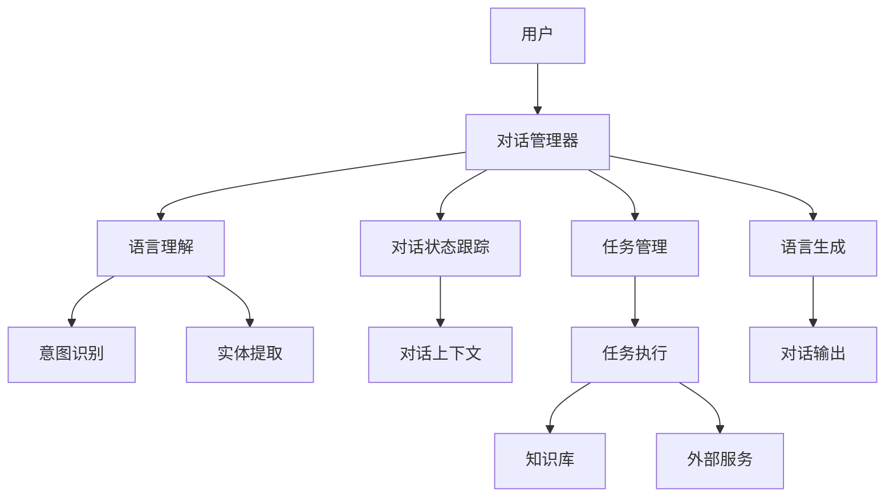

                 

**CUI推动数字产品设计从功能导向到任务导向**

**作者：禅与计算机程序设计艺术 / Zen and the Art of Computer Programming**

## 1. 背景介绍

在数字产品设计领域，传统的设计理念往往是功能导向的，即根据产品的功能特性来设计用户界面。然而，这种方法忽略了用户的实际需求和任务，导致产品设计不够人性化，用户体验不佳。随着人工智能和自然语言处理技术的发展，基于对话的用户界面（CUI）逐渐成为数字产品设计的新趋势。CUI将用户任务置于设计的核心，通过对话交互帮助用户高效完成任务，从而推动数字产品设计从功能导向转变为任务导向。

## 2. 核心概念与联系

### 2.1 核心概念

- **对话交互（Conversational Interaction）**：用户通过自然语言与产品进行交互，产品理解用户意图并提供相应服务。
- **任务导向（Task-oriented）**：将用户任务置于设计的核心，设计目标是帮助用户高效完成任务。
- **CUI系统架构（CUI System Architecture）**：CUI系统的组成部分及其交互关系。

### 2.2 CUI系统架构



## 3. 核心算法原理 & 具体操作步骤

### 3.1 算法原理概述

CUI系统的核心算法包括语言理解、对话状态跟踪、任务管理和语言生成。这些算法共同协作，理解用户意图，跟踪对话状态，管理任务执行，并生成相应的对话输出。

### 3.2 算法步骤详解

1. **语言理解**：
   - **意图识别**：使用机器学习模型（如神经网络）识别用户意图。
   - **实体提取**：提取用户输入中的关键实体（如人名、地名、时间等）。
2. **对话状态跟踪**：使用隐马尔可夫模型（HMM）或神经网络跟踪对话状态，维护对话上下文。
3. **任务管理**：根据用户意图和对话状态，选择合适的任务执行模块，并协调任务执行。
4. **语言生成**：根据任务执行结果，使用模板或序列-to-序列模型生成对话输出。

### 3.3 算法优缺点

**优点**：
- 更自然的交互方式，提高用户体验。
- 可以帮助用户高效完成任务。
- 可以学习和适应用户习惯。

**缺点**：
- 理解用户意图和实体的准确性有待提高。
- 对话上下文管理复杂。
- 任务管理需要考虑任务之间的依赖关系。

### 3.4 算法应用领域

CUI技术可以应用于各种数字产品，如虚拟助手、智能家居、客服机器人、搜索引擎等。它 particularly适合于需要用户输入大量信息或需要协调多个任务的场景。

## 4. 数学模型和公式 & 详细讲解 & 举例说明

### 4.1 数学模型构建

**对话状态跟踪**可以使用隐马尔可夫模型（HMM）来建模。设对话状态集为$S = \{s_1, s_2,..., s_n\}$, 观测序列为$O = \{o_1, o_2,..., o_m\}$, 状态转移概率矩阵为$A = \{a_{ij}\}$, 发射概率矩阵为$B = \{b_i(k)\}$, 初始状态概率向量为$\pi = \{\pi_i\}$. 则HMM可以表示为$\lambda = (A, B, \pi)$.

### 4.2 公式推导过程

给定观测序列$O = \{o_1, o_2,..., o_m\}$和状态序列$S = \{s_1, s_2,..., s_m\}$, 则状态转移概率$P(S|O, \lambda)$可以表示为：

$$
P(S|O, \lambda) = \alpha_{i_1}(s_1) \prod_{t=1}^{m-1} a_{s_t s_{t+1}} b_{s_{t+1}}(o_{t+1})
$$

其中，$\alpha_{i_1}(s_1) = \pi_{s_1} b_{s_1}(o_1)$是初始状态的概率。

### 4.3 案例分析与讲解

例如，在一个订餐CUI系统中，状态集$S$可以包括"等待用户输入"、 "选择餐厅"、 "选择菜品"等状态。观测序列$O$则是用户输入的文本。使用HMM可以跟踪对话状态，帮助系统理解用户意图。

## 5. 项目实践：代码实例和详细解释说明

### 5.1 开发环境搭建

- 编程语言：Python
- 框架：ChatterBot（一个开源的对话机器人框架）
- 依赖：NumPy, SciPy, TensorFlow, NLTK

### 5.2 源代码详细实现

```python
from chatterbot import ChatBot
from chatterbot.trainers import ChatterBotCorpusTrainer

# 创建ChatBot实例
chatbot = ChatBot('Example Bot')

# 创建trainer并训练
trainer = ChatterBotCorpusTrainer(chatbot)
trainer.train("chatterbot.corpus.english")

# 测试
response = chatbot.get_response("Good morning!")
print(response)
```

### 5.3 代码解读与分析

- 使用ChatterBot框架创建了一个简单的聊天机器人。
- 使用预训练语料库"chatterbot.corpus.english"训练机器人。
- 测试机器人，输入"Good morning!"并打印机器人的响应。

### 5.4 运行结果展示

输入"Good morning!"，机器人可能会响应"Good morning! How can I help you today?"。

## 6. 实际应用场景

### 6.1 当前应用

CUI技术已经应用于各种数字产品，如虚拟助手（如Amazon Alexa、Google Assistant）、智能家居（如Amazon Echo、Google Home）、客服机器人（如Bank of America的Erica）等。

### 6.2 未来应用展望

未来，CUI技术有望应用于更多领域，如自动驾驶（通过语音控制车辆）、医疗保健（通过对话式问诊系统）、教育（通过个性化学习路径）等。此外，CUI技术也有望与其他技术（如AR/VR、物联网）结合，创造更丰富的用户体验。

## 7. 工具和资源推荐

### 7.1 学习资源推荐

- 书籍：《对话系统：人机对话的原理和实践》作者：Liliana Ardissono, David Traum, and Mark A. Finin
- 课程：Coursera上的"Dialog Systems"课程

### 7.2 开发工具推荐

- ChatterBot（Python）
- Microsoft Bot Framework（多种语言）
- Dialogflow（多种语言）
- Rasa（Python）

### 7.3 相关论文推荐

- "End-to-End Memory Networks" by Sukhbaatar et al.
- "A Survey of Dialog Systems" by Traum and Hinkelmann

## 8. 总结：未来发展趋势与挑战

### 8.1 研究成果总结

本文介绍了CUI技术如何推动数字产品设计从功能导向转变为任务导向。我们讨论了CUI系统的核心概念和架构，介绍了核心算法原理，并提供了数学模型和代码实例。

### 8.2 未来发展趋势

未来，CUI技术有望发展为更智能、更个性化的系统。这些系统将能够学习和适应用户习惯，提供更自然、更有效的交互方式。

### 8.3 面临的挑战

然而，CUI技术也面临着挑战，包括理解用户意图和实体的准确性、对话上下文管理、任务管理等。

### 8.4 研究展望

未来的研究将关注于提高CUI系统的理解能力、适应能力和个性化能力。此外，研究还将关注于CUI技术与其他技术的结合，创造更丰富的用户体验。

## 9. 附录：常见问题与解答

**Q：CUI与传统UI有何不同？**

**A**：CUI通过对话交互帮助用户高效完成任务，而传统UI则是功能导向的，更多地关注于产品的功能特性。

**Q：CUI系统的关键组成部分是什么？**

**A**：CUI系统的关键组成部分包括对话管理器、语言理解、对话状态跟踪、任务管理和语言生成。

**Q：CUI技术的应用领域有哪些？**

**A**：CUI技术可以应用于各种数字产品，如虚拟助手、智能家居、客服机器人、搜索引擎等。它 particularly适合于需要用户输入大量信息或需要协调多个任务的场景。

**作者：禅与计算机程序设计艺术 / Zen and the Art of Computer Programming**

