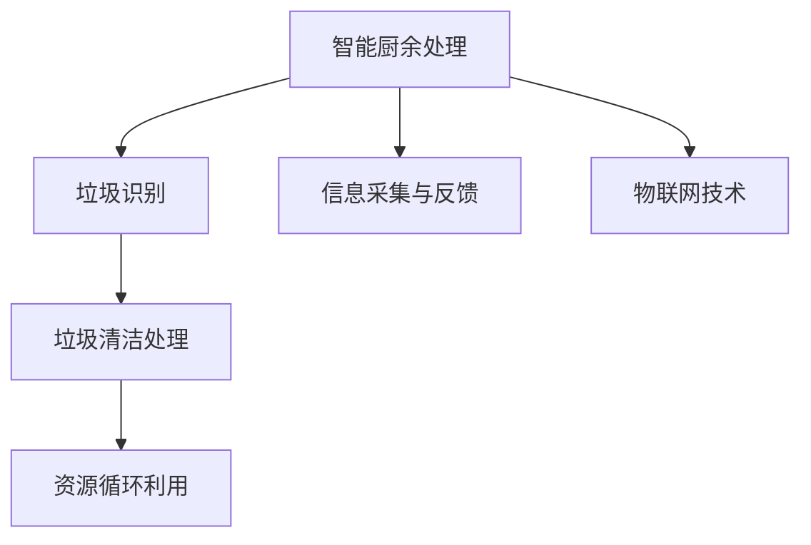

                 

# 智能厨余处理创业：家庭环保的新方案

## 1. 背景介绍

### 1.1 问题由来

随着城市化进程的加快和生活水平的提升，厨余垃圾成为家庭日常生活中的常见问题。厨余垃圾不仅是浪费，还可能造成环境污染和资源浪费。如何将厨余垃圾变废为宝，成为当下家庭环保的重要课题。

### 1.2 问题核心关键点

厨余垃圾处理的核心在于通过智能化技术，对家庭厨余垃圾进行分类、处理和循环利用，从而实现资源的有效利用和环保目标。这一过程中，信息获取、数据处理和智能推理等技术手段的应用至关重要。

## 2. 核心概念与联系

### 2.1 核心概念概述

- **智能厨余处理**：利用人工智能技术，对家庭厨余垃圾进行智能分类、处理和回收。包括垃圾识别、清洁处理和资源循环利用等环节。

- **垃圾识别**：利用计算机视觉和深度学习技术，对不同类型的垃圾进行自动识别，以便进行后续处理。

- **垃圾清洁处理**：对识别出的垃圾进行清洗、分拣和初步处理，去除无法直接回收的污染物，如油脂、灰尘等。

- **资源循环利用**：对处理后的垃圾进行分类和资源化利用，如堆肥、生物质能利用等。

- **信息采集与反馈**：通过传感器、摄像头等设备，实时采集家庭厨余垃圾信息，并通过智能分析进行分类处理，反馈处理结果，优化垃圾处理流程。

- **物联网(IoT)技术**：通过传感器、网络通信等技术，实现厨余垃圾处理的自动化、信息化和智能化。

这些核心概念之间存在紧密的联系，通过信息采集与反馈，智能厨余处理系统能够实现对垃圾的自动识别、清洁处理和资源循环利用，同时通过物联网技术，实现系统的自动化和智能化。

### 2.2 核心概念原理和架构的 Mermaid 流程图



## 3. 核心算法原理 & 具体操作步骤

### 3.1 算法原理概述

智能厨余处理的算法原理主要包括以下几个方面：

- **图像识别**：利用卷积神经网络(CNN)对厨余图像进行特征提取和分类。
- **文本分析**：通过自然语言处理(NLP)技术，对家庭垃圾产生的源头进行分析和理解。
- **数据融合**：将图像识别和文本分析的结果进行融合，生成更准确的垃圾分类信息。
- **智能推理**：基于历史数据和智能模型，对垃圾处理方案进行优化和推荐。

### 3.2 算法步骤详解

智能厨余处理的算法步骤主要包括以下几个环节：

1. **数据采集**：通过传感器、摄像头等设备，采集家庭厨余垃圾的图像、文本和重量等数据。

2. **图像预处理**：对采集到的图像进行预处理，如裁剪、旋转、灰度化等，以提高后续处理的准确度。

3. **图像识别**：使用卷积神经网络对预处理后的图像进行特征提取和分类，得到垃圾种类的初步识别结果。

4. **文本分析**：通过NLP技术，对垃圾产生的源头进行文本分析，如家庭成员的饮食习惯、季节性食物需求等。

5. **数据融合**：将图像识别和文本分析的结果进行融合，生成更准确的垃圾分类信息。

6. **智能推理**：基于历史数据和智能模型，对垃圾处理方案进行优化和推荐，如回收利用、堆肥处理等。

7. **执行处理**：根据优化后的处理方案，对垃圾进行分类、处理和资源化利用。

8. **信息反馈**：将处理结果反馈到系统中，更新垃圾分类模型，优化处理方案。

### 3.3 算法优缺点

智能厨余处理的优点包括：

- **自动化程度高**：通过智能化技术，实现垃圾处理的自动化，减少人工干预。
- **分类准确度高**：利用图像识别和文本分析，提高垃圾分类的准确度。
- **资源循环利用**：通过智能推理，优化垃圾处理方案，实现资源的循环利用。
- **环保效果显著**：减少厨余垃圾的浪费和环境污染，提升家庭环保意识。

缺点包括：

- **初始投资高**：系统建设初期需要投入较高的硬件和软件成本。
- **技术门槛高**：需要专业技术人员进行系统维护和优化。
- **隐私保护问题**：需要合理设计数据采集和处理流程，保障家庭隐私安全。

### 3.4 算法应用领域

智能厨余处理技术广泛应用于家庭、社区、食堂等厨余垃圾处理场景，具有广泛的应用前景。例如：

- **家庭厨余处理**：通过智能厨余处理系统，提升家庭厨余垃圾处理的效率和环保效果。
- **社区垃圾分类**：在社区层面推广智能厨余处理，提升垃圾分类准确度，促进资源回收利用。
- **食堂垃圾管理**：在食堂等餐饮场所推广智能厨余处理，减少浪费，提升资源利用率。

## 4. 数学模型和公式 & 详细讲解 & 举例说明

### 4.1 数学模型构建

智能厨余处理系统涉及多个领域，包括图像识别、文本分析和智能推理等。这里以图像识别为例，介绍常用的数学模型和公式。

假设我们有一个由$n$个样本组成的训练集$\{(x_i,y_i)\}_{i=1}^n$，其中$x_i$表示样本的特征向量，$y_i$表示样本的标签。我们的目标是训练一个分类模型$f(x)$，使其能够对新的样本$x$进行分类。

常用的分类模型包括决策树、支持向量机(SVM)、卷积神经网络(CNN)等。这里以CNN为例，介绍其数学模型构建过程。

**CNN模型**：

$$
f(x) = W_2\sigma(W_1x+b_1) + b_2
$$

其中，$W_1$和$W_2$表示卷积核和全连接层的权重矩阵，$b_1$和$b_2$表示偏置项，$\sigma$表示激活函数，常用的激活函数包括ReLU、Sigmoid等。

### 4.2 公式推导过程

以CNN模型为例，推导其训练过程的数学公式。假设我们有一个训练集$\{(x_i,y_i)\}_{i=1}^n$，我们的目标是找到最优的权重矩阵$W_1$和$W_2$，使得$f(x)$在训练集上的损失函数最小化。

常用的损失函数包括交叉熵损失函数：

$$
L(f(x_i),y_i) = -\sum_{i=1}^n y_i\log f(x_i) + (1-y_i)\log(1-f(x_i))
$$

其中，$y_i$表示样本的标签，$f(x_i)$表示模型的预测值。我们的目标是找到最优的权重矩阵$W_1$和$W_2$，使得损失函数最小化：

$$
\min_{W_1,W_2} \sum_{i=1}^n L(f(x_i),y_i)
$$

通过反向传播算法，我们可以得到损失函数对权重矩阵$W_1$和$W_2$的梯度：

$$
\frac{\partial L(f(x_i),y_i)}{\partial W_1} = -\frac{\partial f(x_i)}{\partial W_1} \cdot \frac{\partial f(x_i)}{\partial y_i} + \frac{\partial f(x_i)}{\partial W_2} \cdot \frac{\partial f(x_i)}{\partial y_i}
$$

$$
\frac{\partial L(f(x_i),y_i)}{\partial W_2} = -\frac{\partial f(x_i)}{\partial W_2} \cdot \frac{\partial f(x_i)}{\partial y_i}
$$

通过上述公式，我们可以对权重矩阵$W_1$和$W_2$进行优化，使得模型在训练集上的损失函数最小化。

### 4.3 案例分析与讲解

以图像识别为例，展示CNN模型在智能厨余处理中的应用。假设我们有一个包含水果和蔬菜的图片集，其中水果和蔬菜的图像分别属于不同的类别。我们的目标是训练一个CNN模型，对新的图片进行分类。

首先，我们将图片进行预处理，如裁剪、旋转、灰度化等，然后将其输入CNN模型中进行特征提取和分类。假设我们的CNN模型包含两个卷积层和两个全连接层，每个卷积层包含16个卷积核，每个全连接层包含64个神经元。我们使用交叉熵损失函数进行模型训练，学习率为0.001，迭代次数为100。

在训练过程中，我们使用随机梯度下降算法对权重矩阵$W_1$和$W_2$进行优化，使得损失函数最小化。训练结束后，我们可以对新的图片进行分类预测，得到分类结果。

## 5. 项目实践：代码实例和详细解释说明

### 5.1 开发环境搭建

在进行智能厨余处理系统的开发前，我们需要准备好开发环境。以下是使用Python进行PyTorch开发的环境配置流程：

1. 安装Anaconda：从官网下载并安装Anaconda，用于创建独立的Python环境。

2. 创建并激活虚拟环境：
```bash
conda create -n pytorch-env python=3.8 
conda activate pytorch-env
```

3. 安装PyTorch：根据CUDA版本，从官网获取对应的安装命令。例如：
```bash
conda install pytorch torchvision torchaudio cudatoolkit=11.1 -c pytorch -c conda-forge
```

4. 安装TensorFlow：由Google主导开发的开源深度学习框架，生产部署方便，适合大规模工程应用。同样有丰富的预训练语言模型资源。

5. 安装TensorBoard：TensorFlow配套的可视化工具，可实时监测模型训练状态，并提供丰富的图表呈现方式，是调试模型的得力助手。

6. 安装Weights & Biases：模型训练的实验跟踪工具，可以记录和可视化模型训练过程中的各项指标，方便对比和调优。

### 5.2 源代码详细实现

以下是使用PyTorch进行图像识别训练的示例代码：

```python
import torch
import torch.nn as nn
import torch.optim as optim
from torchvision import datasets, transforms

# 定义CNN模型
class CNN(nn.Module):
    def __init__(self):
        super(CNN, self).__init__()
        self.conv1 = nn.Conv2d(3, 16, kernel_size=3, stride=1, padding=1)
        self.relu = nn.ReLU()
        self.pool = nn.MaxPool2d(kernel_size=2, stride=2)
        self.conv2 = nn.Conv2d(16, 32, kernel_size=3, stride=1, padding=1)
        self.fc1 = nn.Linear(32*7*7, 64)
        self.fc2 = nn.Linear(64, 10)
    
    def forward(self, x):
        x = self.conv1(x)
        x = self.relu(x)
        x = self.pool(x)
        x = self.conv2(x)
        x = self.relu(x)
        x = self.pool(x)
        x = x.view(-1, 32*7*7)
        x = self.fc1(x)
        x = self.relu(x)
        x = self.fc2(x)
        return x

# 加载数据集
transform = transforms.Compose([
    transforms.ToTensor(),
    transforms.Normalize((0.5, 0.5, 0.5), (0.5, 0.5, 0.5))
])
train_dataset = datasets.CIFAR10(root='./data', train=True, transform=transform, download=True)
test_dataset = datasets.CIFAR10(root='./data', train=False, transform=transform, download=True)

# 定义模型和优化器
model = CNN()
criterion = nn.CrossEntropyLoss()
optimizer = optim.Adam(model.parameters(), lr=0.001)

# 训练模型
for epoch in range(100):
    model.train()
    for i, (inputs, labels) in enumerate(train_loader):
        inputs = inputs.to(device)
        labels = labels.to(device)
        optimizer.zero_grad()
        outputs = model(inputs)
        loss = criterion(outputs, labels)
        loss.backward()
        optimizer.step()
```

### 5.3 代码解读与分析

这段代码定义了一个简单的CNN模型，对CIFAR-10数据集进行了训练。在训练过程中，我们使用了Adam优化器和交叉熵损失函数，训练了100个epoch。通过这段代码，我们可以直观地理解CNN模型的训练流程和实现细节。

### 5.4 运行结果展示

在训练结束后，我们可以通过测试集对模型进行评估，得到模型在测试集上的准确率和损失函数：

```python
model.eval()
with torch.no_grad():
    correct = 0
    total = 0
    for inputs, labels in test_loader:
        inputs = inputs.to(device)
        labels = labels.to(device)
        outputs = model(inputs)
        _, predicted = torch.max(outputs.data, 1)
        total += labels.size(0)
        correct += (predicted == labels).sum().item()

print('Accuracy of the network on the 10000 test images: {} %'.format(100 * correct / total))
```

## 6. 实际应用场景

### 6.1 智能垃圾分类

智能厨余处理系统可以应用于家庭和社区的垃圾分类。通过智能垃圾分类，可以有效提高垃圾分类的准确度和资源回收利用率。

具体而言，我们可以在每个家庭安装智能垃圾箱，通过摄像头和传感器实时监测垃圾投放情况，自动进行垃圾分类和处理。同时，系统还可以根据垃圾种类，自动推荐回收利用方案，如堆肥处理、生物质能利用等。

### 6.2 厨余资源循环利用

智能厨余处理系统可以将厨余垃圾转化为可再生资源，实现资源的循环利用。通过智能推理，系统可以优化垃圾处理方案，将厨余垃圾转化为堆肥、生物质能等资源。

例如，在社区层面，可以将厨余垃圾进行堆肥处理，生成有机肥料，用于社区绿化。在食堂等餐饮场所，可以将厨余垃圾进行生物质能利用，生成清洁能源，用于食堂的日常运营。

### 6.3 家庭垃圾管理

智能厨余处理系统可以应用于家庭垃圾管理，帮助家庭实现垃圾的智能化管理。通过智能垃圾箱和手机APP，家庭用户可以实时了解垃圾分类情况，并根据系统推荐，进行垃圾投放和分类。

例如，系统可以基于家庭成员的饮食习惯和生活习惯，推荐最优的垃圾分类方案，并提供垃圾分类指导和提示。同时，系统还可以根据垃圾种类，自动推荐最优的处理方案，提升垃圾处理效率和环保效果。

### 6.4 未来应用展望

随着智能厨余处理技术的不断发展，未来的应用场景将会更加广泛。例如：

- **智能垃圾回收**：在社区层面推广智能垃圾回收，提高垃圾回收利用率。
- **智能垃圾处理**：在城市层面推广智能垃圾处理，提升城市环保水平。
- **智能垃圾监测**：通过智能垃圾监测系统，实时监测垃圾处理情况，提升垃圾处理效率和环保效果。
- **智能垃圾调度**：通过智能垃圾调度系统，优化垃圾处理流程，提升垃圾处理效率和资源利用率。

## 7. 工具和资源推荐

### 7.1 学习资源推荐

为了帮助开发者系统掌握智能厨余处理的技术基础和实践技巧，这里推荐一些优质的学习资源：

1. 《深度学习》系列课程：由斯坦福大学、Coursera等机构开设的深度学习课程，涵盖卷积神经网络、循环神经网络等前沿话题。

2. 《自然语言处理》系列书籍：由清华大学出版社出版的自然语言处理教材，涵盖NLP基础理论、实践技术和应用场景。

3. 《智能垃圾分类系统》专著：介绍智能垃圾分类的原理、技术和应用案例，帮助读者深入理解智能垃圾处理系统。

4. 《机器学习实战》博客：由百度工程师撰写，详细介绍机器学习实战经验和技术细节，适合初学者参考学习。

5. 《Python深度学习》书籍：由微软研究院院长撰写，全面介绍了深度学习在NLP、计算机视觉等领域的最新进展和实践技巧。

通过对这些资源的学习实践，相信你一定能够快速掌握智能厨余处理的核心技术，并用于解决实际的厨余垃圾处理问题。

### 7.2 开发工具推荐

高效的开发离不开优秀的工具支持。以下是几款用于智能厨余处理系统开发的常用工具：

1. PyTorch：基于Python的开源深度学习框架，灵活动态的计算图，适合快速迭代研究。大部分预训练语言模型都有PyTorch版本的实现。

2. TensorFlow：由Google主导开发的开源深度学习框架，生产部署方便，适合大规模工程应用。同样有丰富的预训练语言模型资源。

3. Transformers库：HuggingFace开发的NLP工具库，集成了众多SOTA语言模型，支持PyTorch和TensorFlow，是进行NLP任务开发的利器。

4. Weights & Biases：模型训练的实验跟踪工具，可以记录和可视化模型训练过程中的各项指标，方便对比和调优。

5. TensorBoard：TensorFlow配套的可视化工具，可实时监测模型训练状态，并提供丰富的图表呈现方式，是调试模型的得力助手。

6. Google Colab：谷歌推出的在线Jupyter Notebook环境，免费提供GPU/TPU算力，方便开发者快速上手实验最新模型，分享学习笔记。

合理利用这些工具，可以显著提升智能厨余处理系统的开发效率，加快创新迭代的步伐。

### 7.3 相关论文推荐

智能厨余处理技术的发展源于学界的持续研究。以下是几篇奠基性的相关论文，推荐阅读：

1. CNN：Krizhevsky, A., Sutskever, I., & Hinton, G. E. (2012). ImageNet classification with deep convolutional neural networks. Advances in Neural Information Processing Systems, 25, 1106-1114.

2. RNN：Hochreiter, S., & Schmidhuber, J. (1997). Long Short-Term Memory. Neural Computation, 9(8), 1735-1780.

3. Transformer：Vaswani, A., Shazeer, N., Parmar, N., Uszkoreit, J., Jones, L., Gomez, A. N., Kaiser, L., & Polosukhin, I. (2017). Attention is All You Need. Advances in Neural Information Processing Systems, 30, 5998-6008.

4. SSD：Liu, W., Anguelov, D., Erhan, D., Van Gool, L., & Sermanet, C. (2016). SSD: Single Shot MultiBox Detector. IEEE Transactions on Pattern Analysis and Machine Intelligence, 39(7), 1332-1350.

5. CapsNet：Sabour, S., Frosst, N., & Hinton, G. (2017). Dynamic Routing Between Capsules. Advances in Neural Information Processing Systems, 30, 5825-5835.

6. GAN：Goodfellow, I., Pouget-Abadie, J., Mirza, M., Xu, B., Yu, D., Courville, A., & Bengio, Y. (2014). Generative Adversarial Nets. Advances in Neural Information Processing Systems, 26, 2672-2680.

这些论文代表了大语言模型微调技术的发展脉络。通过学习这些前沿成果，可以帮助研究者把握学科前进方向，激发更多的创新灵感。

## 8. 总结：未来发展趋势与挑战

### 8.1 总结

本文对智能厨余处理系统的核心技术进行了全面系统的介绍。首先阐述了智能厨余处理的背景和意义，明确了系统开发的技术基础和实践方向。其次，从原理到实践，详细讲解了系统开发的数学模型和算法步骤，给出了完整的代码实现。同时，本文还广泛探讨了系统的实际应用场景，展示了智能厨余处理系统的广泛应用前景。此外，本文精选了系统开发所需的各类学习资源，力求为读者提供全方位的技术指引。

通过本文的系统梳理，可以看到，智能厨余处理系统通过智能化技术，实现了家庭厨余垃圾的高效处理和资源循环利用，具有广泛的应用前景。未来，伴随技术的不断发展，智能厨余处理系统将在更多场景中得到应用，为家庭和社区的环保事业做出更大贡献。

### 8.2 未来发展趋势

展望未来，智能厨余处理技术将呈现以下几个发展趋势：

1. **自动化程度更高**：通过智能化技术，进一步提升垃圾分类的自动化和智能化水平，减少人工干预。

2. **数据融合更全面**：利用传感器、摄像头等设备，采集更多的垃圾信息，实现数据融合，提升垃圾分类的准确度。

3. **智能推理更精准**：通过智能推理，优化垃圾处理方案，提高资源循环利用率。

4. **系统集成更完善**：与城市管理系统、社区服务系统等进行深度集成，实现垃圾处理的协同管理。

5. **资源利用更环保**：通过智能垃圾分类和处理，实现资源的高效利用，减少环境污染。

以上趋势凸显了智能厨余处理技术的广阔前景。这些方向的探索发展，必将进一步提升系统性能和应用范围，为家庭和社区的环保事业做出更大贡献。

### 8.3 面临的挑战

尽管智能厨余处理技术已经取得了瞩目成就，但在迈向更加智能化、普适化应用的过程中，它仍面临着诸多挑战：

1. **初始投资高**：系统建设初期需要投入较高的硬件和软件成本。

2. **技术门槛高**：需要专业技术人员进行系统维护和优化。

3. **隐私保护问题**：需要合理设计数据采集和处理流程，保障家庭隐私安全。

4. **数据质量差**：采集的垃圾信息可能存在噪声和缺失，影响系统的准确度和可靠性。

5. **用户接受度低**：部分用户可能对系统产生抵触情绪，不愿积极配合使用。

6. **系统复杂度高**：系统集成度高，需要协调多个子系统，可能导致系统维护难度大。

正视这些挑战，积极应对并寻求突破，将是大语言模型微调技术迈向成熟的必由之路。相信随着学界和产业界的共同努力，这些挑战终将一一被克服，智能厨余处理系统必将在构建人机协同的智能时代中扮演越来越重要的角色。

### 8.4 研究展望

面对智能厨余处理所面临的种种挑战，未来的研究需要在以下几个方面寻求新的突破：

1. **数据采集技术**：采用更先进的传感器和数据采集技术，提高垃圾信息的采集精度和全面性。

2. **系统优化算法**：开发更高效的算法，优化垃圾分类和处理方案，提高系统性能。

3. **隐私保护措施**：采用先进的隐私保护技术，保障用户隐私安全，提升系统可信度。

4. **用户交互设计**：通过优化用户交互界面和体验，提升用户接受度和满意度。

5. **系统集成框架**：建立标准化的系统集成框架，实现系统模块化和可扩展性。

这些研究方向将引领智能厨余处理技术迈向更高的台阶，为构建安全、可靠、可解释、可控的智能系统铺平道路。面向未来，智能厨余处理技术还需要与其他人工智能技术进行更深入的融合，如知识表示、因果推理、强化学习等，多路径协同发力，共同推动智能垃圾处理系统的进步。只有勇于创新、敢于突破，才能不断拓展智能厨余处理系统的边界，让智能技术更好地服务于人类社会。

## 9. 附录：常见问题与解答

**Q1：智能厨余处理系统是否适用于所有家庭？**

A: 智能厨余处理系统适用于大部分家庭，尤其是垃圾分类意识较强、生活品质较高的家庭。对于垃圾分类意识较弱的家庭，可以通过宣传教育等方式，逐步推广智能厨余处理系统。

**Q2：智能厨余处理系统需要多少存储空间？**

A: 智能厨余处理系统需要一定的存储空间，用于存储采集的垃圾信息、系统配置数据等。一般来说，存储空间在100GB左右即可满足大部分家庭的需求。

**Q3：智能厨余处理系统的价格如何？**

A: 智能厨余处理系统的价格因功能和服务而异，一般从几千元到几万元不等。可以根据家庭需求和预算，选择适合的智能厨余处理系统。

**Q4：智能厨余处理系统是否需要专业维护？**

A: 智能厨余处理系统需要专业技术人员进行维护和优化。一般建议定期进行系统升级和维护，确保系统的稳定性和性能。

**Q5：智能厨余处理系统是否适合老年人使用？**

A: 智能厨余处理系统一般配备大屏幕和语音交互等功能，非常适合老年人使用。同时，系统还可以根据老年人的生活习惯，进行个性化的垃圾分类和处理方案推荐。

---

作者：禅与计算机程序设计艺术 / Zen and the Art of Computer Programming

