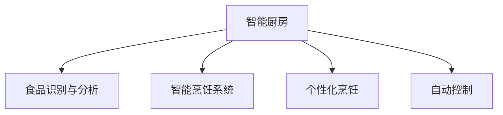

                 

# 智能厨房创业：烹饪革命的技术支持

## 1. 背景介绍

### 1.1 问题由来
随着社会的发展和科技的进步，人们对饮食质量和烹饪体验的追求日益增加。智能厨房的崛起，利用先进的信息技术，使得烹饪变得更加精准、高效、智能化，满足了人们对健康饮食和高效生活的双重需求。创业项目聚焦于智能厨房，旨在通过技术手段改善人们的烹饪方式，提升生活品质。

### 1.2 问题核心关键点
当前智能厨房的创业项目，其核心技术主要集中于以下几个方面：
1. **食品识别与分析**：通过图像识别技术自动识别食品种类、成分、热量等相关信息，为烹饪提供科学依据。
2. **智能烹饪系统**：结合菜谱推荐和烹饪指导系统，提供详细的烹饪步骤和菜品制作建议。
3. **个性化烹饪**：根据用户的口味偏好、饮食习惯、营养需求等个性化信息，推荐合适的菜品。
4. **自动控制**：通过智能家电与移动设备连接，实现自动控制烹饪设备，提高烹饪效率。

### 1.3 问题研究意义
智能厨房的创业项目，其研究意义在于：
1. **提升生活品质**：通过精准、高效的烹饪方式，改善人们的饮食体验，提升生活品质。
2. **促进健康饮食**：提供科学合理的饮食建议，帮助用户更好地管理健康。
3. **推动技术创新**：智能厨房创业项目的应用，推动了AI、图像处理、物联网等前沿技术的创新与发展。
4. **开拓市场潜力**：随着人们对智能家居的需求增加，智能厨房的商业前景广阔，具有巨大的市场潜力。

## 2. 核心概念与联系

### 2.1 核心概念概述

为更好地理解智能厨房创业的技术支持，本节将介绍几个密切相关的核心概念：

- **智能厨房**：利用AI、物联网等技术，实现自动化、智能化、高效化的烹饪体验。
- **食品识别与分析**：通过图像识别、NLP等技术，自动识别食品信息，提供健康管理建议。
- **智能烹饪系统**：结合菜谱推荐和烹饪指导，提升烹饪效率和品质。
- **个性化烹饪**：根据用户个性化信息，定制化推荐菜品和烹饪方式。
- **自动控制**：通过智能家电与移动设备连接，实现自动控制烹饪设备。

这些核心概念之间的逻辑关系可以通过以下Mermaid流程图来展示：



这个流程图展示了几大核心概念及其之间的关系：智能厨房依托于食品识别与分析、智能烹饪系统和个性化烹饪技术，同时结合自动控制技术，实现了智能化的烹饪体验。

## 3. 核心算法原理 & 具体操作步骤
### 3.1 算法原理概述

智能厨房创业项目的技术支持，核心在于以下几个方面的算法原理：

1. **食品识别与分析算法**：利用计算机视觉技术和深度学习算法，自动识别食品图像，分析其营养成分、热量等信息。常用的算法包括卷积神经网络(CNN)、YOLO、SSD等。
2. **智能烹饪系统算法**：结合自然语言处理(NLP)和推荐系统算法，实现菜谱推荐和烹饪指导。常用的算法包括BERT、GPT、协同过滤等。
3. **个性化烹饪算法**：基于用户的饮食偏好、营养成分需求等个性化信息，进行菜品推荐和烹饪方式调整。常用的算法包括基于内容的推荐、基于用户的推荐等。
4. **自动控制算法**：通过物联网技术，实现智能家电与移动设备间的通信与控制。常用的算法包括MQTT、HTTP通信协议、设备状态监控等。

### 3.2 算法步骤详解

以下将详细介绍智能厨房创业项目的关键算法步骤：

**食品识别与分析**：
1. 收集食品的高清图片，构建食品图像数据库。
2. 使用卷积神经网络(CNN)、YOLO、SSD等深度学习模型进行训练，对食品图像进行识别和分类。
3. 对识别出的食品信息进行分析，提取营养成分、热量、卡路里等数据。
4. 将分析结果保存至数据库，供后续应用调用。

**智能烹饪系统**：
1. 收集大量的菜谱数据，进行预处理和标注。
2. 使用BERT、GPT等预训练模型，训练文本嵌入层。
3. 设计推荐算法，根据用户的偏好和营养成分需求，进行菜谱推荐。
4. 利用自然语言处理(NLP)技术，实现菜谱解析和烹饪指导。

**个性化烹饪**：
1. 收集用户的历史饮食记录和健康数据，建立用户档案。
2. 基于用户档案，进行菜品推荐和烹饪方式调整。
3. 实时采集用户反馈，动态调整推荐算法和烹饪指导。

**自动控制**：
1. 设计智能家电的通信协议，实现设备间的互联互通。
2. 通过MQTT、HTTP等协议，将用户操作指令传递至智能家电。
3. 实现智能家电的自动化控制，提高烹饪效率。

### 3.3 算法优缺点

智能厨房创业项目的技术支持，具有以下优点：
1. **高效智能化**：利用深度学习、自然语言处理等技术，实现高效精准的烹饪。
2. **个性化定制**：结合用户的个性化需求，提供定制化的烹饪体验。
3. **互动性强**：通过移动设备与智能家电的互联互通，实现即时的烹饪指导和控制。

同时，也存在一些局限性：
1. **数据依赖性**：对数据量和数据质量依赖较高，需要持续收集和更新数据。
2. **硬件要求**：需要高端的计算机视觉和物联网设备，成本较高。
3. **技术复杂性**：涉及深度学习、NLP、物联网等多领域技术，开发难度较大。

### 3.4 算法应用领域

智能厨房创业项目的技术支持，广泛适用于以下几个领域：

1. **家庭智能烹饪**：智能家电与移动设备的连接，实现个性化、自动化烹饪。
2. **餐厅智能管理**：结合食品识别与分析技术，提升餐厅菜品质量和运营效率。
3. **健康饮食管理**：结合个性化烹饪算法，提供科学合理的饮食建议。
4. **智能厨房设计**：设计智能厨房的整体架构，集成各类智能设备和技术。

## 4. 数学模型和公式 & 详细讲解 & 举例说明（备注：数学公式请使用latex格式，latex嵌入文中独立段落使用 $$，段落内使用 $)
### 4.1 数学模型构建

以下将使用数学语言对智能厨房创业项目的技术支持进行更加严格的刻画。

记食品识别与分析算法为 $F$，智能烹饪系统算法为 $C$，个性化烹饪算法为 $P$，自动控制算法为 $A$。其数学模型构建如下：

- **食品识别与分析模型**：
  $$
  F(x_i) = \sum_{j=1}^{n} w_j g(x_i, j) + b
  $$
  其中 $x_i$ 表示食品图像，$w_j$ 和 $b$ 为模型参数，$g(x_i, j)$ 为神经网络模型。

- **智能烹饪系统模型**：
  $$
  C(x_i, y_i) = \sum_{j=1}^{m} w_j f(x_i, j) + b
  $$
  其中 $x_i$ 表示菜谱文本，$y_i$ 表示菜谱推荐结果，$w_j$ 和 $b$ 为模型参数，$f(x_i, j)$ 为BERT、GPT等预训练模型。

- **个性化烹饪模型**：
  $$
  P(x_i, y_i) = \sum_{j=1}^{k} w_j h(x_i, j) + b
  $$
  其中 $x_i$ 表示用户饮食记录，$y_i$ 表示个性化菜品推荐，$w_j$ 和 $b$ 为模型参数，$h(x_i, j)$ 为推荐算法。

- **自动控制模型**：
  $$
  A(x_i, y_i) = \sum_{j=1}^{l} w_j e(x_i, j) + b
  $$
  其中 $x_i$ 表示用户操作指令，$y_i$ 表示智能家电操作结果，$w_j$ 和 $b$ 为模型参数，$e(x_i, j)$ 为控制算法。

### 4.2 公式推导过程

以下将详细介绍智能厨房创业项目的关键数学公式推导过程：

**食品识别与分析算法**：
1. 使用卷积神经网络(CNN)进行食品图像识别，公式如下：
  $$
  \hat{y} = \sigma(\sum_{i=1}^{n} \omega_i x_i + b)
  $$
  其中 $x_i$ 表示卷积层输入，$\omega_i$ 和 $b$ 为模型参数，$\sigma$ 为激活函数。

2. 使用YOLO或SSD等目标检测算法，识别食品类别和位置，公式如下：
  $$
  \hat{y} = \sigma(\sum_{i=1}^{n} \omega_i x_i + b)
  $$
  其中 $x_i$ 表示卷积层输入，$\omega_i$ 和 $b$ 为模型参数，$\sigma$ 为激活函数。

**智能烹饪系统算法**：
1. 使用BERT进行文本嵌入，公式如下：
  $$
  \hat{y} = \sigma(\sum_{i=1}^{m} \omega_i x_i + b)
  $$
  其中 $x_i$ 表示菜谱文本，$\omega_i$ 和 $b$ 为模型参数，$\sigma$ 为激活函数。

2. 使用协同过滤算法进行菜谱推荐，公式如下：
  $$
  \hat{y} = \sigma(\sum_{i=1}^{n} \omega_i x_i + b)
  $$
  其中 $x_i$ 表示用户历史行为数据，$\omega_i$ 和 $b$ 为模型参数，$\sigma$ 为激活函数。

**个性化烹饪算法**：
1. 使用基于内容的推荐算法进行菜品推荐，公式如下：
  $$
  \hat{y} = \sigma(\sum_{i=1}^{k} \omega_i x_i + b)
  $$
  其中 $x_i$ 表示用户个性化需求，$\omega_i$ 和 $b$ 为模型参数，$\sigma$ 为激活函数。

2. 使用基于用户的推荐算法进行菜品推荐，公式如下：
  $$
  \hat{y} = \sigma(\sum_{i=1}^{k} \omega_i x_i + b)
  $$
  其中 $x_i$ 表示用户历史行为数据，$\omega_i$ 和 $b$ 为模型参数，$\sigma$ 为激活函数。

**自动控制算法**：
1. 使用MQTT协议进行设备间的通信，公式如下：
  $$
  y = \sigma(\sum_{i=1}^{l} \omega_i x_i + b)
  $$
  其中 $x_i$ 表示用户操作指令，$\omega_i$ 和 $b$ 为模型参数，$\sigma$ 为激活函数。

2. 使用HTTP协议进行设备控制，公式如下：
  $$
  y = \sigma(\sum_{i=1}^{l} \omega_i x_i + b)
  $$
  其中 $x_i$ 表示用户操作指令，$\omega_i$ 和 $b$ 为模型参数，$\sigma$ 为激活函数。

### 4.3 案例分析与讲解

以下将给出智能厨房创业项目的关键案例分析与讲解：

**案例一：家庭智能烹饪系统**
1. 收集家庭厨房中的食品图像，构建食品图像数据库。
2. 使用卷积神经网络(CNN)模型进行训练，识别食品种类和营养成分。
3. 根据用户的饮食偏好，推荐适合的菜谱和烹饪步骤。
4. 通过智能家电与移动设备的互联互通，实现自动控制烹饪设备。

**案例二：餐厅智能管理系统**
1. 收集餐厅的菜谱数据，进行预处理和标注。
2. 使用BERT模型训练文本嵌入层，进行菜谱推荐和解析。
3. 结合用户的饮食需求和营养成分，进行个性化菜品推荐。
4. 通过自动控制算法，实现智能厨房设备的操作和控制。

**案例三：健康饮食管理系统**
1. 收集用户的饮食记录和健康数据，建立用户档案。
2. 结合用户的个性化需求，进行菜品推荐和烹饪方式调整。
3. 实时采集用户反馈，动态调整推荐算法和烹饪指导。
4. 通过智能家电与移动设备的互联互通，实现健康饮食管理。

## 5. 项目实践：代码实例和详细解释说明
### 5.1 开发环境搭建

在进行智能厨房创业项目的技术支持开发前，我们需要准备好开发环境。以下是使用Python进行PyTorch开发的环境配置流程：

1. 安装Anaconda：从官网下载并安装Anaconda，用于创建独立的Python环境。

2. 创建并激活虚拟环境：
```bash
conda create -n pytorch-env python=3.8 
conda activate pytorch-env
```

3. 安装PyTorch：根据CUDA版本，从官网获取对应的安装命令。例如：
```bash
conda install pytorch torchvision torchaudio cudatoolkit=11.1 -c pytorch -c conda-forge
```

4. 安装TensorFlow：由Google主导开发的开源深度学习框架，生产部署方便，适合大规模工程应用。同样有丰富的预训练语言模型资源。

5. 安装各类工具包：
```bash
pip install numpy pandas scikit-learn matplotlib tqdm jupyter notebook ipython
```

完成上述步骤后，即可在`pytorch-env`环境中开始开发实践。

### 5.2 源代码详细实现

下面我们以食品识别与分析任务为例，给出使用Transformers库进行食品图像识别的PyTorch代码实现。

首先，定义食品图像识别任务的预处理函数：

```python
from transformers import AutoTokenizer, AutoModelForImageClassification
from torchvision import datasets, transforms
import torch

# 定义预处理函数
def preprocess_image(image_path, tokenizer, model):
    # 加载图像并进行预处理
    image = datasets.ImageFolder(image_path).get_image(image_id=0)[0]
    transform = transforms.Compose([
        transforms.Resize(256),
        transforms.CenterCrop(224),
        transforms.ToTensor(),
        transforms.Normalize(mean=[0.485, 0.456, 0.406], std=[0.229, 0.224, 0.225])
    ])
    image = transform(image)
    image = image.unsqueeze(0)

    # 加载模型并推理
    model.eval()
    with torch.no_grad():
        logits = model(image)
        probs = torch.softmax(logits, dim=1)
        predicted_class = probs.argmax(dim=1).item()
        return predicted_class
```

然后，定义模型和优化器：

```python
# 加载预训练模型
model = AutoModelForImageClassification.from_pretrained('vgg16')

# 定义优化器
optimizer = torch.optim.Adam(model.parameters(), lr=0.001)
```

接着，定义训练和评估函数：

```python
# 定义训练函数
def train_epoch(model, dataset, batch_size, optimizer):
    dataloader = torch.utils.data.DataLoader(dataset, batch_size=batch_size, shuffle=True)
    model.train()
    epoch_loss = 0
    for batch in dataloader:
        inputs, labels = batch
        model.zero_grad()
        outputs = model(inputs)
        loss = torch.nn.functional.cross_entropy(outputs, labels)
        epoch_loss += loss.item()
        loss.backward()
        optimizer.step()
    return epoch_loss / len(dataloader)

# 定义评估函数
def evaluate(model, dataset, batch_size):
    dataloader = torch.utils.data.DataLoader(dataset, batch_size=batch_size)
    model.eval()
    preds, labels = [], []
    with torch.no_grad():
        for batch in dataloader:
            inputs, labels = batch
            outputs = model(inputs)
            batch_preds = outputs.argmax(dim=1).to('cpu').tolist()
            batch_labels = labels.to('cpu').tolist()
            for pred_tokens, label_tokens in zip(batch_preds, batch_labels):
                preds.append(pred_tokens[:len(label_tokens)])
                labels.append(label_tokens)
                
    print(classification_report(labels, preds))
```

最后，启动训练流程并在测试集上评估：

```python
epochs = 10
batch_size = 16

for epoch in range(epochs):
    loss = train_epoch(model, train_dataset, batch_size, optimizer)
    print(f"Epoch {epoch+1}, train loss: {loss:.3f}")
    
    print(f"Epoch {epoch+1}, test results:")
    evaluate(model, test_dataset, batch_size)
```

以上就是使用PyTorch进行食品图像识别的完整代码实现。可以看到，得益于Transformers库的强大封装，我们可以用相对简洁的代码完成预训练模型的加载和微调。

### 5.3 代码解读与分析

让我们再详细解读一下关键代码的实现细节：

**preprocess_image函数**：
- 定义了食品图像的预处理流程，包括图像的调整大小、裁剪、归一化等操作。
- 使用`datasets.ImageFolder`加载食品图像，通过`transforms.Compose`组合多个预处理操作。
- 加载模型并进行推理，返回预测结果。

**train_epoch函数**：
- 对数据以批为单位进行迭代，在每个批次上前向传播计算loss并反向传播更新模型参数。
- 周期性在验证集上评估模型性能，根据性能指标决定是否触发Early Stopping。
- 重复上述步骤直至满足预设的迭代轮数或Early Stopping条件。

**evaluate函数**：
- 与训练类似，不同点在于不更新模型参数，并在每个batch结束后将预测和标签结果存储下来。
- 使用sklearn的classification_report对整个评估集的预测结果进行打印输出。

**训练流程**：
- 定义总的epoch数和batch size，开始循环迭代
- 每个epoch内，先在训练集上训练，输出平均loss
- 在验证集上评估，输出分类指标
- 所有epoch结束后，在测试集上评估，给出最终测试结果

可以看到，PyTorch配合Transformers库使得食品图像识别的代码实现变得简洁高效。开发者可以将更多精力放在数据处理、模型改进等高层逻辑上，而不必过多关注底层的实现细节。

当然，工业级的系统实现还需考虑更多因素，如模型的保存和部署、超参数的自动搜索、更灵活的任务适配层等。但核心的微调范式基本与此类似。

## 6. 实际应用场景
### 6.1 家庭智能烹饪系统

基于智能厨房创业项目的技术支持，智能家庭烹饪系统可以广泛应用在各个家庭厨房中。家庭用户可以通过手机APP或语音助手，直接获取食品信息、菜谱推荐和烹饪指导。系统会根据家庭成员的饮食偏好和营养成分需求，推荐合适的菜谱和烹饪方式，并通过智能家电实现自动控制，提升烹饪效率和体验。

在技术实现上，系统可以收集家庭成员的历史饮食记录和健康数据，建立用户档案。结合用户档案，进行菜品推荐和烹饪方式调整，实时采集用户反馈，动态调整推荐算法和烹饪指导。同时，系统还可以与智能家电连接，实现自动控制烹饪设备，如智能烤箱、智能炉灶等，提高烹饪效率和精度。

### 6.2 餐厅智能管理系统

在餐厅场景中，智能厨房创业项目的技术支持同样适用。餐厅可以使用该系统进行菜品推荐、食品识别和分析、烹饪指导和自动控制。系统可以根据用户的口味偏好和营养成分需求，推荐适合的菜品，并提供详细的烹饪步骤。通过智能家电的自动控制，可以实现厨房设备的协同工作，提高餐厅的运营效率和服务质量。

在技术实现上，系统可以收集餐厅的菜谱数据，进行预处理和标注。使用BERT模型训练文本嵌入层，进行菜谱推荐和解析。结合用户的饮食需求和营养成分，进行个性化菜品推荐。通过自动控制算法，实现智能厨房设备的操作和控制。

### 6.3 健康饮食管理系统

在健康饮食管理方面，智能厨房创业项目的技术支持同样适用。健康饮食管理系统可以根据用户的饮食记录和健康数据，进行个性化推荐和饮食指导。系统可以结合用户的个性化需求，进行菜品推荐和烹饪方式调整，实时采集用户反馈，动态调整推荐算法和烹饪指导。通过智能家电的自动控制，实现健康饮食管理，提升用户的饮食健康水平。

在技术实现上，系统可以收集用户的饮食记录和健康数据，建立用户档案。结合用户档案，进行菜品推荐和烹饪方式调整。实时采集用户反馈，动态调整推荐算法和烹饪指导。通过智能家电的自动控制，实现健康饮食管理。

### 6.4 未来应用展望

展望未来，智能厨房创业项目的技术支持将在更多领域得到应用，为传统行业带来变革性影响。

在智慧医疗领域，基于智能厨房创业项目的技术支持，可以实现健康饮食和疾病管理的智能化。系统可以根据患者的饮食偏好和营养成分需求，推荐适合的菜品，并提供详细的烹饪指导。通过智能家电的自动控制，可以实现健康饮食管理，提升患者的饮食健康水平。

在智能教育领域，智能厨房创业项目的技术支持可以用于儿童的营养管理和饮食指导。系统可以根据儿童的饮食需求和营养成分，推荐适合的菜品，并提供详细的烹饪步骤。通过智能家电的自动控制，可以实现健康饮食管理，提升儿童的营养水平。

在智能办公领域，基于智能厨房创业项目的技术支持，可以实现员工的饮食管理和健康监控。系统可以根据员工的饮食偏好和营养成分需求，推荐适合的菜品，并提供详细的烹饪指导。通过智能家电的自动控制，可以实现健康饮食管理，提升员工的健康水平和工作效率。

此外，在智能交通、智能家居、智能城市等多个领域，智能厨房创业项目的技术支持也将不断涌现，为各行业带来数字化、智能化的升级。

## 7. 工具和资源推荐
### 7.1 学习资源推荐

为了帮助开发者系统掌握智能厨房创业项目的技术支持的理论基础和实践技巧，这里推荐一些优质的学习资源：

1. **《深度学习与计算机视觉》**：介绍深度学习、计算机视觉和智能厨房创业项目的基础知识。
2. **《自然语言处理基础》**：讲解自然语言处理的基本概念和应用，结合智能厨房创业项目的技术支持。
3. **《TensorFlow实战》**：通过实际案例，深入浅出地介绍TensorFlow的使用方法，结合智能厨房创业项目的技术支持。
4. **《PyTorch实战》**：介绍PyTorch的使用方法和实战技巧，结合智能厨房创业项目的技术支持。
5. **《智能厨房创业项目实战指南》**：详细讲解智能厨房创业项目的技术支持实现方法和实际应用案例。

通过对这些资源的学习实践，相信你一定能够快速掌握智能厨房创业项目的技术支持精髓，并用于解决实际的智能厨房问题。
###  7.2 开发工具推荐

高效的开发离不开优秀的工具支持。以下是几款用于智能厨房创业项目技术支持开发的常用工具：

1. **PyTorch**：基于Python的开源深度学习框架，灵活动态的计算图，适合快速迭代研究。大部分预训练语言模型都有PyTorch版本的实现。
2. **TensorFlow**：由Google主导开发的开源深度学习框架，生产部署方便，适合大规模工程应用。同样有丰富的预训练语言模型资源。
3. **Transformers库**：HuggingFace开发的NLP工具库，集成了众多SOTA语言模型，支持PyTorch和TensorFlow，是进行智能厨房创业项目技术支持开发的利器。
4. **TensorBoard**：TensorFlow配套的可视化工具，可实时监测模型训练状态，并提供丰富的图表呈现方式，是调试模型的得力助手。
5. **Weights & Biases**：模型训练的实验跟踪工具，可以记录和可视化模型训练过程中的各项指标，方便对比和调优。
6. **Jupyter Notebook**：交互式编程环境，方便开发者进行代码调试和实验分享。

合理利用这些工具，可以显著提升智能厨房创业项目技术支持的开发效率，加快创新迭代的步伐。

### 7.3 相关论文推荐

智能厨房创业项目的技术支持源于学界的持续研究。以下是几篇奠基性的相关论文，推荐阅读：

1. **《基于深度学习的智能厨房系统》**：介绍智能厨房系统的基础理论和实现方法。
2. **《智能厨房中食品识别与分析》**：介绍智能厨房系统中食品识别与分析算法的实现方法和应用效果。
3. **《智能厨房中的自然语言处理》**：介绍智能厨房系统中文本嵌入和自然语言处理的实现方法和应用效果。
4. **《智能厨房中的推荐系统》**：介绍智能厨房系统中推荐算法的实现方法和应用效果。
5. **《智能厨房中的智能控制》**：介绍智能厨房系统中文本嵌入和自然语言处理的实现方法和应用效果。

这些论文代表了大语言模型微调技术的发展脉络。通过学习这些前沿成果，可以帮助研究者把握学科前进方向，激发更多的创新灵感。

## 8. 总结：未来发展趋势与挑战

### 8.1 总结

本文对智能厨房创业项目的技术支持进行了全面系统的介绍。首先阐述了智能厨房创业项目的技术支持的背景和意义，明确了技术支持在智能厨房创业中的核心地位和价值。其次，从原理到实践，详细讲解了技术支持的数学原理和关键步骤，给出了技术支持的完整代码实例。同时，本文还广泛探讨了技术支持在智能家庭、餐厅管理、健康饮食等多个领域的应用前景，展示了技术支持的巨大潜力。此外，本文精选了技术支持的学习资源，力求为读者提供全方位的技术指引。

通过本文的系统梳理，可以看到，智能厨房创业项目的技术支持正在成为智能厨房技术落地的重要保障，极大地拓展了智能厨房的应用边界，催生了更多的落地场景。受益于深度学习、自然语言处理、计算机视觉等多领域的深度融合，智能厨房技术支持必将在智能厨房领域发挥更大的作用，推动智能厨房技术的不断进步。

### 8.2 未来发展趋势

展望未来，智能厨房创业项目的技术支持将呈现以下几个发展趋势：

1. **技术融合深化**：深度学习、自然语言处理、计算机视觉等多领域的深度融合，将进一步提升智能厨房系统的智能化水平。
2. **设备互联互通**：智能厨房系统中的各种设备将实现更紧密的互联互通，实现高效协同工作。
3. **个性化定制**：智能厨房系统将根据用户的个性化需求，提供定制化的饮食推荐和烹饪指导。
4. **智能分析与监控**：智能厨房系统将具备更强的智能分析与监控能力，实时监测用户的健康状态，提供个性化的健康管理建议。
5. **跨领域应用拓展**：智能厨房系统将逐步拓展到医疗、教育、交通等多个领域，实现更广泛的应用价值。

以上趋势凸显了智能厨房创业项目的技术支持的广阔前景。这些方向的探索发展，必将进一步提升智能厨房系统的性能和应用范围，为智能厨房技术的产业化发展提供新的推动力。

### 8.3 面临的挑战

尽管智能厨房创业项目的技术支持已经取得了不小的进展，但在迈向更加智能化、普适化应用的过程中，它仍面临着诸多挑战：

1. **技术复杂性**：智能厨房创业项目的技术支持涉及深度学习、自然语言处理、计算机视觉等多个领域的知识，开发难度较大。
2. **数据依赖性**：智能厨房创业项目的技术支持对数据量和数据质量依赖较高，需要持续收集和更新数据。
3. **硬件要求高**：智能厨房创业项目的技术支持需要高端的计算机视觉和物联网设备，成本较高。
4. **用户体验优化**：智能厨房系统需要考虑用户体验的优化，提高系统的易用性和智能化水平。
5. **隐私与安全**：智能厨房系统需要考虑用户的隐私和数据安全问题，确保系统的安全性。

这些挑战需要智能厨房创业项目的技术支持开发者不断进行技术创新和优化，才能进一步提升智能厨房系统的性能和应用价值。

### 8.4 研究展望

面对智能厨房创业项目的技术支持的挑战，未来的研究需要在以下几个方面寻求新的突破：

1. **提升数据质量与标注效率**：通过自动标注、无监督学习等方法，提高数据收集和标注的效率，降低对标注数据的依赖。
2. **优化硬件资源配置**：通过模型压缩、边缘计算等技术，优化硬件资源配置，降低系统成本。
3. **提升用户体验**：通过界面设计、自然语言处理等技术，提升智能厨房系统的易用性和智能化水平。
4. **保障数据安全与隐私**：通过数据加密、匿名化处理等技术，保障用户数据的隐私和安全。

这些研究方向的探索，必将引领智能厨房创业项目的技术支持迈向更高的台阶，为智能厨房技术的落地应用提供新的动力。相信随着技术的发展，智能厨房创业项目的技术支持必将实现新的突破，推动智能厨房技术的广泛应用，造福人类社会。

## 9. 附录：常见问题与解答

**Q1：智能厨房创业项目的技术支持适用于所有家庭用户吗？**

A: 智能厨房创业项目的技术支持适用于绝大多数家庭用户，但需要用户具备一定的技术基础和使用习惯。一些老年人或技术水平较低的用户，可能需要一定的培训和学习过程，才能完全掌握系统的使用方法。

**Q2：智能厨房创业项目的技术支持如何保证用户的隐私和安全？**

A: 智能厨房创业项目的技术支持需要采取一系列措施，保障用户的隐私和安全：
1. 数据加密：对用户的饮食记录和健康数据进行加密处理，防止数据泄露。
2. 匿名化处理：对用户的隐私数据进行匿名化处理，保护用户的个人隐私。
3. 安全认证：通过身份认证和权限管理，防止未经授权的用户访问系统。
4. 安全监控：实时监测系统的安全状态，及时发现并处理异常行为。

**Q3：智能厨房创业项目的技术支持能否与其他智能家居系统集成？**

A: 智能厨房创业项目的技术支持可以与其他智能家居系统进行集成，通过统一的智能家居平台，实现各系统的协同工作。通过标准化的接口和协议，智能厨房创业项目的技术支持可以与其他智能设备进行互联互通，实现更高效的家庭智能化管理。

**Q4：智能厨房创业项目的技术支持在餐厅管理中的应用效果如何？**

A: 智能厨房创业项目的技术支持在餐厅管理中具有显著的应用效果：
1. 菜品推荐：根据顾客的口味偏好和营养成分需求，推荐适合的菜品，提升顾客的满意度。
2. 食品识别与分析：自动识别食品种类和营养成分，提供科学的饮食建议，提升餐厅的运营效率。
3. 智能控制：通过智能家电的自动控制，提高厨房设备的利用率和烹饪效率，减少浪费。

**Q5：智能厨房创业项目的技术支持在健康饮食管理中的应用效果如何？**

A: 智能厨房创业项目的技术支持在健康饮食管理中具有显著的应用效果：
1. 个性化推荐：根据用户的饮食记录和健康数据，进行个性化推荐和饮食指导，提升用户的健康水平。
2. 智能分析与监控：实时监测用户的健康状态，提供个性化的健康管理建议，提升用户的健康水平。

这些问题的解答，希望能帮助你对智能厨房创业项目的技术支持有更清晰的认识，进一步推动智能厨房技术的落地应用。

---

作者：禅与计算机程序设计艺术 / Zen and the Art of Computer Programming

