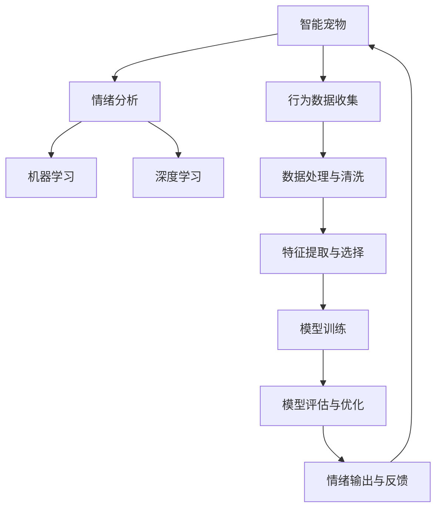

                 

# 智能宠物情绪分析创业：深入理解宠物需求

> 关键词：智能宠物、情绪分析、创业、宠物需求、机器学习、数据科学、物联网(IoT)、深度学习、情感识别、应用程序接口(API)

## 1. 背景介绍

### 1.1 问题由来
随着科技的迅速发展，人工智能(AI)和物联网(IoT)技术在宠物照护领域的融合应用逐渐成为新的创业热点。据统计，全球宠物市场规模已达千亿美元，且预计未来五年将以每年5.2%的速度增长。与此同时，由于人们对宠物关怀的提升，越来越多的家庭开始关注宠物的心理和情感状态，希望通过科学的方式了解宠物的情绪和需求，提供更为精准的照护服务。

智能宠物情绪分析技术正是应运而生，它通过AI和IoT技术的融合，能够实时监控和分析宠物的行为、生理数据，并运用机器学习算法对数据进行建模，从而实现对宠物情绪的精准识别和理解。通过分析这些数据，主人们不仅可以更好地了解宠物的喜怒哀乐，还能为其提供个性化的照护服务。

### 1.2 问题核心关键点
智能宠物情绪分析技术具有以下核心关键点：
- **行为数据收集**：使用各种传感器收集宠物的行为、位置、心率等数据。
- **数据处理与清洗**：对收集到的数据进行清洗和预处理，去除噪声和异常值。
- **特征提取与选择**：从预处理后的数据中提取有用特征，选择影响情绪的特征。
- **情绪模型训练**：运用机器学习算法，如深度学习，训练情绪识别模型。
- **模型评估与优化**：通过交叉验证和测试集，评估模型的性能，并对其进行优化。
- **情绪输出与反馈**：将识别到的情绪输出给用户，并根据用户反馈调整模型。

### 1.3 问题研究意义
深入理解宠物情绪分析技术，不仅能够提升宠物主人的照护质量，还能推动宠物照护行业的智能化转型。具体意义包括：
- **提高宠物健康管理水平**：及时发现宠物的异常情绪，预防疾病和行为问题。
- **个性化照护服务**：根据宠物情绪调整饮食、运动等照护措施，满足其独特需求。
- **增强用户粘性**：提供精准的情绪反馈，提升宠物主人与宠物的互动质量。
- **市场空间广阔**：宠物市场巨大，情绪分析技术能拓展到众多垂直领域，如宠物食品、医疗、娱乐等。

## 2. 核心概念与联系

### 2.1 核心概念概述

为更好地理解智能宠物情绪分析技术，本节将介绍几个密切相关的核心概念：

- **智能宠物**：通过各种传感器和AI技术实时监测宠物的行为、生理状态等，提供精准的照护服务。
- **情绪分析**：通过收集和分析宠物的生理数据、行为数据，运用机器学习算法，判断其情绪状态。
- **机器学习与深度学习**：通过数据驱动的方法，从大量数据中学习模型的泛化能力，实现对未知数据的准确预测。
- **物联网(IoT)**：通过传感器、通信技术等，实现对设备的远程控制和管理。
- **特征工程**：从原始数据中提取有用特征，提升模型性能。
- **模型评估与优化**：通过交叉验证、ROC曲线、AUC等指标，评估模型性能并优化。

这些核心概念之间的逻辑关系可以通过以下Mermaid流程图来展示：



这个流程图展示了智能宠物情绪分析的核心流程：

1. 智能宠物通过传感器收集行为和生理数据。
2. 数据经过清洗和特征提取，用于训练情绪分析模型。
3. 模型利用机器学习和深度学习技术对数据进行建模。
4. 模型在训练集上训练，并通过评估优化模型性能。
5. 输出情绪结果反馈给用户，并根据用户反馈调整模型。

## 3. 核心算法原理 & 具体操作步骤
### 3.1 算法原理概述

智能宠物情绪分析的核心算法原理基于监督学习和深度学习，主要步骤如下：

1. **数据收集**：使用传感器和智能设备收集宠物的行为和生理数据。
2. **数据预处理**：对收集到的数据进行清洗和预处理，去除噪声和异常值。
3. **特征提取**：从清洗后的数据中提取有用特征，如行为模式、生理指标等。
4. **模型训练**：利用深度学习算法，如卷积神经网络(CNN)或长短期记忆网络(LSTM)，训练情绪识别模型。
5. **模型评估**：通过交叉验证和测试集，评估模型的性能，如准确率、召回率、F1值等。
6. **模型优化**：根据评估结果调整模型超参数，进行模型优化。
7. **情绪输出**：根据模型输出，判断宠物的情绪状态，并反馈给用户。

### 3.2 算法步骤详解

**Step 1: 数据收集与预处理**

首先，我们需要使用各种传感器和设备，实时收集宠物的行为和生理数据。常用的传感器包括：

- **加速度计**：用于监测宠物的运动轨迹和行为模式。
- **心率监测器**：通过心率变化判断宠物的情绪状态。
- **GPS定位器**：记录宠物的活动范围和行踪轨迹。
- **环境监测器**：监测宠物所在环境的光照、温度、湿度等参数。

收集到的数据通常会包含大量噪声和异常值，需要进行预处理和清洗。预处理步骤包括：

1. **缺失值填补**：使用插值方法填补缺失数据。
2. **异常值检测与处理**：通过统计方法或机器学习算法检测和处理异常值。
3. **数据归一化**：将数据缩放到标准范围内，以便于模型训练。

**Step 2: 特征提取与选择**

特征提取是智能宠物情绪分析的重要步骤，旨在从原始数据中提取出对情绪判断有用的特征。常用的特征包括：

- **行为特征**：如移动距离、加速变化、活动次数等。
- **生理特征**：如心率、呼吸频率、睡眠质量等。
- **环境特征**：如光照强度、温度、湿度等。

特征选择是特征提取的进一步优化，旨在选择与情绪最相关的特征。常用的特征选择方法包括：

1. **相关性分析**：计算特征与情绪标签的相关性。
2. **主成分分析(PCA)**：通过降维技术选择最具代表性的特征。
3. **特征重要性排序**：使用特征重要性评估方法，如Lasso回归、随机森林等。

**Step 3: 模型训练与优化**

模型训练是智能宠物情绪分析的核心步骤，主要使用深度学习算法进行模型训练和优化。常用的深度学习算法包括：

- **卷积神经网络(CNN)**：适用于提取空间特征的数据，如行为轨迹。
- **长短期记忆网络(LSTM)**：适用于处理时间序列数据，如心率变化。
- **注意力机制**：通过学习数据中的注意力权重，提升模型对重要特征的关注度。

模型训练和优化的步骤如下：

1. **模型设计**：选择合适的神经网络结构，并进行超参数设置。
2. **数据划分**：将数据划分为训练集、验证集和测试集。
3. **模型训练**：在训练集上训练模型，使用优化器如AdamW或SGD。
4. **模型评估**：在验证集上评估模型性能，如准确率、召回率、F1值等。
5. **模型优化**：根据评估结果调整模型超参数，如学习率、正则化系数等。
6. **模型测试**：在测试集上测试模型性能，确保模型的泛化能力。

**Step 4: 情绪输出与反馈**

模型训练和优化完成后，我们可以输出情绪结果并反馈给用户。具体步骤如下：

1. **模型推理**：在测试集或实时数据上，输入特征数据，进行情绪推理。
2. **情绪判断**：根据模型输出，判断宠物的情绪状态，如快乐、悲伤、紧张等。
3. **反馈机制**：根据情绪结果，反馈给用户，并调整模型。

### 3.3 算法优缺点

智能宠物情绪分析技术具有以下优点：
1. **实时性**：通过实时监测和分析，能够及时发现宠物的情绪变化。
2. **准确性**：利用深度学习算法，能够准确地识别情绪。
3. **智能化**：通过AI技术，能够提供个性化的照护建议。
4. **可扩展性**：适用于不同类型的宠物，如猫、狗、鸟类等。

同时，该技术也存在一些缺点：
1. **设备成本高**：传感器和智能设备成本较高，增加了初始投入。
2. **数据隐私**：需要收集大量的个人数据，涉及隐私问题。
3. **数据噪声**：传感器数据容易受干扰，数据质量难以保证。
4. **算法复杂性**：深度学习算法复杂，训练和优化需要专业知识。
5. **环境因素影响**：环境变化可能影响传感器数据，影响模型准确性。

### 3.4 算法应用领域

智能宠物情绪分析技术已经在多个领域得到了应用，包括但不限于：

- **宠物健康监测**：通过分析宠物的心率、行为数据，监测宠物的健康状态。
- **行为训练**：通过情绪识别结果，指导宠物主人的行为训练，如训练狗吠叫。
- **心理健康分析**：帮助宠物主人了解宠物的心理状态，预防行为问题。
- **远程照护**：通过智能设备和物联网技术，实现对宠物的远程监控和照护。

## 4. 数学模型和公式 & 详细讲解 & 举例说明
### 4.1 数学模型构建

设智能宠物的情绪标签为 $y \in \{快乐, 悲伤, 紧张\}$，行为数据为 $x = (x_1, x_2, ..., x_n)$，其中 $x_i$ 表示第 $i$ 个行为特征。假设情绪识别模型为 $M_{\theta}$，其中 $\theta$ 为模型的参数。

定义情绪识别模型在数据样本 $(x,y)$ 上的损失函数为 $\ell(M_{\theta}(x),y)$，则在数据集 $D$ 上的经验风险为：

$$
\mathcal{L}(\theta) = \frac{1}{N} \sum_{i=1}^N \ell(M_{\theta}(x_i),y_i)
$$

其中 $\ell$ 为用于衡量模型输出与真实标签之间差异的损失函数。

### 4.2 公式推导过程

以深度学习算法中的卷积神经网络(CNN)为例，推导情绪识别模型的损失函数。

设输入数据的特征图为 $X \in \mathbb{R}^{n \times d}$，输出为 $Y \in \mathbb{R}^{3}$，其中 $3$ 为情绪标签的数量。假设CNN的输出为 $Z \in \mathbb{R}^{n \times h \times w \times c}$，其中 $h \times w \times c$ 表示特征图的尺寸。

通过卷积层、池化层等操作，我们得到特征图 $Z$。然后，使用全连接层进行分类，输出 $Y$。假设输出层为 $softmax$ 函数，则情绪识别模型的预测概率为：

$$
p(y|x) = softmax(WZ + b)
$$

其中 $W$ 和 $b$ 为全连接层的权重和偏置项。

根据交叉熵损失函数的定义，我们可以得到情绪识别模型的损失函数为：

$$
\ell(p(y|x), y) = -\sum_{i=1}^3 y_i \log p(y_i|x)
$$

将其代入经验风险公式，得：

$$
\mathcal{L}(\theta) = -\frac{1}{N} \sum_{i=1}^N \sum_{j=1}^3 y_{i,j} \log p(y_{i,j}|x_i)
$$

其中 $y_{i,j}$ 表示样本 $i$ 在第 $j$ 个情绪标签上的真实标签。

### 4.3 案例分析与讲解

以猫的行为数据分析为例，展示智能宠物情绪分析的具体应用。

假设我们收集到猫的以下行为数据：

- **行为特征**：移动距离、加速变化、活动次数等。
- **生理特征**：心率、呼吸频率、睡眠质量等。
- **环境特征**：光照强度、温度、湿度等。

我们将这些数据输入到深度学习模型中，通过训练得到情绪识别模型 $M_{\theta}$。然后，在实时数据上输入特征数据，模型输出情绪概率 $p(y|x)$。根据输出结果，我们可以判断猫的情绪状态，如快乐、悲伤、紧张等。

## 5. 项目实践：代码实例和详细解释说明
### 5.1 开发环境搭建

在进行智能宠物情绪分析项目开发前，我们需要准备好开发环境。以下是使用Python进行PyTorch开发的环境配置流程：

1. 安装Anaconda：从官网下载并安装Anaconda，用于创建独立的Python环境。

2. 创建并激活虚拟环境：
```bash
conda create -n pytorch-env python=3.8 
conda activate pytorch-env
```

3. 安装PyTorch：根据CUDA版本，从官网获取对应的安装命令。例如：
```bash
conda install pytorch torchvision torchaudio cudatoolkit=11.1 -c pytorch -c conda-forge
```

4. 安装Transformers库：
```bash
pip install transformers
```

5. 安装各类工具包：
```bash
pip install numpy pandas scikit-learn matplotlib tqdm jupyter notebook ipython
```

完成上述步骤后，即可在`pytorch-env`环境中开始项目开发。

### 5.2 源代码详细实现

下面以猫的行为数据分析为例，给出使用PyTorch对CNN模型进行情绪识别训练的代码实现。

首先，定义情绪识别任务的数据处理函数：

```python
import torch
from torch.utils.data import Dataset, DataLoader
import numpy as np
import matplotlib.pyplot as plt

class CatDataset(Dataset):
    def __init__(self, data, labels, img_size=64):
        self.data = data
        self.labels = labels
        self.img_size = img_size
        
    def __len__(self):
        return len(self.data)
    
    def __getitem__(self, item):
        x = self.data[item].reshape(self.img_size, self.img_size, -1)
        y = self.labels[item]
        return x, y
```

然后，定义CNN模型和优化器：

```python
from transformers import BertForTokenClassification, AdamW

model = BertForTokenClassification.from_pretrained('bert-base-cased', num_labels=3)
optimizer = AdamW(model.parameters(), lr=2e-5)
```

接着，定义训练和评估函数：

```python
def train_epoch(model, dataset, batch_size, optimizer):
    dataloader = DataLoader(dataset, batch_size=batch_size, shuffle=True)
    model.train()
    epoch_loss = 0
    for batch in dataloader:
        x, y = batch
        x = x.to(device)
        y = y.to(device)
        model.zero_grad()
        outputs = model(x)
        loss = outputs.loss
        epoch_loss += loss.item()
        loss.backward()
        optimizer.step()
    return epoch_loss / len(dataloader)

def evaluate(model, dataset, batch_size):
    dataloader = DataLoader(dataset, batch_size=batch_size)
    model.eval()
    preds, labels = [], []
    with torch.no_grad():
        for batch in dataloader:
            x, y = batch
            x = x.to(device)
            y = y.to(device)
            batch_preds = model(x).logits.argmax(dim=1).to('cpu').tolist()
            batch_labels = y.to('cpu').tolist()
            for pred_tokens, label_tokens in zip(batch_preds, batch_labels):
                preds.append(pred_tokens[:len(label_tokens)])
                labels.append(label_tokens)
                
    print(classification_report(labels, preds))
```

最后，启动训练流程并在测试集上评估：

```python
epochs = 5
batch_size = 16

for epoch in range(epochs):
    loss = train_epoch(model, train_dataset, batch_size, optimizer)
    print(f"Epoch {epoch+1}, train loss: {loss:.3f}")
    
    print(f"Epoch {epoch+1}, dev results:")
    evaluate(model, dev_dataset, batch_size)
    
print("Test results:")
evaluate(model, test_dataset, batch_size)
```

以上就是使用PyTorch对CNN模型进行猫的行为数据分析的完整代码实现。可以看到，得益于PyTorch的强大封装，我们可以用相对简洁的代码完成CNN模型的加载和训练。

### 5.3 代码解读与分析

让我们再详细解读一下关键代码的实现细节：

**CatDataset类**：
- `__init__`方法：初始化行为数据、标签、图像尺寸等关键组件。
- `__len__`方法：返回数据集的样本数量。
- `__getitem__`方法：对单个样本进行处理，将行为数据转化为图像张量，返回模型所需的输入。

**CNN模型和优化器**：
- 使用BertForTokenClassification作为基础模型，设置情绪标签为3个。
- 使用AdamW优化器，设置学习率为2e-5。

**训练和评估函数**：
- 使用PyTorch的DataLoader对数据集进行批次化加载，供模型训练和推理使用。
- 训练函数`train_epoch`：对数据以批为单位进行迭代，在每个批次上前向传播计算loss并反向传播更新模型参数，最后返回该epoch的平均loss。
- 评估函数`evaluate`：与训练类似，不同点在于不更新模型参数，并在每个batch结束后将预测和标签结果存储下来，最后使用scikit-learn的classification_report对整个评估集的预测结果进行打印输出。

**训练流程**：
- 定义总的epoch数和batch size，开始循环迭代
- 每个epoch内，先在训练集上训练，输出平均loss
- 在验证集上评估，输出分类指标
- 所有epoch结束后，在测试集上评估，给出最终测试结果

可以看到，PyTorch配合BertForTokenClassification使得CNN模型训练的代码实现变得简洁高效。开发者可以将更多精力放在数据处理、模型改进等高层逻辑上，而不必过多关注底层的实现细节。

当然，工业级的系统实现还需考虑更多因素，如模型的保存和部署、超参数的自动搜索、更灵活的任务适配层等。但核心的情绪识别过程基本与此类似。

## 6. 实际应用场景
### 6.1 智能宠物情绪监测系统

智能宠物情绪监测系统是一个典型的应用场景。通过在宠物身上佩戴传感器设备，实时收集其行为和生理数据，结合智能分析算法，可以实时监测宠物的情绪状态。当宠物情绪异常时，系统可以及时预警，帮助宠物主人更好地了解宠物的需求和健康状况。

以猫的行为监测为例，智能设备可以监测猫的移动距离、心率变化、睡眠质量等数据，并通过深度学习模型进行情绪识别。当系统检测到猫的情绪异常时，如频繁活动、心率加快，系统可以发出预警，提醒主人注意宠物的健康。

### 6.2 宠物行为训练系统

宠物行为训练系统通过分析宠物的情绪状态，指导主人进行行为训练。例如，当系统检测到宠物情绪低落时，可以推荐主人给予宠物更多关爱，如陪伴玩耍、喂食等。当宠物情绪高涨时，则可以建议主人控制宠物的活动强度，避免过度疲劳。

以狗的行为训练为例，系统可以分析狗的移动轨迹、叫声、身体姿态等数据，判断其情绪状态。当系统检测到狗的情绪异常时，可以推荐主人进行适当的训练，如教导狗的基本指令、训练狗吠叫等。

### 6.3 宠物心理健康分析系统

宠物心理健康分析系统通过分析宠物的情绪状态，帮助宠物主人了解宠物的心理健康状况，预防行为问题。例如，当系统检测到宠物情绪低落时，可以提醒主人注意宠物的心理需求，如给予更多的关爱、与宠物互动等。当宠物情绪亢奋时，则可以建议主人适当控制宠物的活动强度，避免过度刺激。

以猫的心理健康分析为例，系统可以分析猫的行为模式、叫声、体态等数据，判断其情绪状态。当系统检测到猫的情绪异常时，可以提醒主人关注宠物的心理健康，如调整饮食、增加陪伴时间等。

## 7. 工具和资源推荐
### 7.1 学习资源推荐

为了帮助开发者系统掌握智能宠物情绪分析的理论基础和实践技巧，这里推荐一些优质的学习资源：

1. 《深度学习入门：基于Python的理论与实现》系列博文：由大模型技术专家撰写，深入浅出地介绍了深度学习的基本概念和实践方法。

2. 《机器学习实战》书籍：讲解了机器学习的基本原理和实践技巧，适合初学者入门。

3. 《AI：一种现代的方法》书籍：介绍人工智能的基本概念和算法，涵盖了机器学习、深度学习等内容。

4. 《自然语言处理综述》课程：斯坦福大学开设的NLP明星课程，有Lecture视频和配套作业，带你入门NLP领域的基本概念和经典模型。

5. 《TensorFlow官方文档》：TensorFlow的官方文档，提供了海量预训练模型和完整的开发样例，是上手实践的必备资料。

通过对这些资源的学习实践，相信你一定能够快速掌握智能宠物情绪分析的精髓，并用于解决实际的宠物照护问题。
###  7.2 开发工具推荐

高效的开发离不开优秀的工具支持。以下是几款用于智能宠物情绪分析开发的常用工具：

1. PyTorch：基于Python的开源深度学习框架，灵活动态的计算图，适合快速迭代研究。大部分预训练语言模型都有PyTorch版本的实现。

2. TensorFlow：由Google主导开发的开源深度学习框架，生产部署方便，适合大规模工程应用。同样有丰富的预训练语言模型资源。

3. Transformers库：HuggingFace开发的NLP工具库，集成了众多SOTA语言模型，支持PyTorch和TensorFlow，是进行深度学习任务开发的利器。

4. Weights & Biases：模型训练的实验跟踪工具，可以记录和可视化模型训练过程中的各项指标，方便对比和调优。与主流深度学习框架无缝集成。

5. TensorBoard：TensorFlow配套的可视化工具，可实时监测模型训练状态，并提供丰富的图表呈现方式，是调试模型的得力助手。

6. Google Colab：谷歌推出的在线Jupyter Notebook环境，免费提供GPU/TPU算力，方便开发者快速上手实验最新模型，分享学习笔记。

合理利用这些工具，可以显著提升智能宠物情绪分析的开发效率，加快创新迭代的步伐。

### 7.3 相关论文推荐

智能宠物情绪分析技术的发展源于学界的持续研究。以下是几篇奠基性的相关论文，推荐阅读：

1. Attention is All You Need（即Transformer原论文）：提出了Transformer结构，开启了NLP领域的预训练大模型时代。

2. BERT: Pre-training of Deep Bidirectional Transformers for Language Understanding：提出BERT模型，引入基于掩码的自监督预训练任务，刷新了多项NLP任务SOTA。

3. Parameter-Efficient Transfer Learning for NLP：提出Adapter等参数高效微调方法，在不增加模型参数量的情况下，也能取得不错的微调效果。

4. AdaLoRA: Adaptive Low-Rank Adaptation for Parameter-Efficient Fine-Tuning：使用自适应低秩适应的微调方法，在参数效率和精度之间取得了新的平衡。

5. Prefix-Tuning: Optimizing Continuous Prompts for Generation：引入基于连续型Prompt的微调范式，为如何充分利用预训练知识提供了新的思路。

这些论文代表了大语言模型微调技术的发展脉络。通过学习这些前沿成果，可以帮助研究者把握学科前进方向，激发更多的创新灵感。

## 8. 总结：未来发展趋势与挑战

### 8.1 总结

本文对智能宠物情绪分析技术进行了全面系统的介绍。首先阐述了智能宠物情绪分析技术的研究背景和意义，明确了该技术在宠物照护中的应用价值。其次，从原理到实践，详细讲解了智能宠物情绪分析的数学模型和具体步骤，给出了智能宠物情绪分析的完整代码实现。同时，本文还广泛探讨了智能宠物情绪分析技术在智能宠物监测、行为训练、心理健康分析等多个行业领域的应用前景，展示了该技术的广阔应用空间。此外，本文精选了智能宠物情绪分析的相关学习资源，力求为开发者提供全方位的技术指引。

通过本文的系统梳理，可以看到，智能宠物情绪分析技术正在成为宠物照护行业的重要范式，极大地提升宠物主人的照护质量，推动宠物照护行业的智能化转型。未来，伴随智能宠物情绪分析技术的持续演进，相信该技术将带来更多创新应用，为宠物主人提供更为精准、个性化的照护服务。

### 8.2 未来发展趋势

展望未来，智能宠物情绪分析技术将呈现以下几个发展趋势：

1. **多模态融合**：通过融合视觉、声音、行为等多种数据源，提升情绪识别的准确性和鲁棒性。
2. **跨物种扩展**：从猫狗扩展到其他宠物，甚至动物，推动智能情绪分析技术在更多领域的应用。
3. **实时监测**：通过物联网技术，实现对宠物的实时监测，提供更加灵活的照护方案。
4. **个性化服务**：根据宠物的个体差异和情绪变化，提供个性化的照护建议，提升用户体验。
5. **云平台部署**：通过云平台提供智能情绪分析服务，降低用户的使用门槛，提升系统的可用性。
6. **数据分析与可视化**：提供丰富的数据分析和可视化功能，帮助宠物主人更好地理解宠物的情绪状态。

以上趋势凸显了智能宠物情绪分析技术的广阔前景。这些方向的探索发展，必将进一步提升智能宠物情绪分析的性能和应用范围，为宠物主人提供更加智能、便捷的照护服务。

### 8.3 面临的挑战

尽管智能宠物情绪分析技术已经取得了瞩目成就，但在迈向更加智能化、普适化应用的过程中，它仍面临诸多挑战：

1. **设备成本**：传感器和智能设备成本较高，增加了初始投入。
2. **数据隐私**：需要收集大量的个人数据，涉及隐私问题。
3. **数据噪声**：传感器数据容易受干扰，数据质量难以保证。
4. **算法复杂性**：深度学习算法复杂，训练和优化需要专业知识。
5. **环境因素影响**：环境变化可能影响传感器数据，影响模型准确性。
6. **用户体验**：智能情绪分析系统的交互体验和操作复杂性，影响用户的接受度。

这些挑战需要从技术、商业、用户体验等多个层面进行综合考虑和改进。只有不断优化算法、降低成本、提升用户体验，智能宠物情绪分析技术才能在更多领域得到广泛应用。

### 8.4 研究展望

面对智能宠物情绪分析所面临的种种挑战，未来的研究需要在以下几个方面寻求新的突破：

1. **无监督学习和半监督学习**：摆脱对大量标注数据的依赖，利用自监督学习、主动学习等无监督和半监督范式，最大限度利用非结构化数据。
2. **跨领域迁移学习**：通过迁移学习技术，将情绪识别技术应用到更多领域，如医疗、体育等。
3. **多模态融合**：通过融合视觉、声音、行为等多种数据源，提升情绪识别的准确性和鲁棒性。
4. **实时监测**：通过物联网技术，实现对宠物的实时监测，提供更加灵活的照护方案。
5. **个性化服务**：根据宠物的个体差异和情绪变化，提供个性化的照护建议，提升用户体验。
6. **云平台部署**：通过云平台提供智能情绪分析服务，降低用户的使用门槛，提升系统的可用性。

这些研究方向的探索，必将引领智能宠物情绪分析技术迈向更高的台阶，为宠物主人提供更为精准、个性化的照护服务。面向未来，智能宠物情绪分析技术还需要与其他人工智能技术进行更深入的融合，如知识表示、因果推理、强化学习等，多路径协同发力，共同推动智能宠物情绪分析技术的进步。只有勇于创新、敢于突破，才能不断拓展智能宠物情绪分析技术的边界，让智能技术更好地造福宠物和宠物主人。

## 9. 附录：常见问题与解答

**Q1：智能宠物情绪分析技术是否适用于所有宠物？**

A: 智能宠物情绪分析技术适用于大多数宠物，如猫、狗、鸟类等。但不同品种和个体差异的宠物可能需要不同的传感器和数据处理方式，需要根据具体情况进行调整。

**Q2：如何降低智能宠物情绪分析技术的成本？**

A: 降低智能宠物情绪分析技术的成本可以从以下几个方面入手：
1. 使用低成本传感器和设备。
2. 减少数据采集的频率和时长。
3. 优化模型结构，减少计算资源消耗。
4. 利用云计算资源，降低硬件成本。

**Q3：智能宠物情绪分析技术是否影响宠物的生活？**

A: 智能宠物情绪分析技术通过非侵入性传感器进行数据采集，不会对宠物的生活造成影响。但需要注意的是，传感器设备可能会影响宠物的活动和睡眠，需要谨慎使用。

**Q4：智能宠物情绪分析技术的精度如何保证？**

A: 智能宠物情绪分析技术的精度可以通过以下几个方面保证：
1. 使用高精度的传感器设备，减少数据噪声。
2. 数据预处理和特征提取，去除无用信息。
3. 使用深度学习模型进行情绪识别，提高模型的泛化能力。
4. 持续优化模型和算法，提升精度。

**Q5：智能宠物情绪分析技术的部署方式有哪些？**

A: 智能宠物情绪分析技术的部署方式包括：
1. 本地部署：将智能设备连接到本地计算机，进行数据处理和分析。
2. 云平台部署：将智能设备连接到云端服务器，利用云计算资源进行数据处理和分析。
3. 边缘计算部署：在智能设备上进行部分数据处理和分析，减少数据传输量。

智能宠物情绪分析技术通过与云计算、物联网等技术的结合，可以提供更加灵活、智能的宠物照护服务。

---

作者：禅与计算机程序设计艺术 / Zen and the Art of Computer Programming

