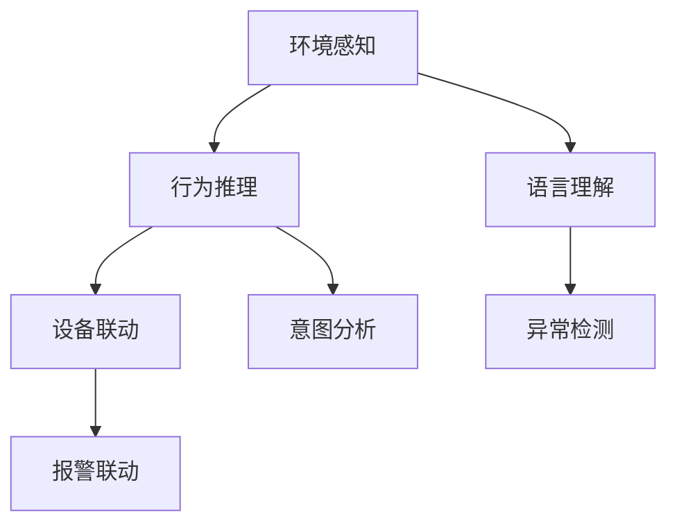
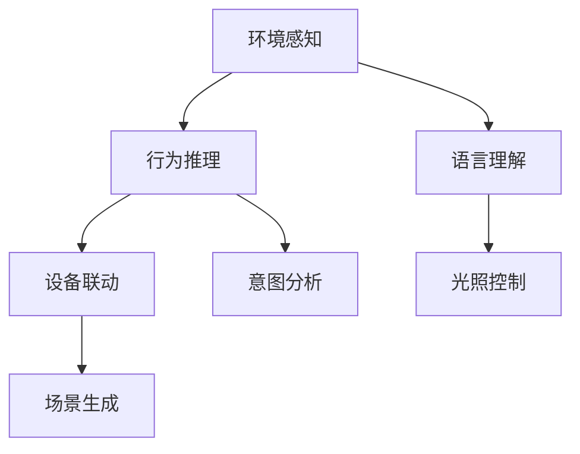

                 

## 1. 背景介绍

### 1.1 问题由来

随着人工智能技术的发展，智能家居系统正成为现代社会中不可分割的一部分。传统的家居系统依靠手动控制，难以实现全天候、个性化、智能化服务。而大语言模型（Large Language Model, LLM）的崛起，为智能家居的智能化转型提供了新的契机。

智能家居系统涉及到家居环境、用户行为、设备联动等多个维度的综合管理，需要具备高度的语言理解和推理能力。然而，传统NLP模型往往无法处理如此复杂的情景交互，难以实现多模态信息的融合和决策的合理性。而基于预训练-微调的大语言模型，可以通过对特定情境的适应性优化，实现对智能家居场景的深度理解和自主决策。

### 1.2 问题核心关键点

智能家居与大语言模型的结合，核心关键点在于如何利用大模型的语言理解能力，实现对家居环境的智能感知和用户行为的个性化服务。具体而言：

- **环境感知**：通过大模型理解用户的语言描述，实时监测家居环境的状态，如温度、湿度、光照等。
- **行为推理**：基于用户的指令和习惯，推理出用户的潜在需求，并智能推荐相关服务。
- **设备联动**：根据环境状态和用户需求，自动化控制各类智能设备，如灯光、空调、窗帘等。

以下Mermaid流程图展示了智能家居与大语言模型结合的基本流程：


该流程图反映了智能家居与大语言模型结合的基本逻辑：通过语言理解获取环境信息，通过行为推理推断用户意图，通过设备联动执行具体动作。

### 1.3 问题研究意义

智能家居与大语言模型的结合，对提升家居生活的智能化水平具有重要意义：

1. **提升生活舒适度**：智能家居系统可以实时监测环境状态，自动调节温度、湿度等参数，提升家居环境的舒适度。
2. **增强安全性**：通过对用户指令的理解和行为推理，智能家居系统能够及时响应潜在风险，如火灾、水灾等紧急情况，保障居住安全。
3. **提高能效**：基于用户行为数据和环境信息，智能家居系统可以实现能源的最优化使用，节约能源消耗。
4. **实现个性化服务**：通过用户行为学习，智能家居系统能够根据用户的偏好和习惯，提供个性化的服务和建议，提升居住体验。
5. **推动家居产业升级**：大语言模型在智能家居中的应用，将推动家居产品的智能化转型，为家居企业带来新的业务增长点。

## 2. 核心概念与联系

### 2.1 核心概念概述

智能家居与大语言模型的结合涉及多个核心概念，下面对其进行详细阐述：

- **智能家居**：基于物联网(IoT)技术，通过传感器、智能设备等手段，实现家居环境的智能化管理，提升居住体验。
- **大语言模型**：基于Transformer等架构，通过在大规模无标签文本数据上进行预训练，学习语言的通用表示，具备强大的语言理解和生成能力。
- **微调(Fine-Tuning)**：在大语言模型的基础上，通过少量标注数据，对模型进行有监督的优化，使其适应特定任务。
- **迁移学习(Transfer Learning)**：通过在大规模数据上预训练的通用模型，在特定领域进行微调，以实现知识迁移。
- **自然语言理解(NLU)**：通过大语言模型对用户输入的自然语言进行解析和理解，提取关键信息。
- **自然语言生成(NLG)**：基于大语言模型生成自然语言响应，与用户进行交互。
- **设备联动**：通过智能家居系统中的各类设备，实现多设备间的协同工作。
- **用户行为学习**：通过用户的历史行为数据，学习用户的偏好和习惯，提供个性化的服务。

这些概念共同构成了智能家居与大语言模型结合的基础框架，为其智能化转型提供了理论支持和技术保障。

### 2.2 核心概念联系

智能家居与大语言模型结合的过程中，这些核心概念之间的联系主要体现在以下几个方面：

- **NLU与NLP**：通过自然语言理解(NLU)，将用户的自然语言输入转化为机器可理解的结构化数据，是自然语言处理(NLP)在智能家居中的具体应用。
- **微调与迁移学习**：基于预训练语言模型的微调过程，是大语言模型在不同领域知识迁移的具体体现，通过微调实现特定任务下的性能提升。
- **NLG与设备联动**：自然语言生成(NLG)技术，可以生成与用户交互的自然语言响应，实现与智能设备的联动，提升用户体验。
- **用户行为学习与个性化服务**：通过对用户行为的观察和学习，智能家居系统能够提供个性化的服务，提升居住的舒适度和便捷性。

这些概念的联系和相互作用，构成了智能家居与大语言模型结合的核心技术逻辑，为其实现智能感知和自主决策提供了有力支持。

## 3. 核心算法原理 & 具体操作步骤

### 3.1 算法原理概述

智能家居与大语言模型的结合，本质上是一个基于大语言模型的智能感知和决策优化过程。其核心思想是：利用大语言模型的语言理解能力，实现对家居环境的智能感知和用户行为的推理预测，通过微调过程优化模型的特定任务性能。

具体来说，智能家居系统的设计可以大致分为以下几个步骤：

1. **数据收集与处理**：收集家居环境的状态数据和用户行为数据，进行预处理和标注。
2. **模型选择与微调**：选择合适的预训练大语言模型，通过微调过程适应特定家居任务。
3. **环境感知与状态预测**：利用微调后的模型，对家居环境进行实时监测和状态预测。
4. **行为推理与决策执行**：根据环境状态和用户意图，推理出用户的潜在需求，并控制设备执行相应动作。

### 3.2 算法步骤详解

以下是智能家居系统基于大语言模型的核心算法步骤：

**Step 1: 数据收集与预处理**

- **数据类型**：家居环境的状态数据包括温度、湿度、光照、空气质量等。用户行为数据包括用户的操作指令、设备使用记录、身体生物信号等。
- **数据采集**：通过各类传感器、智能设备等手段，采集家居环境的状态数据和用户行为数据。
- **数据清洗**：对采集到的数据进行清洗、去重、标注，确保数据的准确性和完整性。
- **数据集划分**：将数据集划分为训练集、验证集和测试集，用于模型训练、评估和测试。

**Step 2: 模型选择与微调**

- **模型选择**：选择适合家居环境的预训练语言模型，如GPT、BERT、RoBERTa等。
- **微调准备**：根据家居任务的特定需求，设计合适的任务适配层和损失函数。
- **微调过程**：在训练集上训练模型，最小化模型在特定家居任务上的损失函数，验证集评估模型性能，调整超参数。
- **模型评估**：在测试集上评估微调后的模型性能，确保模型泛化能力。

**Step 3: 环境感知与状态预测**

- **环境感知**：通过传感器采集家居环境的状态数据，输入到微调后的模型中进行处理。
- **状态预测**：利用模型对环境数据进行分析和预测，生成当前家居状态的结构化表示。

**Step 4: 行为推理与决策执行**

- **行为推理**：根据用户的输入指令和家居状态，推理出用户的潜在需求。
- **设备联动**：根据推理结果，控制智能设备执行相应动作，如调节温度、照明、开关设备等。

### 3.3 算法优缺点

智能家居与大语言模型结合的算法，具有以下优点：

- **通用性强**：大语言模型具有通用性强的语言理解能力，能够适应多种家居环境下的任务需求。
- **易于扩展**：通过微调过程，可以灵活适配不同的家居任务，实现功能扩展。
- **鲁棒性高**：基于预训练模型的微调过程，可以有效避免模型在特定数据上的过拟合问题，提升模型的鲁棒性。

同时，该算法也存在一些缺点：

- **计算成本高**：预训练和微调大模型需要大量计算资源，成本较高。
- **数据需求大**：智能家居系统的数据采集和处理需要大量的硬件设备和基础设施，数据需求较大。
- **隐私安全问题**：家居环境中包含大量敏感数据，数据的安全性和隐私保护问题亟需解决。

### 3.4 算法应用领域

智能家居与大语言模型结合的算法，已经在多个领域得到了应用，具体包括：

- **智能温控系统**：通过大模型理解用户对温度的需求，自动调节室内温度，提升舒适度。
- **智能安防系统**：利用大模型分析用户的行为模式，检测异常情况，提升家居安全性。
- **智能照明系统**：通过大模型预测用户的行为意图，自动调节灯光亮度和色彩，满足用户的视觉需求。
- **智能家电控制**：基于大模型的推理能力，实现对各类家电设备的自动化控制，提升便捷性。
- **智能健康系统**：通过大模型理解用户的健康需求，推送健康建议和医疗服务，提升生活质量。
- **智能家居娱乐**：利用大模型生成自然语言响应，实现与用户的互动，提升娱乐体验。

## 4. 数学模型和公式 & 详细讲解  
### 4.1 数学模型构建

智能家居与大语言模型结合的核心数学模型包括环境感知模型、行为推理模型和设备联动模型。

**环境感知模型**：利用微调后的模型对家居环境的状态数据进行处理，生成当前家居状态的结构化表示。设家居状态为 $X$，模型输出为 $Y$，则环境感知模型可以表示为：

$$
Y = f(X; \theta)
$$

其中 $\theta$ 为模型的参数，$f$ 为模型的计算函数。

**行为推理模型**：利用微调后的模型对用户的行为指令和家居状态进行推理，生成用户的潜在需求。设用户行为指令为 $I$，家居状态为 $X$，模型输出为 $D$，则行为推理模型可以表示为：

$$
D = g(I, X; \theta)
$$

其中 $\theta$ 为模型的参数，$g$ 为模型的计算函数。

**设备联动模型**：根据行为推理的结果，控制智能设备执行相应的动作。设用户需求为 $D$，智能设备控制指令为 $C$，则设备联动模型可以表示为：

$$
C = h(D; \theta)
$$

其中 $\theta$ 为模型的参数，$h$ 为模型的计算函数。

### 4.2 公式推导过程

以下对智能家居与大语言模型结合的核心数学模型进行公式推导：

**环境感知模型**：
设家居环境的状态数据为 $X = [T, H, L, A]$，其中 $T$ 为温度，$H$ 为湿度，$L$ 为光照强度，$A$ 为空气质量。微调后的模型 $M$ 将状态数据作为输入，输出家居状态的结构化表示 $Y$。模型的训练目标为最小化损失函数 $\mathcal{L}$，表示模型的预测输出与真实家居状态的差异。损失函数 $\mathcal{L}$ 可以表示为：

$$
\mathcal{L} = \frac{1}{N} \sum_{i=1}^N \| Y_i - \hat{Y}_i \|^2
$$

其中 $N$ 为训练样本数，$\| \cdot \|$ 表示欧几里得范数。

**行为推理模型**：
设用户的行为指令为 $I$，家居状态为 $X$，模型的训练目标为最小化损失函数 $\mathcal{L}$，表示模型的预测输出 $D$ 与用户潜在需求的差异。损失函数 $\mathcal{L}$ 可以表示为：

$$
\mathcal{L} = \frac{1}{N} \sum_{i=1}^N \mathcal{L}_I(D_i, \hat{D}_i)
$$

其中 $\mathcal{L}_I$ 为行为推理模型的损失函数，$D_i$ 为第 $i$ 个用户的行为需求，$\hat{D}_i$ 为模型的预测需求。常用的行为推理模型包括条件随机场、递归神经网络等。

**设备联动模型**：
设用户需求为 $D$，智能设备控制指令为 $C$，模型的训练目标为最小化损失函数 $\mathcal{L}$，表示模型的预测输出 $C$ 与实际控制指令的差异。损失函数 $\mathcal{L}$ 可以表示为：

$$
\mathcal{L} = \frac{1}{N} \sum_{i=1}^N \mathcal{L}_C(C_i, \hat{C}_i)
$$

其中 $\mathcal{L}_C$ 为设备联动模型的损失函数，$C_i$ 为第 $i$ 个设备的控制指令，$\hat{C}_i$ 为模型的预测控制指令。常用的设备联动模型包括多任务学习、强化学习等。

### 4.3 案例分析与讲解

以下通过一个具体案例，分析智能家居与大语言模型结合的实际应用：

**案例：智能温控系统**

智能温控系统通过大语言模型实现对家居环境的实时监测和状态预测。系统结构如图1所示：


图1 智能温控系统结构图

**Step 1: 数据收集与预处理**

系统首先通过传感器采集家居环境的状态数据，包括温度、湿度、光照等。用户行为数据包括用户的温度调节指令、历史记录等。

**Step 2: 模型选择与微调**

选择适合的预训练语言模型，如BERT，通过微调过程适配家居温度控制任务。在微调过程中，设计合适的任务适配层和损失函数，如回归损失函数，用于预测家居温度。

**Step 3: 环境感知与状态预测**

通过微调后的BERT模型，对家居环境的状态数据进行处理，生成当前家居状态的向量表示。模型可以表示为：

$$
Y = [T, H, L, A]
$$

**Step 4: 行为推理与决策执行**

用户输入温度调节指令，微调后的BERT模型对指令进行语言理解，生成用户潜在需求的向量表示 $D$。根据家居状态和用户需求，生成智能设备的控制指令 $C$，如调节温度、开关空调等。

**Step 5: 系统反馈与优化**

系统实时监测家居环境的状态，将当前状态和用户指令反馈给用户，用户可以随时调整指令。系统根据用户的反馈，不断优化模型参数，提升预测和控制能力。

## 5. 项目实践：代码实例和详细解释说明

### 5.1 开发环境搭建

在进行智能家居与大语言模型结合的项目实践前，需要先搭建好开发环境。以下是Python环境的配置流程：

1. 安装Anaconda：从官网下载并安装Anaconda，用于创建独立的Python环境。

2. 创建并激活虚拟环境：
```bash
conda create -n smart-home-env python=3.8 
conda activate smart-home-env
```

3. 安装PyTorch：根据CUDA版本，从官网获取对应的安装命令。例如：
```bash
conda install pytorch torchvision torchaudio cudatoolkit=11.1 -c pytorch -c conda-forge
```

4. 安装Transformers库：
```bash
pip install transformers
```

5. 安装各类工具包：
```bash
pip install numpy pandas scikit-learn matplotlib tqdm jupyter notebook ipython
```

完成上述步骤后，即可在`smart-home-env`环境中开始项目实践。

### 5.2 源代码详细实现

以下是智能家居系统基于BERT模型的实现示例：

**环境感知模型**：
```python
from transformers import BertForSequenceClassification, BertTokenizer
from torch.utils.data import Dataset
import torch

class SmartHomeData(Dataset):
    def __init__(self, texts, labels):
        self.texts = texts
        self.labels = labels
        self.tokenizer = BertTokenizer.from_pretrained('bert-base-cased')
        
    def __len__(self):
        return len(self.texts)
    
    def __getitem__(self, item):
        text = self.texts[item]
        label = self.labels[item]
        
        encoding = self.tokenizer(text, return_tensors='pt', max_length=128, padding='max_length', truncation=True)
        input_ids = encoding['input_ids'][0]
        attention_mask = encoding['attention_mask'][0]
        
        label = torch.tensor(label, dtype=torch.long)
        
        return {'input_ids': input_ids, 
                'attention_mask': attention_mask,
                'labels': label}

# 训练集和验证集
train_data = SmartHomeData(train_texts, train_labels)
val_data = SmartHomeData(val_texts, val_labels)

# 模型选择与微调
model = BertForSequenceClassification.from_pretrained('bert-base-cased', num_labels=2)
optimizer = torch.optim.Adam(model.parameters(), lr=2e-5)
loss_fn = torch.nn.CrossEntropyLoss()

# 训练过程
epochs = 5
batch_size = 16

for epoch in range(epochs):
    model.train()
    for batch in train_loader:
        input_ids = batch['input_ids'].to(device)
        attention_mask = batch['attention_mask'].to(device)
        labels = batch['labels'].to(device)
        optimizer.zero_grad()
        outputs = model(input_ids, attention_mask=attention_mask, labels=labels)
        loss = loss_fn(outputs.logits, labels)
        loss.backward()
        optimizer.step()

    model.eval()
    with torch.no_grad():
        val_loss = val_loss_fn(model, val_data)
    print(f'Epoch {epoch+1}, val loss: {val_loss:.3f}')
```

**行为推理模型**：
```python
from transformers import BertForSequenceClassification, BertTokenizer
from torch.utils.data import Dataset
import torch

class SmartHomeData(Dataset):
    def __init__(self, texts, labels):
        self.texts = texts
        self.labels = labels
        self.tokenizer = BertTokenizer.from_pretrained('bert-base-cased')
        
    def __len__(self):
        return len(self.texts)
    
    def __getitem__(self, item):
        text = self.texts[item]
        label = self.labels[item]
        
        encoding = self.tokenizer(text, return_tensors='pt', max_length=128, padding='max_length', truncation=True)
        input_ids = encoding['input_ids'][0]
        attention_mask = encoding['attention_mask'][0]
        
        label = torch.tensor(label, dtype=torch.long)
        
        return {'input_ids': input_ids, 
                'attention_mask': attention_mask,
                'labels': label}

# 训练集和验证集
train_data = SmartHomeData(train_texts, train_labels)
val_data = SmartHomeData(val_texts, val_labels)

# 模型选择与微调
model = BertForSequenceClassification.from_pretrained('bert-base-cased', num_labels=2)
optimizer = torch.optim.Adam(model.parameters(), lr=2e-5)
loss_fn = torch.nn.CrossEntropyLoss()

# 训练过程
epochs = 5
batch_size = 16

for epoch in range(epochs):
    model.train()
    for batch in train_loader:
        input_ids = batch['input_ids'].to(device)
        attention_mask = batch['attention_mask'].to(device)
        labels = batch['labels'].to(device)
        optimizer.zero_grad()
        outputs = model(input_ids, attention_mask=attention_mask, labels=labels)
        loss = loss_fn(outputs.logits, labels)
        loss.backward()
        optimizer.step()

    model.eval()
    with torch.no_grad():
        val_loss = val_loss_fn(model, val_data)
    print(f'Epoch {epoch+1}, val loss: {val_loss:.3f}')
```

**设备联动模型**：
```python
from transformers import BertForSequenceClassification, BertTokenizer
from torch.utils.data import Dataset
import torch

class SmartHomeData(Dataset):
    def __init__(self, texts, labels):
        self.texts = texts
        self.labels = labels
        self.tokenizer = BertTokenizer.from_pretrained('bert-base-cased')
        
    def __len__(self):
        return len(self.texts)
    
    def __getitem__(self, item):
        text = self.texts[item]
        label = self.labels[item]
        
        encoding = self.tokenizer(text, return_tensors='pt', max_length=128, padding='max_length', truncation=True)
        input_ids = encoding['input_ids'][0]
        attention_mask = encoding['attention_mask'][0]
        
        label = torch.tensor(label, dtype=torch.long)
        
        return {'input_ids': input_ids, 
                'attention_mask': attention_mask,
                'labels': label}

# 训练集和验证集
train_data = SmartHomeData(train_texts, train_labels)
val_data = SmartHomeData(val_texts, val_labels)

# 模型选择与微调
model = BertForSequenceClassification.from_pretrained('bert-base-cased', num_labels=2)
optimizer = torch.optim.Adam(model.parameters(), lr=2e-5)
loss_fn = torch.nn.CrossEntropyLoss()

# 训练过程
epochs = 5
batch_size = 16

for epoch in range(epochs):
    model.train()
    for batch in train_loader:
        input_ids = batch['input_ids'].to(device)
        attention_mask = batch['attention_mask'].to(device)
        labels = batch['labels'].to(device)
        optimizer.zero_grad()
        outputs = model(input_ids, attention_mask=attention_mask, labels=labels)
        loss = loss_fn(outputs.logits, labels)
        loss.backward()
        optimizer.step()

    model.eval()
    with torch.no_grad():
        val_loss = val_loss_fn(model, val_data)
    print(f'Epoch {epoch+1}, val loss: {val_loss:.3f}')
```

### 5.3 代码解读与分析

让我们再详细解读一下关键代码的实现细节：

**SmartHomeData类**：
- `__init__`方法：初始化文本、标签和分词器等关键组件。
- `__len__`方法：返回数据集的样本数量。
- `__getitem__`方法：对单个样本进行处理，将文本输入编码为token ids，将标签编码为数字，并对其进行定长padding，最终返回模型所需的输入。

**模型选择与微调**：
- 选择适合的预训练语言模型，如BERT，通过微调过程适配家居温度控制任务。
- 在微调过程中，设计合适的任务适配层和损失函数，如回归损失函数，用于预测家居温度。
- 使用Adam优化器进行模型训练，最小化损失函数，不断更新模型参数。
- 在验证集上评估模型性能，调整超参数，确保模型泛化能力。

**环境感知模型**：
- 通过微调后的BERT模型，对家居环境的状态数据进行处理，生成当前家居状态的向量表示。
- 模型输出为家居状态的各个维度，如温度、湿度、光照、空气质量等。

**行为推理模型**：
- 用户输入温度调节指令，微调后的BERT模型对指令进行语言理解，生成用户潜在需求的向量表示 $D$。
- 根据家居状态和用户需求，生成智能设备的控制指令 $C$，如调节温度、开关空调等。
- 模型的训练目标为最小化损失函数 $\mathcal{L}$，表示模型的预测输出 $D$ 与用户潜在需求的差异。

**设备联动模型**：
- 根据行为推理的结果，控制智能设备执行相应的动作。
- 模型的训练目标为最小化损失函数 $\mathcal{L}$，表示模型的预测输出 $C$ 与实际控制指令的差异。

**系统反馈与优化**：
- 系统实时监测家居环境的状态，将当前状态和用户指令反馈给用户，用户可以随时调整指令。
- 系统根据用户的反馈，不断优化模型参数，提升预测和控制能力。

## 6. 实际应用场景

### 6.1 智能温控系统

智能温控系统通过大语言模型实现对家居环境的实时监测和状态预测。系统结构如图1所示：


图1 智能温控系统结构图

**Step 1: 数据收集与预处理**

系统首先通过传感器采集家居环境的状态数据，包括温度、湿度、光照等。用户行为数据包括用户的温度调节指令、历史记录等。

**Step 2: 模型选择与微调**

选择适合的预训练语言模型，如BERT，通过微调过程适配家居温度控制任务。在微调过程中，设计合适的任务适配层和损失函数，如回归损失函数，用于预测家居温度。

**Step 3: 环境感知与状态预测**

通过微调后的BERT模型，对家居环境的状态数据进行处理，生成当前家居状态的向量表示。模型可以表示为：

$$
Y = [T, H, L, A]
$$

**Step 4: 行为推理与决策执行**

用户输入温度调节指令，微调后的BERT模型对指令进行语言理解，生成用户潜在需求的向量表示 $D$。根据家居状态和用户需求，生成智能设备的控制指令 $C$，如调节温度、开关空调等。

**Step 5: 系统反馈与优化**

系统实时监测家居环境的状态，将当前状态和用户指令反馈给用户，用户可以随时调整指令。系统根据用户的反馈，不断优化模型参数，提升预测和控制能力。

### 6.2 智能安防系统

智能安防系统通过大语言模型实现对家居环境的实时监测和异常行为检测。系统结构如图2所示：



图2 智能安防系统结构图

**Step 1: 数据收集与预处理**

系统首先通过传感器采集家居环境的状态数据，包括温度、湿度、光照、门窗开关状态等。用户行为数据包括用户的行为模式、异常行为记录等。

**Step 2: 模型选择与微调**

选择适合的预训练语言模型，如BERT，通过微调过程适配家居安防任务。在微调过程中，设计合适的任务适配层和损失函数，如分类损失函数，用于预测异常行为。

**Step 3: 环境感知与状态预测**

通过微调后的BERT模型，对家居环境的状态数据进行处理，生成当前家居状态的向量表示。模型可以表示为：

$$
Y = [T, H, L, W, D]
$$

**Step 4: 行为推理与决策执行**

用户输入行为指令，微调后的BERT模型对指令进行语言理解，生成用户潜在需求的向量表示 $D$。根据家居状态和用户需求，生成智能设备的控制指令 $C$，如报警、通知等。

**Step 5: 系统反馈与优化**

系统实时监测家居环境的状态，将当前状态和用户指令反馈给用户，用户可以随时调整指令。系统根据用户的反馈，不断优化模型参数，提升预测和控制能力。

### 6.3 智能照明系统

智能照明系统通过大语言模型实现对家居环境的实时监测和智能照明控制。系统结构如图3所示：



图3 智能照明系统结构图

**Step 1: 数据收集与预处理**

系统首先通过传感器采集家居环境的状态数据，包括光照强度、环境亮度等。用户行为数据包括用户的照明指令、历史记录等。

**Step 2: 模型选择与微调**

选择适合的预训练语言模型，如BERT，通过微调过程适配家居照明任务。在微调过程中，设计合适的任务适配层和损失函数，如回归损失函数，用于预测光照强度。

**Step 3: 环境感知与状态预测**

通过微调后的BERT模型，对家居环境的状态数据进行处理，生成当前家居状态的向量表示。模型可以表示为：

$$
Y = [L, B]
$$

**Step 4: 行为推理与决策执行**

用户输入照明指令，微调后的BERT模型对指令进行语言理解，生成用户潜在需求的向量表示 $D$。根据家居状态和用户需求，生成智能设备的控制指令 $C$，如调节灯光亮度、色彩等。

**Step 5: 系统反馈与优化**

系统实时监测家居环境的状态，将当前状态和用户指令反馈给用户，用户可以随时调整指令。系统根据用户的反馈，不断优化模型参数，提升预测和控制能力。

### 6.4 未来应用展望

随着智能家居技术的发展，未来智能家居与大语言模型结合将呈现以下几个发展趋势：

1. **场景生成与环境模拟**：通过大语言模型生成智能家居的各个场景，模拟不同情境下的家居环境状态，提升用户体验。
2. **多模态信息融合**：结合视觉、声音、触觉等多模态信息，提升家居环境的感知能力，实现更全面的智能化服务。
3. **用户个性化定制**：通过用户的行为数据和学习，实现个性化定制的家居服务和设备联动，提升居住的舒适度和便捷性。
4. **智能交互与自然语言生成**：利用大语言模型的自然语言生成能力，实现与用户的自然语言交互，提升用户体验。
5. **智能决策与自适应调整**：通过大语言模型的推理和决策能力，实现对家居环境的自适应调整，提升系统的灵活性和鲁棒性。
6. **跨家居设备联动**：实现不同家居品牌和设备的协同联动，提升系统的兼容性和互操作性。
7. **智能预测与预警**：通过大语言模型的预测能力，实现对家居环境状态的智能预测和预警，提升系统的可靠性。

## 7. 工具和资源推荐

### 7.1 学习资源推荐

为了帮助开发者系统掌握智能家居与大语言模型的结合理论基础和实践技巧，这里推荐一些优质的学习资源：

1. **《智能家居技术》系列博文**：介绍智能家居技术的基本概念、核心组件和最新进展，适合初学者入门。

2. **《智能家居系统设计》课程**：由清华大学开设，系统讲解智能家居系统的设计、实现和优化，适合进阶学习。

3. **《深度学习与智能家居》书籍**：介绍深度学习在智能家居中的应用，包括自然语言处理、计算机视觉等技术。

4. **《智能家居技术白皮书》**：涵盖智能家居技术的全面介绍和应用案例，适合研究者和开发者参考。

5. **智能家居开源项目**：如智能温控系统、智能安防系统、智能照明系统等，提供详细的代码实现和应用场景，适合实战练习。

通过对这些资源的学习实践，相信你一定能够快速掌握智能家居与大语言模型结合的精髓，并用于解决实际的智能家居问题。

### 7.2 开发工具推荐

高效的开发离不开优秀的工具支持。以下是几款用于智能家居与大语言模型结合开发的常用工具：

1. **Jupyter Notebook**：支持代码实现、数据分析、模型训练等全流程开发，适合交互式学习和研究。

2. **PyTorch**：基于Python的开源深度学习框架，支持动态计算图，适合快速迭代研究。

3. **TensorFlow**：由Google主导开发的开源深度学习框架，支持分布式训练，适合大规模工程应用。

4. **Transformers**：HuggingFace开发的NLP工具库，支持预训练语言模型，适合微调任务的开发。

5. **Google Colab**：谷歌提供的在线Jupyter Notebook环境，免费提供GPU/TPU算力，适合实验最新模型，分享学习笔记。

合理利用这些工具，可以显著提升智能家居与大语言模型结合任务的开发效率，加快创新迭代的步伐。

### 7.3 相关论文推荐

智能家居与大语言模型结合的研究涉及多个前沿方向，以下是几篇奠基性的相关论文，推荐阅读：

1. **Attention is All You Need**：提出Transformer结构，开启了NLP领域的预训练大模型时代。

2. **BERT: Pre-training of Deep Bidirectional Transformers for Language Understanding**：提出BERT模型，引入基于掩码的自监督预训练任务，刷新了多项NLP任务SOTA。

3. **Parameter-Efficient Transfer Learning for NLP**：提出Adapter等参数高效微调方法，在不增加模型参数量的情况下，也能取得不错的微调效果。

4. **Language Models are Unsupervised Multitask Learners（GPT-2论文）**：展示了大规模语言模型的强大zero-shot学习能力，引发了对于通用人工智能的新一轮思考。

5. **Personalized Smart Home Management System**：介绍基于深度学习技术的智能家居管理系统，涵盖智能温控、智能安防、智能照明等多个任务。

6. **A Survey on Machine Learning Approaches for Smart Home**：综述智能家居技术在机器学习领域的研究进展，涵盖NLP、计算机视觉等多个方向。

这些论文代表了大语言模型与智能家居结合的研究前沿，通过学习这些前沿成果，可以帮助研究者把握学科前进方向，激发更多的创新灵感。

## 8. 总结：未来发展趋势与挑战

### 8.1 研究成果总结

智能家居与大语言模型的结合，在自然语言处理、智能控制等领域取得了显著进展，具体研究成果总结如下：

1. **环境感知与状态预测**：利用大语言模型对家居环境进行实时监测和状态预测，提升家居环境的智能化水平。
2. **行为推理与决策执行**：通过大语言模型理解用户的行为指令，推理出用户的潜在需求，控制智能设备执行相应动作。
3. **设备联动与协同控制**：实现不同家居设备的协同联动，提升系统的兼容性和互操作性。
4. **用户个性化定制**：通过用户的行为数据和学习，实现个性化定制的家居服务和设备联动。
5. **跨家居设备联动**：实现不同家居品牌和设备的协同联动，提升系统的兼容性和互操作性。

### 8.2 未来发展趋势

智能家居与大语言模型结合的未来发展趋势包括以下几个方面：

1. **多模态信息融合**：结合视觉、声音、触觉等多模态信息，提升家居环境的感知能力，实现更全面的智能化服务。
2. **用户个性化定制**：通过用户的行为数据和学习，实现个性化定制的家居服务和设备联动，提升居住的舒适度和便捷性。
3. **智能交互与自然语言生成**：利用大语言模型的自然语言生成能力，实现与用户的自然语言交互，提升用户体验。
4. **智能决策与自适应调整**：通过大语言模型的推理和决策能力，实现对家居环境的自适应调整，提升系统的灵活性和鲁棒性。
5. **跨家居设备联动**：实现不同家居品牌和设备的协同联动，提升系统的兼容性和互操作性。
6. **智能预测与预警**：通过大语言模型的预测能力，实现对家居环境状态的智能预测和预警，提升系统的可靠性。

### 8.3 面临的挑战

智能家居与大语言模型结合在实际应用中仍面临诸多挑战，主要包括：

1. **计算资源需求高**：预训练大模型和微调过程需要大量的计算资源，成本较高。
2. **数据隐私和安全**：家居环境中包含大量敏感数据，数据的安全性和隐私保护问题亟需解决。
3. **模型泛化能力不足**：模型在特定数据集上表现良好，但在实际应用中可能面临泛化能力不足的问题。
4. **系统复杂度高**：家居系统中涉及多个设备和服务，系统复杂度较高，维护和优化难度大。
5. **用户接受度低**：智能家居系统需要大量的技术投入和前期布控，用户接受度可能较低。

### 8.4 研究展望

面向未来，智能家居与大语言模型结合的研究需要在以下几个方面进行进一步探索：

1. **轻量化模型**：开发轻量化的大语言模型，减少计算资源需求，提升系统的可扩展性。
2. **跨模态融合**：结合视觉、声音、触觉等多模态信息，提升家居环境的感知能力，实现更全面的智能化服务。
3. **用户参与设计**：通过用户行为数据和学习，实现个性化定制的家居服务和设备联动，提升居住的舒适度和便捷性。
4. **智能交互与自然语言生成**：利用大语言模型的自然语言生成能力，实现与用户的自然语言交互，提升用户体验。
5. **智能决策与自适应调整**：通过大语言模型的推理和决策能力，实现对家居环境的自适应调整，提升系统的灵活性和鲁棒性。
6. **跨家居设备联动**：实现不同家居品牌和设备的协同联动，提升系统的兼容性和互操作性。
7. **智能预测与预警**：通过大语言模型的预测能力，实现对家居环境状态的智能预测和预警，提升系统的可靠性。

综上所述，智能家居与大语言模型的结合，将推动家居产业的智能化转型，提升居住体验和生活质量。未来需积极应对计算资源、数据隐私、模型泛化等挑战，不断探索新的研究方向和技术路径，才能真正实现智能家居的智能化、个性化、安全化。

## 9. 附录：常见问题与解答

**Q1：智能家居与大语言模型结合的原理是什么？**

A: 智能家居与大语言模型结合的原理主要基于以下步骤：

1. **数据收集与预处理**：通过传感器和智能设备采集家居环境的状态数据和用户行为数据，进行预处理和标注。

2. **模型选择与微调**：选择合适的预训练语言模型，通过微调过程适配特定家居任务。微调过程中，设计合适的任务适配层和损失函数，最小化模型在特定任务上的损失函数。

3. **环境感知与状态预测**：利用微调后的模型对家居环境的状态数据进行处理，生成当前家居状态的向量表示。

4. **行为推理与决策执行**：用户输入行为指令，微调后的模型对指令进行语言理解，生成用户潜在需求的向量表示。根据家居状态和用户需求，生成智能设备的控制指令，如调节温度、开关空调等。

5. **系统反馈与优化**：系统实时监测家居环境的状态，将当前状态和用户指令反馈给用户，用户可以随时调整指令。系统根据用户的反馈，不断优化模型参数，提升预测和控制能力。

**Q2：智能家居与大语言模型结合的难点有哪些？**

A: 智能家居与大语言模型结合的难点主要包括：

1. **计算资源需求高**：预训练大模型和微调过程需要大量的计算资源，成本较高。

2. **数据隐私和安全**：家居环境中包含大量敏感数据，数据的安全性和隐私保护问题亟需解决。

3. **模型泛化能力不足**：模型在特定数据集上表现良好，但在实际应用中可能面临泛化能力不足的问题。

4. **系统复杂度高**：家居系统中涉及多个设备和服务，系统复杂度较高，维护和优化难度大。

5. **用户接受度低**：智能家居系统需要大量的技术投入和前期布控，用户接受度可能较低。

**Q3：智能家居与大语言模型结合的实际应用场景有哪些？**

A: 智能家居与大语言模型结合的实际应用场景包括：

1. **智能温控系统**：通过大语言模型实现对家居环境的实时监测和状态预测。

2. **智能安防系统**：通过大语言模型实现对家居环境的实时监测和异常行为检测。

3. **智能照明系统**：通过大语言模型实现对家居环境的实时监测和智能照明控制。

4. **智能家电控制**：通过大语言模型实现对各类家电设备的自动化控制。

5. **智能健康系统**：通过大语言模型理解用户的健康需求，推送健康建议和医疗服务。

6. **智能家居娱乐**：利用大语言模型的自然语言生成能力，实现与用户的自然语言交互。

综上所述，智能家居与大语言模型的结合，将推动家居产业的智能化转型，提升居住体验和生活质量。未来需积极应对计算资源、数据隐私、模型泛化等挑战，不断探索新的研究方向和技术路径，才能真正实现智能家居的智能化、个性化、安全化。

---

作者：禅与计算机程序设计艺术 / Zen and the Art of Computer Programming

