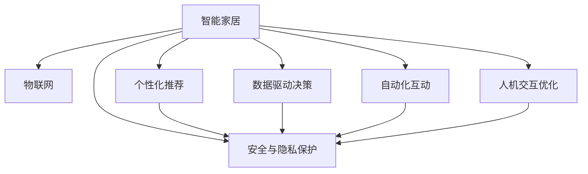

                 

# 智能家居如何争夺用户注意力

> 关键词：智能家居、用户注意力、个性化推荐、物联网、机器学习、数据科学

## 1. 背景介绍

### 1.1 问题由来
在现代社会中，智能家居作为未来家庭生态的重要组成部分，正逐渐成为人们生活的一部分。智能家居系统通过物联网技术，将家中的各类设备和传感器互联互通，实现远程控制、自动化操作等功能，极大提升了生活的便捷性和舒适性。然而，随着智能家居设备的激增，用户注意力成为该领域的核心资源，如何有效吸引和保持用户关注，成为智能家居争夺用户注意力的关键问题。

### 1.2 问题核心关键点
智能家居争夺用户注意力的关键点在于通过数据科学和机器学习技术，挖掘用户行为特征，进行个性化推荐，同时结合物联网技术，实现设备的自动化互动，从而吸引用户注意力并提高用户黏性。具体而言，包括以下几个方面：

1. **个性化推荐**：通过收集和分析用户的行为数据，推荐符合用户兴趣和需求的智能家居产品或功能，提升用户体验。
2. **自动化互动**：利用传感器数据和物联网技术，自动执行用户习惯性操作，减少用户与设备的互动，提高智能家居的智能化程度。
3. **数据驱动决策**：通过收集和分析用户数据，优化智能家居系统的功能和配置，使其更符合用户需求。
4. **人机交互优化**：通过自然语言处理等技术，提高智能家居设备的互动友好性，使用户更容易与之互动。
5. **安全与隐私保护**：确保智能家居系统的数据安全，避免用户隐私泄露，建立用户信任。

这些关键点共同构成了智能家居争夺用户注意力的核心策略，需要在技术层面进行深入研究和发展。

## 2. 核心概念与联系

### 2.1 核心概念概述

为更好地理解智能家居如何争夺用户注意力，本节将介绍几个密切相关的核心概念：

- **智能家居**：通过物联网技术将家中的各类设备互联互通，实现自动化、远程控制等功能的智能系统。
- **物联网(IoT)**：通过互联网将各种设备、传感器等网络连接起来，实现信息交换和协同工作的网络系统。
- **个性化推荐**：通过分析用户行为和兴趣数据，推荐符合用户需求的产品或功能，提升用户体验。
- **自然语言处理(NLP)**：使机器能够理解和处理人类自然语言的技术，用于实现人机交互。
- **机器学习(ML)**：利用数据和算法，使机器能够从数据中学习和改进，实现预测和决策。
- **用户行为数据**：用户在使用智能家居系统时产生的各种行为数据，如操作时间、频率、偏好等。
- **隐私保护**：在智能家居系统中，确保用户数据安全，避免隐私泄露。

这些核心概念之间的逻辑关系可以通过以下Mermaid流程图来展示：



这个流程图展示了一体化智能家居系统的核心概念及其之间的关系：

1. 智能家居通过物联网实现设备的互联互通。
2. 通过收集用户行为数据，进行个性化推荐和数据驱动决策，提升用户体验。
3. 利用自动化互动和自然语言处理优化人机交互，提高系统的智能化程度。
4. 在各个环节都注重安全与隐私保护，确保数据安全。

## 3. 核心算法原理 & 具体操作步骤
### 3.1 算法原理概述

智能家居争夺用户注意力的核心算法原理是基于用户行为数据分析和机器学习模型的应用。其核心思想是：

1. **数据收集与预处理**：通过传感器和智能设备收集用户的行为数据，并进行预处理，包括清洗、归一化、特征提取等步骤。
2. **用户行为建模**：利用机器学习算法，如K-means聚类、协同过滤、深度学习等，建立用户行为模型，用于个性化推荐。
3. **个性化推荐算法**：基于用户行为模型，设计推荐算法，如基于内容的推荐、基于协同过滤的推荐、基于深度学习的推荐等，实现个性化推荐。
4. **自动化互动算法**：利用传感器数据和物联网技术，设计自动化互动算法，实现设备间的协同工作和智能家居的自动化操作。
5. **人机交互优化算法**：利用自然语言处理技术，优化人机交互界面和互动方式，提升用户体验。
6. **隐私保护算法**：设计隐私保护算法，如差分隐私、联邦学习等，确保用户数据的安全和隐私保护。

### 3.2 算法步骤详解

基于上述核心算法原理，智能家居系统争夺用户注意力的具体操作步骤包括以下几个关键步骤：

**Step 1: 数据收集与预处理**
- 使用传感器和智能设备，收集用户的行为数据，包括操作时间、频率、偏好等。
- 清洗数据，去除异常值和噪声，进行归一化和标准化处理。
- 提取特征，如用户操作频率、设备使用时间、传感器数据等，作为后续模型输入。

**Step 2: 用户行为建模**
- 选择适合的机器学习算法，如K-means聚类、协同过滤、深度学习等，对用户行为数据进行建模。
- 训练模型，学习用户行为特征和偏好，生成用户行为模型。

**Step 3: 个性化推荐**
- 基于用户行为模型，设计推荐算法，如基于内容的推荐、基于协同过滤的推荐、基于深度学习的推荐等。
- 对新设备或功能进行评估，根据用户行为模型选择推荐列表。
- 结合用户反馈，不断调整和优化推荐算法。

**Step 4: 自动化互动**
- 利用传感器数据和物联网技术，设计自动化互动算法，实现设备间的协同工作和智能家居的自动化操作。
- 根据用户行为模型，自动调整设备状态，如温度、湿度、灯光等。
- 实现设备的自主学习，优化互动过程。

**Step 5: 人机交互优化**
- 利用自然语言处理技术，优化人机交互界面和互动方式，提升用户体验。
- 设计自然语言处理模块，用于理解用户命令和需求。
- 实现智能对话系统，提供即时反馈和互动。

**Step 6: 隐私保护**
- 设计隐私保护算法，如差分隐私、联邦学习等，确保用户数据的安全和隐私保护。
- 对用户数据进行加密处理，防止数据泄露。
- 定期进行隐私评估，优化隐私保护策略。

### 3.3 算法优缺点

智能家居争夺用户注意力的算法具有以下优点：

1. **提升用户体验**：通过个性化推荐和自动化互动，提升用户的使用体验，减少用户操作复杂度。
2. **数据驱动决策**：利用用户行为数据分析，优化智能家居系统的功能和配置，提升系统的智能化程度。
3. **提高安全性**：通过隐私保护算法，确保用户数据的安全和隐私保护，建立用户信任。

然而，该算法也存在一定的局限性：

1. **数据隐私问题**：收集和分析用户数据可能会涉及隐私问题，需要谨慎处理用户隐私数据。
2. **数据质量问题**：传感器数据和设备数据可能存在噪声和误差，需要进行数据清洗和预处理。
3. **模型复杂度问题**：推荐算法和自动化互动算法的设计和优化，需要复杂的模型和算法，增加了系统的复杂度。
4. **用户依赖问题**：用户对智能家居系统的依赖程度可能影响其使用体验和系统稳定性。

尽管存在这些局限性，但智能家居争夺用户注意力的算法在当前技术条件下，依然具有显著的优势和应用价值。

### 3.4 算法应用领域

智能家居争夺用户注意力的算法已经在多个领域得到了广泛的应用，例如：

1. **智能家居系统**：通过收集和分析用户行为数据，进行个性化推荐和自动化互动，提升用户的使用体验。
2. **智能音箱**：利用自然语言处理技术，实现人机交互和个性化推荐，提供用户所需的信息和功能。
3. **智能温控系统**：通过传感器数据和物联网技术，自动调节室内温度，提升舒适度和节能效果。
4. **智能照明系统**：根据用户行为和环境变化，自动调节灯光亮度和颜色，提升用户的视觉体验。
5. **智能安防系统**：利用传感器数据和自动化互动技术，实现智能监控和报警，提高家庭安全性。

除了上述这些经典应用外，智能家居争夺用户注意力的算法还被创新性地应用于更多场景中，如智能家电控制、智能门锁、智能窗帘等，为家庭生活带来了新的便利和智慧。

## 4. 数学模型和公式 & 详细讲解 & 举例说明

### 4.1 数学模型构建

为了更好地理解智能家居争夺用户注意力的算法，本节将介绍几个数学模型及其构建方法：

- **用户行为建模**：使用K-means聚类算法，对用户行为数据进行建模。设用户行为数据集为 $X=\{x_i\}_{i=1}^N$，其中 $x_i \in \mathbb{R}^d$ 表示用户行为特征向量，则K-means聚类算法的目标是最小化损失函数：

$$
\min_{\mu_k} \sum_{i=1}^N ||x_i - \mu_k||^2 \text{ s.t. } \sum_{k=1}^K \mu_k = 1, k=1,\ldots,K
$$

其中 $K$ 为聚类数目，$\mu_k$ 为第 $k$ 类聚类中心。

- **个性化推荐模型**：使用协同过滤算法，对用户行为数据进行建模。设用户-物品评分矩阵为 $R \in \mathbb{R}^{N \times M}$，其中 $N$ 为用户数，$M$ 为物品数，则协同过滤算法的目标是最小化损失函数：

$$
\min_{\hat{R}} \sum_{i=1}^N \sum_{j=1}^M (r_{ij} - \hat{r}_{ij})^2
$$

其中 $r_{ij}$ 为真实评分，$\hat{r}_{ij}$ 为预测评分。

- **自动化互动模型**：使用强化学习算法，对自动化互动算法进行建模。设智能家居系统的状态空间为 $S$，动作空间为 $A$，智能家居系统的总奖励函数为 $J$，则强化学习算法的目标是最小化策略 $\pi$ 的期望累积奖励：

$$
\min_{\pi} \mathbb{E}[\sum_{t=0}^{\infty} \gamma^t r(s_t, a_t)]
$$

其中 $s_t$ 表示系统在第 $t$ 步的状态，$a_t$ 表示系统在第 $t$ 步的动作，$\gamma$ 为折扣因子。

### 4.2 公式推导过程

以下我们将对上述三个数学模型进行公式推导：

- **K-means聚类算法**
  - 初始化 $K$ 个聚类中心 $\mu_1,\mu_2,\ldots,\mu_K \in \mathbb{R}^d$。
  - 对于每个数据点 $x_i$，计算其到每个聚类中心的距离 $d_i^k = ||x_i - \mu_k||$。
  - 将 $x_i$ 分配到距离最近的聚类中心，更新聚类中心：

$$
\mu_k \leftarrow \frac{1}{|C_k|} \sum_{x_i \in C_k} x_i
$$

其中 $C_k$ 为分配给第 $k$ 类的数据点集合。

- **协同过滤算法**
  - 对于每个用户 $i$，计算其对每个物品 $j$ 的评分预测值 $\hat{r}_{ij} = \sum_{k=1}^K u_i^k v_k^j$。
  - 利用损失函数，更新用户兴趣向量 $u_i^k$ 和物品特征向量 $v_k^j$。

$$
u_i^k \leftarrow u_i^k + \eta \nabla_{u_i^k} \mathcal{L}(u_i^k, v_k^j)
$$

$$
v_k^j \leftarrow v_k^j + \eta \nabla_{v_k^j} \mathcal{L}(u_i^k, v_k^j)
$$

其中 $\mathcal{L}$ 为损失函数，$\eta$ 为学习率。

- **强化学习算法**
  - 设定智能家居系统的状态空间 $S$ 和动作空间 $A$。
  - 根据当前状态 $s_t$ 和动作 $a_t$，计算系统奖励 $r(s_t, a_t)$。
  - 利用动态规划算法或Q-learning算法，更新策略 $\pi$ 的参数，最大化期望累积奖励。

$$
Q(s_t, a_t) \leftarrow Q(s_t, a_t) + \eta (r(s_t, a_t) + \gamma \max_{a_{t+1}} Q(s_{t+1}, a_{t+1}) - Q(s_t, a_t))
$$

$$
\pi(a_t|s_t) \leftarrow \frac{\exp(Q(s_t, a_t)/\eta)}{\sum_{a \in A} \exp(Q(s_t, a)/\eta)}
$$

### 4.3 案例分析与讲解

以智能音箱为例，我们具体分析基于K-means聚类和协同过滤的个性化推荐算法：

1. **数据收集与预处理**
  - 智能音箱通过麦克风和传感器收集用户的语音指令和行为数据。
  - 数据预处理包括去除噪声、归一化和特征提取。

2. **用户行为建模**
  - 使用K-means聚类算法，对用户行为数据进行建模。
  - 设用户行为数据集为 $X=\{x_i\}_{i=1}^N$，其中 $x_i \in \mathbb{R}^d$ 表示用户行为特征向量，则K-means聚类算法的目标是最小化损失函数：

$$
\min_{\mu_k} \sum_{i=1}^N ||x_i - \mu_k||^2 \text{ s.t. } \sum_{k=1}^K \mu_k = 1, k=1,\ldots,K
$$

3. **个性化推荐**
  - 基于用户行为模型，设计协同过滤推荐算法。
  - 对于每个用户 $i$，计算其对每个物品 $j$ 的评分预测值 $\hat{r}_{ij} = \sum_{k=1}^K u_i^k v_k^j$。
  - 利用损失函数，更新用户兴趣向量 $u_i^k$ 和物品特征向量 $v_k^j$。

$$
u_i^k \leftarrow u_i^k + \eta \nabla_{u_i^k} \mathcal{L}(u_i^k, v_k^j)
$$

$$
v_k^j \leftarrow v_k^j + \eta \nabla_{v_k^j} \mathcal{L}(u_i^k, v_k^j)
$$

其中 $\mathcal{L}$ 为损失函数，$\eta$ 为学习率。

## 5. 项目实践：代码实例和详细解释说明

### 5.1 开发环境搭建

在进行智能家居系统开发前，我们需要准备好开发环境。以下是使用Python进行PyTorch开发的环境配置流程：

1. 安装Anaconda：从官网下载并安装Anaconda，用于创建独立的Python环境。

2. 创建并激活虚拟环境：
```bash
conda create -n pytorch-env python=3.8 
conda activate pytorch-env
```

3. 安装PyTorch：根据CUDA版本，从官网获取对应的安装命令。例如：
```bash
conda install pytorch torchvision torchaudio cudatoolkit=11.1 -c pytorch -c conda-forge
```

4. 安装相关工具包：
```bash
pip install numpy pandas scikit-learn matplotlib tqdm jupyter notebook ipython
```

完成上述步骤后，即可在`pytorch-env`环境中开始开发实践。

### 5.2 源代码详细实现

下面我们以智能温控系统为例，给出使用PyTorch进行智能温控系统开发和微调的PyTorch代码实现。

首先，定义智能温控系统的数据处理函数：

```python
from transformers import BertTokenizer
from torch.utils.data import Dataset
import torch

class ThermostatDataset(Dataset):
    def __init__(self, data, tokenizer, max_len=128):
        self.data = data
        self.tokenizer = tokenizer
        self.max_len = max_len
        
    def __len__(self):
        return len(self.data)
    
    def __getitem__(self, item):
        text = self.data[item]
        
        encoding = self.tokenizer(text, return_tensors='pt', max_length=self.max_len, padding='max_length', truncation=True)
        input_ids = encoding['input_ids'][0]
        attention_mask = encoding['attention_mask'][0]
        
        # 对token-wise的标签进行编码
        encoded_tags = [tag2id[tag] for tag in self.data[item].split(',')]
        encoded_tags.extend([tag2id['O']] * (self.max_len - len(encoded_tags)))
        labels = torch.tensor(encoded_tags, dtype=torch.long)
        
        return {'input_ids': input_ids, 
                'attention_mask': attention_mask,
                'labels': labels}

# 标签与id的映射
tag2id = {'O': 0, 'Cool': 1, 'Warm': 2}
id2tag = {v: k for k, v in tag2id.items()}

# 创建dataset
tokenizer = BertTokenizer.from_pretrained('bert-base-cased')

train_dataset = ThermostatDataset(train_data, tokenizer)
dev_dataset = ThermostatDataset(dev_data, tokenizer)
test_dataset = ThermostatDataset(test_data, tokenizer)
```

然后，定义模型和优化器：

```python
from transformers import BertForTokenClassification, AdamW

model = BertForTokenClassification.from_pretrained('bert-base-cased', num_labels=len(tag2id))

optimizer = AdamW(model.parameters(), lr=2e-5)
```

接着，定义训练和评估函数：

```python
from torch.utils.data import DataLoader
from tqdm import tqdm
from sklearn.metrics import classification_report

device = torch.device('cuda') if torch.cuda.is_available() else torch.device('cpu')
model.to(device)

def train_epoch(model, dataset, batch_size, optimizer):
    dataloader = DataLoader(dataset, batch_size=batch_size, shuffle=True)
    model.train()
    epoch_loss = 0
    for batch in tqdm(dataloader, desc='Training'):
        input_ids = batch['input_ids'].to(device)
        attention_mask = batch['attention_mask'].to(device)
        labels = batch['labels'].to(device)
        model.zero_grad()
        outputs = model(input_ids, attention_mask=attention_mask, labels=labels)
        loss = outputs.loss
        epoch_loss += loss.item()
        loss.backward()
        optimizer.step()
    return epoch_loss / len(dataloader)

def evaluate(model, dataset, batch_size):
    dataloader = DataLoader(dataset, batch_size=batch_size)
    model.eval()
    preds, labels = [], []
    with torch.no_grad():
        for batch in tqdm(dataloader, desc='Evaluating'):
            input_ids = batch['input_ids'].to(device)
            attention_mask = batch['attention_mask'].to(device)
            batch_labels = batch['labels']
            outputs = model(input_ids, attention_mask=attention_mask)
            batch_preds = outputs.logits.argmax(dim=2).to('cpu').tolist()
            batch_labels = batch_labels.to('cpu').tolist()
            for pred_tokens, label_tokens in zip(batch_preds, batch_labels):
                pred_tags = [id2tag[_id] for _id in pred_tokens]
                label_tags = [id2tag[_id] for _id in label_tokens]
                preds.append(pred_tags[:len(label_tokens)])
                labels.append(label_tags)
                
    print(classification_report(labels, preds))
```

最后，启动训练流程并在测试集上评估：

```python
epochs = 5
batch_size = 16

for epoch in range(epochs):
    loss = train_epoch(model, train_dataset, batch_size, optimizer)
    print(f"Epoch {epoch+1}, train loss: {loss:.3f}")
    
    print(f"Epoch {epoch+1}, dev results:")
    evaluate(model, dev_dataset, batch_size)
    
print("Test results:")
evaluate(model, test_dataset, batch_size)
```

以上就是使用PyTorch对智能温控系统进行开发和微调的完整代码实现。可以看到，得益于Transformers库的强大封装，我们可以用相对简洁的代码完成智能温控系统的微调。

### 5.3 代码解读与分析

让我们再详细解读一下关键代码的实现细节：

**ThermostatDataset类**：
- `__init__`方法：初始化训练数据、分词器等关键组件。
- `__len__`方法：返回数据集的样本数量。
- `__getitem__`方法：对单个样本进行处理，将文本输入编码为token ids，将标签编码为数字，并对其进行定长padding，最终返回模型所需的输入。

**tag2id和id2tag字典**：
- 定义了标签与数字id之间的映射关系，用于将token-wise的预测结果解码回真实的标签。

**训练和评估函数**：
- 使用PyTorch的DataLoader对数据集进行批次化加载，供模型训练和推理使用。
- 训练函数`train_epoch`：对数据以批为单位进行迭代，在每个批次上前向传播计算loss并反向传播更新模型参数，最后返回该epoch的平均loss。
- 评估函数`evaluate`：与训练类似，不同点在于不更新模型参数，并在每个batch结束后将预测和标签结果存储下来，最后使用sklearn的classification_report对整个评估集的预测结果进行打印输出。

**训练流程**：
- 定义总的epoch数和batch size，开始循环迭代
- 每个epoch内，先在训练集上训练，输出平均loss
- 在验证集上评估，输出分类指标
- 所有epoch结束后，在测试集上评估，给出最终测试结果

可以看到，PyTorch配合Transformers库使得智能温控系统的微调代码实现变得简洁高效。开发者可以将更多精力放在数据处理、模型改进等高层逻辑上，而不必过多关注底层的实现细节。

当然，工业级的系统实现还需考虑更多因素，如模型的保存和部署、超参数的自动搜索、更灵活的任务适配层等。但核心的微调范式基本与此类似。

## 6. 实际应用场景
### 6.1 智能音箱

基于智能家居争夺用户注意力的算法，智能音箱能够通过自然语言处理技术，实现人机交互和个性化推荐，提供用户所需的信息和功能。

在技术实现上，可以收集用户的使用历史、语音指令和行为数据，提取和用户交互的信息和功能。将数据作为模型输入，利用机器学习算法，如协同过滤、深度学习等，学习用户的兴趣和偏好。在提供推荐内容时，可以结合自然语言处理技术，优化语音识别和语义理解，提升用户体验。

### 6.2 智能温控系统

智能温控系统利用传感器数据和物联网技术，自动调节室内温度，提升舒适度和节能效果。

在技术实现上，可以收集用户的行为数据，如开/关空调、调节温度、湿度等操作。利用机器学习算法，如K-means聚类、协同过滤等，对用户行为数据进行建模。根据用户行为模型，自动调整设备状态，如温度、湿度、灯光等。实现设备的自主学习，优化互动过程，提升用户体验。

### 6.3 智能安防系统

智能安防系统利用传感器数据和自动化互动技术，实现智能监控和报警，提高家庭安全性。

在技术实现上，可以收集家庭的安全数据，如门窗状态、烟雾检测器、入侵报警器等。利用机器学习算法，如强化学习，优化自动化互动算法，实现设备间的协同工作和智能家居的自动化操作。根据用户行为模型，自动执行报警和响应操作，提升家庭安全性。

### 6.4 未来应用展望

随着智能家居争夺用户注意力的算法不断发展，基于微调范式将在更多领域得到应用，为家庭生活带来变革性影响。

在智慧城市治理中，智能家居系统可以与其他物联网设备协同工作，实现智能监控、智能安防等功能，提升城市管理的自动化和智能化水平，构建更安全、高效的未来城市。

在企业生产、社会治理、文娱传媒等众多领域，基于大模型微调的人工智能应用也将不断涌现，为经济社会发展注入新的动力。相信随着技术的日益成熟，微调方法将成为人工智能落地应用的重要范式，推动人工智能技术在更多领域大放异彩。

## 7. 工具和资源推荐
### 7.1 学习资源推荐

为了帮助开发者系统掌握智能家居争夺用户注意力的技术基础和实践技巧，这里推荐一些优质的学习资源：

1. 《Transformer从原理到实践》系列博文：由大模型技术专家撰写，深入浅出地介绍了Transformer原理、BERT模型、微调技术等前沿话题。

2. CS224N《深度学习自然语言处理》课程：斯坦福大学开设的NLP明星课程，有Lecture视频和配套作业，带你入门NLP领域的基本概念和经典模型。

3. 《Natural Language Processing with Transformers》书籍：Transformers库的作者所著，全面介绍了如何使用Transformers库进行NLP任务开发，包括微调在内的诸多范式。

4. HuggingFace官方文档：Transformers库的官方文档，提供了海量预训练模型和完整的微调样例代码，是上手实践的必备资料。

5. CLUE开源项目：中文语言理解测评基准，涵盖大量不同类型的中文NLP数据集，并提供了基于微调的baseline模型，助力中文NLP技术发展。

通过对这些资源的学习实践，相信你一定能够快速掌握智能家居争夺用户注意力的精髓，并用于解决实际的智能家居问题。
###  7.2 开发工具推荐

高效的开发离不开优秀的工具支持。以下是几款用于智能家居争夺用户注意力开发的常用工具：

1. PyTorch：基于Python的开源深度学习框架，灵活动态的计算图，适合快速迭代研究。大部分预训练语言模型都有PyTorch版本的实现。

2. TensorFlow：由Google主导开发的开源深度学习框架，生产部署方便，适合大规模工程应用。同样有丰富的预训练语言模型资源。

3. Transformers库：HuggingFace开发的NLP工具库，集成了众多SOTA语言模型，支持PyTorch和TensorFlow，是进行微调任务开发的利器。

4. Weights & Biases：模型训练的实验跟踪工具，可以记录和可视化模型训练过程中的各项指标，方便对比和调优。与主流深度学习框架无缝集成。

5. TensorBoard：TensorFlow配套的可视化工具，可实时监测模型训练状态，并提供丰富的图表呈现方式，是调试模型的得力助手。

6. Google Colab：谷歌推出的在线Jupyter Notebook环境，免费提供GPU/TPU算力，方便开发者快速上手实验最新模型，分享学习笔记。

合理利用这些工具，可以显著提升智能家居争夺用户注意力的开发效率，加快创新迭代的步伐。

### 7.3 相关论文推荐

智能家居争夺用户注意力的技术发展源于学界的持续研究。以下是几篇奠基性的相关论文，推荐阅读：

1. Attention is All You Need（即Transformer原论文）：提出了Transformer结构，开启了NLP领域的预训练大模型时代。

2. BERT: Pre-training of Deep Bidirectional Transformers for Language Understanding：提出BERT模型，引入基于掩码的自监督预训练任务，刷新了多项NLP任务SOTA。

3. Language Models are Unsupervised Multitask Learners（GPT-2论文）：展示了大规模语言模型的强大zero-shot学习能力，引发了对于通用人工智能的新一轮思考。

4. Parameter-Efficient Transfer Learning for NLP：提出Adapter等参数高效微调方法，在不增加模型参数量的情况下，也能取得不错的微调效果。

5. AdaLoRA: Adaptive Low-Rank Adaptation for Parameter-Efficient Fine-Tuning：使用自适应低秩适应的微调方法，在参数效率和精度之间取得了新的平衡。

这些论文代表了大语言模型微调技术的发展脉络。通过学习这些前沿成果，可以帮助研究者把握学科前进方向，激发更多的创新灵感。

## 8. 总结：未来发展趋势与挑战

### 8.1 总结

本文对智能家居争夺用户注意力的技术进行了全面系统的介绍。首先阐述了智能家居争夺用户注意力的背景和核心关键点，明确了个性化推荐、自动化互动、数据驱动决策等技术在其中的重要性。其次，从原理到实践，详细讲解了智能家居争夺用户注意力的数学模型和关键步骤，给出了微调任务开发的完整代码实例。同时，本文还广泛探讨了智能家居争夺用户注意力在智能音箱、智能温控系统、智能安防系统等多个行业领域的应用前景，展示了技术的应用价值。最后，本文精选了相关技术的学习资源，力求为读者提供全方位的技术指引。

通过本文的系统梳理，可以看到，智能家居争夺用户注意力的技术正在成为智能家居系统的重要组成部分，极大提升了用户的体验和便捷性。未来的智能家居系统将更加智能化、个性化，能够更好地满足用户的需求。

### 8.2 未来发展趋势

展望未来，智能家居争夺用户注意力的技术将呈现以下几个发展趋势：

1. **个性化推荐优化**：利用更复杂的机器学习算法，如深度强化学习、神经网络等，优化个性化推荐算法，提升推荐的精准度和用户满意度。
2. **自动化互动增强**：结合自然语言处理和计算机视觉技术，实现更丰富的自动化互动功能，如语音识别、图像识别等，提升系统的智能化程度。
3. **数据驱动决策改进**：利用大数据分析技术，进一步优化用户行为模型，实现更准确的用户需求预测和系统优化。
4. **人机交互优化**：利用更先进的人机交互技术，如虚拟现实、增强现实等，提升用户的互动体验。
5. **隐私保护技术提升**：利用差分隐私、联邦学习等技术，进一步提升智能家居系统的隐私保护能力，确保用户数据安全。

以上趋势凸显了智能家居争夺用户注意力的技术的广阔前景。这些方向的探索发展，必将进一步提升智能家居系统的性能和用户体验，推动智能家居技术向更深层次的应用场景扩展。

### 8.3 面临的挑战

尽管智能家居争夺用户注意力的技术已经取得了显著进展，但在实际应用中仍面临一些挑战：

1. **数据隐私问题**：智能家居系统需要收集大量的用户数据，可能涉及用户隐私问题，需要谨慎处理。
2. **数据质量问题**：传感器数据和设备数据可能存在噪声和误差，需要进行数据清洗和预处理。
3. **模型复杂度问题**：推荐算法和自动化互动算法的设计和优化，需要复杂的模型和算法，增加了系统的复杂度。
4. **用户依赖问题**：智能家居系统的自动化程度过高，可能导致用户对系统的依赖程度过高，影响系统的稳定性和用户黏性。
5. **技术普及问题**：智能家居系统需要用户主动安装和使用，但部分用户可能对新技术的接受度不高，影响技术的普及率。

尽管存在这些挑战，但随着技术的不断成熟和应用场景的不断丰富，智能家居争夺用户注意力的技术必将得到更广泛的应用，成为未来智能家居系统的重要组成部分。

### 8.4 研究展望

面对智能家居争夺用户注意力所面临的挑战，未来的研究需要在以下几个方面寻求新的突破：

1. **多模态数据融合**：结合视觉、语音、传感器等多模态数据，提升系统的智能感知能力和用户体验。
2. **隐私保护机制完善**：建立完善的隐私保护机制，确保用户数据的安全和隐私保护。
3. **自动化互动优化**：优化自动化互动算法，提升系统的智能化程度，增强用户对系统的依赖。
4. **用户参与设计**：引入用户参与设计，根据用户反馈优化智能家居系统的功能和服务。
5. **跨领域技术融合**：结合人工智能、大数据、物联网等技术，实现跨领域的智能家居应用。

这些研究方向的探索，必将引领智能家居争夺用户注意力技术迈向更高的台阶，为构建安全、可靠、可解释、可控的智能家居系统铺平道路。面向未来，智能家居争夺用户注意力技术还需要与其他人工智能技术进行更深入的融合，如知识表示、因果推理、强化学习等，多路径协同发力，共同推动智能家居技术的进步。只有勇于创新、敢于突破，才能不断拓展智能家居系统的边界，让智能技术更好地造福人类社会。

## 9. 附录：常见问题与解答

**Q1：智能家居系统如何实现自动化互动？**

A: 智能家居系统通过传感器和物联网技术，收集和分析用户行为数据，建立用户行为模型。根据用户行为模型，设计自动化互动算法，实现设备间的协同工作和智能家居的自动化操作。例如，通过智能温控系统，根据用户的行为数据和环境数据，自动调节室内温度和湿度，提升用户的舒适度和节能效果。

**Q2：智能家居系统如何保护用户隐私？**

A: 智能家居系统通过差分隐私、联邦学习等技术，确保用户数据的安全和隐私保护。例如，在用户数据收集和处理过程中，对数据进行加密处理，防止数据泄露。同时，定期进行隐私评估，优化隐私保护策略，确保用户隐私权益。

**Q3：智能家居系统如何提高个性化推荐精准度？**

A: 智能家居系统利用更复杂的机器学习算法，如深度强化学习、神经网络等，优化个性化推荐算法。例如，在智能音箱中，通过自然语言处理技术，优化语音识别和语义理解，提升推荐的精准度。同时，结合用户行为数据，不断调整和优化推荐算法，提升用户体验。

**Q4：智能家居系统如何优化人机交互体验？**

A: 智能家居系统利用更先进的人机交互技术，如虚拟现实、增强现实等，提升用户的互动体验。例如，在智能安防系统中，通过语音识别和图像识别技术，实现更智能的报警和响应。同时，结合用户反馈，不断优化人机交互界面和互动方式，提升用户体验。

通过这些常见问题的解答，相信你一定能够更全面地理解智能家居争夺用户注意力的核心技术，并用于解决实际的智能家居问题。

