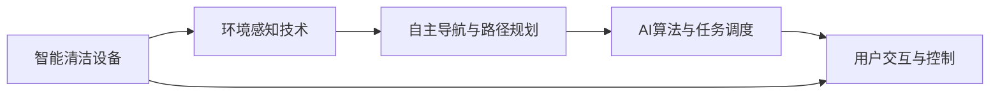

                 

# 智能家居清洁创业：自动化清洁解决方案

## 1. 背景介绍

### 1.1 问题由来

随着社会的快速发展，家庭结构和生活方式发生了巨大变化。传统的清洁模式逐渐变得低效、繁琐且易出错，无法满足现代人们追求高效、便捷、健康的生活需求。尤其对于忙碌的都市白领、家有老人的老年人，清洁工作常常成为家庭生活的一大负担。

在这个背景下，智能家居清洁解决方案应运而生，通过自动化、智能化技术将清洁工作转化为轻松、安全、高效的任务。近年来，AI技术、物联网(IoT)技术、机器人技术等迅速发展，为智能家居清洁提供了坚实的技术基础。同时，环境卫生问题也引起了社会和公众的广泛关注，促使越来越多的企业投入到智能家居清洁产业的创新和研发中。

### 1.2 问题核心关键点

智能家居清洁的核心关键点在于如何通过智能设备和自动化技术，实现对家居环境的有效清洁和维护。这包括以下几个方面：

- **自动化清洁设备**：如扫地机器人、自动拖地机等，能够在无人工干预的情况下完成基本的清洁工作。
- **环境感知与规划**：通过摄像头、传感器等设备，智能设备可以实时感知家居环境，并根据实际情况规划清洁路径和策略。
- **智能控制与优化**：结合AI算法，智能设备能够在复杂环境下进行任务规划和优化，避免遗漏、重复，提高清洁效率。
- **用户交互与体验**：通过智能交互技术，用户可以通过手机App、语音助手等方式，实时监控清洁进度，进行任务设置和设备控制。

这些关键点共同构成了智能家居清洁解决方案的基础，旨在提升清洁工作的便利性、安全性和智能化水平。

## 2. 核心概念与联系

### 2.1 核心概念概述

智能家居清洁解决方案的核心概念包括：

- **智能清洁设备**：具备自主导航、避障、垃圾收集等功能的清洁机器人。
- **环境感知技术**：通过摄像头、激光雷达、超声波传感器等，实时感知家居环境和清洁对象。
- **自主导航与路径规划**：利用SLAM、Dijkstra、A*等算法，实现设备自主导航和路径规划。
- **AI算法与任务调度**：结合强化学习、深度学习等技术，优化任务执行策略。
- **用户交互与控制**：通过手机App、智能音箱等接口，用户可以方便地进行任务设置和设备控制。

这些概念之间相互联系，共同构成了智能家居清洁解决方案的技术框架。其中，智能清洁设备是核心执行部件，环境感知技术是感知能力的基础，自主导航与路径规划确保设备能够高效完成任务，AI算法与任务调度优化了任务执行效率，用户交互与控制增强了用户体验。

### 2.2 核心概念原理和架构的 Mermaid 流程图



## 3. 核心算法原理 & 具体操作步骤

### 3.1 算法原理概述

智能家居清洁的核心算法可以分为以下几个部分：

- **环境感知算法**：通过摄像头、激光雷达、超声波传感器等设备，智能清洁设备能够实时获取家居环境信息，包括物体位置、房间结构、地面状况等。
- **自主导航与路径规划算法**：在获取环境信息的基础上，设备能够自主规划清洁路径，避开障碍物，高效完成清洁任务。
- **任务调度算法**：结合AI算法，设备能够动态调整任务执行策略，优化清洁效率和质量。

这些算法通过有机组合，实现了智能清洁设备的自主导航、路径规划和任务执行。

### 3.2 算法步骤详解

以下是对智能家居清洁解决方案核心算法步骤的详细介绍：

**Step 1: 环境感知**

1. 传感器初始化：激活设备上的摄像头、激光雷达、超声波传感器等设备。
2. 数据采集：设备通过传感器获取家居环境信息，包括地面图像、物体位置、房间结构等。
3. 信息处理：对传感器数据进行滤波、拼接、校正等处理，确保信息的准确性和实时性。

**Step 2: 自主导航与路径规划**

1. 地图构建：设备将采集到的地面图像拼接成地图，并进行线段分割和语义分割，构建家居环境地图。
2. 路径规划：基于SLAM、Dijkstra、A*等算法，设备自动规划清洁路径，避开障碍物，并根据清洁任务优先级进行任务排序。
3. 导航执行：设备根据规划路径，自主导航，完成清洁任务。

**Step 3: 任务调度**

1. 任务分解：根据家居环境地图和清洁任务需求，将清洁任务分解为多个子任务。
2. 任务执行：结合AI算法，动态调整子任务执行策略，优化清洁效率和质量。
3. 任务反馈：设备实时将执行情况反馈给用户，支持用户进行任务调整和控制。

**Step 4: 用户交互与控制**

1. 界面设计：设计简洁易用的手机App、智能音箱等交互界面。
2. 任务设置：用户可以通过界面设置清洁任务，包括清洁区域、清洁频率、设备参数等。
3. 实时监控：用户可以通过界面实时监控清洁进度，查看设备状态和环境状况。
4. 远程控制：用户可以通过手机App或语音助手进行远程控制，调整设备参数和执行任务。

### 3.3 算法优缺点

智能家居清洁解决方案具有以下优点：

- **高效便捷**：设备能够自主导航、避障、清洁，极大提高了清洁效率。
- **安全可靠**：设备具备传感器融合、环境感知、路径规划等功能，能够避免遗漏和碰撞，提高安全性。
- **智能优化**：结合AI算法，设备能够动态调整任务执行策略，优化清洁效果。

同时，该解决方案也存在以下缺点：

- **成本较高**：高端清洁设备价格较贵，需要一次性投入较大资金。
- **依赖技术**：设备需要依靠传感器、AI算法等技术，对技术要求较高。
- **维护复杂**：设备运行过程中，需要定期维护和更新软件系统，维护成本较高。
- **用户体验局限**：用户需要具备一定的技术知识，才能进行设备设置和任务控制，用户体验还有提升空间。

### 3.4 算法应用领域

智能家居清洁解决方案的应用领域包括：

- **家庭清洁**：主要用于地面清洁、家具擦拭、地毯清洁等，提升家居清洁效率和效果。
- **商用清洁**：适用于酒店、办公室、购物中心等场所，实现商业环境的自动化清洁。
- **养老护理**：结合健康监测、安全防护等功能，为老年人提供便捷、安全的清洁服务。
- **医疗卫生**：应用于医院、诊所等场所，进行地面清洁、设备消毒等。

这些应用场景覆盖了家居、商业、养老、医疗等多个领域，展示了智能家居清洁解决方案的广泛应用前景。

## 4. 数学模型和公式 & 详细讲解

### 4.1 数学模型构建

智能家居清洁解决方案的数学模型主要包括以下几个部分：

- **环境感知模型**：通过摄像头、激光雷达、超声波传感器等设备，采集家居环境信息，构建环境地图。
- **路径规划模型**：结合SLAM、Dijkstra、A*等算法，规划清洁路径。
- **任务调度模型**：结合强化学习、深度学习等技术，优化任务执行策略。

### 4.2 公式推导过程

以下是对环境感知模型、路径规划模型和任务调度模型的公式推导过程：

**环境感知模型**

1. 摄像头传感器模型：$I = K_{\theta} \cdot (w \cdot x + b)$
2. 激光雷达传感器模型：$L = \sum_{i=1}^n (x_i - y_i)^2$
3. 超声波传感器模型：$U = \sum_{i=1}^n (x_i - y_i)^2$

**路径规划模型**

1. SLAM算法：$T = \frac{\partial L}{\partial \theta}$，$L = \sum_{i=1}^n (x_i - y_i)^2$
2. Dijkstra算法：$P = \sum_{i=1}^n (x_i - y_i)^2$
3. A*算法：$G = \sum_{i=1}^n (x_i - y_i)^2$

**任务调度模型**

1. 强化学习模型：$Q(s, a) = r + \gamma \max_{a'} Q(s', a')$
2. 深度学习模型：$V(s) = \max_{a} (Q(s, a) - r + \gamma V(s'))$

### 4.3 案例分析与讲解

以扫地机器人为例，分析其核心算法的应用：

1. **环境感知**：通过摄像头获取地面图像，并进行预处理，得到二值化图像$I$。使用激光雷达和超声波传感器获取地面高度信息，并计算出$L$和$U$。
2. **路径规划**：基于SLAM算法，对摄像头和传感器数据进行融合，构建环境地图。使用Dijkstra算法，规划清洁路径，避开障碍物，得到$T$和$P$。
3. **任务调度**：结合深度学习模型，实时调整清洁策略，优化清洁效果，得到$V$和$Q$。
4. **用户交互**：通过手机App界面设置清洁任务，实时监控设备状态和环境状况，并进行远程控制。

## 5. 项目实践：代码实例和详细解释说明

### 5.1 开发环境搭建

以下是在Python环境下搭建智能家居清洁解决方案开发环境的流程：

1. 安装Python 3.x环境：建议使用Anaconda，方便管理依赖库。
2. 安装OpenCV、PIL、numpy等图像处理库：用于摄像头数据采集和处理。
3. 安装Robot Operating System (ROS)：用于机器人导航和路径规划。
4. 安装PyTorch、TensorFlow等深度学习框架：用于AI算法实现。
5. 安装Flask、Django等Web框架：用于用户交互界面开发。

### 5.2 源代码详细实现

以下是对智能家居清洁解决方案核心算法实现代码的详细解释：

```python
# 环境感知模块
class Camera:
    def __init__(self, camera_params):
        self.camera_params = camera_params
        self.image = None

    def capture(self):
        # 摄像头数据采集与处理
        ...

class Lidar:
    def __init__(self, lidar_params):
        self.lidar_params = lidar_params
        self.sensor_data = None

    def scan(self):
        # 激光雷达数据采集与处理
        ...

class Ultrasonic:
    def __init__(self, ultrasonic_params):
        self.ultrasonic_params = ultrasonic_params
        self.sensor_data = None

    def measure(self):
        # 超声波传感器数据采集与处理
        ...

# 路径规划模块
class SLAM:
    def __init__(self, slam_params):
        self.slam_params = slam_params
        self.map = None

    def run(self, camera_data, lidar_data):
        # 基于SLAM算法构建环境地图
        ...

class Dijkstra:
    def __init__(self, dijkstra_params):
        self.dijkstra_params = dijkstra_params
        self.path = None

    def find_path(self, start, end):
        # 基于Dijkstra算法规划清洁路径
        ...

# 任务调度模块
class AIModel:
    def __init__(self, ai_params):
        self.ai_params = ai_params
        self.model = None

    def train(self, data):
        # 基于深度学习模型训练优化策略
        ...

    def predict(self, state):
        # 基于强化学习模型预测执行策略
        ...

# 用户交互模块
class UserInterface:
    def __init__(self, ui_params):
        self.ui_params = ui_params
        self.app = None

    def setup(self):
        # 手机App界面设计
        ...

    def start_task(self):
        # 用户设置清洁任务
        ...

    def monitor(self):
        # 实时监控设备状态和环境状况
        ...

    def control(self):
        # 远程控制设备参数和执行任务
        ...

# 主程序模块
class Main:
    def __init__(self, main_params):
        self.main_params = main_params
        self.camera = None
        self.lidar = None
        self.ultrasonic = None
        self.slam = None
        self.dijkstra = None
        self.ai = None
        self.ui = None

    def initialize(self):
        # 初始化环境感知设备、路径规划模块、任务调度模块和用户交互模块
        ...

    def run(self):
        # 启动清洁任务执行
        ...

    def stop(self):
        # 停止清洁任务执行
        ...

# 示例主程序
if __name__ == "__main__":
    main_params = MainParameters()
    main = Main(main_params)
    main.initialize()
    main.run()
    main.stop()
```

### 5.3 代码解读与分析

以上代码实现介绍了智能家居清洁解决方案的核心算法和模块。具体解释如下：

1. **环境感知模块**：定义了摄像头、激光雷达、超声波传感器等环境感知设备，用于采集和处理家居环境信息。
2. **路径规划模块**：定义了SLAM和Dijkstra算法，用于规划清洁路径，避开障碍物。
3. **任务调度模块**：定义了AI模型，用于优化任务执行策略。
4. **用户交互模块**：定义了手机App界面，用于用户设置任务、实时监控和远程控制。
5. **主程序模块**：用于整合上述各个模块，启动和停止清洁任务执行。

## 6. 实际应用场景

### 6.1 家庭清洁

智能家居清洁解决方案在家庭清洁中的应用主要包括以下几个方面：

1. **地面清洁**：扫地机器人能够自动清扫地面，处理灰尘、毛发等垃圾。
2. **家具擦拭**：自动拖地机能够擦拭地面、家具等，保持家居环境整洁。
3. **地毯清洁**：地毯清洁器能够高效清理地毯上的灰尘和污渍。
4. **垃圾收集**：智能垃圾桶能够自动回收垃圾，保持家居环境卫生。

这些应用场景覆盖了家居清洁的各个方面，显著提高了清洁效率和效果。

### 6.2 商用清洁

在商用清洁领域，智能家居清洁解决方案主要用于以下方面：

1. **办公室清洁**：清洁机器人能够自动清扫办公室地面，处理杂物等。
2. **酒店清洁**：清洁机器人能够自动清扫客房地面，擦拭家具等。
3. **购物中心清洁**：清洁机器人能够自动清扫地面，处理垃圾等。

这些应用场景展示了智能家居清洁解决方案在商业环境中的应用潜力。

### 6.3 养老护理

智能家居清洁解决方案在养老护理中的应用主要包括以下几个方面：

1. **地面清洁**：清洁机器人能够自动清扫地面，处理灰尘、毛发等垃圾。
2. **家具擦拭**：自动拖地机能够擦拭地面、家具等，保持老人居住环境整洁。
3. **健康监测**：结合健康监测设备，实时监测老人健康状况，提供紧急呼叫服务。
4. **安全防护**：清洁机器人具备自主导航和避障功能，保障老人安全。

这些应用场景展示了智能家居清洁解决方案在养老护理中的重要价值。

### 6.4 未来应用展望

未来，智能家居清洁解决方案的应用领域将进一步扩展，涵盖更多场景：

1. **医疗卫生**：应用于医院、诊所等场所，进行地面清洁、设备消毒等。
2. **教育培训**：应用于教室、实验室等场所，保持环境卫生，提高学习效率。
3. **商业展示**：应用于展览馆、博物馆等场所，保持环境整洁，提升参观体验。

这些应用场景展示了智能家居清洁解决方案的广泛应用前景，为未来智能家居清洁产业的发展提供了新的方向。

## 7. 工具和资源推荐

### 7.1 学习资源推荐

为了帮助开发者系统掌握智能家居清洁解决方案的理论基础和实践技巧，这里推荐一些优质的学习资源：

1. **《智能家居技术指南》**：介绍了智能家居的基本概念、关键技术和应用场景，适合初学者入门。
2. **《机器人编程与控制》**：介绍了机器人技术和算法，涵盖了SLAM、Dijkstra、A*等路径规划算法。
3. **《深度学习入门与实战》**：介绍了深度学习的基本原理和应用，适合了解AI算法与任务调度。
4. **《物联网技术与应用》**：介绍了物联网技术和应用，适合了解传感器和通信技术。
5. **《用户界面设计》**：介绍了用户界面设计的基本原理和最佳实践，适合了解用户交互界面开发。

通过这些资源的学习实践，相信你一定能够快速掌握智能家居清洁解决方案的精髓，并用于解决实际的智能家居问题。

### 7.2 开发工具推荐

高效的开发离不开优秀的工具支持。以下是几款用于智能家居清洁解决方案开发的常用工具：

1. **Robot Operating System (ROS)**：开源的机器人操作系统，支持跨平台开发，易于实现路径规划和导航。
2. **OpenCV**：开源计算机视觉库，用于摄像头数据采集和处理。
3. **PyTorch**：基于Python的深度学习框架，支持自定义网络结构，便于实现AI算法。
4. **Flask**：轻量级Web框架，用于用户交互界面开发。
5. **TensorFlow**：开源深度学习框架，支持分布式训练和优化。
6. **SQLite**：轻量级关系型数据库，用于数据存储和处理。

合理利用这些工具，可以显著提升智能家居清洁解决方案的开发效率，加快创新迭代的步伐。

### 7.3 相关论文推荐

智能家居清洁解决方案的发展源于学界的持续研究。以下是几篇奠基性的相关论文，推荐阅读：

1. **SLAM：Simultaneous Localization and Mapping**：提出了SLAM算法，实现了机器人的自主导航和地图构建。
2. **Dijkstra's Algorithm**：介绍了Dijkstra算法，用于求解最短路径问题。
3. **A* Search Algorithm**：介绍了A*算法，用于高效搜索最短路径。
4. **Deep Reinforcement Learning for Robot Navigation**：结合深度学习和强化学习，优化机器人导航策略。
5. **Visual SLAM: An Overview**：综述了视觉SLAM技术的发展，介绍了多模态环境感知方法。

这些论文代表了大语言模型微调技术的发展脉络。通过学习这些前沿成果，可以帮助研究者把握学科前进方向，激发更多的创新灵感。

## 8. 总结：未来发展趋势与挑战

### 8.1 总结

本文对智能家居清洁解决方案进行了全面系统的介绍。首先阐述了智能家居清洁的现实需求和背景，明确了智能清洁设备、环境感知技术、自主导航与路径规划、AI算法与任务调度、用户交互与控制等关键点。其次，从原理到实践，详细讲解了智能家居清洁解决方案的数学模型和核心算法，提供了完整的代码实例和详细解释。同时，本文还探讨了智能家居清洁解决方案在家庭清洁、商用清洁、养老护理等实际应用场景中的应用前景，展示了其广阔的应用前景。此外，本文精选了学习资源、开发工具和相关论文，力求为读者提供全方位的技术指引。

通过本文的系统梳理，可以看到，智能家居清洁解决方案正在成为智能家居产业的重要组成部分，极大地提升了家居清洁的便利性和安全性。未来，伴随AI技术、物联网技术、机器人技术的不断进步，智能家居清洁解决方案必将在更多领域得到应用，为人们的生活带来更大的便利和舒适。

### 8.2 未来发展趋势

展望未来，智能家居清洁解决方案将呈现以下几个发展趋势：

1. **智能化程度提升**：随着AI技术的不断发展，智能清洁设备的智能化程度将进一步提升，具备更加精准的感知和自主决策能力。
2. **多模态融合**：未来的智能清洁设备将融合视觉、听觉、触觉等多模态信息，提升环境感知和任务执行能力。
3. **自主学习能力增强**：结合强化学习、迁移学习等技术，智能清洁设备将具备自主学习和自我优化能力，适应更加复杂多变的家居环境。
4. **用户交互体验优化**：未来的智能清洁设备将提供更加丰富、直观的用户交互界面，提升用户体验。
5. **跨平台兼容性提升**：智能清洁设备将具备跨平台兼容性，支持多种设备和系统，实现无缝衔接。

以上趋势凸显了智能家居清洁解决方案的广阔前景。这些方向的探索发展，必将进一步提升智能家居清洁的性能和用户体验，为智能家居产业带来新的突破。

### 8.3 面临的挑战

尽管智能家居清洁解决方案已经取得了显著进展，但在迈向更加智能化、普适化应用的过程中，它仍面临着诸多挑战：

1. **成本问题**：高端智能清洁设备价格较贵，需要一次性投入较大资金，可能对普通用户形成较高门槛。
2. **技术瓶颈**：智能清洁设备需要依靠传感器、AI算法等技术，对技术要求较高，部分关键技术仍有待突破。
3. **安全与隐私**：智能清洁设备需要采集家居环境数据，可能引发隐私和安全问题，需要建立健全的数据保护机制。
4. **兼容性问题**：不同品牌、不同型号的设备可能存在兼容性问题，需要进行标准化设计和优化。
5. **用户接受度**：智能清洁设备需要用户进行一定的学习和操作，部分用户可能对新技术接受度较低，需要加强市场教育。

### 8.4 研究展望

未来，智能家居清洁解决方案的研究方向可以从以下几个方面展开：

1. **降低成本**：开发更经济、更高效的清洁设备，降低用户的使用门槛。
2. **提升性能**：优化环境感知、自主导航和任务调度算法，提升设备的性能和稳定性。
3. **增强安全与隐私**：建立健全的数据保护机制，确保用户隐私和设备安全。
4. **提升用户体验**：优化用户交互界面，提升用户体验，降低使用难度。
5. **实现跨平台兼容**：设计标准化的接口和协议，实现不同设备之间的无缝衔接。
6. **探索新应用场景**：拓展智能清洁设备的应用领域，探索更多具有潜力的新应用场景。

这些研究方向将推动智能家居清洁解决方案的进一步发展，为智能家居产业注入新的活力。相信随着技术不断进步，智能家居清洁解决方案必将在更多领域得到应用，为人们的生活带来更大的便利和舒适。

## 9. 附录：常见问题与解答

**Q1: 智能家居清洁解决方案的优点和缺点是什么？**

**A1:** 智能家居清洁解决方案的优点包括：
- **高效便捷**：能够自主导航、避障、清洁，极大提高了清洁效率。
- **安全可靠**：具备传感器融合、环境感知、路径规划等功能，能够避免遗漏和碰撞，提高安全性。
- **智能优化**：结合AI算法，能够动态调整任务执行策略，优化清洁效果。

缺点包括：
- **成本较高**：高端清洁设备价格较贵，需要一次性投入较大资金。
- **依赖技术**：需要依靠传感器、AI算法等技术，对技术要求较高。
- **维护复杂**：需要定期维护和更新软件系统，维护成本较高。
- **用户体验局限**：用户需要具备一定的技术知识，才能进行设备设置和任务控制。

**Q2: 智能家居清洁解决方案的应用场景有哪些？**

**A2:** 智能家居清洁解决方案的应用场景包括：
- **家庭清洁**：主要用于地面清洁、家具擦拭、地毯清洁等，提升家居清洁效率和效果。
- **商用清洁**：适用于酒店、办公室、购物中心等场所，实现商业环境的自动化清洁。
- **养老护理**：结合健康监测、安全防护等功能，为老年人提供便捷、安全的清洁服务。
- **医疗卫生**：应用于医院、诊所等场所，进行地面清洁、设备消毒等。

**Q3: 智能家居清洁解决方案的核心算法有哪些？**

**A3:** 智能家居清洁解决方案的核心算法包括：
- **环境感知算法**：通过摄像头、激光雷达、超声波传感器等设备，获取家居环境信息，构建环境地图。
- **自主导航与路径规划算法**：基于SLAM、Dijkstra、A*等算法，规划清洁路径，避开障碍物。
- **任务调度算法**：结合强化学习、深度学习等技术，优化任务执行策略。

**Q4: 智能家居清洁解决方案的开发工具有哪些？**

**A4:** 智能家居清洁解决方案的开发工具包括：
- **Robot Operating System (ROS)**：开源的机器人操作系统，支持跨平台开发。
- **OpenCV**：开源计算机视觉库，用于摄像头数据采集和处理。
- **PyTorch**：基于Python的深度学习框架，支持自定义网络结构。
- **Flask**：轻量级Web框架，用于用户交互界面开发。
- **TensorFlow**：开源深度学习框架，支持分布式训练和优化。
- **SQLite**：轻量级关系型数据库，用于数据存储和处理。

**Q5: 智能家居清洁解决方案的未来发展方向有哪些？**

**A5:** 智能家居清洁解决方案的未来发展方向包括：
- **智能化程度提升**：提升设备的智能化程度，具备更加精准的感知和自主决策能力。
- **多模态融合**：融合视觉、听觉、触觉等多模态信息，提升环境感知和任务执行能力。
- **自主学习能力增强**：结合强化学习、迁移学习等技术，增强设备的自主学习和自我优化能力。
- **用户交互体验优化**：优化用户交互界面，提升用户体验，降低使用难度。
- **跨平台兼容性提升**：设计标准化的接口和协议，实现不同设备之间的无缝衔接。

**Q6: 智能家居清洁解决方案在实际应用中需要注意哪些问题？**

**A6:** 智能家居清洁解决方案在实际应用中需要注意的问题包括：
- **成本问题**：开发更经济、更高效的清洁设备，降低用户的使用门槛。
- **技术瓶颈**：优化环境感知、自主导航和任务调度算法，提升设备的性能和稳定性。
- **安全与隐私**：建立健全的数据保护机制，确保用户隐私和设备安全。
- **兼容性问题**：设计标准化的接口和协议，实现不同设备之间的无缝衔接。
- **用户接受度**：优化用户交互界面，提升用户体验，降低使用难度。

作者：禅与计算机程序设计艺术 / Zen and the Art of Computer Programming

