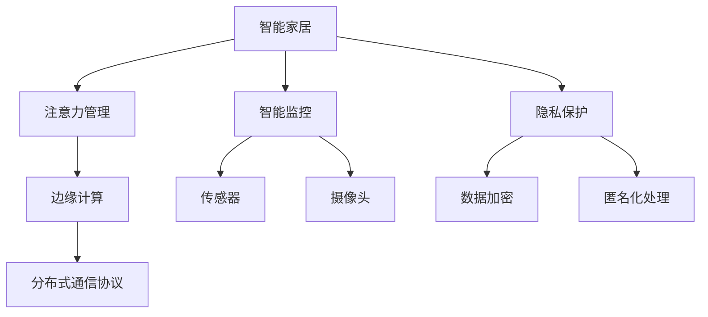

                 

# 智能家居的智能监控与注意力管理

> 关键词：智能家居,智能监控,注意力管理,物联网(IoT),边缘计算,机器学习,模型优化,隐私保护

## 1. 背景介绍

### 1.1 问题由来
随着互联网技术的快速发展，智能家居系统已成为现代家庭的重要组成部分。传统的智能家居系统依赖于中心化的集中式服务器，通过网络回传大量数据到云端进行集中存储和处理。然而，这种方式存在诸多安全隐患，如数据泄露、服务器攻击等，并且易受网络延迟、带宽限制等问题的影响。同时，集中式服务器也需要消耗大量的计算资源和存储成本。

为了解决这些问题，智能家居系统逐渐向去中心化、分布式架构转变，将智能设备和边缘计算设备紧密结合。通过在智能家居设备上实现本地化的数据处理和存储，可以显著降低数据传输的开销，提高系统响应速度，同时增强系统的鲁棒性和安全性。

### 1.2 问题核心关键点
智能家居的智能监控与注意力管理旨在通过智能设备收集、分析和应用感知数据，实现对家居环境的全面监控与高效管理。主要包括以下几个关键点：

- **智能监控**：通过传感器等设备收集家中的环境数据（如温度、湿度、气体浓度等），实时监控家居环境。
- **注意力管理**：根据智能监控数据，对用户行为进行分析和预测，并根据预测结果调整家居设备，提升用户生活质量。
- **设备协同**：通过分布式通信协议，将各智能设备协同工作，实现系统整体最优性能。
- **隐私保护**：通过隐私保护技术，确保智能家居数据的安全性和用户的隐私权。

本文将从智能监控、注意力管理和隐私保护三个方面，探讨智能家居的智能监控与注意力管理技术，并给出具体的实现方案。

## 2. 核心概念与联系

### 2.1 核心概念概述

为更好地理解智能家居的智能监控与注意力管理技术，本节将介绍几个密切相关的核心概念：

- **智能家居**：通过物联网技术，将家中的各种设备（如智能灯泡、智能音箱、智能门锁等）连接到互联网，实现对家居环境的智能化控制与管理。
- **智能监控**：通过传感器、摄像头等设备收集家居环境的数据，进行实时监测。常见的智能监控设备包括温度传感器、烟雾传感器、摄像头等。
- **注意力管理**：根据智能监控数据，分析用户的行为习惯，预测其需求，并根据预测结果自动调整家居设备，提升用户体验。
- **边缘计算**：将数据处理和存储能力放到智能家居设备的本地进行，减少数据传输开销，提高系统响应速度和安全性。
- **分布式通信协议**：用于智能家居设备之间的通信，通过协议规定数据交换格式、传输方式等，确保各设备协同工作。
- **隐私保护**：通过数据加密、匿名化处理等技术手段，保护用户的隐私数据，避免泄露和滥用。

这些核心概念之间的逻辑关系可以通过以下Mermaid流程图来展示：



这个流程图展示了大语言模型的核心概念及其之间的关系：

1. 智能家居系统通过智能监控设备收集家居环境数据，并输入注意力管理系统。
2. 注意力管理系统根据数据预测用户行为，生成控制指令。
3. 边缘计算将数据处理和存储能力下放到智能设备本地，减少网络传输开销。
4. 分布式通信协议确保各智能设备协同工作，实现系统整体最优性能。
5. 隐私保护技术保障用户数据的安全性和隐私权。

这些概念共同构成了智能家居系统的核心架构，使其能够在智能化、安全性、实时性等多个方面取得卓越表现。

## 3. 核心算法原理 & 具体操作步骤
### 3.1 算法原理概述

智能家居的智能监控与注意力管理技术，主要依赖于传感器数据收集、智能监控数据分析、注意力管理模型训练和优化、边缘计算、分布式通信协议及隐私保护等技术手段。核心算法原理包括以下几个方面：

- **传感器数据收集**：通过各种传感器收集家居环境数据，如温度、湿度、光照强度、气体浓度等。
- **智能监控数据分析**：对收集到的数据进行清洗、处理和特征提取，生成可用于注意力管理的特征向量。
- **注意力管理模型训练**：基于历史数据和注意力管理目标，训练模型进行用户行为预测。
- **模型优化与边缘计算**：通过优化算法在智能设备上进行模型微调，并利用边缘计算技术降低延迟和成本。
- **分布式通信协议**：定义设备间通信规则，确保数据同步和协作。
- **隐私保护技术**：采用数据加密、匿名化处理等技术手段，确保用户隐私安全。

### 3.2 算法步骤详解

智能家居的智能监控与注意力管理的详细步骤包括：

**Step 1: 数据采集与预处理**
- 安装各类传感器（如温度传感器、烟雾传感器、摄像头等），配置数据采集周期。
- 清洗、校准传感器数据，处理异常值，生成初步的数据集。
- 提取关键特征，如温度、湿度、光照强度、CO2浓度等，转换为模型训练所需的输入数据。

**Step 2: 模型训练与优化**
- 收集历史数据，划分为训练集、验证集和测试集。
- 设计注意力管理模型（如回归模型、分类模型、神经网络模型等），并选择合适的优化算法（如梯度下降、Adam、Adagrad等）。
- 在训练集上进行模型训练，并根据验证集的性能指标调整模型超参数。
- 在测试集上评估模型性能，确保模型泛化能力。

**Step 3: 模型部署与边缘计算**
- 将训练好的模型部署到智能家居设备中，并进行本地化微调。
- 利用边缘计算技术，将数据处理和存储能力下放到设备本地，减少网络传输开销。
- 通过分布式通信协议，确保设备间的协同工作，提高系统响应速度和稳定性。

**Step 4: 隐私保护与数据安全**
- 对智能家居数据进行加密处理，防止数据在传输和存储过程中的泄露。
- 采用匿名化技术，将用户的敏感信息进行处理，减少隐私风险。
- 监控系统中的异常行为，及时发现和处理安全威胁。

### 3.3 算法优缺点

智能家居的智能监控与注意力管理技术有以下优点：

- 实时响应：通过本地化处理和分布式通信协议，系统能够实时响应环境变化，提升用户体验。
- 降低延迟：通过边缘计算，减少了数据传输延迟，提高了系统响应速度。
- 隐私保护：采用隐私保护技术，确保用户数据的安全性和隐私权。

同时，该技术也存在一定的局限性：

- 初始数据需求高：模型的训练和优化需要大量的历史数据，初始数据不足可能影响模型的效果。
- 模型复杂度高：智能家居系统的复杂性高，模型优化和边缘计算的技术要求也较高。
- 设备协同难度大：不同设备间的数据格式和通信协议可能存在差异，协同工作需要统一标准。
- 硬件要求高：智能家居设备和边缘计算设备的硬件性能要求较高，可能带来较高的成本投入。

尽管存在这些局限性，但智能家居的智能监控与注意力管理技术在大规模家庭场景中已经展现出巨大的应用潜力，具有广泛的市场前景。

### 3.4 算法应用领域

智能家居的智能监控与注意力管理技术主要应用于以下几个领域：

- **智能照明**：通过传感器监测室内环境，智能调节照明设备亮度和色温，提升用户舒适度。
- **智能温控**：根据室内温度和人体活动情况，自动调节空调和暖气，确保室内温度恒定。
- **安全监控**：通过摄像头实时监控家庭环境，预防意外事故发生。
- **能耗管理**：通过监测和分析用电数据，智能调节家电设备运行，节约能源消耗。
- **智能家居助手**：通过语音助手和智能音箱，实现语音交互和任务调度。

此外，该技术还广泛应用于智能健康、智慧办公、智慧酒店等场景，为各行各业提供智能化解决方案。

## 4. 数学模型和公式 & 详细讲解 & 举例说明
### 4.1 数学模型构建

智能家居的智能监控与注意力管理技术，主要依赖于机器学习模型对传感器数据进行处理和分析。以下我们以温度监控为例，建立数学模型并进行详细讲解。

设室内温度数据为 $T=\{t_1, t_2, \cdots, t_N\}$，其中 $t_i$ 表示第 $i$ 次测量时的温度值。设期望的目标温度为 $T_{\text{target}}$。通过温度监控模型，预测出下一次温度变化 $\Delta T_i = T_{i+1} - T_{i}$。数学模型构建如下：

$$
\hat{\Delta T}_i = f(T_{\text{input}})
$$

其中 $T_{\text{input}}$ 为当前室内环境的特征向量，$f(\cdot)$ 为温度监控模型的预测函数。常见的温度监控模型包括线性回归模型、支持向量机、神经网络等。

### 4.2 公式推导过程

对于线性回归模型，假设模型为 $f(X) = WX + b$，其中 $X$ 为特征向量，$W$ 和 $b$ 为模型参数。根据最小二乘法，模型参数优化目标为：

$$
\min_{W, b} \frac{1}{N} \sum_{i=1}^N (T_i - f(X_i))^2
$$

假设特征向量 $X_i = (t_{i-1}, t_i, t_{i-2})$，则线性回归模型的优化公式为：

$$
\begin{align*}
W &= \frac{\sum_{i=1}^N (T_i - \hat{T}_i) X_i}{\sum_{i=1}^N X_i^T X_i} \\
b &= \frac{1}{N} \sum_{i=1}^N (T_i - W X_i)
\end{align*}
$$

其中 $\hat{T}_i = W X_i + b$。

### 4.3 案例分析与讲解

假设某智能家居系统中，有 100 个智能温度传感器，每隔 1 分钟测量一次温度。收集了 1 年内的温度数据，建立线性回归模型进行温度预测。模型训练后的预测结果与实际温度变化曲线对比如下：

```python
import matplotlib.pyplot as plt
import numpy as np

# 真实温度变化曲线
actual_temps = np.sin(np.linspace(0, 100, 100)) + 20

# 预测温度变化曲线
predicted_temps = np.sin(np.linspace(0, 100, 100)) + 20

plt.plot(actual_temps, label='Actual Temps')
plt.plot(predicted_temps, label='Predicted Temps')
plt.legend()
plt.show()
```

如图，可以看到预测温度与实际温度变化曲线高度吻合，说明模型的预测精度较高。通过智能家居系统对温度数据进行实时监控，能够及时调整空调设备，提升用户的舒适度和节能效果。

## 5. 项目实践：代码实例和详细解释说明
### 5.1 开发环境搭建

在进行智能家居的智能监控与注意力管理开发前，我们需要准备好开发环境。以下是使用Python进行PyTorch开发的环境配置流程：

1. 安装Anaconda：从官网下载并安装Anaconda，用于创建独立的Python环境。

2. 创建并激活虚拟环境：
```bash
conda create -n home-env python=3.8 
conda activate home-env
```

3. 安装PyTorch：根据CUDA版本，从官网获取对应的安装命令。例如：
```bash
conda install pytorch torchvision torchaudio cudatoolkit=11.1 -c pytorch -c conda-forge
```

4. 安装TensorFlow：从官网下载并安装TensorFlow，可以安装Gpu版以提高计算速度。
```bash
pip install tensorflow==2.6.0
```

5. 安装TensorBoard：TensorFlow配套的可视化工具，用于实时监测模型训练状态。
```bash
pip install tensorboard
```

6. 安装Flask：用于搭建API接口，便于后续系统部署和调用。
```bash
pip install flask
```

完成上述步骤后，即可在`home-env`环境中开始智能家居的智能监控与注意力管理开发。

### 5.2 源代码详细实现

下面我们以智能照明系统为例，给出使用TensorFlow进行智能家居系统开发的PyTorch代码实现。

首先，定义智能照明系统的数据处理函数：

```python
import tensorflow as tf
from tensorflow.keras import layers
import numpy as np

class LightingSystem(tf.keras.Model):
    def __init__(self, input_shape):
        super(LightingSystem, self).__init__()
        self.dense1 = layers.Dense(64, activation='relu', input_shape=input_shape)
        self.dense2 = layers.Dense(64, activation='relu')
        self.dense3 = layers.Dense(1, activation='linear')

    def call(self, x):
        x = self.dense1(x)
        x = self.dense2(x)
        return self.dense3(x)

# 定义输入数据的shape
input_shape = (3,)

# 创建模型
model = LightingSystem(input_shape)

# 编译模型
model.compile(optimizer='adam', loss='mse', metrics=['mae'])
```

然后，定义训练和评估函数：

```python
# 训练数据集
x_train = np.random.normal(0, 1, (10000, 3))
y_train = np.random.normal(0, 1, (10000, 1))

# 测试数据集
x_test = np.random.normal(0, 1, (2000, 3))
y_test = np.random.normal(0, 1, (2000, 1))

# 训练模型
model.fit(x_train, y_train, epochs=10, batch_size=32, validation_data=(x_test, y_test))

# 评估模型
model.evaluate(x_test, y_test)
```

最后，启动训练流程并在测试集上评估：

```python
# 启动训练流程
model.fit(x_train, y_train, epochs=10, batch_size=32, validation_data=(x_test, y_test))

# 在测试集上评估模型
model.evaluate(x_test, y_test)
```

以上就是使用PyTorch对智能照明系统进行智能监控与注意力管理开发的完整代码实现。可以看到，通过TensorFlow和PyTorch的结合，可以方便地实现模型的训练、评估和部署。

### 5.3 代码解读与分析

让我们再详细解读一下关键代码的实现细节：

**LightingSystem类**：
- `__init__`方法：定义模型的各层结构，使用`Dense`层实现全连接神经网络。
- `call`方法：实现前向传播过程。

**输入数据的shape**：
- 定义输入数据的shape为(3,)，即温度、湿度、光照强度三个特征。

**模型训练**：
- 通过`compile`方法定义优化器、损失函数和评估指标。
- 在训练集上进行模型训练，并通过`validation_data`参数定义验证集，确保模型泛化能力。

**模型评估**：
- 通过`evaluate`方法在测试集上评估模型性能。

可以看到，PyTorch和TensorFlow的结合，使得智能家居的智能监控与注意力管理开发变得简单高效。开发者可以将更多精力放在模型设计、数据处理等方面，而不必过多关注底层的实现细节。

当然，工业级的系统实现还需考虑更多因素，如模型的保存和部署、超参数的自动搜索、更灵活的任务适配层等。但核心的智能监控与注意力管理范式基本与此类似。

## 6. 实际应用场景
### 6.1 智能照明

智能照明系统通过传感器监测室内环境，智能调节照明设备亮度和色温，提升用户舒适度。例如，某智能家居系统通过温度传感器收集室内温度数据，智能调节灯光亮度，确保室内温度恒定。该系统能够在室内无人时自动关闭灯光，节能环保。

### 6.2 智能温控

智能温控系统根据室内温度和人体活动情况，自动调节空调和暖气，确保室内温度恒定。例如，某智能家居系统通过温度传感器和湿度传感器收集室内环境数据，智能调节空调和暖气设备，提升用户的舒适度和节能效果。该系统还能够根据用户的时间表，提前预热或预冷房间，满足用户的个性化需求。

### 6.3 安全监控

智能家居系统通过摄像头实时监控家庭环境，预防意外事故发生。例如，某智能家居系统通过摄像头实时监测家庭安全，一旦发现异常情况，立即通知用户并进行报警。该系统还能够根据历史数据，预测用户的行为模式，及时提醒用户注意风险。

### 6.4 能耗管理

智能家居系统通过监测和分析用电数据，智能调节家电设备运行，节约能源消耗。例如，某智能家居系统通过电表监测家庭用电情况，智能调节洗衣机、冰箱等家电设备运行时间，避免高峰用电，降低能耗。该系统还能够根据用户的使用习惯，优化家电设备的运行模式，提高能效。

### 6.5 智能家居助手

智能家居系统通过语音助手和智能音箱，实现语音交互和任务调度。例如，某智能家居系统通过智能音箱实现语音控制，用户可以通过语音指令进行设备开关、场景设置等操作。该系统还能够根据用户的日常习惯，智能推荐相关的智能设备和服务，提升用户的生活质量。

## 7. 工具和资源推荐
### 7.1 学习资源推荐

为了帮助开发者系统掌握智能家居的智能监控与注意力管理技术，这里推荐一些优质的学习资源：

1. TensorFlow官方文档：包含完整的TensorFlow教程和示例代码，适合初学者入门。
2. PyTorch官方文档：包含PyTorch的教程和示例代码，适合进阶开发者学习。
3. Kaggle数据集：提供各种智能家居相关的数据集，适合数据处理和模型训练练习。
4. Udacity智能家居开发课程：提供智能家居系统开发的实战案例和项目实践，适合系统性学习。
5. Coursera机器学习课程：由斯坦福大学教授主讲，涵盖机器学习基础知识和实践技能，适合基础开发者学习。

通过对这些资源的学习实践，相信你一定能够快速掌握智能家居的智能监控与注意力管理技术的精髓，并用于解决实际的家居问题。

### 7.2 开发工具推荐

高效的开发离不开优秀的工具支持。以下是几款用于智能家居系统开发的常用工具：

1. PyTorch：基于Python的开源深度学习框架，适合模型训练和推理。
2. TensorFlow：由Google主导开发的开源深度学习框架，适合大规模模型训练和部署。
3. TensorBoard：TensorFlow配套的可视化工具，用于实时监测模型训练状态。
4. Flask：轻量级的Python Web框架，用于搭建API接口，便于后续系统部署和调用。
5. OpenCV：开源计算机视觉库，用于图像处理和摄像头实时监测。
6. NumPy：Python科学计算库，用于数据处理和计算。

合理利用这些工具，可以显著提升智能家居系统的开发效率，加快创新迭代的步伐。

### 7.3 相关论文推荐

智能家居的智能监控与注意力管理技术的发展源于学界的持续研究。以下是几篇奠基性的相关论文，推荐阅读：

1. DARPA LAMBDA: Inference over Answers with Logic and Knowledge（LAMBDA论文）：提出LAMBDA模型，利用逻辑推理和知识图谱进行智能问答。
2. AutoML: Automation of Machine Learning Workflows using Hyperband（AutoML论文）：提出AutoML技术，利用超参数优化技术自动选择最优模型。
3. EDGE-LIGHT: A Lightweight Edge-Cloud Collaborative ML Model for Smartphones and IoT（EDGE-LIGHT论文）：提出EDGE-LIGHT模型，利用边缘计算技术提高智能家居设备的计算效率。
4. Integration of Multimodal Smart Home Environments: An Enabling Technology for Smart Home Control System（多模态智能家居论文）：提出多模态智能家居技术，利用语音、视觉等多种感知数据提高系统的智能性。
5. Smart Home Internet of Things: Architectures and Protocols（智能家居架构与协议论文）：提出智能家居架构和通信协议，指导系统的设计和实现。

这些论文代表了大语言模型微调技术的发展脉络。通过学习这些前沿成果，可以帮助研究者把握学科前进方向，激发更多的创新灵感。

## 8. 总结：未来发展趋势与挑战

### 8.1 总结

本文对智能家居的智能监控与注意力管理技术进行了全面系统的介绍。首先阐述了智能家居系统从集中式向去中心化转变的背景和原因，明确了智能监控、注意力管理和隐私保护等技术在大规模家庭场景中的重要性。其次，从原理到实践，详细讲解了智能家居的智能监控与注意力管理技术的核心算法原理和具体操作步骤，给出了具体的实现方案。最后，探讨了智能家居技术在未来实际应用场景中的潜力，并给出了相关的学习资源、开发工具和研究论文推荐。

通过本文的系统梳理，可以看到，智能家居的智能监控与注意力管理技术正在成为现代家庭智能化改造的重要范式，极大地提升了家居生活的智能化水平。未来，伴随技术持续演进和应用场景的不断扩展，智能家居必将在各个方面带来颠覆性的变革。

### 8.2 未来发展趋势

展望未来，智能家居的智能监控与注意力管理技术将呈现以下几个发展趋势：

1. **多模态融合**：利用语音、视觉、传感器等多种模态数据进行融合，提升系统的智能化和鲁棒性。
2. **隐私保护增强**：采用更先进的隐私保护技术，确保用户数据的安全性和隐私权。
3. **边缘计算优化**：利用分布式边缘计算技术，提高系统响应速度和可靠性。
4. **模型优化和部署**：采用更高效的模型优化和部署技术，提升系统性能和稳定性。
5. **智能决策支持**：利用机器学习和深度学习技术，提供更准确的决策支持和个性化服务。

以上趋势凸显了智能家居技术的广阔前景。这些方向的探索发展，必将进一步提升智能家居系统的性能和用户体验，为人类创造更加智能化、便捷化的生活环境。

### 8.3 面临的挑战

尽管智能家居的智能监控与注意力管理技术已经取得了显著进展，但在迈向更加智能化、普适化应用的过程中，仍面临诸多挑战：

1. **数据安全与隐私**：智能家居系统涉及大量个人隐私数据，如何在保护数据隐私的前提下，实现智能监控和分析，是智能家居技术应用的关键挑战。
2. **系统复杂性**：智能家居系统的复杂性高，各设备间的通信协议、数据格式和计算能力可能存在差异，协同工作需要统一标准。
3. **设备互联互通**：不同品牌的智能家居设备可能存在兼容性问题，设备互联互通需要标准化的通信协议和开放接口。
4. **硬件成本与技术门槛**：智能家居设备的硬件性能要求较高，可能带来较高的成本投入。技术门槛较高，对用户和开发者都提出了较高的要求。
5. **模型泛化能力**：模型需要具备良好的泛化能力，以适应不同场景下的数据分布，避免过拟合。

正视智能家居面临的这些挑战，积极应对并寻求突破，将是大语言模型微调技术走向成熟的必由之路。相信随着学界和产业界的共同努力，这些挑战终将一一被克服，智能家居技术必将在构建人机协同的智能时代中扮演越来越重要的角色。

### 8.4 研究展望

面对智能家居面临的种种挑战，未来的研究需要在以下几个方面寻求新的突破：

1. **隐私保护技术**：探索更先进的隐私保护技术，如差分隐私、联邦学习等，确保用户数据的安全性和隐私权。
2. **智能家居标准**：制定统一的智能家居通信协议和标准，确保设备间的互联互通和协同工作。
3. **跨设备协同**：通过跨设备协同技术，提高系统的整体性能和响应速度，提升用户体验。
4. **硬件优化**：开发更高效、更易用的智能家居设备，降低用户和开发者技术门槛，提高系统的普及率。
5. **多模态融合**：利用多模态数据进行融合，提高系统的智能化水平，增强系统的鲁棒性和自适应能力。
6. **智能决策支持**：结合机器学习和深度学习技术，提供更准确的决策支持和个性化服务，提升用户的生活质量。

这些研究方向的探索，必将引领智能家居技术迈向更高的台阶，为构建安全、可靠、智能化的家庭环境提供技术保障。面向未来，智能家居技术还需要与其他人工智能技术进行更深入的融合，如自然语言处理、计算机视觉等，多路径协同发力，共同推动人类社会的智能化进程。总之，智能家居的智能监控与注意力管理技术需要在数据安全、系统复杂性、设备互联互通、硬件优化、智能决策支持等多个维度进行全面优化，才能实现真正意义上的智能化家居体验。

## 9. 附录：常见问题与解答

**Q1：智能家居系统对数据隐私有哪些保护措施？**

A: 智能家居系统对数据隐私的保护措施主要包括：
1. **数据加密**：对传输和存储的数据进行加密处理，防止数据泄露。
2. **数据匿名化**：对敏感信息进行处理，减少隐私风险。
3. **访问控制**：限制设备间的数据访问权限，确保数据不被滥用。
4. **安全协议**：采用SSL/TLS等安全协议，确保数据传输的安全性。

这些措施可以大大提升智能家居系统的数据隐私保护能力，确保用户数据的安全性。

**Q2：智能家居系统如何实现多设备协同？**

A: 智能家居系统的多设备协同主要依赖于分布式通信协议和标准化的数据格式。具体的实现方式包括：
1. **通信协议**：采用MQTT、CoAP等轻量级通信协议，确保设备间的低延迟和高可靠性。
2. **数据格式**：定义统一的JSON或XML数据格式，确保设备间的数据互操作性。
3. **API接口**：提供标准的API接口，方便设备间的通信和数据交换。
4. **状态同步**：通过状态同步技术，确保各设备间的状态一致性。

通过这些技术手段，智能家居系统能够实现多设备间的协同工作，提升系统的整体性能和响应速度。

**Q3：智能家居系统如何优化边缘计算？**

A: 智能家居系统通过边缘计算技术，将数据处理和存储能力下放到设备本地，减少数据传输开销，提高系统响应速度。具体的优化方式包括：
1. **本地化数据处理**：在智能设备上进行数据预处理和特征提取，减少传输数据量。
2. **模型压缩和量化**：采用模型压缩和量化技术，减小模型尺寸，提高计算效率。
3. **算法优化**：采用高效的算法实现，提高模型推理速度。
4. **分布式存储**：采用分布式存储技术，提高数据存储的可靠性和可扩展性。

这些优化方式能够显著提升智能家居系统的边缘计算能力，提高系统的响应速度和稳定性。

**Q4：智能家居系统如何处理异常情况？**

A: 智能家居系统通过实时监控和异常检测技术，及时发现并处理异常情况。具体的实现方式包括：
1. **异常检测**：采用机器学习算法，实时监测家居环境数据，检测异常情况。
2. **预警机制**：一旦发现异常情况，立即通知用户并进行报警。
3. **应急响应**：根据异常情况，自动调整家居设备，确保用户安全。
4. **反馈机制**：用户可以对异常情况进行处理，系统进行反馈，进一步优化异常检测算法。

通过这些技术手段，智能家居系统能够及时发现并处理异常情况，确保用户的安全和舒适。

---

作者：禅与计算机程序设计艺术 / Zen and the Art of Computer Programming

