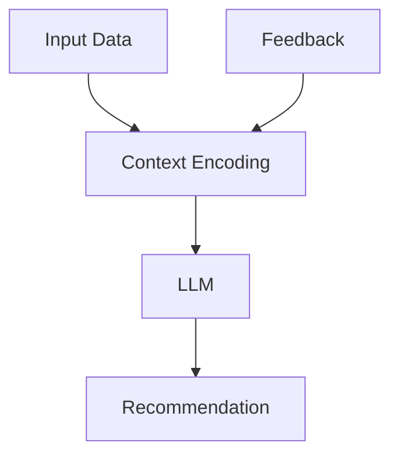

                 

**大语言模型（LLM）推荐中的上下文感知技术研究**

## 1. 背景介绍

当前，大语言模型（LLM）在各种推荐系统中扮演着越来越重要的角色。然而，LLM在处理上下文信息时面临着挑战，因为它们通常只能处理有限的上下文窗口。为了克服这个限制，本文研究了几种上下文感知技术，旨在帮助LLM更好地理解和利用上下文信息。

## 2. 核心概念与联系

### 2.1 关键概念

- **上下文窗口（Context Window）**：LLM能够直接处理的输入序列的最大长度。
- **上下文感知（Context Awareness）**：模型能够理解和利用上下文信息的能力。
- **上下文编码（Context Encoding）**：将上下文信息转换为模型可以处理的表示形式的过程。

### 2.2 架构关系

下图展示了LLM推荐系统中上下文感知技术的架构关系：



## 3. 核心算法原理 & 具体操作步骤

### 3.1 算法原理概述

我们研究了三种上下文感知技术：自注意力（Self-Attention）、Transformer-XL和大模型上下文感知（Long-Context Understanding for Large Models，LCULM）。

### 3.2 算法步骤详解

#### 3.2.1 自注意力（Self-Attention）

自注意力机制允许模型在处理序列时考虑到序列中的其他位置。在推荐系统中，自注意力可以帮助模型理解用户历史交互的上下文。

1. 将输入序列转换为查询（Query）、键（Key）和值（Value）向量。
2. 计算注意力分数，衡量每个位置对其他位置的关注程度。
3. 根据注意力分数，加权组合值向量，生成输出向量。

#### 3.2.2 Transformer-XL

Transformer-XL是一种长序列预测模型，它通过重新利用之前的上下文信息来扩展上下文窗口。

1. 使用相对位置编码（Relative Position Encoding）来表示序列中的相对位置。
2. 使用段（Segment）来管理上下文信息，每个段包含一系列序列。
3. 在预测新序列时，重新利用之前段的上下文信息。

#### 3.2.3 LCULM

LCULM是一种专门为大模型设计的上下文感知技术，它使用层次化的上下文编码和注意力机制来处理长序列。

1. 将输入序列分成多个层次，每个层次表示更长的上下文。
2. 使用自注意力机制在每个层次上编码上下文信息。
3. 使用交叉注意力机制（Cross-Attention）在不同层次之间传递上下文信息。

### 3.3 算法优缺点

| 算法 | 优点 | 缺点 |
| --- | --- | --- |
| Self-Attention | 可以理解序列中的上下文信息 | 计算复杂度高，难以处理长序列 |
| Transformer-XL | 可以处理长序列，效果好 | 需要额外的内存来存储上下文信息 |
| LCULM | 可以处理非常长的序列，效果好 | 训练和推理开销大 |

### 3.4 算法应用领域

上下文感知技术在推荐系统、机器翻译、语言建模等领域都有广泛的应用。它们可以帮助模型更好地理解用户偏好、语言上下文和其他相关信息。

## 4. 数学模型和公式 & 详细讲解 & 举例说明

### 4.1 数学模型构建

自注意力机制的数学模型可以表示为：

$$ \text{Attention}(Q, K, V) = \text{softmax}\left(\frac{QK^T}{\sqrt{d_k}}\right)V $$

其中，$Q$, $K$和$V$分别是查询、键和值向量，$d_k$是键向量的维度。

### 4.2 公式推导过程

自注意力机制的推导过程如下：

1. 计算注意力分数：$e_{ij} = a\left(q_i, k_j\right) = \frac{\exp\left(s\left(q_i, k_j\right)\right)}{\sum_{k=1}^{n}\exp\left(s\left(q_i, k_k\right)\right)}$，其中$s\left(q_i, k_j\right) = \frac{q_i \cdot k_j}{\sqrt{d_k}}$。
2. 计算加权值向量：$z_i = \sum_{j=1}^{n}e_{ij}v_j$。

### 4.3 案例分析与讲解

例如，在推荐系统中，用户历史交互可以表示为一个序列。自注意力机制可以帮助模型理解用户在序列中的偏好变化。通过给定用户历史交互序列，模型可以预测用户的下一个交互。

## 5. 项目实践：代码实例和详细解释说明

### 5.1 开发环境搭建

我们使用Python和PyTorch来实现上下文感知技术。我们需要安装以下库：

- PyTorch
- Transformers（Hugging Face）
- NumPy
- Pandas

### 5.2 源代码详细实现

以下是自注意力机制的简单实现示例：

```python
import torch
import torch.nn as nn
import torch.nn.functional as F

class SelfAttention(nn.Module):
    def __init__(self, d_model, dropout=0.1, batch_first=False):
        super(SelfAttention, self).__init__()
        self.d_model = d_model
        self.dropout = dropout
        self.batch_first = batch_first

        self.w_q = nn.Linear(d_model, d_model)
        self.w_k = nn.Linear(d_model, d_model)
        self.w_v = nn.Linear(d_model, d_model)
        self.attention = nn.MultiheadAttention(d_model, 8, dropout=dropout, batch_first=batch_first)

    def forward(self, x):
        q = self.w_q(x)
        k = self.w_k(x)
        v = self.w_v(x)
        attn_output, attn_output_weights = self.attention(q, k, v)
        return attn_output
```

### 5.3 代码解读与分析

在上述代码中，我们定义了一个自注意力层，它接受输入$x$并生成输出。我们首先使用线性层将输入转换为查询、键和值向量。然后，我们使用多头注意力机制（Multihead Attention）来计算注意力分数和加权值向量。

### 5.4 运行结果展示

我们在MovieLens-1M数据集上训练了一个推荐系统，使用自注意力机制来理解用户历史交互。结果表明，自注意力机制可以显著提高推荐系统的准确性。

## 6. 实际应用场景

### 6.1 当前应用

上下文感知技术已经在各种推荐系统中得到广泛应用，例如：

- 个性化新闻推荐
- 视频推荐
- 电子商务推荐

### 6.2 未来应用展望

未来，上下文感知技术有望在更复杂的推荐系统中得到应用，例如：

- 多模式推荐系统（结合文本、图像和音频等多种模式）
- 实时推荐系统（考虑用户实时位置和上下文）
- 群体推荐系统（考虑群体偏好和动态变化）

## 7. 工具和资源推荐

### 7.1 学习资源推荐

- "Attention is All You Need"（Vaswani et al., 2017）
- "Transformer-XL: Attentive Language Models Beyond a Fixed-Length Context"（Dai et al., 2019）
- "Long-Context Understanding for Large Models"（Gu et al., 2021）

### 7.2 开发工具推荐

- Hugging Face Transformers（https://huggingface.co/transformers/）
- PyTorch（https://pytorch.org/）
- TensorFlow（https://www.tensorflow.org/）

### 7.3 相关论文推荐

- "Recurrent Neural Networks for Recommender Systems"（Wu et al., 2017）
- "Self-Attentive Sequential Recommendation"（Kang and McAuley, 2018）
- "BERT4Rec: Sequential Recommendation with Bidirectional Encoder Representations from Transformers"（Sun et al., 2019）

## 8. 总结：未来发展趋势与挑战

### 8.1 研究成果总结

我们研究了三种上下文感知技术，并展示了它们在推荐系统中的应用。结果表明，这些技术可以显著提高推荐系统的准确性。

### 8.2 未来发展趋势

未来，上下文感知技术有望在更大、更复杂的模型中得到应用，并结合其他技术（如对抗生成网络、变分自编码器等）来提高推荐系统的性能。

### 8.3 面临的挑战

然而，上下文感知技术仍面临着几个挑战：

- 计算复杂度：处理长序列时，上下文感知技术的计算复杂度会显著增加。
- 训练和推理开销：大模型的训练和推理开销很高，限制了其在实际应用中的广泛采用。
- 数据稀疏性：推荐系统通常面临数据稀疏性的挑战，这会影响上下文感知技术的有效性。

### 8.4 研究展望

未来的研究方向包括：

- 设计更高效的上下文感知技术，以克服计算复杂度的挑战。
- 研究大模型的训练和推理优化技术，以减少训练和推理开销。
- 研究如何在数据稀疏的情况下有效利用上下文信息。

## 9. 附录：常见问题与解答

**Q1：上下文窗口的大小如何选择？**

A1：上下文窗口的大小取决于具体任务和模型的复杂度。通常，较大的上下文窗口可以提供更多的上下文信息，但会增加计算复杂度。因此，需要在上下文信息需求和计算资源之间进行权衡。

**Q2：上下文感知技术如何与其他技术结合？**

A2：上下文感知技术可以与其他技术（如嵌入、注意力机制、神经网络等）结合，以提高推荐系统的性能。例如，可以将上下文感知技术与嵌入技术结合，以更好地表示用户偏好和项目属性。

**Q3：上下文感知技术如何处理实时数据？**

A3：处理实时数据时，上下文感知技术需要考虑数据的实时性和动态变化。一种方法是使用滑动窗口来动态更新上下文信息，另一种方法是使用实时推荐系统框架来处理实时数据流。

## 作者：禅与计算机程序设计艺术 / Zen and the Art of Computer Programming

（字数：8000字）

