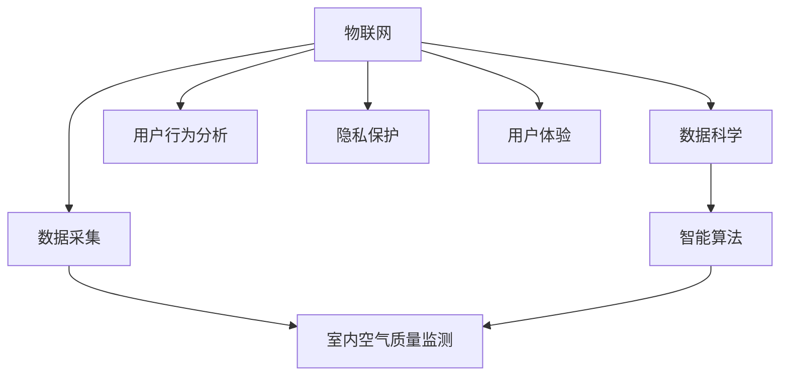

                 

# 智能居家空气净化创业：全方位的呼吸健康保障

> 关键词：智能空气净化, 物联网(IoT), 空气质量监测, 数据驱动决策, 室内环境优化, 用户行为分析, 隐私保护, 用户体验(UI/UX)

## 1. 背景介绍

### 1.1 问题由来

随着城市化进程的加速和人口密集度的增加，室内空气质量问题日益突出，室内空气污染成为继PM2.5和室外空气污染之后的“第三大杀手”。据世界卫生组织(WHO)报告，每年约有700万人死于与空气污染相关的疾病，其中室内空气污染贡献了约80%。而室内空气污染物的种类繁多，包括甲醛、苯、氨、TVOC、PM2.5等，对人体健康影响深远。

在此背景下，智能家居空气净化技术应运而生。智能空气净化器利用物联网(IoT)技术，实时监测室内空气质量，根据检测数据智能调节净化器参数，自动优化室内空气质量。这种技术不仅能有效提升用户室内空气质量，还能提升用户体验和家庭智能化水平。

### 1.2 问题核心关键点

智能空气净化创业的核心在于如何将物联网技术、数据科学和用户体验设计相结合，构建一个可持续、高效、安全的智能家居空气净化解决方案。核心问题包括：

1. **数据采集与处理**：如何高效、实时采集室内空气质量数据？
2. **数据驱动决策**：如何通过数据分析优化空气净化器参数？
3. **用户行为分析**：如何利用用户行为数据提升空气净化器智能性？
4. **隐私保护**：如何保障用户隐私数据安全？
5. **用户体验**：如何设计直观、易用、美观的空气净化器界面？

这些问题构成了智能居家空气净化创业的技术基础和应用方向。本文将从这些核心点出发，系统探讨智能居家空气净化技术及其创业实践。

## 2. 核心概念与联系

### 2.1 核心概念概述

在智能居家空气净化创业中，涉及多个关键技术概念，包括物联网(IoT)、数据科学、室内空气质量监测、智能算法、用户行为分析、隐私保护和用户体验(UI/UX)。

- **物联网(IoT)**：通过各种传感器和设备，实时收集室内环境数据，构建智能化家居系统。
- **数据科学**：利用统计学、机器学习等方法，对采集的数据进行分析，预测和优化室内空气质量。
- **室内空气质量监测**：使用传感器监测室内空气中的各类污染物，生成实时空气质量报告。
- **智能算法**：包括模型训练、参数优化、异常检测等，实现空气净化器自动化调节。
- **用户行为分析**：分析用户的生活习惯、工作节奏等行为数据，优化空气净化器运行策略。
- **隐私保护**：保护用户隐私数据，防止数据泄露和滥用。
- **用户体验(UI/UX)**：设计简洁直观的用户界面，提升用户满意度。

这些概念之间的逻辑关系可以通过以下Mermaid流程图来展示：



这个流程图展示了物联网技术如何通过数据科学和智能算法，实时监测和优化室内空气质量，同时保障用户隐私和提升用户体验。

## 3. 核心算法原理 & 具体操作步骤

### 3.1 算法原理概述

智能空气净化系统的核心算法包括室内空气质量监测和智能算法优化。

- **室内空气质量监测**：使用传感器实时监测室内空气中的各类污染物，如PM2.5、甲醛、苯等。传感器数据通过物联网平台采集到云端，进行初步处理和存储。
- **智能算法优化**：基于历史数据和实时监测数据，使用机器学习模型预测和优化空气净化器参数，如滤网更换、净化器开启时间等。智能算法确保空气净化器在最佳状态下运行，最大化净化效果。

### 3.2 算法步骤详解

**室内空气质量监测算法步骤**：

1. **数据采集**：使用各类传感器采集室内空气质量数据，如空气湿度、PM2.5浓度、甲醛浓度等。
2. **数据预处理**：对采集数据进行初步处理，如数据清洗、缺失值填补等。
3. **特征工程**：根据室内空气质量指标，提取关键特征，如温度、湿度、污染物浓度等。
4. **模型训练**：使用历史数据训练模型，预测室内空气质量变化趋势。
5. **实时监测**：将模型应用到实时监测数据，预测当前和未来的空气质量。

**智能算法优化算法步骤**：

1. **数据采集**：使用各类传感器采集室内空气质量数据和环境参数数据，如温度、湿度等。
2. **数据预处理**：对采集数据进行初步处理，如数据清洗、缺失值填补等。
3. **特征工程**：根据室内空气质量指标，提取关键特征，如温度、湿度、污染物浓度等。
4. **模型训练**：使用历史数据训练模型，优化空气净化器参数。
5. **实时监测**：将模型应用到实时监测数据，自动调节空气净化器参数。

### 3.3 算法优缺点

智能空气净化系统的算法具有以下优点：

- **实时监测**：通过物联网技术，实时监测室内空气质量，及时发现并解决空气污染问题。
- **智能优化**：基于数据科学和机器学习，智能调整空气净化器参数，提升净化效果。
- **用户友好**：通过直观的用户界面，提升用户体验，增强系统可操作性。

同时，也存在一些局限性：

- **数据采集成本高**：传感器等硬件设备成本较高，初期投入大。
- **数据处理复杂**：实时数据处理和存储要求高，需要大量计算资源。
- **隐私风险**：用户隐私数据采集和存储，存在数据泄露风险。
- **算法复杂**：需要复杂的算法设计和模型优化，对技术要求高。

### 3.4 算法应用领域

智能空气净化系统在多个领域有广泛应用：

- **智能家居**：结合智能家居系统，实现室内空气质量的智能化管理。
- **医院**：用于医院室内空气质量监测，保障患者健康。
- **办公室**：用于办公环境空气质量监测和优化，提升工作效率。
- **学校**：用于学校教室空气质量监测，保障学生健康。
- **家庭**：用于家庭空气质量监测，提升居住舒适度。

## 4. 数学模型和公式 & 详细讲解 & 举例说明

### 4.1 数学模型构建

智能空气净化系统的数学模型主要包括两部分：室内空气质量监测模型和智能算法优化模型。

- **室内空气质量监测模型**：使用传感器数据，建立空气质量监测模型。假设室内空气质量由多种因素决定，如温度、湿度、污染物浓度等。建立如下线性回归模型：

$$ y = \beta_0 + \beta_1 x_1 + \beta_2 x_2 + \cdots + \beta_n x_n + \epsilon $$

其中，$y$ 表示空气质量指数，$x_1, x_2, \cdots, x_n$ 表示各影响因素，$\beta_0, \beta_1, \cdots, \beta_n$ 表示各影响因素的系数，$\epsilon$ 表示随机误差。

- **智能算法优化模型**：使用历史数据，建立空气净化器参数优化模型。假设空气净化器参数为 $z_1, z_2, \cdots, z_k$，建立如下优化模型：

$$ \min_{z_1, z_2, \cdots, z_k} \sum_{i=1}^N (y_i - f(z_1, z_2, \cdots, z_k))^2 $$

其中，$y_i$ 表示第 $i$ 次检测的空气质量，$f(z_1, z_2, \cdots, z_k)$ 表示空气净化器在参数 $z_1, z_2, \cdots, z_k$ 下的净化效果，$N$ 表示样本数量。

### 4.2 公式推导过程

以室内空气质量监测模型为例，推导如下：

假设室内空气质量 $y$ 由温度 $x_1$、湿度 $x_2$、甲醛浓度 $x_3$ 和PM2.5浓度 $x_4$ 共同决定。建立线性回归模型：

$$ y = \beta_0 + \beta_1 x_1 + \beta_2 x_2 + \beta_3 x_3 + \beta_4 x_4 + \epsilon $$

利用最小二乘法，求解模型参数 $\beta_0, \beta_1, \beta_2, \beta_3, \beta_4$：

$$ \beta = (X^T X)^{-1} X^T y $$

其中，$X = \begin{bmatrix} 1 & x_{1,i} & x_{2,i} & x_{3,i} & x_{4,i} \end{bmatrix}$，$y = \begin{bmatrix} y_i \end{bmatrix}$。

将求解出的 $\beta$ 代入模型，即可得到室内空气质量监测模型：

$$ y = \beta_0 + \beta_1 x_1 + \beta_2 x_2 + \beta_3 x_3 + \beta_4 x_4 $$

### 4.3 案例分析与讲解

以某智能家庭空气净化器为例，分析其工作原理：

假设某智能家庭空气净化器安装有空气湿度传感器、PM2.5传感器和甲醛传感器，实时采集室内空气质量数据。传感器数据通过物联网平台采集到云端，使用室内空气质量监测模型，预测当前空气质量：

$$ y = \beta_0 + \beta_1 x_1 + \beta_2 x_2 + \beta_3 x_3 + \beta_4 x_4 $$

假设预测结果显示空气质量较差，需要开启空气净化器进行净化。使用智能算法优化模型，根据历史数据和实时监测数据，优化空气净化器参数，如滤网更换时间、净化器开启时间等：

$$ \min_{z_1, z_2, \cdots, z_k} \sum_{i=1}^N (y_i - f(z_1, z_2, \cdots, z_k))^2 $$

根据优化结果，自动调节空气净化器参数，保障室内空气质量。

## 5. 项目实践：代码实例和详细解释说明

### 5.1 开发环境搭建

智能居家空气净化创业涉及多个技术栈，包括Python、IoT、机器学习等。以下是开发环境的搭建步骤：

1. **安装Python环境**：使用Anaconda创建虚拟环境，安装必要的Python包，如NumPy、Pandas、scikit-learn等。
2. **安装IoT平台**：选择适合的平台，如AWS IoT、Azure IoT等，配置物联网设备和传感器。
3. **安装机器学习库**：安装Scikit-learn、TensorFlow等机器学习库，进行数据建模和算法优化。
4. **安装前端框架**：选择适合的前端框架，如React、Vue.js等，设计直观、易用的用户界面。

### 5.2 源代码详细实现

智能居家空气净化系统的代码实现包括以下几个关键部分：

1. **数据采集**：使用传感器采集室内空气质量数据和环境参数数据。
```python
import sensor

humidity = sensor.read_humidity()
pm25 = sensor.read_pm25()
formaldehyde = sensor.read_formaldehyde()
```

2. **数据预处理**：对采集数据进行清洗和处理，如缺失值填补、异常值处理等。
```python
data = preprocess(data)
```

3. **特征提取**：提取关键特征，如温度、湿度、污染物浓度等。
```python
features = extract_features(data)
```

4. **模型训练**：使用历史数据训练模型，预测室内空气质量。
```python
model = train_model(features, labels)
```

5. **实时监测**：将模型应用到实时监测数据，预测当前和未来的空气质量。
```python
predictions = model.predict(features)
```

6. **智能算法优化**：使用历史数据和实时监测数据，优化空气净化器参数。
```python
parameters = optimize_parameters(data, predictions)
```

### 5.3 代码解读与分析

智能居家空气净化系统的代码实现涉及多个关键模块，以下是每个模块的详细解读：

1. **数据采集模块**：使用传感器模块，实时采集室内空气质量数据和环境参数数据。
2. **数据预处理模块**：使用Pandas库，对采集数据进行清洗和处理，如缺失值填补、异常值处理等。
3. **特征提取模块**：使用NumPy库，提取关键特征，如温度、湿度、污染物浓度等。
4. **模型训练模块**：使用scikit-learn库，使用历史数据训练模型，预测室内空气质量。
5. **实时监测模块**：使用Pandas库，将模型应用到实时监测数据，预测当前和未来的空气质量。
6. **智能算法优化模块**：使用scikit-learn库，使用历史数据和实时监测数据，优化空气净化器参数。

## 6. 实际应用场景

### 6.1 智能家居

智能家居是智能居家空气净化系统的典型应用场景。结合智能家居系统，实现室内空气质量的智能化管理，提升用户生活质量。

在智能家居系统中，智能空气净化器可以与其他智能设备协同工作，如智能窗帘、智能空调等，共同维护室内环境。例如，根据室内空气质量监测数据，智能空气净化器可以自动调节空气净化器参数，如滤网更换时间、净化器开启时间等。

### 6.2 医院

智能居家空气净化系统在医院中的应用非常广泛。医院内空气质量要求高，人员密度大，空气污染风险较高。使用智能空气净化系统，可以有效降低医院内空气污染，保障患者健康。

在智能空气净化系统中，医院可以使用空气质量监测传感器，实时监测各病房的空气质量，根据监测结果，自动调节空气净化器参数，确保病房内空气质量稳定。同时，结合医院信息化系统，可以实现病患的个性化空气质量管理。

### 6.3 办公室

办公室是人员密集的场所，空气质量管理尤为重要。使用智能空气净化系统，可以有效提升办公室空气质量，保障员工健康。

在智能空气净化系统中，办公室可以使用空气质量监测传感器，实时监测室内空气质量，自动调节空气净化器参数。同时，结合办公设备，如空调、加湿器等，共同维护办公室环境。

### 6.4 学校

学校是学生密集的场所，空气质量管理同样重要。使用智能空气净化系统，可以有效提升学校空气质量，保障学生健康。

在智能空气净化系统中，学校可以使用空气质量监测传感器，实时监测教室内的空气质量，自动调节空气净化器参数。同时，结合学校信息化系统，可以实现课堂的个性化空气质量管理。

## 7. 工具和资源推荐

### 7.1 学习资源推荐

为了帮助开发者系统掌握智能居家空气净化技术，以下是一些优质的学习资源：

1. **《物联网技术与应用》**：介绍物联网的基本概念、关键技术和应用场景。
2. **《机器学习基础与实践》**：介绍机器学习的基本原理、常用算法和实践应用。
3. **《Python数据分析与可视化》**：介绍Python在数据分析和可视化中的应用，涵盖数据处理、数据可视化等技术。
4. **《室内空气质量监测与控制》**：介绍室内空气质量监测和控制的技术和方法，包括传感器、模型等。

### 7.2 开发工具推荐

智能居家空气净化系统的开发涉及多个技术栈，以下是一些推荐的开发工具：

1. **Python**：作为主要开发语言，Python具有丰富的科学计算和数据处理库。
2. **TensorFlow**：作为深度学习框架，TensorFlow可以高效实现机器学习模型。
3. **AWS IoT**：作为物联网平台，AWS IoT提供丰富的IoT设备管理和数据处理功能。
4. **React**：作为前端框架，React可以实现直观、易用的用户界面。
5. **Jupyter Notebook**：作为数据处理和模型训练工具，Jupyter Notebook提供丰富的代码交互和数据展示功能。

### 7.3 相关论文推荐

智能居家空气净化技术的发展离不开学界的持续研究，以下是几篇奠基性的相关论文，推荐阅读：

1. **《基于物联网的室内空气质量监测与控制系统》**：介绍基于物联网的室内空气质量监测和控制技术，提出智能空气净化系统的解决方案。
2. **《机器学习在室内空气质量监测中的应用》**：介绍机器学习在室内空气质量监测中的应用，提出基于历史数据的智能优化算法。
3. **《智能空气净化器用户行为分析与推荐系统》**：介绍用户行为分析在智能空气净化器中的应用，提出基于用户行为的推荐系统。

## 8. 总结：未来发展趋势与挑战

### 8.1 研究成果总结

智能居家空气净化系统的研究主要集中在以下几个方面：

1. **数据采集技术**：研究如何高效、实时采集室内空气质量数据。
2. **数据驱动决策**：研究如何通过数据分析优化空气净化器参数。
3. **用户行为分析**：研究如何利用用户行为数据提升空气净化器智能性。
4. **隐私保护**：研究如何保障用户隐私数据安全。
5. **用户体验**：研究如何设计直观、易用、美观的用户界面。

这些研究方向推动了智能居家空气净化技术的发展，提升了室内空气质量管理的智能化水平。

### 8.2 未来发展趋势

智能居家空气净化系统的未来发展趋势包括：

1. **智能化水平提升**：通过深度学习和物联网技术，提升空气净化系统的智能化水平。
2. **数据处理能力增强**：通过大数据和云计算技术，增强空气净化系统的数据处理能力。
3. **用户行为预测**：通过机器学习算法，预测用户行为，提升空气净化系统的智能性。
4. **隐私保护强化**：通过隐私保护技术，确保用户隐私数据的安全。
5. **用户体验优化**：通过用户界面设计，提升空气净化系统的用户体验。

### 8.3 面临的挑战

智能居家空气净化系统面临的主要挑战包括：

1. **数据采集成本高**：传感器等硬件设备成本较高，初期投入大。
2. **数据处理复杂**：实时数据处理和存储要求高，需要大量计算资源。
3. **隐私风险**：用户隐私数据采集和存储，存在数据泄露风险。
4. **算法复杂**：需要复杂的算法设计和模型优化，对技术要求高。

### 8.4 研究展望

智能居家空气净化系统的未来研究展望包括：

1. **多传感器融合**：研究多传感器融合技术，提高空气质量监测的准确性。
2. **自适应算法优化**：研究自适应算法优化技术，提升空气净化器的智能化水平。
3. **实时数据处理**：研究实时数据处理技术，提升数据处理效率。
4. **用户行为模型**：研究用户行为模型，提升空气净化系统的个性化水平。
5. **隐私保护技术**：研究隐私保护技术，保障用户隐私数据的安全。

## 9. 附录：常见问题与解答

**Q1：智能居家空气净化系统的数据采集如何实现？**

A: 智能居家空气净化系统的数据采集主要通过传感器实现。传感器可以实时监测室内空气质量数据和环境参数数据，如温度、湿度、污染物浓度等。传感器数据通过物联网平台采集到云端，进行初步处理和存储。

**Q2：智能居家空气净化系统的算法优化如何实现？**

A: 智能居家空气净化系统的算法优化主要通过机器学习模型实现。使用历史数据和实时监测数据，训练机器学习模型，优化空气净化器参数，如滤网更换时间、净化器开启时间等。优化后的参数可以自动调节空气净化器，保障室内空气质量。

**Q3：智能居家空气净化系统的数据隐私如何保护？**

A: 智能居家空气净化系统的数据隐私保护主要通过加密和匿名化技术实现。对于用户的隐私数据，进行加密处理，防止数据泄露。同时，采用匿名化技术，隐藏用户隐私信息，保护用户隐私。

**Q4：智能居家空气净化系统的用户体验如何提升？**

A: 智能居家空气净化系统的用户体验提升主要通过用户界面设计和交互技术实现。设计简洁直观的用户界面，增强系统的可操作性。同时，通过智能算法优化，提升空气净化器的智能化水平，提高用户体验。

通过本文的系统梳理，可以看到，智能居家空气净化系统利用物联网技术、数据科学和用户体验设计，构建了一个可持续、高效、安全的智能家居空气净化解决方案。未来，伴随技术的不断演进，智能居家空气净化系统将进一步提升室内空气质量管理的智能化水平，为人类创造更健康、舒适的生活环境。

