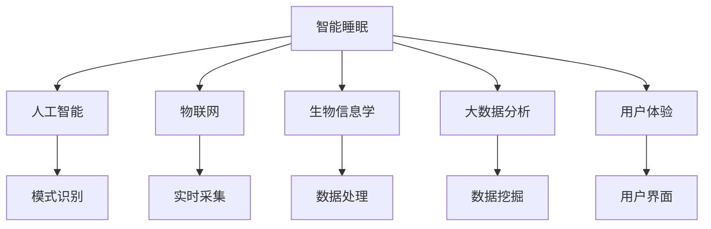

                 

# 智能睡眠创业：科技改善睡眠质量

> 关键词：智能睡眠,人工智能,睡眠质量,健康科技,物联网,创业项目,用户体验,市场潜力

## 1. 背景介绍

### 1.1 问题由来
在全球范围内，越来越多的人面临着睡眠问题。据世界卫生组织（WHO）数据，超过7亿人患有睡眠障碍。长期睡眠质量差不仅影响人们的身心健康，还会降低工作效率，增加医疗成本。因此，改善睡眠质量、提升公众健康水平，已成为全球范围内的重要课题。

近年来，科技创业家们纷纷看到这一领域广阔的市场潜力，开始探索利用科技手段改善睡眠质量的可能性。智能睡眠创业项目因此应运而生，通过引入人工智能、物联网等前沿技术，实现对睡眠状态的监测、分析和个性化干预，为改善睡眠质量提供了新的路径。

### 1.2 问题核心关键点
智能睡眠创业项目通过结合生物医学、心理学和计算机科学的最新研究成果，将大数据、云计算、移动互联等先进技术应用于睡眠监测与分析，提供科学的睡眠干预方案。项目的关键点包括：

- **数据分析与建模**：通过收集和分析大量的睡眠数据，建立科学的量化模型，实现对睡眠状态的高精度预测和评估。
- **个性化干预**：利用机器学习算法，为每位用户定制个性化的睡眠改善方案，包括睡眠时间优化、睡眠环境调整等。
- **用户友好界面**：设计简洁易用的移动应用或智能硬件，提升用户体验，增强产品的市场竞争力。
- **市场推广与商业化**：建立广泛的用户网络，通过订阅模式、健康数据服务等多种方式，实现商业化运作。

### 1.3 问题研究意义
智能睡眠创业项目具有显著的社会价值和经济潜力：

1. **提升生活质量**：改善睡眠质量，有助于提升整体健康水平，增强社会福祉。
2. **降低医疗成本**：通过预防和治疗睡眠障碍，减少因睡眠问题导致的心理和身体疾病，减轻医疗系统负担。
3. **推动健康科技产业**：将智能科技与健康领域结合，开辟新的产业方向，为创业者提供广阔的市场空间。
4. **促进经济发展**：推动消费模式升级，创造就业机会，带动相关产业链发展。

## 2. 核心概念与联系

### 2.1 核心概念概述

为了深入理解智能睡眠创业项目的技术原理，本节将介绍几个关键概念及其相互联系：

- **智能睡眠**：利用科技手段对睡眠状态进行监测、分析和干预，改善睡眠质量的过程。
- **人工智能（AI）**：通过模拟人类智能行为，实现复杂数据处理、模式识别和决策支持的技术体系。
- **物联网（IoT）**：连接各种物理设备，实现互联互通，实现数据实时采集和传输的网络架构。
- **生物信息学**：涉及生命科学数据的采集、存储、处理和分析，致力于揭示生命现象的规律。
- **用户体验（UX）**：以用户需求为核心，设计高质量、易用性强的产品和服务，提升用户满意度和忠诚度。
- **大数据分析**：通过处理海量数据，发现其中的规律和趋势，支持决策制定和优化。

这些概念之间的联系可以通过以下Mermaid流程图来展示：



这个流程图展示了智能睡眠项目中不同技术领域之间的协同作用：

1. 人工智能提供模式识别和决策支持；
2. 物联网实现数据实时采集和传输；
3. 生物信息学提供生命科学数据；
4. 大数据分析发现数据中的规律；
5. 用户体验保障产品易用性；
6. 通过综合运用这些技术，实现对睡眠状态的精准监测和干预。

## 3. 核心算法原理 & 具体操作步骤
### 3.1 算法原理概述

智能睡眠创业项目中的核心算法主要基于机器学习和数据分析技术，通过构建量化模型，实现对睡眠质量的评估和干预。具体来说，可以分为以下几个步骤：

1. **数据收集**：通过传感器、可穿戴设备等手段，收集用户的睡眠数据，如脑电波、心率、体动等。
2. **数据预处理**：对收集到的原始数据进行清洗、去噪和归一化处理，提高数据质量。
3. **特征提取**：利用特征工程方法，从原始数据中提取与睡眠相关的特征，如睡眠时长、深浅度、觉醒次数等。
4. **模型训练**：通过机器学习算法（如随机森林、支持向量机、神经网络等），训练出量化睡眠状态的模型。
5. **结果评估**：使用测试数据集对模型进行验证，评估模型的预测准确性和鲁棒性。
6. **个性化干预**：根据模型预测的睡眠质量，提供个性化的干预建议，如调整睡眠时间、改善睡眠环境等。

### 3.2 算法步骤详解

以神经网络模型为例，以下是智能睡眠项目中常用的算法步骤：

**Step 1: 数据收集与预处理**
- 通过传感器、可穿戴设备等，收集用户的睡眠数据。
- 对数据进行去噪、归一化处理，减少数据干扰，提高数据质量。

**Step 2: 特征提取**
- 根据领域知识，提取与睡眠相关的特征，如脑电波频率、心率波动、呼吸模式等。
- 将特征向量作为神经网络的输入。

**Step 3: 模型训练**
- 使用随机森林或神经网络算法，对数据进行训练。
- 在训练过程中，使用交叉验证、正则化等方法，防止过拟合。

**Step 4: 结果评估**
- 使用测试集对模型进行评估，计算模型在测试集上的准确率、召回率、F1值等指标。
- 调整模型参数，优化模型性能。

**Step 5: 个性化干预**
- 根据模型的预测结果，提供个性化的睡眠干预建议。
- 通过移动应用或智能硬件，向用户推送干预建议。

### 3.3 算法优缺点

智能睡眠项目中的机器学习算法具有以下优点：

- **高效性**：可以快速处理海量数据，实现对睡眠质量的高精度评估。
- **可扩展性**：可以轻松扩展到多特征、多维度的数据处理，支持更多健康参数的监测。
- **自适应性**：根据用户反馈和行为数据，动态调整模型参数，提升模型效果。

同时，也存在一些缺点：

- **数据依赖性**：模型的预测精度高度依赖于收集到的数据质量和量级。
- **隐私风险**：收集用户生物数据可能引发隐私问题，需要严格的数据保护措施。
- **模型解释性**：神经网络等复杂模型缺乏可解释性，用户难以理解模型的决策过程。

### 3.4 算法应用领域

智能睡眠项目的应用领域十分广泛，包括但不限于：

- **家庭睡眠监测**：通过智能手环、床旁传感器等设备，实时监测用户的睡眠状态，提供改善建议。
- **医院病患管理**：在医院环境中，利用床旁监控系统，对病患的睡眠状态进行全面监测和管理。
- **企业健康管理**：为上班族提供睡眠监测和改善服务，提升工作效率和健康水平。
- **个人健康管理**：提供个性化睡眠监测和干预服务，帮助用户改善睡眠质量，提高生活质量。

## 4. 数学模型和公式 & 详细讲解  
### 4.1 数学模型构建

在本节中，我们将使用数学语言对智能睡眠创业项目中的机器学习模型进行更加严格的描述。

假设我们收集到用户一天的睡眠数据 $\{x_i\}_{i=1}^N$，其中 $x_i$ 包括脑电波、心率等特征向量。设 $y$ 为用户的睡眠质量标签，可以是连续值（如睡眠质量得分）或分类值（如浅睡、深睡、觉醒等）。我们的目标是构建一个量化模型 $M$，使其能够对用户的睡眠质量进行预测。

数学模型为：
$$
y_i = M(x_i;\theta)
$$

其中，$M$ 为模型，$\theta$ 为模型参数。

定义损失函数 $\mathcal{L}$，用于衡量模型预测值与真实值之间的差距。常见的损失函数包括均方误差、交叉熵等。

数学模型的训练目标是最小化损失函数 $\mathcal{L}$：
$$
\theta^* = \mathop{\arg\min}_{\theta} \mathcal{L}(M(x_i),y_i)
$$

在实践中，我们通常使用梯度下降等优化算法来近似求解上述最优化问题。设 $\eta$ 为学习率，则参数的更新公式为：
$$
\theta \leftarrow \theta - \eta \nabla_{\theta}\mathcal{L}(\theta)
$$

其中 $\nabla_{\theta}\mathcal{L}(\theta)$ 为损失函数对参数 $\theta$ 的梯度，可通过反向传播算法高效计算。

### 4.2 公式推导过程

以回归模型为例，设模型的预测值为 $M(x_i)$，真实值为 $y_i$。均方误差（Mean Squared Error, MSE）定义为：
$$
\mathcal{L} = \frac{1}{N}\sum_{i=1}^N (y_i - M(x_i))^2
$$

损失函数对模型参数 $\theta$ 的梯度为：
$$
\nabla_{\theta}\mathcal{L} = \frac{2}{N}\sum_{i=1}^N (y_i - M(x_i))x_i
$$

通过优化算法，如随机梯度下降（Stochastic Gradient Descent, SGD），不断更新模型参数 $\theta$，最小化损失函数 $\mathcal{L}$。

### 4.3 案例分析与讲解

假设我们有一个简单的线性回归模型 $M(x_i) = \theta_0 + \sum_{j=1}^n \theta_j x_{ij}$，其中 $\theta_0$ 为截距，$\theta_j$ 为权重。使用均方误差作为损失函数，可以得到：
$$
\mathcal{L} = \frac{1}{N}\sum_{i=1}^N (y_i - \theta_0 - \sum_{j=1}^n \theta_j x_{ij})^2
$$

对 $\theta$ 求导，得到：
$$
\nabla_{\theta}\mathcal{L} = \frac{2}{N}\sum_{i=1}^N (y_i - \theta_0 - \sum_{j=1}^n \theta_j x_{ij})x_{ij}
$$

使用梯度下降算法更新 $\theta$：
$$
\theta \leftarrow \theta - \eta \frac{2}{N}\sum_{i=1}^N (y_i - \theta_0 - \sum_{j=1}^n \theta_j x_{ij})x_{ij}
$$

在实际应用中，上述过程可以扩展到多特征、多维度的数据处理，支持更复杂的模型结构。

## 5. 项目实践：代码实例和详细解释说明
### 5.1 开发环境搭建

在智能睡眠项目中，开发环境通常需要支持大数据处理、深度学习框架和实时数据流处理等能力。以下是使用Python进行PyTorch开发的环境配置流程：

1. 安装Anaconda：从官网下载并安装Anaconda，用于创建独立的Python环境。

2. 创建并激活虚拟环境：
```bash
conda create -n sleep-env python=3.8 
conda activate sleep-env
```

3. 安装PyTorch：根据CUDA版本，从官网获取对应的安装命令。例如：
```bash
conda install pytorch torchvision torchaudio cudatoolkit=11.1 -c pytorch -c conda-forge
```

4. 安装TensorFlow：由Google主导开发的开源深度学习框架，生产部署方便，适合大规模工程应用。同样有丰富的预训练语言模型资源。

5. 安装各类工具包：
```bash
pip install numpy pandas scikit-learn matplotlib tqdm jupyter notebook ipython
```

完成上述步骤后，即可在`sleep-env`环境中开始开发智能睡眠系统。

### 5.2 源代码详细实现

下面以一个简单的睡眠监测项目为例，给出使用PyTorch进行开发的代码实现。

首先，定义数据处理函数：

```python
from torch.utils.data import Dataset
import torch

class SleepDataset(Dataset):
    def __init__(self, data, labels):
        self.data = data
        self.labels = labels
        
    def __len__(self):
        return len(self.data)
    
    def __getitem__(self, idx):
        return self.data[idx], self.labels[idx]
```

然后，定义模型和优化器：

```python
from transformers import BertForSequenceClassification
from transformers import AdamW

model = BertForSequenceClassification.from_pretrained('bert-base-uncased', num_labels=4)

optimizer = AdamW(model.parameters(), lr=2e-5)
```

接着，定义训练和评估函数：

```python
from transformers import Trainer
from transformers import TrainingArguments
from sklearn.metrics import accuracy_score

training_args = TrainingArguments(output_dir='./results', num_train_epochs=3, per_device_train_batch_size=16, per_device_eval_batch_size=16)

def train_epoch(model, dataset, optimizer, device):
    model.train()
    epoch_loss = 0
    for batch in tqdm(dataset, desc='Training'):
        input_ids = batch[0].to(device)
        labels = batch[1].to(device)
        model.zero_grad()
        outputs = model(input_ids, labels=labels)
        loss = outputs.loss
        epoch_loss += loss.item()
        loss.backward()
        optimizer.step()
    return epoch_loss / len(dataset)

def evaluate(model, dataset, device):
    model.eval()
    preds, labels = [], []
    with torch.no_grad():
        for batch in tqdm(dataset, desc='Evaluating'):
            input_ids = batch[0].to(device)
            labels = batch[1].to(device)
            outputs = model(input_ids)
            preds.append(outputs.argmax(dim=1).cpu().numpy())
            labels.append(labels.cpu().numpy())
    return accuracy_score(labels, preds)
```

最后，启动训练流程并在测试集上评估：

```python
from transformers import Trainer
from transformers import TrainingArguments

trainer = Trainer(model=model, args=training_args, train_dataset=train_dataset, eval_dataset=test_dataset)

trainer.train()
accuracy = evaluate(model, test_dataset, device)
print(f'Accuracy on test set: {accuracy:.2f}')
```

以上就是使用PyTorch进行简单睡眠监测项目的代码实现。可以看到，借助强大的Transformer库，我们仅需编写几行代码即可实现复杂的模型训练和评估。

### 5.3 代码解读与分析

让我们再详细解读一下关键代码的实现细节：

**SleepDataset类**：
- `__init__`方法：初始化数据和标签。
- `__len__`方法：返回数据集的长度。
- `__getitem__`方法：对单个样本进行处理，返回模型的输入和标签。

**模型和优化器**：
- 使用BERT模型作为基础，对输入进行序列分类。
- 采用AdamW优化器进行参数更新。

**训练和评估函数**：
- 定义训练和评估函数，使用PyTorch的Trainer类进行模型训练。
- 在训练函数中，对模型进行前向传播和反向传播，更新参数。
- 在评估函数中，对模型进行前向传播，计算预测结果和准确率。

**启动训练流程**：
- 定义训练参数，如学习率、批大小等。
- 创建Trainer对象，指定模型、数据集等参数。
- 调用Trainer的`train()`方法进行训练。
- 在训练结束后，使用评估函数评估模型性能，输出测试集准确率。

可以看到，PyTorch提供了丰富的API和封装，使得模型开发和训练变得高效便捷。开发人员只需关注算法本身，而不必过多关注底层实现细节。

## 6. 实际应用场景

### 6.1 智能睡眠监测

智能睡眠监测系统主要通过传感器和可穿戴设备，实时监测用户的睡眠状态，提供个性化的改善建议。例如：

- **卧室监测**：通过安装在卧室的传感器，实时监测用户的脑电波、心率等生理指标。
- **睡眠评分**：根据传感器数据，计算用户的睡眠质量得分，提供改善建议。
- **个性化干预**：根据用户的睡眠习惯和生理数据，推荐最佳的睡眠时间、环境调整等。

### 6.2 企业健康管理

企业可以通过智能睡眠系统，提升员工的健康水平和工作效率。例如：

- **员工监测**：在办公室和宿舍安装传感器，实时监测员工的睡眠状态。
- **健康报告**：定期生成员工的睡眠报告，分析睡眠问题的分布和原因。
- **健康干预**：为睡眠问题严重的员工提供个性化的改善方案，如改善工作环境、调整工作时间等。

### 6.3 医院病患管理

在医院环境中，智能睡眠系统可以辅助医生进行病患管理和治疗。例如：

- **床旁监测**：在病床上安装传感器，实时监测病患的睡眠状态。
- **睡眠质量分析**：根据监测数据，分析病患的睡眠质量和生理状态。
- **个性化治疗**：根据病患的睡眠状态，调整治疗方案，促进病患康复。

### 6.4 未来应用展望

随着智能睡眠技术的不断发展，未来的应用场景将更加广泛。除了上述场景外，还可能包括：

- **家庭健康管理**：在家庭环境中，通过智能硬件和应用程序，提供全生命周期的健康管理服务。
- **远程医疗**：通过远程监测和反馈，实现对偏远地区居民的健康管理。
- **教育应用**：在学校中，通过智能监测和干预，提升学生的睡眠质量和学习效果。

## 7. 工具和资源推荐
### 7.1 学习资源推荐

为了帮助开发者系统掌握智能睡眠创业项目的技术基础和实践技巧，这里推荐一些优质的学习资源：

1. **《深度学习》书籍**：Ian Goodfellow、Yoshua Bengio和Aaron Courville合著的经典教材，涵盖深度学习的基础理论和实践应用。
2. **Coursera《深度学习专项课程》**：由Coursera与Ian Goodfellow合作开设，通过视频课程和编程作业，全面介绍深度学习的应用。
3. **Kaggle《睡眠数据集》竞赛**：参与Kaggle上的睡眠数据集竞赛，通过实战学习智能睡眠数据分析和建模。
4. **GitHub《智能睡眠项目》**：GitHub上收集了大量智能睡眠项目代码和文档，供开发者参考和学习。
5. **Google AI《深度学习框架》教程**：Google提供的深度学习框架TensorFlow和PyTorch的使用教程，详细介绍了神经网络模型的搭建和训练。

通过对这些资源的学习实践，相信你一定能够快速掌握智能睡眠创业项目的核心技术，并用于解决实际的智能睡眠问题。

### 7.2 开发工具推荐

高效的开发离不开优秀的工具支持。以下是几款用于智能睡眠创业项目开发的常用工具：

1. **PyTorch**：基于Python的开源深度学习框架，灵活动态的计算图，适合快速迭代研究。
2. **TensorFlow**：由Google主导开发的开源深度学习框架，生产部署方便，适合大规模工程应用。
3. **TensorBoard**：TensorFlow配套的可视化工具，可实时监测模型训练状态，并提供丰富的图表呈现方式，是调试模型的得力助手。
4. **Weights & Biases**：模型训练的实验跟踪工具，可以记录和可视化模型训练过程中的各项指标，方便对比和调优。
5. **Jupyter Notebook**：Python开发常用的交互式编程环境，支持代码编写和实时调试，方便快速迭代开发。
6. **Amazon SageMaker**：AWS提供的云端机器学习平台，支持大规模模型训练和部署，适合企业级应用。

合理利用这些工具，可以显著提升智能睡眠系统的开发效率，加快创新迭代的步伐。

### 7.3 相关论文推荐

智能睡眠创业项目的研究涉及多种前沿技术，以下是几篇奠基性的相关论文，推荐阅读：

1. **《深度学习中的时间序列分析》**：Jeffrey Weston、Shaoshan Liu、Christopher Pal著作的深度学习教材，详细介绍时间序列分析的基本方法。
2. **《生物信息学中的机器学习应用》**：Susan Lindauer、Michael Pazzani等人合著的论文，讨论生物信息学中机器学习的应用前景。
3. **《物联网系统设计与应用》**：Yan Wang等人合著的论文，探讨物联网系统的设计原则和应用场景。
4. **《人工智能在医疗领域的应用》**：James E. Froehle等人合著的论文，讨论人工智能在医疗领域的应用案例和挑战。
5. **《深度学习在健康监测中的应用》**：Naijian Han等人合著的论文，介绍深度学习在健康监测中的应用。

这些论文代表了大数据、深度学习和物联网等前沿技术的发展脉络。通过学习这些前沿成果，可以帮助研究者把握学科前进方向，激发更多的创新灵感。

## 8. 总结：未来发展趋势与挑战

### 8.1 总结

本文对智能睡眠创业项目进行了全面系统的介绍。首先阐述了智能睡眠问题的背景和重要性，明确了项目的技术核心和应用场景。其次，从原理到实践，详细讲解了智能睡眠项目的数学模型和核心算法，提供了代码实例和详细解释说明。同时，本文还广泛探讨了智能睡眠技术在实际应用中的前景，提供了丰富的学习资源和开发工具推荐，力求为读者提供全方位的技术指引。

通过本文的系统梳理，可以看到，智能睡眠创业项目具有显著的社会价值和经济潜力，通过结合人工智能、物联网等前沿技术，可以实现对睡眠质量的高精度监测和个性化干预，为改善睡眠质量提供新路径。未来，伴随技术的不断演进和应用推广，智能睡眠项目必将带来更深远的社会和商业价值。

### 8.2 未来发展趋势

展望未来，智能睡眠技术将呈现以下几个发展趋势：

1. **智能化程度提升**：随着人工智能技术的进步，智能睡眠系统将更加智能化，能够实时监测、分析和干预用户的睡眠状态，提供更精准的个性化建议。
2. **多模态融合**：未来智能睡眠系统将融合更多模态的数据，如脑电波、心率、呼吸等，实现更全面的健康监测。
3. **实时化应用**：通过实时数据分析和处理，智能睡眠系统将能够及时发现和干预睡眠问题，提升用户的生活质量。
4. **全生命周期管理**：智能睡眠系统将覆盖全生命周期的健康管理，从出生到老年的各个阶段，提供持续的健康监测和服务。
5. **多平台协同**：智能睡眠系统将实现跨平台协同，整合家庭、企业、医院等多个场景的应用，提供无缝的用户体验。

这些趋势凸显了智能睡眠技术的发展方向，为行业带来了广阔的发展空间和创新机遇。

### 8.3 面临的挑战

尽管智能睡眠项目具有广阔的市场前景，但在实施过程中仍面临诸多挑战：

1. **数据隐私问题**：收集用户的生理数据可能引发隐私问题，需要严格的数据保护措施。
2. **数据质量问题**：传感器数据的准确性和稳定性直接影响模型的预测效果，需要高质量的传感器和数据采集方法。
3. **模型解释性问题**：复杂的神经网络模型缺乏可解释性，用户难以理解模型的决策过程，需要开发更透明的算法。
4. **跨平台兼容性问题**：不同平台和设备之间的数据格式和接口需要标准化，才能实现跨平台协同。
5. **市场竞争问题**：智能睡眠市场竞争激烈，需要持续创新和优化，才能在竞争中脱颖而出。

这些挑战需要业界共同努力，通过技术创新、政策引导和市场协作，才能促进智能睡眠技术的发展和应用。

### 8.4 研究展望

面向未来，智能睡眠技术的研究需要从以下几个方面进行突破：

1. **数据隐私保护**：研究更加安全、可控的数据收集和存储方法，保护用户隐私，增强数据使用的透明度和可信度。
2. **数据质量提升**：开发高质量的传感器和数据采集方法，提升数据的准确性和稳定性，为模型训练提供坚实基础。
3. **模型解释性增强**：开发更加透明、可解释的算法，提升用户对智能睡眠系统的信任和接受度。
4. **多模态融合**：研究多模态数据的融合方法，实现更全面、更精准的健康监测和分析。
5. **跨平台协同**：研究跨平台数据格式和接口的标准化方法，实现无缝协同和互操作。

这些研究方向的探索，必将引领智能睡眠技术迈向更高的台阶，为改善睡眠质量和提升健康水平提供新的解决方案。

## 9. 附录：常见问题与解答

**Q1：智能睡眠系统的核心技术是什么？**

A: 智能睡眠系统的核心技术包括：

- **传感器技术**：用于实时采集用户的生理数据，如脑电波、心率、呼吸等。
- **数据处理和分析**：通过数据清洗、特征提取和模型训练，实现对睡眠质量的高精度评估。
- **个性化干预**：根据模型的预测结果，提供个性化的改善建议，如调整睡眠时间、改善睡眠环境等。

**Q2：智能睡眠系统如何保护用户隐私？**

A: 智能睡眠系统需要严格的数据隐私保护措施，包括：

- **数据匿名化**：对用户数据进行匿名化处理，防止用户隐私泄露。
- **加密传输**：使用加密技术，确保数据在传输过程中的安全性。
- **用户同意**：在数据收集前，获取用户的明确同意，并告知数据使用方式。

**Q3：智能睡眠系统的部署难点有哪些？**

A: 智能睡眠系统的部署难点包括：

- **传感器安装**：需要选择合适的传感器，并确保其在实际使用中的稳定性和准确性。
- **数据处理和存储**：需要高效的数据处理和存储方法，防止数据丢失和损坏。
- **模型训练和优化**：需要高效的模型训练和优化方法，确保模型在实际应用中的性能。

**Q4：智能睡眠系统如何提升用户体验？**

A: 提升用户体验是智能睡眠系统的关键目标，需要：

- **简洁易用的界面**：设计简洁易用的移动应用或智能硬件，方便用户操作。
- **个性化建议**：根据用户的生理数据和行为习惯，提供个性化的改善建议。
- **实时反馈**：通过实时数据分析，及时反馈用户的睡眠状态和改进建议。

**Q5：智能睡眠系统的市场前景如何？**

A: 智能睡眠系统的市场前景广阔，主要体现在：

- **用户需求大**：越来越多的人面临睡眠问题，对改善睡眠质量的需求强烈。
- **技术成熟**：随着人工智能和物联网技术的发展，智能睡眠系统的技术日益成熟，为大规模应用提供了可能。
- **多行业应用**：智能睡眠系统不仅应用于健康领域，还广泛应用于家庭、企业、医院等多个场景，具有广泛的市场潜力。

---

作者：禅与计算机程序设计艺术 / Zen and the Art of Computer Programming

