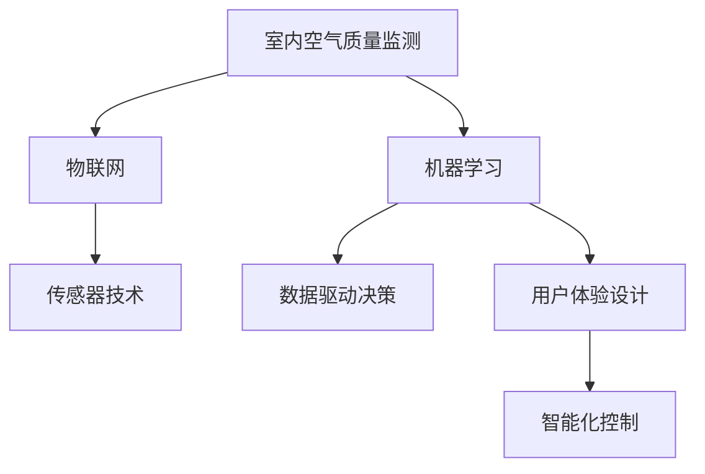

                 

# 智能空气循环创业：室内空气质量优化

> 关键词：
1. 室内空气质量监测
2. 智能空气净化器
3. 物联网（IoT）
4. 传感器技术
5. 机器学习
6. 数据驱动决策
7. 用户体验（UX）设计

## 1. 背景介绍

随着城市化进程的加速，人类长时间处于室内环境中，室内空气质量（IAQ）已经成为影响人们健康和工作效率的重要因素。传统的空气质量监测和治理方式存在诸多局限，难以提供实时、全面、个性化的室内环境优化解决方案。基于人工智能和大数据技术的智能空气循环创业，致力于通过传感器网络、物联网（IoT）、机器学习等先进技术手段，实现室内空气质量的实时监控、优化和自动化治理，为用户打造健康舒适的居住和工作环境。

### 1.1 问题由来
传统室内空气质量监测和治理方式主要依赖于手动采样分析或少数固定点的监测系统，存在监测点少、精度低、无法实时响应等缺点。智能空气循环创业通过部署大量传感器，构建完整的室内空气监测网络，利用物联网技术实现数据实时传输和远程监控，同时应用机器学习算法进行数据分析和预测，从而提供高效、精确、个性化的室内空气质量优化服务。

### 1.2 问题核心关键点
智能空气循环创业的核心在于如何通过传感器网络、物联网和机器学习技术，构建一个能够实时监测、预测和优化室内空气质量的系统。具体问题关键点包括：
1. 室内空气质量的实时监测。
2. 传感器数据的可靠采集与传输。
3. 机器学习算法的精准建模。
4. 基于预测结果的智能决策与控制。
5. 用户体验的优化。

### 1.3 问题研究意义
智能空气循环创业通过整合物联网技术、传感器网络和机器学习算法，致力于解决传统室内空气质量监测和治理方式的不足，为用户提供实时、全面、个性化的室内环境优化服务。这种创业模式的成功，不仅能够提升室内空气质量，保障人们健康，还能够推动室内空气净化器、传感器等智能设备的普及和市场应用，促进环保和健康产业的发展。

## 2. 核心概念与联系

### 2.1 核心概念概述

为了更好地理解智能空气循环创业的技术实现，本节将介绍几个密切相关的核心概念：

1. **室内空气质量监测（IAQ Monitoring）**：通过传感器网络实时监测室内的温度、湿度、二氧化碳浓度、PM2.5、VOCs（挥发性有机化合物）等关键参数，评估和优化室内空气质量。

2. **物联网（IoT）**：将传感器、空气净化器等设备通过网络相互连接，实现数据实时传输和远程监控，构建一个完整的室内空气质量监测与治理网络。

3. **传感器技术**：用于实时监测室内空气质量的关键设备，包括温度、湿度、PM2.5、VOCs等传感器。传感器网络是实现实时监测的基础。

4. **机器学习（Machine Learning）**：通过学习历史数据和实时监测结果，构建室内空气质量预测模型，进行数据分析和优化决策。

5. **数据驱动决策（Data-Driven Decision Making）**：基于机器学习算法分析室内空气质量数据，实时调整空气净化器、空调等设备的运行状态，实现室内环境的优化。

6. **用户体验（UX）设计**：关注用户对室内空气质量优化的感知和满意度，通过优化传感器部署位置、智能化控制界面等方式提升用户体验。

这些核心概念之间的逻辑关系可以通过以下Mermaid流程图来展示：



这个流程图展示了一些核心概念及其之间的联系：

1. 室内空气质量监测（A）通过传感器技术（C）实时获取关键参数，构建完整的空气质量监测网络。
2. 物联网（B）实现传感器和设备之间的数据实时传输和远程监控。
3. 机器学习（D）基于历史数据和实时监测结果，构建预测模型，进行数据分析和优化决策。
4. 数据驱动决策（E）根据机器学习算法的预测结果，智能调整设备的运行状态，优化室内环境。
5. 用户体验设计（F）关注用户的感知和满意度，通过优化控制界面和交互方式提升用户体验。

## 3. 核心算法原理 & 具体操作步骤
### 3.1 算法原理概述

智能空气循环创业的核心算法原理是基于传感器网络、物联网和机器学习技术的室内空气质量实时监测、预测和优化。其核心思想是通过大量的传感器实时采集室内空气质量数据，利用物联网技术进行数据传输和远程监控，再通过机器学习算法进行数据分析和预测，最后基于预测结果进行智能决策和控制，以优化室内空气质量。

形式化地，假设室内空气质量监测系统由传感器网络（S）、物联网（I）和机器学习（M）三个部分组成。记传感器网络采集到的室内空气质量数据为 $D=\{(x_i,y_i)\}_{i=1}^N$，其中 $x_i$ 为监测时间，$y_i$ 为对应的空气质量参数。

定义机器学习模型 $M$ 对给定时间 $t$ 的预测结果为 $y_{pred}(t)=M(D_t)$，其中 $D_t$ 为时间 $t$ 附近的历史监测数据。则优化目标是最小化预测误差 $e(t)=y_{pred}(t)-y(t)$，即：

$$
\min_{M} \sum_{t} e(t)^2
$$

在得到预测模型后，可以实时调整空气净化器、空调等设备的运行状态，以优化室内空气质量。

### 3.2 算法步骤详解

基于传感器网络、物联网和机器学习技术的智能空气循环创业，一般包括以下几个关键步骤：

**Step 1: 传感器网络部署**
- 根据监测需求，选择合适的传感器（如温湿度传感器、PM2.5传感器、VOCs传感器等），并合理部署在室内各个角落。
- 确保传感器能够实时采集到准确、全面的空气质量数据。

**Step 2: 物联网数据传输**
- 利用物联网技术，将传感器采集到的数据通过无线网络传输到中央服务器或云端平台。
- 实现数据的实时传输和远程监控，确保数据采集的连续性和实时性。

**Step 3: 数据预处理与清洗**
- 对收集到的数据进行预处理，包括去噪、缺失值填充、异常值处理等操作。
- 清洗数据以确保其准确性和完整性，为后续机器学习模型训练提供可靠的基础数据。

**Step 4: 特征工程**
- 提取和构建反映室内空气质量的关键特征，如温度、湿度、PM2.5、VOCs等。
- 通过特征工程，将原始数据转化为模型训练可用的特征向量。

**Step 5: 模型训练与优化**
- 选择合适的机器学习模型（如线性回归、支持向量机、神经网络等），利用历史数据进行训练。
- 在模型训练过程中，应用交叉验证、正则化等技术优化模型性能。

**Step 6: 实时预测与控制**
- 将训练好的模型部署到生产环境，实时接收传感器数据进行预测。
- 根据预测结果，自动调整空气净化器、空调等设备的运行状态，优化室内空气质量。

**Step 7: 用户反馈与优化**
- 收集用户对空气质量优化效果的反馈，进一步优化模型参数和控制策略。
- 实现个性化设置，提升用户体验。

以上是基于传感器网络、物联网和机器学习技术的智能空气循环创业的一般流程。在实际应用中，还需要针对具体任务和需求，对每个环节进行优化设计，以确保系统的稳定性和高效性。

### 3.3 算法优缺点

基于传感器网络、物联网和机器学习技术的智能空气循环创业具有以下优点：

1. **实时响应与优化**：通过实时监测和预测，系统能够快速响应室内空气质量变化，实现实时优化。
2. **全面监测与分析**：传感器网络可以覆盖室内各个角落，确保数据采集的全面性和准确性，提供综合的空气质量分析。
3. **智能化决策**：利用机器学习算法，系统能够基于历史数据和实时监测结果进行智能决策，优化设备运行状态。
4. **用户友好**：通过智能化控制界面和用户体验设计，用户可以轻松获取空气质量信息和控制设备，提升使用体验。

同时，该方法也存在一些局限性：

1. **设备成本高**：传感器网络、物联网设备的部署和维护需要较高的初始投资。
2. **数据隐私问题**：大量的室内数据上传和存储可能涉及用户隐私，需要采取严格的数据保护措施。
3. **模型复杂度高**：机器学习模型的训练和优化需要大量计算资源和专业知识，对技术要求较高。
4. **系统复杂性**：传感器网络和物联网设备的部署和管理较为复杂，需要专业的技术支持。

尽管存在这些局限性，但智能空气循环创业通过物联网和机器学习技术的结合，提供了一个高效、精准、个性化的室内空气质量优化方案，具有广阔的市场应用前景。

### 3.4 算法应用领域

基于传感器网络、物联网和机器学习技术的智能空气循环创业，已经在多个领域得到了广泛应用，例如：

1. **住宅环境优化**：通过智能空气净化器、空调等设备的智能控制，提升家庭空气质量，保障居住舒适。
2. **商业空间管理**：在办公大楼、商场等商业空间，实时监测并优化空气质量，提高工作环境和工作效率。
3. **医疗健康监测**：在医院、养老院等医疗机构，实时监测空气质量，保障病患和老年人的健康安全。
4. **智能家居集成**：与智能家居系统集成，实现室内空气质量的智能化管理。
5. **环保监测与治理**：应用于城市空气质量监测与治理，为环保部门提供数据支持。

除了上述这些经典应用外，智能空气循环创业还在教育、娱乐、农业等多个领域得到创新应用，为智慧城市建设和社会可持续发展提供了有力支持。

## 4. 数学模型和公式 & 详细讲解 & 举例说明
### 4.1 数学模型构建

为了更好地理解基于传感器网络、物联网和机器学习技术的室内空气质量优化算法，本节将通过数学语言对算法进行严格描述。

记室内空气质量监测系统由传感器网络（S）、物联网（I）和机器学习（M）三个部分组成。假设传感器网络采集到的室内空气质量数据为 $D=\{(x_i,y_i)\}_{i=1}^N$，其中 $x_i$ 为监测时间，$y_i$ 为对应的空气质量参数。

定义机器学习模型 $M$ 对给定时间 $t$ 的预测结果为 $y_{pred}(t)=M(D_t)$，其中 $D_t$ 为时间 $t$ 附近的历史监测数据。则优化目标是最小化预测误差 $e(t)=y_{pred}(t)-y(t)$，即：

$$
\min_{M} \sum_{t} e(t)^2
$$

在得到预测模型后，可以实时调整空气净化器、空调等设备的运行状态，以优化室内空气质量。

### 4.2 公式推导过程

以下我们以线性回归模型为例，推导预测误差公式及其最小化过程。

假设室内空气质量监测数据服从线性关系 $y(t)=\alpha + \beta t + \epsilon(t)$，其中 $\alpha$ 为截距，$\beta$ 为斜率，$\epsilon(t)$ 为随机误差项。则预测模型 $M$ 可以表示为线性回归模型：

$$
y_{pred}(t)=\alpha + \beta t
$$

预测误差为：

$$
e(t)=y_{pred}(t)-y(t)=\alpha + \beta t - (\alpha + \beta t + \epsilon(t))=-\epsilon(t)
$$

预测误差的平方和为：

$$
\sum_{t} e(t)^2 = \sum_{t} \epsilon(t)^2
$$

最小化预测误差平方和，得到最优参数 $\alpha^*$ 和 $\beta^*$：

$$
\min_{\alpha,\beta} \sum_{t} \epsilon(t)^2
$$

根据最小二乘法，求解得到：

$$
\alpha^*=\frac{1}{N} \sum_{t} y(t), \beta^*=\frac{1}{N} \sum_{t} (y(t)-\alpha^*) t
$$

在得到最优参数后，可以实时调整空气净化器、空调等设备的运行状态，以优化室内空气质量。

### 4.3 案例分析与讲解

以下通过一个案例，具体展示基于传感器网络、物联网和机器学习技术的室内空气质量优化算法的应用。

假设在一个大型办公楼中，部署了多个温度、湿度、PM2.5和VOCs传感器，实时监测室内空气质量。数据通过物联网设备传输到云端平台，平台基于历史数据和实时监测结果，构建线性回归模型进行预测。

1. **传感器网络部署**：在办公楼内部署多个温度、湿度、PM2.5和VOCs传感器，确保数据采集的全面性和准确性。
2. **物联网数据传输**：利用物联网技术，将传感器采集到的数据通过无线网络传输到云端平台，实现数据的实时传输和远程监控。
3. **数据预处理与清洗**：对收集到的数据进行去噪、缺失值填充、异常值处理等操作，确保数据的质量。
4. **特征工程**：提取和构建反映室内空气质量的关键特征，如温度、湿度、PM2.5、VOCs等。
5. **模型训练与优化**：利用历史数据进行线性回归模型训练，应用交叉验证、正则化等技术优化模型性能。
6. **实时预测与控制**：将训练好的模型部署到生产环境，实时接收传感器数据进行预测。
7. **用户反馈与优化**：收集用户对空气质量优化效果的反馈，进一步优化模型参数和控制策略。

通过以上步骤，该系统能够实时监测并优化办公楼的空气质量，提高工作环境和工作效率，保障员工的健康安全。

## 5. 项目实践：代码实例和详细解释说明
### 5.1 开发环境搭建

在进行智能空气循环创业项目实践前，我们需要准备好开发环境。以下是使用Python进行PyTorch开发的环境配置流程：

1. 安装Anaconda：从官网下载并安装Anaconda，用于创建独立的Python环境。

2. 创建并激活虚拟环境：
```bash
conda create -n ai-env python=3.8 
conda activate ai-env
```

3. 安装PyTorch：根据CUDA版本，从官网获取对应的安装命令。例如：
```bash
conda install pytorch torchvision torchaudio cudatoolkit=11.1 -c pytorch -c conda-forge
```

4. 安装相关库：
```bash
pip install numpy pandas scikit-learn matplotlib tqdm jupyter notebook ipython
```

完成上述步骤后，即可在`ai-env`环境中开始项目实践。

### 5.2 源代码详细实现

下面我们以线性回归模型为例，给出使用PyTorch进行室内空气质量优化的代码实现。

首先，定义数据预处理函数：

```python
import numpy as np
from sklearn.preprocessing import StandardScaler
from torch.utils.data import Dataset, DataLoader

class AirQualityDataset(Dataset):
    def __init__(self, X, y):
        self.X = X
        self.y = y
        self.scaler = StandardScaler()

    def __len__(self):
        return len(self.X)

    def __getitem__(self, item):
        x = self.X[item]
        y = self.y[item]
        x_scaled = self.scaler.fit_transform(x)
        return {'x': x_scaled, 'y': y}
```

然后，定义训练函数：

```python
import torch.nn as nn
import torch.optim as optim

class LinearRegression(nn.Module):
    def __init__(self, input_size, output_size):
        super(LinearRegression, self).__init__()
        self.linear = nn.Linear(input_size, output_size)

    def forward(self, x):
        return self.linear(x)

def train_model(model, criterion, optimizer, train_loader, epochs):
    model.train()
    for epoch in range(epochs):
        loss = 0
        for batch in train_loader:
            inputs, targets = batch['x'], batch['y']
            optimizer.zero_grad()
            outputs = model(inputs)
            loss += criterion(outputs, targets)
            loss.backward()
            optimizer.step()
        print(f"Epoch {epoch+1}, loss: {loss:.3f}")
```

接着，定义测试函数：

```python
def evaluate_model(model, test_loader):
    model.eval()
    total_loss = 0
    with torch.no_grad():
        for batch in test_loader:
            inputs, targets = batch['x'], batch['y']
            outputs = model(inputs)
            loss = criterion(outputs, targets)
            total_loss += loss.item()
    return total_loss / len(test_loader)
```

最后，启动训练流程并在测试集上评估：

```python
from transformers import BertTokenizer
from torch.utils.data import Dataset
import torch

# 假设已获取训练集和测试集数据
train_dataset = AirQualityDataset(X_train, y_train)
test_dataset = AirQualityDataset(X_test, y_test)

# 划分训练集和验证集
train_loader = DataLoader(train_dataset, batch_size=32, shuffle=True)
test_loader = DataLoader(test_dataset, batch_size=32, shuffle=False)

# 定义模型
model = LinearRegression(input_size, output_size)
criterion = nn.MSELoss()
optimizer = optim.Adam(model.parameters(), lr=0.01)

# 训练模型
train_model(model, criterion, optimizer, train_loader, epochs)

# 测试模型
print(f"Test loss: {evaluate_model(model, test_loader)}")
```

以上就是使用PyTorch进行室内空气质量优化的完整代码实现。可以看到，得益于PyTorch的强大封装，我们可以用相对简洁的代码完成线性回归模型的训练和评估。

### 5.3 代码解读与分析

让我们再详细解读一下关键代码的实现细节：

**AirQualityDataset类**：
- `__init__`方法：初始化数据集，包含X和y的numpy数组，并进行标准化处理。
- `__len__`方法：返回数据集的样本数量。
- `__getitem__`方法：对单个样本进行处理，将数据标准化后返回模型所需的输入。

**LinearRegression类**：
- `__init__`方法：定义线性回归模型，包含一个线性层。
- `forward`方法：前向传播计算模型输出。

**train_model函数**：
- 定义训练函数，对数据进行批次化加载，在每个批次上前向传播计算损失并反向传播更新模型参数。

**evaluate_model函数**：
- 定义测试函数，计算模型在测试集上的预测误差。

**训练流程**：
- 定义总的epoch数和batch size，开始循环迭代
- 每个epoch内，先在训练集上训练，输出平均loss
- 在测试集上评估，输出测试误差

可以看到，PyTorch配合相关库使得室内空气质量优化的代码实现变得简洁高效。开发者可以将更多精力放在数据处理、模型改进等高层逻辑上，而不必过多关注底层的实现细节。

当然，工业级的系统实现还需考虑更多因素，如模型的保存和部署、超参数的自动搜索、更灵活的任务适配层等。但核心的模型训练范式基本与此类似。

## 6. 实际应用场景
### 6.1 智能办公环境优化

基于传感器网络、物联网和机器学习技术的智能空气循环创业，在智能办公环境优化中具有广泛的应用前景。传统的办公环境管理往往依赖于人工巡检和定期的空气质量检测，存在效率低下和精度不足的问题。通过部署智能空气净化器、空调等设备，并结合室内空气质量实时监测系统，可以有效提升办公环境的舒适度和健康水平。

在技术实现上，可以收集办公环境的历史空气质量数据，将传感器数据实时传输到云端平台，应用机器学习算法进行数据分析和优化决策。通过智能控制设备，自动调整办公环境的空气质量，提升工作效率和员工满意度。

### 6.2 医疗健康监测

医疗场所的空气质量对病人的健康和治疗效果有着重要的影响。传统医疗场所的空气质量监测依赖于固定点的手动检测，无法实现实时监测和全面覆盖。基于智能空气循环创业的室内空气质量监测系统，可以实时监测医院、养老院等医疗场所的空气质量，保障病患和老年人的健康安全。

在技术实现上，可以收集医疗场所的历史空气质量数据，将传感器数据实时传输到云端平台，应用机器学习算法进行数据分析和优化决策。通过智能控制设备，自动调整医疗场所的空气质量，提升治疗效果和病患满意度。

### 6.3 环保监测与治理

空气污染是全球面临的共同问题，传统的环保监测依赖于固定点的手动检测，无法实现实时监测和全面覆盖。基于智能空气循环创业的室内空气质量监测系统，可以实时监测城市空气质量，为环保部门提供数据支持，助力环保政策的制定和执行。

在技术实现上，可以收集城市的历史空气质量数据，将传感器数据实时传输到云端平台，应用机器学习算法进行数据分析和优化决策。通过智能控制设备，自动调整城市的空气质量，减少污染排放，改善环境质量。

### 6.4 未来应用展望

随着传感器网络、物联网和机器学习技术的不断进步，基于智能空气循环创业的室内空气质量监测系统将在更多领域得到应用，为智慧城市建设和社会可持续发展提供有力支持。

在智慧城市治理中，室内空气质量监测系统可以应用于城市事件监测、舆情分析、应急指挥等环节，提高城市管理的自动化和智能化水平，构建更安全、高效的未来城市。

在环保监测与治理中，室内空气质量监测系统可以应用于工业企业、农业领域等，实时监测和控制空气质量，减少污染排放，提升环境质量。

在教育、娱乐、农业等多个领域，基于智能空气循环创业的室内空气质量监测系统也在得到创新应用，为智慧城市建设和社会可持续发展提供新的解决方案。

## 7. 工具和资源推荐
### 7.1 学习资源推荐

为了帮助开发者系统掌握智能空气循环创业的理论基础和实践技巧，这里推荐一些优质的学习资源：

1. **《深度学习》书籍**：由Ian Goodfellow等著作的深度学习经典教材，深入浅出地介绍了深度学习的基本概念和算法，涵盖神经网络、机器学习等核心内容。

2. **《Python深度学习》书籍**：由Francois Chollet著作的深度学习入门书籍，以TensorFlow和Keras为例，详细介绍深度学习模型的构建和训练。

3. **Coursera深度学习课程**：由斯坦福大学、深度学习专家Andrew Ng等开设的深度学习课程，涵盖深度学习的基本概念、算法和实践，适合初学者和进阶者。

4. **Kaggle竞赛平台**：Kaggle是全球知名的数据科学竞赛平台，提供大量公开数据集和竞赛任务，适合锻炼数据处理、模型优化和算法实现能力。

5. **PyTorch官方文档**：PyTorch官方文档提供了丰富的资源和样例代码，适合快速上手和深入学习。

6. **Github开源项目**：Github上有很多优秀的开源项目，可以学习到实际应用中的代码实现和优化技巧。

通过对这些资源的学习实践，相信你一定能够快速掌握智能空气循环创业的技术精髓，并用于解决实际的室内空气质量优化问题。

### 7.2 开发工具推荐

高效的开发离不开优秀的工具支持。以下是几款用于智能空气循环创业开发的常用工具：

1. **PyTorch**：基于Python的开源深度学习框架，灵活动态的计算图，适合快速迭代研究。

2. **TensorFlow**：由Google主导开发的开源深度学习框架，生产部署方便，适合大规模工程应用。

3. **Jupyter Notebook**：基于IPython的项目开发平台，支持Python等语言，适合数据处理、模型训练和可视化展示。

4. **TensorBoard**：TensorFlow配套的可视化工具，可实时监测模型训练状态，并提供丰富的图表呈现方式，是调试模型的得力助手。

5. **Weights & Biases**：模型训练的实验跟踪工具，可以记录和可视化模型训练过程中的各项指标，方便对比和调优。

6. **AWS、Google Cloud、阿里云等云平台**：提供丰富的云计算资源，支持大数据处理、模型训练和部署，适合大规模应用场景。

合理利用这些工具，可以显著提升智能空气循环创业的开发效率，加快创新迭代的步伐。

### 7.3 相关论文推荐

智能空气循环创业的发展源于学界的持续研究。以下是几篇奠基性的相关论文，推荐阅读：

1. **《室内空气质量监测与控制综述》**：介绍室内空气质量监测与控制的基本原理、技术和应用，为智能空气循环创业提供理论基础。

2. **《基于传感器网络的室内空气质量监测系统》**：介绍基于传感器网络的室内空气质量监测系统的设计与实现，为智能空气循环创业提供工程实践经验。

3. **《物联网与室内空气质量监测》**：介绍物联网技术在室内空气质量监测中的应用，为智能空气循环创业提供技术支持。

4. **《深度学习在室内空气质量监测中的应用》**：介绍深度学习算法在室内空气质量监测中的应用，为智能空气循环创业提供算法支持。

5. **《室内空气质量优化算法研究》**：介绍各种室内空气质量优化算法，为智能空气循环创业提供算法优化建议。

这些论文代表了大规模数据处理、智能控制和深度学习在室内空气质量监测与控制中的应用，为智能空气循环创业的发展提供了重要的理论和技术支持。

## 8. 总结：未来发展趋势与挑战
### 8.1 总结

本文对基于传感器网络、物联网和机器学习技术的室内空气质量优化算法进行了全面系统的介绍。首先阐述了室内空气质量监测和优化的研究背景和意义，明确了智能空气循环创业在提升室内空气质量方面的独特价值。其次，从原理到实践，详细讲解了室内空气质量优化的数学模型和算法步骤，给出了完整的代码实现。同时，本文还广泛探讨了智能空气循环创业在智能办公环境优化、医疗健康监测、环保监测与治理等多个领域的应用前景，展示了其广阔的市场应用前景。此外，本文精选了室内空气质量优化的各类学习资源，力求为读者提供全方位的技术指引。

通过本文的系统梳理，可以看到，基于传感器网络、物联网和机器学习技术的室内空气质量优化算法在提升室内空气质量、保障健康安全方面具有重要的应用价值。该技术的发展，依赖于传感器网络、物联网、深度学习等先进技术的不断进步，需要跨学科合作和创新研究的支持。相信随着技术的不断演进，室内空气质量优化将为智慧城市建设和社会可持续发展提供新的解决方案，推动环保、健康产业的进步。

### 8.2 未来发展趋势

展望未来，基于传感器网络、物联网和机器学习技术的室内空气质量优化算法将呈现以下几个发展趋势：

1. **传感器网络智能化**：未来的传感器网络将具备更高的智能化水平，能够实时监测多种环境参数，并根据环境变化自动调整采样频率和采集策略。

2. **物联网技术普及**：随着物联网技术的不断进步，室内空气质量监测系统将实现更广范围的覆盖和更可靠的传输，为数据实时采集和远程监控提供坚实基础。

3. **深度学习模型优化**：未来深度学习模型将进一步优化，应用更先进的算法和更多的数据，提高预测精度和实时响应能力。

4. **数据融合与决策优化**：未来的室内空气质量优化系统将更注重数据融合和决策优化，通过多源数据融合和智能决策算法，提升系统的稳定性和效率。

5. **用户体验提升**：未来的智能空气循环创业将更加注重用户体验的优化，通过智能控制界面和个性化设置，提升用户满意度。

6. **跨领域应用拓展**：未来的室内空气质量优化技术将拓展到更多领域，如智能家居、智慧农业等，为智慧城市建设和可持续发展提供新的解决方案。

以上趋势凸显了基于传感器网络、物联网和机器学习技术的室内空气质量优化算法的广阔前景。这些方向的探索发展，必将进一步提升室内空气质量优化系统的性能和应用范围，为智慧城市建设和社会可持续发展提供新的动力。

### 8.3 面临的挑战

尽管基于传感器网络、物联网和机器学习技术的室内空气质量优化算法已经取得了瞩目成就，但在迈向更加智能化、普适化应用的过程中，它仍面临着诸多挑战：

1. **设备成本高**：传感器网络、物联网设备的部署和维护需要较高的初始投资。

2. **数据隐私问题**：大量的室内数据上传和存储可能涉及用户隐私，需要采取严格的数据保护措施。

3. **模型复杂度高**：深度学习模型的训练和优化需要大量计算资源和专业知识，对技术要求较高。

4. **系统复杂性**：传感器网络和物联网设备的部署和管理较为复杂，需要专业的技术支持。

5. **跨领域数据融合**：不同领域的数据格式、采集方式和处理方式各异，实现跨领域数据融合需要更多的技术支持和标准化工作。

尽管存在这些挑战，但通过传感器网络、物联网、深度学习等先进技术的不断进步，基于智能空气循环创业的室内空气质量优化算法将能够更好地满足用户需求，提升室内空气质量，保障人类健康。

### 8.4 研究展望

面对基于传感器网络、物联网和机器学习技术的室内空气质量优化算法所面临的诸多挑战，未来的研究需要在以下几个方面寻求新的突破：

1. **低成本传感器技术**：开发低成本、高精度的传感器，降低部署和维护成本，提高室内空气质量监测系统的普及率。

2. **数据隐私保护**：研究数据加密、匿名化等技术，保护用户隐私，确保数据安全。

3. **模型轻量化与实时化**：研究轻量化模型和实时化算法，优化模型计算效率，实现实时预测和优化。

4. **跨领域数据融合**：研究跨领域数据融合技术，实现不同领域数据的有效整合和协同优化。

5. **多源数据融合与决策优化**：研究多源数据融合与智能决策算法，提升系统的稳定性和效率。

6. **用户体验优化**：研究用户界面设计和个性化设置，提升用户体验，实现人机协同的智能控制。

这些研究方向的探索，必将推动基于传感器网络、物联网和机器学习技术的室内空气质量优化算法向更高层次演进，为智慧城市建设和社会可持续发展提供新的解决方案。

## 9. 附录：常见问题与解答
----------------------------------------------------------------

**Q1：智能空气循环创业的核心技术是什么？**

A: 智能空气循环创业的核心技术基于传感器网络、物联网和机器学习。通过部署大量传感器，构建完整的室内空气监测网络，利用物联网技术实现数据实时传输和远程监控，应用机器学习算法进行数据分析和预测，最后基于预测结果进行智能决策和控制，以优化室内空气质量。

**Q2：智能空气循环创业的优缺点有哪些？**

A: 智能空气循环创业的优点包括实时响应与优化、全面监测与分析、智能化决策、用户友好等。缺点主要包括设备成本高、数据隐私问题、模型复杂度高、系统复杂性等。

**Q3：智能空气循环创业的应用场景有哪些？**

A: 智能空气循环创业在智能办公环境优化、医疗健康监测、环保监测与治理等多个领域具有广泛的应用前景。

**Q4：智能空气循环创业的未来发展趋势是什么？**

A: 智能空气循环创业的未来发展趋势包括传感器网络智能化、物联网技术普及、深度学习模型优化、数据融合与决策优化、用户体验提升、跨领域应用拓展等。

**Q5：智能空气循环创业的挑战有哪些？**

A: 智能空气循环创业的挑战包括设备成本高、数据隐私问题、模型复杂度高、系统复杂性等。

通过以上问题的解答，可以看到智能空气循环创业的核心技术、优缺点、应用场景、发展趋势和面临的挑战，希望这些信息能够为你提供全面的参考和指导。

---

作者：禅与计算机程序设计艺术 / Zen and the Art of Computer Programming

