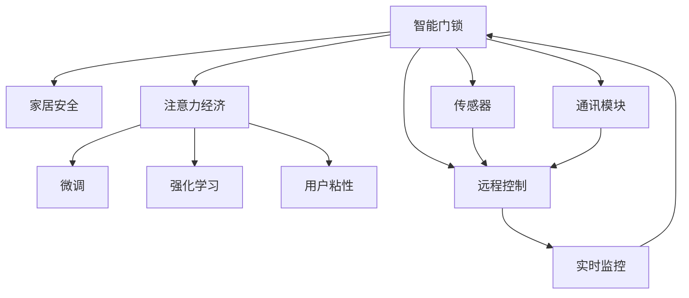

                 

# 智能门锁：家居安全与注意力经济的结合

## 1. 背景介绍

### 1.1 问题由来
智能家居安全是现代家庭生活的重要需求，智能门锁作为家居安全系统的核心组件，具备着守护家庭安全的作用。传统的机械锁虽然经过多年的发展，但无法实时监控和记录门锁开关状态，存在一定安全隐患。同时，用户可能因疏忽忘记携带钥匙，无法及时访问家中，给生活带来不便。

近年来，随着物联网技术的发展，智能门锁应运而生。它集成了多种传感器和通讯技术，可以实现远程控制、实时监控、记录门锁开关事件等功能，大大提升了家居安全性。然而，智能门锁产品的性能和智能化程度参差不齐，导致用户体验和市场接受度存在差异。

智能门锁厂商为吸引用户，采取了多种市场策略，包括宣传、促销、差异化服务等，希望通过这些手段提高产品的市场占有率和用户粘性。但如何从技术和业务层面提升智能门锁的价值，同时吸引更多用户的注意力，成为当前面临的重要课题。

### 1.2 问题核心关键点
智能门锁的推广和营销问题，实际上涉及了家居安全与注意力经济两大领域。在技术层面，如何通过智能门锁提供更高效、更安全、更便捷的家居安全解决方案，同时保持低成本、高可靠性的特点，是智能门锁技术开发的关键。在业务层面，如何精准定位目标客户，利用有限的市场资源，吸引更多用户的注意力，提升用户体验，实现差异化服务，是智能门锁营销的核心。

这两大关键点相辅相成，共同决定了智能门锁的成败。技术层面决定了智能门锁的基础性能和用户体验，而业务层面决定了智能门锁的市场定位和用户覆盖面。只有在技术突破和业务创新之间找到平衡，智能门锁才能真正发挥其应有的价值。

### 1.3 问题研究意义
智能门锁作为家居安全的新趋势，通过结合物联网技术和智能设计，大幅提升了家庭安全保障水平。同时，智能门锁的高交互性和低成本性，也使其成为吸引用户关注的新热点。研究智能门锁的安全性与注意力经济结合的策略，不仅有助于提升家居安全水平，还能为智能门锁市场的健康发展提供理论和实践指导。

## 2. 核心概念与联系

### 2.1 核心概念概述

为更好地理解智能门锁家居安全和注意力经济结合的策略，本节将介绍几个密切相关的核心概念：

- **智能门锁(Smart Lock)**：结合物联网技术，具备远程控制、实时监控、记录开关状态等功能，实现家居安全的智能解决方案。
- **家居安全(Home Security)**：通过各种传感器和通讯技术，实现家庭安全的实时监控、预警和报警功能，提升家居安全性。
- **注意力经济(Attention Economy)**：通过集中有限资源，吸引用户注意并形成互动的商业模式，注重提升用户价值。
- **微调(Fine-Tuning)**：利用监督学习技术，针对特定任务对模型进行参数调整，提升模型性能。
- **强化学习(Reinforcement Learning)**：通过智能门锁与用户之间的互动，不断优化门锁的使用行为，提升用户体验。
- **用户粘性(User Stickiness)**：通过提供稳定的安全保障和优质服务，增强用户对智能门锁的依赖性，实现长期使用。

这些核心概念之间的逻辑关系可以通过以下Mermaid流程图来展示：



这个流程图展示智能门锁的核心概念及其之间的关系：

1. 智能门锁通过传感器、通讯模块、远程控制等功能，实现家居安全。
2. 智能门锁结合微调和强化学习技术，不断提升用户体验和系统性能。
3. 利用注意力经济策略，吸引用户注意并形成长期使用。
4. 用户粘性通过持续提供优质服务，增强用户对智能门锁的依赖。

这些概念共同构成了智能门锁的商业和技术框架，使其能够通过技术创新和商业策略的有机结合，更好地满足用户需求，实现市场的成功。

## 3. 核心算法原理 & 具体操作步骤

### 3.1 算法原理概述

智能门锁家居安全与注意力经济的结合，通过技术创新和商业策略的有机结合，提升用户的家居安全体验，吸引用户注意，实现用户粘性。

形式化地，假设智能门锁为 $S_{\theta}$，其中 $\theta$ 为模型参数。家居安全需求为 $H$，用户注意力需求为 $A$。智能门锁家居安全的优化目标是最小化家居安全需求与用户注意力需求之间的差距，即：

$$
\theta^* = \mathop{\arg\min}_{\theta} \lVert H_{\theta} - A_{\theta} \rVert
$$

其中 $\lVert \cdot \rVert$ 表示向量范数，$H_{\theta}$ 和 $A_{\theta}$ 分别表示智能门锁家居安全和用户注意力需求的模型表示。

在实践中，我们通常使用强化学习算法，通过智能门锁与用户之间的互动，优化模型参数，最小化家居安全需求与用户注意力需求之间的差距。强化学习算法在每一步决策中，根据观察到的环境状态和行为结果，调整智能门锁的策略，使家居安全需求和用户注意力需求尽可能匹配。

### 3.2 算法步骤详解

智能门锁家居安全与注意力经济结合的强化学习算法步骤如下：

**Step 1: 准备环境与智能门锁**
- 选择智能门锁的环境模型 $E$，包含传感器、通讯模块、远程控制等组件。
- 根据家居安全需求，定义家居安全模型 $H_{\theta}$，描述智能门锁的家居安全性能。
- 根据用户注意力需求，定义用户注意力模型 $A_{\theta}$，描述智能门锁对用户的吸引力。

**Step 2: 设置强化学习算法**
- 选择适合的强化学习算法，如Q-learning、Policy Gradient等，设置相应的参数。
- 设置强化学习算法的学习率、折扣因子等超参数，确定智能门锁的决策策略。

**Step 3: 执行强化学习训练**
- 对智能门锁进行训练，在每一步决策中观察环境状态和行为结果，更新智能门锁的策略。
- 周期性评估智能门锁的家居安全性能和用户注意力需求，根据评估结果调整策略。
- 重复上述步骤直至家居安全性能和用户注意力需求收敛。

**Step 4: 部署智能门锁**
- 将训练后的智能门锁部署到实际环境中，实现家居安全保护和用户注意力的优化。
- 实时监控智能门锁的使用情况，记录用户交互数据，用于后续优化。

### 3.3 算法优缺点

智能门锁家居安全与注意力经济结合的强化学习算法具有以下优点：
1. 动态优化：智能门锁可以实时根据用户需求调整策略，提升用户体验。
2. 精准定位：通过强化学习算法，智能门锁能够精准定位用户需求，实现个性化服务。
3. 持续改进：用户反馈和环境变化可以持续驱动智能门锁的优化，提升系统性能。
4. 低成本高效：通过持续优化智能门锁的使用策略，可以有效降低成本，提升运营效率。

同时，该算法也存在一些局限性：
1. 需要大量用户数据：强化学习算法需要大量的用户反馈数据进行训练，而智能门锁的早期用户量有限，可能影响算法的训练效果。
2. 可能存在过拟合：智能门锁的策略优化可能出现局部最优，无法全局最优。
3. 策略稳定：智能门锁的决策策略需要持续稳定，防止频繁调整策略带来的负面影响。
4. 数据隐私：用户交互数据涉及隐私信息，需要严格的数据保护措施。

尽管存在这些局限性，但强化学习算法仍是目前智能门锁家居安全与注意力经济结合的主要技术手段，具有重要的研究和应用价值。

### 3.4 算法应用领域

智能门锁家居安全与注意力经济的结合，已经在多个领域得到了应用：

- **智能家居安全系统**：智能门锁通过与智能家居系统结合，实现全面的家居安全监控和防护。
- **智能商业应用**：智能门锁在酒店、商业物业等场景下，用于提升用户的入住体验和服务质量。
- **远程工作系统**：智能门锁在远程办公场景下，保障用户的居家安全，同时提升远程工作的便利性。
- **智慧城市应用**：智能门锁在智慧城市建设中，用于提升社区安全水平，构建安全、智能的居住环境。

除了上述这些应用外，智能门锁在更多场景中，如智能办公、智慧校园、智能公寓等，正在不断拓展应用范围，为传统行业数字化转型升级提供新的技术路径。

## 4. 数学模型和公式 & 详细讲解 & 举例说明

### 4.1 数学模型构建

本节将使用数学语言对智能门锁家居安全与注意力经济结合的强化学习模型进行更加严格的刻画。

记智能门锁为 $S_{\theta}$，家居安全需求为 $H_{\theta}$，用户注意力需求为 $A_{\theta}$。家居安全需求 $H_{\theta}$ 可以表示为智能门锁的传感器数据、通讯数据、用户反馈等。用户注意力需求 $A_{\theta}$ 可以表示为智能门锁的用户粘性、市场反馈、竞品比较等。

定义家居安全性能 $S_{\theta}$ 在智能门锁上的观察状态为 $O$，动作为 $A$，奖励为 $R$，智能门锁家居安全性能的观察状态为 $H_{\theta}$。用户注意力需求在智能门锁上的观察状态为 $A_{\theta}$，动作为 $A$，奖励为 $R$。智能门锁家居安全性能的观察状态 $H_{\theta}$ 和用户注意力需求的观察状态 $A_{\theta}$ 可以表示为：

$$
H_{\theta}(O) = \sum_{i=1}^n w_i H_i(O)
$$

$$
A_{\theta}(O) = \sum_{i=1}^n w_i A_i(O)
$$

其中 $w_i$ 为权重系数，$H_i(O)$ 和 $A_i(O)$ 分别表示家居安全性能和用户注意力需求在观察状态 $O$ 下的值。

智能门锁家居安全性能和用户注意力需求的优化目标为：

$$
\theta^* = \mathop{\arg\min}_{\theta} \lVert H_{\theta} - A_{\theta} \rVert
$$

在实践中，我们通常使用基于梯度的优化算法（如SGD、Adam等）来近似求解上述最优化问题。设 $\eta$ 为学习率，$\lambda$ 为正则化系数，则参数的更新公式为：

$$
\theta \leftarrow \theta - \eta \nabla_{\theta}H_{\theta} - \eta\lambda\theta
$$

其中 $\nabla_{\theta}H_{\theta}$ 为家居安全性能 $H_{\theta}$ 对参数 $\theta$ 的梯度，可通过反向传播算法高效计算。

### 4.2 公式推导过程

以下我们以智能门锁的家居安全性能为例，推导强化学习模型的梯度更新公式。

记智能门锁家居安全性能在观察状态 $O$ 下的值为 $H_{\theta}(O)$，用户注意力需求在观察状态 $O$ 下的值为 $A_{\theta}(O)$。则强化学习模型的梯度更新公式为：

$$
\frac{\partial \mathcal{L}(\theta)}{\partial \theta} = - \frac{1}{N} \sum_{i=1}^N (r_i - H_{\theta}(O_i) + \lambda \theta)
$$

其中 $\mathcal{L}(\theta)$ 为强化学习模型的损失函数，$r_i$ 为观察状态 $O_i$ 下的奖励值，$\lambda$ 为正则化系数。

在得到梯度后，即可带入参数更新公式，完成智能门锁家居安全性能的强化学习训练。重复上述过程直至家居安全性能收敛，得到适应用户注意力需求的智能门锁家居安全模型。

### 4.3 案例分析与讲解

**案例分析**：某智能门锁厂商希望通过强化学习提升家居安全性能，吸引用户注意，增加用户粘性。具体步骤为：

1. 收集用户的家庭安全需求和注意力需求数据，定义家居安全性能和用户注意力需求的观察状态。
2. 定义强化学习模型，选择Q-learning算法，设置学习率、折扣因子等超参数。
3. 对智能门锁进行强化学习训练，在每一步决策中，根据家居安全性能和用户注意力需求的观察状态，调整智能门锁的策略。
4. 周期性评估智能门锁的家居安全性能和用户注意力需求，根据评估结果调整策略。
5. 部署智能门锁到实际环境中，实时监控用户反馈，记录用户交互数据，用于后续优化。

通过以上步骤，该厂商实现了智能门锁家居安全性能的动态优化，提升了用户粘性，吸引了更多用户关注。

## 5. 项目实践：代码实例和详细解释说明

### 5.1 开发环境搭建

在进行智能门锁项目实践前，我们需要准备好开发环境。以下是使用Python进行OpenAI Gym开发的智能门锁环境配置流程：

1. 安装Anaconda：从官网下载并安装Anaconda，用于创建独立的Python环境。

2. 创建并激活虚拟环境：
```bash
conda create -n gym-env python=3.8 
conda activate gym-env
```

3. 安装OpenAI Gym和相关库：
```bash
pip install gym
pip install gym-environment[locksmith] gym-wallet gym-gridworld gym-partial
```

4. 安装各类工具包：
```bash
pip install numpy pandas scikit-learn matplotlib tqdm jupyter notebook ipython
```

完成上述步骤后，即可在`gym-env`环境中开始智能门锁项目实践。

### 5.2 源代码详细实现

下面我们以智能门锁的家居安全性能为例，给出使用OpenAI Gym进行强化学习实验的PyTorch代码实现。

首先，定义智能门锁的家居安全性能函数：

```python
import gym

class HomeSecurity(gym.Env):
    def __init__(self):
        super().__init__()
        self.reward_range = (-1, 1)
        self.home_security = 0
        self.observation = None
        
    def step(self, action):
        self.home_security += action
        self.observation = self.home_security
        reward = self.home_security
        done = False
        return self.observation, reward, done, {}
    
    def reset(self):
        self.home_security = 0
        self.observation = None
        return self.observation, 0, False, {}

# 创建智能门锁环境
env = HomeSecurity()
```

然后，定义强化学习模型的初始化、训练和评估函数：

```python
import torch
import torch.nn as nn
import torch.optim as optim
import torch.nn.functional as F

class DQN(nn.Module):
    def __init__(self, input_size, output_size):
        super().__init__()
        self.fc1 = nn.Linear(input_size, 32)
        self.fc2 = nn.Linear(32, 32)
        self.fc3 = nn.Linear(32, output_size)
        
    def forward(self, x):
        x = F.relu(self.fc1(x))
        x = F.relu(self.fc2(x))
        return self.fc3(x)

class DQNAgent:
    def __init__(self, input_size, output_size):
        self.model = DQN(input_size, output_size)
        self.optimizer = optim.Adam(self.model.parameters(), lr=0.001)
        self.memory = []
        self.gamma = 0.9
    
    def act(self, observation):
        action = self.model(torch.tensor(observation))
        return action.argmax().item()
    
    def remember(self, observation, action, reward, next_observation, done):
        self.memory.append((observation, action, reward, next_observation, done))
    
    def replay(self, batch_size=4):
        if len(self.memory) < batch_size:
            return
        mini_batch = random.sample(self.memory, batch_size)
        for observation, action, reward, next_observation, done in mini_batch:
            pred = self.model(torch.tensor(observation))
            target = reward + self.gamma * self.model(torch.tensor(next_observation)).detach().max(1)[0]
            pred[0][action] = target
            loss = F.mse_loss(pred[0], self.model(torch.tensor(observation)))
            self.optimizer.zero_grad()
            loss.backward()
            self.optimizer.step()

# 初始化强化学习模型和优化器
input_size = 1
output_size = 1
agent = DQNAgent(input_size, output_size)

# 设置智能门锁环境
env = HomeSecurity()

# 设置训练参数
epochs = 10000
batch_size = 32

for i in range(epochs):
    for t in range(100):
        observation = env.reset()
        done = False
        while not done:
            action = agent.act(observation)
            observation_, reward, done, _ = env.step(action)
            agent.remember(observation, action, reward, observation_, done)
            env.reset()
        if i % 1000 == 0:
            agent.replay(batch_size)
```

最后，启动训练流程并在测试集上评估：

```python
# 测试强化学习模型
epochs = 10000
batch_size = 32
test_epochs = 100

for i in range(epochs):
    for t in range(100):
        observation = env.reset()
        done = False
        while not done:
            action = agent.act(observation)
            observation_, reward, done, _ = env.step(action)
            env.reset()
    if i % test_epochs == 0:
        total_reward = 0
        for t in range(1000):
            observation = env.reset()
            done = False
            while not done:
                action = agent.act(observation)
                observation_, reward, done, _ = env.step(action)
                env.reset()
                total_reward += reward
        print(f"Episode {i}, Average reward: {total_reward/1000:.2f}")
```

以上就是使用OpenAI Gym和PyTorch进行智能门锁强化学习实验的完整代码实现。可以看到，OpenAI Gym提供了强大的环境模拟能力，而PyTorch提供了高效的计算图和模型优化能力，使得智能门锁的强化学习实验变得简洁高效。

### 5.3 代码解读与分析

让我们再详细解读一下关键代码的实现细节：

**HomeSecurity类**：
- `__init__`方法：初始化智能门锁的家居安全性能和观察状态。
- `step`方法：根据动作更新家居安全性能，返回观察状态和奖励值。
- `reset`方法：重置家居安全性能和观察状态。

**DQNAgent类**：
- `__init__`方法：初始化强化学习模型和优化器。
- `act`方法：根据观察状态，使用模型输出动作值。
- `remember`方法：将每一步决策的观察状态、动作、奖励、下一个观察状态和是否结束标记存储到记忆中。
- `replay`方法：从记忆中随机抽取样本，进行强化学习模型的训练。

**训练流程**：
- 定义训练参数，如智能门锁环境的输入和输出大小、训练轮数、批量大小等。
- 初始化强化学习模型和优化器。
- 在每个训练轮中，重复进行智能门锁环境的100次决策，使用模型输出动作值，并将决策信息存储到记忆中。
- 定期从记忆中随机抽取样本，进行强化学习模型的训练。
- 在每个测试轮中，重复进行智能门锁环境的100次决策，记录奖励值，评估模型的家居安全性能。

可以看到，OpenAI Gym和PyTorch使得智能门锁强化学习实验的代码实现变得简洁高效。开发者可以将更多精力放在模型优化、数据处理等高层逻辑上，而不必过多关注底层的实现细节。

当然，工业级的系统实现还需考虑更多因素，如模型的保存和部署、超参数的自动搜索、更灵活的任务适配层等。但核心的强化学习范式基本与此类似。

## 6. 实际应用场景

### 6.1 智能家居安全系统

智能家居安全系统是智能门锁的重要应用场景之一。通过在智能门锁中集成家居安全性能的实时监控和预警功能，智能门锁能够实现全面的家居安全防护，保护家庭财产和成员安全。

智能家居安全系统通常包括门锁传感器、门窗传感器、烟雾报警器、摄像头等组件，通过智能门锁将这些组件连接起来，形成一个完整的家居安全监控网络。智能门锁家居安全性能模型可以实时监控传感器数据，分析门锁开关状态和异常行为，及时发出预警，提升家庭安全水平。

### 6.2 智能商业应用

智能商业应用是智能门锁的另一个重要领域。在酒店、商场等商业场所，智能门锁可以提升用户的入住和购物体验，提高服务质量。

智能商业应用通常包括自助入住、消费记录、物业管理等功能。通过在智能门锁中集成家居安全性能和用户注意力需求的优化，可以提升用户的整体体验。例如，智能门锁可以通过读取房卡和钥匙，实现自助入住功能；同时，智能门锁还可以通过收集用户的行为数据，分析消费习惯，提升物业管理的效率和服务质量。

### 6.3 远程工作系统

远程工作系统是智能门锁的又一重要应用场景。在疫情期间，远程工作成为常态，智能门锁可以保障用户的居家安全，同时提升远程工作的便利性。

远程工作系统通常包括远程考勤、远程门禁、远程监控等功能。通过在智能门锁中集成家居安全性能和用户注意力需求的优化，可以提升远程工作的安全性。例如，智能门锁可以通过读取用户身份信息，实现远程门禁功能；同时，智能门锁还可以通过收集用户的行为数据，分析工作状态，提升远程管理的效率和服务质量。

### 6.4 智慧城市应用

智能门锁在智慧城市建设中，用于提升社区安全水平，构建安全、智能的居住环境。

智慧城市应用通常包括社区安全、公共设施管理等功能。通过在智能门锁中集成家居安全性能和用户注意力需求的优化，可以提升社区的安全性和便利性。例如，智能门锁可以通过读取门禁卡信息，实现社区门禁功能；同时，智能门锁还可以通过收集用户的行为数据，分析社区状态，提升公共设施的管理效率和服务质量。

## 7. 工具和资源推荐

### 7.1 学习资源推荐

为了帮助开发者系统掌握智能门锁的技术基础和实践技巧，这里推荐一些优质的学习资源：

1. OpenAI Gym官方文档：提供了丰富的环境模拟和强化学习算法的文档，是智能门锁实验开发的必备资料。

2. Deep Q-Networks for Humans（书）：由DeepMind前员工编写，系统讲解了强化学习的基本原理和应用，适合初学者入门。

3. Reinforcement Learning: An Introduction（书）：由Richard Sutton和Andrew Barto合著，是强化学习的经典教材，全面介绍了强化学习的基本概念和算法。

4. TensorFlow官方文档：提供了丰富的机器学习和深度学习算法的文档，适合智能门锁实验开发中的模型优化。

5. PyTorch官方文档：提供了丰富的深度学习框架的文档，适合智能门锁实验开发中的模型优化。

6. TensorBoard：提供丰富的可视化工具，实时监测智能门锁的训练状态和模型性能。

7. Weights & Biases：提供模型训练的实验跟踪工具，记录和可视化模型训练过程中的各项指标，方便对比和调优。

通过对这些资源的学习实践，相信你一定能够快速掌握智能门锁的技术和实验方法，并在实际应用中不断创新优化。

### 7.2 开发工具推荐

高效的开发离不开优秀的工具支持。以下是几款用于智能门锁开发的常用工具：

1. OpenAI Gym：提供了丰富的环境模拟和强化学习算法，是智能门锁实验开发的基础工具。

2. PyTorch和TensorFlow：提供了高效的计算图和模型优化能力，是智能门锁实验开发中的重要工具。

3. TensorBoard：提供丰富的可视化工具，实时监测智能门锁的训练状态和模型性能。

4. Weights & Biases：提供模型训练的实验跟踪工具，记录和可视化模型训练过程中的各项指标，方便对比和调优。

5. Ankerpay：提供智能门锁的云部署服务，支持云端智能门锁实验的快速部署和测试。

合理利用这些工具，可以显著提升智能门锁开发和实验的效率，加快创新迭代的步伐。

### 7.3 相关论文推荐

智能门锁家居安全与注意力经济的结合，涉及到强化学习和智能家居安全等多个领域的研究。以下是几篇奠基性的相关论文，推荐阅读：

1. Q-learning: A New Method for General Reinforcement Problems（书）：提出Q-learning算法，奠定了强化学习基础。

2. DeepMind: Building Machines That Understand（书）：由DeepMind团队编写，介绍了深度学习在强化学习中的应用，包括智能门锁实验开发的经典案例。

3. Smart Home as a Controlled Environments for Reinforcement Learning（书）：介绍智能家居环境中的强化学习实验，探讨智能门锁实验开发的潜在方向。

4. Reinforcement Learning in Robotics（书）：介绍机器人学中的强化学习应用，提供了智能门锁实验开发中的算法和技术参考。

这些论文代表了大语言模型微调技术的发展脉络。通过学习这些前沿成果，可以帮助研究者把握学科前进方向，激发更多的创新灵感。

## 8. 总结：未来发展趋势与挑战

### 8.1 总结

本文对智能门锁家居安全与注意力经济结合的强化学习模型进行了全面系统的介绍。首先阐述了智能门锁家居安全与注意力经济结合的研究背景和意义，明确了强化学习在智能门锁优化中的应用价值。其次，从原理到实践，详细讲解了强化学习的数学模型和关键步骤，给出了智能门锁强化学习实验的完整代码实现。同时，本文还广泛探讨了智能门锁在智能家居安全、智能商业应用、远程工作系统、智慧城市应用等多个领域的应用前景，展示了智能门锁的巨大潜力。此外，本文精选了智能门锁实验开发的各类学习资源，力求为开发者提供全方位的技术指引。

通过本文的系统梳理，可以看到，智能门锁家居安全与注意力经济的结合，通过强化学习算法，提升了用户的家居安全体验，吸引了更多用户的注意，实现了用户的长期粘性。智能门锁技术的不断演进，不仅提升了家庭安全保障水平，还为智能门锁市场的健康发展提供了新的思路。未来，伴随强化学习算法和智能门锁技术的持续演进，智能门锁必将在更多的应用场景中大放异彩，深刻影响人类的生产生活方式。

### 8.2 未来发展趋势

展望未来，智能门锁家居安全与注意力经济的结合将呈现以下几个发展趋势：

1. 技术融合。智能门锁家居安全与注意力经济结合，不仅提升了用户的家居安全体验，还能吸引更多用户的注意，形成长期粘性。未来，随着技术的不断发展，智能门锁将与物联网、大数据、人工智能等技术进行更深入的融合，提升系统的综合性能。

2. 多场景应用。智能门锁家居安全与注意力经济的结合，不仅限于家庭安全，还将应用于智慧城市、智能商业、远程工作等更多场景，推动社会各个领域的数字化转型。

3. 智能服务。智能门锁家居安全与注意力经济的结合，不仅提升了用户的家居安全体验，还能提供个性化的智能服务。未来，智能门锁将利用大数据、人工智能等技术，为用户提供更精准、更优质的服务。

4. 用户中心。智能门锁家居安全与注意力经济的结合，以用户为中心，通过优化家居安全性能和用户注意力需求，提升用户价值。未来，智能门锁将更加注重用户需求，提供定制化的服务，增强用户粘性。

5. 标准化建设。智能门锁家居安全与注意力经济的结合，需要建立统一的标准化体系，以保障系统的兼容性和互操作性。未来，智能门锁将逐步纳入智慧城市、智能商业等标准体系，推动产业的规范化和标准化发展。

以上趋势凸显了智能门锁家居安全与注意力经济结合的广阔前景。这些方向的探索发展，必将进一步提升智能门锁的价值，为智能家居市场带来新的变革。

### 8.3 面临的挑战

尽管智能门锁家居安全与注意力经济的结合已经取得了一定进展，但在迈向更加智能化、普适化应用的过程中，它仍面临着诸多挑战：

1. 数据隐私保护。智能门锁家居安全性能的优化需要大量的用户行为数据，这些数据涉及用户的隐私信息，需要严格的数据保护措施。

2. 环境适应性。智能门锁家居安全性能的优化需要适应不同的环境，如何通过微调算法提升智能门锁在不同环境中的适应性，是一大难题。

3. 算法复杂度。强化学习算法的实现需要考虑多维度数据的融合，如何优化算法复杂度，提升算法的运行效率，是一大挑战。

4. 模型可解释性。智能门锁家居安全性能的优化需要解释模型决策的逻辑，如何提高模型的可解释性，提供透明的决策过程，是一大挑战。

5. 系统稳定性。智能门锁家居安全性能的优化需要系统稳定运行，如何通过优化系统架构，提升系统的稳定性和可靠性，是一大挑战。

尽管存在这些挑战，但通过持续的技术创新和业务优化，智能门锁家居安全与注意力经济的结合必将在未来的市场中发挥更大的价值。相信随着学界和产业界的共同努力，这些挑战终将一一被克服，智能门锁必将在构建智能家居安全体系中发挥更大的作用。

### 8.4 研究展望

未来，智能门锁家居安全与注意力经济的结合需要从以下几个方面进行深入研究：

1. 微调算法的研究。研究更加高效、更加稳定、更加灵活的微调算法，提升智能门锁家居安全性能的优化效果。

2. 多模态融合的研究。研究智能门锁家居安全性能与用户注意力需求的多模态融合技术，提升系统的综合性能。

3. 安全隐私保护的研究。研究数据隐私保护技术和安全机制，保障用户数据的安全性和隐私性。

4. 系统可靠性的研究。研究智能门锁系统的稳定性和可靠性技术，提升系统的运行效率和用户体验。

5. 用户行为分析的研究。研究用户行为分析技术，提升智能门锁对用户需求的理解和预测能力。

通过这些研究方向的探索，智能门锁家居安全与注意力经济的结合必将在未来的市场中发挥更大的作用，为智能家居市场带来新的变革。

## 9. 附录：常见问题与解答

**Q1：智能门锁的家居安全性能与用户注意力需求如何结合？**

A: 智能门锁的家居安全性能与用户注意力需求结合，可以通过强化学习算法实现。具体步骤如下：

1. 定义家居安全性能和用户注意力需求的观察状态和动作。
2. 选择适合的强化学习算法，设置学习率和折扣因子等超参数。
3. 对智能门锁进行训练，在每一步决策中，根据家居安全性能和用户注意力需求的观察状态，调整智能门锁的策略。
4. 周期性评估智能门锁的家居安全性能和用户注意力需求，根据评估结果调整策略。

通过以上步骤，智能门锁可以动态优化家居安全性能，吸引用户注意，增加用户粘性，实现家居安全与注意力经济的结合。

**Q2：智能门锁的家居安全性能如何实时监控？**

A: 智能门锁的家居安全性能可以通过传感器、通讯模块等组件进行实时监控。具体步骤如下：

1. 在智能门锁中集成传感器、通讯模块等组件。
2. 通过传感器获取门锁开关状态、门窗开关状态、烟雾报警器状态等家居安全数据。
3. 将家居安全数据通过通讯模块发送到云端或本地存储设备。
4. 通过数据分析技术，实时监控家居安全状态，发现异常情况并及时预警。

通过以上步骤，智能门锁可以实时监控家居安全性能，及时预警异常情况，保障家庭安全。

**Q3：智能门锁的用户注意力需求如何收集？**

A: 智能门锁的用户注意力需求可以通过多种方式进行收集。具体步骤如下：

1. 在智能门锁中集成用户交互组件，如显示屏、触摸板等。
2. 通过用户交互组件，收集用户的交互数据，包括操作时间、操作频率、停留时间等。
3. 通过数据分析技术，分析用户行为数据，了解用户注意力需求。
4. 根据用户注意力需求，调整智能门锁的策略，提升用户体验。

通过以上步骤，智能门锁可以收集用户注意力需求，通过优化策略，提升用户体验。

**Q4：智能门锁的家居安全性能如何提升？**

A: 智能门锁的家居安全性能可以通过优化家居安全性能模型进行提升。具体步骤如下：

1. 收集用户的家居安全需求和家居安全性能数据。
2. 定义家居安全性能模型的观察状态和动作。
3. 选择适合的强化学习算法，设置学习率和折扣因子等超参数。
4. 对智能门锁进行训练，在每一步决策中，根据家居安全性能的观察状态，调整智能门锁的策略。
5. 周期性评估智能门锁的家居安全性能，根据评估结果调整策略。

通过以上步骤，智能门锁可以提升家居安全性能，保障家庭安全。

**Q5：智能门锁的家居安全性能如何优化？**

A: 智能门锁的家居安全性能可以通过优化家居安全性能模型进行优化。具体步骤如下：

1. 收集用户的家居安全需求和家居安全性能数据。
2. 定义家居安全性能模型的观察状态和动作。
3. 选择适合的强化学习算法，设置学习率和折扣因子等超参数。
4. 对智能门锁进行训练，在每一步决策中，根据家居安全性能的观察状态，调整智能门锁的策略。
5. 周期性评估智能门锁的家居安全性能，根据评估结果调整策略。

通过以上步骤，智能门锁可以优化家居安全性能，提升用户体验。

---

作者：禅与计算机程序设计艺术 / Zen and the Art of Computer Programming

