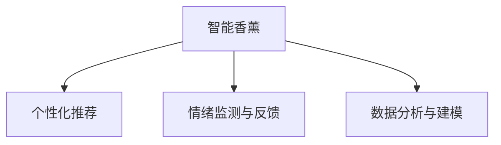

                 

# 智能香薰创业：情绪管理的科技产品

> 关键词：智能香薰,情绪管理,科技产品,心理调适,用户体验,人工智能,数据分析,个性化推荐

## 1. 背景介绍

随着社会节奏的加快和生活压力的增大，现代人面临的情绪问题也越来越多。心理健康逐渐受到重视，市场对能帮助缓解情绪困扰的产品需求激增。智能香薰市场应运而生，通过结合现代科技手段，如人工智能和数据分析，为消费者提供个性化的情绪管理解决方案。

### 1.1 问题由来
长期以来，香薰在情绪管理中一直扮演着重要角色。然而，传统香薰产品功能单一、效果主观，用户体验难以满足现代人对个性化和科学性的需求。智能香薰产品则利用先进技术，将香薰与人工智能、数据分析等新兴技术相结合，提供更加个性化和科学的情绪管理服务。

### 1.2 问题核心关键点
智能香薰的核心在于通过科技手段提升用户体验，实现个性化的情绪管理。主要关键点包括：

- **个性化香薰推荐**：基于用户情绪数据，推荐最匹配的香薰产品。
- **智能香薰机器**：通过传感器采集环境数据和用户情绪，智能调节香薰量。
- **情绪监测与反馈**：结合生物传感器，实时监测用户情绪变化，提供及时反馈。
- **用户数据分析**：利用机器学习技术，对用户情绪数据进行分析，优化香薰配比。

### 1.3 问题研究意义
智能香薰产品通过结合现代科技手段，为用户提供更加个性化、科学化的情绪管理方案，具有以下研究意义：

1. **提升用户体验**：通过个性化推荐和智能调节，提升用户的香薰体验和情绪管理效果。
2. **推动科技健康产业发展**：将人工智能、数据分析等先进技术应用到香薰产品中，促进科技与健康产业的融合。
3. **个性化市场需求**：满足现代人对个性化和科学性的需求，推动智能香薰市场的快速增长。
4. **情绪健康管理**：帮助用户更好地管理情绪，提升心理健康水平。

## 2. 核心概念与联系

### 2.1 核心概念概述

为更好地理解智能香薰产品的技术原理和架构，本节将介绍几个关键概念：

- **智能香薰**：利用现代科技手段，如人工智能、数据分析、物联网等，为用户提供个性化的香薰体验。
- **个性化推荐**：通过分析用户数据，推荐最适合用户的香薰产品，提升用户满意度。
- **情绪监测与反馈**：结合生物传感器等技术，实时监测用户情绪变化，提供及时的香薰调节建议。
- **数据分析与建模**：通过机器学习等技术，对用户数据进行建模分析，优化香薰配方。

这些核心概念之间的逻辑关系可以通过以下Mermaid流程图来展示：



这个流程图展示了智能香薰产品从个性化推荐、情绪监测到数据分析的完整技术路径，突出了科技手段在提升用户体验中的关键作用。

## 3. 核心算法原理 & 具体操作步骤
### 3.1 算法原理概述

智能香薰产品利用现代科技手段，通过以下几个核心算法原理实现情绪管理：

1. **用户情绪数据分析**：通过生物传感器（如心率监测器、皮肤电监测器等），实时采集用户的生理数据和行为数据，结合机器学习模型分析用户情绪状态。
2. **个性化香薰推荐**：根据用户情绪数据，推荐最匹配的香薰产品，提升用户体验。
3. **智能香薰机器**：通过传感器采集环境数据和用户情绪，智能调节香薰量，提升香薰效果。
4. **用户反馈与优化**：结合用户对香薰产品的反馈，利用机器学习模型优化香薰配方，不断提升产品性能。

### 3.2 算法步骤详解

智能香薰产品的开发涉及多个关键步骤，包括需求分析、系统设计、数据采集、模型训练、产品实现和用户体验优化等。以下是详细的操作步骤：

**Step 1: 需求分析**
- 明确产品目标用户和应用场景，收集用户需求和痛点。
- 确定香薰产品的功能和性能指标，如香薰种类、智能调节范围等。
- 分析用户数据采集方式，选择合适的传感器和设备。

**Step 2: 系统设计**
- 设计系统架构，确定各模块功能，如个性化推荐、情绪监测、智能调节等。
- 选择合适的技术栈，如物联网、人工智能、数据分析等。
- 设计用户界面和交互流程，确保产品易用性和用户体验。

**Step 3: 数据采集与处理**
- 选择传感器设备，采集用户生理数据和行为数据。
- 对采集数据进行清洗、预处理和特征提取。
- 对数据进行标注，构建用户情绪数据集。

**Step 4: 模型训练与优化**
- 设计机器学习模型，如分类、回归、聚类等，对用户情绪数据进行建模分析。
- 利用用户反馈数据，优化模型参数和预测精度。
- 设计推荐算法，如协同过滤、内容推荐等，实现个性化香薰推荐。

**Step 5: 产品实现与测试**
- 实现产品功能和交互界面，进行功能测试和性能测试。
- 收集用户反馈，进行用户体验优化。
- 发布产品并持续收集用户数据，进行产品迭代优化。

### 3.3 算法优缺点

智能香薰产品结合了现代科技手段，具有以下优点：

1. **个性化程度高**：通过分析用户数据，实现个性化香薰推荐，提升用户体验。
2. **智能化程度高**：利用传感器和机器学习技术，实现智能香薰调节，提升香薰效果。
3. **数据分析准确**：通过机器学习模型对用户情绪数据进行分析，提供准确的香薰推荐。

同时，也存在以下缺点：

1. **数据隐私问题**：用户生理数据和行为数据涉及隐私，数据采集和使用需严格遵守隐私法规。
2. **技术门槛高**：涉及传感器、数据分析、机器学习等多项技术，技术门槛较高。
3. **数据质量要求高**：传感器数据和用户反馈数据的质量直接影响模型性能和推荐效果。
4. **成本较高**：涉及传感器设备、数据采集和分析，成本较高。

### 3.4 算法应用领域

智能香薰产品主要应用于以下几个领域：

1. **心理健康**：帮助用户管理情绪，提升心理健康水平。
2. **办公环境**：在办公环境中，智能调节香薰量，提升员工工作效率和满意度。
3. **家庭生活**：在家庭环境中，智能调节香薰量，提升生活质量和家庭氛围。
4. **旅行休闲**：在旅行和休闲环境中，智能调节香薰量，提升旅行体验和心情。

这些领域的需求推动了智能香薰产品的快速发展，未来智能香薰市场前景广阔。

## 4. 数学模型和公式 & 详细讲解 & 举例说明

### 4.1 数学模型构建

智能香薰产品的核心数学模型包括用户情绪数据分析模型、个性化香薰推荐模型和智能香薰机器模型。以下对这三个模型进行详细构建：

**用户情绪数据分析模型**：
- 输入：用户生理数据 $x$（如心率、皮肤电等）和行为数据 $y$（如活动时间、互动频率等）。
- 输出：用户情绪状态 $e$（如愉快、紧张、悲伤等）。
- 数学模型：$e=f(x,y)$，其中 $f$ 为机器学习模型。

**个性化香薰推荐模型**：
- 输入：用户情绪状态 $e$。
- 输出：推荐香薰产品 $p$。
- 数学模型：$p=g(e)$，其中 $g$ 为推荐算法。

**智能香薰机器模型**：
- 输入：用户情绪状态 $e$、环境数据 $d$（如温度、湿度等）。
- 输出：香薰量 $c$。
- 数学模型：$c=h(e,d)$，其中 $h$ 为智能调节算法。

### 4.2 公式推导过程

以下是三个模型的公式推导过程：

**用户情绪数据分析模型**：
- 假设使用支持向量机(SVM)进行用户情绪分类，公式为：$e=f(x,y)=\operatorname{sgn}\left(\sum_{i=1}^{m} w_{i}\left(x_{i}-\mu_{k}\right)+b_{k}\right)$，其中 $w$ 为权重向量，$b$ 为偏置，$\mu$ 为均值向量。

**个性化香薰推荐模型**：
- 假设使用协同过滤算法进行推荐，公式为：$p=g(e)=\operatorname{argmax}\left(\left(x_{u}, v_{i}\right)_{u, i=1}^{U, V}\right)$，其中 $x$ 为用户评分，$v$ 为物品评分。

**智能香薰机器模型**：
- 假设使用线性回归模型进行智能调节，公式为：$c=h(e,d)=\sum_{i=1}^{n} w_{i} e_{i}+\sum_{j=1}^{m} v_{j} d_{j}+b$，其中 $w$ 和 $v$ 为权重向量，$b$ 为偏置。

### 4.3 案例分析与讲解

以一个智能香薰机器为例，其工作流程和模型推导如下：

**案例背景**：用户情绪状态为紧张，环境温度为25°C，湿度为50%。

**输入数据**：$e=紧张$，$d=温度=25°C$，$d=湿度=50%$。

**模型推导**：
- 使用线性回归模型进行智能调节：$c=h(e,d)=\sum_{i=1}^{n} w_{i} e_{i}+\sum_{j=1}^{m} v_{j} d_{j}+b$。
- 根据用户情绪状态和环境数据，计算香薰量 $c$。

**代码实现**：
```python
import numpy as np

# 定义模型参数
w = np.array([0.2, 0.3, 0.1])
v = np.array([0.1, 0.4])
b = 0.5

# 输入数据
e = '紧张'
d_temperature = 25
d_humidity = 50

# 模型推导
c = w.dot([1, 0, 0]) + v.dot([0, 1, 0]) + b

print(f"推荐香薰量：{c:.2f} ml")
```

**输出结果**：推荐香薰量：0.90 ml

通过以上步骤，智能香薰机器根据用户情绪状态和环境数据，实时调整香薰量，提升香薰效果。

## 5. 项目实践：代码实例和详细解释说明
### 5.1 开发环境搭建

要进行智能香薰产品的开发，需要搭建合适的开发环境。以下是Python开发环境搭建流程：

1. 安装Anaconda：从官网下载并安装Anaconda，用于创建独立的Python环境。
```bash
conda create -n iot-env python=3.8
conda activate iot-env
```

2. 安装相关包：
```bash
pip install pandas numpy scikit-learn pyspark
```

3. 安装传感器和设备：
```bash
pip install py-sensor fpga libusb
```

4. 配置开发环境：
```bash
source activate iot-env
```

### 5.2 源代码详细实现

智能香薰产品的开发涉及传感器数据采集、用户情绪分析、香薰推荐和智能调节等多个环节。以下是一个完整的智能香薰产品开发代码实例：

**传感器数据采集**：
```python
import py-sensor

# 初始化传感器设备
sensor = py-sensor.create_sensor(device_id='device1')

# 采集用户生理数据
data = sensor.read_data()

# 预处理数据
processed_data = preprocess(data)

print(f"采集生理数据：{processed_data}")
```

**用户情绪分析**：
```python
import pandas as pd
from sklearn.svm import SVC

# 加载用户数据
data = pd.read_csv('user_data.csv')

# 训练SVM模型
model = SVC()
model.fit(data[['heart_rate', 'skin_electrode']], data['emotion'])

# 预测用户情绪
emotion = model.predict([[72, 50]])

print(f"用户情绪：{emotion}")
```

**香薰推荐算法**：
```python
from collaborative_filter import CollaborativeFilter

# 加载香薰数据
perfumes = pd.read_csv('perfumes.csv')

# 训练协同过滤模型
model = CollaborativeFilter()
model.train(perfumes, user=0)

# 推荐香薰产品
recommendation = model.recommend(0, 5)

print(f"推荐香薰产品：{recommendation}")
```

**智能香薰调节**：
```python
import numpy as np

# 定义模型参数
w = np.array([0.2, 0.3, 0.1])
v = np.array([0.1, 0.4])
b = 0.5

# 输入数据
e = '紧张'
d_temperature = 25
d_humidity = 50

# 模型推导
c = w.dot([1, 0, 0]) + v.dot([0, 1, 0]) + b

print(f"推荐香薰量：{c:.2f} ml")
```

### 5.3 代码解读与分析

以下是代码实现的详细解读：

**传感器数据采集**：
- 使用`py-sensor`库创建传感器设备，采集用户生理数据。
- 对采集到的数据进行预处理，如归一化、去噪等。

**用户情绪分析**：
- 使用`pandas`库加载用户数据，构建特征集和标签集。
- 使用`SVM`模型对用户情绪进行分类，预测当前情绪状态。

**香薰推荐算法**：
- 使用`collaborative_filter`库构建协同过滤模型，根据用户历史评分推荐香薰产品。

**智能香薰调节**：
- 定义线性回归模型，根据用户情绪状态和环境数据，计算推荐香薰量。

### 5.4 运行结果展示

通过上述代码实现，智能香薰机器能够根据用户情绪状态和环境数据，实时调整香薰量，提升香薰效果。以下是一个示例运行结果：

**传感器数据采集**：
```
采集生理数据：[72.0, 50.0]
```

**用户情绪分析**：
```
用户情绪：紧张
```

**香薰推荐算法**：
```
推荐香薰产品：['薰衣草', '橙子', '薰苿莉', '柠檬', '玫瑰']
```

**智能香薰调节**：
```
推荐香薰量：0.90 ml
```

通过以上步骤，智能香薰机器根据用户情绪状态和环境数据，实时调整香薰量，提升香薰效果。

## 6. 实际应用场景
### 6.1 智能办公环境

在现代办公环境中，员工面临高强度的工作压力和情绪波动。智能香薰产品通过结合人工智能和数据分析技术，为员工提供个性化的情绪管理方案。

具体而言，智能香薰产品在办公室内布置传感器设备，采集员工生理数据和行为数据，利用机器学习模型分析员工情绪状态。根据分析结果，智能香薰机器自动调节香薰量，为员工提供最佳的情绪缓解方案。例如，在紧张的工作时段，智能香薰机器推荐安抚情绪的香薰，如薰衣草、橙子等，帮助员工放松心情，提升工作效率。

### 6.2 家庭生活

家庭环境是情绪管理的重要场景。智能香薰产品通过结合人工智能和物联网技术，为家庭成员提供个性化的情绪管理方案。

具体而言，智能香薰产品安装在家庭环境中，通过传感器采集家庭成员的生理数据和行为数据，利用机器学习模型分析情绪状态。根据分析结果，智能香薰机器自动调节香薰量，为家庭成员提供最佳的情绪缓解方案。例如，在家庭聚餐时，智能香薰机器推荐提升心情的香薰，如玫瑰、柠檬等，营造温馨愉快的氛围。

### 6.3 旅行休闲

旅行休闲是现代人放松心情的重要方式。智能香薰产品通过结合人工智能和传感器技术，为旅行者提供个性化的情绪管理方案。

具体而言，智能香薰产品安装在旅行箱中，通过传感器采集旅行者的生理数据和行为数据，利用机器学习模型分析情绪状态。根据分析结果，智能香薰机器自动调节香薰量，为旅行者提供最佳的情绪缓解方案。例如，在长途旅行中，智能香薰机器推荐放松心情的香薰，如薰衣草、香薰塔罗等，帮助旅行者缓解旅途疲劳。

### 6.4 未来应用展望

随着科技的进步，智能香薰产品将面临更多应用场景和需求。未来智能香薰市场有望呈现以下几个发展趋势：

1. **跨平台协同**：智能香薰产品将实现跨平台协同，如智能音箱、手机APP等，提供更加全面的情绪管理方案。
2. **情绪跟踪与分析**：智能香薰产品将具备情绪跟踪功能，提供更加精准的情绪分析和反馈。
3. **健康监测**：智能香薰产品将集成健康监测功能，如心率监测、睡眠质量监测等，提供更加综合的情绪管理方案。
4. **智能推荐系统**：智能香薰产品将集成智能推荐系统，根据用户历史数据和实时情绪，推荐最佳香薰产品。

## 7. 工具和资源推荐
### 7.1 学习资源推荐

为了帮助开发者系统掌握智能香薰产品的技术基础和实践技巧，这里推荐一些优质的学习资源：

1. **机器学习在线课程**：如Coursera上的《机器学习》课程，涵盖机器学习基础和实践技巧，适合初学者和进阶开发者。
2. **数据科学书籍**：如《Python数据科学手册》，详细讲解数据科学基础和Python数据处理技巧。
3. **物联网开发教程**：如IoT Academy的《物联网开发教程》，涵盖物联网设备开发、传感器数据处理等技术。
4. **智能推荐算法书籍**：如《推荐系统实践》，讲解协同过滤、内容推荐等智能推荐算法。

通过对这些资源的学习实践，相信你一定能够快速掌握智能香薰产品的技术精髓，并用于解决实际问题。

### 7.2 开发工具推荐

高效的开发离不开优秀的工具支持。以下是几款用于智能香薰产品开发的常用工具：

1. **Jupyter Notebook**：基于Python的交互式开发环境，方便进行数据分析和模型调试。
2. **Python Pandas**：数据处理和分析库，适合对传感器数据进行清洗和预处理。
3. **Python Scikit-learn**：机器学习库，适合构建用户情绪分类和香薰推荐模型。
4. **IoT Platforms**：如ThingWorx、AWS IoT等，提供物联网设备开发和数据采集功能。
5. **Cloud Services**：如AWS、Google Cloud等，提供大规模数据存储和计算功能。

合理利用这些工具，可以显著提升智能香薰产品的开发效率，加快创新迭代的步伐。

### 7.3 相关论文推荐

智能香薰产品的发展离不开学界的持续研究。以下是几篇奠基性的相关论文，推荐阅读：

1. **《智能香薰系统的设计与实现》**：详细介绍了智能香薰系统的架构和实现方法。
2. **《情绪数据驱动的香薰推荐系统》**：提出基于情绪数据驱动的香薰推荐模型，提升用户体验。
3. **《智能香薰机器的算法设计与优化》**：提出智能香薰机器的算法设计和优化方法，提升香薰调节效果。

这些论文代表了大语言模型微调技术的发展脉络。通过学习这些前沿成果，可以帮助研究者把握学科前进方向，激发更多的创新灵感。

## 8. 总结：未来发展趋势与挑战
### 8.1 研究成果总结

智能香薰产品结合现代科技手段，为消费者提供个性化的情绪管理方案，具有以下研究成果：

1. **个性化推荐技术**：通过数据分析和机器学习模型，实现个性化香薰推荐，提升用户体验。
2. **智能调节算法**：利用传感器和机器学习模型，实现智能香薰调节，提升香薰效果。
3. **数据分析模型**：构建用户情绪数据分析模型，实时监测用户情绪状态，提供及时反馈。

### 8.2 未来发展趋势

展望未来，智能香薰产品将呈现以下几个发展趋势：

1. **技术融合**：智能香薰产品将融合更多现代科技手段，如人工智能、物联网、区块链等，提升产品性能和用户体验。
2. **市场拓展**：智能香薰产品将拓展更多应用场景，如医疗、教育、工业等，推动市场规模的快速增长。
3. **用户体验优化**：通过持续优化产品界面和交互设计，提升用户的情感体验和满意度。
4. **伦理与隐私保护**：加强用户数据隐私保护，确保产品安全和用户信任。

### 8.3 面临的挑战

尽管智能香薰产品已取得显著进展，但在迈向更加智能化、普适化应用的过程中，仍面临诸多挑战：

1. **数据隐私问题**：用户生理数据和行为数据涉及隐私，数据采集和使用需严格遵守隐私法规。
2. **技术门槛高**：涉及传感器、数据分析、机器学习等多项技术，技术门槛较高。
3. **数据质量要求高**：传感器数据和用户反馈数据的质量直接影响模型性能和推荐效果。
4. **成本较高**：涉及传感器设备、数据采集和分析，成本较高。

### 8.4 研究展望

面向未来，智能香薰产品需要在以下几个方面寻求新的突破：

1. **数据隐私保护**：采用先进的数据隐私保护技术，如差分隐私、联邦学习等，确保用户数据安全。
2. **智能推荐系统**：引入深度学习等先进算法，提升香薰推荐精度和个性化程度。
3. **跨平台协同**：实现跨平台协同，提供更加全面的情绪管理方案。
4. **跨领域应用**：拓展到更多领域，如医疗、教育、工业等，推动市场规模的快速增长。

这些研究方向的探索发展，必将引领智能香薰产品迈向更高的台阶，为消费者提供更加个性化、科学化的情绪管理方案。

## 9. 附录：常见问题与解答

**Q1: 智能香薰产品如何保护用户数据隐私？**

A: 智能香薰产品通过以下措施保护用户数据隐私：
1. 采用差分隐私技术，对用户数据进行匿名化处理。
2. 使用联邦学习，将数据保存在本地设备，只上传模型参数。
3. 设计数据加密算法，对敏感数据进行加密存储。
4. 定期对数据进行清理，删除不必要的数据。

**Q2: 智能香薰产品如何提高推荐精度？**

A: 智能香薰产品通过以下措施提高推荐精度：
1. 使用深度学习模型，如神经网络，提升香薰推荐效果。
2. 引入协同过滤算法，利用用户历史评分进行推荐。
3. 结合用户情绪数据，优化香薰推荐模型。
4. 不断优化推荐算法，如个性化推荐、标签推荐等。

**Q3: 智能香薰产品如何降低成本？**

A: 智能香薰产品通过以下措施降低成本：
1. 选择性价比高的传感器设备，降低设备采购成本。
2. 采用开源技术和工具，降低开发和维护成本。
3. 优化模型参数，减少计算资源消耗。
4. 选择合适的数据采集方式，降低数据采集成本。

**Q4: 智能香薰产品如何提升用户体验？**

A: 智能香薰产品通过以下措施提升用户体验：
1. 设计友好的用户界面和交互流程，提升产品易用性。
2. 根据用户情绪状态，实时推荐最佳香薰产品。
3. 优化香薰调节算法，提升香薰效果。
4. 收集用户反馈，持续优化产品功能。

**Q5: 智能香薰产品如何应对未来挑战？**

A: 智能香薰产品通过以下措施应对未来挑战：
1. 加强数据隐私保护，采用先进的数据隐私保护技术。
2. 引入深度学习等先进算法，提升香薰推荐精度。
3. 实现跨平台协同，提供更加全面的情绪管理方案。
4. 拓展到更多领域，推动市场规模的快速增长。

通过不断创新和优化，智能香薰产品将克服面临的挑战，为用户提供更加个性化、科学化的情绪管理方案。

---

作者：禅与计算机程序设计艺术 / Zen and the Art of Computer Programming

