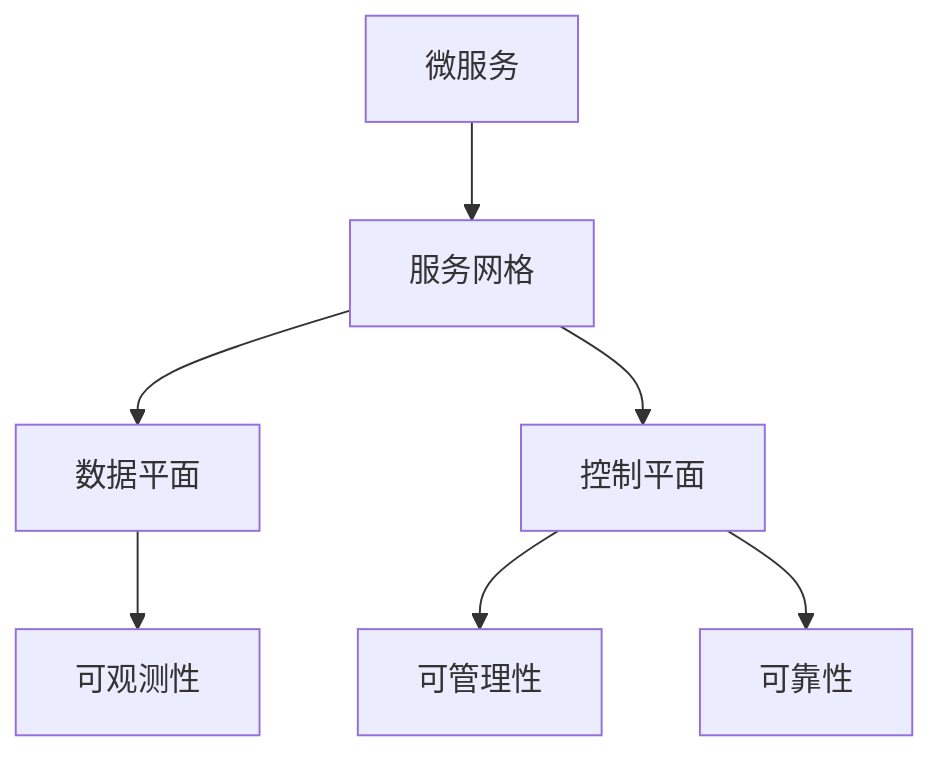

                 

# 服务网格（Service Mesh）：微服务通信的基础设施

> 关键词：服务网格,微服务,通信,基础设施,分布式系统

## 1. 背景介绍

### 1.1 问题由来
随着软件架构的演变，传统的单体应用逐渐演变成由多个微服务组成的分散式分布式系统。这种架构提高了系统的灵活性、可扩展性和开发效率，但也带来了复杂的跨服务通信和状态管理问题。微服务之间的通信通常依赖于简单的网络协议，如HTTP、REST，但这种无状态的通信方式难以满足高性能、高可靠性和安全性等需求。

### 1.2 问题核心关键点
服务网格（Service Mesh）应运而生，成为微服务通信的重要基础设施。它是一个独立于应用程序的数据平面，通过隐藏微服务间通信的复杂性，提高微服务的可观测性、可管理性和可靠性，从而加速微服务架构的演进。

### 1.3 问题研究意义
服务网格为微服务架构提供了可靠、高效、可维护的通信基础设施，是构建复杂、可扩展、高可用分布式系统的关键技术。通过使用服务网格，开发者能够更容易地构建和运维分布式系统，提升应用的性能、可用性和安全性。同时，服务网格还为微服务架构提供了重要的学术和工业研究背景，推动了分布式系统领域的理论发展和应用实践。

## 2. 核心概念与联系

### 2.1 核心概念概述

为更好地理解服务网格在微服务架构中的作用，本节将介绍几个密切相关的核心概念：

- **微服务（Microservices）**：将复杂应用拆分为多个小规模、高内聚、松耦合的服务单元。微服务通过服务注册和发现机制，实现服务的自动注册和故障自愈。
- **服务网格（Service Mesh）**：一个独立于应用程序的数据平面，负责管理微服务之间的通信，隐藏复杂的通信逻辑，提供可观测性、可管理性和可靠性等功能。
- **数据平面（Data Plane）**：服务网格的通信网络，负责微服务之间的数据流控制和通信优化。
- **控制平面（Control Plane）**：服务网格的管理网络，负责配置、部署和监控等功能。
- **可观测性（Observability）**：服务网格提供对微服务的全面监控、诊断和故障定位能力。
- **可管理性（Manageability）**：服务网格提供了服务发现、路由、限流、熔断等管理功能，提升了微服务架构的可管理性。
- **可靠性（Reliability）**：服务网格提供了重试、超时、熔断等机制，提升了微服务的容错能力和稳定性。

这些核心概念之间的逻辑关系可以通过以下Mermaid流程图来展示：



这个流程图展示了大语言模型的核心概念及其之间的关系：

1. 微服务通过服务网格进行通信，数据平面负责管理数据流，控制平面负责配置和监控。
2. 可观测性、可管理性和可靠性都是服务网格的核心能力。
3. 服务网格通过隐藏微服务的通信逻辑，使得微服务架构更加简单、高效、可维护。

## 3. 核心算法原理 & 具体操作步骤
### 3.1 算法原理概述

服务网格的通信模型主要基于两个核心算法：

- **路由算法**：在微服务之间的通信过程中，服务网格负责选择最优的通信路径，隐藏路由细节，提升通信性能。
- **网络过滤算法**：服务网格在通信路径上加入一些中间件，进行流量控制、安全过滤、限流等操作，提升微服务的健壮性和安全性。

### 3.2 算法步骤详解

服务网格的通信过程主要包括以下几个关键步骤：

**Step 1: 服务注册**
- 微服务通过服务注册中心（如etcd、Consul等）注册服务信息。
- 服务注册中心负责记录服务的元数据，包括服务地址、端口、健康状态等。

**Step 2: 服务发现**
- 当服务网格需要调用一个微服务时，通过服务注册中心查找对应的服务元数据。
- 根据服务元数据，服务网格构建虚拟IP地址和负载均衡器，隐藏微服务的真实地址和端口。

**Step 3: 路由选择**
- 服务网格根据负载均衡算法和路由策略，选择最优的通信路径。
- 常见的路由策略包括随机路由、轮询路由、权重路由等。

**Step 4: 网络过滤**
- 服务网格在通信路径上加入中间件，进行流量控制、安全过滤、限流等操作。
- 常见的过滤策略包括请求限流、重试机制、熔断机制等。

**Step 5: 可观测性**
- 服务网格记录通信过程的日志、统计信息和故障信息。
- 使用日志分析、网络拓扑、性能指标等工具，实时监控微服务的运行状态。

**Step 6: 可管理性**
- 服务网格提供服务发现、路由管理、负载均衡、故障恢复等功能。
- 通过用户界面和API接口，对服务网格进行配置和管理。

### 3.3 算法优缺点

服务网格具有以下优点：

1. **提升微服务的可观测性**：服务网格提供了丰富的监控和诊断工具，使得开发者能够轻松定位故障和性能瓶颈。
2. **简化微服务的通信逻辑**：服务网格隐藏了微服务间的通信细节，使得开发者专注于业务逻辑的实现。
3. **提升微服务的可靠性**：服务网格提供了重试、熔断、限流等机制，提升了微服务的容错能力和稳定性。
4. **增强微服务的可管理性**：服务网格提供了丰富的管理功能，提升了微服务架构的可管理性。

同时，服务网格也存在一些局限性：

1. **性能开销**：服务网格引入了额外的通信开销和中间件，可能会影响微服务的性能。
2. **复杂性**：服务网格增加了系统的复杂性，需要额外的维护和管理成本。
3. **部署难度**：服务网格需要在所有微服务中进行部署和配置，增加了部署难度。
4. **依赖性**：服务网格依赖于网络通信和中间件，网络问题可能会影响服务网格的正常工作。

尽管存在这些局限性，但服务网格在微服务架构中的地位不可替代，已成为构建大规模、复杂分布式系统的关键技术。

### 3.4 算法应用领域

服务网格广泛应用于各类分布式系统，以下是几个典型应用场景：

- **微服务架构**：服务网格是微服务架构的天然基础设施，通过服务网格，微服务架构能够更好地管理和维护。
- **容器化应用**：服务网格与容器化应用如Kubernetes、Docker等高度兼容，能够无缝集成，提升容器化应用的性能和可靠性。
- **云原生应用**：服务网格与云原生技术如Istio、Linkerd等无缝结合，能够提供统一的通信和管理功能，提升云原生应用的部署和运维效率。
- **大规模系统**：服务网格适用于大规模分布式系统的构建，通过服务网格，能够高效管理大量微服务的通信和状态。
- **高可用系统**：服务网格提供故障自愈和熔断机制，提升了系统的容错能力和可用性。

服务网格在微服务架构中的应用，大大提升了微服务系统的性能、可维护性和可扩展性，为大规模分布式系统的构建提供了强有力的支持。

## 4. 数学模型和公式 & 详细讲解 & 举例说明

### 4.1 数学模型构建

服务网格的通信模型涉及多个模块的协同工作，包括服务注册、路由选择、网络过滤等。我们可以使用数学模型来描述服务网格的工作流程。

假设系统中有$N$个微服务，编号为$0$到$N-1$。微服务之间通过服务网格进行通信，服务网格的通信过程可以描述为一系列的序列操作，每个操作可以表示为$O_i$，其中$i$表示操作的编号。服务网格的操作集合为$O=\{O_0, O_1, ..., O_{N-1}\}$。

服务网格的通信过程可以表示为一个有向无环图（DAG），其中节点表示微服务，边表示通信路径。服务网格的路由选择算法可以描述为求解该DAG的最短路径问题。

### 4.2 公式推导过程

为了简化问题，我们假设每个微服务只有一个接口，服务网格的路由算法可以描述为求解以下最短路径问题：

$$
\min_{p_i} \sum_{i=0}^{N-1} \omega_{i-1,i} \cdot p_i
$$

其中，$\omega_{i-1,i}$表示从微服务$i-1$到微服务$i$的通信成本，$p_i$表示微服务$i$的处理时间。

求解上述最短路径问题的经典算法有Dijkstra算法、A*算法等。这些算法的时间复杂度为$O(N^3)$或$O(N^2\log N)$，在微服务数量较多的情况下，计算复杂度较高。为了提高算法的效率，服务网格通常采用近似算法或启发式算法。

### 4.3 案例分析与讲解

以Google的Istio服务网格为例，分析其在微服务架构中的应用。

Istio是一个开源的服务网格，提供了丰富的路由和网络过滤功能。假设系统中有两个微服务$A$和$B$，需要进行通信。在Istio中，微服务$A$和服务网格的交互过程如下：

1. 微服务$A$通过服务注册中心注册服务信息。
2. 服务网格查询服务注册中心，获取微服务$A$的服务元数据。
3. 服务网格构建虚拟IP地址和负载均衡器，将请求路由到微服务$A$的实例。
4. 服务网格在通信路径上加入中间件，进行流量控制、安全过滤、限流等操作。
5. 服务网格记录通信过程的日志、统计信息和故障信息，进行可观测性分析。
6. 服务网格通过用户界面和API接口，提供管理功能，进行可管理性操作。

Istio的路由算法使用了基于负载均衡器的路由策略，将请求路由到最优的微服务实例。Istio的网络过滤算法则包括了请求限流、重试机制、熔断机制等，提升了微服务的健壮性和可靠性。

## 5. 项目实践：代码实例和详细解释说明

### 5.1 开发环境搭建

在进行Istio的部署和配置时，需要搭建好开发环境。以下是使用Kubernetes进行Istio部署的环境配置流程：

1. 安装Kubernetes集群：可以使用Minikube、AKS、EKS等工具搭建Kubernetes集群。
2. 安装Istio：可以使用Istio官方的Helm图表或Kubernetes Deployment进行部署。
3. 配置Istio网络：配置Istio网络虚拟化，将微服务网络连接到一个虚拟网络中。
4. 配置服务网格控制器：配置Istio的服务网格控制器，确保能够正常处理微服务之间的通信。
5. 配置负载均衡器：配置Istio的虚拟IP地址和负载均衡器，确保请求能够正确路由到微服务实例。

完成上述步骤后，即可在Kubernetes集群中部署和配置Istio服务网格，进行微服务通信的实践。

### 5.2 源代码详细实现

以下是Istio服务网格的部署配置示例，详细说明了如何通过Helm图表进行Istio部署：

```yaml
apiVersion: apps/v1
kind: Deployment
metadata:
  name: service-mesh
spec:
  selector:
    matchLabels:
      hello: world
  replicas: 3
  template:
    metadata:
      labels:
        hello: world
    spec:
      containers:
      - name: hello
        image: hello:latest
```

在上面的示例中，我们定义了一个名为`hello`的微服务，通过Kubernetes Deployment进行部署。

### 5.3 代码解读与分析

让我们再详细解读一下关键代码的实现细节：

**Helm图表**：
- `apiVersion`字段定义了Helm图表的API版本，确保与Kubernetes兼容。
- `kind`字段定义了Helm图表的类型，指定了Deployment。
- `metadata`字段定义了微服务的标签信息，方便Kubernetes进行服务发现和负载均衡。
- `spec`字段定义了微服务的配置，包括副本数量、容器镜像、资源配置等。

**Kubernetes Deployment**：
- `selector`字段定义了匹配标签，确保部署的Pod与Helm图表中的标签一致。
- `replicas`字段指定了Pod的副本数量，保证服务的可用性。
- `template`字段定义了Pod的配置，包括容器镜像、CPU和内存配置等。
- `spec`字段进一步详细定义了容器的配置，包括容器镜像、环境变量、日志配置等。

通过上述代码，我们可以在Kubernetes集群中部署一个简单的微服务，并通过Istio服务网格进行通信和调度。

### 5.4 运行结果展示

在成功部署和配置Istio服务网格后，我们可以使用Kubectl命令行工具对微服务进行测试。以下是一个简单的测试命令：

```bash
kubectl run hello --image=hello:latest --port=8080 --env=MESSAGE=Hello
kubectl expose deployment hello --port=80 --type=NodePort
```

在上述命令中，我们首先运行了一个名为`hello`的Pod，监听8080端口，并设置环境变量`MESSAGE`。然后，我们暴露了`hello`的80端口，使其能够通过NodePort类型暴露到集群外部。

执行完成后，我们可以通过访问NodePort地址，验证微服务的正常运行。

## 6. 实际应用场景

### 6.1 智能交通系统

智能交通系统是典型的微服务架构，服务网格在此类系统中发挥了重要作用。通过服务网格，系统能够高效管理交通数据的采集、处理和分析，实现智能交通管理。

具体而言，服务网格可以管理交通监控摄像头、交通信号灯、车辆定位系统等服务之间的通信，提供数据融合和实时处理能力。服务网格还可以提供流量控制、限流、重试机制，确保系统在高负载情况下的稳定性和可靠性。

### 6.2 电子商务平台

电子商务平台也需要大规模的微服务架构来支持业务的高并发和高可用性。服务网格在此类系统中同样发挥了重要作用。

通过服务网格，系统能够高效管理商品信息、订单处理、支付服务等功能模块之间的通信，提供一致的服务接口和可观测性能力。服务网格还可以提供流量控制、限流、熔断机制，确保系统在高负载情况下的稳定性和可靠性。

### 6.3 金融交易系统

金融交易系统对系统的实时性和可靠性要求非常高。服务网格在此类系统中同样发挥了重要作用。

通过服务网格，系统能够高效管理交易订单、资金清算、风控服务等功能模块之间的通信，提供实时数据处理和可观测性能力。服务网格还可以提供流量控制、限流、熔断机制，确保系统在高负载情况下的稳定性和可靠性。

## 7. 工具和资源推荐

### 7.1 学习资源推荐

为了帮助开发者系统掌握Istio的原理和实践，这里推荐一些优质的学习资源：

1. Istio官方文档：Istio的官方文档，详细介绍了Istio的架构和使用方法，是上手实践的必备资料。
2. Google Cloud Blog：Google Cloud官方博客，提供了丰富的Istio部署和配置指南，适合学习者参考。
3. Kubernetes官方文档：Kubernetes的官方文档，提供了Kubernetes集群和部署的基本知识，是Istio部署的前提。
4. Spring Cloud与Istio整合文档：Spring Cloud官方文档，提供了Spring Cloud和Istio的整合使用案例，适合开发者参考。
5. Docker官方文档：Docker的官方文档，提供了Docker容器的基本知识和使用方法，是微服务部署的基础。

通过对这些资源的学习实践，相信你一定能够快速掌握Istio的精髓，并用于解决实际的微服务问题。

### 7.2 开发工具推荐

高效的开发离不开优秀的工具支持。以下是几款用于Istio开发的常用工具：

1. Kubernetes：由Google主导开发的容器编排系统，能够高效管理微服务集群。
2. Helm：一个基于Kubernetes的包管理工具，方便微服务的部署和配置。
3. Istio：Istio的开源项目，提供了服务网格的完整功能，支持丰富的路由和网络过滤算法。
4. Google Cloud：Google提供的云平台，提供了丰富的云服务和资源，支持Istio的部署和运行。
5. Docker：Docker的开源项目，提供了容器化的解决方案，方便微服务的打包和部署。
6. Prometheus和Grafana：用于监控和可视化的工具，提供了实时监控和报警功能。

合理利用这些工具，可以显著提升Istio的开发效率，加快创新迭代的步伐。

### 7.3 相关论文推荐

Istio的快速发展离不开学界的持续研究。以下是几篇奠基性的相关论文，推荐阅读：

1. Middleware for Microservices, Federated Systems, and the Internet of Things（Istio论文）：提出了Istio服务网格的概念和设计，成为服务网格的开创性工作。
2. SREII: Supporting Continuous Deployment in Data-Centric Applications（Istio论文）：介绍了Istio在数据中心应用中的使用案例，展示了Istio的强大功能。
3. Microservices, by Example: Deploying Kubernetes, Prometheus, and Java Microservices（Istio论文）：提供了Istio的实际部署和配置案例，适合学习者参考。
4. An Overview of the Istio Continuous Deployment Model（Istio论文）：介绍了Istio的持续部署模型，展示了Istio的部署效率。
5. End-to-End Communication Services for a Microservices Architecture（Istio论文）：介绍了Istio的网络过滤和路由算法，展示了Istio的通信性能。

这些论文代表了大语言模型微调技术的发展脉络。通过学习这些前沿成果，可以帮助研究者把握学科前进方向，激发更多的创新灵感。

## 8. 总结：未来发展趋势与挑战

### 8.1 总结

本文对Istio服务网格进行了全面系统的介绍。首先阐述了Istio在微服务架构中的作用和重要性，明确了服务网格在微服务通信中的关键地位。其次，从原理到实践，详细讲解了Istio的数学模型和实现流程，给出了微服务通信的完整代码实例。同时，本文还广泛探讨了Istio在智能交通、电子商务、金融交易等领域的实际应用，展示了Istio的强大能力和应用前景。此外，本文精选了Istio的学习资源、开发工具和相关论文，力求为开发者提供全方位的技术指引。

通过本文的系统梳理，可以看到，Istio作为微服务架构的基础设施，在构建高效、可靠、可维护的分布式系统中发挥了重要作用。未来，伴随Istio的不断演进，服务网格必将在微服务架构中发挥更大的作用，为构建复杂、可扩展、高可用分布式系统提供强有力的支持。

### 8.2 未来发展趋势

展望未来，Istio服务网格将呈现以下几个发展趋势：

1. **功能丰富化**：随着微服务架构的不断发展，Istio的功能将更加丰富，支持更多的通信协议和服务。
2. **性能优化**：Istio将在通信性能、路由算法等方面进行持续优化，提高系统的响应速度和吞吐量。
3. **可扩展性提升**：Istio将支持更大规模的微服务集群，提供更灵活的扩展和部署方案。
4. **安全性增强**：Istio将在网络过滤、安全过滤等方面进行增强，提升系统的安全性和稳定性。
5. **跨云集成**：Istio将在不同的云平台和数据中心中实现无缝集成，提升系统的灵活性和兼容性。

以上趋势凸显了Istio服务网格的广阔前景。这些方向的探索发展，必将进一步提升Istio的服务能力，为构建复杂、可扩展、高可用分布式系统提供强有力的支持。

### 8.3 面临的挑战

尽管Istio服务网格已经取得了显著成就，但在迈向更加智能化、普适化应用的过程中，它仍面临着诸多挑战：

1. **学习曲线陡峭**：Istio的功能和配置相对复杂，学习曲线较陡，需要一定的学习成本。
2. **性能开销**：Istio引入了额外的通信开销和中间件，可能会影响微服务的性能。
3. **部署难度**：Istio需要在所有微服务中进行部署和配置，增加了部署难度。
4. **依赖性**：Istio依赖于网络通信和中间件，网络问题可能会影响Istio的正常工作。
5. **资源消耗**：Istio的部署和运行需要一定的资源消耗，特别是在大规模微服务集群中。

尽管存在这些挑战，但Istio在微服务架构中的地位不可替代，已成为构建大规模、复杂分布式系统的关键技术。

### 8.4 研究展望

面对Istio面临的这些挑战，未来的研究需要在以下几个方面寻求新的突破：

1. **简化配置和使用**：通过提供更友好的界面和自动化配置工具，简化Istio的部署和使用，降低学习成本。
2. **提升性能和可扩展性**：通过优化路由算法和网络过滤算法，提高Istio的性能和可扩展性。
3. **增强安全性和可靠性**：通过引入更多的安全机制和容错机制，增强Istio的安全性和可靠性。
4. **跨云集成**：通过实现Istio在多个云平台和数据中心中的无缝集成，提升系统的灵活性和兼容性。
5. **引入更多功能**：通过引入新的功能模块，如分布式事务、服务网格的可视化等，增强Istio的服务能力。

这些研究方向的探索，必将引领Istio服务网格技术迈向更高的台阶，为构建更加高效、可靠、可维护的分布式系统提供强有力的支持。

## 9. 附录：常见问题与解答

**Q1: Istio服务网格是否适用于所有微服务架构？**

A: Istio服务网格适用于大多数微服务架构，特别是对于高可用、高性能、高可靠性的分布式系统。然而，对于一些特定领域的应用，Istio可能需要做一些定制化配置和优化。

**Q2: Istio的性能开销是否影响微服务的性能？**

A: Istio的性能开销在一定程度上会影响微服务的性能，特别是在网络通信和中间件方面。为了缓解这个问题，可以使用Istio的网络优化工具，如网络过滤、限流等，提升系统的性能和可用性。

**Q3: Istio的部署难度是否较高？**

A: Istio的部署难度相对较高，特别是在大规模微服务集群中。为了简化部署，可以使用Istio的自动化部署工具，如Helm、Spinnaker等，提高部署效率和自动化水平。

**Q4: Istio是否依赖于特定的网络环境？**

A: Istio依赖于网络通信和中间件，网络问题可能会影响Istio的正常工作。为了提高Istio的鲁棒性，可以使用Istio的网络优化工具，如路由策略、网络过滤等，增强系统的容错能力和可靠性。

**Q5: Istio的网络过滤算法是否影响微服务的可观测性？**

A: Istio的网络过滤算法会影响微服务的可观测性，但可以通过合理的配置和优化，提升Istio的可观测性。例如，可以使用Istio的监控和可视化工具，如Prometheus、Grafana等，实时监控微服务的运行状态。

---

作者：禅与计算机程序设计艺术 / Zen and the Art of Computer Programming

