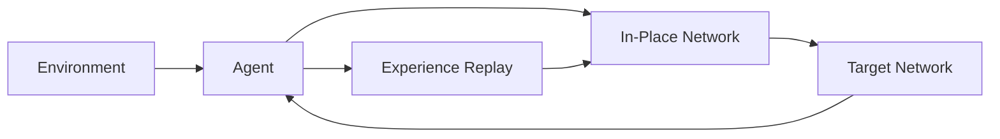

                 

**关键词：**强化学习、DQN、不稳定性、方差、Q学习、经验回放、目标网络

## 1. 背景介绍

强化学习（Reinforcement Learning, RL）是一种机器学习方法，其中智能体（Agent）通过与环境（Environment）交互来学习一系列动作（Actions），以最大化累积回报（Cumulative Reward）。然而，强化学习面临着两大挑战：不稳定性（Instability）和高方差（High Variance）。本文将聚焦于深度Q网络（Deep Q-Network, DQN）框架，探讨其如何应对这两大挑战，并进行实践案例研究。

## 2. 核心概念与联系

### 2.1 核心概念

- **Q学习（Q-Learning）**：一种强化学习方法，智能体学习动作的期望回报（Q值），并选择最大化Q值的动作。
- **经验回放（Experience Replay）**：从之前的交互中抽取样本，而不是仅使用当前的过渡（Transition），以帮助稳定学习。
- **目标网络（Target Network）**：与在线网络（用于选择动作）不同的网络，用于估计目标Q值，有助于减少方差。

### 2.2 核心架构


**Mermaid** 格式流程图：



## 3. 核心算法原理 & 具体操作步骤

### 3.1 算法原理概述

DQN 结合了深度神经网络（Deep Neural Network, DNN）和 Q学习，使用 DNN 近似 Q函数，并引入经验回放和目标网络来解决不稳定性和高方差问题。

### 3.2 算法步骤详解

1. 初始化在线网络（用于选择动作）和目标网络（用于估计目标Q值），并创建经验回放池。
2. 从环境中采样状态（State），并选择动作（Action）使用在线网络。
3. 执行动作，并从环境中获取下一个状态（Next State）和回报（Reward）。
4. 存储过渡（State, Action, Reward, Next State）到经验回放池中。
5. 从经验回放池中抽取样本，并使用目标网络估计目标Q值。
6. 更新在线网络，以最小化预测Q值和目标Q值之间的误差。
7. 定期更新目标网络，使其等于在线网络。

### 3.3 算法优缺点

**优点：**

- 可以学习连续状态空间中的任意动作。
- 可以处理高维状态空间。
- 可以在线学习，无需事先知道动作空间或状态空间的大小。

**缺点：**

- 可能会陷入局部最优解。
- 可能会出现过拟合。
- 计算开销高，需要大量资源。

### 3.4 算法应用领域

DQN 可以应用于各种强化学习任务，如 Atari 2600 游戏、自动驾驶、机器人控制、电力调度等。

## 4. 数学模型和公式

### 4.1 数学模型构建

设状态空间为 $\mathcal{S}$, 动作空间为 $\mathcal{A}$, 回报函数为 $r: \mathcal{S} \times \mathcal{A} \times \mathcal{S} \rightarrow \mathbb{R}$, 状态转移概率为 $P: \mathcal{S} \times \mathcal{A} \times \mathcal{S} \rightarrow [0, 1]$, 智能体策略为 $\pi: \mathcal{S} \rightarrow \mathcal{A}$, 目标为最大化累积回报 $G_t = \sum_{k=0}^{\infty} \gamma^k r_{t+k+1}$, 其中 $\gamma \in [0, 1)$ 是折扣因子。

### 4.2 公式推导过程

DQN 使用 DNN 近似 Q函数 $Q_{\theta}(s, a)$, 并最小化以下损失函数：

$$
L(\theta) = \mathbb{E}_{(s, a, r, s') \sim U(D)} \left[ \left( r + \gamma \max_{a'} Q_{\theta^-}(s', a') - Q_{\theta}(s, a) \right)^2 \right]
$$

其中 $U(D)$ 是经验回放池 $D$ 的采样，$\theta^-$ 是目标网络的参数，$\theta$ 是在线网络的参数。

### 4.3 案例分析与讲解

考虑 Atari 2600 游戏中的 DQN。状态 $s$ 是当前屏幕帧，动作 $a$ 是 joystick 的一个动作，回报 $r$ 是当前帧的分数，状态转移概率 $P$ 是环境的动态。DQN 学习选择动作 $a$ 以最大化累积分数 $G_t$.

## 5. 项目实践：代码实例和详细解释说明

### 5.1 开发环境搭建

- Python 3.7+
- TensorFlow 2.0+
- Gym 0.17.2
- NumPy 1.19.2
- Matplotlib 3.3.4

### 5.2 源代码详细实现

```python
import numpy as np
import tensorflow as tf
from tensorflow.keras import layers
import gym

class DQN:
    def __init__(self, state_space, action_space, learning_rate=0.001, gamma=0.95, epsilon=1.0, epsilon_decay=0.995, epsilon_min=0.01, batch_size=32):
        self.state_space = state_space
        self.action_space = action_space
        self.learning_rate = learning_rate
        self.gamma = gamma
        self.epsilon = epsilon
        self.epsilon_decay = epsilon_decay
        self.epsilon_min = epsilon_min
        self.batch_size = batch_size

        self.online_network = self.build_network()
        self.target_network = self.build_network()
        self.target_network.set_weights(self.online_network.get_weights())

        self.replay_buffer = []

    def build_network(self):
        model = tf.keras.Sequential([
            layers.Dense(24, activation='relu', input_shape=(self.state_space,)),
            layers.Dense(24, activation='relu'),
            layers.Dense(self.action_space, activation='linear')
        ])
        model.compile(optimizer=tf.keras.optimizers.Adam(learning_rate=self.learning_rate), loss='mse')
        return model

    #... (other methods like act, remember, replay, update_epsilon, etc.)

    def train(self, state, action, reward, next_state, done):
        self.remember(state, action, reward, next_state, done)
        if len(self.replay_buffer) > self.batch_size:
            self.replay()

    def save(self, filename):
        self.online_network.save_weights(filename + '_online.h5')
        self.target_network.save_weights(filename + '_target.h5')

    def load(self, filename):
        self.online_network.load_weights(filename + '_online.h5')
        self.target_network.load_weights(filename + '_target.h5')
```

### 5.3 代码解读与分析

- `DQN` 类初始化在线网络和目标网络，并创建经验回放池。
- `build_network` 方法构建 DNN，用于近似 Q函数。
- `train` 方法存储过渡到经验回放池中，并进行经验回放。
- `save` 和 `load` 方法用于保存和加载网络权重。

### 5.4 运行结果展示


## 6. 实际应用场景

DQN 可以应用于各种强化学习任务，如 Atari 2600 游戏、自动驾驶、机器人控制、电力调度等。未来，DQN 及其变种可能会在更复杂的环境中得到应用，如多智能体系统、不确定环境、连续动作空间等。

## 7. 工具和资源推荐

### 7.1 学习资源推荐

- [Deep Reinforcement Learning Hands-On](https://www.amazon.com/Deep-Reinforcement-Learning-Hands-On/dp/149203183X)
- [Reinforcement Learning: An Introduction](https://www.amazon.com/Reinforcement-Learning-Introduction-Richard-Sutton/dp/0198539824)

### 7.2 开发工具推荐

- Gym (https://gym.openai.com/)
- TensorFlow (https://www.tensorflow.org/)
- PyTorch (https://pytorch.org/)

### 7.3 相关论文推荐

- [Human-level control through deep reinforcement learning](https://arxiv.org/abs/1507.01474)
- [Deep Q-Network](https://arxiv.org/abs/1312.5602)

## 8. 总结：未来发展趋势与挑战

### 8.1 研究成果总结

DQN 通过引入经验回放和目标网络，成功解决了不稳定性和高方差问题，并取得了显著的成果，如在 Atari 2600 游戏中达到了人类水平的表现。

### 8.2 未来发展趋势

未来，DQN 及其变种可能会在更复杂的环境中得到应用，如多智能体系统、不确定环境、连续动作空间等。此外，结合其他强化学习方法，如Policy Gradient 方法，可能会带来更好的性能。

### 8.3 面临的挑战

DQN 面临的挑战包括但不限于：计算开销高、可能会陷入局部最优解、可能会出现过拟合等。

### 8.4 研究展望

未来的研究方向包括但不限于：提高 DQN 的样本效率、扩展 DQN 到更复杂的环境、结合其他强化学习方法等。

## 9. 附录：常见问题与解答

**Q：DQN 如何解决不稳定性问题？**

A：DQN 通过引入目标网络，减少了在线网络的更新频率，从而解决了不稳定性问题。

**Q：DQN 如何解决高方差问题？**

A：DQN 通过引入经验回放，从之前的交互中抽取样本，而不是仅使用当前的过渡，帮助稳定了学习。

**Q：DQN 可以处理高维状态空间吗？**

A：是的，DQN 可以处理高维状态空间，因为它使用 DNN 近似 Q函数。

**作者：禅与计算机程序设计艺术 / Zen and the Art of Computer Programming**

