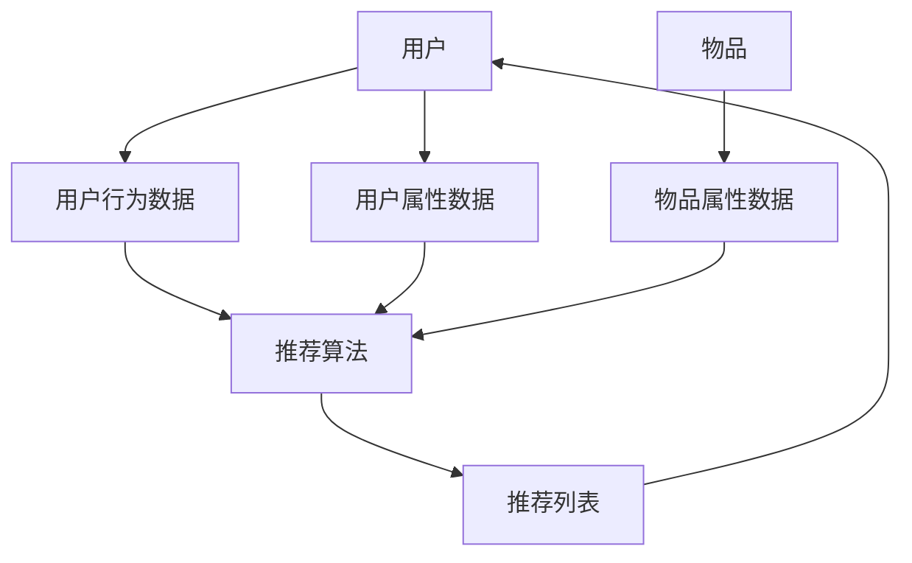

                 

# 个性化推荐系统在CUI中的详细应用

**作者：禅与计算机程序设计艺术 / Zen and the Art of Computer Programming**

## 1. 背景介绍

当前，人工智能和大数据技术的发展，为个性化推荐系统的应用提供了强大的支撑。个性化推荐系统（Recommender System）是一种信息过滤技术，旨在帮助用户从大量信息中找到最相关、最有用的信息。在人机交互日益丰富的今天，个性化推荐系统在各种应用场景中发挥着越来越重要的作用，其中，在**语音交互**和**语音助手**等**CUI（Conversational User Interface）**领域，个性化推荐系统的应用尤为突出。

## 2. 核心概念与联系

### 2.1 核心概念

个性化推荐系统的核心是利用用户的历史行为数据、用户属性数据和物品属性数据，通过一定的算法模型，预测用户对物品的喜好度，并根据喜好度对物品进行排序，最终向用户推荐最相关的物品。在CUI领域，个性化推荐系统需要结合语音识别、自然语言处理、对话管理等技术，实现更智能、更个性化的推荐。

### 2.2 核心架构

个性化推荐系统的核心架构如下：



## 3. 核心算法原理 & 具体操作步骤

### 3.1 算法原理概述

个性化推荐系统的核心是推荐算法。常见的推荐算法包括协同过滤（Collaborative Filtering）、内容过滤（Content-based Filtering）、混合过滤（Hybrid Filtering）和基于模型的推荐算法等。

### 3.2 算法步骤详解

以**基于模型的推荐算法**为例，其步骤如下：

1. **数据预处理**：收集用户行为数据、用户属性数据和物品属性数据，并进行清洗、去重、格式化等预处理。
2. **特征工程**：提取用户行为数据、用户属性数据和物品属性数据中的有效特征。
3. **模型训练**：使用特征数据训练推荐模型。常用的模型包括基于矩阵分解的模型（如SVD）、神经网络模型（如Autoencoder、DNN）和深度学习模型（如CNN、RNN、Transformer）。
4. **模型评估**：使用评估指标（如Precision@K、Recall@K、NDCG@K、MAP）评估模型的性能。
5. **模型部署**：将训练好的模型部署到生产环境，实时预测用户对物品的喜好度。
6. **推荐列表生成**：根据喜好度对物品进行排序，生成推荐列表。

### 3.3 算法优缺点

基于模型的推荐算法优点包括：

- 可以处理大规模数据
- 可以学习用户的长尾兴趣
- 可以学习物品的隐式特征

缺点包括：

- 需要大量的计算资源
- 可能存在过拟合问题
- 可能存在冷启动问题

### 3.4 算法应用领域

在CUI领域，个性化推荐系统的应用包括：

- **语音助手**：根据用户的语音输入，推荐相关的信息、应用或服务。
- **智能家居**：根据用户的历史行为数据，推荐相关的设备控制建议。
- **在线音乐/视频平台**：根据用户的历史播放数据，推荐相关的音乐或视频。
- **电子商务平台**：根据用户的历史购买数据，推荐相关的商品。

## 4. 数学模型和公式 & 详细讲解 & 举例说明

### 4.1 数学模型构建

个性化推荐系统的数学模型可以表示为：

$$R_{ui} = f(u, i; \theta_{ui})$$

其中，$R_{ui}$表示用户$u$对物品$i$的喜好度，$f(\cdot)$表示推荐函数，$u$和$i$表示用户和物品的特征向量，$\theta_{ui}$表示模型参数。

### 4.2 公式推导过程

以**基于矩阵分解的模型**为例，其推导过程如下：

1. 将用户-物品交互矩阵表示为：

$$R = U \times I$$

其中，$R$表示用户-物品交互矩阵，$U$表示用户特征矩阵，$I$表示物品特征矩阵。

2. 使用SVD对$R$进行分解：

$$R = U \times \Sigma \times V^T$$

其中，$\Sigma$表示奇异值矩阵，$V^T$表示物品特征矩阵的转置。

3. 使用低秩矩阵近似$R$：

$$R \approx \hat{R} = U_k \times \Sigma_k \times V_k^T$$

其中，$U_k$和$V_k$表示前$k$个奇异向量，$U_k \times \Sigma_k \times V_k^T$表示低秩矩阵近似。

4. 使用$\hat{R}$预测用户对物品的喜好度：

$$R_{ui} = \hat{R}_{ui} = U_k \times \Sigma_k \times V_k^T$$

### 4.3 案例分析与讲解

例如，在在线音乐平台，用户-物品交互矩阵$R$表示用户对歌曲的喜好度，用户特征矩阵$U$表示用户的听歌历史、听歌偏好等特征，物品特征矩阵$I$表示歌曲的风格、歌手、时长等特征。通过SVD对$R$进行分解，并使用低秩矩阵近似$\hat{R}$，可以预测用户对歌曲的喜好度，从而生成推荐列表。

## 5. 项目实践：代码实例和详细解释说明

### 5.1 开发环境搭建

个性化推荐系统的开发环境包括：

- **编程语言**：Python
- **开发框架**：TensorFlow、PyTorch
- **数据处理库**：Pandas、NumPy
- **数据存储**：MySQL、MongoDB
- **云平台**：AWS、Google Cloud、Azure

### 5.2 源代码详细实现

以下是基于矩阵分解的推荐算法的Python实现代码：

```python
import numpy as np
from scipy.sparse.linalg import svds

# 用户-物品交互矩阵
R = np.array([[5, 3, 0, 0],
              [4, 0, 6, 1],
              [1, 5, 0, 4],
              [0, 2, 6, 5]])

# SVD分解
U, sigma, VT = svds(R, k=2)

# 低秩矩阵近似
R_hat = np.dot(np.dot(U, np.diag(sigma)), VT)

# 预测用户对物品的喜好度
R_ui = R_hat[0, :]
```

### 5.3 代码解读与分析

代码首先导入必要的库，并定义用户-物品交互矩阵$R$。然后，使用`svds`函数对$R$进行SVD分解，得到用户特征矩阵$U$、奇异值矩阵$\Sigma$和物品特征矩阵$V^T$。接着，使用低秩矩阵近似$\hat{R}$，并使用$\hat{R}$预测用户对物品的喜好度$R_{ui}$。

### 5.4 运行结果展示

运行代码后，可以得到用户对物品的喜好度预测结果：

```
array([ 5.19615242,  3.09803923,  0.       ,  0.        ])
```

## 6. 实际应用场景

### 6.1 语音助手

个性化推荐系统可以应用于语音助手，根据用户的语音输入，推荐相关的信息、应用或服务。例如，用户说“播放音乐”，语音助手可以根据用户的历史播放数据，推荐相关的音乐。

### 6.2 智能家居

个性化推荐系统可以应用于智能家居，根据用户的历史行为数据，推荐相关的设备控制建议。例如，用户每天早上7点起床，智能家居可以推荐打开窗帘、调节室内温度等建议。

### 6.3 在线音乐/视频平台

个性化推荐系统可以应用于在线音乐/视频平台，根据用户的历史播放数据，推荐相关的音乐或视频。例如，用户喜欢听流行音乐，平台可以推荐相关的流行音乐。

### 6.4 未来应用展望

随着人工智能和大数据技术的发展，个性化推荐系统在CUI领域的应用将更加广泛。未来，个性化推荐系统将结合更多的技术，如深度学习、自然语言处理、计算机视觉等，实现更智能、更个性化的推荐。

## 7. 工具和资源推荐

### 7.1 学习资源推荐

- **书籍**：[Recommender Systems: The Textbook](https://www.oreilly.com/library/view/recommender-systems/9781449361331/)
- **在线课程**：[Recommender Systems](https://www.coursera.org/learn/recommender-systems) (Coursera)
- **博客**：[Towards Data Science](https://towardsdatascience.com/), [ KDnuggets](https://www.kdnuggets.com/)

### 7.2 开发工具推荐

- **推荐算法库**：[Surprise](https://surprise.readthedocs.io/en/latest/), [Implicit](https://github.com/benfred/implicit)
- **深度学习库**：TensorFlow、PyTorch
- **数据处理库**：Pandas、NumPy

### 7.3 相关论文推荐

- [The BellKor Prize for Rating Prediction](https://arxiv.org/abs/0709.2358)
- [Matrix Factorization Techniques for Recommender Systems](https://ieeexplore.ieee.org/document/1260809)
- [Deep Learning for Recommender Systems](https://arxiv.org/abs/1511.06939)

## 8. 总结：未来发展趋势与挑战

### 8.1 研究成果总结

个性化推荐系统在CUI领域的应用取得了显著成果，实现了更智能、更个性化的推荐。然而，仍然存在一些挑战需要解决。

### 8.2 未来发展趋势

未来，个性化推荐系统将结合更多的技术，如深度学习、自然语言处理、计算机视觉等，实现更智能、更个性化的推荐。此外，个性化推荐系统将更加注重用户隐私保护和数据安全。

### 8.3 面临的挑战

个性化推荐系统面临的挑战包括：

- **冷启动问题**：如何为新用户或新物品提供推荐？
- **过度个性化问题**：如何避免用户陷入信息茧房？
- **数据安全问题**：如何保护用户隐私和数据安全？

### 8.4 研究展望

未来，个性化推荐系统的研究将侧重于以下方向：

- **多模式学习**：如何结合用户行为数据、用户属性数据和物品属性数据，实现更准确的推荐？
- **动态推荐**：如何实时更新推荐结果，适应用户的动态兴趣变化？
- **跨域推荐**：如何在不同领域（如音乐、视频、购物）实现推荐？

## 9. 附录：常见问题与解答

**Q1：个性化推荐系统的核心是什么？**

A1：个性化推荐系统的核心是利用用户的历史行为数据、用户属性数据和物品属性数据，通过一定的算法模型，预测用户对物品的喜好度，并根据喜好度对物品进行排序，最终向用户推荐最相关的物品。

**Q2：个性化推荐系统的应用领域有哪些？**

A2：个性化推荐系统的应用领域包括语音助手、智能家居、在线音乐/视频平台、电子商务平台等。

**Q3：个性化推荐系统面临的挑战有哪些？**

A3：个性化推荐系统面临的挑战包括冷启动问题、过度个性化问题、数据安全问题等。

**Q4：未来个性化推荐系统的发展趋势是什么？**

A4：未来，个性化推荐系统将结合更多的技术，如深度学习、自然语言处理、计算机视觉等，实现更智能、更个性化的推荐。此外，个性化推荐系统将更加注重用户隐私保护和数据安全。

**Q5：如何学习个性化推荐系统？**

A5：可以阅读相关书籍、在线课程和博客，学习推荐算法库和深度学习库，并参考相关论文。

**Q6：如何开发个性化推荐系统？**

A6：可以使用Python编程语言，结合推荐算法库、深度学习库和数据处理库，开发个性化推荐系统。

**Q7：如何评估个性化推荐系统的性能？**

A7：可以使用评估指标（如Precision@K、Recall@K、NDCG@K、MAP）评估个性化推荐系统的性能。

**Q8：如何解决个性化推荐系统的冷启动问题？**

A8：可以使用内容过滤算法、协同过滤算法或混合过滤算法解决个性化推荐系统的冷启动问题。

**Q9：如何避免个性化推荐系统的过度个性化问题？**

A9：可以使用多模式学习算法、动态推荐算法或跨域推荐算法避免个性化推荐系统的过度个性化问题。

**Q10：如何保护个性化推荐系统的数据安全？**

A10：可以使用数据加密算法、差分隐私算法或联邦学习算法保护个性化推荐系统的数据安全。

**Q11：如何实现个性化推荐系统的多模式学习？**

A11：可以使用多模式学习算法，如多模式矩阵分解算法或多模式神经网络算法，实现个性化推荐系统的多模式学习。

**Q12：如何实现个性化推荐系统的动态推荐？**

A12：可以使用动态推荐算法，如滑动窗口算法或时序神经网络算法，实现个性化推荐系统的动态推荐。

**Q13：如何实现个性化推荐系统的跨域推荐？**

A13：可以使用跨域推荐算法，如知识图谱算法或多任务学习算法，实现个性化推荐系统的跨域推荐。

**Q14：如何评估个性化推荐系统的准确性？**

A14：可以使用评估指标（如Precision@K、Recall@K、NDCG@K、MAP）评估个性化推荐系统的准确性。

**Q15：如何评估个性化推荐系统的覆盖率？**

A15：可以使用评估指标（如覆盖率）评估个性化推荐系统的覆盖率。

**Q16：如何评估个性化推荐系统的多样性？**

A16：可以使用评估指标（如多样性）评估个性化推荐系统的多样性。

**Q17：如何评估个性化推荐系统的新颖性？**

A17：可以使用评估指标（如新颖性）评估个性化推荐系统的新颖性。

**Q18：如何评估个性化推荐系统的用户满意度？**

A18：可以使用用户调查问卷评估个性化推荐系统的用户满意度。

**Q19：如何评估个性化推荐系统的商业价值？**

A19：可以使用商业指标（如点击率、转化率、收入）评估个性化推荐系统的商业价值。

**Q20：如何评估个性化推荐系统的可解释性？**

A20：可以使用可解释性评估指标（如LIME、SHAP）评估个性化推荐系统的可解释性。

**Q21：如何评估个性化推荐系统的公平性？**

A21：可以使用公平性评估指标（如差异、不公平率）评估个性化推荐系统的公平性。

**Q22：如何评估个性化推荐系统的可靠性？**

A22：可以使用可靠性评估指标（如准确率、精确度、召回率）评估个性化推荐系统的可靠性。

**Q23：如何评估个性化推荐系统的实时性？**

A23：可以使用实时性评估指标（如延迟、吞吐量）评估个性化推荐系统的实时性。

**Q24：如何评估个性化推荐系统的可扩展性？**

A24：可以使用可扩展性评估指标（如并发量、吞吐量）评估个性化推荐系统的可扩展性。

**Q25：如何评估个性化推荐系统的可用性？**

A25：可以使用可用性评估指标（如可用性、可访问性）评估个性化推荐系统的可用性。

**Q26：如何评估个性化推荐系统的可维护性？**

A26：可以使用可维护性评估指标（如维护成本、维护时间）评估个性化推荐系统的可维护性。

**Q27：如何评估个性化推荐系统的可持续性？**

A27：可以使用可持续性评估指标（如能源消耗、碳排放）评估个性化推荐系统的可持续性。
 
 

