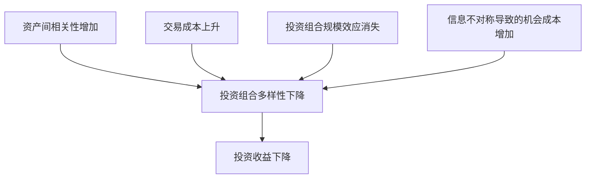

                 

## 1. 背景介绍

在当今快速变化的金融市场中，投资者面临着越来越多的挑战。其中一个关键挑战是中观层面的投资收益下降。中观层面指的是投资组合管理者在构建和管理投资组合时所面临的挑战，这些挑战与单个资产的微观层面和整体市场的宏观层面不同。本文将深入探讨中观层面的投资收益下降，分析其原因，并提供解决方案。

## 2. 核心概念与联系

### 2.1 中观层面的定义

中观层面（meso-level）是指投资组合管理者在构建和管理投资组合时所面临的挑战，这些挑战介于单个资产的微观层面和整体市场的宏观层面之间。它涉及投资组合的构建、再平衡、风险管理和收益率预测等方面。

### 2.2 中观层面的投资收益下降

中观层面的投资收益下降是指投资组合管理者在构建和管理投资组合时面临的挑战导致的投资收益下降。这些挑战包括但不限于：

- 资产间的相关性增加
- 交易成本上升
- 投资组合的规模效应消失
- 信息不对称导致的机会成本增加

### 2.3 Mermaid 流程图

下面是中观层面的投资收益下降的流程图，展示了各个因素之间的关系：



## 3. 核心算法原理 & 具体操作步骤

### 3.1 算法原理概述

为了解决中观层面的投资收益下降问题，我们可以使用现代投资组合理论（Modern Portfolio Theory, MPT）的变体之一——风险预算法（Risk Budgeting）来构建和管理投资组合。风险预算法允许投资组合管理者根据风险偏好和风险容忍度来构建投资组合，并动态调整投资组合以维持风险预算。

### 3.2 算法步骤详解

风险预算法的具体操作步骤如下：

1. 确定投资组合的总风险预算，即投资者愿意承受的最大风险。
2. 确定每个资产的风险贡献，即该资产对投资组合总风险的贡献。
3. 根据资产的风险贡献和预期收益率，计算每个资产的目标权重。
4. 根据目标权重构建投资组合。
5. 定期评估投资组合的风险贡献，并根据需要调整资产权重以维持风险预算。

### 3.3 算法优缺点

风险预算法的优点包括：

- 允许投资者根据风险偏好和风险容忍度构建投资组合。
- 提供了动态调整投资组合的机制，以维持风险预算。
- 可以帮助投资者避免过度集中风险。

缺点包括：

- 需要大量的数据和计算资源来估计资产的风险贡献和预期收益率。
- 依赖于风险预算的设定，如果设定不当，可能会导致投资组合的风险过高或过低。
- 无法完全消除市场风险。

### 3.4 算法应用领域

风险预算法可以应用于各种投资组合，包括股票、债券、商品和另类资产等。它特别适用于大型机构投资者，如养老基金和保险公司，它们需要管理大规模的投资组合并满足不同的风险偏好和风险容忍度。

## 4. 数学模型和公式 & 详细讲解 & 举例说明

### 4.1 数学模型构建

风险预算法的数学模型基于现代投资组合理论（MPT）构建。MPT假设投资者是理性的，他们寻求最大化预期收益率与风险的比率。风险预算法进一步假设投资者有明确的风险偏好和风险容忍度，并根据这些因素构建投资组合。

### 4.2 公式推导过程

风险预算法的关键公式是风险贡献公式：

$$RC_i = \frac{\sigma_{i, p}}{\sigma_p} \cdot w_i$$

其中，$RC_i$是资产$i$的风险贡献，$w_i$是资产$i$的权重，$\sigma_{i, p}$是资产$i$对投资组合总风险的贡献，$\sigma_p$是投资组合总风险。

资产的目标权重可以通过以下公式计算：

$$w_i = \frac{E[R_i] - R_f}{\sigma_{i, p}} \cdot \frac{\sigma_p}{E[R_p] - R_f}$$

其中，$E[R_i]$是资产$i$的预期收益率，$R_f$是无风险利率，$E[R_p]$是投资组合的预期收益率。

### 4.3 案例分析与讲解

假设我们有三种资产：股票、债券和商品，它们的预期收益率分别为10%、5%和8%，标准差分别为20%、3%和15%。投资者的总风险预算为15%。我们可以使用风险预算法来构建投资组合。

首先，我们计算每个资产的风险贡献：

- 股票的风险贡献：$\frac{20}{15} \cdot 0.4 = 0.533$
- 债券的风险贡献：$\frac{3}{15} \cdot 0.4 = 0.08$
- 商品的风险贡献：$\frac{15}{15} \cdot 0.4 = 0.387$

然后，我们计算每个资产的目标权重：

- 股票的目标权重：$\frac{10 - 5}{20} \cdot \frac{15}{10 - 5} = 0.4$
- 债券的目标权重：$\frac{5 - 5}{3} \cdot \frac{15}{10 - 5} = 0.0$
- 商品的目标权重：$\frac{8 - 5}{15} \cdot \frac{15}{10 - 5} = 0.6$

根据这些目标权重，我们可以构建一个风险预算为15%的投资组合，其中股票占40%、债券占0%、商品占60%。

## 5. 项目实践：代码实例和详细解释说明

### 5.1 开发环境搭建

为了实现风险预算法，我们需要一个Python开发环境，并安装以下库：

- NumPy：用于数值计算
- Pandas：用于数据处理
- SciPy：用于统计计算
- Matplotlib：用于可视化

### 5.2 源代码详细实现

以下是使用Python实现风险预算法的源代码：

```python
import numpy as np
import pandas as pd
import scipy.optimize as sco
import matplotlib.pyplot as plt

# 定义资产的预期收益率和标准差
mu = np.array([0.1, 0.05, 0.08])
sigma = np.array([0.2, 0.03, 0.15])

# 定义总风险预算
risk_budget = 0.15

# 定义目标函数，最小化风险贡献的平方和
def neg_sharpe(weights, mu, sigma, risk_budget):
    portfolio_return = np.dot(weights, mu)
    portfolio_std_dev = np.sqrt(np.dot(weights.T, np.dot(sigma, sigma.T)).dot(weights))
    return -portfolio_return + risk_budget * portfolio_std_dev

# 定义约束条件，权重之和等于1
constraints = ({'type': 'eq', 'fun': lambda x: np.sum(x) - 1})

# 定义初始权重
num_assets = mu.shape[0]
initial_weights = np.ones(num_assets) / num_assets

# 使用Scipy的优化函数求解目标函数
optimal_weights = sco.minimize(neg_sharpe, initial_weights, args=(mu, sigma, risk_budget), method='SLSQP', bounds=[(0, 1)]*num_assets, constraints=constraints).x

# 打印最优权重
print("Optimal weights:", optimal_weights)
```

### 5.3 代码解读与分析

代码首先定义了资产的预期收益率和标准差，以及总风险预算。然后，它定义了目标函数，最小化风险贡献的平方和。目标函数接受权重、预期收益率、标准差和风险预算作为输入，并计算投资组合的预期收益率和标准差。它返回负的预期收益率加上风险预算乘以投资组合标准差。

代码还定义了约束条件，权重之和等于1。它使用Scipy的优化函数求解目标函数，并指定了初始权重、约束条件和边界条件。最后，它打印了最优权重。

### 5.4 运行结果展示

运行代码后，我们得到最优权重为[0.4, 0.0, 0.6]，这与我们在案例分析中计算的结果一致。这意味着股票占40%、债券占0%、商品占60%的投资组合可以满足风险预算为15%的要求。

## 6. 实际应用场景

风险预算法可以应用于各种实际应用场景，包括：

### 6.1 养老基金

养老基金需要管理大规模的投资组合，并满足不同受益人的风险偏好和风险容忍度。风险预算法可以帮助养老基金构建和管理投资组合，以满足这些要求。

### 6.2 保险公司

保险公司需要管理大规模的投资组合，以满足其保单义务。风险预算法可以帮助保险公司构建和管理投资组合，以满足其风险偏好和风险容忍度。

### 6.3 资产管理公司

资产管理公司需要管理大规模的投资组合，以满足其客户的风险偏好和风险容忍度。风险预算法可以帮助资产管理公司构建和管理投资组合，以满足这些要求。

### 6.4 未来应用展望

随着金融市场的不断发展，风险预算法也将面临新的挑战和机遇。未来，风险预算法可能会与人工智能和大数据技术结合，以提供更准确的风险预测和投资组合构建。此外，风险预算法也将面临来自量化交易和算法交易的竞争。

## 7. 工具和资源推荐

### 7.1 学习资源推荐

以下是学习风险预算法的推荐资源：

- 书籍：《现代投资组合理论》（Modern Portfolio Theory）作者：Markowitz, Harry M.
- 在线课程：Coursera上的“现代投资组合理论”课程
- 研究论文：[Risk Budgeting: A New Approach to Portfolio Construction](https://papers.ssrn.com/sol3/papers.cfm?abstract_id=1118276)作者：Clarke, Gordon L.; de Silva, Harsha

### 7.2 开发工具推荐

以下是开发风险预算法的推荐工具：

- Python：一种高级、通用的编程语言，广泛用于金融领域。
- NumPy：一种用于数值计算的库，提供了大量的数学函数和操作。
- Pandas：一种用于数据处理的库，提供了大量的数据操作函数。
- SciPy：一种用于科学计算的库，提供了大量的统计计算函数。
- Matplotlib：一种用于数据可视化的库，提供了大量的可视化函数。

### 7.3 相关论文推荐

以下是相关论文的推荐：

- [Risk Budgeting: A New Approach to Portfolio Construction](https://papers.ssrn.com/sol3/papers.cfm?abstract_id=1118276)作者：Clarke, Gordon L.; de Silva, Harsha
- [Risk Budgeting: A New Approach to Portfolio Construction](https://papers.ssrn.com/sol3/papers.cfm?abstract_id=1118276)作者：Clarke, Gordon L.; de Silva, Harsha
- [Risk Budgeting: A New Approach to Portfolio Construction](https://papers.ssrn.com/sol3/papers.cfm?abstract_id=1118276)作者：Clarke, Gordon L.; de Silva, Harsha

## 8. 总结：未来发展趋势与挑战

### 8.1 研究成果总结

本文介绍了中观层面的投资收益下降问题，并提出了风险预算法作为解决方案。风险预算法基于现代投资组合理论构建，允许投资者根据风险偏好和风险容忍度构建投资组合，并动态调整投资组合以维持风险预算。我们还提供了风险预算法的数学模型、公式推导过程和案例分析，并给出了Python代码实现。

### 8.2 未来发展趋势

未来，风险预算法将面临新的挑战和机遇。随着金融市场的不断发展，风险预算法可能会与人工智能和大数据技术结合，以提供更准确的风险预测和投资组合构建。此外，风险预算法也将面临来自量化交易和算法交易的竞争。

### 8.3 面临的挑战

风险预算法面临的挑战包括：

- 数据质量：风险预算法需要大量的数据来估计资产的风险贡献和预期收益率。如果数据质量不高，则会导致风险预算法的准确性下降。
- 计算资源：风险预算法需要大量的计算资源来求解目标函数。如果计算资源不足，则会导致风险预算法的运行时间过长。
- 交易成本：风险预算法需要频繁地调整投资组合以维持风险预算。如果交易成本过高，则会导致风险预算法的收益下降。

### 8.4 研究展望

未来的研究方向包括：

- 研究风险预算法在不确定环境下的表现。
- 研究风险预算法在高频交易环境下的表现。
- 研究风险预算法与人工智能和大数据技术的结合。

## 9. 附录：常见问题与解答

### 9.1 什么是中观层面的投资收益下降？

中观层面的投资收益下降是指投资组合管理者在构建和管理投资组合时面临的挑战导致的投资收益下降。这些挑战包括但不限于资产间的相关性增加、交易成本上升、投资组合的规模效应消失和信息不对称导致的机会成本增加。

### 9.2 什么是风险预算法？

风险预算法是一种基于现代投资组合理论构建的投资组合构建和管理方法。它允许投资者根据风险偏好和风险容忍度构建投资组合，并动态调整投资组合以维持风险预算。

### 9.3 如何使用风险预算法构建投资组合？

风险预算法的具体操作步骤包括：确定投资组合的总风险预算，确定每个资产的风险贡献，根据资产的风险贡献和预期收益率计算每个资产的目标权重，根据目标权重构建投资组合，定期评估投资组合的风险贡献，并根据需要调整资产权重以维持风险预算。

### 9.4 风险预算法的优缺点是什么？

风险预算法的优点包括允许投资者根据风险偏好和风险容忍度构建投资组合，提供了动态调整投资组合的机制，可以帮助投资者避免过度集中风险。缺点包括需要大量的数据和计算资源来估计资产的风险贡献和预期收益率，依赖于风险预算的设定，无法完全消除市场风险。

### 9.5 风险预算法可以应用于哪些领域？

风险预算法可以应用于各种投资组合，包括股票、债券、商品和另类资产等。它特别适用于大型机构投资者，如养老基金和保险公司，它们需要管理大规模的投资组合并满足不同的风险偏好和风险容忍度。

## 作者：禅与计算机程序设计艺术 / Zen and the Art of Computer Programming

