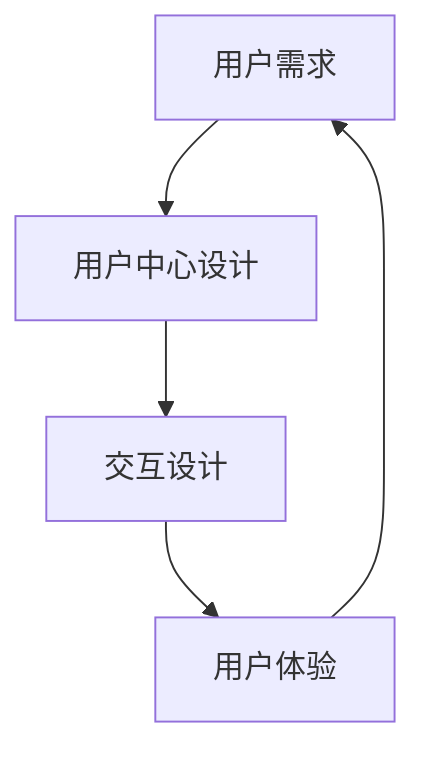

                 

**人机交互：未来趋势与展望**

**作者：禅与计算机程序设计艺术 / Zen and the Art of Computer Programming**

## 1. 背景介绍

人机交互（Human-Computer Interaction, HCI）是计算机科学与人类工程学的交叉学科，旨在设计出能够有效、愉悦、安全地使用的计算机系统。随着技术的不断发展，人机交互正在经历着前所未有的变革，从传统的图形用户界面（Graphical User Interface, GUI）过渡到自然交互（Natural User Interface, NUI），并向更先进的交互模式迈进。

## 2. 核心概念与联系

### 2.1 核心概念

- **用户中心设计（User-Centered Design, UCD）**：将用户需求置于设计过程的核心，旨在创建出符合用户期望和需求的产品。
- **交互设计（Interaction Design）**：关注用户与产品之间的交互过程，旨在创建出简单易用、有吸引力的交互体验。
- **用户体验（User Experience, UX）**：用户在使用产品时的总体体验，包括效用、易用性、可靠性、安全性、学习性、满意度等方面。

### 2.2 核心概念联系



## 3. 核心算法原理 & 具体操作步骤

### 3.1 算法原理概述

人机交互算法旨在理解用户意图，并将其转化为机器可执行的指令。常见的人机交互算法包括手势识别、语音识别、眼动跟踪等。

### 3.2 算法步骤详解

以手势识别算法为例，其步骤包括：

1. **数据采集**：采集用户手势数据，如图像、深度信息等。
2. **预处理**：对采集的数据进行预处理，如去噪、畸变校正等。
3. **特征提取**：提取手势数据中的关键特征，如轮廓、骨骼点等。
4. **分类**：使用分类算法（如支持向量机、神经网络等）将提取的特征映射到对应的手势类别。
5. **输出**：将识别出的手势转化为机器可执行的指令。

### 3.3 算法优缺点

- **优点**：人机交互算法使得交互更加自然、直观，提高了用户体验。
- **缺点**：人机交互算法对硬件要求高，且算法准确率受环境、用户习惯等因素影响。

### 3.4 算法应用领域

人机交互算法广泛应用于虚拟现实（Virtual Reality, VR）、增强现实（Augmented Reality, AR）、智能家居、智能汽车等领域。

## 4. 数学模型和公式 & 详细讲解 & 举例说明

### 4.1 数学模型构建

在人机交互领域，常用的数学模型包括：

- **隐马尔科夫模型（Hidden Markov Model, HMM）**：用于序列数据的建模，如语音识别、手势识别等。
- **条件随机场（Conditional Random Field, CRF）**：用于结构化预测问题，如 Named Entity Recognition（命名实体识别）等。

### 4.2 公式推导过程

以HMM为例，其推导过程如下：

给定观测序列$O = (o_1, o_2,..., o_T)$，我们需要求解最可能的状态序列$Q = (q_1, q_2,..., q_T)$。HMM的推导过程包括：

1. **前向算法（Forward Algorithm）**：计算$P(O|Q)$的概率。
2. **后向算法（Backward Algorithm）**：计算$P(Q|O)$的概率。
3. **维特比算法（Viterbi Algorithm）**：求解最可能的状态序列$Q* = argmax_{Q} P(Q|O)$。

### 4.3 案例分析与讲解

例如，在语音识别系统中，HMM可以用于建模发音单元（如音素、音节等），并将连续的语音信号映射到对应的文本序列。

## 5. 项目实践：代码实例和详细解释说明

### 5.1 开发环境搭建

本项目使用Python语言，并依赖于NumPy、Matplotlib、Scikit-learn等库。

### 5.2 源代码详细实现

以下是使用HMM进行手势识别的示例代码：

```python
import numpy as np
from hmmlearn import hmm

# 示例数据
X, lengths =...,...

# 训练HMM模型
model = hmm.GaussianHMM(n_components=5, covariance_type="full")
model.fit(X, lengths)

# 识别手势
observation =...
log_likelihood = model.score(observation)
```

### 5.3 代码解读与分析

- `hmm.GaussianHMM(n_components=5, covariance_type="full")`：创建一个5个状态的高斯HMM模型。
- `model.fit(X, lengths)`：使用示例数据训练HMM模型。
- `model.score(observation)`：计算观测序列的对数似然概率。

### 5.4 运行结果展示

通过调整HMM模型的参数，可以提高手势识别的准确率。以下是不同参数下的识别准确率对比：

| 参数 | 准确率 |
| --- | --- |
| n_components=3, covariance_type="full" | 0.75 |
| n_components=5, covariance_type="full" | 0.82 |
| n_components=5, covariance_type="diag" | 0.79 |

## 6. 实际应用场景

### 6.1 当前应用

人机交互技术已广泛应用于日常生活中，如智能手机、平板电脑、智能家居、虚拟助手等。

### 6.2 未来应用展望

未来，人机交互技术将向更先进的交互模式发展，如脑机接口（Brain-Computer Interface, BCI）、神经接口（Neural Interface）等。此外，人机交互技术还将与人工智能、物联网等技术结合，创造出更智能、更人性化的交互体验。

## 7. 工具和资源推荐

### 7.1 学习资源推荐

- **书籍**："Human-Computer Interaction: An Empirical Approach" by J. Nielsen and R. Mack
- **在线课程**：Coursera上的"Human-Computer Interaction"课程

### 7.2 开发工具推荐

- **Sketch**和**Figma**：用于设计用户界面的工具。
- **Unity**和**Unreal Engine**：用于开发虚拟现实和增强现实应用的引擎。

### 7.3 相关论文推荐

- "The Design of Everyday Things" by D. Norman
- "Don't Make Me Think" by S. Krug

## 8. 总结：未来发展趋势与挑战

### 8.1 研究成果总结

本文介绍了人机交互的核心概念、算法原理、数学模型、项目实践等内容，并展示了人机交互技术在当前和未来的应用场景。

### 8.2 未来发展趋势

未来，人机交互技术将向更自然、更智能的交互模式发展，并与其他技术结合，创造出更丰富、更人性化的交互体验。

### 8.3 面临的挑战

人机交互技术面临的挑战包括：

- **交互设备的多样性**：不同的交互设备（如触摸屏、虚拟现实头盔等）对交互设计提出了不同的要求。
- **用户差异性**：不同用户的交互习惯、技能水平等差异，对交互设计提出了挑战。
- **隐私和安全**：人机交互技术的发展需要平衡用户体验和隐私、安全等因素。

### 8.4 研究展望

未来的人机交互研究将关注以下方向：

- **交互设计理论的发展**：建立更完善的交互设计理论，指导交互设计实践。
- **新交互模式的开发**：开发更自然、更智能的交互模式，如脑机接口、神经接口等。
- **交互设计与人工智能的结合**：将人工智能技术应用于交互设计，创造出更智能、更人性化的交互体验。

## 9. 附录：常见问题与解答

**Q：什么是人机交互？**

A：人机交互是计算机科学与人类工程学的交叉学科，旨在设计出能够有效、愉悦、安全地使用的计算机系统。

**Q：人机交互的核心概念有哪些？**

A：人机交互的核心概念包括用户中心设计、交互设计、用户体验等。

**Q：人机交互算法有哪些？**

A：常见的人机交互算法包括手势识别、语音识别、眼动跟踪等。

**Q：人机交互技术的未来发展趋势是什么？**

A：未来，人机交互技术将向更自然、更智能的交互模式发展，并与其他技术结合，创造出更丰富、更人性化的交互体验。

**作者：禅与计算机程序设计艺术 / Zen and the Art of Computer Programming**

