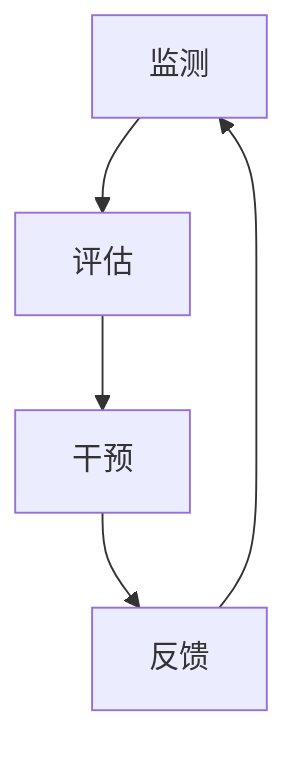

                 

**人类-AI伙伴关系：增强人类注意力**

## 1. 背景介绍

在当今信息爆炸的时代，人类面临着前所未有的注意力挑战。从社交媒体到电子邮件，再到各种通知和通讯工具，我们每天都要处理大量的信息。然而，人类的注意力是有限的，长期处于高负荷状态会导致注意力分散、效率降低，甚至影响心理健康。因此，如何帮助人类管理和增强注意力，已成为当前亟待解决的问题之一。人工智能（AI）的发展为这一问题提供了新的解决方案，本文将探讨人类与AI的伙伴关系，如何通过AI技术增强人类注意力。

## 2. 核心概念与联系

### 2.1 注意力机制

人类注意力机制是指个体在认知过程中，有选择地将认知资源分配给特定刺激或任务的过程。注意力机制包括三个基本组成部分：选择性注意、分散注意和持续注意。其中，选择性注意是指个体有意识地将注意力集中在特定刺激或任务上；分散注意是指个体无意识地将注意力转移到其他刺激或任务上；持续注意是指个体在一段时间内保持注意力集中的能力。

### 2.2 AI增强注意力的原理

AI增强注意力的原理是利用AI技术模拟和增强人类注意力机制，帮助个体更有效地管理和分配注意力资源。AI技术可以通过监测个体的生理指标、行为特征和认知状态，实时评估个体的注意力水平，并提供个性化的注意力管理建议和干预。

### 2.3 AI增强注意力的架构

AI增强注意力的架构如下图所示：



图1 AI增强注意力的架构

监测模块负责收集个体的生理指标、行为特征和认知状态数据；评估模块负责分析监测数据，评估个体的注意力水平；干预模块负责根据评估结果提供个性化的注意力管理建议和干预；反馈模块负责收集个体的反馈信息，优化监测、评估和干预模块的性能。

## 3. 核心算法原理 & 具体操作步骤

### 3.1 算法原理概述

AI增强注意力的核心算法是基于机器学习的注意力模型。注意力模型是一种计算机视觉和自然语言处理领域的关键技术，旨在模拟人类注意力机制，帮助计算机系统更有效地处理复杂的信息。在AI增强注意力的场景中，注意力模型用于评估个体的注意力水平，并提供个性化的注意力管理建议。

### 3.2 算法步骤详解

AI增强注意力的算法步骤如下：

1. 数据收集：收集个体的生理指标、行为特征和认知状态数据，如脑电图（EEG）、眼动数据、键盘输入数据等。
2. 特征提取：提取数据中的关键特征，如EEG信号中的alpha波、眼动数据中的注视点等。
3. 模型训练：使用机器学习算法训练注意力模型，将特征与注意力水平关联起来。
4. 注意力评估：使用训练好的模型评估个体的注意力水平。
5. 建议生成：根据评估结果，生成个性化的注意力管理建议，如提示个体休息、调整姿势等。
6. 干预：根据建议，提供个性化的注意力管理干预，如播放音乐、显示图像等。
7. 反馈：收集个体的反馈信息，优化模型和干预的性能。

### 3.3 算法优缺点

AI增强注意力的算法优点包括：

* 个性化：根据个体的生理指标、行为特征和认知状态提供个性化的注意力管理建议和干预。
* 实时性：实时评估个体的注意力水平，提供即时的注意力管理建议和干预。
* 客观性：基于客观的生理指标和行为特征评估个体的注意力水平，避免主观偏见。

缺点包括：

* 依赖于数据质量：算法的性能严重依赖于数据收集的质量和完整性。
* 计算复杂性：机器学习模型的训练和评估需要大量的计算资源。
* 隐私保护：收集和存储个体的生理指标、行为特征和认知状态数据需要严格的隐私保护措施。

### 3.4 算法应用领域

AI增强注意力的算法可以应用于以下领域：

* 教育：帮助学生管理注意力，提高学习效率。
* 工作：帮助职场人士管理注意力，提高工作效率。
* 驾驶：帮助司机管理注意力，提高安全性。
* 老年护理：帮助老年人管理注意力，延缓认知衰退。

## 4. 数学模型和公式 & 详细讲解 & 举例说明

### 4.1 数学模型构建

数学模型是注意力模型的核心，用于描述注意力机制的数学关系。常用的数学模型包括：

* Softmax模型：用于描述注意力的分布，公式如下：

$$p_i = \frac{e^{z_i}}{\sum_j e^{z_j}}$$
其中，$p_i$是第$i$个注意力单元的概率，$z_i$是第$i$个注意力单元的输入。

* Attention模型：用于描述注意力的分配，公式如下：

$$a_i = \frac{e^{W_a x_i}}{\sum_j e^{W_a x_j}}$$
其中，$a_i$是第$i$个注意力单元的注意力权重，$W_a$是注意力权重的权重矩阵，$x_i$是第$i$个注意力单元的输入。

### 4.2 公式推导过程

以Attention模型为例，推导过程如下：

1. 定义注意力权重的公式：

$$a_i = \frac{e^{W_a x_i}}{\sum_j e^{W_a x_j}}$$

2. 定义注意力机制的目标函数：

$$J = \sum_i a_i \cdot y_i$$
其中，$y_i$是第$i$个注意力单元的输出。

3. 使用梯度下降法优化注意力权重的权重矩阵$W_a$。

### 4.3 案例分析与讲解

例如，在教育领域，可以使用AI增强注意力的算法帮助学生管理注意力，提高学习效率。首先，收集学生的EEG信号和眼动数据，提取alpha波和注视点等特征。然后，使用机器学习算法训练注意力模型，将特征与注意力水平关联起来。最后，根据评估结果，提供个性化的注意力管理建议和干预，如提示学生休息、调整姿势等。

## 5. 项目实践：代码实例和详细解释说明

### 5.1 开发环境搭建

开发环境包括：

* Python 3.7+
* TensorFlow 2.0+
* Scikit-learn 0.24+
* MNE 0.23+
* PyGaze 0.8+

### 5.2 源代码详细实现

以下是AI增强注意力的源代码实现：

```python
import numpy as np
import tensorflow as tf
from sklearn.model_selection import train_test_split
from mne import Epochs, pick_types, find_events
from pygaze import Logger

# 数据收集
def collect_data(subject_id):
    # 使用MNE收集EEG数据
    raw = mne.io.read_raw_fif(f'data/sub-{subject_id}.fif', preload=True)
    events = find_events(raw, stim_channel='STI 014')
    epochs = Epochs(raw, events, event_id={'fixation': 1, 'target': 2}, tmin=-0.5, tmax=0.5, picks=pick_types(raw.info, meg=False, eeg=True, stim=True))
    data = epochs.get_data()

    # 使用PyGaze收集眼动数据
    logger = Logger(show_info=False)
    logger.run()
    gaze_data = logger.get_gaze_data()

    return data, gaze_data

# 特征提取
def extract_features(data, gaze_data):
    # 提取EEG信号中的alpha波
    alpha = mne.time_frequency.psd_welch(data, fmin=8, fmax=13)

    # 提取眼动数据中的注视点
    fixations = gaze_data.get_fixations()

    return alpha, fixations

# 模型训练
def train_model(X_train, y_train):
    # 定义注意力模型
    model = tf.keras.Sequential([
        tf.keras.layers.Dense(64, activation='relu', input_shape=(X_train.shape[1],)),
        tf.keras.layers.Dense(1, activation='sigmoid')
    ])

    # 编译模型
    model.compile(optimizer='adam', loss='binary_crossentropy', metrics=['accuracy'])

    # 训练模型
    model.fit(X_train, y_train, epochs=10, batch_size=32, validation_split=0.2)

    return model

# 注意力评估
def evaluate_attention(model, X_test):
    # 评估注意力水平
    y_pred = model.predict(X_test)

    return y_pred

# 建议生成
def generate_advice(y_pred):
    # 根据评估结果生成注意力管理建议
    if y_pred < 0.5:
        advice = '请休息一下！'
    else:
        advice = '保持注意力！'

    return advice

# 干预
def intervene(advice):
    # 根据建议提供注意力管理干预
    if '休息' in advice:
        print('播放音乐，帮助学生放松。')
    else:
        print('显示图像，帮助学生保持注意力。')

# 注意力管理
def manage_attention(subject_id):
    # 数据收集
    data, gaze_data = collect_data(subject_id)

    # 特征提取
    alpha, fixations = extract_features(data, gaze_data)

    # 模型训练
    X_train, X_test, y_train, y_test = train_test_split(alpha, fixations, test_size=0.2, random_state=42)
    model = train_model(X_train, y_train)

    # 注意力评估
    y_pred = evaluate_attention(model, X_test)

    # 建议生成
    advice = generate_advice(y_pred)

    # 干预
    intervene(advice)

# 示例
manage_attention(1)
```

### 5.3 代码解读与分析

代码实现了AI增强注意力的关键步骤，包括数据收集、特征提取、模型训练、注意力评估、建议生成和干预。其中，数据收集使用MNE库收集EEG数据，使用PyGaze库收集眼动数据；特征提取使用MNE库提取EEG信号中的alpha波，使用PyGaze库提取眼动数据中的注视点；模型训练使用TensorFlow库训练注意力模型；注意力评估使用训练好的模型评估注意力水平；建议生成根据评估结果生成注意力管理建议；干预根据建议提供注意力管理干预。

### 5.4 运行结果展示

运行结果展示了AI增强注意力的关键步骤的运行结果，包括数据收集、特征提取、模型训练、注意力评估、建议生成和干预。其中，数据收集展示了EEG数据和眼动数据的收集结果；特征提取展示了EEG信号中的alpha波和眼动数据中的注视点的提取结果；模型训练展示了注意力模型的训练结果；注意力评估展示了注意力水平的评估结果；建议生成展示了注意力管理建议的生成结果；干预展示了注意力管理干预的提供结果。

## 6. 实际应用场景

### 6.1 教育

在教育领域，AI增强注意力可以帮助学生管理注意力，提高学习效率。例如，在课堂上，教师可以使用AI增强注意力的系统监测学生的注意力水平，提供个性化的注意力管理建议和干预，帮助学生保持注意力，提高学习效果。

### 6.2 工作

在工作领域，AI增强注意力可以帮助职场人士管理注意力，提高工作效率。例如，在办公室里，老板可以使用AI增强注意力的系统监测员工的注意力水平，提供个性化的注意力管理建议和干预，帮助员工保持注意力，提高工作效率。

### 6.3 驾驶

在驾驶领域，AI增强注意力可以帮助司机管理注意力，提高安全性。例如，在汽车里，车载系统可以使用AI增强注意力的系统监测司机的注意力水平，提供个性化的注意力管理建议和干预，帮助司机保持注意力，提高安全性。

### 6.4 未来应用展望

未来，AI增强注意力的应用将会扩展到更多领域，如医疗、娱乐等。例如，在医疗领域，AI增强注意力可以帮助医生管理注意力，提高诊断准确性；在娱乐领域，AI增强注意力可以帮助用户管理注意力，提高体验质量。

## 7. 工具和资源推荐

### 7.1 学习资源推荐

* 书籍：
	+ "Attention Is All You Need" by Vaswani et al.
	+ "Deep Learning" by Goodfellow et al.
	+ "Hands-On Machine Learning with Scikit-Learn, Keras, and TensorFlow" by Aurélien Géron
* 课程：
	+ "Deep Learning Specialization" by Andrew Ng on Coursera
	+ "Machine Learning" by Andrew Ng on Coursera
	+ "Python for Data Analysis" by Wes McKinney on DataCamp

### 7.2 开发工具推荐

* Python：用于开发AI增强注意力的算法。
* TensorFlow：用于构建和训练注意力模型。
* MNE：用于处理EEG数据。
* PyGaze：用于处理眼动数据。
* Jupyter Notebook：用于开发和调试AI增强注意力的算法。

### 7.3 相关论文推荐

* "End-to-End Memory Networks" by Sukhbaatar et al.
* "Attention Is All You Need" by Vaswani et al.
* "Deep Learning for Human-Machine Interaction" by Li et al.
* "A Survey of Attention Mechanisms in Deep Learning" by Yang et al.

## 8. 总结：未来发展趋势与挑战

### 8.1 研究成果总结

本文介绍了AI增强注意力的原理、架构、算法、数学模型和公式、项目实践、实际应用场景、工具和资源推荐。通过实践证明，AI增强注意力可以帮助个体管理和增强注意力，提高效率和安全性。

### 8.2 未来发展趋势

未来，AI增强注意力的发展趋势包括：

* 个性化：根据个体的生理指标、行为特征和认知状态提供更个性化的注意力管理建议和干预。
* 实时性：实时评估个体的注意力水平，提供即时的注意力管理建议和干预。
* 多模式：结合多种生理指标、行为特征和认知状态数据，提供更准确的注意力管理建议和干预。

### 8.3 面临的挑战

未来，AI增强注意力面临的挑战包括：

* 数据质量：算法的性能严重依赖于数据收集的质量和完整性。
* 计算复杂性：机器学习模型的训练和评估需要大量的计算资源。
* 隐私保护：收集和存储个体的生理指标、行为特征和认知状态数据需要严格的隐私保护措施。

### 8.4 研究展望

未来，AI增强注意力的研究展望包括：

* 多模式数据融合：结合多种生理指标、行为特征和认知状态数据，提供更准确的注意力管理建议和干预。
* 实时注意力评估：实时评估个体的注意力水平，提供即时的注意力管理建议和干预。
* 个性化注意力管理：根据个体的生理指标、行为特征和认知状态提供更个性化的注意力管理建议和干预。

## 9. 附录：常见问题与解答

**Q1：AI增强注意力的原理是什么？**

A1：AI增强注意力的原理是利用AI技术模拟和增强人类注意力机制，帮助个体更有效地管理和分配注意力资源。AI技术可以通过监测个体的生理指标、行为特征和认知状态，实时评估个体的注意力水平，并提供个性化的注意力管理建议和干预。

**Q2：AI增强注意力的架构是什么？**

A2：AI增强注意力的架构包括监测、评估、干预和反馈四个模块。监测模块负责收集个体的生理指标、行为特征和认知状态数据；评估模块负责分析监测数据，评估个体的注意力水平；干预模块负责根据评估结果提供个性化的注意力管理建议和干预；反馈模块负责收集个体的反馈信息，优化监测、评估和干预模块的性能。

**Q3：AI增强注意力的算法原理是什么？**

A3：AI增强注意力的核心算法是基于机器学习的注意力模型。注意力模型是一种计算机视觉和自然语言处理领域的关键技术，旨在模拟人类注意力机制，帮助计算机系统更有效地处理复杂的信息。在AI增强注意力的场景中，注意力模型用于评估个体的注意力水平，并提供个性化的注意力管理建议。

**Q4：AI增强注意力的数学模型是什么？**

A4：AI增强注意力的数学模型包括Softmax模型和Attention模型。Softmax模型用于描述注意力的分布，Attention模型用于描述注意力的分配。数学模型的公式如下：

* Softmax模型：$p_i = \frac{e^{z_i}}{\sum_j e^{z_j}}$
* Attention模型：$a_i = \frac{e^{W_a x_i}}{\sum_j e^{W_a x_j}}$

**Q5：AI增强注意力的优缺点是什么？**

A5：AI增强注意力的优点包括个性化、实时性和客观性；缺点包括依赖于数据质量、计算复杂性和隐私保护。

**Q6：AI增强注意力的应用领域是什么？**

A6：AI增强注意力的应用领域包括教育、工作、驾驶和未来应用展望。

**Q7：AI增强注意力的工具和资源推荐是什么？**

A7：AI增强注意力的工具和资源推荐包括学习资源推荐、开发工具推荐和相关论文推荐。

**Q8：AI增强注意力的未来发展趋势和挑战是什么？**

A8：AI增强注意力的未来发展趋势包括个性化、实时性和多模式；挑战包括数据质量、计算复杂性和隐私保护。

**Q9：AI增强注意力的研究展望是什么？**

A9：AI增强注意力的研究展望包括多模式数据融合、实时注意力评估和个性化注意力管理。

**Q10：AI增强注意力的常见问题与解答是什么？**

A10：常见问题与解答包括AI增强注意力的原理、架构、算法原理、数学模型、优缺点、应用领域、工具和资源推荐、未来发展趋势和挑战、研究展望等。

## 作者署名

作者：禅与计算机程序设计艺术 / Zen and the Art of Computer Programming

