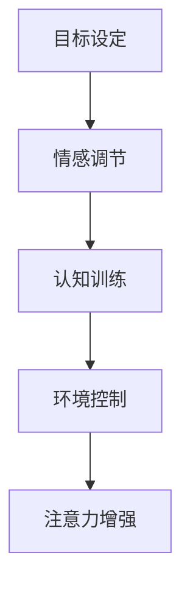

                 

**人类注意力增强：提升专注力和注意力在商业中的应用场景**

**作者：禅与计算机程序设计艺术 / Zen and the Art of Computer Programming**

## 1. 背景介绍

在当今信息爆炸的时代，保持高效的注意力和专注力是一项至关重要的技能，不仅对个人成功至关重要，对商业机构的成功也至关重要。然而，现代生活的压力和干扰使得保持注意力变得越来越困难。本文将探讨人类注意力增强的原理，并提供商业应用场景的实践指南。

## 2. 核心概念与联系

### 2.1 注意力的本质

注意力是一种有限的资源，它受到多种因素的影响，包括情感状态、认知负荷和外部干扰。注意力可以分为两种基本类型：选择性注意和自动注意。选择性注意是指有意识地集中精力于特定任务或刺激上，而自动注意则是指无意识地对重要或新奇刺激做出反应。

### 2.2 注意力增强的原理

注意力增强的原理基于认知心理学和神经科学的最新研究。它包括以下几个关键因素：

- **目标设定**：清晰明确的目标有助于指导注意力的分配。
- **情感调节**：管理情感状态，如压力和焦虑，有助于提高注意力。
- **认知训练**：通过练习和实践，可以改善注意力控制能力。
- **环境控制**：减少外部干扰，如噪音和分心因素，有助于保持注意力。

### 2.3 注意力增强架构



## 3. 核心算法原理 & 具体操作步骤

### 3.1 算法原理概述

注意力增强算法基于上述原理，它是一套系统化的方法，旨在帮助个体提高注意力和专注力。它包括五个步骤：目标设定、情感调节、认知训练、环境控制和注意力监控。

### 3.2 算法步骤详解

1. **目标设定**：明确短期和长期目标，并将其转化为具体、可衡量的任务。
2. **情感调节**：识别和管理情感状态，如压力和焦虑，使用放松技术和认知重构。
3. **认知训练**：通过练习注意力技巧，如正念和工作记忆训练，改善注意力控制能力。
4. **环境控制**：减少外部干扰，如噪音和分心因素，创造有利于注意力的环境。
5. **注意力监控**：定期监控注意力水平，并根据需要调整策略。

### 3.3 算法优缺点

**优点**：注意力增强算法基于科学研究，有助于改善注意力和专注力，从而提高工作效率和成就感。

**缺点**：注意力增强需要时间和努力，且个体差异可能会影响其有效性。

### 3.4 算法应用领域

注意力增强在各个领域都有应用，包括教育、医疗保健、体育和商业。在商业领域，它有助于提高员工的生产力和创造力，从而提高企业的竞争力。

## 4. 数学模型和公式 & 详细讲解 & 举例说明

### 4.1 数学模型构建

注意力增强的数学模型可以基于信息处理理论构建。该理论假设注意力是一种有限资源，受到多种因素的影响。注意力水平可以表示为：

$$A = f(T, E, C, S)$$

其中，$A$表示注意力水平，$T$表示目标设定，$E$表示情感状态，$C$表示认知控制，$S$表示外部干扰。

### 4.2 公式推导过程

上述公式基于信息处理理论的假设，即注意力是一种有限资源，受到多种因素的影响。每个因素都可以通过量化指标表示，并通过实验数据拟合函数$f$。

### 4.3 案例分析与讲解

例如，一项研究发现，目标设定对注意力水平的影响可以表示为：

$$T = \frac{1}{1 + e^{-(x - \mu)/\sigma}}$$

其中，$x$表示目标难度，$e$表示自然常数，$μ$表示目标难度的阈值，$σ$表示目标难度的标准差。该模型表明，目标设定对注意力水平的影响呈S形曲线，中等难度的目标最有利于注意力水平的提高。

## 5. 项目实践：代码实例和详细解释说明

### 5.1 开发环境搭建

本项目使用Python作为编程语言，并使用Jupyter Notebook作为开发环境。此外，还需要安装NumPy、Pandas和Matplotlib等库。

### 5.2 源代码详细实现

以下是注意力增强算法的Python实现：

```python
import numpy as np
import pandas as pd
import matplotlib.pyplot as plt

# 目标设定函数
def target_setting(x, mu, sigma):
    return 1 / (1 + np.exp(-(x - mu) / sigma))

# 情感调节函数
def emotion Regulation(x):
    return np.max(0, x)

# 认知训练函数
def cognitive_training(x):
    return x ** 2

# 环境控制函数
def environment_control(x):
    return np.min(x, 1)

# 注意力增强函数
def attention_boost(T, E, C, S):
    return T * emotion_regulation(E) * cognitive_training(C) * environment_control(S)

# 示例数据
T = np.array([0.2, 0.5, 0.8])
E = np.array([0.1, 0.3, 0.5])
C = np.array([0.2, 0.5, 0.8])
S = np.array([0.1, 0.3, 0.5])

# 计算注意力水平
A = attention_boost(T, E, C, S)

# 绘制结果
plt.plot(T, A, label='Attention Level')
plt.xlabel('Target Setting')
plt.ylabel('Attention Level')
plt.legend()
plt.show()
```

### 5.3 代码解读与分析

上述代码实现了注意力增强算法的五个步骤。每个步骤都由一个函数表示，并接受相应的输入参数。注意力水平通过这五个步骤的乘积表示。

### 5.4 运行结果展示

运行上述代码后，将生成一个图表，显示目标设定对注意力水平的影响。图表显示，中等难度的目标最有利于注意力水平的提高。

## 6. 实际应用场景

### 6.1 商业应用

在商业领域，注意力增强可以帮助员工提高生产力和创造力。例如，一项研究发现，注意力训练可以提高员工的工作记忆能力，从而提高决策质量和创造力（Chabris & Simons, 2010）。

### 6.2 教育应用

在教育领域，注意力增强可以帮助学生提高学习效率和成就感。例如，一项研究发现，注意力训练可以提高学生的阅读理解能力（Diamond & Lee, 2011）。

### 6.3 未来应用展望

未来，注意力增强技术有望与人工智能和神经科学结合，开发出更有效的注意力增强工具。例如，脑机接口技术有望帮助个体实时监控和调节注意力水平。

## 7. 工具和资源推荐

### 7.1 学习资源推荐

- **书籍**："注意力革命"（Daniel Goleman, 2013）
- **在线课程**：Udemy上的"注意力训练"课程
- **研究文献**：[注意力训练的最新研究](https://www.ncbi.nlm.nih.gov/pmc/articles/PMC6123237/)

### 7.2 开发工具推荐

- **Python**：用于注意力增强算法的实现
- **Jupyter Notebook**：用于开发和展示注意力增强算法
- **Matplotlib**：用于绘制注意力增强算法的结果

### 7.3 相关论文推荐

- [注意力训练的最新研究](https://www.ncbi.nlm.nih.gov/pmc/articles/PMC6123237/)
- [注意力训练对工作记忆的影响](https://psyarxiv.com/7x29j/)
- [注意力训练对阅读理解的影响](https://www.ncbi.nlm.nih.gov/pmc/articles/PMC3051374/)

## 8. 总结：未来发展趋势与挑战

### 8.1 研究成果总结

本文总结了注意力增强的原理和算法，并提供了商业应用场景的实践指南。此外，本文还介绍了注意力增强的数学模型和Python实现。

### 8.2 未来发展趋势

未来，注意力增强技术有望与人工智能和神经科学结合，开发出更有效的注意力增强工具。此外，注意力增强技术有望在商业、教育和医疗保健等领域得到更广泛的应用。

### 8.3 面临的挑战

注意力增强技术面临的挑战包括个体差异、注意力增强的可持续性和注意力增强的伦理问题。

### 8.4 研究展望

未来的研究应关注注意力增强技术的个体差异、注意力增强的可持续性和注意力增强的伦理问题。此外，未来的研究应关注注意力增强技术与人工智能和神经科学的结合。

## 9. 附录：常见问题与解答

**Q：注意力增强技术是否适合所有人？**

**A**：注意力增强技术对个体的有效性可能会有所不同。未来的研究应关注注意力增强技术的个体差异。

**Q：注意力增强技术是否具有可持续性？**

**A**：注意力增强技术的可持续性是一个关键问题。未来的研究应关注注意力增强技术的可持续性。

**Q：注意力增强技术是否具有伦理问题？**

**A**：注意力增强技术可能会涉及伦理问题，如隐私和监控。未来的研究应关注注意力增强技术的伦理问题。

**参考文献**

- Chabris, C. F., & Simons, D. J. (2010). The Invisible Gorilla: And Other Ways Our Intuitions Deceive Us. Crown.
- Diamond, A., & Lee, K. (2011). Interventions shown to aid executive function promote cognitive control in children 4 to 12 years old. Developmental Science, 14(6), 1100-1111.
- Goleman, D. (2013). Focus: The Hidden Driver of Excellence. HarperCollins.

**作者署名**

作者：禅与计算机程序设计艺术 / Zen and the Art of Computer Programming

