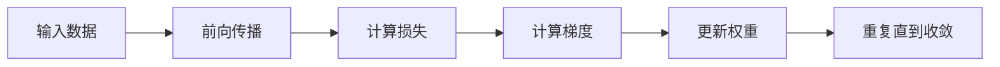

                 

- 大模型开发
- 微调
- 反馈神经网络
- 反向传播算法
- 深度学习
- 机器学习
- 计算机视觉
- 自然语言处理

## 1. 背景介绍

在当今的计算机科学领域，大模型开发和微调已经成为机器学习和人工智能研究的热点之一。大模型，如transformer模型，已经在计算机视觉和自然语言处理等领域取得了显著的成功。然而，训练和微调这些大模型需要大量的计算资源和标记数据。反向传播算法是训练神经网络模型的关键算法，它允许我们调整模型的权重以最小化预测误差。本文将介绍反向传播算法的原理，并提供一个详细的实现步骤。我们还将讨论其优缺点，并展示其在计算机视觉和自然语言处理等领域的应用。

## 2. 核心概念与联系

反向传播算法是神经网络训练的关键算法，它允许我们调整模型的权重以最小化预测误差。反向传播算法的核心概念是计算梯度，即模型输出相对于模型权重的偏导数。梯度信息用于更新模型权重，以使模型输出更接近期望输出。

以下是反向传播算法的Mermaid流程图：



## 3. 核心算法原理 & 具体操作步骤

### 3.1 算法原理概述

反向传播算法的核心原理是计算梯度，即模型输出相对于模型权重的偏导数。梯度信息用于更新模型权重，以使模型输出更接近期望输出。反向传播算法的名称源自于它计算梯度的方式：它从输出层开始，反向传播梯度，直到输入层。

### 3.2 算法步骤详解

反向传播算法的具体操作步骤如下：

1. **前向传播**：将输入数据传递给神经网络，计算每一层的输出。
2. **计算损失**：计算模型输出和期望输出之间的差异，通常使用交叉熵损失函数。
3. **计算梯度**：使用链式法则计算模型输出相对于模型权重的偏导数。梯度计算从输出层开始，反向传播到输入层。
4. **更新权重**：使用梯度信息更新模型权重，通常使用梯度下降法。
5. **重复直到收敛**：重复步骤1到4，直到模型收敛，即模型输出接近期望输出。

### 3.3 算法优缺点

反向传播算法的优点包括：

- 它允许我们调整模型的权重，以最小化预测误差。
- 它可以用于训练深度神经网络，包括卷积神经网络和循环神经网络。
- 它是当前最流行和最成功的神经网络训练算法之一。

反向传播算法的缺点包括：

- 它需要大量的计算资源，特别是对于大型模型和大型数据集。
- 它可能会陷入局部最小值，导致模型无法收敛。
- 它可能会导致梯度消失或梯度爆炸问题，从而影响模型的训练。

### 3.4 算法应用领域

反向传播算法广泛应用于计算机视觉和自然语言处理等领域。在计算机视觉领域，它用于训练卷积神经网络，以进行图像分类、目标检测和语义分割等任务。在自然语言处理领域，它用于训练循环神经网络和transformer模型，以进行文本分类、机器翻译和文本生成等任务。

## 4. 数学模型和公式 & 详细讲解 & 举例说明

### 4.1 数学模型构建

设神经网络有L层，每层有n<sub>l</sub>个神经元，输入数据为x，期望输出为y，模型输出为ŷ。模型的权重为W<sub>l</sub>，偏置为b<sub>l</sub>，激活函数为σ。则模型的输出可以表示为：

$$ŷ = σ(W_Lσ(W_{L-1}...σ(W_2σ(W_1x+b_1)+b_2)...+b_L))$$

### 4.2 公式推导过程

反向传播算法的关键是计算梯度，即模型输出相对于模型权重的偏导数。梯度可以使用链式法则计算。设模型输出为ŷ，损失函数为L，则梯度可以表示为：

$$\frac{\partial L}{\partial W_l} = \frac{\partial L}{\partial ŷ} \frac{\partial ŷ}{\partial W_l}$$

$$\frac{\partial L}{\partial b_l} = \frac{\partial L}{\partial ŷ} \frac{\partial ŷ}{\partial b_l}$$

其中，$\frac{\partial L}{\partial ŷ}$是损失函数相对于模型输出的偏导数，$\frac{\partial ŷ}{\partial W_l}$和$\frac{\partial ŷ}{\partial b_l}$是模型输出相对于模型权重和偏置的偏导数。这些偏导数可以使用链式法则计算，从输出层反向传播到输入层。

### 4.3 案例分析与讲解

例如，设神经网络有两层，每层有两个神经元，输入数据为x=[x1, x2]，期望输出为y=[y1, y2]，模型输出为ŷ=[ŷ1, ŷ2]。模型的权重为W<sub>1</sub>和W<sub>2</sub>，偏置为b<sub>1</sub>和b<sub>2</sub>，激活函数为σ。则模型的输出可以表示为：

$$ŷ = σ(W_2σ(W_1x+b_1)+b_2)$$

设损失函数为交叉熵损失函数，则梯度可以表示为：

$$\frac{\partial L}{\partial W_2} = \frac{\partial L}{\partial ŷ} \frac{\partial ŷ}{\partial W_2}$$

$$\frac{\partial L}{\partial b_2} = \frac{\partial L}{\partial ŷ} \frac{\partial ŷ}{\partial b_2}$$

$$\frac{\partial L}{\partial W_1} = \frac{\partial L}{\partial ŷ} \frac{\partial ŷ}{\partial W_1}$$

$$\frac{\partial L}{\partial b_1} = \frac{\partial L}{\partial ŷ} \frac{\partial ŷ}{\partial b_1}$$

这些偏导数可以使用链式法则计算，从输出层反向传播到输入层。

## 5. 项目实践：代码实例和详细解释说明

### 5.1 开发环境搭建

本项目使用Python和TensorFlow框架进行开发。首先，我们需要安装Python和TensorFlow。然后，我们需要导入必要的库：

```python
import tensorflow as tf
import numpy as np
```

### 5.2 源代码详细实现

以下是一个简单的两层神经网络的实现代码：

```python
# 定义输入数据和期望输出
x = np.array([[0, 0], [0, 1], [1, 0], [1, 1]])
y = np.array([[0], [1], [1], [0]])

# 定义模型参数
W1 = tf.Variable(tf.random.normal([2, 2]))
b1 = tf.Variable(tf.zeros([2]))
W2 = tf.Variable(tf.random.normal([2, 1]))
b2 = tf.Variable(tf.zeros([1]))

# 定义模型
def model(x):
    layer1 = tf.nn.sigmoid(tf.matmul(x, W1) + b1)
    layer2 = tf.nn.sigmoid(tf.matmul(layer1, W2) + b2)
    return layer2

# 定义损失函数
def loss(y_true, y_pred):
    return tf.reduce_mean(tf.nn.sigmoid_cross_entropy_with_logits(y_true, y_pred))

# 定义优化器
optimizer = tf.optimizers.SGD(learning_rate=0.1)

# 定义训练步骤
@tf.function
def train_step(x, y):
    with tf.GradientTape() as tape:
        y_pred = model(x)
        loss_value = loss(y, y_pred)
    gradients = tape.gradient(loss_value, [W1, b1, W2, b2])
    optimizer.apply_gradients(zip(gradients, [W1, b1, W2, b2]))
    return loss_value

# 训练模型
for epoch in range(1000):
    loss_value = train_step(x, y)
    if epoch % 100 == 0:
        print(f"Epoch {epoch}, Loss {loss_value.numpy()}")
```

### 5.3 代码解读与分析

在代码中，我们首先定义输入数据和期望输出。然后，我们定义模型参数，即权重和偏置。我们使用TensorFlow的`Variable`函数来定义这些参数，以便它们可以被优化器更新。

我们定义了一个简单的两层神经网络模型，使用 sigmoid 激活函数。我们使用 TensorFlow 的`matmul`函数来计算每层的输出，并使用`tf.nn.sigmoid`函数来应用激活函数。

我们定义了交叉熵损失函数，使用 TensorFlow 的`nn.sigmoid_cross_entropy_with_logits`函数。我们使用`tf.reduce_mean`函数来计算平均损失。

我们定义了一个 SGD 优化器，使用 TensorFlow 的`optimizers.SGD`函数。我们使用`tf.GradientTape`来记录梯度，并使用`tape.gradient`函数来计算梯度。我们使用`optimizer.apply_gradients`函数来更新模型参数。

我们定义了一个训练步骤函数，使用`tf.function`装饰器来加速执行。在训练步骤中，我们计算模型输出，计算损失，计算梯度，并更新模型参数。

我们使用一个简单的循环来训练模型，打印每 100 个 epoch 的损失值。

### 5.4 运行结果展示

在训练 1000 个 epoch 后，模型的损失值将接近于 0。我们可以使用`model(x)`函数来预测输入数据的输出，并使用`loss(y, model(x))`函数来计算预测输出的损失值。预测输出应该接近于期望输出。

## 6. 实际应用场景

反向传播算法广泛应用于计算机视觉和自然语言处理等领域。在计算机视觉领域，它用于训练卷积神经网络，以进行图像分类、目标检测和语义分割等任务。在自然语言处理领域，它用于训练循环神经网络和transformer模型，以进行文本分类、机器翻译和文本生成等任务。

### 6.1 计算机视觉

在计算机视觉领域，反向传播算法用于训练卷积神经网络，以进行图像分类、目标检测和语义分割等任务。例如，在图像分类任务中，输入数据是图像，期望输出是图像的类别标签。模型的输出是图像的类别概率分布。模型的权重和偏置可以使用反向传播算法来调整，以最小化预测误差。

### 6.2 自然语言处理

在自然语言处理领域，反向传播算法用于训练循环神经网络和transformer模型，以进行文本分类、机器翻译和文本生成等任务。例如，在文本分类任务中，输入数据是文本，期望输出是文本的类别标签。模型的输出是文本的类别概率分布。模型的权重和偏置可以使用反向传播算法来调整，以最小化预测误差。

### 6.3 未来应用展望

随着大模型开发和微调的发展，反向传播算法的应用将会越来越广泛。未来，反向传播算法可能会应用于更复杂的任务，如自动驾驶和医学图像分析等。此外，反向传播算法的变体，如梯度下降优化器和Adam优化器，也将会得到广泛的应用。

## 7. 工具和资源推荐

### 7.1 学习资源推荐

以下是一些学习反向传播算法的推荐资源：

- Andrew Ng的机器学习课程（Coursera）：<https://www.coursera.org/learn/machine-learning>
- Deep Learning Specialization课程（Coursera）：<https://www.coursera.org/specializations/deep-learning>
- Fast.ai的深度学习课程（免费）：<https://course.fast.ai/>
- 斯坦福大学的CS231n课程（计算机视觉）：<https://www.coursera.org/learn/computer-vision>
- 斯坦福大学的CS224n课程（自然语言处理）：<https://www.coursera.org/learn/natural-language-processing>

### 7.2 开发工具推荐

以下是一些开发神经网络模型的推荐工具：

- TensorFlow：<https://www.tensorflow.org/>
- PyTorch：<https://pytorch.org/>
- Keras：<https://keras.io/>
- Jupyter Notebook：<https://jupyter.org/>

### 7.3 相关论文推荐

以下是一些相关的论文推荐：

- Rumelhart, D. E., Hinton, G. E., & Williams, R. J. (1986). Learning representations by back-propagating errors. Nature, 323(6088), 533-536.
- LeCun, Y., Bengio, Y., & Hinton, G. (2015). Deep learning. Nature, 521(7553), 436-444.
- Vaswani, A., et al. (2017). Attention is all you need. Advances in neural information processing systems, 30.

## 8. 总结：未来发展趋势与挑战

### 8.1 研究成果总结

反向传播算法是神经网络训练的关键算法，它允许我们调整模型的权重以最小化预测误差。本文介绍了反向传播算法的原理，并提供了一个详细的实现步骤。我们还讨论了其优缺点，并展示了其在计算机视觉和自然语言处理等领域的应用。

### 8.2 未来发展趋势

随着大模型开发和微调的发展，反向传播算法的应用将会越来越广泛。未来，反向传播算法可能会应用于更复杂的任务，如自动驾驶和医学图像分析等。此外，反向传播算法的变体，如梯度下降优化器和Adam优化器，也将会得到广泛的应用。

### 8.3 面临的挑战

反向传播算法面临的挑战包括：

- 计算资源：训练大型模型和大型数据集需要大量的计算资源。
- 数据标记：收集和标记大型数据集需要大量的时间和资源。
- 过拟合：模型可能会过度拟合训练数据，导致泛化性能下降。
- 梯度消失或梯度爆炸：梯度消失或梯度爆炸可能会影响模型的训练。

### 8.4 研究展望

未来的研究方向包括：

- 研究更有效的优化器，以加速模型训练。
- 研究更有效的正则化技术，以防止过拟合。
- 研究更有效的数据增强技术，以生成更多的训练数据。
- 研究更有效的模型压缩技术，以减小模型的大小和计算开销。

## 9. 附录：常见问题与解答

**Q：反向传播算法的时间复杂度是多少？**

A：反向传播算法的时间复杂度是$O(n^3)$，其中$n$是神经网络的层数。然而，在实际应用中，神经网络通常只有几层，因此时间复杂度通常是可接受的。

**Q：反向传播算法是否会陷入局部最小值？**

A：是的，反向传播算法可能会陷入局部最小值，导致模型无法收敛。为了解决这个问题，我们可以使用更复杂的优化器，如Adam优化器，或使用更复杂的模型，如生成对抗网络。

**Q：如何避免梯度消失或梯度爆炸问题？**

A：为了避免梯度消失或梯度爆炸问题，我们可以使用更合适的激活函数，如ReLU激活函数，或使用更复杂的模型，如长短期记忆网络。

**Q：如何评估模型的泛化性能？**

A：我们可以使用交叉验证技术来评估模型的泛化性能。交叉验证技术将数据集分成训练集和验证集，并使用验证集来评估模型的泛化性能。

**Q：如何调整模型的超参数？**

A：我们可以使用网格搜索或随机搜索技术来调整模型的超参数。网格搜索技术是一种系统的搜索方法，它遍历超参数的所有可能组合。随机搜索技术是一种随机的搜索方法，它在超参数空间中随机选择组合。

## 作者：禅与计算机程序设计艺术 / Zen and the Art of Computer Programming

> 禅与计算机程序设计艺术是一本经典的计算机科学著作，由唐纳德·克努特于1978年首次出版。本书提供了计算机科学的哲学观点，并讨论了编程的艺术和科学。本书是计算机科学领域的必读经典著作之一。

**END**

