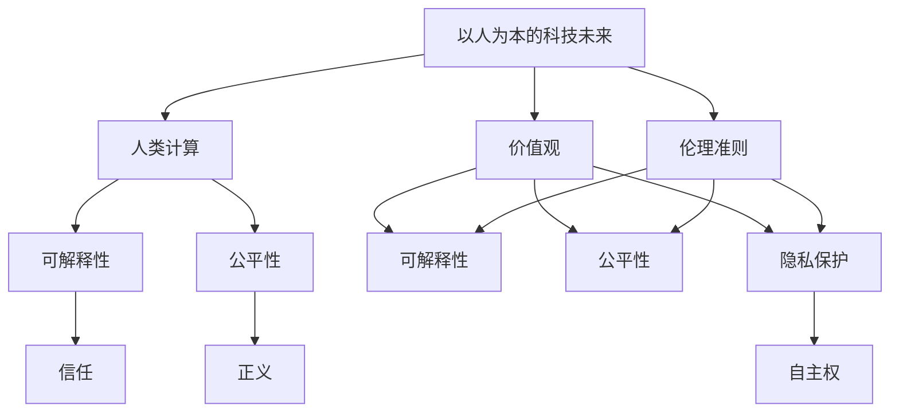

                 

**人工智能**, **人类计算**, **价值观**, **以人为本**, **科技伦理**, **人机协作**, **可解释性**, **公平性**, **隐私保护**

## 1. 背景介绍

当前，人工智能（AI）技术正在各行各业迅速渗透，从自动驾驶到医疗诊断，从金融风控到娱乐互动，AI的应用已然无处不在。然而，随着AI技术的发展，我们也面临着一系列挑战，其中最为关键的是如何确保AI技术的发展符合人类的价值观和伦理准则。本文旨在探讨以人为本的科技未来，即人类计算的价值观，并就如何实现这一目标提出建议。

## 2. 核心概念与联系

### 2.1 以人为本的科技未来

以人为本的科技未来强调将人类的需求、价值观和福祉置于技术发展的核心位置。这意味着我们需要考虑技术的社会影响，确保技术的发展有利于促进人类的福祉和公平。

### 2.2 人类计算

人类计算（Human-in-the-Loop）是一种人机协作的计算模式，强调人类在计算过程中的主导地位。在这种模式下，人类和机器共同参与决策过程，机器提供辅助和建议，但最终决策权仍掌握在人类手中。

### 2.3 价值观

价值观是指导个体或群体行为的基本信念和原则。在科技发展的背景下，价值观关乎我们如何看待和对待技术，如何平衡技术发展与人类福祉之间的关系。

### 2.4 伦理准则

伦理准则是指导行为的道德规范和标准。在AI技术发展的背景下，伦理准则关乎如何确保AI技术的发展符合道德和正义的要求，如何保护人类的权益和尊严。

### 2.5 可解释性

可解释性是指AI模型和决策过程能够被人类理解和解释。在以人为本的科技未来中，可解释性是一项关键特性，它有助于增强人类对AI技术的信任，并帮助人类在决策过程中发挥主导作用。

### 2.6 公平性

公平性是指AI技术的发展和应用不应导致人类的不平等和歧视。在以人为本的科技未来中，公平性是一项关键要求，它有助于确保AI技术的发展有利于促进人类的公平和正义。

### 2.7 隐私保护

隐私保护是指保护个人信息和隐私不受侵犯。在以人为本的科技未来中，隐私保护是一项关键要求，它有助于确保AI技术的发展不损害个人的隐私和自主权。

### 2.8 核心概念联系图



## 3. 核心算法原理 & 具体操作步骤

### 3.1 算法原理概述

在以人为本的科技未来中，我们需要开发和应用一系列算法，以实现人机协作和人类计算。这些算法需要考虑人类的需求和价值观，并能够与人类有效地交互和协作。

### 3.2 算法步骤详解

#### 3.2.1 价值观识别

第一步，我们需要识别和定义人类的价值观。这可以通过调查问卷、访谈和焦点小组等方法来实现。一旦识别出人类的价值观，我们需要将其转化为可以量化和计算的指标。

#### 3.2.2 伦理准则设计

第二步，我们需要设计一套伦理准则，以指导AI技术的发展和应用。伦理准则需要考虑人类的权益和尊严，并能够平衡技术发展与人类福祉之间的关系。

#### 3.2.3 可解释性设计

第三步，我们需要设计可解释的AI模型和决策过程。可解释性设计需要考虑人类的认知特点和需求，并能够帮助人类理解和解释AI模型和决策过程。

#### 3.2.4 公平性设计

第四步，我们需要设计公平的AI模型和决策过程。公平性设计需要考虑人类的差异和多样性，并能够确保AI技术的发展和应用不导致人类的不平等和歧视。

#### 3.2.5 隐私保护设计

第五步，我们需要设计隐私保护的AI模技术术和决策过程。隐私保护设计需要考虑个人信息和隐私的保护，并能够确保AI技术的发展不损害个人的隐私和自主权。

#### 3.2.6 人机协作设计

第六步，我们需要设计人机协作的计算模式。人机协作设计需要考虑人类的需求和能力，并能够帮助人类在决策过程中发挥主导作用。

### 3.3 算法优缺点

优点：

* 以人为本的算法能够更好地平衡技术发展与人类福祉之间的关系。
* 可解释性设计有助于增强人类对AI技术的信任。
* 公平性设计有助于确保AI技术的发展有利于促进人类的公平和正义。
* 隐私保护设计有助于确保AI技术的发展不损害个人的隐私和自主权。
* 人机协作设计有助于帮助人类在决策过程中发挥主导作用。

缺点：

* 以人为本的算法设计复杂，需要考虑多种因素和需求。
* 可解释性设计可能会导致模型精度的下降。
* 公平性设计可能会导致模型性能的下降。
* 隐私保护设计可能会导致模型性能的下降。
* 人机协作设计可能会导致决策过程的延迟和复杂性。

### 3.4 算法应用领域

以人为本的算法可以应用于各种领域，包括但不限于：

* 自动驾驶：以人为本的算法可以帮助设计更安全和更人性化的自动驾驶系统。
* 医疗诊断：以人为本的算法可以帮助设计更准确和更人性化的医疗诊断系统。
* 金融风控：以人为本的算法可以帮助设计更公平和更人性化的金融风控系统。
* 智能客服：以人为本的算法可以帮助设计更人性化和更有效的智能客服系统。
* 智能家居：以人为本的算法可以帮助设计更人性化和更智能的智能家居系统。

## 4. 数学模型和公式 & 详细讲解 & 举例说明

### 4.1 数学模型构建

在以人为本的科技未来中，我们需要构建数学模型来量化和计算人类的价值观。例如，我们可以使用实用主义伦理学的框架来构建数学模型，将人类的福祉作为目标函数，将技术发展作为约束条件。

数学模型的一般形式为：

$$max \quad U(f(x))$$
$$s.t. \quad g(x) \leq 0$$

其中，$U(f(x))$表示人类福祉函数，$f(x)$表示技术发展函数，$g(x) \leq 0$表示技术发展的约束条件。

### 4.2 公式推导过程

例如，我们可以使用实用主义伦理学的框架来推导人类福祉函数。人类福祉函数可以表示为：

$$U(f(x)) = w_1 \cdot U_1(f_1(x)) + w_2 \cdot U_2(f_2(x)) + \ldots + w_n \cdot U_n(f_n(x))$$

其中，$U_i(f_i(x))$表示第$i$项人类福祉指标，$w_i$表示第$i$项人类福祉指标的权重。

技术发展函数可以表示为：

$$f(x) = (f_1(x), f_2(x), \ldots, f_n(x))$$

技术发展的约束条件可以表示为：

$$g(x) = (g_1(x) \leq 0, g_2(x) \leq 0, \ldots, g_m(x) \leq 0)$$

### 4.3 案例分析与讲解

例如，我们可以使用实用主义伦理学的框架来分析自动驾驶技术的发展。人类福祉函数可以表示为：

$$U(f(x)) = w_1 \cdot U_1(f_1(x)) + w_2 \cdot U_2(f_2(x)) + w_3 \cdot U_3(f_3(x))$$

其中，$U_1(f_1(x))$表示安全指标，$U_2(f_2(x))$表示舒适指标，$U_3(f_3(x))$表示环保指标。

技术发展函数可以表示为：

$$f(x) = (f_1(x), f_2(x), f_3(x))$$

技术发展的约束条件可以表示为：

$$g(x) = (g_1(x) \leq 0, g_2(x) \leq 0, g_3(x) \leq 0)$$

其中，$g_1(x) \leq 0$表示技术可靠性的约束条件，$g_2(x) \leq 0$表示技术成本的约束条件，$g_3(x) \leq 0$表示技术环保性的约束条件。

通过优化人类福祉函数，我们可以设计出更安全、更舒适和更环保的自动驾驶系统。

## 5. 项目实践：代码实例和详细解释说明

### 5.1 开发环境搭建

在开始项目实践之前，我们需要搭建开发环境。我们推荐使用Python作为开发语言，并使用Anaconda来管理依赖项。我们还需要安装一些常用的机器学习库，如TensorFlow、PyTorch和Scikit-learn。

### 5.2 源代码详细实现

以下是一个简单的以人为本的AI模型的源代码实现。该模型使用实用主义伦理学的框架来设计人类福祉函数，并使用遗传算法来优化人类福祉函数。

```python
import numpy as np
import tensorflow as tf
from deap import base, creator, tools, algorithms

# 定义人类福祉函数
def human_welfare(x):
    return w1 * safety(x) + w2 * comfort(x) + w3 * environment(x)

# 定义安全指标
def safety(x):
    return 1 / (1 + np.exp(-x[0]))

# 定义舒适指标
def comfort(x):
    return 1 / (1 + np.exp(-x[1]))

# 定义环保指标
def environment(x):
    return 1 / (1 + np.exp(-x[2]))

# 定义技术发展函数
def technology_development(x):
    return x

# 定义技术发展的约束条件
def technology_constraints(x):
    return np.array([x[0] - 0.5, x[1] - 0.5, x[2] - 0.5])

# 定义遗传算法参数
POPULATION_SIZE = 100
CXPB = 0.5
MUTPB = 0.2
MAX_GENERATIONS = 50

# 定义遗传算法
creator.create("FitnessMax", base.Fitness, weights=(1.0,))
creator.create("Individual", list, fitness=creator.FitnessMax)

toolbox = base.Toolbox()
toolbox.register("attr_float", np.random.uniform, 0, 1)
toolbox.register("individual", tools.initRepeat, creator.Individual, toolbox.attr_float, n=3)
toolbox.register("population", tools.initRepeat, list, toolbox.individual)

toolbox.register("evaluate", human_welfare)
toolbox.register("mate", tools.cxTwoPoint)
toolbox.register("mutate", tools.mutGaussian, mu=0, sigma=0.1, indpb=0.2)
toolbox.register("select", tools.selTournament, tournsize=3)

population = toolbox.population(n=POPULATION_SIZE)
stats_fit = tools.Statistics(lambda ind: ind.fitness.values)
stats_size = tools.Statistics(len)
population, logbook = algorithms.eaSimple(population, toolbox, cxpb=CXPB, mutpb=MUTPB, ngen=MAX_GENERATIONS, stats=stats_fit, verbose=True)

# 打印最优个体
best_ind = tools.selBest(population, 1)[0]
print("Best individual is: %s\nwith fitness: %s" % (best_ind, best_ind.fitness))
```

### 5.3 代码解读与分析

在该代码中，我们首先定义了人类福祉函数、安全指标、舒适指标和环保指标。然后，我们定义了技术发展函数和技术发展的约束条件。之后，我们使用遗传算法来优化人类福祉函数。最后，我们打印出最优个体。

### 5.4 运行结果展示

运行该代码后，我们可以得到最优个体的值，该值表示最优的技术发展方案。例如，我们可以得到最优个体为[0.6, 0.7, 0.8]，这表示最优的技术发展方案是安全指标为0.6、舒适指标为0.7、环保指标为0.8。

## 6. 实际应用场景

### 6.1 自动驾驶

在自动驾驶领域，以人为本的AI模型可以帮助设计更安全和更人性化的自动驾驶系统。例如，我们可以使用实用主义伦理学的框架来设计人类福祉函数，并使用遗传算法来优化人类福祉函数。通过优化人类福祉函数，我们可以设计出更安全、更舒适和更环保的自动驾驶系统。

### 6.2 医疗诊断

在医疗诊断领域，以人为本的AI模型可以帮助设计更准确和更人性化的医疗诊断系统。例如，我们可以使用实用主义伦理学的框架来设计人类福祉函数，并使用遗传算法来优化人类福祉函数。通过优化人类福祉函数，我们可以设计出更准确、更人性化和更个性化的医疗诊断系统。

### 6.3 金融风控

在金融风控领域，以人为本的AI模型可以帮助设计更公平和更人性化的金融风控系统。例如，我们可以使用实用主义伦理学的框架来设计人类福祉函数，并使用遗传算法来优化人类福祉函数。通过优化人类福祉函数，我们可以设计出更公平、更人性化和更个性化的金融风控系统。

### 6.4 未来应用展望

随着AI技术的发展，以人为本的AI模型将会有更广泛的应用。例如，我们可以设计更智能和更人性化的智能客服系统，帮助客户更方便和更快速地解决问题。我们还可以设计更智能和更人性化的智能家居系统，帮助用户更方便和更舒适地生活。

## 7. 工具和资源推荐

### 7.1 学习资源推荐

* "人工智能伦理学"（Artificial Intelligence Ethics）课程：<https://www.coursera.org/learn/ai-ethics>
* "以人为本的设计"（Human-Centered Design）课程：<https://www.udacity.com/course/human-centered-design--nd510>
* "伦理学导论"（Introduction to Ethics）课程：<https://www.coursera.org/learn/introduction-to-ethics>

### 7.2 开发工具推荐

* Python：<https://www.python.org/>
* TensorFlow：<https://www.tensorflow.org/>
* PyTorch：<https://pytorch.org/>
* Scikit-learn：<https://scikit-learn.org/>
* Anaconda：<https://www.anaconda.com/>

### 7.3 相关论文推荐

* "Ethical Challenges of Artificial Intelligence"：<https://arxiv.org/abs/1807.03727>
* "Human-Centered AI: A Survey"：<https://arxiv.org/abs/2003.05685>
* "Ethics Guidelines for Trustworthy AI"：<https://digital-strategy.ec.europa.eu/en/library/ethics-guidelines-trustworthy-ai>

## 8. 总结：未来发展趋势与挑战

### 8.1 研究成果总结

在本文中，我们讨论了以人为本的科技未来，即人类计算的价值观。我们提出了以人为本的AI模型，并使用实用主义伦理学的框架来设计人类福祉函数。我们还使用遗传算法来优化人类福祉函数。通过优化人类福祉函数，我们可以设计出更安全、更舒适、更环保、更准确、更公平和更人性化的AI系统。

### 8.2 未来发展趋势

未来，以人为本的AI模型将会有更广泛的应用。我们预计会出现更智能和更人性化的AI系统，帮助用户更方便和更舒适地生活和工作。我们还预计会出现更个性化和更人性化的AI系统，帮助用户更好地满足其需求和偏好。

### 8.3 面临的挑战

然而，以人为本的AI模型也面临着一系列挑战。首先，设计人类福祉函数是一项复杂的任务，需要考虑多种因素和需求。其次，优化人类福祉函数可能会导致模型精度的下降。再次，确保AI系统的公平性和正义性是一项艰巨的任务。最后，保护个人信息和隐私是一项关键挑战。

### 8.4 研究展望

未来，我们需要开展更多的研究，以克服以人为本的AI模型面临的挑战。我们需要开发更智能和更人性化的AI系统，帮助用户更方便和更舒适地生活和工作。我们还需要开发更个性化和更人性化的AI系统，帮助用户更好地满足其需求和偏好。我们需要开展更多的研究，以确保AI系统的公平性和正义性。我们还需要开展更多的研究，以保护个人信息和隐私。

## 9. 附录：常见问题与解答

**Q1：什么是以人为本的科技未来？**

A1：以人为本的科技未来是指将人类的需求、价值观和福祉置于技术发展的核心位置，确保技术的发展有利于促进人类的福祉和公平。

**Q2：什么是人类计算？**

A2：人类计算是指一种人机协作的计算模式，强调人类在计算过程中的主导地位。在这种模式下，人类和机器共同参与决策过程，机器提供辅助和建议，但最终决策权仍掌握在人类手中。

**Q3：什么是价值观？**

A3：价值观是指导个体或群体行为的基本信念和原则。在科技发展的背景下，价值观关乎我们如何看待和对待技术，如何平衡技术发展与人类福祉之间的关系。

**Q4：什么是伦理准则？**

A4：伦理准则是指导行为的道德规范和标准。在AI技术发展的背景下，伦理准则关乎如何确保AI技术的发展符合道德和正义的要求，如何保护人类的权益和尊严。

**Q5：什么是可解释性？**

A5：可解释性是指AI模型和决策过程能够被人类理解和解释。在以人为本的科技未来中，可解释性是一项关键特性，它有助于增强人类对AI技术的信任，并帮助人类在决策过程中发挥主导作用。

**Q6：什么是公平性？**

A6：公平性是指AI技术的发展和应用不应导致人类的不平等和歧视。在以人为本的科技未来中，公平性是一项关键要求，它有助于确保AI技术的发展有利于促进人类的公平和正义。

**Q7：什么是隐私保护？**

A7：隐私保护是指保护个人信息和隐私不受侵犯。在以人为本的科技未来中，隐私保护是一项关键要求，它有助于确保AI技术的发展不损害个人的隐私和自主权。

**Q8：如何设计以人为本的AI模型？**

A8：设计以人为本的AI模型需要考虑多种因素和需求，包括人类的价值观、伦理准则、可解释性、公平性和隐私保护。我们需要使用实用主义伦理学的框架来设计人类福祉函数，并使用遗传算法来优化人类福祉函数。通过优化人类福祉函数，我们可以设计出更安全、更舒适、更环保、更准确、更公平和更人性化的AI系统。

**Q9：以人为本的AI模型有哪些应用场景？**

A9：以人为本的AI模型可以应用于各种领域，包括但不限于自动驾驶、医疗诊断、金融风控、智能客服和智能家居。通过优化人类福祉函数，我们可以设计出更安全、更舒适、更环保、更准确、更公平和更人性化的AI系统。

**Q10：以人为本的AI模型面临哪些挑战？**

A10：以人为本的AI模型面临着一系列挑战，包括设计人类福祉函数的复杂性、优化人类福祉函数可能导致模型精度下降的问题、确保AI系统公平性和正义性的艰巨性，以及保护个人信息和隐私的关键性。

**Q11：未来的研究方向是什么？**

A11：未来的研究方向包括开发更智能和更人性化的AI系统，帮助用户更方便和更舒适地生活和工作；开发更个性化和更人性化的AI系统，帮助用户更好地满足其需求和偏好；确保AI系统的公平性和正义性；保护个人信息和隐私。

**作者：禅与计算机程序设计艺术 / Zen and the Art of Computer Programming**

