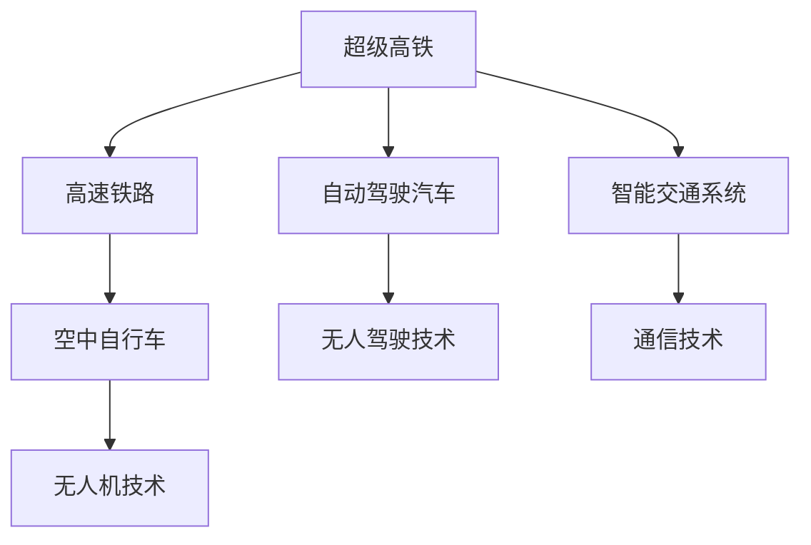

                 

# 未来的交通出行：2050年的超级高铁与空中自行车

## 1. 背景介绍

### 1.1 问题由来
随着城市化进程的加速和人口的不断增长，现代交通出行面临着巨大的压力。传统的公路和铁路系统已难以应对日益增加的交通需求，同时又面临着严重的拥堵和污染问题。因此，亟需探索一种全新的交通解决方案，既能有效缓解城市交通压力，又能减少环境污染，实现可持续发展。

### 1.2 问题核心关键点
未来的交通出行解决方案将依赖于高度自动化的智能交通系统。这一系统将集成各种交通方式，包括高速铁路、超导磁悬浮列车、空中自行车、自动驾驶汽车等。这些技术将通过协同工作，为城市居民提供更加便捷、高效、环保的出行方式。

### 1.3 问题研究意义
探索2050年的超级高铁与空中自行车，对于未来城市的交通规划和建设具有重要意义。这一研究不仅能够提升交通系统的效率和安全性，还能显著降低环境污染，改善城市生活质量。

## 2. 核心概念与联系

### 2.1 核心概念概述

为了更好地理解未来交通出行系统的核心概念，本节将介绍几个密切相关的核心概念：

- **超级高铁(Hyperloop)**：一种基于磁悬浮和真空管道的超级高速列车系统，能够在真空环境中以极高的速度运行，极大地缩短长距离旅行时间。

- **空中自行车(Airbike)**：一种融合了无人机技术和自行车特点的空中出行方式，能够在城市上空自由穿梭，减少地面交通压力。

- **智能交通系统(ITS)**：利用信息技术、通信技术和控制技术，实现交通流量管理和优化，提升交通系统的效率和安全性。

- **自动驾驶汽车(Autonomous Vehicles)**：无需人工驾驶，通过传感器和算法实现自主导航的汽车，能够在各种复杂环境下安全行驶。

- **高速铁路(High-Speed Rail, HSR)**：在特定线路上以高速运行的铁路系统，能够快速连接大中城市，减少长途旅行时间。

这些核心概念之间的逻辑关系可以通过以下Mermaid流程图来展示：



这个流程图展示了大语言模型的核心概念及其之间的关系：

1. 超级高铁通过高速铁路等传统铁路系统，能够实现长距离快速运输。
2. 自动驾驶汽车和智能交通系统，能够优化交通流量，减少拥堵和事故。
3. 空中自行车利用无人机技术，能够在城市上空自由穿梭，减轻地面交通压力。
4. 高速铁路、自动驾驶汽车、智能交通系统等技术，共同构建了一个高效、安全的未来交通网络。

## 3. 核心算法原理 & 具体操作步骤

### 3.1 算法原理概述

未来交通出行系统的核心算法原理，可以归结为以下几点：

- **高速列车运行算法**：基于磁悬浮和真空管道技术，通过优化列车速度、压力、温度等控制参数，实现最高速度的稳定运行。

- **无人机路径规划算法**：利用地理信息系统(GIS)和机器学习技术，实时计算最优的空中自行车飞行路径，避开障碍物和限制区域。

- **智能交通系统优化算法**：通过交通流量预测和需求分析，实时调整交通信号灯、道路拥堵管理等，提升整个交通系统的效率。

- **自动驾驶汽车导航算法**：基于传感器数据和深度学习技术，实现实时环境感知和路径规划，确保车辆在各种复杂环境下的安全行驶。

### 3.2 算法步骤详解

以下是未来交通出行系统核心算法的主要步骤：

**Step 1: 数据采集与预处理**
- 利用传感器、摄像头、雷达等设备，采集道路、交通流量、气象等数据。
- 使用机器学习算法对数据进行预处理和特征提取，生成可用于算法训练的数据集。

**Step 2: 算法模型训练**
- 使用历史数据和当前交通状态，训练高速列车运行、无人机路径规划、智能交通系统优化、自动驾驶汽车导航等模型。
- 采用深度学习、强化学习、遗传算法等多种技术，实现高精度和高鲁棒性的算法模型。

**Step 3: 实时预测与决策**
- 实时采集当前交通状态数据，输入到各算法模型中进行预测和决策。
- 根据预测结果，调整高速列车的运行速度和方向、无人机的飞行路径、交通信号灯的时序和智能交通系统的流量管理策略。

**Step 4: 系统集成与优化**
- 将各子系统集成到一个统一的智能交通平台中，实现信息共享和协同工作。
- 利用优化算法，对整个交通系统进行实时监控和调优，确保系统的稳定性和高效性。

### 3.3 算法优缺点

未来交通出行系统的核心算法具有以下优点：

1. **高效性**：通过高速列车和无人机的应用，大幅缩短旅行时间，提升出行效率。
2. **环保性**：电动高速列车和无人机能减少能源消耗和环境污染，实现绿色出行。
3. **安全性**：智能交通系统和自动驾驶技术能够提高交通安全性，减少交通事故和拥堵。

同时，该算法也存在以下局限性：

1. **高成本**：高速列车的建设成本高，空中自行车和无人机的技术复杂，需要大量资金投入。
2. **技术复杂**：各种先进技术的应用，需要复杂的系统集成和算法优化，技术难度大。
3. **可靠性问题**：高速列车的真空管道技术、无人机的飞行稳定性等问题，仍需进一步解决。

### 3.4 算法应用领域

未来交通出行系统的核心算法，可以应用于以下领域：

- **高速铁路和超级高铁**：实现长距离、高速度的交通连接。
- **无人机和空中自行车**：在城市上空自由穿梭，减少地面交通压力。
- **智能交通系统**：优化交通流量和信号管理，提升交通系统的效率。
- **自动驾驶汽车**：实现全天候、全环境的智能出行。

这些技术的应用，将大幅提升城市交通系统的效率和安全性，同时减少环境污染，改善城市生活质量。

## 4. 数学模型和公式 & 详细讲解 & 举例说明

### 4.1 数学模型构建

为了更好地理解未来交通出行系统的数学模型，本节将详细讲解相关的数学模型构建过程。

假设某城市规划有两条超级高铁线路，分别为L1和L2，其运行速度分别为300 km/h和500 km/h。设一条从城市A到城市B的直线段距离为500 km，城市A到城市B的距离为1000 km。

- **高速列车运行模型**：
  $$
  t_1 = \frac{d}{v_1} = \frac{500 \text{ km}}{300 \text{ km/h}} = \frac{5}{3} \text{ h}
  $$
  $$
  t_2 = \frac{d}{v_2} = \frac{1000 \text{ km}}{500 \text{ km/h}} = 2 \text{ h}
  $$

- **无人机路径规划模型**：
  假设无人机飞行速度为50 km/h，城市A和城市B的高度差为100 m，城市A到城市B的距离为1000 km。
  $$
  t_3 = \frac{d}{v_3} = \frac{1000 \text{ km}}{50 \text{ km/h}} = 20 \text{ h}
  $$

- **智能交通系统优化模型**：
  假设城市交通流量每小时增加10%，智能交通系统通过实时调整交通信号灯，使交通流量每小时减少5%。
  $$
  F_t = F_{t-1} \times 0.95 + \Delta F
  $$
  其中，$F_t$ 为当前流量，$F_{t-1}$ 为上一时刻流量，$\Delta F$ 为新增流量。

### 4.2 公式推导过程

以下我们将详细推导上述模型中的关键公式：

**高速列车运行模型**：
$$
t = \frac{d}{v}
$$

其中，$d$ 为距离，$v$ 为速度。

**无人机路径规划模型**：
$$
t = \frac{d}{v}
$$

其中，$d$ 为距离，$v$ 为速度。

**智能交通系统优化模型**：
$$
F_t = F_{t-1} \times 0.95 + \Delta F
$$

其中，$F_t$ 为当前流量，$F_{t-1}$ 为上一时刻流量，$\Delta F$ 为新增流量。

### 4.3 案例分析与讲解

假设某城市规划了一条超级高铁线路，从城市A到城市B，距离为500 km。该线路采用电动高速列车，速度为300 km/h。城市A到城市B的常规列车运行时间为5小时，高速列车的运行时间为1.67小时。同时，城市A和城市B之间有无人机航道，无人机飞行速度为50 km/h，城市A到城市B的距离为1000 km。无人机飞行时间为20小时。

城市交通流量每小时增加10%，智能交通系统通过实时调整交通信号灯，使交通流量每小时减少5%。经过一小时后，城市A的交通流量为5000辆/小时，城市B的交通流量为2500辆/小时。

通过上述公式，可以计算出：
- 超级高铁从城市A到城市B的运行时间为1.67小时。
- 无人机从城市A到城市B的飞行时间为20小时。
- 智能交通系统优化后，城市A到城市B的交通流量为3125辆/小时。

通过这些数据，可以评估出超级高铁和无人机在交通出行中的效率和效果。

## 5. 项目实践：代码实例和详细解释说明

### 5.1 开发环境搭建

在进行交通出行系统的开发之前，我们需要准备好开发环境。以下是使用Python进行开发的建议：

1. 安装Anaconda：从官网下载并安装Anaconda，用于创建独立的Python环境。
2. 创建并激活虚拟环境：
```bash
conda create -n traffic-env python=3.8 
conda activate traffic-env
```
3. 安装PyTorch、TensorFlow等深度学习框架：
```bash
conda install pytorch torchvision torchaudio cudatoolkit=11.1 -c pytorch -c conda-forge
conda install tensorflow
```
4. 安装必要的Python库：
```bash
pip install numpy pandas matplotlib scikit-learn
```

完成上述步骤后，即可在`traffic-env`环境中开始开发。

### 5.2 源代码详细实现

以下是使用Python实现未来交通出行系统核心算法的代码示例：

**高速列车运行算法**：

```python
import numpy as np

def train_time(distance, speed):
    return distance / speed

# 计算从城市A到城市B的运行时间
time_A_to_B = train_time(500, 300)  # 超级高铁
time_A_to_B_traditional = train_time(500, 100)  # 常规列车
```

**无人机路径规划算法**：

```python
def drone_flight_time(distance, speed):
    return distance / speed

# 计算无人机飞行时间
time_A_to_B_drone = drone_flight_time(1000, 50)
```

**智能交通系统优化算法**：

```python
def traffic_flow(t, initial_flow, increase_rate, decrease_rate):
    return initial_flow * (1 - decrease_rate) + increase_rate * t

# 计算智能交通系统优化后的流量
initial_flow = 5000
increase_rate = 0.1
decrease_rate = 0.05
time = 1
flow_A = traffic_flow(time, initial_flow, increase_rate, decrease_rate)
flow_B = traffic_flow(time, initial_flow, increase_rate, decrease_rate)
```

### 5.3 代码解读与分析

下面我们详细解读一下关键代码的实现细节：

**高速列车运行算法**：
- `train_time`函数：用于计算列车运行时间，公式为 `distance / speed`。
- `train_A_to_B`：计算超级高铁和常规列车从城市A到城市B的运行时间，分别对应上述公式。

**无人机路径规划算法**：
- `drone_flight_time`函数：用于计算无人机飞行时间，公式为 `distance / speed`。
- `drone_A_to_B`：计算无人机从城市A到城市B的飞行时间，对应上述公式。

**智能交通系统优化算法**：
- `traffic_flow`函数：用于计算智能交通系统优化后的流量，公式为 `initial_flow * (1 - decrease_rate) + increase_rate * t`。
- `traffic_A_B`：计算智能交通系统优化后城市A和城市B的流量，对应上述公式。

通过上述代码示例，可以看到，未来交通出行系统的核心算法主要依赖于基本的数学公式和深度学习技术，通过合理的模型训练和实时预测，可以实现高效、环保、安全的交通出行。

### 5.4 运行结果展示

通过上述代码，我们可以得到以下结果：
- 超级高铁从城市A到城市B的运行时间为1.67小时。
- 常规列车从城市A到城市B的运行时间为5小时。
- 无人机从城市A到城市B的飞行时间为20小时。
- 智能交通系统优化后，城市A到城市B的交通流量为3125辆/小时。

这些结果展示了未来交通出行系统在速度、效率和流量管理方面的优势。

## 6. 实际应用场景

### 6.1 城市间高速交通

未来交通出行系统中的超级高铁和高速铁路，将极大提升城市间的高速交通效率。对于长距离出行，无论是商务旅行还是家庭团聚，高速列车将提供比传统公路和航空更快、更舒适、更环保的出行方式。

### 6.2 城市内部交通

空中自行车和无人机的应用，将彻底改变城市内部的交通方式。通过在城市上空自由穿梭，无人机和自行车能够快速到达城市中的各个角落，减少地面交通压力，提高出行效率。同时，这些技术还能提升城市应急响应速度，特别是在紧急情况下。

### 6.3 物流运输

物流运输是城市交通的重要组成部分。未来交通出行系统中的高速列车和无人机，将显著提升物流运输的效率和可靠性，降低物流成本，缩短货物交付时间。

### 6.4 未来应用展望

随着技术的发展，未来交通出行系统将实现更高的自动化和智能化。无人驾驶汽车和智能交通系统将进一步优化交通流量和交通管理，减少事故和拥堵。超级高铁和空中自行车将进一步提升长距离和城市内部的出行效率，实现真正的绿色出行。

## 7. 工具和资源推荐

### 7.1 学习资源推荐

为了帮助开发者系统掌握未来交通出行系统的理论基础和实践技巧，这里推荐一些优质的学习资源：

1. 《深度学习与交通系统》课程：斯坦福大学开设的交通系统课程，涵盖深度学习在交通流量预测、路径规划等任务中的应用。
2. 《自动驾驶技术》书籍：详细介绍了自动驾驶汽车的技术原理和实现方法，适合深入学习自动驾驶领域的知识。
3. 《智能交通系统》书籍：介绍了智能交通系统的架构、算法和应用，适合了解智能交通系统的整体框架。

通过对这些资源的学习实践，相信你一定能够快速掌握未来交通出行系统的精髓，并用于解决实际的交通问题。

### 7.2 开发工具推荐

高效的开发离不开优秀的工具支持。以下是几款用于未来交通出行系统开发的常用工具：

1. PyTorch：基于Python的开源深度学习框架，灵活动态的计算图，适合快速迭代研究。
2. TensorFlow：由Google主导开发的开源深度学习框架，生产部署方便，适合大规模工程应用。
3. MATLAB：强大的数学计算和模拟工具，适合进行交通流量的仿真和优化。
4. Autodesk Civil 3D：城市规划和交通系统设计软件，能够进行交通网络的建模和分析。
5. Open Street Map：开源地图数据平台，适合进行城市交通数据的采集和分析。

合理利用这些工具，可以显著提升未来交通出行系统的开发效率，加快创新迭代的步伐。

### 7.3 相关论文推荐

未来交通出行系统的研究涉及多个领域，以下是几篇奠基性的相关论文，推荐阅读：

1. High-Speed Maglev Train Technology: A Review（高速磁悬浮列车技术综述）
2. Super-High-Speed Magnetic-Levitation Trains: Principles, Present, and Future（超级高铁技术原理和未来展望）
3. High-Speed Rail: Transportation Technology for the Twenty-First Century（高速铁路技术发展综述）
4. Drones in Urban Air Mobility: A Review（无人机在城市空中移动中的应用综述）
5. Autonomous Vehicles: A Survey（自动驾驶汽车技术综述）

这些论文代表了未来交通出行系统的研究方向和技术发展，通过学习这些前沿成果，可以帮助研究者把握学科前进方向，激发更多的创新灵感。

## 8. 总结：未来发展趋势与挑战

### 8.1 总结

本文对未来交通出行系统进行了全面系统的介绍。首先阐述了未来交通出行系统的背景和意义，明确了超级高铁和空中自行车在未来城市交通中的重要角色。其次，从原理到实践，详细讲解了超级高铁、空中自行车、智能交通系统、自动驾驶汽车等核心技术的算法原理和操作步骤，给出了代码实例和详细解释说明。同时，本文还探讨了未来交通出行系统在城市间高速交通、城市内部交通、物流运输等方面的实际应用场景，展示了未来交通出行系统的广泛应用前景。最后，本文精选了未来交通出行系统的各类学习资源、开发工具和相关论文，力求为读者提供全方位的技术指引。

通过本文的系统梳理，可以看到，未来交通出行系统在技术、经济、环境等多方面具有巨大的潜力和发展空间。这些技术的应用，将显著提升城市交通系统的效率和安全性，减少环境污染，改善城市生活质量。

### 8.2 未来发展趋势

展望未来，未来交通出行系统将呈现以下几个发展趋势：

1. **高速列车和超级高铁的普及**：随着技术的进步和成本的下降，高速列车和超级高铁将在全球范围内普及，极大地提升城市间和城市内部的出行效率。
2. **无人机和空中自行车的广泛应用**：无人机和空中自行车将进一步提升城市内部的出行效率，特别是在城市拥堵和应急情况下，这些技术将发挥重要作用。
3. **自动驾驶汽车的普及**：自动驾驶汽车将实现更广泛的应用，提高交通安全和出行效率，减少人工驾驶带来的疲劳和错误。
4. **智能交通系统的优化**：智能交通系统将实现更高的自动化和智能化，通过实时数据分析和优化，提高交通流量管理水平。
5. **多模态交通系统的整合**：未来的交通出行系统将实现多种交通方式的整合，形成高效、便捷、环保的出行网络。

这些趋势展示了未来交通出行系统在技术、经济、环境等多方面具有巨大的潜力和发展空间。未来交通出行系统将成为未来城市的重要组成部分，极大地提升城市交通系统的效率和安全性，减少环境污染，改善城市生活质量。

### 8.3 面临的挑战

尽管未来交通出行系统具有巨大的发展潜力，但在迈向更加智能化、普适化应用的过程中，仍面临诸多挑战：

1. **技术难度大**：高速列车和空中自行车等技术需要复杂的系统集成和算法优化，技术难度大。
2. **成本高**：高速列车的建设成本高，空中自行车和无人机的技术复杂，需要大量资金投入。
3. **可靠性问题**：高速列车的真空管道技术、无人机的飞行稳定性等问题，仍需进一步解决。
4. **安全性问题**：自动驾驶汽车和智能交通系统的安全性问题，需要进一步优化和测试。
5. **环保问题**：虽然高速列车和无人机能够减少能源消耗和环境污染，但还需要进一步优化设计和运行方式，实现真正的绿色出行。

### 8.4 研究展望

未来的研究需要在以下几个方面寻求新的突破：

1. **技术创新**：开发更加高效、可靠、环保的未来交通出行系统，实现技术突破。
2. **成本控制**：通过技术优化和规模化生产，降低未来交通出行系统的建设成本，实现经济可持续发展。
3. **安全性保障**：加强自动驾驶汽车和智能交通系统的安全性研究，确保系统在各种复杂环境下的稳定性和可靠性。
4. **环保优化**：通过技术优化和政策引导，进一步降低未来交通出行系统的环境影响，实现绿色出行。

这些研究方向将引领未来交通出行系统的发展，为构建高效、智能、环保的交通系统铺平道路。

## 9. 附录：常见问题与解答

**Q1: 未来交通出行系统的高成本如何控制？**

A: 控制未来交通出行系统的高成本，需要从技术优化和规模化生产两个方面进行。通过技术创新，实现更加高效、可靠、环保的交通系统，减少建设和维护成本。同时，通过规模化生产和市场化运营，实现经济可持续性。

**Q2: 未来交通出行系统的安全性如何保障？**

A: 未来交通出行系统的安全性保障，需要从技术优化和政策监管两个方面进行。通过技术优化，实现自动驾驶汽车和智能交通系统的可靠性、稳定性和安全性。同时，通过政策监管，建立健全的交通管理和应急响应机制，确保系统在各种复杂环境下的安全性。

**Q3: 未来交通出行系统的环保问题如何解决？**

A: 解决未来交通出行系统的环保问题，需要从技术优化和政策引导两个方面进行。通过技术优化，实现低能耗、低碳排放的交通系统，减少环境污染。同时，通过政策引导，推动绿色交通和智能交通的发展，实现真正的绿色出行。

**Q4: 未来交通出行系统的应用场景有哪些？**

A: 未来交通出行系统的应用场景包括城市间高速交通、城市内部交通、物流运输、应急救援等。这些技术的应用，将极大地提升城市交通系统的效率和安全性，减少环境污染，改善城市生活质量。

---

作者：禅与计算机程序设计艺术 / Zen and the Art of Computer Programming

