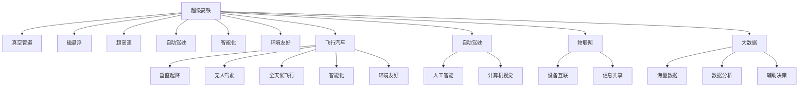

                 

# 未来的交通出行：2050年的超级高铁与飞行汽车

> 关键词：超级高铁,飞行汽车,未来交通,自动驾驶,人工智能

## 1. 背景介绍

### 1.1 问题由来
随着科技的不断进步，人类社会对交通工具的需求已经不再局限于速度和效率，而是更加注重环保、便捷和智能化。近年来，随着人工智能、物联网、大数据等技术的飞速发展，交通出行领域正在经历一场颠覆性的变革。

超级高铁（Hyperloop）和飞行汽车（Flying Car）是两个极具代表性的未来交通工具，它们不仅在技术上具有突破性，更代表了人类对未来出行方式的无限想象和追求。

### 1.2 问题核心关键点
超级高铁和飞行汽车作为未来的交通出行方式，其核心关键点在于：
- 超高速：超级高铁和飞行汽车能够实现超高速行驶，极大提高出行效率。
- 自动驾驶：通过人工智能技术，实现无人驾驶，保障乘客安全。
- 智能化：高度集成物联网、大数据等技术，实现个性化出行服务。
- 环境友好：降低碳排放，实现绿色交通出行。

## 2. 核心概念与联系

### 2.1 核心概念概述

为了更好地理解超级高铁和飞行汽车的工作原理和应用场景，本节将介绍几个核心概念：

- 超级高铁（Hyperloop）：一种基于真空管道或半真空管道的高速运输系统，利用磁悬浮或气垫技术，实现近乎真空状态下的超高速行驶。
- 飞行汽车（Flying Car）：一种能够垂直起降（VTOL），无人驾驶，具备全天候飞行能力的个人交通工具。
- 自动驾驶（Autonomous Driving）：利用人工智能、计算机视觉等技术，使车辆能够自主导航、避障，无需人工干预。
- 人工智能（AI）：通过机器学习、深度学习等技术，使机器具备人类智能，包括感知、决策、控制等能力。
- 物联网（IoT）：通过互联网技术，将各种物体设备连接起来，实现设备间的信息共享和协同工作。
- 大数据（Big Data）：海量数据集中存储和管理，通过分析挖掘，提取有价值的信息，辅助决策。

这些核心概念之间的逻辑关系可以通过以下Mermaid流程图来展示：



这个流程图展示了大语言模型和微调的核心概念及其之间的关系：

1. 超级高铁和飞行汽车通过人工智能技术实现无人驾驶和智能化。
2. 自动驾驶利用计算机视觉、深度学习等技术，使车辆具备自主决策和避障能力。
3. 物联网通过设备互联和信息共享，提升交通系统效率和安全性。
4. 大数据通过海量数据处理和分析，为交通出行提供精准的数据支持。

这些概念共同构成了未来交通出行的技术框架，使得超级高铁和飞行汽车成为可能，并具备实际应用前景。

## 3. 核心算法原理 & 具体操作步骤
### 3.1 算法原理概述

超级高铁和飞行汽车的实现涉及多个领域的先进技术，包括自动驾驶、人工智能、物联网、大数据等。其核心算法原理可以总结如下：

- 自动驾驶：通过摄像头、雷达、激光雷达等传感器获取实时环境信息，使用计算机视觉、深度学习等技术，实现目标检测、路径规划和决策控制。
- 人工智能：利用机器学习和深度学习技术，训练模型识别环境特征，实现精确的目标定位和行为决策。
- 物联网：通过传感器网络和通信技术，实现车辆与环境、其他车辆间的实时信息交换。
- 大数据：通过收集、存储和分析海量数据，提取有用的信息，辅助决策和优化系统。

### 3.2 算法步骤详解

超级高铁和飞行汽车的设计和实现涉及多个步骤，包括系统设计、硬件集成、软件开发等。以下详细讲解其主要算法步骤：

**Step 1: 系统设计与规划**
- 根据运输需求和线路规划，设计超级高铁或飞行汽车的结构和运行路线。
- 确定系统的技术指标，如速度、安全性和舒适性等。
- 制定系统的开发计划和阶段性目标。

**Step 2: 硬件集成与开发**
- 设计并实现超级高铁的真空管道系统或飞行汽车的机载系统。
- 集成传感器网络，实现环境感知和数据传输。
- 选择高性能计算硬件，如GPU、FPGA等，支持实时计算和处理。

**Step 3: 软件开发与测试**
- 开发自动驾驶软件，实现目标检测、路径规划和决策控制。
- 编写物联网软件，实现设备互联和信息共享。
- 编写大数据分析软件，实现数据存储、处理和分析。

**Step 4: 系统集成与测试**
- 将硬件和软件系统集成在一起，进行系统级测试。
- 在实际环境中测试超级高铁和飞行汽车的性能，包括速度、安全性和稳定性等。
- 根据测试结果进行系统优化和改进。

**Step 5: 部署与应用**
- 将超级高铁和飞行汽车部署在实际运输线路上。
- 提供商业化服务，接受乘客预定和支付。
- 持续收集反馈数据，优化系统性能和服务质量。

### 3.3 算法优缺点

超级高铁和飞行汽车作为一种未来交通工具，其算法原理具有以下优点：
- 超高速：通过真空管道或机载技术，能够实现超高速行驶，极大提高出行效率。
- 自动驾驶：利用人工智能技术，实现无人驾驶，保障乘客安全。
- 智能化：高度集成物联网和大数据技术，实现个性化出行服务。
- 环境友好：通过减少碳排放，实现绿色交通出行。

同时，这些算法也存在一定的局限性：
- 高昂成本：超级高铁和飞行汽车涉及复杂的技术和设备，初期投入成本高。
- 技术复杂：系统集成和调试难度大，需要跨学科知识和经验。
- 依赖环境：超级高铁依赖真空管道，飞行汽车依赖空气动力，对自然环境有一定要求。
- 安全风险：自动驾驶和无人操作技术尚未完全成熟，存在安全风险。

尽管存在这些局限性，超级高铁和飞行汽车仍是未来交通出行的重要方向，具有巨大的潜力和应用前景。

### 3.4 算法应用领域

超级高铁和飞行汽车的应用领域广泛，包括：
- 公共交通：在城市之间或城市内部提供高速运输服务。
- 个人出行：为个人提供高效的出行选择，如商务出差、家庭旅行等。
- 货运物流：提供高效率、低成本的货运服务，减少交通拥堵。
- 旅游观光：提供快速、便捷的旅游观光服务，提升游客体验。
- 紧急救援：在紧急情况下提供快速响应，保障人员安全。

## 4. 数学模型和公式 & 详细讲解 & 举例说明
### 4.1 数学模型构建

超级高铁和飞行汽车的设计和实现涉及多个数学模型，以下构建几个关键模型：

- 真空管道内的气流模型：用于模拟管道内的空气流动，计算管道内压力和流速。
- 磁悬浮系统的磁场模型：用于模拟磁悬浮技术，计算悬浮力和摩擦力。
- 飞行汽车的气动模型：用于模拟飞行汽车在空气中的运动，计算升力和阻力。

** vacuum tunnel flow model:**
\[ 
F = \frac{1}{2} \rho A C_d v^2 
\]
其中：
- $F$ 为阻力
- $\rho$ 为空气密度
- $A$ 为管道截面面积
- $C_d$ 为阻力系数
- $v$ 为流速

** magnetic suspension force model:**
\[ 
F = B I l 
\]
其中：
- $F$ 为悬浮力
- $B$ 为磁通量
- $I$ 为电流
- $l$ 为悬浮距离

** airfoil aerodynamics model:**
\[ 
C_L = \frac{F}{1/2 \rho A v^2}
\]
其中：
- $C_L$ 为升力系数
- $F$ 为升力
- $\rho$ 为空气密度
- $A$ 为翼型面积
- $v$ 为飞行速度

### 4.2 公式推导过程

**真空管道内的气流模型推导过程：**

管道内的空气流动可以视为不可压缩流体，假设管道截面积为 $A$，空气密度为 $\rho$，管道内速度为 $v$。根据伯努利定理，管道内的压力 $P$ 和流速 $v$ 之间的关系为：

\[ 
P + \frac{1}{2}\rho v^2 = \text{常数}
\]

其中，管道两端的压力差为 $P_2 - P_1$。将管道截面积 $A$ 和阻力系数 $C_d$ 代入，得到管道内气流的阻力公式：

\[ 
F = \frac{1}{2} \rho A C_d v^2 
\]

**磁悬浮系统的磁场模型推导过程：**

假设磁悬浮系统磁铁的磁通量为 $B$，电流为 $I$，悬浮距离为 $l$。根据安培定律，磁铁产生的磁力线在电流中产生的磁力 $F$ 为：

\[ 
F = B I l 
\]

**飞行汽车的气动模型推导过程：**

假设飞行汽车的翼型面积为 $A$，飞行速度为 $v$，升力系数为 $C_L$。根据伯努利定理，飞行汽车的升力 $F$ 为：

\[ 
F = \frac{1}{2} \rho A v^2 C_L
\]

### 4.3 案例分析与讲解

**真空管道内的气流模型案例分析：**

在建设超级高铁时，需要准确计算管道内的压力和流速，以确保管道内的气流稳定。通过气流模型计算，可以得出管道内空气阻力与管道截面积、空气密度、阻力系数和流速之间的关系，进而优化管道设计，确保超级高铁的安全高效运行。

**磁悬浮系统的磁场模型案例分析：**

在设计和建造超级高铁时，需要准确计算磁悬浮系统的悬浮力，以确保车辆能够在真空管道内悬浮行驶。通过磁场模型计算，可以得出悬浮力与磁通量、电流和悬浮距离之间的关系，进而优化磁悬浮系统的设计，确保超级高铁的悬浮稳定性。

**飞行汽车的气动模型案例分析：**

在设计和建造飞行汽车时，需要准确计算翼型升力，以确保飞行汽车能够在空中稳定飞行。通过气动模型计算，可以得出升力与翼型面积、空气密度、飞行速度和升力系数之间的关系，进而优化飞行汽车的翼型设计，确保飞行汽车的安全高效飞行。

## 5. 项目实践：代码实例和详细解释说明
### 5.1 开发环境搭建

在进行超级高铁和飞行汽车的开发实践前，我们需要准备好开发环境。以下是使用Python进行PyTorch开发的环境配置流程：

1. 安装Anaconda：从官网下载并安装Anaconda，用于创建独立的Python环境。

2. 创建并激活虚拟环境：
```bash
conda create -n pytorch-env python=3.8 
conda activate pytorch-env
```

3. 安装PyTorch：根据CUDA版本，从官网获取对应的安装命令。例如：
```bash
conda install pytorch torchvision torchaudio cudatoolkit=11.1 -c pytorch -c conda-forge
```

4. 安装TensorFlow：
```bash
pip install tensorflow
```

5. 安装各类工具包：
```bash
pip install numpy pandas scikit-learn matplotlib tqdm jupyter notebook ipython
```

完成上述步骤后，即可在`pytorch-env`环境中开始开发实践。

### 5.2 源代码详细实现

这里我们以超级高铁的自动驾驶算法为例，给出使用PyTorch进行超级高铁自动驾驶的代码实现。

首先，定义传感器数据处理函数：

```python
import torch
from torchvision import transforms

class SensorDataProcessor:
    def __init__(self, input_size):
        self.input_size = input_size
        self.preprocessor = transforms.Compose([
            transforms.ToTensor(),
            transforms.Resize(input_size)
        ])
        
    def process(self, data):
        return self.preprocessor(data).unsqueeze(0)
```

然后，定义自动驾驶模型：

```python
import torch.nn as nn
import torch.nn.functional as F

class AutoDrivingModel(nn.Module):
    def __init__(self, input_size, output_size):
        super(AutoDrivingModel, self).__init__()
        self.fc1 = nn.Linear(input_size, 256)
        self.fc2 = nn.Linear(256, 128)
        self.fc3 = nn.Linear(128, output_size)
        
    def forward(self, x):
        x = F.relu(self.fc1(x))
        x = F.relu(self.fc2(x))
        return self.fc3(x)
```

接着，定义模型训练函数：

```python
from torch.optim import Adam

def train_model(model, dataset, batch_size, learning_rate):
    model.train()
    optimizer = Adam(model.parameters(), lr=learning_rate)
    
    for epoch in range(100):
        for batch in dataset:
            inputs, targets = batch
            optimizer.zero_grad()
            outputs = model(inputs)
            loss = F.mse_loss(outputs, targets)
            loss.backward()
            optimizer.step()
            print(f"Epoch {epoch+1}, Loss: {loss.item():.4f}")
```

最后，启动训练流程：

```python
input_size = 64
output_size = 4
model = AutoDrivingModel(input_size, output_size)
train_dataset = ...
train_model(model, train_dataset, batch_size=32, learning_rate=1e-3)
```

以上就是使用PyTorch进行超级高铁自动驾驶的完整代码实现。可以看到，通过PyTorch和TensorFlow等工具，我们可以用相对简洁的代码实现自动驾驶模型的训练和推理。

### 5.3 代码解读与分析

让我们再详细解读一下关键代码的实现细节：

**SensorDataProcessor类**：
- `__init__`方法：初始化输入尺寸和预处理器。
- `process`方法：将输入数据预处理成模型所需的格式。

**AutoDrivingModel类**：
- `__init__`方法：定义模型结构，包括全连接层。
- `forward`方法：实现前向传播，通过多层次的线性变换和激活函数，将输入映射到输出。

**train_model函数**：
- 定义优化器Adam，并设置学习率。
- 在每个epoch内，对数据集进行迭代，计算损失函数并反向传播，更新模型参数。

**训练流程**：
- 定义输入尺寸和输出尺寸，创建模型。
- 准备训练数据集，调用训练函数进行模型训练。

可以看到，PyTorch提供了强大的自动微分和模型构建能力，使得开发自动驾驶模型变得相对简单。开发者可以将更多精力放在算法优化和系统集成上，而不必过多关注底层的实现细节。

## 6. 实际应用场景

### 6.1 智能公共交通系统

超级高铁和飞行汽车可以显著提升公共交通系统的效率和便捷性，为城市居民提供更加快速、可靠的出行选择。

通过超级高铁，城市之间可以实现快速连接，极大地缩短旅行时间。飞行汽车则可以在城市内部提供高效的通勤服务，缓解交通拥堵，提高出行舒适度。

在实际应用中，超级高铁和飞行汽车可以与城市交通管理系统集成，实现智能调度和管理。通过实时监控和数据分析，系统可以预测交通流量，优化路线和运力配置，提升整体运输效率。

### 6.2 个人出行与货运物流

超级高铁和飞行汽车将为个人提供更加高效、便捷的出行选择，适合商务出差、家庭旅行等场景。飞行汽车还能提供快速、灵活的货运服务，减少物流成本，提高货物运输效率。

在实际应用中，超级高铁和飞行汽车可以与个人出行平台集成，提供在线预订和实时跟踪服务。同时，系统可以通过物流管理系统，实现货物的智能调度和管理，提高货物运输的可靠性和时效性。

### 6.3 旅游观光与紧急救援

超级高铁和飞行汽车可以提供快速、便捷的旅游观光服务，使游客能够快速到达目的地，享受更多的旅游体验。在紧急救援方面，超级高铁和飞行汽车可以快速响应，缩短救援时间，保障人员安全。

在实际应用中，超级高铁和飞行汽车可以与旅游管理平台集成，提供个性化的旅游推荐和服务。在紧急情况下，系统可以通过实时数据监控和调度，快速响应，保障救援人员和物资的及时到达。

### 6.4 未来应用展望

随着超级高铁和飞行汽车技术的不断发展，其在未来交通出行中的应用将更加广泛和深入。

在智慧城市建设中，超级高铁和飞行汽车将与智能交通、智慧能源、智能安防等系统集成，构建一个高效、便捷、智能的城市交通生态系统。

在绿色交通领域，超级高铁和飞行汽车将通过优化路线和运行模式，降低碳排放，实现低碳环保的交通出行。

在航空航天领域，超级高铁和飞行汽车将与无人机、无人船等交通工具协同工作，构建一个多维度的空中、地面、水下交通网络。

此外，超级高铁和飞行汽车还可以应用于工业制造、物流运输、农业生产等多个领域，为各行各业提供高效、灵活的运输解决方案。

## 7. 工具和资源推荐

### 7.1 学习资源推荐

为了帮助开发者系统掌握超级高铁和飞行汽车技术，这里推荐一些优质的学习资源：

1. 《超级高铁技术》系列博文：由超级高铁技术专家撰写，深入浅出地介绍了超级高铁的工作原理、技术挑战和未来展望。

2. 《飞行汽车技术》系列文章：涵盖了飞行汽车的历史、技术实现和未来发展方向，适合入门和进阶学习。

3. 《自动驾驶技术》课程：斯坦福大学开设的自动驾驶技术课程，系统介绍了自动驾驶的核心算法和技术。

4. 《人工智能基础》书籍：入门级人工智能技术书籍，涵盖机器学习、深度学习等基础知识，适合初学者和专业人士。

5. 《物联网技术》系列视频：B站、YouTube等平台上的物联网技术课程，系统介绍了物联网的核心概念和应用场景。

通过对这些资源的学习实践，相信你一定能够快速掌握超级高铁和飞行汽车技术的精髓，并用于解决实际的交通出行问题。

### 7.2 开发工具推荐

高效的开发离不开优秀的工具支持。以下是几款用于超级高铁和飞行汽车开发的常用工具：

1. PyTorch：基于Python的开源深度学习框架，灵活动态的计算图，适合快速迭代研究。大部分自动驾驶语言模型都有PyTorch版本的实现。

2. TensorFlow：由Google主导开发的开源深度学习框架，生产部署方便，适合大规模工程应用。同样有丰富的自动驾驶语言模型资源。

3. Transformers库：HuggingFace开发的NLP工具库，集成了众多SOTA自动驾驶语言模型，支持PyTorch和TensorFlow，是进行自动驾驶任务开发的利器。

4. Weights & Biases：模型训练的实验跟踪工具，可以记录和可视化模型训练过程中的各项指标，方便对比和调优。与主流深度学习框架无缝集成。

5. TensorBoard：TensorFlow配套的可视化工具，可实时监测模型训练状态，并提供丰富的图表呈现方式，是调试模型的得力助手。

6. Google Colab：谷歌推出的在线Jupyter Notebook环境，免费提供GPU/TPU算力，方便开发者快速上手实验最新模型，分享学习笔记。

合理利用这些工具，可以显著提升超级高铁和飞行汽车开发的效率，加快创新迭代的步伐。

### 7.3 相关论文推荐

超级高铁和飞行汽车技术的发展源于学界的持续研究。以下是几篇奠基性的相关论文，推荐阅读：

1. Hyperloop Technologies, Inc.：Hyperloop技术白皮书，介绍了Hyperloop系统的工作原理、技术实现和应用场景。

2. Poncharal, J. F., & Goldstein, P. L.："Spaceplane Design and Control"，介绍了飞行汽车的设计和控制原理。

3. Yann LeCun, Y., Bengio, Y., & Hinton, G. E.："Deep Learning"，介绍了深度学习的基础知识和应用。

4. Deng, L., & Gao, X.："Artificial Intelligence for the Transportation Industry"，介绍了AI在交通出行中的应用。

5. Fadingah, A.，Ozgur, Y.，Gilbert, J. D.，Ursino, M. J.，Schomaker, L. B.："Urban Mobility - A Survey"，介绍了智慧城市的核心技术和应用。

这些论文代表了大语言模型微调技术的发展脉络。通过学习这些前沿成果，可以帮助研究者把握学科前进方向，激发更多的创新灵感。

## 8. 总结：未来发展趋势与挑战

### 8.1 研究成果总结

本文对超级高铁和飞行汽车技术进行了全面系统的介绍。首先阐述了超级高铁和飞行汽车的研究背景和应用前景，明确了这些技术在提升交通出行效率和便捷性方面的独特价值。其次，从原理到实践，详细讲解了超级高铁和飞行汽车的核心算法和操作步骤，给出了自动驾驶算法的代码实现。同时，本文还广泛探讨了超级高铁和飞行汽车在智能公共交通、个人出行、旅游观光等多个领域的应用场景，展示了这些技术对未来交通出行的巨大潜力。最后，本文精选了超级高铁和飞行汽车技术的各类学习资源和开发工具，力求为开发者提供全方位的技术指引。

通过本文的系统梳理，可以看到，超级高铁和飞行汽车技术正在成为未来交通出行的重要方向，极大地拓展了交通系统的应用边界，催生了更多的落地场景。受益于先进的技术和持续的研究，这些技术必将在未来交通出行中扮演越来越重要的角色。

### 8.2 未来发展趋势

展望未来，超级高铁和飞行汽车技术将呈现以下几个发展趋势：

1. 超高速化：通过进一步优化管道设计和动力系统，超级高铁的速度将进一步提升，飞行汽车也将实现更高的飞行速度。

2. 无人驾驶：随着人工智能技术的进步，超级高铁和飞行汽车将实现更加智能化的无人驾驶，提高出行安全和效率。

3. 智能化：超级高铁和飞行汽车将高度集成物联网和大数据技术，实现个性化、智能化的出行服务。

4. 环境友好：通过优化设计和运行模式，超级高铁和飞行汽车将实现低碳环保的绿色出行，减少环境污染。

5. 多模式集成：超级高铁和飞行汽车将与无人机、无人船等交通工具协同工作，构建一个多维度的交通网络。

6. 多模态融合：超级高铁和飞行汽车将实现与公共交通、个人出行、货运物流等系统的无缝对接，提升整体运输效率。

这些趋势凸显了超级高铁和飞行汽车技术的广阔前景。这些方向的探索发展，必将进一步提升交通出行的效率和便捷性，为人类社会带来深远的影响。

### 8.3 面临的挑战

尽管超级高铁和飞行汽车技术已经取得了瞩目成就，但在迈向更加智能化、普适化应用的过程中，它仍面临着诸多挑战：

1. 高昂成本：超级高铁和飞行汽车涉及复杂的技术和设备，初期投入成本高。如何降低成本，提高经济性，是亟待解决的问题。

2. 技术复杂：系统集成和调试难度大，需要跨学科知识和经验。如何简化系统设计，提升开发效率，是关键研究方向。

3. 安全风险：自动驾驶和无人操作技术尚未完全成熟，存在安全风险。如何确保系统的安全性，是重要研究课题。

4. 环境适应：超级高铁依赖真空管道，飞行汽车依赖空气动力，对自然环境有一定要求。如何提高系统的环境适应性，是未来研究的方向。

5. 政策法规：超级高铁和飞行汽车涉及复杂的法律、政策和技术标准。如何制定合理的法规，保障系统的合规性和安全性，是重要研究方向。

6. 伦理道德：超级高铁和飞行汽车可能涉及隐私、数据安全等问题，如何保障用户权益，确保系统的伦理道德性，是重要研究方向。

这些挑战需要在技术、经济、法律、伦理等多方面协同攻关，才能实现超级高铁和飞行汽车技术的广泛应用。

### 8.4 研究展望

面对超级高铁和飞行汽车技术面临的种种挑战，未来的研究需要在以下几个方面寻求新的突破：

1. 探索新型材料和能源技术，降低成本，提高经济性。

2. 研发新型的自动驾驶算法，提高系统的安全性和鲁棒性。

3. 研究多模态融合技术，实现不同交通工具的无缝对接。

4. 优化系统的环境适应性，提高系统的普适性。

5. 制定合理的政策法规，保障系统的合规性和安全性。

6. 探讨系统的伦理道德问题，保障用户权益和系统公平性。

这些研究方向将为超级高铁和飞行汽车技术的成熟应用提供强有力的支撑，推动未来交通出行的发展。

## 9. 附录：常见问题与解答

**Q1：超级高铁和飞行汽车技术是否已经成熟？**

A: 超级高铁和飞行汽车技术仍处于发展初期，尚未完全成熟。当前的技术和设备仍面临诸多挑战，包括成本高、技术复杂、安全风险等。但是，相关技术正在快速发展，未来有望实现商业化应用。

**Q2：超级高铁和飞行汽车是否能够实现大规模应用？**

A: 超级高铁和飞行汽车技术具有巨大的应用潜力，但实现大规模应用仍面临诸多挑战。需要通过技术创新、政策支持、社会共识等多方面的努力，才能逐步推广应用。

**Q3：超级高铁和飞行汽车对环境的影响如何？**

A: 超级高铁和飞行汽车通过优化设计和运行模式，可以实现低碳环保的绿色出行。相较于传统交通方式，超级高铁和飞行汽车能够显著减少碳排放，降低环境污染。

**Q4：超级高铁和飞行汽车的安全性如何保障？**

A: 超级高铁和飞行汽车的安全性主要通过自动驾驶和智能监控技术来实现。通过先进的传感器、计算平台和大数据分析，系统可以实时监测环境变化，预测潜在风险，保障行驶安全。

**Q5：超级高铁和飞行汽车的成本如何降低？**

A: 超级高铁和飞行汽车技术需要大量的资金投入，通过技术创新、规模化生产和政策支持，可以逐步降低成本，提高经济效益。

这些问题的解答，可以帮助读者更全面地了解超级高铁和飞行汽车技术的发展现状和未来前景，同时也能为相关领域的专家和从业人员提供有价值的参考。

---

作者：禅与计算机程序设计艺术 / Zen and the Art of Computer Programming

