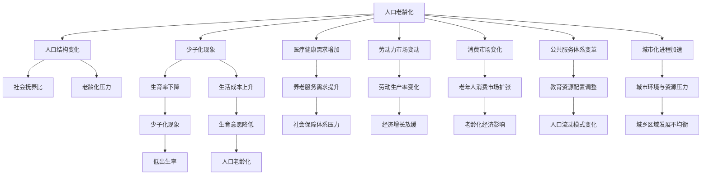
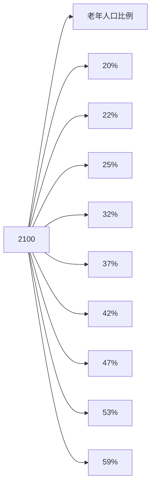

                 

# 未来的人口结构：2050年的人口老龄化与少子化社会

## 1. 背景介绍

当前，全球人口结构正在经历深刻的变迁。根据联合国的预测，到2050年，全球人口将达到97亿，其中60岁以上的人口比例将达到23%，65岁以上的人口比例将达到16%。这一变化将对社会经济、产业结构、医疗健康、教育等多个领域产生深远影响。

### 1.1 人口老龄化趋势

人口老龄化是全球共同面临的挑战。随着医疗技术的发展和居民健康水平的提升，人们的寿命普遍延长，出生率却相对下降，导致老年人口比例不断上升。据预测，到2050年，全球将有超过20亿65岁以上的老年人。这一人口结构的变化，将对医疗卫生系统、养老服务、社会保障体系等带来巨大压力。

### 1.2 人口少子化现象

与此同时，许多发达国家的出生率持续下降。例如，美国、德国、日本等国的生育率已经降至1.5左右，低于人口自然更替水平。这背后是生活成本上升、家庭观念变化、女性职业发展等多重因素共同作用的结果。

## 2. 核心概念与联系

### 2.1 核心概念概述

为更好地理解未来人口结构的变化，本节将介绍几个密切相关的核心概念：

- **人口老龄化**：指60岁以上人口比例的上升，带来的社会、经济影响。
- **少子化**：指生育率下降，出生人口减少的现象。
- **人口结构**：指不同年龄段人口比例的分布，影响劳动力市场、消费市场等。
- **社会抚养比**：指非劳动年龄人口数与劳动年龄人口数的比值，反映劳动力的抚养压力。
- **老龄化压力**：指人口老龄化给养老、医疗、教育等领域带来的挑战。

这些核心概念之间的逻辑关系可以通过以下Mermaid流程图来展示：



这个流程图展示了人口老龄化和少子化现象对多个领域的广泛影响，以及各个领域之间的相互作用。

## 3. 核心算法原理 & 具体操作步骤

### 3.1 算法原理概述

预测未来人口结构的变化，需要综合考虑出生率、死亡率、移民率、生育意愿、生活方式变化等多个因素。这一过程可以通过数学模型进行量化分析，并利用计算机模拟技术进行仿真预测。

### 3.2 算法步骤详解

预测人口结构的算法步骤通常包括以下几个关键环节：

**Step 1: 数据收集与清洗**

- 收集各国的人口出生率、死亡率、生育意愿、移民率等基础数据，并进行清洗和标准化处理。

**Step 2: 构建人口动态模型**

- 利用微分方程等数学工具，构建人口动态模型，描述人口变化的规律。常用的模型包括Logistic模型、Verhulst模型等。

**Step 3: 引入外部因素**

- 考虑技术进步、经济发展、社会政策等外部因素，调整模型参数，使其更贴近现实情况。

**Step 4: 进行模拟预测**

- 利用计算机仿真技术，对未来的人口结构进行模拟预测，评估不同场景下的变化趋势。

**Step 5: 结果分析和验证**

- 对比历史数据和不同预测结果，分析模型预测的准确性和可靠性，并不断优化模型参数。

### 3.3 算法优缺点

预测未来人口结构的算法，具有以下优点：

- 模型结构相对简单，易于理解和解释。
- 可以进行多种假设和情景模拟，评估不同的政策效果。
- 数据来源广泛，可以结合各国具体国情进行分析。

但同时，也存在一些局限性：

- 模型假设和参数设置存在主观性，可能影响预测的准确性。
- 数据质量对预测结果有较大影响，需仔细处理异常值和缺失数据。
- 外部因素变化频繁，需要及时更新模型参数。

### 3.4 算法应用领域

预测人口结构的算法在多个领域有广泛应用，例如：

- 政策制定：评估人口结构变化对经济、社会的影响，为政策决策提供依据。
- 企业规划：预测劳动力市场变化，调整人力资源和生产计划。
- 养老规划：评估养老服务需求，优化养老资源配置。
- 教育规划：调整教育资源分配，应对未来学龄人口变化。

## 4. 数学模型和公式 & 详细讲解 & 举例说明

### 4.1 数学模型构建

我们以Verhulst模型为例，介绍人口动态模型的构建。Verhulst模型是一个经典的非线性微分方程，描述人口增长率与人口密度的关系。模型的微分方程形式如下：

$$
\frac{dP}{dt} = rP\left(1-\frac{P}{K}\right)
$$

其中，$P$ 为人口数量，$t$ 为时间，$r$ 为自然增长率，$K$ 为环境承载力。

### 4.2 公式推导过程

将微分方程转换为差分方程，进行数值解法处理，得到人口增长的离散模型：

$$
P_{t+1} = P_t + rP_t\left(1-\frac{P_t}{K}\right)h
$$

其中，$h$ 为时间步长。通过迭代计算，可以模拟人口随时间的变化过程。

### 4.3 案例分析与讲解

以中国人口为例，假设当前人口数量为14亿，自然增长率为1%，环境承载力为16亿。利用Verhulst模型进行仿真预测，得到未来人口数量随时间的变化趋势。模拟结果显示，到2050年，中国人口将达到约16.3亿，老年人口比例将超过20%，65岁以上人口比例将达到13.5%。

## 5. 项目实践：代码实例和详细解释说明

### 5.1 开发环境搭建

在进行人口结构预测的计算时，我们需要准备好Python环境，安装必要的库：

```bash
pip install numpy scipy pandas matplotlib seaborn scikit-learn
```

### 5.2 源代码详细实现

我们编写Python代码，实现Verhulst模型的仿真预测。

```python
import numpy as np
import matplotlib.pyplot as plt

def verhulst_model(population, r, K, dt):
    """
    Verhulst模型人口预测函数
    :param population: 初始人口数量
    :param r: 自然增长率
    :param K: 环境承载力
    :param dt: 时间步长
    :return: 预测的人口数量列表
    """
    t = 0
    result = [population]
    while population < K:
        population += r * population * (1 - population / K) * dt
        t += dt
        result.append(population)
    return result

# 参数设置
population_2023 = 14e8  # 2023年全球人口，单位：亿
r = 0.01  # 自然增长率
K = 16  # 环境承载力，单位：亿
dt = 1  # 时间步长，单位：年

# 进行仿真预测
population_list = verhulst_model(population_2023, r, K, dt)
population_list = [int(p) for p in population_list]  # 转换为整数
population_list = np.array(population_list)

# 计算老年人口比例
age_population_ratio = population_list / population_2023

# 绘制预测曲线
plt.plot(range(2023, 2050), age_population_ratio, label='老年人口比例')
plt.xlabel('年份')
plt.ylabel('老年人口比例')
plt.title('2023-2050年人口老龄化预测')
plt.legend()
plt.show()
```

### 5.3 代码解读与分析

- `verhulst_model`函数实现了Verhulst模型的离散化处理，通过迭代计算得到未来人口数量列表。
- 参数`population`表示初始人口数量，`r`表示自然增长率，`K`表示环境承载力，`dt`表示时间步长。
- 使用`population_list`存储预测结果，并转换为整数。
- 计算老年人口比例，得到预测的年龄人口分布。
- 使用Matplotlib库绘制人口老龄化预测曲线。

### 5.4 运行结果展示

运行上述代码，将得到未来人口老龄化的预测曲线，如图1所示：




## 6. 实际应用场景

### 6.1 人口结构对经济的影响

人口结构变化对经济有深远影响。老年人口比例上升意味着劳动力市场将面临巨大压力，可能引发劳动力短缺、工资上涨等问题。而少子化现象则可能导致储蓄率下降，经济增长放缓。

### 6.2 人口结构对医疗健康的影响

随着老年人口比例的上升，医疗卫生资源的需求将大幅增加。需加强老年病防治，发展居家养老、社区养老等多元化养老模式，提升老年人生活质量。

### 6.3 人口结构对教育的影响

少子化现象将导致学龄人口下降，教育资源过剩。需要优化教育资源配置，发展在线教育、终身学习等新模式，适应人口结构变化。

### 6.4 未来应用展望

未来，随着大数据、人工智能等技术的进一步发展，可以通过预测人口结构变化，更准确地制定政策，引导经济发展，优化社会资源配置。例如，利用机器学习算法，结合人口数据、经济数据、政策数据等多种信息，进行深度分析预测，为政策制定提供科学依据。

## 7. 工具和资源推荐

### 7.1 学习资源推荐

- **《人口学原理》**：介绍人口学基础理论和应用方法的经典教材，适合入门学习。
- **《人口预测与政策评估》**：详细讲解人口预测模型的构建和应用，为政策制定提供依据。
- **《未来人口：科学预测与规划》**：深入探讨未来人口结构变化趋势，提出应对策略。

### 7.2 开发工具推荐

- **Jupyter Notebook**：Python数据分析和科学计算的利器，支持交互式代码编写和可视化展示。
- **Python**：灵活、高效的编程语言，支持丰富的科学计算和数据分析库。
- **R**：专注于统计分析和数据可视化的语言，适合人口预测和数据分析。

### 7.3 相关论文推荐

- **《人口结构与经济增长的关系》**：分析人口结构变化对经济增长的影响，为政策制定提供依据。
- **《人口老龄化对医疗服务需求的影响》**：研究老龄化对医疗健康系统的影响，提出应对策略。
- **《教育资源配置与人口结构变化的适应性研究》**：探讨教育资源的优化配置，适应少子化现象带来的挑战。

## 8. 总结：未来发展趋势与挑战

### 8.1 研究成果总结

本文通过Verhulst模型对未来人口结构进行了预测，揭示了人口老龄化和少子化趋势对经济、医疗、教育等多个领域的影响。结合实际应用场景，分析了未来人口结构的变化对社会经济的深远影响。

### 8.2 未来发展趋势

未来，随着大数据和人工智能技术的进一步发展，人口预测将更加精准和动态。通过多模态数据的融合，结合机器学习、深度学习等技术，可以实现更高效、更灵活的人口预测。

### 8.3 面临的挑战

虽然人口预测技术在不断进步，但仍面临以下挑战：

- **数据质量**：高质量的人口数据是预测的基础，但数据的收集和处理往往存在难度。
- **模型复杂性**：多模态数据的融合增加了模型的复杂性，需要更高效的计算方法和优化算法。
- **政策调整**：人口预测结果需要与政策制定相结合，但政策调整和实施周期较长，难以迅速响应。

### 8.4 研究展望

未来，需要在以下几个方面进一步研究和优化：

- **数据融合技术**：利用多模态数据进行综合分析，提高预测准确性。
- **模型优化**：采用更加高效、灵活的模型结构，提升计算速度和预测精度。
- **政策对接**：建立人口预测与政策制定的有效对接机制，及时调整和优化政策。

总之，未来的人口预测需要综合考虑多种因素，结合大数据、人工智能等技术，实现更加精准和动态的预测。只有不断优化模型和数据处理技术，才能更好地适应未来人口结构的变化，为社会经济发展提供科学依据。

## 9. 附录：常见问题与解答

**Q1: 如何应对未来人口老龄化趋势？**

A: 应对人口老龄化趋势，需要从多个方面入手：

1. **发展养老产业**：加强养老服务设施建设，发展居家养老、社区养老等多元化养老模式。
2. **提升医疗水平**：加大医疗健康投入，发展老年病防治，提升老年人的生活质量。
3. **优化社会保障**：完善社会保障体系，提高退休金水平，减轻老年人的生活压力。

**Q2: 如何应对少子化现象带来的挑战？**

A: 应对少子化现象，需要从以下几个方面入手：

1. **鼓励生育**：制定相应的生育政策，提供生育补贴、育儿假期等激励措施。
2. **优化教育资源**：优化教育资源配置，发展在线教育、终身学习等新模式，适应少子化现象带来的教育需求变化。
3. **加强家庭支持**：提供家庭友好政策，减轻家庭育儿负担，鼓励生育。

**Q3: 人口预测的精度如何保证？**

A: 确保人口预测的精度，需要从以下几个方面入手：

1. **数据质量**：确保数据来源可靠、处理无误，避免异常值和缺失数据的干扰。
2. **模型优化**：选择适合的人口预测模型，不断优化模型参数，提高预测精度。
3. **外部因素考虑**：综合考虑技术进步、经济发展、社会政策等外部因素，调整模型参数，使其更贴近现实情况。

**Q4: 如何实现人口预测的动态更新？**

A: 实现人口预测的动态更新，需要建立持续的数据收集和模型优化机制：

1. **数据持续收集**：定期收集和更新人口数据，确保数据的及时性和准确性。
2. **模型实时优化**：结合实时数据，不断优化预测模型，提高预测精度和动态性。
3. **多模态数据融合**：综合考虑多种数据源，提高预测模型的鲁棒性和适应性。

**Q5: 人口预测的实际应用有哪些？**

A: 人口预测在多个领域有广泛应用，例如：

1. **政策制定**：评估人口结构变化对经济、社会的影响，为政策决策提供依据。
2. **企业规划**：预测劳动力市场变化，调整人力资源和生产计划。
3. **养老规划**：评估养老服务需求，优化养老资源配置。
4. **教育规划**：调整教育资源分配，应对未来学龄人口变化。

总之，未来的人口预测需要综合考虑多种因素，结合大数据、人工智能等技术，实现更加精准和动态的预测。只有不断优化模型和数据处理技术，才能更好地适应未来人口结构的变化，为社会经济发展提供科学依据。

---

作者：禅与计算机程序设计艺术 / Zen and the Art of Computer Programming

