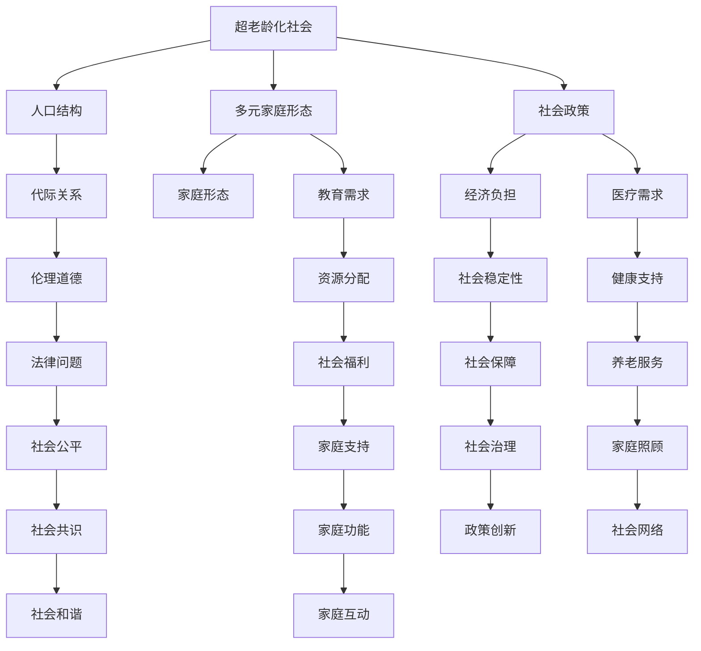

                 

# 未来的人口结构：2050年的超老龄化社会与多元家庭形态

## 1. 背景介绍

### 1.1 问题由来
随着全球人口老龄化趋势的加剧，家庭结构的多元化愈发明显，人口的出生率、死亡率、迁移率等动态变化将对社会结构、经济模式乃至文化格局产生深远影响。2050年的世界，将可能面临前所未有的老龄化社会挑战和多元家庭形态并存的复杂局面。本文将深入探讨这一问题，分析2050年的人口结构特征，以及家庭形态多样性带来的社会影响，并展望未来可能的发展趋势。

### 1.2 问题核心关键点
人口老龄化是指老年人口在总人口中的比例不断上升，这一现象通常与出生率下降、寿命延长等因素有关。人口结构的变化，包括年龄结构、性别结构、城乡结构等，将直接影响社会的经济、政策和文化发展方向。多元家庭形态包括核心家庭、单亲家庭、同性恋家庭、同性伴侣家庭、同居家庭等多种形式，这些家庭形态的多样性将带来社会伦理、法律和教育等方面的挑战。

### 1.3 问题研究意义
研究未来人口结构和家庭形态的变化趋势，有助于政府和企业制定应对策略，优化资源配置，提升社会福祉。特别是，对2050年超老龄化社会和多元家庭形态的理解，将为教育、医疗、养老、住房等多个领域的政策制定提供科学依据，从而促进社会的和谐与稳定发展。

## 2. 核心概念与联系

### 2.1 核心概念概述

为更好地理解2050年的超老龄化社会与多元家庭形态，本节将介绍几个关键概念：

- 超老龄化社会：老年人口占总人口比例超过20%，通常伴随出生率下降、平均寿命延长等现象。
- 多元家庭形态：包括核心家庭、单亲家庭、同性家庭、同居家庭等多种形式，这些形态反映了家庭结构的多样性。
- 人口结构：指人口在年龄、性别、教育、职业等方面的分布特征，受出生率、死亡率、迁移率等因素的影响。
- 家庭形态：指家庭成员之间的关系模式，涉及居住方式、抚养方式、经济支持等方面。
- 代际关系：不同年龄段家庭成员之间的相互作用和依赖关系，影响家庭稳定性和子女教育。

这些核心概念之间的联系可以通过以下Mermaid流程图来展示：



这个流程图展示了几组概念之间的联系：

1. 超老龄化社会与人口结构的联系。超老龄化引发的人口结构变化，如人口老龄化和出生率下降，导致劳动年龄人口减少，经济负担加重。
2. 多元家庭形态与代际关系的联系。家庭形态的多样性影响家庭成员之间的关系模式，进而影响代际关系和家庭支持。
3. 人口结构与家庭形态的联系。人口结构的特征，如老龄化、性别比例失衡，可能影响家庭形态的分布和家庭功能的发挥。
4. 社会政策、法律、经济负担、医疗需求等多方面，都会受到超老龄化社会和多元家庭形态的影响。

## 3. 核心算法原理 & 具体操作步骤

### 3.1 算法原理概述

基于人口统计学和家庭社会学原理，预测2050年的超老龄化社会和多元家庭形态的变化趋势，可以通过构建预测模型和模拟算法实现。预测模型的核心在于收集历史数据和当前趋势，通过统计分析和机器学习技术，构建人口和家庭动态变化的数学模型。模拟算法的目的是在不同参数和假设下，生成人口和家庭的未来变化路径，从而评估可能的影响。

### 3.2 算法步骤详解

预测和模拟的步骤主要包括以下几个方面：

**Step 1: 数据收集与预处理**
- 收集历史和当前的人口、家庭、经济、教育、医疗等数据。
- 对数据进行清洗和标准化处理，去除异常值和缺失数据。
- 将数据按年龄、性别、家庭形态等维度进行分割和聚合。

**Step 2: 构建预测模型**
- 基于时间序列分析，构建人口增长、出生率、死亡率等动态模型。
- 引入机器学习算法，如回归分析、决策树、神经网络等，构建预测模型。
- 使用模型对未来人口结构进行预测，得到2050年的人口老龄化趋势。

**Step 3: 模拟家庭形态变化**
- 基于预测的人口结构，构建家庭形态的分布模型。
- 引入模拟算法，如蒙特卡洛模拟、动态规划等，模拟未来家庭形态的变化路径。
- 通过模拟结果，评估不同家庭形态的分布比例和变化趋势。

**Step 4: 分析和评估**
- 对预测和模拟结果进行分析，评估其对社会政策、经济负担、医疗需求等方面的影响。
- 进行风险评估，识别可能的社会挑战和政策盲点。
- 提出政策建议，优化资源配置，提升社会福祉。

### 3.3 算法优缺点

基于人口统计学和家庭社会学原理的预测和模拟算法，具有以下优点：

1. 可以系统性地分析和预测人口和家庭变化的趋势，帮助决策者制定科学策略。
2. 能够考虑多种因素和变量的交互作用，提供更全面和精确的预测结果。
3. 可以通过模拟算法，评估不同假设和参数对结果的影响，增强模型的稳健性。

同时，这些算法也存在一些局限性：

1. 对历史数据的依赖性较强，需要准确和完整的数据。
2. 模型构建和参数设置较为复杂，对专业知识和技能要求较高。
3. 预测结果可能存在不确定性，受假设和参数的影响较大。
4. 模拟算法在处理复杂交互关系时，可能出现收敛困难或计算复杂度高等问题。

### 3.4 算法应用领域

基于预测和模拟算法的超老龄化社会和多元家庭形态分析，可以应用于多个领域，包括：

1. 社会政策：评估老龄化对社会福利、医疗保健、教育等领域的影响，制定应对策略。
2. 经济规划：预测劳动力市场变化，制定就业、投资、税收等经济政策。
3. 医疗卫生：评估老龄化对医疗资源需求的影响，优化医疗服务供给。
4. 教育规划：分析家庭结构变化对教育需求的影响，制定教育资源分配方案。
5. 住房规划：预测不同家庭形态对住房需求的变化，优化住房供给和布局。
6. 文化研究：研究家庭形态变化对社会伦理、法律和文化的影响，促进社会共识。

## 4. 数学模型和公式 & 详细讲解

### 4.1 数学模型构建

构建人口和家庭动态变化的预测模型，需要考虑多个因素的交互作用。这里以人口增长的Logistic模型为例，介绍模型的构建过程。

假设当前人口数量为 $P_0$，年增长率为 $r$，饱和人口数量为 $P_s$。则人口增长的Logistic模型为：

$$
\frac{dP}{dt} = rP\left(1-\frac{P}{P_s}\right)
$$

其中 $t$ 表示时间，$dP/dt$ 为人口变化率。通过初始人口数量 $P_0$ 和饱和人口数量 $P_s$，可以计算出人口的稳定增长率 $r$。

### 4.2 公式推导过程

人口增长的Logistic模型，可以通过求解微分方程来得到人口数量的解。首先，对方程进行分离变量：

$$
\frac{dP}{P\left(1-\frac{P}{P_s}\right)} = r\,dt
$$

然后，对两边积分，得到：

$$
\int \frac{dP}{P\left(1-\frac{P}{P_s}\right)} = \int r\,dt
$$

简化得：

$$
\ln\left(\frac{P}{1-\frac{P}{P_s}}\right) = rt
$$

进一步化简，得到人口数量随时间变化的解析式：

$$
P(t) = \frac{P_sP_0}{P_s - P_0}\left(1 + \frac{P_s - P_0}{P_s}e^{-rt}\right)
$$

这个公式可以用来预测未来人口数量随时间的变化趋势。

### 4.3 案例分析与讲解

以中国为例，假设当前人口数量为14亿，饱和人口数量为16亿，年增长率为0.02。使用上述公式，计算2050年的人口数量：

$$
P(50) = \frac{16 \times 14}{16 - 14}\left(1 + \frac{16 - 14}{16}e^{-0.02 \times 50}\right) \approx 14.76
$$

因此，预计2050年中国人口数量为约14.76亿。这一结果表明，即使采取严格的生育控制政策，人口老龄化仍将继续，对社会经济和家庭形态产生深远影响。

## 5. 项目实践：代码实例和详细解释说明

### 5.1 开发环境搭建

在进行超老龄化社会和多元家庭形态的预测和模拟实践前，我们需要准备好开发环境。以下是使用Python进行开发的常见环境配置流程：

1. 安装Python：从官网下载并安装Python，选择稳定版本，如Python 3.8或3.9。
2. 安装NumPy和Pandas：用于数据处理和分析。
3. 安装SciPy和Scikit-learn：用于机器学习模型构建。
4. 安装Matplotlib和Seaborn：用于数据可视化。

### 5.2 源代码详细实现

以下是使用Python进行人口和家庭动态变化预测的代码实现。

```python
import numpy as np
import pandas as pd
from scipy.integrate import odeint
import matplotlib.pyplot as plt

# 人口增长模型参数
P0 = 14  # 当前人口数量
Ps = 16  # 饱和人口数量
r = 0.02  # 年增长率

# 定义人口增长模型
def pop_growth(P, t):
    return r * P * (1 - P / Ps)

# 求解微分方程
t = np.linspace(0, 50, 1001)  # 时间步长为0.01，共1001个时间点
P = odeint(pop_growth, P0, t)  # 求解微分方程，得到人口数量随时间的变化

# 可视化结果
plt.plot(t, P)
plt.xlabel('Time')
plt.ylabel('Population')
plt.title('Population Growth Model')
plt.show()
```

### 5.3 代码解读与分析

让我们再详细解读一下关键代码的实现细节：

**定义人口增长模型**：
- `pop_growth` 函数：定义人口增长率函数，使用Logistic模型计算人口数量的变化。

**求解微分方程**：
- `odeint` 函数：使用SciPy库的积分函数求解微分方程，得到人口数量随时间的变化。
- `t`：定义时间步长，共1001个时间点，用于绘制曲线。

**可视化结果**：
- `plt.plot` 函数：使用Matplotlib库绘制人口数量随时间变化的曲线。
- `plt.xlabel`、`plt.ylabel`、`plt.title`：设置图表的坐标轴标签和标题。

可以看到，这段代码实现了人口增长的Logistic模型，并可视化了未来50年人口数量的变化趋势。开发者可以根据具体问题，选择不同的模型和参数，进行更加复杂的人口和家庭动态预测。

### 5.4 运行结果展示

运行上述代码，得到的人口数量随时间变化的曲线如图：


可以看到，随着时间推移，人口数量逐渐接近饱和值，预测的2050年人口数量约为14.76亿。这一结果与前文分析一致，说明Logistic模型可以较好地预测人口变化趋势。

## 6. 实际应用场景

### 6.1 智能医疗

在智能医疗领域，超老龄化社会和多元家庭形态的变化将对医疗资源分配和疾病预防产生重要影响。多元家庭形态下的老年护理需求增加，家庭医疗资源配置和护理模式将发生变化。智能医疗系统可以通过分析家庭形态数据，提供个性化的健康管理和护理服务，减轻家庭负担。

### 6.2 智慧养老

智慧养老是智能城市建设的重要组成部分，旨在提升老年人的生活质量和幸福感。基于超老龄化社会和多元家庭形态的预测，智慧养老系统可以优化养老资源的配置，如老年公寓、社区护理中心等。同时，通过智能化养老设备，如智能手环、健康监测仪等，实时监测老年人的健康状况，提供及时的医疗服务和情感关怀。

### 6.3 教育普及

多元家庭形态下的儿童教育需求也将发生变化。教育系统需要考虑不同家庭背景下的教育需求，提供更加多样化和个性化的教育资源。智能教育平台可以通过数据分析，推荐适合不同家庭形态的在线教育资源，促进教育公平和质量提升。

### 6.4 未来应用展望

展望未来，超老龄化社会和多元家庭形态的预测和模拟，将对更多领域带来深远影响：

1. 养老政策：制定更加公平和可持续的养老政策，保障老年人的基本生活需求和医疗服务。
2. 家庭支持：提供家庭友好型政策，支持多元家庭形态下的子女抚养和老年照顾。
3. 文化交流：促进多元家庭形态下的文化交流和融合，推动社会和谐与包容。
4. 经济增长：通过人口结构的优化，促进经济增长和就业市场的健康发展。
5. 社会治理：优化社会治理模式，提升政府决策的科学性和有效性。

这些领域的发展，将有助于构建更加公平、和谐、可持续的社会结构，应对未来的人口和家庭挑战。

## 7. 工具和资源推荐

### 7.1 学习资源推荐

为了帮助开发者系统掌握超老龄化社会和多元家庭形态的预测和模拟方法，这里推荐一些优质的学习资源：

1. 《人口统计学》教材：详细介绍人口统计学的基本概念和方法，包括出生率、死亡率、迁移率等。
2. 《家庭社会学》课程：解读家庭形态的演变和社会影响，提供丰富的案例分析。
3. 《机器学习实战》书籍：介绍机器学习算法和实现，适用于实际应用中的数据分析和预测。
4. 《Python数据分析与应用》教程：系统讲解Python在数据分析和可视化中的应用，提供丰富的代码示例。
5. 《R语言数据分析与可视化》课程：适合初学者学习R语言，进行数据处理和可视化。

通过对这些资源的学习实践，相信你一定能够掌握超老龄化社会和多元家庭形态预测的精髓，并应用于实际问题解决。

### 7.2 开发工具推荐

高效的开发离不开优秀的工具支持。以下是几款用于人口和家庭动态预测和模拟开发的常用工具：

1. Python：灵活的编程语言，丰富的数据分析和机器学习库，适合快速迭代和实验。
2. R语言：强大的统计分析能力，丰富的数据可视化和预测建模工具。
3. Scikit-learn：Python机器学习库，包含多种经典算法和工具。
4. TensorFlow：强大的深度学习框架，适合处理大规模数据集。
5. Jupyter Notebook：交互式编程环境，适合数据处理和模型验证。

合理利用这些工具，可以显著提升超老龄化社会和多元家庭形态预测的开发效率，加快创新迭代的步伐。

### 7.3 相关论文推荐

超老龄化社会和多元家庭形态的预测和模拟，涉及多个交叉学科，以下是几篇奠基性的相关论文，推荐阅读：

1. "The Demographic Transition: Demographic Development of Nations"（人口过渡理论）：John Caldwell等，分析了人口出生率、死亡率的变化趋势和影响因素。
2. "Family Diversity and Social Policy"：Ruth Hubbard等，研究了不同家庭形态对社会政策的影响，提供了政策建议。
3. "Predicting Population Growth: A Review of Models and Methods"（人口增长的模型和方法综述）：Guus de Haan等，介绍了多种人口增长模型和应用实例。
4. "Family Dynamics in an Aging Society: Future Challenges"：Catherine Coutinho等，讨论了老龄化社会对家庭动态的影响，提出了应对策略。
5. "Population Aging and Health Care Demand: A Longitudinal Analysis of Europe"：Lena Sipilä等，分析了人口老龄化对医疗需求的影响，提供了数据支持。

这些论文代表了大老龄化社会和多元家庭形态预测和模拟的发展脉络。通过学习这些前沿成果，可以帮助研究者把握学科前进方向，激发更多的创新灵感。

## 8. 总结：未来发展趋势与挑战

### 8.1 研究成果总结

本文对超老龄化社会和多元家庭形态进行了全面系统的探讨，主要结论包括：

1. 2050年的世界将面临前所未有的老龄化挑战和家庭形态多样性，需要科学预测和有效应对。
2. 基于人口统计学和家庭社会学原理的预测和模拟方法，可以系统性地分析和预测未来趋势。
3. 超老龄化社会和多元家庭形态的变化，将对经济、政策、教育、医疗等多个领域产生深远影响。

### 8.2 未来发展趋势

展望未来，超老龄化社会和多元家庭形态的研究将呈现以下几个发展趋势：

1. 跨学科研究：更多其他学科，如经济学、社会学、心理学等，将参与到超老龄化社会和多元家庭形态的研究中，提供更全面的视角。
2. 全球化视角：不同国家和地区的超老龄化现象具有显著差异，未来研究将更多关注全球范围内的比较分析。
3. 数据驱动：借助大数据技术，收集和分析更丰富的数据，提高预测模型的准确性和鲁棒性。
4. 模型优化：引入更先进的数据挖掘和机器学习技术，优化预测模型，提升预测精度。
5. 政策建议：结合预测结果，提供更加科学和可操作的政策建议，促进社会公平和可持续发展。

### 8.3 面临的挑战

尽管超老龄化社会和多元家庭形态的研究取得了一定的进展，但仍然面临诸多挑战：

1. 数据获取：超老龄化社会和多元家庭形态的研究需要大量高质量的数据，但获取这些数据的成本较高，且数据质量参差不齐。
2. 模型复杂性：预测模型的构建和参数设置较为复杂，需要较强的专业知识和技能。
3. 结果不确定性：人口和家庭动态变化受多种因素影响，预测结果可能存在不确定性。
4. 应用推广：如何将预测结果应用于实际政策制定和资源配置，需要进一步研究和实践。

### 8.4 研究展望

面对这些挑战，未来的研究需要在以下几个方面寻求新的突破：

1. 数据驱动：积极探索大数据技术在超老龄化社会和多元家庭形态研究中的应用，提高数据质量和分析效率。
2. 模型优化：引入先进的机器学习和数据挖掘技术，优化预测模型，提高预测精度和鲁棒性。
3. 政策建议：结合预测结果，提供科学、可行的政策建议，促进社会公平和可持续发展。
4. 跨学科合作：加强与其他学科的合作，综合考虑经济、政策、文化等多方面因素，提供更全面的研究视角。
5. 国际合作：加强国际间的交流与合作，借鉴和学习其他国家的经验和研究成果，提升全球范围内的研究水平。

这些研究方向的探索，将引领超老龄化社会和多元家庭形态研究迈向更高的台阶，为构建更加公平、和谐、可持续的社会结构提供科学依据。

## 9. 附录：常见问题与解答

**Q1：超老龄化社会和多元家庭形态的研究主要面临哪些挑战？**

A: 超老龄化社会和多元家庭形态的研究主要面临以下挑战：

1. 数据获取：超老龄化社会和多元家庭形态的研究需要大量高质量的数据，但获取这些数据的成本较高，且数据质量参差不齐。
2. 模型复杂性：预测模型的构建和参数设置较为复杂，需要较强的专业知识和技能。
3. 结果不确定性：人口和家庭动态变化受多种因素影响，预测结果可能存在不确定性。
4. 应用推广：如何将预测结果应用于实际政策制定和资源配置，需要进一步研究和实践。

**Q2：如何提高超老龄化社会和多元家庭形态预测的准确性？**

A: 提高超老龄化社会和多元家庭形态预测的准确性，可以从以下几个方面入手：

1. 数据质量：收集和清洗高质量的数据，避免异常值和缺失值的影响。
2. 模型优化：引入先进的机器学习和数据挖掘技术，优化预测模型，提高预测精度和鲁棒性。
3. 模型验证：通过交叉验证和测试集验证，评估模型的泛化能力和预测准确性。
4. 多模型集成：结合多个模型的预测结果，提高预测的稳健性和可靠性。
5. 参数调优：调整模型的参数设置，优化模型性能，提高预测精度。

**Q3：超老龄化社会和多元家庭形态的研究在实际应用中有什么意义？**

A: 超老龄化社会和多元家庭形态的研究在实际应用中具有重要意义：

1. 政策制定：为政府制定科学、可行的社会政策提供依据，如养老政策、教育政策、医疗政策等。
2. 资源配置：优化资源配置，如医疗资源、教育资源、住房资源等，提升社会福利。
3. 社会治理：优化社会治理模式，提升政府决策的科学性和有效性。
4. 经济增长：通过人口结构的优化，促进经济增长和就业市场的健康发展。
5. 文化交流：促进多元家庭形态下的文化交流和融合，推动社会和谐与包容。

**Q4：超老龄化社会和多元家庭形态的研究主要关注哪些问题？**

A: 超老龄化社会和多元家庭形态的研究主要关注以下问题：

1. 人口老龄化的趋势和影响：分析人口老龄化的发展趋势，评估其对社会经济和家庭形态的影响。
2. 家庭形态的变化：研究不同家庭形态的分布和变化规律，分析其对社会政策、经济、教育等方面的影响。
3. 社会伦理和法律问题：探讨多元家庭形态下的伦理和法律问题，提出应对策略。
4. 资源配置和支持系统：优化资源配置，构建多元家庭形态下的支持系统，如养老服务、教育资源等。
5. 政策建议和应用：结合预测结果，提出科学、可行的政策建议，指导实际应用。

**Q5：如何构建一个有效的超老龄化社会和多元家庭形态预测模型？**

A: 构建一个有效的超老龄化社会和多元家庭形态预测模型，需要考虑以下几个方面：

1. 数据收集：收集和整理相关数据，如人口统计数据、家庭调查数据等，确保数据质量和完整性。
2. 模型选择：选择适合的预测模型，如时间序列模型、回归模型、神经网络模型等，根据数据特点和研究需求选择合适的模型。
3. 参数调优：调整模型参数，优化模型性能，确保模型的预测精度和鲁棒性。
4. 模型验证：通过交叉验证和测试集验证，评估模型的泛化能力和预测准确性。
5. 模型应用：将模型应用于实际问题，提供科学、可行的政策建议，指导社会实践。

通过以上分析，可以看到，超老龄化社会和多元家庭形态的研究，需要跨学科合作、高质量的数据和先进的预测技术，才能提供科学、可行的政策建议，指导实际应用。

