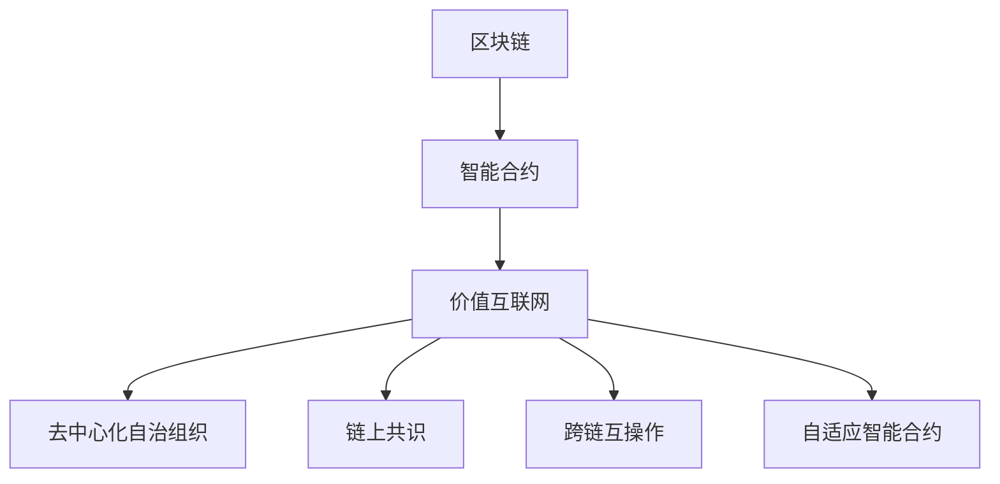

                 

## 1. 背景介绍

### 1.1 问题由来

随着技术的进步和社会需求的变化，区块链技术已经从最初的去中心化账本扩展到金融、供应链、医疗、版权、身份验证等众多领域。尤其在智能合约的推动下，区块链正在逐步构建起价值互联网的基础设施。

智能合约通过代码自动执行规则，能够实现去信任、高效、自动化的业务逻辑，是区块链应用的重要组成部分。2050年，随着人工智能、大数据、物联网等新兴技术的融合，智能合约将迎来新的变革，成为推动价值互联网发展的关键驱动力。

### 1.2 问题核心关键点

未来区块链的智能合约将具备以下特点：

- **自动执行与信任**：智能合约通过自动化执行合同条款，消除中间人的信任风险，大幅降低交易成本和时间。
- **透明度与公正性**：智能合约的代码公开透明，执行过程可追溯，确保交易的公正性和不可篡改性。
- **可编程性与扩展性**：智能合约能够编程定义复杂的业务逻辑，具备高度的扩展性和灵活性，可以适应多种应用场景。
- **跨链交互**：未来区块链将实现不同链之间的互通互联，智能合约能够跨越多个链进行交互协作。
- **数据驱动与自适应**：智能合约将更多地利用数据分析，进行动态调整与优化，提升其适应性和自适应能力。

### 1.3 问题研究意义

研究未来区块链的智能合约与价值互联网，对于推动区块链技术的深度应用、促进经济数字化转型、保障数据安全与隐私具有重要意义：

1. **促进经济效率**：智能合约能够自动化执行复杂的商业逻辑，减少人为干预，提高交易效率和透明度。
2. **保障数据安全**：通过区块链的分布式账本技术，保障数据的去中心化存储与共享，防止数据篡改和泄露。
3. **推动行业创新**：智能合约为各个行业提供新的创新机会，推动金融、供应链、医疗等行业的发展和变革。
4. **赋能社会治理**：智能合约的应用可以提升社会治理的透明度和效率，促进公共资源的优化配置。

## 2. 核心概念与联系

### 2.1 核心概念概述

为更好地理解未来区块链的智能合约与价值互联网，本节将介绍几个密切相关的核心概念：

- **区块链(Blockchain)**：一种去中心化的分布式账本技术，通过哈希指针和共识机制保证数据的不可篡改性和可追溯性。
- **智能合约(Smart Contracts)**：基于区块链技术，通过代码实现自动执行合同条款的应用程序。
- **价值互联网(Value Internet)**：基于区块链的价值交换与流通网络，通过智能合约实现价值的去中介化和自动化。
- **去中心化自治组织(Decentralized Autonomous Organizations, DAOs)**：一种基于智能合约的组织形式，不需要中心化的管理，通过程序代码和数据进行决策和自治。
- **链上共识(Layer-1 Consensus)**：区块链的底层共识机制，确保各节点对账本状态的一致性。
- **跨链互操作(Layer-2 Interoperability)**：实现不同区块链之间的互操作性，使得智能合约能够跨越多个区块链进行交互。
- **自适应智能合约(Self-adaptive Smart Contracts)**：根据环境数据动态调整逻辑的智能合约，具备更好的适应性和自优化能力。

这些核心概念之间的逻辑关系可以通过以下Mermaid流程图来展示：



这个流程图展示了大语言模型的核心概念及其之间的关系：

1. 区块链通过智能合约实现了去中心化自治，构建了价值互联网的基础设施。
2. 智能合约是区块链上的自动化合同执行程序，实现了价值互联网的自动化交易。
3. 去中心化自治组织通过智能合约进行决策和自治，是区块链应用的高级形式。
4. 链上共识确保了区块链的不可篡改性，是区块链技术的核心保障。
5. 跨链互操作使得不同区块链之间可以实现互通协作，拓展了区块链的应用场景。
6. 自适应智能合约能够根据环境数据动态调整逻辑，提升了智能合约的适应性和自优化能力。

这些概念共同构成了未来区块链智能合约与价值互联网的底层技术框架，为其进一步发展提供了坚实的基础。

## 3. 核心算法原理 & 具体操作步骤
### 3.1 算法原理概述

未来区块链的智能合约基于区块链技术，通过代码实现自动执行合同条款，具有高度的自治性和自动化。其核心算法原理包括以下几个方面：

- **自动执行与信任**：智能合约通过代码定义合同条款，确保在满足条件时自动执行，无需中间人的信任，大幅降低交易成本和时间。
- **透明度与公正性**：智能合约的代码公开透明，执行过程可追溯，确保交易的公正性和不可篡改性。
- **可编程性与扩展性**：智能合约能够编程定义复杂的业务逻辑，具备高度的扩展性和灵活性，可以适应多种应用场景。
- **跨链交互**：未来区块链将实现不同链之间的互通互联，智能合约能够跨越多个链进行交互协作。
- **数据驱动与自适应**：智能合约将更多地利用数据分析，进行动态调整与优化，提升其适应性和自适应能力。

### 3.2 算法步骤详解

未来区块链的智能合约构建与运行主要包括以下几个步骤：

**Step 1: 设计智能合约逻辑**

- 确定智能合约的业务场景和目标。
- 定义智能合约的触发条件和执行逻辑。
- 选择合适的编程语言和区块链平台。

**Step 2: 编写智能合约代码**

- 编写智能合约的代码，确保逻辑正确、可执行。
- 进行代码测试，确保没有漏洞和错误。
- 部署智能合约到区块链平台。

**Step 3: 配置智能合约参数**

- 设置智能合约的参数，如触发条件、执行时间、费用等。
- 根据业务需求，调整智能合约的参数。

**Step 4: 触发智能合约执行**

- 满足触发条件时，智能合约自动执行。
- 监控智能合约的执行状态，确保其正常运行。

**Step 5: 监控与优化**

- 监控智能合约的执行过程，确保其正常运行。
- 根据执行结果，进行数据分析和优化。

**Step 6: 扩展与维护**

- 根据业务需求，扩展智能合约的功能和逻辑。
- 定期维护智能合约，确保其稳定性和可靠性。

### 3.3 算法优缺点

未来区块链的智能合约具备以下优点：

1. **自动化执行**：通过代码实现自动执行合同条款，无需人为干预，大幅提高交易效率。
2. **去信任交易**：通过区块链的去中心化技术，消除中间人的信任风险，确保交易的安全性和公正性。
3. **高度灵活**：智能合约具备高度的扩展性和灵活性，能够适应多种应用场景。
4. **透明公开**：智能合约的代码公开透明，执行过程可追溯，确保交易的公正性和不可篡改性。

同时，未来区块链的智能合约也存在一些缺点：

1. **编程复杂性**：智能合约的编程复杂度高，需要具备一定的区块链和编程知识。
2. **安全漏洞**：智能合约的代码容易存在漏洞和错误，可能被攻击者利用。
3. **性能限制**：大规模智能合约的执行可能面临性能瓶颈，影响交易速度和效率。
4. **法律不确定性**：智能合约的合法性、有效性受到法律环境的影响，存在不确定性。

### 3.4 算法应用领域

未来区块链的智能合约将广泛应用于以下领域：

- **金融**：智能合约用于自动执行贷款、保险、资产管理等金融业务，提高交易效率和透明度。
- **供应链**：智能合约用于自动化供应链管理，提高物流和库存管理效率。
- **医疗**：智能合约用于电子病历管理、药品配送等医疗业务，提升医疗服务的效率和质量。
- **版权**：智能合约用于版权交易、版权登记等业务，保障版权的合法性和公正性。
- **身份验证**：智能合约用于身份验证、隐私保护等业务，保障用户信息的安全和隐私。
- **物联网**：智能合约用于物联网设备的管理和控制，实现自动化和智能化。

## 4. 数学模型和公式 & 详细讲解 & 举例说明
### 4.1 数学模型构建

未来区块链的智能合约主要涉及以下几个数学模型：

- **智能合约的触发条件模型**：定义智能合约的触发条件，如时间、事件、数据等。
- **智能合约的执行逻辑模型**：定义智能合约的执行逻辑，如资金转移、资产分配等。
- **智能合约的性能优化模型**：定义智能合约的性能优化策略，如代码优化、参数调整等。
- **智能合约的安全性模型**：定义智能合约的安全性保障措施，如代码审计、漏洞检测等。

### 4.2 公式推导过程

以下我们以一个简单的智能合约为例，推导其触发条件和执行逻辑的数学模型。

假设有一个智能合约，用于自动执行资产分配，规则如下：

- 如果用户满足条件A，则将资产A1分配给用户U1。
- 如果用户满足条件B，则将资产A2分配给用户U2。
- 如果用户满足条件C，则将资产A3分配给用户U3。

其数学模型可以表示为：

$$
\begin{cases}
A1 \rightarrow \text{条件A} \rightarrow \text{用户U1} \\
A2 \rightarrow \text{条件B} \rightarrow \text{用户U2} \\
A3 \rightarrow \text{条件C} \rightarrow \text{用户U3}
\end{cases}
$$

其中，$A1, A2, A3$ 表示资产，$\text{条件A, B, C}$ 表示触发条件，$\text{用户U1, U2, U3}$ 表示资产分配的目标用户。

智能合约的触发条件可以表示为：

$$
\begin{cases}
\text{条件A} \rightarrow \text{时间} \rightarrow t_A \\
\text{条件B} \rightarrow \text{事件} \rightarrow e_B \\
\text{条件C} \rightarrow \text{数据} \rightarrow d_C
\end{cases}
$$

其中，$t_A, e_B, d_C$ 表示触发条件的具体时间、事件、数据。

智能合约的执行逻辑可以表示为：

$$
\begin{cases}
A1 \rightarrow \text{条件A} \rightarrow \text{用户U1} \rightarrow t_A \\
A2 \rightarrow \text{条件B} \rightarrow \text{用户U2} \rightarrow e_B \\
A3 \rightarrow \text{条件C} \rightarrow \text{用户U3} \rightarrow d_C
\end{cases}
$$

### 4.3 案例分析与讲解

假设有一个智能合约，用于自动执行房地产租金分配，规则如下：

- 如果租房人按时支付租金，则分配租金额给房东。
- 如果租房人未按时支付租金，则扣除部分押金。
- 如果租房人提前解除合同，则扣除剩余押金。

其数学模型可以表示为：

$$
\begin{cases}
\text{租金} \rightarrow \text{按时支付租金} \rightarrow \text{分配租金额给房东} \\
\text{租金} \rightarrow \text{未按时支付租金} \rightarrow \text{扣除部分押金} \\
\text{押金} \rightarrow \text{提前解除合同} \rightarrow \text{扣除剩余押金}
\end{cases}
$$

触发条件可以表示为：

$$
\begin{cases}
\text{按时支付租金} \rightarrow \text{时间} \rightarrow t_R \\
\text{未按时支付租金} \rightarrow \text{时间} \rightarrow t_D \\
\text{提前解除合同} \rightarrow \text{时间} \rightarrow t_E
\end{cases}
$$

执行逻辑可以表示为：

$$
\begin{cases}
\text{租金} \rightarrow \text{按时支付租金} \rightarrow \text{分配租金额给房东} \rightarrow t_R \\
\text{租金} \rightarrow \text{未按时支付租金} \rightarrow \text{扣除部分押金} \rightarrow t_D \\
\text{押金} \rightarrow \text{提前解除合同} \rightarrow \text{扣除剩余押金} \rightarrow t_E
\end{cases}
$$

## 5. 项目实践：代码实例和详细解释说明
### 5.1 开发环境搭建

在进行智能合约开发前，我们需要准备好开发环境。以下是使用Solidity语言进行以太坊智能合约开发的Environment配置流程：

1. 安装Node.js：从官网下载并安装Node.js，用于编写和管理智能合约代码。

2. 安装Truffle框架：通过npm安装Truffle，用于自动化管理以太坊智能合约的开发和测试。

3. 安装Ganache或Localhost测试网络：通过Truffle安装Ganache或Localhost测试网络，用于本地测试智能合约。

4. 安装Git和GitHub：通过Git和GitHub管理智能合约代码的版本和协作。

完成上述步骤后，即可在Truffle环境中开始智能合约的开发和测试。

### 5.2 源代码详细实现

以下是一个简单的智能合约，用于自动执行资产分配，具体实现如下：

```solidity
// SPDX-License-Identifier: MIT
pragma solidity ^0.8.0;

contract AssetAllocation {
    address payable public allocator;
    uint256 public amountA1;
    uint256 public amountA2;
    uint256 public amountA3;

    constructor() public {
        allocator = msg.sender;
    }

    function distributeA1(uint256 _amountA1) public {
        uint256 _amount = address(allocator).balance;
        if (_amountA1 > _amount) {
            revert("Insufficient balance");
        }
        uint256 _balance = _amount - _amountA1;
        allocator.transfer(_balance);
    }

    function distributeA2(uint256 _amountA2) public {
        uint256 _amount = address(allocator).balance;
        if (_amountA2 > _amount) {
            revert("Insufficient balance");
        }
        uint256 _balance = _amount - _amountA2;
        allocator.transfer(_balance);
    }

    function distributeA3(uint256 _amountA3) public {
        uint256 _amount = address(allocator).balance;
        if (_amountA3 > _amount) {
            revert("Insufficient balance");
        }
        uint256 _balance = _amount - _amountA3;
        allocator.transfer(_balance);
    }
}
```

这个智能合约定义了三个资产分配函数，用于自动执行资产分配。

### 5.3 代码解读与分析

让我们再详细解读一下关键代码的实现细节：

- **constructor函数**：初始化智能合约，将发送者作为资产分配的初始拥有者。
- **distributeA1、distributeA2、distributeA3函数**：分别用于自动执行资产A1、A2、A3的分配，需要根据分配金额和资产拥有者的余额进行判断和分配。
- **revert函数**：用于检测分配金额是否超过余额，防止过度分配。

## 6. 实际应用场景

### 6.1 智能合约在金融中的应用

智能合约在金融领域的应用非常广泛，主要用于自动化执行金融交易、管理资金流和保障交易安全。

例如，智能合约可以用于自动执行贷款合同，自动触发还款和违约处理。智能合约根据贷款人的还款时间和金额，自动从贷款人的账户中扣除相应金额，并将剩余金额分配给贷款人。如果贷款人未按时还款，智能合约可以自动触发违约处理，将剩余贷款金额和利息转移给贷款人。

### 6.2 智能合约在供应链中的应用

智能合约可以用于自动化供应链管理，提高物流和库存管理效率。

例如，智能合约可以用于自动化物流配送，根据货物的位置和状态，自动触发配送操作。智能合约根据货物到达指定位置的情况，自动更新货物状态，并将更新后的状态通知配送方。智能合约还可以用于库存管理，自动触发补货和出库操作，提高库存管理效率。

### 6.3 智能合约在医疗中的应用

智能合约可以用于电子病历管理和药品配送等医疗业务，提升医疗服务的效率和质量。

例如，智能合约可以用于自动化电子病历管理，根据医生的诊断和处方，自动更新电子病历。智能合约可以根据医生的诊断和处方，自动生成药品配送单，并通知药品配送方进行配送。智能合约还可以用于药品库存管理，自动触发补货和出库操作，提高药品管理效率。

## 7. 工具和资源推荐

### 7.1 学习资源推荐

为了帮助开发者系统掌握智能合约的开发和应用，这里推荐一些优质的学习资源：

1. 《Solidity官方文档》：Solidity官方文档，提供了详细的智能合约开发指南和示例。
2. 《以太坊智能合约开发实战》书籍：以太坊智能合约开发实战，系统介绍了以太坊智能合约的开发和应用。
3. 《智能合约设计与实现》课程：Coursera上提供的智能合约设计与实现课程，涵盖了智能合约的基础知识和应用场景。
4. Truffle官方文档：Truffle官方文档，提供了Truffle框架的使用指南和示例。
5. ConsenSys Academy：ConsenSys Academy提供了丰富的智能合约开发课程和实践项目，涵盖了智能合约的开发和应用。

通过对这些资源的学习实践，相信你一定能够快速掌握智能合约的开发和应用，并将其应用于实际业务中。

### 7.2 开发工具推荐

高效的开发离不开优秀的工具支持。以下是几款用于智能合约开发的常用工具：

1. Solidity：以太坊智能合约的编程语言，具备丰富的语法和功能。
2. Truffle：以太坊智能合约开发和测试的自动化管理工具，支持智能合约的部署和测试。
3. Remix：以太坊智能合约的交互式开发平台，支持智能合约的在线编写和测试。
4. Ganache：以太坊的本地测试网络，用于本地测试智能合约。
5. MetaMask：以太坊钱包和浏览器扩展，支持智能合约的交互和管理。

合理利用这些工具，可以显著提升智能合约的开发效率，加快创新迭代的步伐。

### 7.3 相关论文推荐

智能合约技术的发展源于学界的持续研究。以下是几篇奠基性的相关论文，推荐阅读：

1. "A Smart Contract Model for Dynamic Business Processes"：提出了一种智能合约模型，用于自动化执行动态业务流程。
2. "Solidity: A Specification Language for Ethereum"：介绍了Solidity语言的设计思想和语法特点，是Solidity语言的官方文档。
3. "Programming and Verification of Smart Contracts"：提出了一种智能合约的编程和验证方法，确保智能合约的安全性和正确性。
4. "Blockchain Use Cases: Smart Contracts and Beyond"：讨论了智能合约在区块链上的应用场景和未来发展方向。
5. "Blockchain-Smart Contract-Aided Development of an Adaptive Emergency Response System"：提出了一种基于智能合约的应急响应系统，提高了应急响应的效率和可靠性。

这些论文代表了大语言模型微调技术的发展脉络。通过学习这些前沿成果，可以帮助研究者把握学科前进方向，激发更多的创新灵感。

## 8. 总结：未来发展趋势与挑战

### 8.1 总结

本文对未来区块链的智能合约与价值互联网进行了全面系统的介绍。首先阐述了智能合约在区块链中的应用，明确了智能合约在自动化交易、去信任交易、可编程性等方面的独特价值。其次，从原理到实践，详细讲解了智能合约的构建与运行过程，给出了智能合约开发的完整代码实例。同时，本文还广泛探讨了智能合约在金融、供应链、医疗等众多领域的应用前景，展示了智能合约范式的巨大潜力。最后，本文精选了智能合约技术的各类学习资源，力求为读者提供全方位的技术指引。

通过本文的系统梳理，可以看到，未来区块链的智能合约正在成为区块链应用的重要范式，极大地拓展了区块链技术的应用边界，催生了更多的落地场景。受益于区块链技术的深度应用，智能合约必将在各个行业带来变革性影响，促进经济数字化转型，提升社会治理的透明度和效率。

### 8.2 未来发展趋势

展望未来，区块链的智能合约将呈现以下几个发展趋势：

1. **跨链互操作**：未来区块链将实现不同链之间的互通互联，智能合约能够跨越多个链进行交互。跨链互操作技术将进一步提升区块链的互联互通能力，拓展智能合约的应用场景。
2. **自适应智能合约**：未来智能合约将更多地利用数据分析，进行动态调整与优化，提升其适应性和自优化能力。自适应智能合约将能够更好地应对复杂多变的业务场景。
3. **自动化治理**：未来区块链将通过智能合约实现自动化治理，提升治理效率和公平性。自动化治理技术将使区块链系统的运行更加透明和公正。
4. **边缘计算**：未来智能合约将与边缘计算技术结合，提升智能合约的计算效率和安全性。边缘计算技术将使智能合约在分布式环境下更好地运行。
5. **共识算法优化**：未来区块链将探索新的共识算法，提升区块链的效率和可靠性。共识算法优化技术将使区块链系统更高效、更稳定。

### 8.3 面临的挑战

尽管区块链的智能合约已经取得了瞩目成就，但在迈向更加智能化、普适化应用的过程中，它仍面临着诸多挑战：

1. **编程复杂性**：智能合约的编程复杂度高，需要具备一定的区块链和编程知识。如何降低智能合约的编程门槛，使更多开发者能够参与智能合约的开发，是一个亟待解决的问题。
2. **安全漏洞**：智能合约的代码容易存在漏洞和错误，可能被攻击者利用。如何提高智能合约的安全性，防止攻击和漏洞，是智能合约应用的重要课题。
3. **性能瓶颈**：大规模智能合约的执行可能面临性能瓶颈，影响交易速度和效率。如何优化智能合约的性能，提高交易速度和效率，是智能合约应用的又一挑战。
4. **法律环境不确定性**：智能合约的合法性、有效性受到法律环境的影响，存在不确定性。如何确保智能合约的法律地位，保障其合法性和公正性，是智能合约应用的重要保障。
5. **用户接受度**：智能合约的应用需要用户信任和接受，如何提升用户对智能合约的信任和接受度，是智能合约应用的重要前提。

### 8.4 研究展望

面对智能合约所面临的种种挑战，未来的研究需要在以下几个方面寻求新的突破：

1. **降低编程复杂性**：开发更加用户友好的智能合约开发工具，降低编程门槛，使更多开发者能够参与智能合约的开发。
2. **提高安全性**：探索更加安全可靠的智能合约代码审计方法，提高智能合约的安全性，防止攻击和漏洞。
3. **优化性能**：探索更加高效的智能合约执行算法，优化智能合约的性能，提高交易速度和效率。
4. **法律环境保障**：研究智能合约的法律地位和保障措施，确保智能合约的合法性和公正性。
5. **提升用户接受度**：通过教育和宣传，提升用户对智能合约的信任和接受度，促进智能合约的广泛应用。

这些研究方向将引领智能合约技术迈向更高的台阶，为构建安全、可靠、可解释、可控的智能系统铺平道路。面向未来，区块链的智能合约将在各个行业带来变革性影响，推动经济数字化转型，提升社会治理的透明度和效率。

## 9. 附录：常见问题与解答

**Q1：智能合约的编程复杂性如何降低？**

A: 智能合约的编程复杂性可以通过以下方法降低：

1. 开发更加用户友好的智能合约开发工具，如Visual Studio Code、Remix等，降低编程门槛，使更多开发者能够参与智能合约的开发。
2. 提供丰富的智能合约开发模板和示例，供开发者参考和使用。
3. 开发更加易于理解和维护的智能合约设计模式和架构，使开发者能够更高效地进行开发。

**Q2：智能合约的安全性如何保障？**

A: 智能合约的安全性可以通过以下方法保障：

1. 进行智能合约代码审计，检测代码中的漏洞和错误，确保智能合约的安全性。
2. 引入智能合约监控和告警机制，实时监控智能合约的运行状态，及时发现和处理异常情况。
3. 开发更加安全的智能合约设计模式和架构，减少安全漏洞的风险。

**Q3：智能合约的性能瓶颈如何优化？**

A: 智能合约的性能瓶颈可以通过以下方法优化：

1. 采用更加高效的智能合约执行算法，如并行计算、分布式计算等，提高智能合约的执行效率。
2. 优化智能合约的代码，减少不必要的计算和存储开销，提高智能合约的性能。
3. 引入智能合约缓存机制，减少重复计算，提高智能合约的执行效率。

**Q4：智能合约的法律环境不确定性如何应对？**

A: 智能合约的法律环境不确定性可以通过以下方法应对：

1. 研究智能合约的法律地位和保障措施，确保智能合约的合法性和公正性。
2. 引入智能合约的监管机制，确保智能合约的合法合规。
3. 提供智能合约的法律咨询服务，帮助开发者和用户理解和应对法律环境的不确定性。

**Q5：如何提升用户对智能合约的信任和接受度？**

A: 提升用户对智能合约的信任和接受度可以通过以下方法：

1. 通过教育和宣传，提升用户对智能合约的了解和认知。
2. 提供智能合约的透明和公正性保障，确保智能合约的合法性和公正性。
3. 建立智能合约的用户反馈机制，及时收集用户意见和建议，不断改进智能合约的性能和功能。

总之，智能合约需要开发者、用户和监管机构等多方面的共同努力，才能在各个行业实现更广泛的应用。通过不断的技术创新和实践探索，智能合约必将在未来区块链的价值互联网中发挥越来越重要的作用。

---

作者：禅与计算机程序设计艺术 / Zen and the Art of Computer Programming

