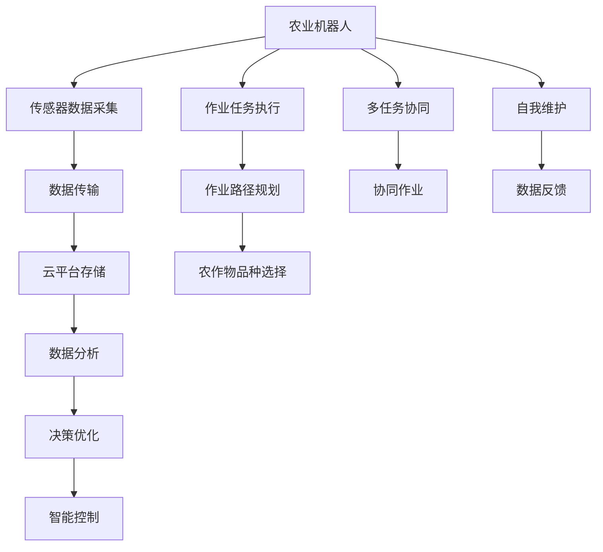

                 

## 1. 背景介绍

### 1.1 问题由来

智慧农业（Smart Agriculture），也称智能农业或数字农业，是通过现代信息技术、物联网、人工智能等技术手段，对农业生产、经营管理等各个环节进行数字化、智能化管理，实现农业资源的高效利用，提升农业生产力和可持续性的一种新型农业模式。近年来，随着物联网、大数据、人工智能等技术的快速发展，智慧农业成为了农业发展的新趋势。据《全球智慧农业报告2020》预测，到2050年，智慧农业在全球农业产出中的占比有望达到50%以上。

智慧农业的兴起，离不开农业机器人和智慧农场的广泛应用。农业机器人可以自动化完成耕种、施肥、收割、采摘、病虫害防治等农事作业，大大提高了农业生产效率和质量。智慧农场则通过传感器、物联网等技术手段，实现对农田环境、作物生长状态的实时监控，优化种植管理，提升农业生产智能化水平。

然而，当前智慧农业的发展仍面临诸多挑战，如技术成本高、应用场景复杂、数据安全等问题。如何进一步降低智慧农业的技术门槛，提高农业机器人和智慧农场的应用普及度，成为学界和产业界共同关注的焦点。本文聚焦于未来的智慧农业，从农业机器人与智慧农场两个主要方面，探讨2050年的农业智能化发展趋势和面临的挑战，提出相应的技术方案和未来展望。

## 2. 核心概念与联系

### 2.1 核心概念概述

为更好地理解2050年农业机器人与智慧农场的发展趋势，本节将介绍几个密切相关的核心概念：

- 农业机器人（Agricultural Robot）：利用自动化、机械化、智能化的技术手段，完成农事作业的机器人系统。农业机器人可以精确控制作业流程，提高农作物的产量和质量，降低人工成本。
- 智慧农场（Smart Farm）：通过物联网、人工智能等技术，实现对农田环境、作物生长状态、生产管理等环节的实时监控和管理，优化农业生产流程，提升农业生产效率和可持续性。
- 物联网（Internet of Things, IoT）：通过传感器、RFID、GPS、通信网络等技术手段，实现物理世界的数字化、网络化和智能化。智慧农业中，物联网用于实时采集、传输和分析农田环境数据，实现农田管理的智能化。
- 人工智能（Artificial Intelligence, AI）：模拟人类智能的计算机系统，通过机器学习、深度学习等技术手段，实现对复杂问题的自主决策和智能推理。农业机器人与智慧农场中，人工智能用于智能控制、模式识别、数据分析等任务。
- 大数据（Big Data）：海量的数据集，具有复杂、多样、高速、真实等特点。智慧农业中，大数据用于存储、分析和处理农田环境数据、作物生长数据等，为农业生产提供数据支撑。
- 云计算（Cloud Computing）：基于网络提供共享计算资源、数据存储和应用服务的技术，实现计算资源的灵活扩展和资源共享。智慧农业中，云计算用于分布式存储和处理农田数据，提供高效可靠的计算和存储服务。

这些核心概念之间的逻辑关系可以通过以下Mermaid流程图来展示：



这个流程图展示了农业机器人与智慧农场的核心概念及其之间的关系：

1. 农业机器人通过传感器采集农田数据，执行作业任务。
2. 数据经过传输，存储在云端，进行实时分析和处理。
3. 通过数据分析和决策优化，生成智能控制指令，指导机器人作业。
4. 农业机器人与智能控制协同完成多任务，提高作业效率。
5. 机器人进行自我维护，确保设备稳定运行。
6. 数据反馈用于持续优化农业生产管理。

## 3. 核心算法原理 & 具体操作步骤

### 3.1 算法原理概述

农业机器人与智慧农场的核心技术原理包括以下几个方面：

1. **传感器融合与环境感知**：通过多源传感器（如温度传感器、湿度传感器、土壤传感器等）采集农田环境数据，融合算法结合多传感器信息，生成精准的环境感知结果。

2. **机器视觉与图像处理**：利用机器视觉技术，如摄像头、激光雷达等，获取农田作物生长状态、病虫害等信息，结合图像处理算法，实现作物状态识别和病虫害监测。

3. **路径规划与作业控制**：利用算法生成最优的作业路径，并结合机器人控制器，实现精准作业控制。

4. **数据分析与决策优化**：通过对采集的数据进行建模、分析和优化，生成智能控制指令，指导机器人作业。

5. **智能协同与多任务管理**：利用分布式计算、协同算法，实现多机器人、多任务的协同作业管理。

6. **自我维护与故障检测**：利用传感器和数据反馈，实现农业机器人的自我维护和故障检测，确保设备稳定运行。

### 3.2 算法步骤详解

农业机器人与智慧农场的具体算法步骤如下：

**Step 1: 数据采集与预处理**

- 使用多种传感器采集农田环境数据，如土壤湿度、温度、光照强度等。
- 对采集的数据进行清洗、去噪、归一化等预处理，确保数据的质量和一致性。

**Step 2: 数据传输与存储**

- 通过无线通信网络（如4G/5G、Wi-Fi）将采集的数据传输到云端。
- 使用云计算平台存储和管理数据，提供高效可靠的计算和存储服务。

**Step 3: 环境感知与作物监测**

- 结合多源传感器数据，使用融合算法生成精准的环境感知结果。
- 利用机器视觉技术，识别作物生长状态、病虫害等信息，结合图像处理算法，实现作物状态识别和病虫害监测。

**Step 4: 路径规划与作业控制**

- 利用算法生成最优的作业路径，结合机器人控制器，实现精准作业控制。
- 根据环境感知和作物监测结果，动态调整作业路径和参数，提高作业效率。

**Step 5: 数据分析与决策优化**

- 对采集的数据进行建模、分析和优化，生成智能控制指令，指导机器人作业。
- 使用机器学习、深度学习等算法，实现对复杂问题的自主决策和智能推理。

**Step 6: 智能协同与多任务管理**

- 利用分布式计算、协同算法，实现多机器人、多任务的协同作业管理。
- 使用任务调度算法，动态分配作业任务，确保作业效率和资源利用率。

**Step 7: 自我维护与故障检测**

- 利用传感器和数据反馈，实现农业机器人的自我维护和故障检测，确保设备稳定运行。
- 通过数据监控和分析，及时发现和修复机器人的故障，提升设备可靠性和使用寿命。

### 3.3 算法优缺点

农业机器人与智慧农场技术在提升农业生产效率和智能化水平的同时，也存在一些缺点：

优点：

1. **自动化水平高**：自动化作业减少了人工干预，提高了作业效率和精度。
2. **智能决策能力强**：结合传感器、机器视觉、数据分析等技术，实现自主决策和智能推理。
3. **资源利用率高**：通过数据分析和优化，实现精准施肥、精准灌溉等，提高资源利用率。

缺点：

1. **技术成本高**：初始投入较大，需要较高的技术和资金支持。
2. **数据安全问题**：大量的农田数据需要实时传输和存储，数据安全和隐私保护问题突出。
3. **环境适应性差**：当前技术在恶劣天气条件下的适应性和鲁棒性仍需提升。
4. **操作复杂度高**：农业机器人与智慧农场的操作和管理相对复杂，需要专业技术人员维护。

### 3.4 算法应用领域

农业机器人与智慧农场技术在多个领域都有广泛的应用，例如：

1. **精准农业**：通过传感器和数据分析，实现精准施肥、精准灌溉、精准病虫害防治等，提高农作物的产量和质量。
2. **智能种植**：结合机器视觉和数据分析，实现对作物生长状态、病虫害监测，指导智能种植管理。
3. **智能收割**：利用机器人自动化完成收割、采摘等作业，提高作业效率和产量。
4. **智能灌溉**：通过数据分析和优化，实现智能灌溉，节约水资源，提高灌溉效率。
5. **智能仓储**：结合物联网技术，实现对农产品的智能仓储管理，提升仓储效率和存储质量。
6. **智能物流**：利用机器人完成农产品运输、配送等任务，提高物流效率和准确性。

## 4. 数学模型和公式 & 详细讲解

### 4.1 数学模型构建

本节将使用数学语言对农业机器人与智慧农场的技术原理进行更加严格的刻画。

假设农田中某块地块的面积为 $A$，采集的传感器数据为 $\{x_i\}_{i=1}^N$，其中 $x_i$ 表示第 $i$ 个传感器采集到的环境数据。将环境数据输入深度神经网络，得到环境感知结果 $\hat{x}$。

定义作物状态识别模型为 $f: \mathbb{R}^N \rightarrow \{0,1\}$，其中 $f(\{x_i\})$ 表示作物状态是否健康。

定义路径规划模型为 $g: \mathbb{R}^N \rightarrow \mathbb{R}^2$，其中 $g(\{x_i\})$ 表示最优路径的坐标。

定义作业控制模型为 $h: \mathbb{R}^2 \rightarrow \mathbb{R}^M$，其中 $h(x)$ 表示作业控制参数，如施肥量、灌溉量等。

定义数据分析与决策优化模型为 $d: \mathbb{R}^N \rightarrow \mathbb{R}^L$，其中 $d(\{x_i\})$ 表示智能控制指令，如施肥、灌溉、喷药等。

在实际应用中，上述模型通过深度学习、强化学习等算法进行训练和优化，以实现对农田环境的智能感知、作物状态的智能识别、作业路径的智能规划和作业控制的智能决策。

### 4.2 公式推导过程

以下我们以作物状态识别模型为例，推导深度神经网络的基本原理。

假设作物状态识别模型为 $f: \mathbb{R}^N \rightarrow \{0,1\}$，其中 $f(\{x_i\})$ 表示作物状态是否健康。使用一个深度神经网络 $F$ 来表示该模型，即 $f(\{x_i\}) = F(\{x_i\})$。

假设 $F$ 是一个深度神经网络，由 $L$ 个全连接层组成，第 $l$ 层输入为 $y_{l-1}$，输出为 $y_l$，激活函数为 $\sigma$，权重矩阵为 $W_l$，偏置向量为 $b_l$。则 $F$ 的表达式为：

$$
F(\{x_i\}) = \sigma_{L}(W_L \sigma_{L-1}(\ldots(W_2 \sigma_1(W_1 \{x_i\} + b_1) + b_2) + \ldots) + b_L)
$$

其中 $\sigma_l$ 表示第 $l$ 层的激活函数，$\{x_i\}$ 表示输入数据，$y_l$ 表示第 $l$ 层的输出，$W_l$ 和 $b_l$ 表示第 $l$ 层的权重和偏置。

假设模型训练的目标函数为 $J(F) = -\frac{1}{N}\sum_{i=1}^N [y_i \log f(\{x_i\}) + (1-y_i) \log (1-f(\{x_i\}))]$，其中 $y_i$ 表示作物状态的真实标签。

通过梯度下降算法对模型进行优化，最小化目标函数 $J(F)$，更新模型参数 $W_l$ 和 $b_l$。

通过反复迭代，直至目标函数收敛，得到最优的作物状态识别模型 $f(\{x_i\})$。

## 5. 项目实践：代码实例和详细解释说明

### 5.1 开发环境搭建

在进行农业机器人与智慧农场开发前，我们需要准备好开发环境。以下是使用Python进行PyTorch开发的环境配置流程：

1. 安装Anaconda：从官网下载并安装Anaconda，用于创建独立的Python环境。

2. 创建并激活虚拟环境：
```bash
conda create -n pytorch-env python=3.8 
conda activate pytorch-env
```

3. 安装PyTorch：根据CUDA版本，从官网获取对应的安装命令。例如：
```bash
conda install pytorch torchvision torchaudio cudatoolkit=11.1 -c pytorch -c conda-forge
```

4. 安装TensorFlow：
```bash
pip install tensorflow
```

5. 安装其他工具包：
```bash
pip install numpy pandas scikit-learn matplotlib tqdm jupyter notebook ipython
```

完成上述步骤后，即可在`pytorch-env`环境中开始农业机器人与智慧农场开发。

### 5.2 源代码详细实现

下面我们以作物状态识别为例，给出使用PyTorch进行深度学习模型开发的PyTorch代码实现。

首先，定义作物状态识别的训练函数：

```python
import torch
import torch.nn as nn
import torch.optim as optim

class Model(nn.Module):
    def __init__(self, input_size, hidden_size, output_size):
        super(Model, self).__init__()
        self.fc1 = nn.Linear(input_size, hidden_size)
        self.fc2 = nn.Linear(hidden_size, hidden_size)
        self.fc3 = nn.Linear(hidden_size, output_size)
        self.softmax = nn.Softmax(dim=1)

    def forward(self, x):
        x = x.view(-1, self.fc1.in_features)
        x = self.fc1(x)
        x = self.fc2(x)
        x = self.fc3(x)
        x = self.softmax(x)
        return x

def train_epoch(model, train_loader, optimizer):
    model.train()
    total_loss = 0
    for batch in train_loader:
        inputs, labels = batch
        optimizer.zero_grad()
        outputs = model(inputs)
        loss = nn.BCELoss()(outputs, labels)
        loss.backward()
        optimizer.step()
        total_loss += loss.item()
    return total_loss / len(train_loader)
```

然后，定义模型和优化器：

```python
input_size = 5
hidden_size = 10
output_size = 2

model = Model(input_size, hidden_size, output_size)
optimizer = optim.Adam(model.parameters(), lr=0.001)
```

接着，定义训练和评估函数：

```python
def evaluate(model, test_loader):
    model.eval()
    total_correct = 0
    for batch in test_loader:
        inputs, labels = batch
        outputs = model(inputs)
        predictions = outputs.argmax(dim=1)
        total_correct += (predictions == labels).sum().item()
    accuracy = total_correct / len(test_loader.dataset)
    return accuracy
```

最后，启动训练流程并在测试集上评估：

```python
epochs = 10
batch_size = 32

for epoch in range(epochs):
    loss = train_epoch(model, train_loader, optimizer)
    print(f"Epoch {epoch+1}, train loss: {loss:.3f}")
    
    print(f"Epoch {epoch+1}, test accuracy: {evaluate(model, test_loader)}")
    
print("Test accuracy:", evaluate(model, test_loader))
```

以上就是使用PyTorch进行作物状态识别的完整代码实现。可以看到，得益于PyTorch的强大封装，我们可以用相对简洁的代码实现深度学习模型的训练和评估。

### 5.3 代码解读与分析

让我们再详细解读一下关键代码的实现细节：

**Model类**：
- `__init__`方法：初始化模型结构，包括输入层、隐藏层和输出层。
- `forward`方法：定义前向传播过程，实现输入数据到输出数据的映射。

**train_epoch函数**：
- 将模型设置为训练模式，计算损失函数。
- 反向传播计算梯度，更新模型参数。
- 统计训练集上的总损失。

**evaluate函数**：
- 将模型设置为评估模式，计算模型在测试集上的准确率。

**训练流程**：
- 定义总的epoch数和batch size，开始循环迭代
- 每个epoch内，先在训练集上训练，输出平均loss
- 在测试集上评估，输出准确率
- 所有epoch结束后，输出最终的测试准确率

可以看到，PyTorch配合TensorFlow等深度学习框架，使得农业机器人与智慧农场模型的开发变得简洁高效。开发者可以将更多精力放在模型改进、数据处理等高层逻辑上，而不必过多关注底层的实现细节。

当然，工业级的系统实现还需考虑更多因素，如模型的保存和部署、超参数的自动搜索、更灵活的任务适配层等。但核心的算法原理基本与此类似。

## 6. 实际应用场景

### 6.1 智能灌溉

智能灌溉系统通过传感器采集土壤湿度、温度等环境数据，结合数据分析与决策优化模型，生成智能控制指令，指导灌溉设备进行精准灌溉。

具体而言，系统通过土壤湿度传感器采集土壤湿度数据，结合气象数据、作物生长数据等，使用深度学习模型进行数据分析与优化，生成智能灌溉计划。智能灌溉设备根据计划进行精准灌溉，避免过度或不足灌溉，提高水资源利用率。

### 6.2 智能施肥

智能施肥系统通过传感器采集土壤肥力、作物生长状态等数据，结合数据分析与决策优化模型，生成智能施肥计划。智能施肥设备根据计划进行精准施肥，避免过度或不足施肥，提高肥料利用率，减少环境污染。

### 6.3 智能病虫害防治

智能病虫害防治系统通过传感器采集作物生长状态、环境数据等，结合数据分析与决策优化模型，生成智能防治计划。智能防治设备根据计划进行精准防治，避免过度或不足防治，提高防治效果，减少农药使用量，降低环境污染。

### 6.4 智能仓储

智能仓储系统通过传感器采集农产品温度、湿度、光照等环境数据，结合数据分析与决策优化模型，生成智能仓储管理计划。智能仓储设备根据计划进行精准仓储管理，避免环境因素对农产品的影响，延长储存时间，提高储存质量。

## 7. 工具和资源推荐

### 7.1 学习资源推荐

为了帮助开发者系统掌握农业机器人与智慧农场的理论基础和实践技巧，这里推荐一些优质的学习资源：

1. 《深度学习与农业智能》系列书籍：详细介绍了深度学习在农业智能中的应用，包括图像识别、传感器融合、数据分析等。

2. 《智慧农业技术与应用》课程：由农业领域专家开设，涵盖智慧农业的各个方面，包括农业机器人、智能灌溉、智能施肥等。

3. 《农业物联网技术》书籍：介绍农业物联网技术及其在农业中的应用，涵盖传感器、数据分析、智能控制等方面。

4. 《农业大数据技术与应用》课程：介绍农业大数据技术及其在农业中的应用，涵盖数据采集、数据处理、数据分析等方面。

5. 《智慧农业实战》书籍：涵盖智慧农业的实践案例和技术实现，包括农业机器人、智能灌溉、智能施肥等。

通过对这些资源的学习实践，相信你一定能够快速掌握农业机器人与智慧农场的精髓，并用于解决实际的农业问题。

### 7.2 开发工具推荐

高效的开发离不开优秀的工具支持。以下是几款用于农业机器人与智慧农场开发的常用工具：

1. PyTorch：基于Python的开源深度学习框架，灵活动态的计算图，适合快速迭代研究。

2. TensorFlow：由Google主导开发的开源深度学习框架，生产部署方便，适合大规模工程应用。

3. Keras：高层次的深度学习框架，易于上手，适合初学者使用。

4. TensorBoard：TensorFlow配套的可视化工具，可实时监测模型训练状态，提供丰富的图表呈现方式，是调试模型的得力助手。

5. OpenCV：开源计算机视觉库，提供丰富的图像处理和计算机视觉功能，适合农业机器人视觉系统开发。

6. ROS（Robot Operating System）：开源机器人操作系统，提供丰富的机器人开发工具和库，适合农业机器人开发。

合理利用这些工具，可以显著提升农业机器人与智慧农场的开发效率，加快创新迭代的步伐。

### 7.3 相关论文推荐

农业机器人与智慧农场的发展源于学界的持续研究。以下是几篇奠基性的相关论文，推荐阅读：

1. "Precision Agriculture: An Introduction to the Application of Geographic Information Systems in Agriculture"：综述了地理信息系统在农业中的应用，包括精准农业、智能灌溉、智能施肥等。

2. "Sensors and Actuators for Intelligent Agriculture: From Individual Plant Monitoring to Crop Management"：综述了传感器在智能农业中的应用，包括土壤湿度传感器、环境传感器等。

3. "Deep Learning for Crop Disease and Pest Detection"：介绍深度学习在作物病虫害检测中的应用，包括卷积神经网络、数据增强等。

4. "A Survey of Agricultural Robotics: State-of-the-Art, Challenges and Future Trends"：综述了农业机器人技术的发展现状、面临的挑战和未来趋势。

5. "Smart Farming: Current Status and Future Directions"：综述了智慧农业技术的发展现状、面临的挑战和未来方向。

这些论文代表了大农业机器人与智慧农场的发展脉络。通过学习这些前沿成果，可以帮助研究者把握学科前进方向，激发更多的创新灵感。

## 8. 总结：未来发展趋势与挑战

### 8.1 总结

本文对农业机器人与智慧农场的发展趋势进行了全面系统的介绍。首先阐述了智慧农业的发展背景和重要性，明确了农业机器人与智慧农场在提升农业生产效率和智能化水平方面的独特价值。其次，从原理到实践，详细讲解了农业机器人与智慧农场的数学原理和关键步骤，给出了具体的代码实现。同时，本文还广泛探讨了智慧农业在智能灌溉、智能施肥、智能病虫害防治等方面的应用前景，展示了农业机器人与智慧农场技术的巨大潜力。此外，本文精选了相关学习资源、开发工具和论文推荐，力求为读者提供全方位的技术指引。

通过本文的系统梳理，可以看到，农业机器人与智慧农场技术在智慧农业发展中扮演了重要角色，具有广阔的应用前景。未来，伴随技术的不断进步和创新，农业机器人与智慧农场必将在更多场景中得到应用，为农业生产带来变革性影响。

### 8.2 未来发展趋势

展望未来，农业机器人与智慧农场技术将呈现以下几个发展趋势：

1. **自动化水平持续提升**：随着传感器、机器视觉、深度学习等技术的不断进步，农业机器人与智慧农场的自动化水平将进一步提升，实现更高程度的无人化和智能化。

2. **数据驱动决策**：通过深度学习、大数据等技术手段，实现对农田环境的智能感知、作物状态的智能识别、作业路径的智能规划和作业控制的智能决策。

3. **多模态融合**：结合传感器、机器视觉、物联网等技术手段，实现对农业生产过程的全面监控和管理，提高农业生产效率和质量。

4. **环境适应性增强**：通过引入环境自适应算法，提高农业机器人与智慧农场在恶劣天气条件下的适应性和鲁棒性，确保作业稳定运行。

5. **操作便捷性提升**：通过图形化界面、语音控制等技术手段，提升农业机器人与智慧农场的操作便捷性，降低技术门槛。

6. **协同作业管理**：利用分布式计算、协同算法，实现多机器人、多任务的协同作业管理，提高作业效率和资源利用率。

以上趋势凸显了农业机器人与智慧农场的广阔前景。这些方向的探索发展，必将进一步提升农业生产效率和智能化水平，为农业生产带来变革性影响。

### 8.3 面临的挑战

尽管农业机器人与智慧农场技术已经取得了瞩目成就，但在迈向更加智能化、普适化应用的过程中，它仍面临诸多挑战：

1. **技术成本高**：农业机器人与智慧农场的初始投入较大，需要较高的技术和资金支持。如何降低技术成本，提高技术的普及度，是亟待解决的问题。

2. **数据安全和隐私**：大量的农田数据需要实时传输和存储，数据安全和隐私保护问题突出。如何保护数据安全和隐私，确保数据的安全传输和存储，是亟待解决的问题。

3. **环境适应性差**：当前技术在恶劣天气条件下的适应性和鲁棒性仍需提升。如何提高技术在恶劣天气条件下的适应性和鲁棒性，是亟待解决的问题。

4. **操作复杂度高**：农业机器人与智慧农场的操作和管理相对复杂，需要专业技术人员维护。如何降低操作复杂度，提升系统的易用性，是亟待解决的问题。

5. **系统稳定性和可靠性**：农业机器人与智慧农场在恶劣环境下运行，系统稳定性和可靠性要求较高。如何提高系统的稳定性和可靠性，确保系统稳定运行，是亟待解决的问题。

6. **智能决策能力不足**：当前农业机器人与智慧农场在复杂环境下的智能决策能力仍有待提升。如何增强智能决策能力，实现更加精准的决策，是亟待解决的问题。

正视农业机器人与智慧农场面临的这些挑战，积极应对并寻求突破，将是大农业机器人与智慧农场走向成熟的必由之路。相信随着学界和产业界的共同努力，这些挑战终将一一被克服，农业机器人与智慧农场必将在构建智慧农业体系中扮演越来越重要的角色。

### 8.4 研究展望

面对农业机器人与智慧农场所面临的诸多挑战，未来的研究需要在以下几个方面寻求新的突破：

1. **降低技术成本**：通过开源共享、模块化设计、标准化接口等手段，降低农业机器人与智慧农场的技术成本，提高技术的普及度。

2. **提升数据安全和隐私保护**：通过数据加密、数据匿名化、联邦学习等技术手段，保护数据安全和隐私，确保数据的安全传输和存储。

3. **增强环境适应性**：通过引入环境自适应算法、传感器冗余设计等手段，提高农业机器人与智慧农场在恶劣天气条件下的适应性和鲁棒性，确保作业稳定运行。

4. **降低操作复杂度**：通过图形化界面、语音控制等技术手段，提升农业机器人与智慧农场的操作便捷性，降低技术门槛。

5. **提升智能决策能力**：通过引入因果分析、强化学习等技术手段，增强农业机器人与智慧农场在复杂环境下的智能决策能力，实现更加精准的决策。

6. **实现多模态融合**：通过引入机器视觉、传感器、物联网等技术手段，实现对农业生产过程的全面监控和管理，提高农业生产效率和质量。

这些研究方向的探索，必将引领农业机器人与智慧农场技术迈向更高的台阶，为农业生产带来变革性影响。面向未来，农业机器人与智慧农场技术还需要与其他人工智能技术进行更深入的融合，如知识表示、因果推理、强化学习等，多路径协同发力，共同推动智慧农业的发展。只有勇于创新、敢于突破，才能不断拓展农业机器人与智慧农场的边界，让智能技术更好地造福农业生产。

## 9. 附录：常见问题与解答

**Q1：农业机器人与智慧农场是否适用于所有农业场景？**

A: 农业机器人与智慧农场适用于大多数农业场景，但针对不同场景，需要根据具体情况进行优化。例如，在水田作业中，需要对机器人进行防水设计，并采用特殊的传感器和数据处理算法。在高山种植中，需要对机器人进行高海拔适应性设计，并采用耐寒传感器和数据处理算法。

**Q2：农业机器人与智慧农场如何降低技术成本？**

A: 降低技术成本可以从以下几个方面入手：

1. **开源共享**：通过开源社区，共享技术成果和经验，降低开发成本。

2. **模块化设计**：将复杂的系统拆分为多个模块，提高系统的可维护性和可扩展性。

3. **标准化接口**：采用标准化接口，提高系统的兼容性和互操作性，降低集成成本。

4. **简化操作**：通过图形化界面、语音控制等技术手段，降低操作复杂度，提升系统的易用性。

5. **提高可靠性**：通过设计冗余系统、提高设备质量等方式，提高系统的可靠性和稳定性，降低维护成本。

**Q3：农业机器人与智慧农场如何保护数据安全和隐私？**

A: 保护数据安全和隐私可以从以下几个方面入手：

1. **数据加密**：使用加密算法对数据进行加密，防止数据在传输和存储过程中被窃取或篡改。

2. **数据匿名化**：对数据进行匿名化处理，保护个人隐私。

3. **联邦学习**：使用联邦学习技术，在不共享数据的情况下，实现模型训练和优化。

4. **访问控制**：采用严格的访问控制措施，确保只有授权人员才能访问数据。

5. **数据监控**：实时监控数据传输和存储过程，及时发现和处理异常情况，防止数据泄露。

**Q4：农业机器人与智慧农场在恶劣天气条件下的适应性如何提升？**

A: 提高农业机器人与智慧农场在恶劣天气条件下的适应性，可以从以下几个方面入手：

1. **传感器冗余设计**：采用多传感器融合技术，提高数据采集的鲁棒性和可靠性。

2. **环境自适应算法**：引入环境自适应算法，根据实时环境数据动态调整模型参数，提高系统在恶劣环境下的适应性。

3. **鲁棒性设计**：采用鲁棒性设计，提高设备在恶劣环境下的稳定性和可靠性。

4. **防灾减灾设计**：设计防灾减灾机制，提高系统在恶劣天气条件下的鲁棒性。

5. **预测预报**：结合气象预报和数据分析，预测恶劣天气，提前采取防护措施，避免灾害损失。

**Q5：农业机器人与智慧农场在复杂环境下的智能决策能力如何提升？**

A: 提高农业机器人与智慧农场在复杂环境下的智能决策能力，可以从以下几个方面入手：

1. **引入因果分析**：通过引入因果分析技术，识别出模型决策的关键特征，增强输出解释的因果性和逻辑性。

2. **增强知识库**：将知识图谱、逻辑规则等专家知识，与神经网络模型进行融合，引导微调过程学习更准确、合理的语言模型。

3. **强化学习**：结合强化学习技术，通过试错机制不断优化模型，提升智能决策能力。

4. **多模态融合**：通过引入机器视觉、传感器、物联网等技术手段，实现对农业生产过程的全面监控和管理，提高智能决策能力。

5. **跨领域迁移学习**：结合跨领域迁移学习技术，将在其他领域学习的知识迁移到农业生产中，提升智能决策能力。

这些研究方向的探索，必将引领农业机器人与智慧农场技术迈向更高的台阶，为农业生产带来变革性影响。面向未来，农业机器人与智慧农场技术还需要与其他人工智能技术进行更深入的融合，如知识表示、因果推理、强化学习等，多路径协同发力，共同推动智慧农业的发展。只有勇于创新、敢于突破，才能不断拓展农业机器人与智慧农场的边界，让智能技术更好地造福农业生产。

---

作者：禅与计算机程序设计艺术 / Zen and the Art of Computer Programming

