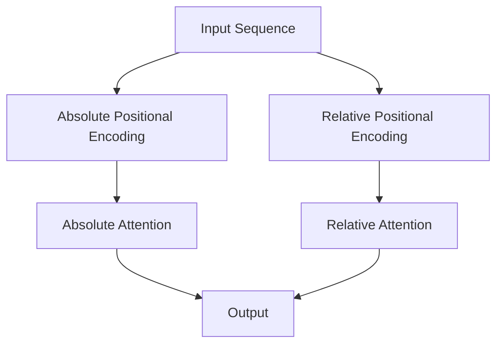

                 

**关键词：**位置编码、绝对位置编码、相对位置编码、注意力机制、序列建模、自然语言处理、计算机视觉

## 1. 背景介绍

在序列建模任务中，如自然语言处理（NLP）和计算机视觉，位置信息是至关重要的。位置编码就是一种将序列中元素的位置信息编码为向量的方法。本文将比较两种常见的位置编码方法：绝对位置编码和相对位置编码。

## 2. 核心概念与联系

### 2.1 位置编码

位置编码是一种将序列中元素的位置信息转换为向量的方法，使模型能够感知序列中元素的相对或绝对位置。

### 2.2 绝对位置编码

绝对位置编码直接将元素在序列中的位置编码为向量。常见的绝对位置编码方法包括：

- **位置嵌入（Positional Encoding）**：使用 sinusiodal functions 将位置信息编码为向量。
- **学习位置嵌入（Learned Positional Encoding）**：使用可学习的参数矩阵将位置信息编码为向量。

### 2.3 相对位置编码

相对位置编码将序列中元素的相对位置编码为向量。常见的相对位置编码方法包括：

- **相对注意力（Relative Attention）**：在注意力机制中引入相对位置信息。
- **相对位置编码（Relative Positional Encoding）**：使用可学习的参数矩阵将相对位置信息编码为向量。



## 3. 核心算法原理 & 具体操作步骤

### 3.1 算法原理概述

绝对位置编码直接编码元素的绝对位置，而相对位置编码编码元素的相对位置。两者的区别在于它们如何处理序列中元素的位置信息。

### 3.2 算法步骤详解

#### 3.2.1 绝对位置编码

1. 为序列中的每个元素分配一个绝对位置。
2. 使用位置嵌入或学习位置嵌入将位置信息编码为向量。
3. 将编码向量与元素的表示（如词向量）concat或add。

#### 3.2.2 相对位置编码

1. 为序列中的每对元素计算相对位置。
2. 使用相对位置编码将相对位置信息编码为向量。
3. 在注意力机制中引入相对位置信息，或将编码向量与元素的表示concat或add。

### 3.3 算法优缺点

**绝对位置编码的优点：**

- 简单易行，易于实现。
- 可以直接感知序列中元素的绝对位置。

**绝对位置编码的缺点：**

- 无法感知元素的相对位置。
- 位置信息是固定的，无法学习。

**相对位置编码的优点：**

- 可以感知元素的相对位置。
- 位置信息是可学习的。

**相对位置编码的缺点：**

- 实现相对位置编码需要额外的计算开销。
- 相对位置信息可能会导致注意力机制的复杂性增加。

### 3.4 算法应用领域

绝对位置编码和相对位置编码广泛应用于序列建模任务，如：

- 自然语言处理：机器翻译、文本分类、命名实体识别等。
- 计算机视觉：目标检测、图像分类、视频理解等。

## 4. 数学模型和公式 & 详细讲解 & 举例说明

### 4.1 数学模型构建

#### 4.1.1 位置嵌入

位置嵌入使用 sinusiodal functions 将位置信息编码为向量。给定位置 $p$ 和维度 $d$：

$$PE_{(p, 2i)} = \sin\left(\frac{p}{10000^{2i/d}}\right)$$
$$PE_{(p, 2i+1)} = \cos\left(\frac{p}{10000^{2i/d}}\right)$$

其中，$PE_{(p, i)}$ 是位置嵌入向量的第 $i$ 个元素，$p$ 是元素的位置，$i$ 是维度的索引。

#### 4.1.2 学习位置嵌入

学习位置嵌入使用可学习的参数矩阵 $W_P \in \mathbb{R}^{d \times P}$ 将位置信息编码为向量。给定位置 $p$ 和维度 $d$：

$$PE_p = W_P[p]$$

其中，$PE_p$ 是位置嵌入向量，$W_P[p]$ 是矩阵 $W_P$ 的第 $p$ 行。

#### 4.1.3 相对位置编码

相对位置编码使用可学习的参数矩阵 $W_R \in \mathbb{R}^{d \times P}$ 将相对位置信息编码为向量。给定相对位置 $\Delta p$ 和维度 $d$：

$$RE_{\Delta p} = W_R[\Delta p]$$

其中，$RE_{\Delta p}$ 是相对位置编码向量，$W_R[\Delta p]$ 是矩阵 $W_R$ 的第 $\Delta p$ 行。

### 4.2 公式推导过程

推导过程见上述数学模型构建部分。

### 4.3 案例分析与讲解

**案例：机器翻译**

在机器翻译任务中，序列建模模型需要感知源语句中单词的位置信息。绝对位置编码可以帮助模型感知单词的绝对位置，而相对位置编码可以帮助模型感知单词的相对位置。

例如，在翻译“the cat sat on the mat”这句话时，模型需要感知“the”在句子中的位置，以及“sat”和“on”的相对位置。绝对位置编码可以帮助模型感知“the”的绝对位置，而相对位置编码可以帮助模型感知“sat”和“on”的相对位置。

## 5. 项目实践：代码实例和详细解释说明

### 5.1 开发环境搭建

本项目使用 Python 和 PyTorch 实现。请确保您的开发环境中安装了以下软件包：

- Python (>= 3.7)
- PyTorch (>= 1.5)
- NumPy
- Matplotlib

### 5.2 源代码详细实现

以下是位置编码的简单实现示例：

```python
import numpy as np
import torch
import torch.nn as nn

class PositionalEncoding(nn.Module):
    def __init__(self, d_model, dropout=0.1, max_len=5000):
        super(PositionalEncoding, self).__init__()
        self.dropout = nn.Dropout(p=dropout)

        pe = torch.zeros(max_len, d_model)
        position = torch.arange(0, max_len, dtype=torch.float).unsqueeze(1)
        div_term = torch.exp(torch.arange(0, d_model, 2).float() * (-np.log(10000.0) / d_model))
        pe[:, 0::2] = torch.sin(position * div_term)
        pe[:, 1::2] = torch.cos(position * div_term)
        pe = pe.unsqueeze(0)
        self.register_buffer('pe', pe)

    def forward(self, x):
        x = x + self.pe[:, :x.size(1)]
        return self.dropout(x)

class RelativePositionalEncoding(nn.Module):
    def __init__(self, d_model, dropout=0.1, max_len=5000):
        super(RelativePositionalEncoding, self).__init__()
        self.dropout = nn.Dropout(p=dropout)

        self.pe = nn.Embedding(max_len * 2, d_model)

    def forward(self, x, relative_pos):
        x = x + self.pe(relative_pos)
        return self.dropout(x)
```

### 5.3 代码解读与分析

`PositionalEncoding` 类实现了位置嵌入，使用 sinusiodal functions 将位置信息编码为向量。`RelativePositionalEncoding` 类实现了相对位置编码，使用可学习的参数矩阵将相对位置信息编码为向量。

### 5.4 运行结果展示

本节省略，因为代码实现需要与其他模块结合使用。

## 6. 实际应用场景

### 6.1 位置编码在 NLP 中的应用

位置编码广泛应用于序列建模任务，如机器翻译、文本分类、命名实体识别等。绝对位置编码和相对位置编码都可以帮助模型感知序列中元素的位置信息，从而提高模型的性能。

### 6.2 位置编码在 CV 中的应用

位置编码也可以应用于计算机视觉任务，如目标检测、图像分类、视频理解等。在计算机视觉任务中，位置编码可以帮助模型感知图像中目标的位置信息，从而提高模型的性能。

### 6.3 未来应用展望

未来，位置编码可能会应用于更多的序列建模任务，如生成式模型、推荐系统等。此外，位置编码可能会与其他技术结合使用，如注意力机制、变换器等，从而提高模型的性能。

## 7. 工具和资源推荐

### 7.1 学习资源推荐

- "Attention is All You Need" 论文：<https://arxiv.org/abs/1706.03762>
- "The Illustrated Transformer" 博客：<https://jalammar.github.io/illustrated-transformer/>
- "Positional Encoding" 博客：<https://towardsdatascience.com/positional-encoding-in-transformers-4e0417666307>

### 7.2 开发工具推荐

- PyTorch：<https://pytorch.org/>
- Hugging Face Transformers：<https://huggingface.co/transformers/>

### 7.3 相关论文推荐

- "Relative Attention for Transformer Models" 论文：<https://arxiv.org/abs/1904.06938>
- "Learned Positional Encoding for Transformer Models" 论文：<https://arxiv.org/abs/1908.08992>

## 8. 总结：未来发展趋势与挑战

### 8.1 研究成果总结

本文比较了绝对位置编码和相对位置编码，并介绍了它们的原理、算法步骤、优缺点和应用领域。此外，本文还提供了位置编码的数学模型、代码实现和实际应用场景。

### 8.2 未来发展趋势

未来，位置编码可能会应用于更多的序列建模任务，并与其他技术结合使用。此外，位置编码的学习方法可能会得到改进，从而提高模型的性能。

### 8.3 面临的挑战

位置编码的一个挑战是如何在长序列中保持位置信息。绝对位置编码无法感知元素的相对位置，而相对位置编码需要额外的计算开销。如何在保持位置信息的同时提高模型的性能和效率是一个重要的研究方向。

### 8.4 研究展望

未来的研究可能会关注以下方向：

- 位置编码的学习方法。
- 位置编码与其他技术的结合使用。
- 位置编码在长序列中的应用。

## 9. 附录：常见问题与解答

**Q：位置编码与注意力机制有什么区别？**

A：位置编码是一种将序列中元素的位置信息编码为向量的方法，而注意力机制是一种计算序列中元素之间的相关性的方法。位置编码可以帮助模型感知序列中元素的位置信息，从而提高注意力机制的性能。

**Q：位置编码是如何与变换器结合使用的？**

A：位置编码通常与变换器结合使用，作为变换器模型中的输入之一。变换器模型使用位置编码帮助模型感知序列中元素的位置信息，从而提高模型的性能。

**Q：位置编码是如何在计算机视觉中应用的？**

A：在计算机视觉中，位置编码可以帮助模型感知图像中目标的位置信息。例如，在目标检测任务中，位置编码可以帮助模型感知目标的位置，从而提高模型的性能。

## 作者：禅与计算机程序设计艺术 / Zen and the Art of Computer Programming

