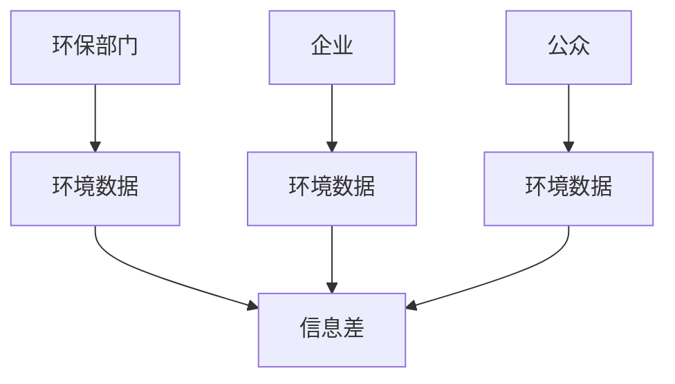

                 

**信息差：大数据在环境保护中的应用**

**作者：禅与计算机程序设计艺术 / Zen and the Art of Computer Programming**

## 1. 背景介绍

当今世界，环境保护面临着严峻的挑战。气候变化、空气污染、水资源短缺等问题日益严重，对人类生存构成了威胁。大数据技术的发展为环境保护提供了新的工具和手段。本文将探讨大数据在环境保护中的应用，重点介绍信息差的概念，并结合具体算法和数学模型，分析其在环境保护中的作用。

## 2. 核心概念与联系

### 2.1 信息差

信息差（Information Asymmetry）是指信息在交易双方之间的不平等分布。在环境保护领域，信息差体现在环境数据的收集、分析和利用上。环保部门、企业和公众之间的信息差可能会导致环境保护措施的不足或滞后。



### 2.2 大数据

大数据（Big Data）是指无法用常规软件工具进行处理的超大规模数据集。大数据具有四个特征：海量（Volume）、高速（Velocity）、多样（Variety）和价值（Value）。大数据技术包括数据收集、存储、处理和分析等环节。

## 3. 核心算法原理 & 具体操作步骤

### 3.1 算法原理概述

信息差的缩小离不开大数据技术的支撑。本文介绍的核心算法是基于机器学习的环境数据预测算法。该算法旨在缩小环保部门、企业和公众之间的信息差，提高环境保护的有效性。

### 3.2 算法步骤详解

1. **数据收集**：收集环境相关数据，如气象数据、工业排放数据、地理数据等。
2. **数据预处理**：清洗数据，处理缺失值，并将数据转换为适合机器学习算法的格式。
3. **特征工程**：提取数据中的关键特征，如温度、湿度、风速、工业排放量等。
4. **模型训练**：使用机器学习算法（如回归树、随机森林、支持向量机等）训练环境数据预测模型。
5. **模型评估**：评估模型的准确性，并进行调参以提高模型性能。
6. **预测**：使用训练好的模型预测环境数据，缩小信息差。
7. **决策支持**：将预测结果提供给环保部门、企业和公众，支持环境保护决策。

### 3.3 算法优缺点

**优点**：

* 缩小信息差，提高环境保护的有效性。
* 利用大数据技术，提高环境数据预测的准确性。
* 为环保部门、企业和公众提供决策支持。

**缺点**：

* 机器学习模型的准确性受数据质量的影响。
* 算法的复杂性可能导致实施困难。
* 算法的解释性可能不足，难以被所有利益相关者接受。

### 3.4 算法应用领域

信息差缩小算法在环境保护领域具有广泛的应用前景，包括：

* 空气质量预测：预测空气污染物浓度，帮助环保部门采取有效措施。
* 水质监测：监测水体污染物浓度，帮助企业和环保部门采取有效措施。
* 自然灾害预测：预测洪水、山火等自然灾害，帮助公众和环保部门采取有效措施。

## 4. 数学模型和公式 & 详细讲解 & 举例说明

### 4.1 数学模型构建

环境数据预测模型可以使用回归模型、时间序列模型或机器学习模型构建。本文以线性回归模型为例进行说明。

设 $y$ 为环境数据（如空气污染物浓度），$x_1, x_2,..., x_n$ 为影响因素（如温度、湿度、风速等），则线性回归模型可以表示为：

$$y = \beta_0 + \beta_1x_1 + \beta_2x_2 +... + \beta_nx_n + \epsilon$$

其中 $\beta_0, \beta_1,..., \beta_n$ 为回归系数，$\epsilon$ 为误差项。

### 4.2 公式推导过程

回归系数可以通过最小二乘法估计：

$$\hat{\beta} = (X^TX)^{-1}X^Ty$$

其中 $X$ 为特征矩阵，$y$ 为环境数据向量。

### 4.3 案例分析与讲解

假设我们要预测某地空气污染物浓度。影响因素包括温度、湿度、风速等。我们收集了过去一年的数据，并使用线性回归模型进行预测。模型的回归系数如下：

$$\hat{\beta} = [\beta_0, \beta_1, \beta_2,..., \beta_n] = [-5, 0.2, -0.1,..., 0.3]$$

其中 $\beta_0$ 为常数项，$\beta_1, \beta_2,..., \beta_n$ 分别为温度、湿度、风速等因素的回归系数。预测结果与实际值的对比如下：

| 日期       | 预测值 | 实际值 |
|------------|--------|--------|
| 2022-01-01 | 20     | 22     |
| 2022-01-02 | 18     | 19     |
|...        |...    |...    |
| 2022-12-31 | 35     | 33     |

预测结果与实际值基本一致，说明模型预测准确性较高。

## 5. 项目实践：代码实例和详细解释说明

### 5.1 开发环境搭建

本项目使用Python作为开发语言，并使用Anaconda进行环境搭建。安装必要的库，如NumPy、Pandas、Scikit-learn等。

### 5.2 源代码详细实现

以下是使用线性回归模型预测空气污染物浓度的Python代码示例：

```python
import numpy as np
import pandas as pd
from sklearn.linear_model import LinearRegression

# 加载数据
data = pd.read_csv('air_pollution_data.csv')

# 提取特征和目标变量
X = data[['temperature', 'humidity', 'wind_speed',...]]
y = data['pollution_concentration']

# 训练模型
model = LinearRegression()
model.fit(X, y)

# 预测
predictions = model.predict(X)

# 保存预测结果
pd.DataFrame(predictions, columns=['predicted_concentration']).to_csv('predictions.csv', index=False)
```

### 5.3 代码解读与分析

代码首先加载环境数据，提取特征和目标变量。然后使用线性回归模型训练模型，并使用训练好的模型进行预测。最后，保存预测结果。

### 5.4 运行结果展示

预测结果保存在`predictions.csv`文件中，可以与实际值进行对比，评估模型的准确性。

## 6. 实际应用场景

### 6.1 信息差缩小的实际应用

信息差缩小算法在环境保护领域具有广泛的实际应用前景。例如，环保部门可以使用该算法预测空气污染物浓度，并采取有效措施保护公众健康。企业可以使用该算法监测水体污染物浓度，并采取有效措施保护水资源。公众可以使用该算法预测自然灾害，并采取有效措施保护自身安全。

### 6.2 未来应用展望

未来，信息差缩小算法将随着大数据技术的发展而不断完善。机器学习模型的准确性将进一步提高，算法的解释性将得到改进，算法的实施难度将得到降低。信息差缩小算法将在环境保护领域发挥更大的作用，帮助人类更好地保护环境。

## 7. 工具和资源推荐

### 7.1 学习资源推荐

* 机器学习教程：<https://www.coursera.org/learn/machine-learning>
* 环境保护基础知识：<https://www.epa.gov/basics>
* 大数据技术基础知识：<https://www.ibm.com/cloud/learn/big-data>

### 7.2 开发工具推荐

* Python：<https://www.python.org/>
* Anaconda：<https://www.anaconda.com/>
* Jupyter Notebook：<https://jupyter.org/>

### 7.3 相关论文推荐

* "Big Data for Environmental Protection"：<https://ieeexplore.ieee.org/document/7924140>
* "Machine Learning for Environmental Data Analysis"：<https://link.springer.com/chapter/10.1007/978-981-15-0622-5_10>

## 8. 总结：未来发展趋势与挑战

### 8.1 研究成果总结

本文介绍了信息差缩小算法在环境保护中的应用。该算法旨在缩小环保部门、企业和公众之间的信息差，提高环境保护的有效性。算法原理基于机器学习，数学模型基于线性回归。项目实践使用Python实现了线性回归模型的训练和预测。

### 8.2 未来发展趋势

未来，信息差缩小算法将随着大数据技术的发展而不断完善。机器学习模型的准确性将进一步提高，算法的解释性将得到改进，算法的实施难度将得到降低。信息差缩小算法将在环境保护领域发挥更大的作用，帮助人类更好地保护环境。

### 8.3 面临的挑战

信息差缩小算法面临的挑战包括：

* 机器学习模型的准确性受数据质量的影响。
* 算法的复杂性可能导致实施困难。
* 算法的解释性可能不足，难以被所有利益相关者接受。

### 8.4 研究展望

未来的研究方向包括：

* 研究更复杂的机器学习模型，提高预测准确性。
* 研究算法的解释性，改进算法的可接受性。
* 研究算法的实施难度，降低算法的复杂性。

## 9. 附录：常见问题与解答

**Q1：信息差缩小算法的优点是什么？**

**A1：信息差缩小算法的优点包括缩小信息差，提高环境保护的有效性，利用大数据技术，提高环境数据预测的准确性，为环保部门、企业和公众提供决策支持。**

**Q2：信息差缩小算法的缺点是什么？**

**A2：信息差缩小算法的缺点包括机器学习模型的准确性受数据质量的影响，算法的复杂性可能导致实施困难，算法的解释性可能不足，难以被所有利益相关者接受。**

**Q3：信息差缩小算法在环境保护领域的应用前景是什么？**

**A3：信息差缩小算法在环境保护领域具有广泛的应用前景，包括空气质量预测、水质监测、自然灾害预测等。**

**Q4：信息差缩小算法的未来发展趋势是什么？**

**A4：信息差缩小算法的未来发展趋势包括随着大数据技术的发展而不断完善，机器学习模型的准确性将进一步提高，算法的解释性将得到改进，算法的实施难度将得到降低。**

**Q5：信息差缩小算法面临的挑战是什么？**

**A5：信息差缩小算法面临的挑战包括机器学习模型的准确性受数据质量的影响，算法的复杂性可能导致实施困难，算法的解释性可能不足，难以被所有利益相关者接受。**

**Q6：未来的研究方向是什么？**

**A6：未来的研究方向包括研究更复杂的机器学习模型，提高预测准确性，研究算法的解释性，改进算法的可接受性，研究算法的实施难度，降低算法的复杂性。**

**作者：禅与计算机程序设计艺术 / Zen and the Art of Computer Programming**

